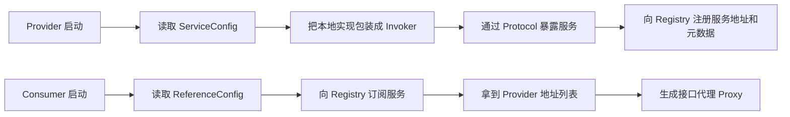
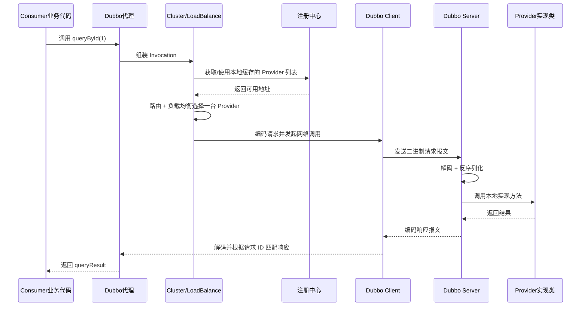
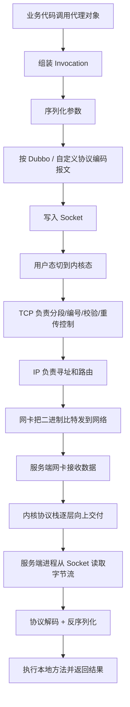

> 这篇笔记的目标，不只是解释一句“RPC 就是远程过程调用”，而是把 `RPC` 框架真正做的事情拆开：代理、服务发现、序列化、协议编码、网络传输、结果还原，以及负载均衡、容错、注册中心这些治理能力。

> 可以先用一句话概括：**RPC 框架 = 让一次远程调用在使用方式上看起来像本地方法调用，但在底层仍然要完成地址发现、协议封装、网络收发和响应还原。** 从这个角度看，“代理 + 找到 IP + 按协议封装请求”已经抓住了主干，但还缺少服务发现、请求关联和治理能力这些部分。

> 参考资料：
>
> [Apache Dubbo Docs](https://dubbo.apache.org/zh-cn/docs/)
>
> [gRPC Introduction](https://grpc.io/docs/what-is-grpc/introduction/)
>
> [知乎柳树 - 从零开始写 RPC 框架](https://zhuanlan.zhihu.com/p/36427583)
>
> [知乎易哥 - 既然有 HTTP 请求，为什么还要用 RPC 调用](https://www.zhihu.com/question/41609070/answer/1030913797)
>
> [51CTO - RPC 框架原理](https://developer.51cto.com/art/201906/597963.htm)

[TOC]

---

RPC 是一种调用思想或者说调用模型，不是单独的一种网络协议。只要目标是“像调用本地方法一样去调用远程服务”，都可以归到 RPC 这个范畴。比如 `Dubbo`、`gRPC`、`Thrift`，以及基于 `HTTP` 做接口代理的 `OpenFeign`，都可以看成不同实现方式下的 RPC。

RPC 并不天然比 HTTP “更快”，更准确的说法是：**很多 RPC 框架会使用更紧凑的二进制协议、更少的报文冗余、连接复用和更贴近方法调用的数据模型，因此在服务间内部调用场景里常常更高效。**

HTTP 是一种应用层协议；如果基于 HTTP 来实现 RPC，那么底层仍然遵循 HTTP 的请求响应语义。只是 RPC 框架会在“如何描述方法、参数、返回值，以及如何生成代理和处理调用链”这几个层面继续往上封装。

## 什么是RPC

**RPC（Remote Procedure Call 远程过程调用）** 分布式促使 RPC 诞生，RPC让分布式系统更加简单，让开发人员把精力放到业务上，并且提供高效安全的通信

它是一种通过网络从远程计算机程序上请求服务，而不需要了解底层网络技术的协议。也就是说两台服务器 A、B，一个应用部署在 A 服务器上，想要调用 B 服务器上应用提供的方法，由于不在一个内存空间，不能直接调用，需要通过网络来表达调用的语义和传达调用的数据，**就是要像调用本地的函数一样去调远程函数**

RPC 只是一种通信模式，和 http 并不冲突对立，相反http可以作为RPC传输数据的一种协议，把RPC当作一种模式和思想，才能更好地理解它

RPC 一种模式策略和框架，并不是单纯的通信协议

---

## 先抓主线：RPC 框架到底在做什么

如果把 RPC 框架只理解成“帮我发一个请求”，会低估它做的事情。它真正要解决的是：

1. 让业务代码按“调用本地方法”的方式去调用远程服务
2. 在分布式环境里找到可用服务实例，而不是把 IP/端口硬编码在代码里
3. 把“接口名、方法名、参数、超时、请求 ID”等信息编码成双方都能理解的协议
4. 通过网络把请求发出去，并且把响应正确地对应回原来的调用线程
5. 在多实例场景下提供负载均衡、超时、重试、熔断、监控等治理能力

可以先把 RPC 框架的核心理解概括为：

> 通过代理实现，找到对应的 IP 地址，根据协议封装请求对象

这个概括**已经比较接近**，但还要补上下面几个关键词：

- **代理**：让调用端写起来像本地方法调用
- **服务发现**：不直接写死 IP，而是从注册中心或服务目录里拿到实例列表
- **路由和负载均衡**：多个提供者时，要决定这次到底调哪一台
- **序列化和协议编码**：把方法调用转换成可传输的字节流
- **请求关联**：响应回来后，要通过请求 ID 找回原来的调用方
- **容错治理**：超时、重试、降级、限流、监控，不属于“能不能调通”，但属于“框架为什么有价值”

一次 RPC 调用可以先抽象成下面这条链路：


从这个角度看，**代理只是入口，不是 RPC 框架的全部。**

---

## RPC、HTTP、Dubbo、gRPC 到底是什么关系

这几个概念很容易混在一起，但它们并不在同一个层面：

| 名字 | 更准确的定位 | 作用 |
|:---|:---|:---|
| RPC | 调用模型 / 编程方式 | 目标是让远程调用看起来像本地调用 |
| HTTP | 应用层协议 | 定义请求行、Header、Body、状态码等传输语义 |
| TCP | 传输层协议 | 负责可靠传输，很多 RPC 框架最终都跑在 TCP 上 |
| Dubbo | RPC 框架 | 提供代理、注册发现、集群容错、协议扩展等能力 |
| Dubbo 协议 | Dubbo 默认的私有二进制协议 | 通常基于 TCP 长连接，报文更紧凑 |
| gRPC | RPC 框架 | 通常使用 `HTTP/2 + Protobuf` |
| Thrift | RPC 框架 / IDL 体系 | 提供接口定义、代码生成和多语言通信 |
| RMI | Java 原生 RPC 方案 | 更偏 Java 生态内部 |

更准确的理解可以概括为：

- `RPC` 不是和 `HTTP` 对立的东西
- `HTTP` 可以作为 RPC 的传输协议之一
- `Dubbo 协议` 不是“RPC 的唯一协议”，它只是 Dubbo 的一种实现方式
- 一个完整的 RPC 框架，通常是“代理 + 协议 + 序列化 + 传输 + 服务治理”的组合

常见组合大概是这样：

| 框架 / 方案 | 常见传输协议 | 常见序列化方式 | 特点 |
|:---|:---|:---|:---|
| 基于 Restful 的接口调用 | HTTP/1.1 | JSON | 通用性强，可读性好，但报文相对冗长 |
| gRPC | HTTP/2 | Protobuf | 跨语言好，IDL 清晰，流式能力强 |
| Dubbo 2 经典协议 | TCP | Hessian2 等 | 内部服务调用常见，性能和治理能力都比较强 |
| Dubbo 3 Triple | HTTP/2 | Protobuf | Dubbo 对 gRPC 生态的靠拢方案 |
| Thrift | TCP / HTTP | Binary / Compact Protocol | 适合多语言服务 |
| RMI | TCP | Java 对象序列化 | 简单直接，但更偏 Java 内部使用 |

可以把它们分成两层来看：

- **传输层问题**：到底走 TCP、HTTP/1.1、HTTP/2 还是别的通道
- **调用层问题**：怎么描述方法调用、怎么生成代理、怎么发现服务、怎么处理重试和负载均衡

很多文章容易把这两层混在一起，这也是为什么初学 RPC 时会觉得概念很绕。

---

## 方法调用

典型的 B/S 模型或者 C/S 模型都是客户端要调用服务端接口来获取数据和结果，这种属于外部调用

区别于外部调用，内部系统随着业务规模的扩大，出现了分布式和微服务，简单说就是把一个庞大的业务拆分成很多子服务，并且每个子服务都部署在很多独立分布的机器上，从而形成一个庞大的内部系统

**本地调用** 

假设调用函数 Multiply 来计算 lvalue * rvalue 的结果:

```java
int Multiply(int l, int r) {
    int y = l * r;
    return y;
}
 
int lvalue = 10;
int rvalue = 20;
int l_times_r = Multiply(lvalue, rvalue);
```

这是非常普通的本地函数调用，因为在同一个地址空间，或者说在同一块内存，所以通过方法栈和参数栈就可以实现

**远程调用**

当系统改造为分布式应用时，将很多可以共享的功能都单独抽出来，放到一个服务中，让别的服务去调用


但是 service A 中并没有 Service B 的 CalculatorImpl 实现类

- 可以模仿 B/S 架构的调用方式，在 Service B 中暴露一个 Restful 接口，然后 Service A 通过调用 Restful 接口间接的调用 CalculatorImpl 实现类的 add 方法

上述方法接近RPC，但如果是这样，那么每次调用时，都需要写以穿发起 http 请求的代码（ httpClient.sendRequest ）

而 RPC 远程过程调用需要像本地调用一样，去发起远程调用，让使用者感知不到远程调用的过程

- 代理模式，通过 Spring 注入 Calculator 对象，注入时，如果扫描到对象加了 @Reference 注解，那么久生成一个代理对象，将这个代理对象放进容器中。在代理对象的内部，就是通过 httpClient 来实现 RPC 远程过程调用

上述方法就是很多 RPC 框架要解决的问题和解决思路，比如 Dubbo

在本地调用时需要有：

- 确定的类或函数
- 类或函数的参数
- 类或函数的返回值


远程调用肯定也不会缺少这三要素，唯一的区别在于这三要素是要被传输过去的，这其中就涉及协议编码和解码的过程

Service A 需要通过网络传输来告诉 Service B，它想要 add 函数，传入的两个参数分别是 3 和 5 ，返回的结果放在 result 里面就可以


传输的报文里面按照约定的协议格式给出了函数名和参数，大致这样：


> 上述的编码只是一种举例不代表实际应用，为了提高传输效率可以进行二进制编码（只有二进制数据才能在网络中传输）

**总结：** RPC需要解决的两个问题：

1. 解决分布式系统中，服务之间的调用问题
2. 远程调用时，要能够像本地调用一样方便，让调用者感知不到远程调用的逻辑

如果把框架层能力也算上，还可以继续补三点：

3. 服务实例地址不能靠人工维护，需要服务发现和注册中心
4. 多个服务实例下，需要路由、负载均衡和容错策略
5. 调用结果需要和原请求一一对应，需要请求 ID、超时控制和响应还原

---

## 用 Dubbo 看一次完整流程

如果把 `Dubbo` 当成一个具体例子，RPC 的抽象过程会更容易理解。整个过程可以拆成两个阶段：

1. **服务启动阶段**：提供者暴露服务，消费者订阅服务
2. **正式调用阶段**：消费者拿着代理对象发起远程调用

### 1. 服务启动阶段



这个阶段完成后，消费者手里虽然拿到的是一个接口代理，但它背后其实已经关联了：

- 服务接口名
- 注册中心返回的服务列表
- 集群容错策略
- 负载均衡策略
- 通信协议和序列化方式

### 2. 一次真实调用阶段

下面以消费者调用 `userService.queryById(1)` 为例：



这张时序图主要体现了 4 个关键点：

- **对业务方透明**：业务代码只看到接口调用，看不到底层网络细节
- **对框架方明确**：框架内部其实一直在处理 `Invocation -> 编码 -> 网络收发 -> 解码 -> Result`
- **对地址解耦**：消费者不是把 IP 写死，而是通过注册中心订阅和缓存服务列表
- **对集群友好**：多实例下不是“直接连某台机器”，而是先经过集群容错和负载均衡

### 3. Dubbo 里几个容易混淆的对象

`Proxy`、`Invoker`、`Exporter` 这些对象名称很容易混淆，可以先按下面的方式理解：

| 对象 | 可以先怎么理解 | 作用 |
|:---|:---|:---|
| Proxy | 给业务方用的“假实现” | 让接口调用呈现为本地方法调用的使用方式 |
| Invocation | 一次调用的描述对象 | 里面会带方法名、参数、附件等信息 |
| Invoker | 可执行调用的统一抽象 | 不管本地、远程、集群，最终都抽象成它 |
| Exporter | 被暴露出去的服务包装 | 主要站在服务提供者一侧 |
| Directory | 服务列表目录 | 管理某个接口当前有哪些可用 Invoker |
| Cluster | 集群容错入口 | 失败重试、快速失败等都在这里决定 |
| LoadBalance | 负载均衡策略 | 决定这次请求落到哪一个 Provider |

如果只保留主线，可以记成：

`接口 -> Proxy -> Invocation -> Invoker -> Protocol -> Transport -> Provider`

### 4. Dubbo 协议在这里扮演什么角色

以经典 `Dubbo` 协议为例，它主要解决的是“**请求报文怎么定义**”这个问题。通常会包括：

- 魔法数，用来识别这是 Dubbo 报文
- 请求还是响应
- 是否双向通信、是否心跳
- 序列化方式编号
- 请求 ID
- 方法调用需要的元数据，比如接口名、方法名、参数类型、参数值

也就是说，`Dubbo 协议` 不是在决定“要不要调用这个服务”，它决定的是“**调用已经发生时，这个请求和响应如何在网络里表达**”。

---

## 协议确定之后，请求是怎么传出去的

前面提到“代理、服务发现、协议封装”，但一次 RPC 调用真正落到网络里，还需要再回答一个问题：

**当协议已经选定之后，请求到底是怎么从当前进程发到远端机器上的？**

这个问题不能只回答“走网络传输”，还要把它拆到网络分层里看。

### 1. 先分清：RPC、HTTP、Dubbo 协议分别处在哪一层

如果按常见的 TCP/IP 分层模型来看，可以先粗略理解成这样：

| 层次 | 典型内容 | 在 RPC 调用里的角色 |
|:---|:---|:---|
| 应用层 | RPC 协议、HTTP、HTTP/2、Dubbo 协议、gRPC、序列化协议 | 定义报文格式、方法名、参数、响应体怎么表示 |
| 传输层 | TCP、UDP | 负责端到端传输、可靠性、重传、流量控制、端口 |
| 网络层 | IP | 负责从源 IP 把数据送到目标 IP |
| 数据链路层 | Ethernet、Wi-Fi | 负责同一跳链路上的帧传输 |
| 物理层 | 网线、光纤、电磁信号 | 负责把比特真正发出去 |

所以：

- `RPC` 更像调用模型，本身不是网络分层里的某一层协议
- `Dubbo 协议`、`HTTP`、`gRPC` 这些，主要都落在**应用层**
- `TCP` 是**传输层**
- `IP` 是**网络层**

这也是为什么“RPC 是跑在网络上的”，但不能简单说“RPC 就是传输层协议”。准确一点的说法应该是：

> `RPC` 框架在应用层定义调用语义和报文格式，再借助底层传输通道把数据送出去；这个通道可能是 `TCP`、`UDP`，也可能是基于 `TCP` 之上的 `HTTP/2`。

### 2. 以基于 TCP 的 RPC 调用为例

假设现在已经确定使用：

- 传输协议：`TCP`
- RPC 协议：`Dubbo 协议`
- 序列化方式：例如 `Hessian2` 或 `Protobuf`

那么一次调用在客户端侧大致会经历下面几步：



这个过程里最核心的分工是：

- **RPC 框架负责“把调用翻译成报文”**
- **操作系统协议栈负责“把报文送到对端”**

也就是说，RPC 框架一般不会自己去实现 TCP/IP 协议栈，而是调用操作系统提供的 `Socket API`，把编码后的字节流交给内核。

### 3. Socket 在这里到底是什么

很多资料会说“RPC 底层就是 Socket 通信”，这个说法不算错，但容易过于简化。

`Socket` 可以先理解成：

- 应用程序和操作系统网络协议栈之间的一个编程接口
- 应用层进程收发网络数据时最常见的入口

客户端并不是直接操作网卡，也不是直接去“手写 TCP 包”。通常做法是：

1. 创建 Socket
2. 连接到目标 IP 和端口
3. 把 RPC 编码后的字节写入 Socket 发送缓冲区
4. 由操作系统内核负责后续的 TCP/IP 处理

服务端也是类似：

1. 监听某个端口
2. 接收客户端连接
3. 从 Socket 读取字节流
4. 按照约定好的 RPC 协议解码
5. 执行本地方法后再把响应写回 Socket

因此，`Socket` 更像“**应用程序使用网络能力的门把手**”，而不是完整传输机制本身。

### 3.1 工程实现里常见的 NIO / Netty 在做什么

上面说的是原理分层；如果落到 Java 工程实现，很多 RPC 框架不会直接手写最底层阻塞式 Socket，而是建立在：

- `Java NIO`
- `Netty`

之类的网络通信框架之上。

它们主要解决的是“**如何更高效地管理大量连接和收发事件**”，比如：

- 用非阻塞 I/O 减少线程被读写操作长期卡住
- 用 `Selector` 或事件循环监听多个连接上的可读、可写事件
- 维护连接、编解码器、心跳、线程模型
- 把业务线程和 I/O 线程分开，避免网络线程被业务逻辑拖慢

所以从工程实现角度看，很多 RPC 框架的底层路径可以再细化成：

> 代理对象 -> 编码器 / 序列化器 -> Netty / NIO -> Socket -> 内核 TCP/IP 协议栈 -> 网络

这也是为什么在 Dubbo、gRPC、Thrift 这类框架里，除了“协议设计”之外，I/O 模型和线程模型也会显著影响吞吐量与延迟。

### 4. 数据到了传输层以后，TCP 具体做什么

如果 RPC 走的是 `TCP`，那么 RPC 框架把字节流交给 Socket 之后，后面的很多事就交给 TCP 了。TCP 主要负责：

- 建立连接，典型就是三次握手
- 把大的字节流切成适合传输的报文段
- 为每个报文段编号，保证有序到达
- 通过 ACK、重传、超时机制保证可靠传输
- 通过滑动窗口、流量控制、拥塞控制避免把链路打爆

这也是为什么很多 RPC 框架偏爱 TCP：

- 不需要自己处理丢包重传
- 天然是面向连接的
- 更适合请求/响应式调用
- 长连接场景下可以减少频繁建连的开销

但这里也要注意一点：

**TCP 只保证字节流可靠送达，不理解“这是一个 RPC 请求”这层语义。**

对 TCP 来说，它看到的只是连续字节；至于哪一段字节代表：

- 请求头
- 请求体
- 方法名
- 参数列表
- 返回值

这些都属于**应用层协议**要解决的问题。

### 5. 为什么还要做“协议头”和“消息边界”

因为 TCP 是**面向字节流**的，不是面向消息的。它不会天然告诉接收方：

- 这一批字节是不是一个完整请求
- 一个请求从哪里开始、到哪里结束
- 当前收到的是请求还是响应

所以 RPC 协议通常都会在应用层自己定义报文结构。例如：

- 魔法数：识别这是不是本协议的包
- 消息长度：告诉接收方这一帧总共有多长
- 请求 ID：把响应匹配回对应调用
- 序列化类型：告诉接收方该怎么反序列化
- 消息类型：请求、响应、心跳、异常

这类机制本质上是在解决两个问题：

1. **拆包 / 粘包之后，怎么重新切出完整消息**
2. **拿到完整消息之后，怎么知道该按什么规则解析**

所以“RPC 是怎么把数据传过去的”这个问题，不能只回答“通过 TCP”，还必须补一句：

> 通过 TCP 传输的是字节流，而 RPC 协议负责给这些字节流定义结构、边界和语义。

### 6. 到了网络层和链路层，又发生了什么

在 TCP 之下，数据还会继续往下走：

- `IP` 负责目标地址寻址和路由选择
- 链路层负责把 IP 包封装成帧，在当前链路上传输
- 网卡把帧转换成电信号、光信号或无线信号发出去

到了服务端之后，过程再反过来：

1. 网卡收到比特流
2. 交给内核网络协议栈
3. 链路层解帧
4. 网络层处理 IP
5. 传输层处理 TCP
6. 把字节流放到目标 Socket 对应的接收缓冲区
7. 服务端进程从 Socket 读取数据
8. RPC 框架完成解码、反序列化和方法调用

也就是说，**网络层和链路层主要负责“送达”，应用层主要负责“看懂”。**

### 7. 如果走 HTTP 或 HTTP/2，机制有什么不同

如果 RPC 选择的是基于 `HTTP` 或 `HTTP/2` 的方案，比如：

- 基于 `HTTP/1.1 + JSON` 的接口调用
- `gRPC` 的 `HTTP/2 + Protobuf`
- `Dubbo3 Triple` 的 `HTTP/2 + Protobuf`

那么底层数据仍然要经过：

- Socket
- 操作系统协议栈
- TCP
- IP

差别主要不在“有没有经过传输层”，而在**应用层协议长什么样**：

- `HTTP/1.1` 有请求行、Header、Body
- `HTTP/2` 引入二进制帧、多路复用、Header 压缩
- `Dubbo` 私有协议会更贴近方法调用模型，报文通常更紧凑

所以，`HTTP RPC` 和 `Dubbo RPC` 的根本差异，不是一个“走网络层”、一个“走传输层”，而是：

- 应用层协议格式不同
- 报文冗余程度不同
- 连接复用能力不同
- 对服务治理、流式通信、多语言生态的支持重点不同

### 8. 一次请求返回时，为什么能回到原来的调用方

客户端发起 RPC 调用后，通常不会只是“把数据发出去”就结束。框架还会记录：

- 请求 ID
- 超时时间
- Future / Promise 或回调对象
- 当前连接和目标节点信息

服务端响应回来后，客户端会：

1. 先按协议解码出响应对象
2. 读取其中的请求 ID
3. 用请求 ID 找到本地等待中的 Future
4. 唤醒阻塞线程，或者回调异步逻辑

所以，**“方法调用像本地”只是表象，底层实际上是在做一次带请求 ID 关联的网络请求响应匹配。**

### 9. 用一句话收束这部分

从机制上看，一次 RPC 请求的传递过程可以概括为：

> 业务调用先在应用层被 RPC 框架转换成协议报文，再通过 Socket 交给操作系统；随后由传输层的 TCP、网络层的 IP 和链路层共同把数据送到远端；对端收到字节流后，再由 RPC 框架按协议解码、反序列化并执行本地方法。

因此，RPC 既不是单纯的“网络层能力”，也不是单纯的“传输层能力”，而是：

- **应用层定义调用语义**
- **传输层保证端到端传输**
- **网络层负责寻址和路由**
- **链路层和物理层负责真正把数据送出去**

---

## 如何实现一个RPC


以左边的 Client 端为例，Application就是 RPC 的调用方，Client Stub 就是我们上面说到的代理对象，也就是那个看起来像是 Calculator 的实现类，其实内部是通过 RPC 方式来进行远程调用的代理对象，至于 Client Run-time Library，则是实现远程调用的工具包，比如 JDK 的 Socket，最后通过底层网络实现实现数据的传输

这个过程中最重要的就是序列化和反序列化了，因为数据传输的数据包必须是二进制的，直接丢一个Java对象过去，对方不认识，必须把 Java 对象序列化为二进制格式，传给Server端，Server端接收到之后，再反序列化为 Java 对象

> http 好比普通话， RPC 好比团队内部黑话
> 讲普通话，好处就是谁都能听得懂，谁都会讲
> 讲黑话，好处是可以更精简、更加保密、更加可定制，坏处是要求说黑话的另一方（ Client 端）也要懂

RPC 的核心功能主要由 5 个模块 **（客户端、客户端 Stub、网络传输模块、服务端 Stub、服务端）** 组成，如果想要自己实现一个 RPC，最简单的方式要实现三个技术点，分别是：

- 服务寻址
- 数据流的序列化和反序列化
- 网络传输

**服务寻址：** 

服务寻址可以使用 Call ID 映射。在本地调用中，函数体是直接通过函数指针来指定的，但是在远程调用中，函数指针是不行的，因为两个进程的地址空间是完全不一样的（不同机器）

所以在 RPC 中，所有的函数都必须有自己的一个 ID。这个 ID 在所有进程中都是唯一确定的

客户端在做远程过程调用时，必须附上这个 ID。然后我们还需要在客户端和服务端分别维护一个函数和 Call ID 的对应表

当客户端需要进行远程调用时，它就查一下这个表，找出相应的 Call ID，然后把它传给服务端，服务端也通过查表，来确定客户端需要调用的函数，然后执行相应函数的代码

实现方式：**服务注册中心**，要调用服务，首先需要一个服务注册中心去查询对方服务都有哪些实例。Dubbo 的服务注册中心是可以配置的，官方推荐使用 Zookeeper

实现案例：RMI ( Remote Method Invocation，远程方法调用 ) 也就是  RPC 本身的实现方式


- Registry(服务发现)：借助 JNDI 发布并调用了 RMI 服务。实际上，JNDI 就是一个注册表，服务端将服务对象放入到注册表中，客户端从注册表中获取服务对象

- RMI 服务在服务端实现之后需要注册到 RMI Server 上，然后客户端从指定的 RMI 地址上 Lookup 服务，调用该服务对应的方法即可完成远程方法调用

- Registry 是个很重要的功能，当服务端开发完服务之后，要对外暴露，如果没有服务注册，则客户端是无从调用的，即使服务端的服务就在那里

**数据流的序列化和反序列化：**

本地调用中，只需要把参数压到栈里，然后让函数自己去栈里读就行

但是在远程过程调用时，客户端跟服务端是不同的进程，不能通过内存来传递参数

这时候就需要客户端把参数先转成一个字节流，传给服务端后，再把字节流转成自己能读取的格式，从服务端返回的值也需要序列化反序列化的过程

只有二进制数据才能在网络中传输

- 将对象转换成二进制流的过程叫做序列化
- 将二进制流转换成对象的过程叫做反序列化

**网络传输**

网络传输：远程调用往往用在网络上，客户端和服务端是通过网络连接的

所有的数据都需要通过网络传输，因此就需要有一个网络传输层。网络传输层需要把 Call ID 和序列化后的参数字节流传给服务端，然后再把序列化后的调用结果传回客户端

只要能完成这两者的，都可以作为传输层使用。因此，它所使用的协议其实是不限的，能完成传输就行

大部分 RPC 框架都使用 TCP 协议，但其实 UDP 也可以，而 gRPC 干脆就用了 HTTP2

所以，要实现一个 RPC 框架，只需要把以下三点实现了就基本完成了：
- Call ID 映射：可以直接使用函数字符串，也可以使用整数 ID。映射表一般就是一个哈希表。
- 序列化反序列化：可以自己写，也可以使用 Protobuf 或者 FlatBuffers 之类的。
- 网络传输库：可以自己写 Socket，或者用 Asio，ZeroMQ，Netty 之类

RPC代码实现可参考[知乎柳树](https://zhuanlan.zhihu.com/p/36528189)

---

## 完整的 RPC 框架

RPC是一种内部服务框架，可以涉及服务注册、服务治理、服务发现、熔断机制、负载均衡等，其中“RPC 协议”就指明了程序如何进行网络传输和序列化


RPC协议模块是很重要的部分，这部分也是前面提到的 Service A 调用 Service B 时传输报文的过程


一个 RPC 的核心功能主要有 5 个部分组成，分别是：客户端、客户端 Stub、网络传输模块、服务端 Stub、服务端等


- 客户端( Client )：服务调用方
- 客户端存根( Client Stub )：存放服务端地址信息，将客户端的请求参数数据信息打包成网络消息，再通过网络传输发送给服务端
- 服务端存根( Server Stub )：接收客户端发送过来的请求消息并进行解包，然后再调用本地服务进行处理
- 服务端(Server)：服务的真正提供者
- Network Service：底层传输，可以是 TCP 或 HTTP

在网络消息传输中可以基于 TCP、UDP、http 来实现，各自都有各自的特点：

**TCP：**

基于 TCP 实现的 RPC 调用，能够灵活对协议字段进行定制，减少网络开销高性能，实现更大的吞吐量和并发数，但要关注底层细节，在进行数据解析时加复杂一些

由服务的调用方与服务的提供方建立 Socket 连接，并由服务的调用方通过 Socket 将需要调用的接口名称、方法名称和参数序列化后传递给服务的提供方，服务的提供方反序列化后再利用反射调用相关的方法

但是在实例应用中则会进行一系列的封装，如 RMI 便是在 TCP 协议上传递可序列化的 Java 对象

TCP 连接可以是按需连接(需要调用的时候就先建立连接，调用束后就立马断掉)，也可以是长连接(客户端和服务器建立起连接之后保持长期有，不管此时有无数据包的发送，可以配合心跳检测机制定期检测建立的连接否存活有效)，多个远程过程调用共享同一个连接

**HTTP：**

该方法更像是访问网页一样，只是它的返回结果更加单一简单

基于 HTTP 实现的 RPC 可以使用 JSON 和 XML 格式的请求或响应数据，解工具很成熟，在其上进行二次开发会非常便捷和简单。但是 HTTP 是上层议，所占用的字节数会比使用 TCP 协议传输所占用的字节数更高

由服务的调用者向服务的提供者发送请求，这种请求的方式可能是 GET、POST、PUT、DELETE 等中的一种，服务的提供者可能会根据不同的请求方式做出不同的处理，或者某个方法只允许某种请求方式

而调用的具体方法则是根据 URL 进行方法调用，而方法所需要的参数可能是对服务调用方传输过去的 XML 数据或者 JSON 数据解析后的结果，***返回 JOSN 或者 XML 的数据结果

由于目前有很多开源的 Web 服务器，如 Tomcat，所以其实现起来更加容易，就像做 Web 项目一样

---

## RPC Vs Restful

两者并不是一个维度的概念，总得来说RPC涉及的维度更广

可以从 url 风格上进行比较

```java
/queryOrder?orderId=123 // RPC

Get请求
/order?orderId=123 // Restful
/order/123 // Restful
```

RPC是面向过程，Restful是面向资源，并且使用了Http动词。从这个维度上看，Restful风格的url在表述的精简性、可读性上都要更好

## 既然有 HTTP 请求，为什么还要用 RPC 调用

HTTP协议，以其中的Restful规范为代表，其优势很大。它可读性好，且可以得到防火墙的支持、跨语言的支持。但是HTTP也有其缺点，这是与其优点相对应的。首先是有用信息占比少，毕竟HTTP工作在第七层，包含了大量的HTTP头等信息。其次是效率低，还是因为第七层的缘故。还有，其可读性似乎没有必要，因为我们可以引入网关增加可读性。此外，使用HTTP协议调用远程方法比较复杂，要封装各种参数名和参数值

而RPC则与HTTP互补


HTTP（图中蓝色框）出现了两次。其中一个是和RPC并列的，都是跨应用调用方法的解决方案；另一个则是被RPC包含的，是RPC通信过程的可选协议之一

标题的问题在于和 RPC 并列的比较

分布式系统中，因为每个服务的边界都很小，很有可能调用别的服务提供的方法。这就出现了 Service A 调用 Service B 中方法的需求，即远程过程调用

要想让 Service A 调用 Service B 中的方法，最先想到的就是通过HTTP请求实现。这是很常见的，例如 Service B 暴露 Restful 接口，然后让 Service A 调用它的接口。基于 Restful 的调用方式因为可读性好（ Service B暴露出的是 Restful 接口，可读性当然好）而且 HTTP 请求可以通过各种防火墙，因此非常不错

然而，如前面所述，基于Restful的远程过程调用有着明显的缺点，主要是效率低、封装调用复杂。当存在大量的服务间调用时，这些缺点变得更为突出

Service A 调用 Service B 的过程是应用间的内部过程，牺牲可读性提升效率、易用性是可取的。基于这种思路，RPC 产生了

通常，RPC要求在调用方中放置被调用的方法的接口。调用方只要调用了这些接口，就相当于调用了被调用方的实际方法，十分易用。于是，调用方可以像调用内部接口一样调用远程的方法，而不用封装参数名和参数值等操作

要实现像调用内部接口一样调用远程的方法：

- 首先，调用方调用的是接口，必须得为接口构造一个假的实现。显然，要使用动态代理。这样，调用方的调用就被动态代理接收到了
- 第二，动态代理接收到调用后，应该想办法调用远程的实际实现。这包括下面几步：

    - 识别具体要调用的远程方法的IP、端口
    - 将调用方法的入参进行序列化
    - 通过通信将请求发送到远程的方法中

- 远程的服务就接收到了调用方的请求。它应该：

    - 反序列化各个调用参数
    - 定位到实际要调用的方法，然后输入参数，执行方法
    - 按照调用的路径返回调用的结果


调用方调用内部的一个方法，但是被 RPC 框架偷梁换柱为远程的一个方法。之间的通信数据可读性不需要好，只需要 RPC 框架能读懂即可，因此效率可以更高。通常使用 UDP 或者 TCP 作为通讯协议，也可以使用 HTTP

> 简单RPC实现参考[git 作者 Developer Yee](https://github.com/yeecode/EasyRPC)


**总结：**

两者各有千秋。本质上，两者是可读性和效率之间的抉择，通用性和易用性之间的抉择。根据业务场景选择使用哪一种
