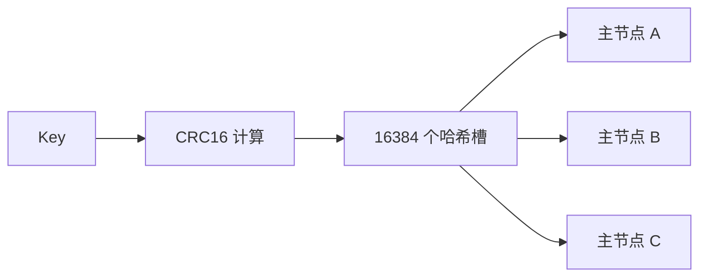
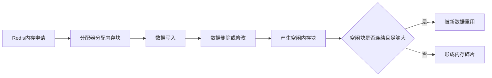
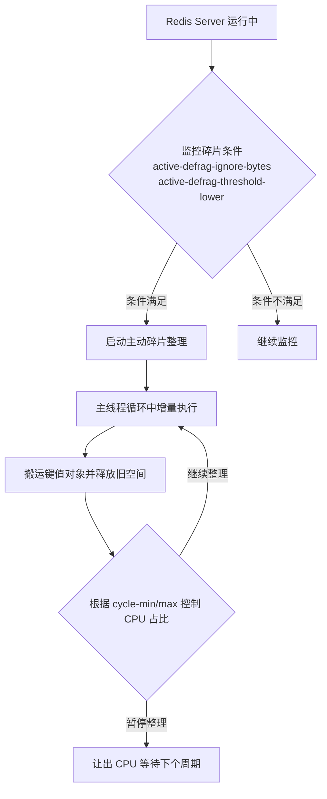

> 这篇笔记想解决的是“Redis 到底该怎么整体理解”这个问题。它不只罗列概念，而是把常见数据类型、性能来源、线程模型、事务、Lua、集群、扫描和内存碎片放到同一张图里，方便建立完整认知。

> 这篇笔记偏总览与关系梳理；数据结构和底层编码细节单独放到《redis数据结构》里。阅读时先抓住“Redis 对外提供什么能力”，再去看“这些能力底层靠什么结构支撑”。

> 参考资料：
>
> [Redis Data Types](https://redis.io/docs/latest/develop/data-types/)
>
> [Redis Transactions](https://redis.io/docs/latest/develop/interact/transactions/)
>
> [Redis Cluster](https://redis.io/docs/latest/operate/oss_and_stack/management/scaling/)
>
> [SCAN 命令文档](https://redis.io/commands/scan/)
>
> [Memory optimization](https://redis.io/docs/latest/operate/oss_and_stack/management/optimization/memory-optimization/)

[TOC]

---

## 1. Redis 是什么

Redis 全称是 `Remote Dictionary Server`。如果只把它理解成“缓存”，会低估它的能力；如果把它理解成“万能数据库”，又会高估它的边界。

更准确的说法是：Redis 是一个 **以内存为核心、支持多种数据结构、可选持久化能力的键值型数据系统**。

它最典型的用途包括：

- 缓存热点数据
- 计数器与限流
- 会话共享
- 排行榜
- 延迟队列或简单消息分发
- 分布式协调，例如锁、幂等标记、去重集合

Redis 适合做“高频访问、低延迟、结构简单、允许按键组织数据”的场景；但它并不适合替代关系型数据库去承载复杂联表、强约束关系、复杂事务回滚和大量冷数据存储。

一句话概括：

> Redis 更像一台“极快的数据结构引擎”，而不是只会 `get/set` 的缓存盒子。

---

## 2. Redis 常见数据类型与典型场景

很多入门文章只讲五种基础类型，但在日常开发里，最好把“基础类型”和“基于基础类型延伸出的能力”一起记。

| 类型 | 适合存什么 | 常见场景 |
| --- | --- | --- |
| `String` | 字符串、数字、二进制内容 | 缓存对象、计数器、分布式锁、限流 |
| `Hash` | 一个对象的多个字段 | 用户信息、购物车、对象属性 |
| `List` | 有序、可重复的数据序列 | 消息队列、最新动态、任务缓冲 |
| `Set` | 无序、去重集合 | 标签、关注关系、共同好友、抽奖去重 |
| `Sorted Set` | 带分数的有序集合 | 排行榜、延迟任务、优先级队列 |
| `Bitmap` | 按位存储布尔状态 | 签到、用户活跃标记 |
| `HyperLogLog` | 基数统计 | UV 近似去重统计 |
| `Stream` | 按消息流组织的数据 | 消息队列、消费组 |


### 2.1 String

`String` 是最常见的数据类型，也是最容易被低估的类型。

它并不只是“普通字符串”，还可以存：

- 整数计数值
- JSON 字符串
- 序列化对象
- 二进制内容
- bitmap 所依赖的位数组

常用命令：`SET`、`GET`、`INCR`、`DECR`、`SETEX`、`SETNX`

典型场景：

- 页面浏览量计数
- 短期缓存对象
- 分布式锁标记
- 接口限流计数

### 2.2 Hash

`Hash` 很适合表示“一个对象下的多个字段”。

例如一个购物车可以这样理解：

- key：`cart:1001`
- field：商品 ID
- value：购买数量

相比把整个对象序列化成 JSON 存在 `String` 里，`Hash` 的好处是：

- 可以只更新一个字段
- 不必整对象反序列化再回写
- 小对象场景下内存利用率通常更好

### 2.3 List

`List` 是按插入顺序组织的线性结构，支持头尾操作。

常用命令：`LPUSH`、`RPUSH`、`LPOP`、`RPOP`、`LRANGE`

适合的场景：

- 简单消息队列
- 最新消息列表
- 任务缓冲区

要注意：排行榜并不天然适合 `List`。如果榜单是定时批量计算、查询多、更新少，可以把结果写进 `List`；如果榜单需要实时按分数变化排序，应该优先考虑 `Sorted Set`。

### 2.4 Set

`Set` 的核心特征是：

- 元素无序
- 元素唯一

常见用途：

- 收藏夹
- 标签集合
- 共同关注、共同兴趣
- 去重

它在“判断某个元素是否存在集合中”这种场景尤其顺手。

### 2.5 Sorted Set

`Sorted Set` 可以理解成“每个成员都带一个分数的集合”。

- 成员唯一
- 分数可以重复
- Redis 按分数排序

最经典的场景就是实时排行榜：

- key：榜单名
- member：歌曲 ID、用户 ID、帖子 ID
- score：热度分、点击量、积分

除了排行榜，`Sorted Set` 也经常被用来做延迟任务，因为可以把到期时间戳作为分数。

---

## 3. Redis 为什么快

Redis 快，不是因为某一个“神奇特性”，而是多个设计一起起作用。

### 3.1 数据主要在内存里

内存访问速度远高于磁盘访问速度，这是 Redis 低延迟的第一层原因。

这也是为什么 Redis 很适合做热点数据系统，但不适合把大量低频冷数据一股脑塞进去。

### 3.2 数据结构专门为高频操作设计

Redis 不是简单地把数据丢进一个大哈希表里。不同的逻辑类型背后对应不同的底层编码和结构，例如：

- 字符串背后是 SDS
- 哈希底层可能是紧凑编码，也可能是哈希表
- 列表底层是 quicklist
- 有序集合常见实现是跳表加哈希表

这些结构都围绕一个目标设计：**让常用操作足够快，同时尽量节省内存。**

### 3.3 事件循环和 I/O 多路复用

Redis 使用事件循环配合 I/O 多路复用来处理大量连接。

它不会为每个客户端请求都创建一个线程，而是把 socket 事件统一交给事件循环调度，因此在高并发连接场景下仍能保持较低的上下文切换成本。

### 3.4 命令执行模型简单

绝大多数命令的执行路径比较短，没有关系型数据库那种复杂的解析、优化、锁调度和多表执行计划，这让 Redis 在单次操作延迟上天然更轻。

---

## 4. Redis 的线程模型到底怎么理解

“Redis 是单线程的”这句话只说对了一半。

更准确的理解是：

- **命令执行主路径** 主要由主线程串行处理
- **网络读写** 在 Redis 6 之后可以启用 I/O 线程辅助
- **一些后台任务** 由额外线程或子进程处理，例如持久化、异步释放、AOF 重写等

因此，Redis 不是“整个进程永远只有一个线程”，而是：

> 对大多数用户最关心的那条路径，也就是命令执行和数据修改，Redis 主要采用单线程串行模型。

这样设计的好处是：

- 避免很多共享数据竞争问题
- 减少锁开销
- 降低多线程上下文切换成本
- 保证单命令层面的原子性更自然

但这并不意味着 Redis 在任何情况下都不会卡顿。下面这些因素仍然会导致延迟上升：

- 大 key 操作
- 慢命令
- 持久化期间的 `fork`
- 过度内存碎片
- 扫描或删除超大集合

---

## 5. Redis 事务怎么理解

Redis 事务围绕几个命令展开：

- `MULTI`
- `EXEC`
- `DISCARD`
- `WATCH`
- `UNWATCH`

### 5.1 Redis 事务保证了什么

Redis 官方文档强调两点：

1. 事务中的命令会按顺序串行执行，中间不会插入其他客户端命令。
2. 只有执行到 `EXEC` 时，队列中的命令才会真正开始运行。

这说明 Redis 事务具备很强的 **隔离执行语义**。

### 5.2 Redis 事务不等于关系型数据库事务

Redis 事务和关系型数据库事务最大的区别在于：

- Redis 没有传统意义上的回滚机制
- 某条命令运行时报错后，后续命令是否继续，要结合错误类型看
- 即使执行阶段某条命令失败，已经完成的写操作也不会自动回滚

因此，严格按关系型数据库 ACID 的直觉去理解 Redis 事务，很容易误判。

更稳妥的结论是：

> Redis 事务能保证一组命令按顺序、连续执行，但不能提供关系型数据库那种“失败后自动回到初始状态”的回滚语义。

### 5.3 WATCH 的作用

`WATCH` 提供的是一种乐观锁式的 CAS 机制。

典型流程是：

1. 先 `WATCH` 某个 key
2. 读取当前值
3. 客户端在本地计算新值
4. `MULTI`
5. 提交更新命令
6. `EXEC`

如果 `EXEC` 之前被监视的 key 被其他客户端改过，这次事务会失败，客户端需要重试。

这很适合“先检查、再更新”的场景，例如余额扣减、库存抢占中的轻量并发控制。

### 5.4 事务相关命令速记

如果这篇笔记是拿来复习而不是顺读，下面这组命令最好单独记住：

- `WATCH`：监视一个或多个 key，提供乐观锁式 CAS 能力
- `MULTI`：开启事务，把后续命令放进事务队列
- `EXEC`：真正提交并顺序执行事务队列里的命令
- `DISCARD`：放弃当前事务，清空事务队列
- `UNWATCH`：取消对 key 的监视

它们最适合配合下面这个心智模型一起记：

```text
WATCH -> 读旧值并在客户端计算 -> MULTI -> 写命令入队 -> EXEC
```

### 问题一：Redis 为什么不支持传统意义上的回滚

这个问题很适合和“Redis 事务到底是不是原子性的”一起记。

Redis 不做关系型数据库那种回滚，核心原因不是“做不到”，而是它的设计目标本来就不是重型事务系统。官方思路大致是：

- 事务更强调顺序执行和隔离执行
- 很多错误属于程序错误，应该尽量在开发期暴露
- 引入完整回滚机制会显著增加实现复杂度和运行成本

所以更准确的理解是：

> Redis 事务更像“把一组命令作为连续操作提交”，而不是“提供失败自动回退的数据库事务引擎”。

---

## 6. 事务、Lua 脚本、Redis Functions 有什么区别

这三个概念经常被混在一起，其实侧重点不同。

### 6.1 Redis 事务

适合做：

- 一组命令的顺序提交
- 搭配 `WATCH` 做乐观锁

限制是：

- 事务内命令只是排队，不能像编程语言那样自然拿到上一条命令结果再分支判断
- 没有自动回滚

### 6.2 Lua 脚本

Lua 脚本的核心价值是：

- 逻辑在服务端执行
- 脚本执行期间不会被其他命令插入
- 可以在脚本里读取中间结果后再决定下一步逻辑

这让它非常适合实现真正的“读改写一体化”操作，比如：

- 扣库存并记录日志
- 分布式锁的安全释放
- 限流脚本

但要注意一个常见误区：

> Lua 脚本具备执行期间的原子性，不代表它自带回滚。

如果脚本执行到一半报错，Redis 会停止继续执行后面的脚本逻辑，但已经成功写入的数据不会因为报错自动回滚。

### 6.3 Redis Functions

Redis 7 引入了 `Functions` 能力，可以把服务端逻辑以函数库的形式持久化管理。

和 `EVAL` 临时脚本相比，Functions 更适合：

- 长期维护的服务端逻辑
- 标准化部署
- 更清晰的函数组织方式

如果只是偶尔执行一个原子脚本，Lua 已经足够；如果要把 Redis 侧逻辑当成长期资产维护，Functions 更合适。

---

## 7. 主从复制、哨兵、Cluster 要分开看

很多时候大家会把“高可用”和“分片扩容”混成一件事，但它们解决的不是同一个问题。

### 7.1 主从复制

主从复制解决的是：

- 数据副本
- 读扩展
- 故障恢复基础能力

主节点负责写，从节点复制主节点的数据。

### 7.2 Sentinel

哨兵模式主要解决的是：

- 监控 Redis 实例是否健康
- 主节点故障时自动故障转移
- 通知客户端新的主节点是谁

它偏向 **高可用治理**，但并不做数据分片。

### 7.3 Redis Cluster

Cluster 主要解决的是：

- 水平扩容
- 多主分片写入
- 节点故障下的集群继续服务


Redis Cluster 的关键概念是 **16384 个哈希槽**。

一个 key 会先被映射到某个槽位，再由槽位分配到某个主节点。这样集群扩容时，迁移的是槽，而不是人工一点点搬 key。

可以把它理解成：



Redis Cluster 没有中心节点，但这不意味着它没有约束。最常见的限制是：

- 多 key 操作要求相关 key 落在同一槽位
- 分布式事务能力有限
- 客户端需要理解 `MOVED` / `ASK` 重定向

因此，Cluster 适合高并发分片场景，但不是“开了就万事大吉”的银弹。

### 问题一：为什么主从复制和哨兵不够，还要引入 Cluster

因为主从复制和哨兵主要解决的是**高可用**，不是**水平写扩展**。

- 主从复制解决副本同步
- 哨兵解决故障发现和主从切换
- 但写流量仍然集中在单个主节点

当数据量和写压力都继续上升时，只靠一个主节点就容易出现瓶颈。这时才需要用 Cluster 把 key 分散到多个主节点上，让集群同时承担写入压力。

---

## 8. 为什么线上更推荐 SCAN，而不是 KEYS

如果只想临时查几个 key，很多人会先想到：

```shell
KEYS user:*
```

问题在于，`KEYS` 会遍历整个键空间，时间复杂度是 `O(N)`。数据量一大，就可能明显拖慢 Redis 主线程，线上风险较高。

更常见的替代方案是 `SCAN`：

```shell
SCAN 0 MATCH user:* COUNT 100
```

`SCAN` 的优点是：

- 增量返回
- 单次阻塞时间更短
- 更适合线上排查或批量处理

但它也不是“绝对完美”的快照遍历：

- 可能返回重复元素
- 在遍历期间如果数据持续变化，结果不是严格一致快照
- 需要客户端自己循环直到游标回到 `0`

因此，正确的心智模型是：

> `SCAN` 是一种更温和的遍历方式，不是零成本遍历，也不是强一致快照查询。

---

## 9. Redis 内存碎片怎么理解

Redis 报告的内存并不只有“业务数据本身”这么简单。



常见指标有：

- `used_memory`：Redis 认为自己分配并使用的内存
- `used_memory_rss`：操作系统视角下 Redis 占用的常驻内存
- `mem_fragmentation_ratio`：二者的比值

一个常见的排查入口是：

```shell
redis-cli info memory

# 常见输出
used_memory: 1073741824
used_memory_rss: 1610612736
mem_fragmentation_ratio: 1.5
mem_fragmentation_bytes: 536870912
active_defrag_running: 0
```

常见经验可以这样理解：

- 比值接近 `1.0`，通常比较理想
- 比值明显偏高，说明内存碎片较多或有额外分配开销
- 比值低于 `1.0`，通常要结合交换、系统内存状态一起判断

也可以把这个比值粗略记成：

```conf
mem_fragmentation_ratio < 1.0      # 可能存在交换或统计偏差，需要结合系统状态判断
mem_fragmentation_ratio ~= 1.0     # 通常比较理想
mem_fragmentation_ratio 1.0 - 1.5  # 常见范围
mem_fragmentation_ratio > 1.5      # 碎片偏多，需要关注
mem_fragmentation_ratio > 2.0      # 通常已经比较严重
```

不过这个比值不是“唯一真相”。它只是观察信号，判断时还要结合：

- 实例数据量是否刚经历大量删除
- 是否发生过 `fork`
- jemalloc 的分配行为
- 是否存在大 key 频繁改写

### 9.1 怎么处理内存碎片

常见手段有三类：

1. 开启主动碎片整理 `activedefrag`
2. 优化大 key、频繁扩缩容的数据写法
3. 在维护窗口内重启实例，让内存重新整理

如果要记住 Redis 怎样控制碎片整理的启动和 CPU 占比，下面这一组配置非常关键：

```conf
activedefrag yes

# 触发条件
active-defrag-ignore-bytes 100mb
active-defrag-threshold-lower 10
active-defrag-threshold-upper 100

# CPU 时间占比控制
active-defrag-cycle-min 5
active-defrag-cycle-max 75
```

它们分别回答的是三类问题：

- 碎片至少严重到什么程度才开始整理
- 碎片越严重时要不要加大整理力度
- 整理线程最多、最少愿意占用多少 CPU 时间片

主动碎片整理的优点是不用直接重启实例，但它依然会消耗 CPU 时间。生产环境里更重要的不是“看到碎片就立刻整理”，而是先判断碎片是否真的影响了内存利用率和延迟。

### 9.2 主动碎片整理怎么工作

可以把 `activedefrag` 理解成“主线程在事件循环中穿插做增量整理”，而不是一次性把所有碎片扫完。



这个过程可以拆成三步去记：

1. 扫描哪些对象适合搬迁
2. 重新分配更连续的空间并迁移数据
3. 把释放出来的碎片交还给分配器，等待后续合并和复用

### 问题一：碎片整理是主线程做的吗，会不会阻塞读写

结论是：**在主线程路径上执行，会有阻塞，但通常是渐进式、可控的阻塞。**

之所以很多线上实例开了 `activedefrag` 仍然能正常服务，就是因为它不是长时间霸占主线程，而是依赖时间片控制慢慢整理：

```bash
# redis.conf 中的关键配置
active-defrag-cycle-min 5
active-defrag-cycle-max 75

# 源码层常见的单次扫描限制思路
#define DEFRAG_MAX_SCAN 1000
#define DEFRAG_MAX_SLOT 10
```

最需要警惕的场景不是“有碎片整理”本身，而是：

- 大 key 很多
- 单次搬迁成本太高
- 实例已经在高负载边缘运行

这时即使 Redis 做的是渐进式整理，也可能把延迟继续往上推。

---

## 10. 再补几个常见误区

### 10.1 Redis 不只是缓存

Redis 可以做缓存，但也常被用来做：

- 实时计数
- 排行榜
- 延迟任务
- 分布式协调
- 消息流处理

### 10.2 单命令原子，不等于复杂业务天然安全

`INCR` 这种单命令天然原子，但“先读后写”的复合逻辑仍然会有并发问题。需要按场景选择：

- `WATCH` + 事务
- Lua 脚本
- Redis Functions

### 10.3 Redis 很快，不等于任何命令都可以随便跑

下面这些操作都可能把低延迟系统拖慢：

- 对大 key 做一次性删除或改写
- 在业务高峰执行 `KEYS`
- 在大实例上频繁触发 `fork`
- 让排行榜或大集合无限增长

### 10.4 设计 Redis 方案时，先想边界

真正决定一个 Redis 方案是否稳，不只是命令会不会写，还包括：

- 数据多久过期
- 持久化是否需要
- 主从或集群怎么配
- 大 key 和热 key 怎么治理
- 故障时业务是否能降级

Redis 最有价值的地方，从来不是“背会多少命令”，而是知道 **什么场景该用它，什么场景不能硬用它**。
