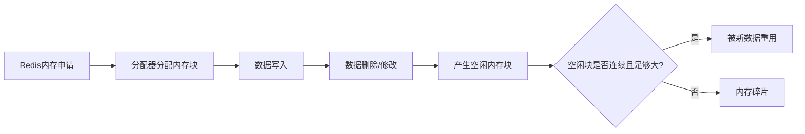
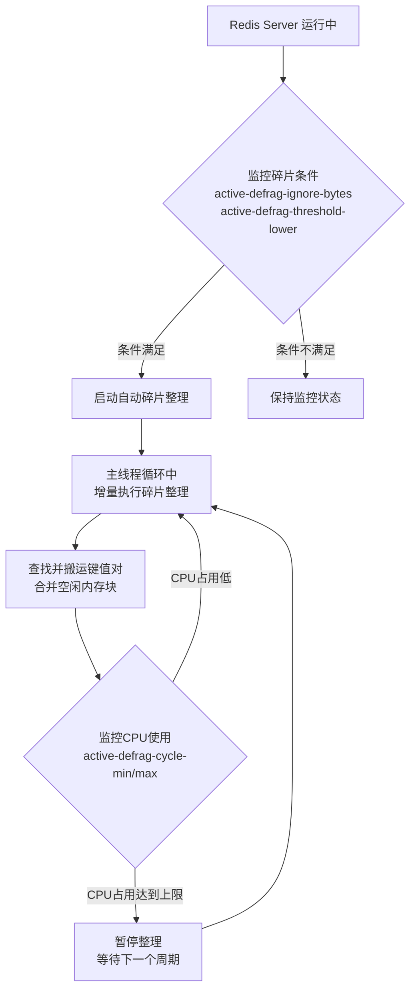
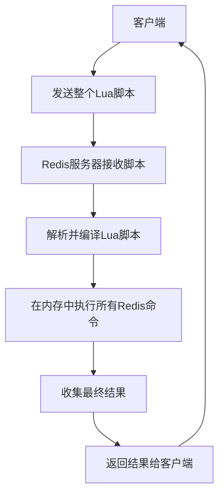

> 这篇笔记的目标，是把 Redis 的常见面试问题和工程实践放到一张图里理解：它是什么、适合存什么、事务和 Lua 的边界在哪里、集群和内存管理要关注什么。

> 内容以概念梳理和关键差异辨析为主，尽量保留原始笔记骨架；像缓存一致性、分布式锁安全性、热点 key 治理这类主题这里只做延伸提示，适合后续再拆成独立专题深入。

> 参考资料：

> [Redis Documentation](https://redis.io/docs/latest/)

> [Redis Transactions](https://redis.io/docs/latest/develop/using-commands/transactions/)

> [Redis Cluster Specification](https://redis.io/docs/latest/operate/oss_and_stack/reference/cluster-spec/)

> [看完这20道Redis面试题，阿里面试可以约起来了](https://github.com/CoderLeixiaoshuai/java-eight-part/blob/master/docs/redis/%E7%9C%8B%E5%AE%8C%E8%BF%9920%E9%81%93Redis%E9%9D%A2%E8%AF%95%E9%A2%98%EF%BC%8C%E9%98%BF%E9%87%8C%E9%9D%A2%E8%AF%95%E5%8F%AF%E4%BB%A5%E7%BA%A6%E8%B5%B7%E6%9D%A5%E4%BA%86.md)

[TOC]

---

## 1.什么是Redis，Redis有哪些特点

Redis 全称为 Remote Dictionary Server。更准确地说，它是一种**内存数据结构存储系统**：所有数据都以 key-value 的形式组织，但 value 可以承载多种数据结构，而不只是简单字符串。

Redis 常被用作缓存，也常出现在计数器、排行榜、消息队列、会话共享、发布订阅等场景中。

它的核心特征可以概括为：基于内存、支持丰富数据结构、单命令原子执行、可通过 RDB/AOF 持久化到磁盘。

**特点1：丰富的数据类型**

很多数据库只能处理一种数据结构：

* 传统SQL数据库处理二维关系数据
* MemCached数据库，键和值都是字符串
* 文档数据库（MongoDB）是由Json/Bson组成的文档

不是他们这些数据库不好，而是一旦数据库提供数据结构不适合去做某件事情的话，程序写起来就非常麻烦和不自然

Redis 虽然也是键值对数据库，但是和 Memcached 不同的是：Redis 的值不仅可以是字符串，还可以是其他多种数据结构中的任意一种。

通过选用不同的数据结构，用户可以使用Redis解决各种各样的问题，使用Redis，你碰到一个问题，首先会想到是选用那种数据结构把哪些功能问题解决掉，有了多样的数据结构，方便你解决问题

**特点2：内存存储**

数据库有两种：一种是硬盘数据库，一种是内存数据库

硬盘数据库是把值存储在硬盘上，在内存中就存储一下索引，当硬盘数据库想访问硬盘的值时，它先在内存里找到索引，然后再找值

问题在于，在读取和写入硬盘的时候，如果读写比较多的时候，它会把硬盘的IO功能堵死

内存存储是讲所有的数据都存储在内存里面，数据读取和写入速度非常快

**特点3：持久化功能**

将数据存储在内存里面的数据保存到硬盘中，保证数据安全，方便进行数据备份和恢复

---

## 2.Redis有哪些数据结构？

Redis 是 key-value 数据库，key 的类型只能是 String，但 value 的数据类型很丰富。面试里最常见的是五种基础结构，工程实践里还会经常碰到 Stream 以及基于底层结构扩展出的 Bitmap、HyperLogLog、GEO 等能力。

1. String
2. Hash
3. List
4. Set
5. Sorted Set
6. Stream（Redis 5.0 引入，适合消息流场景）


---

### String 字符串

```shell
SET KEY_NAME VALUE
```

string类型是二进制安全的。意思是redis的string可以包含任何数据。比如jpg图片或者序列化的对象

string类型是Redis最基本的数据类型，一个键最大能存储512MB

---

#### String 使用场景

信息缓存、计数器、分布式锁等等

常用命令：get/set/del/incr/decr/incrby/decrby

**实战场景1：** 记录每一个用户的访问次数，或者记录每一个商品的浏览次数

常用键名： userid:pageview 或者 pageview:userid

如果一个用户的id为123，那对应的redis key就为pageview:123

value就为用户的访问次数

增加次数可以使用命令：incr

使用理由：每一个用户访问次数或者商品浏览次数的修改是很频繁的，如果使用mysql这种文件系统频繁修改会造成mysql压力，效率也低

redis 的好处有二：使用内存，访问速度快；同时很多常见更新可以直接用原子命令完成，不需要先查再改，天然适合计数、限流这类场景。

**实战场景2：** 缓存频繁读取，但是不常修改的信息，如用户信息，视频信息

业务逻辑上：先从redis读取，有值就从redis读取，没有则从mysql读取，并写一份到redis中作为缓存，注意要设置过期时间

直接将用户一条mysql记录做序列化(通常序列化为json)作为值

userInfo:userid 作为key，键名如：userInfo:123，value存储对应用户信息的json串。如 key为："user:id :name:1", value为"{"name":"leijia","age":18}"

**实战场景3：** 限定某个ip特定时间内的访问次数

用key记录IP，value记录访问次数，同时key的过期时间设置为60秒

如果key过期了则重新设置，否则进行判断，当一分钟内访问超过100次，则禁止访问

**实战场景4：** 分布式session

session是以文件的形式保存在服务器中的

如果应用做了负载均衡，将网站的项目放在多个服务器上，当用户在服务器A上进行登陆，session文件会写在A服务器

当用户跳转页面时，请求被分配到B服务器上的时候，就找不到这个session文件，用户就要重新登陆

想要多个服务器共享一个session，可以将session存放在redis中，redis可以独立于所有负载均衡服务器

也可以放在其中一台负载均衡服务器上；但是所有应用所在的服务器连接的都是同一个redis服务器

---

### Hash 哈希

```shell
HSET KEY_NAME FIELD VALUE
```

Redis hash 是一个键值(key=>value)对集合

Redis hash是一个string类型的field和value的映射表，hash特别适合用于存储对象

---

#### Hash 使用场景

**实战场景1：** 购物车

用户id设置为key，那么购物车里所有的商品就是用户key对应的值了

每个商品有id和购买数量，对应hash的结构就是商品id为field，商品数量为value

> 将商品id和商品数量序列化成json字符串，那么也可以用上面讲的string类型存储

当对象的某个属性需要频繁修改时，不适合用string+json

因为它不够灵活，每次修改都需要重新将整个对象序列化并赋值

如果使用hash类型，则可以针对某个属性单独修改，没有序列化，也不需要修改整个对象

比如，商品的价格、销量、关注数、评价数等可能经常发生变化的属性，就适合存储在hash类型里

---

### List 列表

```shell
//在 key 对应 list 的头部添加字符串元素
LPUSH KEY_NAME VALUE1.. VALUEN

//在 key 对应 list 的尾部添加字符串元素
RPUSH KEY_NAME VALUE1..VALUEN

//对应 list 中删除 count 个和 value 相同的元素
LREM KEY_NAME COUNT VALUE

//返回 key 对应 list 的长度
LLEN KEY_NAME 
```

Redis 列表是简单的字符串列表，按照插入顺序排序

可以添加一个元素到列表的头部（左边）或者尾部（右边）

---

#### List 使用场景

列表本质是一个有序的，元素可重复的队列

**实战场景1：** 定时排行榜

list类型的lrange命令可以分页查看队列中的数据

可将每隔一段时间计算一次的排行榜存储在list类型中

如QQ音乐内地排行榜，每周计算一次存储在list类型中

访问接口时通过page和size分页转化成lrange命令获取排行榜数据

> 并不是所有的排行榜都能用list类型实现，只有**定时计算**的排行榜才适合使用list类型存储

> 实时计算的排行榜 有序集合sorted set

---

### Set 集合

```shell
SADD KEY_NAME VALUE1...VALUEn
```

Redis的Set是string类型的无序集合

集合是通过哈希表实现的，所以添加，删除，查找的复杂度都是O(1)

---

#### Set 使用场景

集合的特点是无序性和确定性（不重复）

**实战场景1：** 收藏夹

例如QQ音乐中如果你喜欢一首歌，点个『喜欢』就会将歌曲放到个人收藏夹中

每一个用户做一个收藏的集合，每个收藏的集合存放用户收藏过的歌曲id

key为用户id，value为歌曲id的集合

---

### Sorted Set 有序集合

```shell
ZADD KEY_NAME SCORE1 VALUE1.. SCOREN VALUEN
```

Redis zset 和 set 一样也是string类型元素的集合,且不允许重复的成员

不同的是每个元素都会关联一个double类型的分数

redis正是通过分数来为集合中的成员进行从小到大的排序

zset的成员是唯一的,但分数(score)却可以重复

---

#### Sorted Set 使用场景

有序集合的特点是有序，无重复值

与set不同的是sorted set每个元素都会关联一个score属性

redis正是通过score来为集合中的成员进行从小到大的排序

**实战场景1：** 实时排行榜

QQ音乐中有多种实时榜单，比如飙升榜、热歌榜、新歌榜

可以用redis key存储榜单类型，score为点击量，value为歌曲id

用户每点击一首歌曲会更新redis数据，sorted set会依据score即点击量将歌曲id排序

---

### 补充：Redis 中常见的扩展能力

上面五种基础结构加上 Stream，已经覆盖了大多数日常场景；再往下学时，通常还会遇到下面这些“能力型”特性：

* **Bitmap**：底层通常基于 String 的位操作能力，适合签到、活跃标记、布尔状态压缩存储。
* **HyperLogLog**：适合做近似去重统计，例如 UV 统计，优点是占用空间极小，但结果是概率估计值。
* **GEO**：底层基于有序集合实现，适合附近的人、门店距离、地理范围检索。
* **Stream**：适合消息流和消费组场景，支持消息 ID、消费确认、消费者组等能力。

理解这些能力的关键，不只是记住名字，而是知道它们和底层基础数据结构之间的映射关系。

---

## 3.Redis 的线程模型

经常会听到“Redis 是单线程的”这种说法，但更准确的表述应该是：

1. Redis 的**命令执行主路径**主要是单线程串行处理的。
2. Redis 采用 IO 多路复用机制同时监听多个 socket，根据 socket 上的事件选择对应处理器。
3. 从 Redis 4.0/6.0 开始，部分工作已经可以交给后台线程或 IO 线程，例如异步删除、AOF 刷盘、网络读写等。

所以，Redis 快并不只是因为“单线程”，而是因为下面几个因素叠加在一起：

* 纯内存操作，避免大量磁盘 IO
* 核心命令执行路径短，数据结构设计针对高频场景做了优化
* 基于非阻塞 IO 多路复用机制，单个线程就能高效处理大量连接
* 主线程串行执行命令，省去了锁竞争和频繁上下文切换

需要注意的是，`KEYS`、Lua 脚本、大 key 删除、复杂聚合等耗时操作，依然会阻塞命令执行主路径。

---

## 4.Redis有事务机制吗

有。Redis 事务以 `MULTI`、`EXEC`、`DISCARD`、`WATCH` 为核心命令，生命周期大致可以拆成下面几步：

1. 开启事务：使用 `MULTI` 开启一个事务。
2. 命令入队：后续命令会进入队列，此时不会立即执行。
3. 提交事务：使用 `EXEC` 提交事务，Redis 会按顺序执行队列中的命令。
4. 放弃事务：使用 `DISCARD` 清空队列并退出事务状态。

如果要实现类似 CAS 的乐观锁语义，还可以在 `MULTI` 之前使用 `WATCH` 监视一个或多个 key。

---

## 5.Redis事务到底是不是原子性的

这个问题要分两层来看。

从 Redis 官方文档的角度看，事务有两个重要保证：

* 事务中的命令会被序列化、按顺序执行，中间不会插入其他客户端的命令。
* 如果客户端在 `EXEC` 之前断线，那么队列里的命令都不会执行；如果成功调用 `EXEC`，队列里的命令会被依次执行。

但是从关系型数据库 ACID 的“原子性 + 回滚”语义来看，Redis 事务并不等价于传统数据库事务：

* **排队阶段出错**：例如命令语法错误、参数个数错误。Redis 会在 `EXEC` 时拒绝执行整个事务。
* **执行阶段出错**：例如把列表命令作用在字符串 key 上。Redis 不会回滚已执行成功的命令，也不会停止后续命令。

所以更稳妥的结论是：**Redis 事务具备隔离性和整体提交语义，但不具备关系型数据库那种可回滚的完整原子性。**

---

## 6.Redis为什么不支持回滚

在事务运行期间，虽然 Redis 命令可能会执行失败，但 Redis 依然会执行事务内剩余命令，而不会执行回滚。

Redis 官方给出的核心理由可以概括为两点：

1. 很多错误其实可以提前发现，例如语法错误、参数错误，会在入队阶段被识别出来。
2. 对运行时错误提供完整回滚机制，会显著增加实现复杂度，也会影响 Redis 一直强调的简单性和性能。

另外一个常见观点是：“程序有 bug 怎么办？” 这个问题本身也说明，回滚并不能解决所有业务错误。

比如某位程序员本来打算更新键 A，结果错误地更新了键 B，即使 Redis 具备回滚机制，也无法自动理解“业务上真正想改的是谁”。

因此 Redis 的设计取舍是：把事务做成轻量级的顺序执行模型，把更多一致性控制交给应用层、`WATCH`、Lua 脚本或更上层的业务补偿机制。

---

## 7.Redis事务相关的命令有哪几个

### WATCH

Redis事务提供 check-and-set （CAS）行为

被WATCH的键会被监视，并会发觉这些键是否被改动过了

如果有至少一个被监视的键在 EXEC 执行之前被修改了， 那么整个事务都会被取消， EXEC 返回nil-reply来表示事务已经失败

---

### MULTI

用于开启一个事务，它总是返回OK

MULTI执行之后,客户端可以继续向服务器发送任意多条命令， 这些命令不会立即被执行，而是被放到一个队列中，当 EXEC命令被调用时， 所有队列中的命令才会被执行

---

### UNWATCH

取消 WATCH 命令对所有 key 的监视，一般用于DISCARD和EXEC命令之前

如果在执行 WATCH 命令之后， EXEC 命令或 DISCARD 命令先被执行了的话，那么就不需要再执行 UNWATCH 了

因为 EXEC 命令会执行事务，因此 WATCH 命令的效果已经产生了

而 DISCARD 命令在取消事务的同时也会取消所有对 key 的监视，因此这两个命令执行之后，就没有必要执行 UNWATCH 了

---

### DISCARD

当执行 DISCARD 命令时， 事务会被放弃， 事务队列会被清空，并且客户端会从事务状态中退出

---

### EXEC

负责触发并执行事务中的所有命令

如果客户端成功开启事务后执行EXEC，那么事务中的所有命令都会被执行

如果客户端在使用MULTI开启了事务后，却因为断线而没有成功执行EXEC,那么事务中的所有命令都不会被执行

需要特别注意的是：即使事务中有某条/某些命令执行失败了，事务队列中的其他命令仍然会继续执行，Redis不会停止执行事务中的命令，更不会像通常使用的关系型数据库一样进行回滚

---

## 8.Redis 持久化

Redis 虽然以内存为主，但并不意味着“重启就一定丢数据”。是否能恢复、会丢多少数据，取决于持久化配置。

### RDB

RDB 是快照方式，按时间点把内存中的数据生成一份紧凑的 dump 文件。

* 优点：文件紧凑、适合备份、恢复速度快
* 缺点：两次快照之间如果实例宕机，期间新增的数据可能丢失

### AOF

AOF 是追加日志方式，把写命令按协议格式追加到文件中。

* 优点：更容易做到更小的数据丢失窗口
* 缺点：文件通常比 RDB 更大，恢复时需要重放命令

常见刷盘策略：

* `appendfsync always`：每条写命令都刷盘，最安全也最慢
* `appendfsync everysec`：默认常见选择，性能和可靠性相对均衡
* `appendfsync no`：由操作系统决定刷盘时机，性能最好但风险更高

### 如何理解选择

如果更看重备份恢复速度，RDB 很常见；如果更看重数据持久性，通常会打开 AOF；很多线上环境会同时使用两者。

---

## 9.集群模式

引入 Cluster 模式的原因，是单机 Redis 即使通过主从和哨兵解决了高可用问题，写流量依然集中在单个主节点上，在海量数据和高并发场景下容易遇到容量和写入瓶颈。

Redis Cluster 采用无中心结构，多个 master 共同承接写请求，并通过 replica 提供高可用能力。它的几个关键点如下：

* Redis Cluster 把整个 key 空间划分为 `16384` 个 hash slot
* 每个 master 负责其中一部分 slot，因此不同 key 可以分散到不同节点写入
* replica 负责复制对应 master 的数据，并在故障时参与提升
* 客户端访问错误节点时，会收到 `MOVED` 或 `ASK` 重定向
* 多 key 操作通常要求相关 key 落在同一个 slot，必要时可通过 hash tag 控制

可以把 Cluster 理解为“**分片 + 高可用**”同时解决的方案，而不是单纯把多个主从结构机械拼在一起。


Cluster 模式里，一个主从复制组通常可以视为一个分片；多个分片共同构成整个集群。

---

## 10.遍历

以某个固定的已知的前缀开头遍历

```shell
keys pre*
```

`KEYS` 会一次性扫描整个键空间。由于 Redis 的命令执行主路径主要是单线程的，这种命令可能在生产环境造成明显阻塞，因此一般只适合开发环境或非常确定的数据量场景。

更常见的做法是使用 `SCAN`：

```shell
SCAN 0 MATCH pre* COUNT 100
```

`SCAN` 的特点是分批返回结果，对服务更友好，但也要注意：

* 它不是严格快照遍历
* 可能返回重复 key，需要客户端自行去重
* 一次调用不保证取全，需要根据游标持续迭代直到游标回到 `0`

---

## 11.Redis 内存碎片



```shell
# 内存碎片率 = 操作系统分配的内存 / Redis实际使用的内存
mem_fragmentation_ratio = used_memory_rss / used_memory

# 查看命令
redis-cli info memory

# 关键指标输出示例：
used_memory: 1073741824       # Redis分配的内存总量
used_memory_rss: 1610612736   # 操作系统看到Redis使用的内存
mem_fragmentation_ratio: 1.5  # 碎片率 = 1610612736 / 1073741824

# 其他相关指标：
mem_fragmentation_bytes: 536870912  # 碎片内存字节数
active_defrag_running: 0            # 是否正在执行碎片整理

```

```conf
# 碎片率含义：
mem_fragmentation_ratio < 1.0  # 内存交换到磁盘，性能极差
mem_fragmentation_ratio ≈ 1.0  # 理想状态，几乎没有碎片
mem_fragmentation_ratio 1.0 - 1.5  # 正常范围
mem_fragmentation_ratio > 1.5  # 碎片较多，需要考虑优化
mem_fragmentation_ratio > 2.0  # 严重碎片，必须处理
```

Redis 使用 jemalloc 作为默认内存分配器

`mem_fragmentation_ratio` 只是观察指标，不要机械理解为“只要大于 1 就一定有严重碎片”。因为 RSS 里还可能包含分配器预留空间、复制缓冲区、页对齐等额外开销。

**解决方法：**

1. 重启 Redis（最简单有效）

2. 启用自动内存碎片整理（Redis 4.0+）

```shell
# redis.conf 配置
# 启用自动碎片整理
activedefrag yes

# 碎片整理触发条件
active-defrag-ignore-bytes 100mb          # 碎片达到100MB开始整理
active-defrag-threshold-lower 10          # 碎片率10%开始整理
active-defrag-threshold-upper 100         # 碎片率100%尽力整理

# CPU占用控制
active-defrag-cycle-min 5                 # 最小CPU使用百分比
active-defrag-cycle-max 75                # 最大CPU使用百分比

# 应用配置
redis-cli config set activedefrag yes
redis-cli config rewrite
```

---

## 12.Redis 碎片整理



1、 查找待移动的键
Redis 会在自己的键空间中扫描，寻找那些值在物理内存中存储位置比较分散，或者其旁边有足够空闲空间的键。这部分工作会分多次执行，避免长时间阻塞

2、 搬运数据与释放旧空间
对于找到的符合条件的键，Redis 会为它重新分配一块连续的内存空间，然后将数据复制过去。接着，释放原来的内存空间。这个"释放"动作，是把空间交还给内存分配器（如jemalloc），后续可以重新利用

3、 合并空闲内存块
内存分配器在察觉到这些被释放回来的小块空闲内存，并且当这些空闲块相邻时，就会尝试将它们合并成一个更大的连续空闲内存块。这样，之后需要存储较大数据时，就有连续空间可用了

---

### 问题一：redis碎片整理，是主线程吗？会不会阻塞读写请求

总结：内存碎片整理主要是在事件循环中**增量推进**的，会与正常请求共享 CPU 时间，因此不是一次性长时间 stop-the-world，但仍然可能带来短暂抖动。

也就是说，它更接近“分多次做一点整理”，而不是“先停下来整理完再继续服务”。

```bash
1. CPU时间限制

# redis.conf 中的关键配置
active-defrag-cycle-min 5    # 最少使用5%的CPU时间进行整理
active-defrag-cycle-max 75   # 最多使用75%的CPU时间

2. 单次处理量限制
#define DEFRAG_MAX_SCAN 1000  // 每次循环最多处理1000个键
#define DEFRAG_MAX_SLOT 10    // 每次最多整理10个内存slot

3. 避免大键
# 如果一个Hash有100万个字段，整理它可能需要几十毫秒
# 在此期间，主线程会被这个键的整理操作占用
```

```bash
# 假设配置：active-defrag-cycle-max 50 # 最多使用50%的CPU时间

时间线 (1ms为单位)：
[请求][请求][整理][请求][整理][请求][请求][整理][请求]...
   1ms  1ms  1ms  1ms  1ms  1ms  1ms  1ms  1ms

# 在这个例子中：
# - 碎片整理占用约 30% 的CPU时间 (3/10)
# - 正常请求占用约 70% 的CPU时间 (7/10)
# - 每个整理操作都很短暂，不会长期阻塞
```

---

## 13.Redis 事务和 Lua 脚本区别

Redis 事务的核心思想是将多个命令打包，然后顺序、连续地执行。

* 工作原理：事务生命周期包含三个阶段：

  1. 开始事务 (MULTI)：此后客户端发出的命令不会立即执行。

  2. 命令入队 (QUEUED)：命令被放入一个队列中暂存。

  3. 提交/放弃 (EXEC/DISCARD)：EXEC 命令会触发队列中所有命令的执行，而 DISCARD 则清空队列。

* 乐观锁 (WATCH)：这是一个关键机制。你可以在 MULTI 之前 WATCH 一个或多个键。如果在事务执行前，这些键被其他客户端修改，那么当前事务将会失败。这为实现类似“检查-然后-更新”的原子操作提供了可能

```shell
客户端A：

WATCH money
MULTI
DECRBY money 20
INCRBY out 20
// 暂不执行 EXEC
```

```shell
客户端B（在A执行EXEC前）：

SET money 1000      // 修改了被监视的键
```

```shell
客户端A：

EXEC

执行结果：(nil)，表示事务执行失败，因为被监视的 money 值已被其他客户端更改
```

* ACID 特性：

  1. 原子性：事务中的命令在 EXEC 执行时，会作为一个独立的操作序列运行，不会被其他命令打断。但需要注意，Redis事务在执行中发生错误时不会回滚。如果某个命令执行失败（例如对字符串使用 INCR），Redis 会继续执行队列中的后续命令。

  2. 隔离性：由命令串行执行保证，事务执行过程中不会被其他操作打断。

  3. 持久性：取决于 Redis 配置的持久化方式（RDB或AOF）

> 执行时错误：继续后续命令，不回滚、不自动中断整个事务

---

Lua 脚本能够在 Redis 服务端原子性地执行一段自定义逻辑。

原子性的保证是 Lua 脚本最核心的优势：脚本执行期间，不会有其他命令插入执行，因此非常适合“先读再判断再写回”这一类依赖中间结果的逻辑。



> Lua 代码中的运行时错误会中断脚本执行；已经执行成功的写命令不会像关系型数据库事务那样自动回滚

### 事务和 Lua 的核心差异

| 对比项 | Redis 事务 | Lua 脚本 |
| --- | --- | --- |
| 执行单位 | 多条已入队命令 | 一段服务端脚本 |
| 是否可读中间结果 | 不方便直接依赖前一条命令结果 | 可以 |
| 执行期间是否被插队 | 不会 | 不会 |
| 执行时报错 | 可能继续后续命令 | 通常中断脚本 |
| 是否自动回滚 | 不支持 | 也不支持 |

如果是简单的批量顺序执行，事务已经足够；如果逻辑里包含条件判断、读写组合、依赖中间结果，Lua 脚本通常更合适。Redis 7.0 之后，如果希望复用更长期的服务端逻辑，也可以继续了解 Redis Functions。

---

## 14.补充：高频实践问题

### 1.缓存穿透、击穿、雪崩

这三个问题经常放在一起问，但含义并不相同：

* **缓存穿透**：请求的数据本来就不存在，导致每次都打到后端数据库。常见做法是缓存空值、布隆过滤器、参数校验。
* **缓存击穿**：某个热点 key 在失效瞬间，大量并发请求同时回源。常见做法是互斥重建、逻辑过期、热点数据不过期。
* **缓存雪崩**：大量 key 在同一时间集中失效，造成后端瞬时压力暴涨。常见做法是给过期时间加随机值、多级缓存、限流降级。

### 2.big key 和 hot key

* **big key** 指单个 key 占用内存特别大，或成员特别多，删除、迁移、序列化时都可能引发卡顿。
* **hot key** 指少数 key 被极高频访问，容易把流量打到单个分片或单个实例。

这两类问题都会直接影响 Redis 的稳定性，线上排障时通常会结合 `--bigkeys`、监控命令耗时、访问分布、慢查询日志一起观察。

