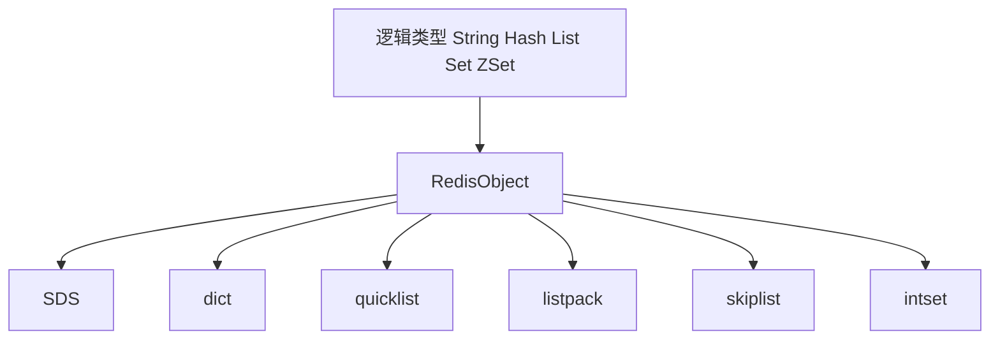

> 这篇笔记聚焦 Redis 的“底层怎么存”。重点不是再背一遍五种数据类型，而是把逻辑类型、对象封装、底层编码和结构演化串起来，弄清楚 Redis 为什么既快又省内存。

> 需要特别注意版本边界。很多旧资料大量提到 `ziplist`，而在 Redis 7.x 里，很多紧凑编码场景已经切换到 `listpack`。读源码和读博客时，先确认版本，再下结论。

> 参考资料：
>
> [Redis Data Types](https://redis.io/docs/latest/develop/data-types/)
>
> [Memory optimization](https://redis.io/docs/latest/operate/oss_and_stack/management/optimization/memory-optimization/)
>
> [Redis source: server.h](https://github.com/redis/redis/blob/7.4/src/server.h)
>
> [Redis source: quicklist.h](https://github.com/redis/redis/blob/7.4/src/quicklist.h)
>
> [Redis source: listpack.c](https://github.com/redis/redis/blob/7.4/src/listpack.c)

[TOC]

---

## 1. 先建立一张总图

学习 Redis 数据结构时，最容易混淆的有三层：

1. **逻辑类型**：对外暴露给用户的 `String`、`Hash`、`List`、`Set`、`Sorted Set`
2. **对象封装**：Redis 内部统一用对象模型保存元信息
3. **底层编码**：真正存放数据的结构，比如 SDS、dict、quicklist、listpack、skiplist

可以先把关系记成下面这张图：



这张图想表达的不是“一种类型只对应一种结构”，而是：

> Redis 对外提供的是统一的数据类型接口，对内会根据数据规模、元素特征和版本实现，选择不同的编码方式。

所以，学习底层实现时，最好始终分清楚两件事：

- 对外你在用什么逻辑类型
- 对内 Redis 当前把它编码成了什么结构

---

## 2. RedisObject：统一对象层

Redis 不会直接把用户值裸放在内存里，而是先包一层对象结构，用来记录元信息。

可以把它理解成一个“数据外壳”，常见信息包括：

- 逻辑类型
- 当前编码方式
- LRU/LFU 相关信息
- 引用计数
- 指向真实数据结构的指针

一个简化后的理解模型如下：

```c
typedef struct redisObject {
    unsigned type:4;
    unsigned encoding:4;
    unsigned lru_or_lfu;
    int refcount;
    void *ptr;
} robj;
```

这里最关键的不是逐字段死记，而是理解它的职责：

- `type` 决定“这在逻辑上是什么”
- `encoding` 决定“这在物理上怎么存”
- `ptr` 指向真正的数据结构

例如同样是字符串类型，底层编码可能是：

- `int`
- `embstr`
- `raw`

也就是说：

> 逻辑类型是用户视角，编码方式是实现视角。

### 2.1 一份更接近源码的对象骨架

如果只是理解概念，前面的简化结构已经够用；如果希望以后回头看源码时有抓手，可以再记住下面这类更接近真实实现的骨架：

```c
typedef struct redisObject {
    unsigned type:4;
    unsigned encoding:4;
    unsigned lru:LRU_BITS;
    int refcount;
    void *ptr;
} robj;

#define OBJ_STRING 0
#define OBJ_LIST   1
#define OBJ_SET    2
#define OBJ_ZSET   3
#define OBJ_HASH   4

#define OBJ_ENCODING_RAW       0
#define OBJ_ENCODING_EMBSTR    1
#define OBJ_ENCODING_INT       2
#define OBJ_ENCODING_HT        3
#define OBJ_ENCODING_INTSET    7
#define OBJ_ENCODING_SKIPLIST  8
#define OBJ_ENCODING_QUICKLIST 10
```

这段代码不需要逐个常量硬背，但至少要记住两点：

- `type` 描述逻辑类型
- `encoding` 描述底层编码

这样看到 `OBJECT ENCODING` 的结果时，脑子里才有对应关系。

---

## 3. SDS：Redis 为什么不用 C 原生字符串

Redis 的字符串底层不是直接用 `char *`，而是使用 SDS，`Simple Dynamic String`。

一个简化后的 SDS 头部大致如下：

```c
struct sdshdr {
    unsigned int len;
    unsigned int alloc;
    unsigned char flags;
    char buf[];
};
```

### 问题一：为什么不用 C 字符串

原生 C 字符串的问题主要有四个：

- 依赖 `\0` 结尾，不适合直接表达任意二进制数据
- 求长度通常要遍历，时间复杂度是 `O(n)`
- 容易发生缓冲区溢出
- 频繁修改长度时，内存重分配成本高

### 问题二：SDS 解决了什么问题

#### 常数时间取长度

SDS 直接把长度存在 `len` 字段里，拿长度不需要重新扫描字符串。

#### 二进制安全

SDS 以 `len` 为准，不依赖 `\0` 判断结束，所以可以保存图片、序列化内容、压缩数据等任意字节序列。

#### 降低扩容次数

SDS 会预留一定空闲空间，避免每次追加内容都重新分配内存。

常见规则可以概括为：

- 扩容后如果长度小于 `1MB`，通常按翻倍思路分配更多空闲空间
- 扩容后如果长度已经较大，则额外预留固定上限的空闲空间，而不是无限翻倍

#### 惰性释放

当字符串缩短时，Redis 往往不会立刻把多余空间还给系统，而是留作后续复用。

这里有一个常见笔记误区需要纠正：

> 用来主动收缩 SDS 空闲空间的函数不是 `sdstrim`，而是 `sdsRemoveFreeSpace`；`sdstrim` 的语义更接近“按字符裁剪字符串两端内容”。

---

## 4. 紧凑编码：从 ziplist 到 listpack

### 4.1 为什么 Redis 需要紧凑编码

很多 Redis 数据并不大，例如：

- 字段很少的 Hash
- 元素很少的 ZSet
- 很短的 List 节点
- 只包含小整数的集合

如果这类小对象一上来就用标准哈希表、标准链表，指针开销会很重，内存利用率并不划算。

所以 Redis 会在“小对象阶段”优先使用更紧凑的编码方式。

### 4.2 ziplist 是什么

`ziplist` 可以理解成一段连续内存上的紧凑结构。它历史上被广泛用于：

- 小型 Hash
- 小型 ZSet
- 早期 List 节点

它的优点很明显：

- 连续内存，节省指针开销
- 小数据场景下非常省空间

但它也有典型缺点：

- 中间插入、删除可能触发大块内存移动
- 某些情况下可能出现连锁更新
- 实现和维护复杂度较高

### 4.3 一段经典的 ziplist 骨架

虽然现代 Redis 更常谈 `listpack`，但很多资料和历史源码仍然会提到 `ziplist`。如果完全不看它的结构，后面读旧资料会很难对上号。

```c
/* ziplist: [zlbytes][zltail][zllen][entries][zlend] */
#define ZIPLIST_BYTES(zl)       (*((uint32_t*)(zl)))
#define ZIPLIST_TAIL(zl)        (*((uint32_t*)((zl) + 4)))
#define ZIPLIST_LENGTH(zl)      (*((uint16_t*)((zl) + 8)))
#define ZIPLIST_HEADER_SIZE     10
#define ZIPLIST_ENTRY_HEAD(zl)  ((zl) + ZIPLIST_HEADER_SIZE)
#define ZIPLIST_ENTRY_TAIL(zl)  ((zl) + intrev32ifbe(ZIPLIST_TAIL(zl)))
#define ZIPLIST_ENTRY_END(zl)   ((zl) + intrev32ifbe(ZIPLIST_BYTES(zl)) - 1)
```

再配合一个 entry 视角去看会更好理解：

```c
typedef struct {
    unsigned int prevlen;
    unsigned int len;
    unsigned int encoding;
    unsigned char *p;
} zipEntry;
```

只要记住下面这句话就够了：

> ziplist 不是“一个个独立节点”，而是“连续内存 + 变长 entry + 前向长度信息”。

### 问题一：为什么不用普通双向链表来表示这类小对象

如果把每个元素都拆成传统链表节点，问题会很快暴露出来：

- 每个节点都要带前后指针
- 对短字符串、小整数这类小元素来说，指针开销甚至可能比数据本身还大
- 节点分散在不同内存区域，不利于 CPU 缓存命中

也就是说，在“小对象很多、元素又很短”的场景下，普通双向链表的表达能力虽然足够，但空间效率并不划算。

### 问题二：ziplist 和普通数组到底差在哪

它们都使用连续内存，这也是很多人第一次看到 ziplist 时容易产生误解的原因。

真正的区别在于：

- 数组通常要求元素定长，ziplist 的 entry 是变长的
- ziplist 的每个元素除了数据本身，还会带前向长度、编码等元信息
- ziplist 的目标不是做通用数组，而是为 Redis 的小对象场景节省内存

所以更准确地说，ziplist 是“连续内存上的紧凑编码结构”，而不是一个普通数组的别名。

### 4.4 listpack 为什么取代了 ziplist

在现代 Redis 中，很多原来由 `ziplist` 承担的紧凑存储场景已经转向 `listpack`。

可以把 `listpack` 理解成 Redis 对紧凑编码的升级版本，目标是：

- 继续保留高内存利用率
- 降低实现复杂度
- 减少 ziplist 的一些历史包袱

因此阅读资料时，最好带着版本意识：

- **旧文章** 常写 ziplist
- **新版本 Redis** 更常看到 listpack

### 问题三：为什么后来又从 ziplist 走向 listpack

核心原因不是“ziplist 不能用”，而是它的历史包袱越来越明显：

- 实现复杂
- 某些场景下有连锁更新成本
- 维护和演进都不够轻松

`listpack` 可以理解成 Redis 在紧凑编码方向上的一次重新整理：保留高内存利用率，同时尽量让实现更简单、行为更可控。

### 4.5 什么时候会从紧凑编码升级成普通结构

Redis 的策略不是“一种类型只固定一种结构”，而是会随着规模变化自动升级。

例如官方文档里就给出了这类阈值配置：

```conf
# Redis >= 7.0
hash-max-listpack-entries 512
hash-max-listpack-value 64
zset-max-listpack-entries 128
zset-max-listpack-value 64
```

也就是说，小对象可以先用 `listpack` 节省内存；一旦元素数量或元素大小超过阈值，就会自动转成更适合大规模操作的普通结构。

这正是 Redis 的典型设计思路：

> 小对象优先省内存，大对象优先保性能。

---

## 5. dict：Redis 的哈希表

Redis 中很多能力都依赖哈希表，例如：

- 整个数据库的 key 空间
- Hash 类型的常规编码
- Set 的常规编码
- ZSet 辅助成员查找

一个哈希表节点可以简化理解成：

```c
typedef struct dictEntry {
    void *key;
    union {
        void *val;
        uint64_t u64;
        int64_t s64;
        double d;
    } v;
    struct dictEntry *next;
} dictEntry;
```

哈希表本体则维护桶数组、容量和已使用数量。

### 5.1 再看一眼 dict 的完整骨架

对学习来说，`dictEntry` 只是第一层，最好再把 `dictht` 和 `dict` 也一起放进脑子里：

```c
typedef struct dictht {
    dictEntry **table;
    unsigned long size;
    unsigned long sizemask;
    unsigned long used;
} dictht;

typedef struct dict {
    dictType *type;
    void *privdata;
    dictht ht[2];
    long rehashidx;
    unsigned long iterators;
} dict;
```

这组结构最值得记的不是字段名，而是 `ht[2]` 这个设计。它几乎就是“渐进式 rehash”这件事的结构基础。

### 5.2 Redis dict 和 Java HashMap 有什么不同

最值得记的不是字段名，而是两点实现思路：

#### 渐进式 rehash

Redis 扩容时不会强行一次性搬完所有数据，而是把迁移过程拆散到后续多次操作里逐步完成。

这样做的价值是：

- 避免一次性迁移引起明显卡顿
- 更适合单线程命令执行模型

#### 链地址法解决冲突

Redis 的冲突节点通常仍然通过链式方式组织，不会像 Java 8 之后那样在高冲突桶上树化成红黑树。

这也意味着 Redis 更依赖：

- 合理的负载因子
- 及时扩容
- 渐进式 rehash 维持桶分布

### 5.3 为什么链表长度不会无限增长

因为 Redis 会随着负载因子上升触发扩容，把原本集中在少数桶里的节点打散到更多桶里。

核心逻辑不是“单链表本身很强”，而是：

> 通过动态调整哈希桶规模，尽量不要让冲突链长期过长。

---

## 6. quicklist：为什么 List 不直接用普通链表

现代 Redis 的 `List` 逻辑类型，核心底层结构是 `quicklist`。

可以把 quicklist 理解成：

> 一个双向链表，但链表每个节点里放的不是单个元素，而是一段紧凑存储的数据块，现代版本里通常是 `listpack`。


如果想把 quicklist 真正记牢，建议至少扫一眼它的两层结构：

```c
typedef struct quicklist {
    quicklistNode *head;
    quicklistNode *tail;
    unsigned long count;
    unsigned int len;
    int fill : QL_FILL_BITS;
    unsigned int compress : QL_COMP_BITS;
} quicklist;

typedef struct quicklistNode {
    struct quicklistNode *prev;
    struct quicklistNode *next;
    unsigned char *entry;
    size_t sz;
    unsigned int count : 16;
    unsigned int encoding : 2;
    unsigned int container : 2;
} quicklistNode;
```

这段代码的记忆重点是：

- `quicklist` 负责整条链
- `quicklistNode` 负责每个分段块
- 每个节点里不是单个元素，而是一段紧凑数据

示意图如下：

```text
quicklist
  |
  +-- node1 -> [a, b, c, d]
  +-- node2 -> [e, f, g]
  +-- node3 -> [h, i]
```

### 问题一：为什么不用普通双向链表

如果每个元素单独做成链表节点，会有明显问题：

- 每个节点都要带前后指针
- 小元素场景下，指针开销甚至比数据本身还大
- 节点离散分布，不利于 CPU 缓存局部性

### 问题二：为什么不直接只用一个大 listpack

如果整个列表都塞进一个巨大的连续内存块，又会出现另一类问题：

- 中间插入、删除时移动成本高
- 数据越大，重分配和移动越重

quicklist 的思路正好折中：

- 链表层负责分段组织
- 每段内部用紧凑结构节省内存

这相当于把“一个很大的连续数组”拆成“多个较小的连续块”。

### 问题三：往中间插入元素时会发生什么

大致流程可以这样理解：

1. 先定位目标下标落在哪个 quicklist 节点
2. 检查该节点内部的 listpack 是否还有空间
3. 如果能放下，直接插入
4. 如果放不下，可能触发节点分裂，拆成两个节点后再插入

所以 quicklist 不是完全避免移动，而是把移动代价控制在较小的数据块内。

### 6.4 两个很实用的配置

```conf
list-max-listpack-size -2
list-compress-depth 0
```

这两个配置分别控制：

- 每个 quicklist 节点内部数据块的大小
- 两端保留多少层不压缩，中间节点能否压缩

如果业务主要在头尾操作，比如队列场景，这类配置会直接影响内存和延迟表现。

如果你看的旧资料还是 Redis 早期版本，也会见到旧配置名：

```conf
list-max-ziplist-size
```

这不一定代表资料错误，很多时候只是版本背景不同。

---

## 7. skiplist：有序集合为什么常用跳表

Redis 的有序集合在常规编码下，通常不是只靠一种结构完成所有需求，而是组合使用：

- `dict`：按 member 快速查找分数
- `skiplist`：按 score 维持有序结构

这也是 `Sorted Set` 能同时兼顾“按成员查”和“按分数排序查”的关键原因。


如果想把这部分学得更扎实，建议把跳表节点和跳表本体一起看：

```c
typedef struct zskiplistNode {
    sds ele;
    double score;
    struct zskiplistNode *backward;
    struct zskiplistLevel {
        struct zskiplistNode *forward;
        unsigned long span;
    } level[];
} zskiplistNode;

typedef struct zskiplist {
    struct zskiplistNode *header, *tail;
    unsigned long length;
    int level;
} zskiplist;
```

这段结构里最值得记住的字段有三个：

- `backward`：支持反向遍历
- `forward`：每层向前跳
- `span`：辅助排名计算

### 问题一：跳表节点怎么理解

跳表底层仍然可以看成链表体系，只不过它在上层额外加了多级索引。

- 底层链表保证完整顺序
- 高层索引负责跳跃式查找
- `backward` 指针用于反向遍历
- `span` 常用于排名计算

因此跳表不是“完全不同于链表的神秘结构”，而是：

> 在有序链表之上，叠加多层稀疏索引。

### 问题二：为什么 Redis 选择跳表，而不是红黑树

常见原因有三类：

- 实现相对直观
- 范围查询和顺序遍历语义自然
- 在工程实现上更容易结合概率分层做维护

不是说跳表在理论上全面碾压红黑树，而是它在 Redis 这个场景下，足够高效且实现成本合适。


### 问题三：查找过程怎么走

查找时可以这样理解：

1. 从最高层开始
2. 先在当前层尽量向前跳
3. 一旦再跳就会越界，下降一层
4. 重复这个过程，直到落到底层链表定位目标

所以跳表的核心不是“每层都很复杂”，而是利用高层索引先跳过大量无关节点。

---

## 8. 五种逻辑类型和底层编码怎么对应

把前面的内容收束一下，最常见的映射关系可以先记成这张表。

| 逻辑类型 | 常见编码/结构 | 说明 |
| --- | --- | --- |
| `String` | `int` / `embstr` / `raw` | 短字符串、小整数会走更轻量编码 |
| `Hash` | `listpack` 或 `dict` | 小对象重省内存，大对象重更新效率 |
| `List` | `quicklist` | quicklist 节点内部一般是 listpack |
| `Set` | `intset` 或 `dict` | 全是整数且规模小会更紧凑 |
| `Sorted Set` | `listpack` 或 `skiplist + dict` | 小对象走紧凑编码，大对象走组合结构 |

需要特别提醒的是：这张表是“常见情况”，不是“一成不变的永恒真理”。

Redis 的内部编码会随着版本迭代继续演化，所以分析问题时最好同时确认：

- Redis 版本
- 当前对象编码
- 数据规模

如果线上要确认某个 key 当前到底是什么编码，直接用：

```shell
OBJECT ENCODING mykey
```

这往往比背博客更靠谱。

---

## 9. 学数据结构时最值得抓住的三条主线

### 9.1 逻辑类型和底层结构不是一回事

看到 `Hash`，不要立刻等同于“哈希表”；看到 `List`，也不要立刻等同于“普通双向链表”。

Redis 的强项恰恰在于：

- 对外接口稳定
- 对内编码可按场景变化

### 9.2 Redis 一直在做空间和时间的权衡

小对象阶段，Redis 优先用紧凑编码节省内存；数据一大，再切到更适合增删查改的结构。

这是一条贯穿 Redis 内部实现的总原则。

### 9.3 读源码时先看版本，再看实现

如果一篇文章还在用大量 `ziplist` 解释所有新版本行为，不一定是错，可能只是它讲的是历史实现。

真正稳妥的阅读方式是：

- 先确认 Redis 版本
- 再确认当前源码中的结构和配置项
- 最后再把旧资料放进版本上下文里理解

这样看 Redis，很多“怎么这里又换结构了”的困惑就会自然消失。
