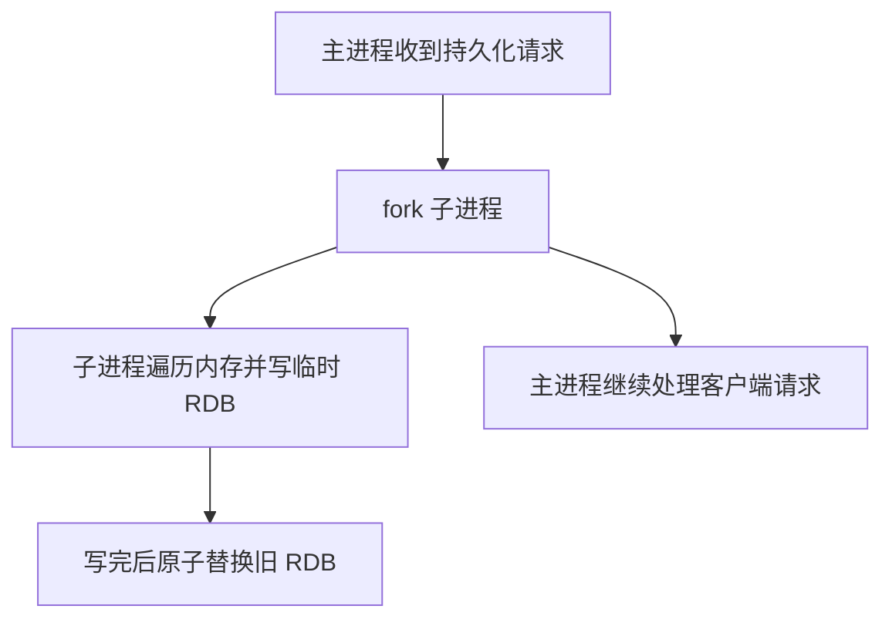

> 这篇笔记的目标是把 Redis 的持久化能力一次讲清楚：RDB 是什么、AOF 是什么、两者分别适合什么场景、AOF 重写怎么做，以及这些机制和主从复制之间到底是什么关系。

> 这篇笔记重点关注工程理解，而不是把所有源码细节都摊开。很多文章会把“持久化”和“复制”混在一起，这里会明确区分：持久化解决的是“重启后数据怎么回来”，复制解决的是“数据怎么同步到其他节点”。

> 参考资料：
>
> [Redis persistence](https://redis.io/docs/latest/operate/oss_and_stack/management/persistence/)
>
> [Redis replication](https://redis.io/docs/latest/operate/oss_and_stack/management/replication/)
>
> [BGREWRITEAOF 命令文档](https://redis.io/commands/bgrewriteaof/)
>
> [BGSAVE 命令文档](https://redis.io/commands/bgsave/)
>
> [WAIT 命令文档](https://redis.io/commands/wait/)

[TOC]

---

## 1. 先说结论：Redis 的数据安全靠什么

Redis 的高性能主要来自内存，但只要数据主要在内存里，就一定会面对一个问题：

> 进程重启、机器掉电、实例迁移之后，数据怎么保住？

Redis 主要提供两类能力来应对这个问题：

- **持久化**：把数据写到磁盘，解决“实例重启后能不能恢复”
- **复制**：把数据同步到其他节点，解决“单节点故障后能不能继续服务”

两者有关系，但不是一回事：

- 持久化更偏“落盘恢复”
- 复制更偏“副本同步”

这也是为什么“有主从复制”并不等于“数据一定安全”，而“开了持久化”也不等于“高可用已经做好”。

---

## 2. Redis 有哪些持久化方式

Redis 官方支持的持久化策略可以概括为四种：

- 只用 `RDB`
- 只用 `AOF`
- `RDB + AOF` 同时开启
- 完全关闭持久化

先用一句话区分：

- `RDB` 是**定时做快照**
- `AOF` 是**记录写命令日志**

如果更关心恢复速度、备份和冷存档，通常会优先想到 RDB；如果更关心尽量少丢数据，通常会优先考虑 AOF；如果数据比较重要，生产里常见做法是两者一起开。

---

## 3. RDB：把某一时刻的数据拍成快照

RDB 全称是 `Redis Database`。它的核心思路很简单：

> 在某个时间点，把当前内存里的数据整体序列化，写成一个紧凑的二进制快照文件。

默认场景下，RDB 文件通常叫 `dump.rdb`。

### 3.1 RDB 常见配置

```conf
save 900 1
save 300 10
save 60 10000
```

这三条的含义分别是：

- 900 秒内至少 1 次写，触发一次快照
- 300 秒内至少 10 次写，触发一次快照
- 60 秒内至少 10000 次写，触发一次快照

它表达的是一种“时间窗口 + 变更次数”的触发策略，而不是单纯固定每隔多久保存一次。

### 3.2 RDB 文件里大概有什么

如果不深入到每个字节级别，可以把 RDB 文件理解成下面几部分：

- 文件头和版本信息
- 若干数据库的数据内容
- 过期时间等辅助信息
- 文件结束标记
- 校验和

这部分细节的意义主要在于理解：RDB 不是“把内存原样拷到磁盘”，而是按 Redis 自己的二进制格式序列化后的结果。

如果想再记得具体一点，可以把它压缩成下面这条顺序：

```text
[魔数] -> [版本号] -> [可选元数据] -> [数据库数据区] -> [EOF] -> [Checksum]
```

这组顺序的价值不在于背二进制格式，而在于明确：

- RDB 是格式化快照文件
- 它有结束标记和校验和
- Redis 加载时不是“盲读文件”，而是按协议结构去解析

### 3.3 RDB 怎么生成

RDB 生成最常见的方式是 `BGSAVE`，而不是 `SAVE`。




这里最关键的点有两个：

- `fork` 之后，由**子进程**负责真正写 RDB
- 主进程一般还能继续对外服务

### 3.4 SAVE 和 BGSAVE 的区别

#### SAVE

`SAVE` 由主进程直接执行快照，期间主线程会被阻塞。

这意味着：

- 新请求不能被及时处理
- 数据量越大，阻塞越明显

所以 `SAVE` 更像是一个不适合线上常规使用的同步命令。

#### BGSAVE

`BGSAVE` 通过 `fork` 子进程在后台生成 RDB。

它比 `SAVE` 更适合线上，但并不代表完全零成本。真正需要警惕的点是：

- `fork` 本身可能带来短暂卡顿
- 数据集很大时，写时复制会增加额外内存压力

Redis 内部也会维护一个持久化状态，用来避免快照任务并发冲突。旧资料里常见的说法是 `server.bgsaveinprogress`，要表达的其实就是：

- 同一时刻只能有一类 RDB 后台快照任务在跑
- `SAVE` 和 `BGSAVE` 不是可以随意并发叠加的
- Redis 会拒绝重复的快照请求，而不是让多个子进程一起乱写

这个点对线上排障很有用，因为很多“为什么命令被拒绝”本质上不是配置错了，而是当前已经有一个后台持久化任务在执行。

### 3.5 什么是 COW

RDB 和 AOF 重写里都会看到 `COW`，也就是 `Copy-On-Write`，写时复制。

它的核心不是“先完整复制一份内存”，而是：

- `fork` 后父子进程先共享相同物理页
- 只有当主进程继续修改某些内存页时，操作系统才复制这些被改动的页

所以常见结论应该这样理解：

- 不是一开始就直接占用两倍内存
- 但如果持久化期间写入非常多，额外内存占用可能明显上升

这也是为什么大实例做 `BGSAVE` 或 `BGREWRITEAOF` 时，必须关心内存余量。

### 3.6 RDB 的优缺点

RDB 的优势主要是：

- 文件紧凑，适合备份和传输
- 恢复速度通常比 AOF 更快
- 对主线程的持续磁盘 IO 压力较小

RDB 的不足也很明确：

- 快照之间的数据可能丢失
- 数据集很大时，`fork` 成本不可忽视

一句话概括：

> RDB 更像“定时拍照”，适合备份、归档和快速恢复，但不适合拿来追求极致低丢失。

---

## 4. AOF：把写命令按顺序记下来

AOF 全称是 `Append Only File`。它的核心思路和 RDB 不同：

> 不是定时保存整个数据集，而是把每一条修改数据的命令追加到日志里，重启时再重放这些命令恢复数据。

开启方式很直接：

```conf
appendonly yes
```

### 4.1 AOF 记录的是什么

AOF 记录的是**写命令**，例如：

- `SET`
- `HSET`
- `LPUSH`
- `EXPIRE`

而不是把内存对象直接转储成镜像。

这意味着 AOF 的恢复思路是：

1. Redis 启动
2. 顺序读取 AOF
3. 重新执行里面的写命令
4. 重建出最终数据集

如果按执行链路记，可以再加两个术语锚点：

- **Append**：把写命令追加到 AOF 缓冲区
- **Sync**：把缓冲区内容真正刷到磁盘

旧资料里常把这个缓冲区写成 `AOF_BUF`，这个名字建议保留，因为后面讲 AOF 重写时还会遇到另一个名字叫 `Rewrite Buffer`。

### 4.2 AOF 的三个刷盘策略

```conf
appendfsync always
appendfsync everysec
appendfsync no
```

这是 AOF 最常被问的配置。

#### appendfsync always

- 每次写命令追加后都尽快 `fsync`
- 最安全
- 也是最慢

它并不是说“每条命令都一定产生一次完全独立的物理刷盘”，因为 Redis 也会利用批处理和 group commit 机制，但整体上它的延迟和吞吐压力依然最大。

#### appendfsync everysec

- 每秒刷盘一次
- 性能和安全性的平衡最好
- 默认也是最常见的生产配置

通常可以理解成：**最多丢 1 秒左右的数据**，但这是经验上限，不是法律承诺。真正丢多少，还要看故障时点和系统状态。

#### appendfsync no

- Redis 只负责把数据写到操作系统缓冲区
- 何时真正落盘交给内核决定
- 性能最好，但最不安全

### 4.3 AOF 一定比 RDB 更安全吗

通常是的，但要注意边界。

AOF 的优势在于它记录更细，所以理论上能把数据丢失窗口压得更小；但是否真的“更安全”，还取决于：

- `appendfsync` 策略
- 磁盘状态
- 是否发生日志截断或损坏
- 是否同时有 RDB 兜底

所以更准确的说法是：

> AOF 通常比 RDB 更耐丢数据，但它不是零丢失方案。

### 4.4 一个容易忽略的问题

如果 Redis 已经执行完写命令，但还没来得及把这条命令追加到 AOF 缓冲区，进程就宕机，那么这条数据依然会丢。

这也是为什么不能把 AOF 理解成“只要客户端收到成功，磁盘就绝对有这条数据”。

### 问题一：命令已经执行成功，但写 AOF 缓冲区之前宕机会怎样

结论很直接：**这条数据仍然可能丢失。**

原因在于，客户端收到成功，表示这条命令已经在 Redis 的执行路径上完成了内存修改，但不代表它已经安全进入 AOF 持久化链路。只要故障点发生在“命令执行完成”与“命令被追加并最终落盘”之间，就依然存在数据丢失窗口。

### 问题二：RDB 是 fork 子进程写盘，AOF 刷盘又是谁在做

这两个动作不能混成一个过程。

- `BGSAVE` / `BGREWRITEAOF` 这类后台持久化，核心是 `fork` 子进程去生成快照或重写结果
- AOF 的常规追加路径里，主线程负责把写命令追加到 AOF 缓冲区
- `appendfsync everysec` 这类策略下，真正的 `fsync` 会由后台线程周期性执行

也就是说，AOF 不是“完全靠子进程刷盘”，它的日常写入路径和后台重写路径是两套协作机制。

### 问题三：为什么这里一定要分清 `AOF_BUF` 和后台重写

因为它们解决的是两件不同的事：

- `AOF_BUF` 解决的是“日常写命令如何持续追加和刷盘”
- `BGREWRITEAOF` 解决的是“旧 AOF 越积越大以后，怎么生成一份更精简的新结果”

如果把这两个过程混成一个动作，就很容易误以为 AOF 的所有磁盘行为都来自子进程，或者误以为重写发生时日常写入会暂停。实际上两者是并行协作关系。

---

## 5. AOF 重写：不是重放旧日志，而是重建当前状态

AOF 的天然问题是：越写越大。

比如一个计数器：

```text
INCR counter
INCR counter
INCR counter
...
```

最终 Redis 里只关心 `counter` 的当前值，但 AOF 里可能已经累积了大量历史命令。

所以 Redis 需要 AOF 重写。

### 5.1 AOF 重写到底在做什么

AOF 重写不是“把旧 AOF 压缩一下”，而是：

> 直接遍历当前内存里的数据，重新生成一份能恢复出当前状态的最小命令集。

例如：

- 旧 AOF 里可能有 100 次 `SET`
- 重写后的新 AOF 里可能只需要 1 次 `SET`

### 5.2 自动重写的常见配置

```conf
auto-aof-rewrite-percentage 100
auto-aof-rewrite-min-size 64mb
```

可以理解成：

- 当前 AOF 相比上次重写后的体积增长到一定比例
- 同时文件本身也达到最小体积

满足这两个条件后，Redis 会自动触发 `BGREWRITEAOF`。

需要顺手记住的一点是：Redis 会周期性检查这些条件，而不是每条命令都重新完整评估一遍。旧资料里常写“每 100 毫秒检查一次”，这个粒度足以帮助理解为什么它是后台维护动作，而不是每次写入都去做重写判断。

### 5.3 Redis 7 之前的 AOF 重写流程

在 Redis 7 之前，AOF 重写的经典流程可以概括为：

1. 主进程 `fork` 子进程
2. 子进程根据当前内存数据生成新的临时 AOF
3. 主进程继续处理新写命令
4. 这些新写命令一边写旧 AOF，一边暂存在重写缓冲区
5. 子进程结束后，主进程把重写缓冲区追加到新 AOF
6. 原子替换旧文件

这个设计是安全的，但也有明显代价：

- 重写期间新写命令要额外缓存
- 某些阶段会有额外内存压力
- 写路径更复杂

如果要把这段流程记牢，建议直接记住两个缓冲区名字：

- **AOF_BUF**：继续服务旧 AOF 的日常写缓冲区
- **Rewrite Buffer**：专门暂存重写期间新增命令

这两个词是后面排查“为什么重写期间数据没丢”的关键抓手。

### 5.4 Redis 7 的多段 AOF

Redis 7 开始，AOF 引入了 `multi-part AOF` 机制，这是这篇原笔记里很值得补上的点。

它不再只维护一个不断增长的大 AOF 文件，而是拆成：

- **base file**：基础文件，表示某一时刻的数据基线
- **incremental files**：增量文件，记录之后发生的写操作
- **manifest**：清单文件，记录当前哪些文件共同组成完整 AOF

可以把它理解成：

```text
appendonlydir/
  appendonly.aof.1.base.rdb
  appendonly.aof.1.incr.aof
  appendonly.aof.manifest
```

这样做的好处是：

- 重写流程更清晰
- 对旧单文件 AOF 的切换成本更低
- 失败恢复和文件管理更稳

### 5.5 AOF 重写失败怎么办

如果重写失败，关键点在于：

- 旧 AOF 仍然是可用的
- Redis 不会因为新文件没生成成功，就把旧文件直接丢掉

这也是为什么 AOF 重写被认为是“后台安全操作”：重写是生成新文件，不是直接在旧文件上原地改写。

### 问题一：AOF 重写期间，怎么保证新写入的指令最终一致

核心在于：**重写过程和在线写入过程不是二选一，而是并行协作。**

- Redis 会继续处理新的写命令
- 旧的 AOF 仍然保持可用
- 新的重写结果只有在准备完成后才会切换生效

在 Redis 7 之前，这依赖重写缓冲区把“重写期间的新命令”补到新 AOF 尾部；在 Redis 7 之后，这依赖多段 AOF 和 manifest 切换机制完成原子接管。两种实现细节不同，但目标一致：**不能漏掉重写期间的新写入。**

### 问题二：AOF 重写失败会不会把数据搞坏

正常不会。

因为重写本质上是“生成新结果，再切换”，不是直接覆盖旧 AOF。只要切换没有完成，旧文件链路仍然是当前可恢复数据集的一部分。所以重写失败通常意味着“这次优化没成功”，而不是“原有数据立刻损坏”。

### 问题三：为什么主进程最后要参与收尾

因为只有主进程知道重写期间又来了哪些新命令。

不管是旧版 `Rewrite Buffer`，还是 Redis 7 的 manifest 切换，本质都是同一件事：

- 子进程负责生成一个“足够完整的候选结果”
- 主进程负责把候选结果和最新在线写入对齐
- 最后再完成切换

这样才能保证“重写优化文件体积”和“线上继续写入”两件事同时成立。

---

## 6. AOF 文件损坏或截断怎么办

如果 Redis 在写 AOF 时异常退出，最后一条命令可能只写了一半，这种情况叫**截断**。

现代 Redis 对这类问题已经比早期版本更友好：

- 某些场景下可以在启动时自动忽略尾部不完整命令
- 也可以使用 `redis-check-aof` 工具修复

常见命令是：

```bash
redis-check-aof --fix appendonly.aof
```

但要注意：

- `--fix` 本质上可能会截断损坏点之后的内容
- 在重要环境里，修复前先备份原文件

所以更稳妥的流程通常是：

1. 先备份原始 AOF
2. 先检查，再决定是否修复
3. 修复后再重启验证

---

## 7. RDB 和 AOF 应该怎么选

这类问题最怕一句话拍死。

### 7.1 只用 RDB

适合：

- 更偏缓存场景
- 可以接受分钟级数据丢失
- 更关心备份和恢复速度

### 7.2 只用 AOF

适合：

- 更关心减少数据丢失
- 可接受更大的磁盘占用
- 业务写入较多，但仍希望较强恢复能力

不过 Redis 官方长期建议里，通常不太鼓励只依赖 AOF 而完全没有 RDB 快照，因为 RDB 在备份和快速恢复上仍然很有价值。

### 7.3 RDB + AOF 一起开

如果数据比较重要，这是最常见也最稳妥的思路。

因为它同时兼顾：

- RDB 的备份与恢复效率
- AOF 的低数据丢失窗口

一句话总结：

> 缓存味道重的场景，可以偏 RDB；数据重要性更高的场景，通常会考虑 AOF，甚至直接 RDB + AOF 一起上。

---

## 8. 复制不是持久化，但经常要一起设计

原笔记后半段讲了主从同步，这部分内容是有价值的，但最好先明确一句：

> 主从复制不是持久化。

复制解决的是“把主节点的数据同步给副本节点”，它主要服务于：

- 高可用
- 读扩展
- 容灾

而持久化解决的是：

- 节点重启后的本地恢复

如果主节点和从节点都不开持久化，即使有复制，集群在某些故障场景下仍然可能把数据一起丢光。

---

## 9. Redis 复制怎么工作

Redis 复制的关键词主要有：

- 复制偏移量
- 复制积压缓冲区
- 全量复制
- 部分重同步
- `PSYNC`

如果是为了复习，建议再把下面三个术语也一起记住：

- `repl-backlog-size`
- `REPLCONF ACK <offset>`
- `replica-read-only`

### 9.1 正常连接时

主从连接健康时，主节点会把写命令流持续发给从节点，从节点按顺序执行这些命令，保持数据趋于一致。

Redis 的复制默认是**异步复制**，这意味着：

- 主节点不会每次写都等待所有从节点确认
- 所以它不是强一致系统

如果业务需要降低主从切换时丢数据的概率，可以让客户端结合 `WAIT` 使用，但 `WAIT` 也不是把 Redis 直接变成强一致数据库。

### 9.2 全量复制

当从节点第一次连上主节点，或者断线太久无法做部分重同步时，会触发全量复制。

核心流程可以概括为：

1. 从节点发 `PSYNC`
2. 主节点判断无法增量补齐
3. 主节点执行后台快照
4. 把 RDB 发给从节点
5. 从节点加载 RDB
6. 再补发快照期间积压的增量命令

这里最关键的认识是：

- **全量复制依赖 RDB 快照传输**
- 这也是为什么复制和持久化虽然不是一回事，但底层机制会彼此借力

### 9.3 从节点加载 RDB 时会不会阻塞

这部分原笔记的方向基本是对的，但可以说得更准确一些。

全量复制时：

- 从节点在初始同步期间，通常还能在一段时间内继续用旧数据响应请求，前提是配置允许
- 但当旧数据要被删掉、新 RDB 要正式加载进内存时，会出现一个阻塞窗口

所以更准确的说法是：

> 不是“全量同步全程都完全阻塞”，而是在切换到新数据集、加载 RDB 的关键窗口会阻塞，而且数据越大，这个窗口越明显。

### 问题一：全量同步时，从节点到底会不会阻塞读操作

会，但要分阶段看。

- 在初始同步的部分阶段，从节点可以继续基于旧数据提供响应，前提是相关配置允许
- 真正明显的阻塞点，出现在旧数据集被替换、新 RDB 被正式加载到内存的窗口

所以更实用的理解不是“会不会阻塞”，而是：**阻塞集中发生在数据集切换阶段，而且数据集越大，这个窗口越值得关注。**

### 问题二：增量同步会不会像全量同步那样加载 RDB

不会。

增量同步的本质是主节点补发缺失的命令流，从节点顺序执行这些命令来追平状态。它不需要重新传输和加载整份 RDB，因此通常比全量复制轻得多，也不会出现那种“重新装载整个快照”的大阻塞窗口。

### 9.4 部分重同步

如果从节点只是短暂断开，主节点复制积压缓冲区里还保留着它缺失的那段命令流，那么主节点只需要补发缺失部分即可。

这就是部分重同步，它比全量复制轻得多。

能不能走部分重同步，取决于两件事：

- 从节点带来的复制 ID / offset 是否还能对得上
- 主节点 backlog 里是否还保留缺失那段数据

这里的 backlog 指的就是**复制积压缓冲区**。默认容量并不大，旧资料里常写默认 `1MB`，实际最重要的是知道它可以通过下面这个配置调整：

```conf
repl-backlog-size 1mb
```

如果实例写入量很大、从节点又容易短时断连，这个值就不是无关紧要的小参数，而是决定能否走“部分重同步”还是被迫“全量复制”的关键杠杆。

### 9.5 复制偏移量、ACK 和心跳怎么配合

主从复制不是“主节点只管发、从节点只管收”这么简单，它们之间还会持续交换复制进度信息。

一个很重要的命令锚点是：

```text
REPLCONF ACK <offset>
```

可以这样理解：

- 主节点持续往外发送复制流
- 从节点持续汇报自己已经追到哪个偏移量
- 主节点据此判断从节点是否落后、落后了多少、还能不能做部分重同步

所以复制偏移量不只是统计值，它本质上是 Redis 判断主从同步状态的坐标。

### 9.6 主节点不开持久化，有什么风险

这是官方文档明确强调过的危险场景。

如果主节点不开持久化，又配置了自动重启，那么可能出现：

1. 主节点崩溃并自动拉起
2. 因为没有持久化，主节点以空数据启动
3. 从节点重新向这个空主节点同步
4. 所有副本也被清空

所以只要数据安全重要，就不应该把“有复制”误以为“可以不要持久化”。

---

## 10. 复制相关的几个补充知识点

### 10.1 diskless replication

Redis 支持无盘复制，也就是主节点在全量同步时不必先把 RDB 落到磁盘，再从磁盘读出来发送给从节点，而是可以直接通过网络把快照流推给副本。

它的价值主要在于：

- 降低磁盘压力
- 减少某些场景下的全量同步成本

对应配置一般会看到：

```conf
repl-diskless-sync yes
```

### 10.2 replica-read-only

从节点默认是只读的，常见配置是：

```conf
replica-read-only yes
```

生产里通常不建议把副本改成可写，因为这样很容易引入主从不一致。

### 10.3 WAIT 的边界

`WAIT` 可以让客户端等待指定数量副本确认收到写入，但它解决的是“降低复制丢失概率”，不是“绝对强一致”。

所以不要把 `WAIT` 理解成分布式事务提交。

---

## 11. 线上怎么配，通常更稳

如果只说原则，比较常见的经验是：

- 对数据不敏感、以缓存为主：可以偏向 RDB，甚至关闭持久化
- 对数据较重要：至少考虑 `AOF everysec`
- 对恢复效率和数据安全都比较看重：`RDB + AOF` 一起开
- 有主从复制时：主从都要认真设计持久化，不要觉得有副本就够了

除此之外，还要关注这些现实问题：

- 磁盘性能是否足够
- `fork` 时延是否能接受
- 实例内存是否给 COW 预留余量
- 是否会频繁发生全量复制
- 是否需要磁盘无关复制或更大的 backlog

Redis 的持久化从来不是只改几行配置就结束的事，它和内存、磁盘、复制链路、故障恢复策略是一整套联动设计。

---

## 12. 最后收束一下

如果把这篇内容压缩成四句话，可以记成下面这样：

1. `RDB` 是快照，适合备份和快速恢复，但可能丢最近一段时间的数据。
2. `AOF` 是写命令日志，通常更耐丢数据，但文件更大，恢复通常更慢。
3. `AOF 重写` 是根据当前内存状态生成更精简的新日志，不是简单压缩旧文件。
4. `主从复制` 不是持久化，复制解决副本同步，持久化解决重启恢复，两者都要单独设计。

真正把 Redis 用稳，关键不是背下多少命令，而是知道：

> 数据到底允许丢多少，实例到底允许卡多久，出了故障到底怎么恢复。
