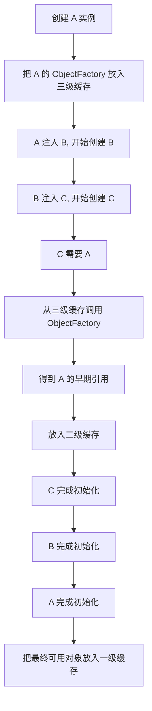
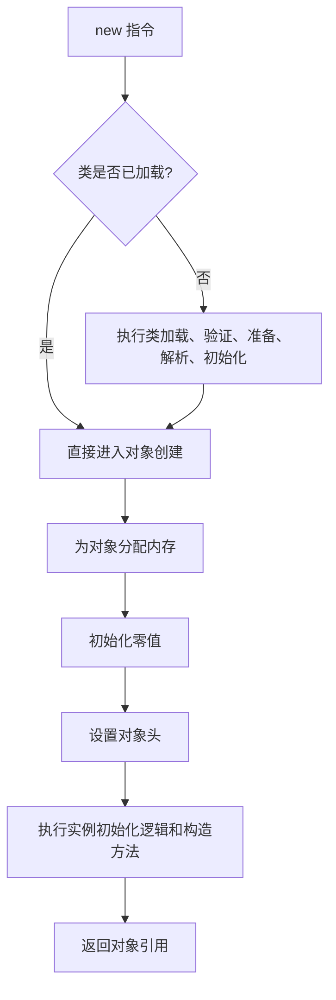
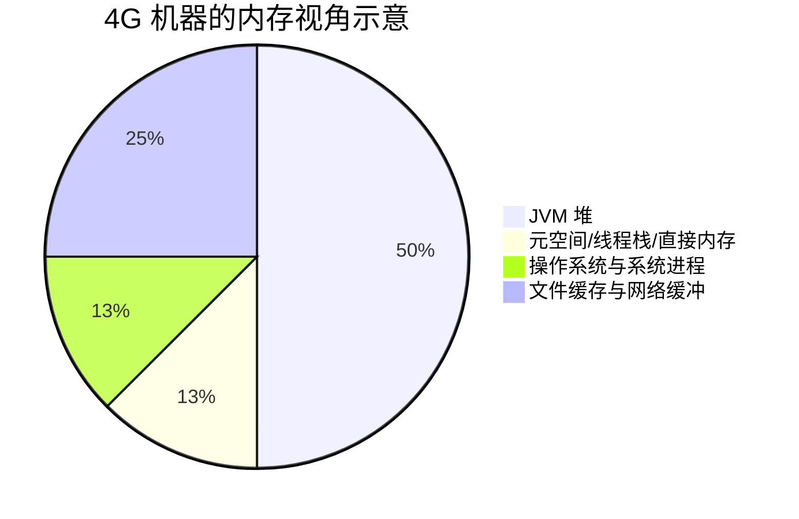

> 这篇笔记用于整理平时开发、面试和源码阅读中反复遇到的一些高频知识点，内容覆盖 `Spring`、`Java 并发`、`JVM`、`HTTP` 和服务器参数配置。重点不是把概念拆成孤立问答，而是尽量把“是什么、为什么、适用边界、容易误解的点”放在一起，方便后续复习。

> 文章以实战理解和原理梳理为主，不追求把每个主题都扩展成源码级长文。像 `Spring 循环依赖`、`自动装配`、`SimpleDateFormat` 这类容易被面试化简过头的知识点，会补上版本差异和边界条件，避免记成“口诀”。

> 参考资料：
>
> [Spring Framework Core Technologies](https://docs.spring.io/spring-framework/reference/core.html)
>
> [Spring Boot Reference: Creating Your Own Auto-configuration](https://docs.spring.io/spring-boot/reference/features/developing-auto-configuration.html)
>
> [Oracle JDK Docs: SimpleDateFormat](https://docs.oracle.com/en/java/javase/11/docs/api/java.base/java/text/SimpleDateFormat.html)
>
> [MDN: Referer Header](https://developer.mozilla.org/en-US/docs/Web/HTTP/Reference/Headers/Referer)

[TOC]

---

## 一、Spring 相关知识点

### 1. 为什么越来越多人喜欢用构造器注入

构造器注入之所以被大量推荐，不是因为 `Setter` 注入完全不能用，而是因为它更适合表达“这个对象要想成立，哪些依赖是必需的”。对核心业务对象而言，这种表达方式更稳定。

#### 1.1 核心优势

1. **依赖完整性更强**

构造器要求对象在创建时就把必要依赖准备好，不容易出现“对象已经创建，但依赖还没注入完成”的中间状态。

2. **更容易写成不可变对象**

依赖通常可以声明为 `final`，对象状态更清晰，也更适合做单元测试。

3. **更容易发现设计问题**

如果一个类的构造函数参数越来越多，往往说明它职责过重，应该拆分；如果出现构造器循环依赖，Spring 也会更早暴露问题。

4. **测试更直接**

不依赖容器时，单元测试直接 `new` 对象并传入 mock 即可。

```java
@Service
public class UserService {

    private final UserRepository userRepository;
    private final PasswordEncoder passwordEncoder;
    private final EmailService emailService;

    public UserService(UserRepository userRepository,
                       PasswordEncoder passwordEncoder,
                       EmailService emailService) {
        this.userRepository = userRepository;
        this.passwordEncoder = passwordEncoder;
        this.emailService = emailService;
    }
}
```

#### 1.2 为什么 `Setter` 注入更容易留下隐患

`Setter` 注入不是错误，只是更适合“可选依赖”或框架层面的装配扩展。如果把必需依赖也放到 `Setter` 中，就可能出现以下问题：

- 对象先被创建，后完成注入，中间存在“不完整对象”状态
- 依赖遗漏时，问题可能延后到运行时才暴露
- 依赖是否必需，从类定义上不够直观
- `@PostConstruct` 或初始化逻辑里若提前使用依赖，更容易踩空

常见误区不是“少了 `@Autowired` 就一定是 Setter 的锅”，而是：`Setter` 允许对象以不完整状态存在，因此更依赖外部配置正确性。

#### 1.3 构造器注入与循环依赖

如果 `A` 构造器依赖 `B`，`B` 构造器又依赖 `A`，Spring 无法拿到任一方的“半成品对象”，通常会直接抛出 `BeanCurrentlyInCreationException`。

这也是很多团队更偏好构造器注入的原因之一：它会更早暴露设计上的环形依赖，而不是帮你把问题拖到后面。


#### 1.4 什么时候 `Setter` 注入仍然合理

下面这些场景，`Setter` 注入依然有价值：

- 依赖是可选项，而不是对象成立的必要条件
- 需要兼容老框架或某些配置绑定方式
- 需要在测试场景中灵活替换某个协作者
- 通过 `@Lazy` 做延迟注入时，希望减少启动时的强耦合

可以概括为一句话：**必需依赖优先构造器注入，可选依赖再考虑 Setter 注入。**

---

### 2. AOP 什么时候会失效

很多 Spring 能力本质上都建立在代理之上，例如 `@Transactional`、`@Async`、`@Cacheable`。代理没有介入，请求链就不会经过增强逻辑，于是表现出来就像“AOP 失效”。

#### 2.1 最常见的失效场景

1. **同类内部调用**

对象内部通过 `this.xxx()` 调用方法，调用的是目标对象本身，不会经过代理。

2. **对象不是 Spring 容器创建的**

直接 `new` 出来的对象没有代理，自然也不会有事务、异步、缓存等增强。

3. **方法无法被代理**

典型情况包括：

- `private` 方法
- `final` 方法
- 某些代理模式下未暴露到代理接口的方法

4. **对注解行为的边界理解错误**

例如 `@Transactional` 只对通过代理进入的方法生效；如果异常被吃掉、传播行为不符合预期，也会表现成“事务没生效”。

#### 2.2 解决思路

- 把需要增强的方法放到另一个 Spring Bean 中，由外部调用
- 通过容器拿代理对象，而不是自己 `new`
- 必要时使用 `AopContext.currentProxy()`，但这更像补救方案，需要开启 `exposeProxy`
- 不要把事务、异步边界全堆在同一个类的自调用中

```java
@Service
public class OrderService {

    @Transactional
    public void createOrder() {
        // 这里如果直接 this.updateStock()，不会走代理
        updateStock();
    }

    @Transactional
    public void updateStock() {
        // ...
    }
}
```

上面的写法里，`createOrder()` 内部直接调用 `updateStock()`，调用链没有再经过代理对象，因此 `updateStock()` 上的增强逻辑不会重新生效。

---

### 3. Spring Boot 自动装配原理

Spring Boot 自动装配的核心目标，是根据类路径、配置项和用户自定义 Bean 的存在情况，**有条件地导入一批配置类**，从而减少显式 XML 或手写配置。

老项目，应该都写过 xml 吧，注入bean，依赖配置 bean 等等

SpringBoot 主要优化的就是这部分内容

@EnableAutoConfiguration -> 加载 Spring.factories -> 条件筛选(@Conditional) -> 动态注册Bean

启动类注解 @SpringBootApplication 包含了 @EnableAutoConfiguration

**个人理解：先通过spi机制加载Spring.factories注册一些bean，使springboot具备自动装配的能力，再通过 @ComponentScan 扫描包路径等方式，加载其他的bean**

#### 3.1 一条主线先看明白

`@SpringBootApplication` 是一个组合注解，其中包含：

- `@SpringBootConfiguration`
- `@EnableAutoConfiguration`
- `@ComponentScan`

其中真正触发自动装配的是 `@EnableAutoConfiguration`，它会导入 `AutoConfigurationImportSelector`，后者再去筛选应该加载哪些自动配置类。

```mermaid
flowchart TD
    A[启动类] --> B[@SpringBootApplication]
    B --> C[@EnableAutoConfiguration]
    C --> D[AutoConfigurationImportSelector]
    D --> E[读取自动配置候选项]
    E --> F[@Conditional 条件过滤]
    F --> G[导入满足条件的配置类]
    G --> H[注册 BeanDefinition]
```

#### 3.2 `spring.factories` 和 `AutoConfiguration.imports` 的区别

这里是最容易被记混的地方。

- **Spring Boot 2.x 及更早版本**：自动配置候选项主要通过 `META-INF/spring.factories` 声明
- **Spring Boot 3.x**：自动配置候选项改为通过 `META-INF/spring/org.springframework.boot.autoconfigure.AutoConfiguration.imports` 声明

所以如果只记“Spring Boot 自动装配就是加载 `spring.factories`”，这个说法在新版本下已经不完整了。

#### 3.3 自动装配到底做了什么

可以拆成下面几个步骤：

1. 读取候选自动配置类
2. 去重、排序、处理排除项
3. 根据 `@ConditionalOnClass`、`@ConditionalOnBean`、`@ConditionalOnMissingBean`、`@ConditionalOnProperty` 等条件筛选
4. 将满足条件的配置类导入容器
5. 由这些配置类再注册对应的 Bean

一个更准确的理解方式是：**Spring Boot 不是“自动帮你创建所有 Bean”，而是“自动导入一批带条件的配置类”。**

#### 3.4 源码案例：Dubbo、Nacos、Sentinel 是怎么自动装配进来的

只看概念，自动装配很容易停留在“Spring Boot 会帮我配好”这句话上。真正到项目里排查问题，还是得回到一条固定链路：

1. 先看你引入了哪个 starter
2. 再看这个 starter 在 `META-INF/spring.factories` 或 `AutoConfiguration.imports` 里声明了哪些自动配置类
3. 再看这些自动配置类上的条件注解
4. 最后顺着 `@Bean`、`BeanPostProcessor`、`ImportSelector` 去看它到底往容器里放了什么

很多中间件“为什么一加依赖就能用”，本质上就是走了这条链。

下面几段源码我做了**保留主干逻辑后的简化**，阅读时重点看“入口类、条件注解、注册了什么 Bean”，不要纠结每个版本的细枝末节差异。

##### 3.4.1 Dubbo：把 RPC 基础设施 Bean 和注解处理器自动放进容器

当你引入 `dubbo-spring-boot-starter` 之后，Dubbo 会通过自动配置把自己的配置类导入进来。它的自动配置声明里，能看到类似下面这些类：

```properties
org.springframework.boot.autoconfigure.EnableAutoConfiguration=\
org.apache.dubbo.spring.boot.autoconfigure.DubboAutoConfiguration,\
org.apache.dubbo.spring.boot.autoconfigure.DubboListenerAutoConfiguration,\
org.apache.dubbo.spring.boot.autoconfigure.DubboRelaxedBinding2AutoConfiguration,\
org.apache.dubbo.spring.boot.autoconfigure.DubboTripleAutoConfiguration
```

这一步的含义不是“直接把所有 Dubbo Bean 全 new 出来”，而是先把 `DubboAutoConfiguration` 这些配置类交给 Spring。

然后继续看 `DubboAutoConfiguration`，你会看到一个很典型的自动装配写法：

```java
@ConditionalOnProperty(prefix = DUBBO_PREFIX, name = "enabled", matchIfMissing = true)
@Configuration
@EnableDubboConfig
public class DubboAutoConfiguration {

    @ConditionalOnProperty(prefix = DUBBO_SCAN_PREFIX, name = BASE_PACKAGES_PROPERTY_NAME)
    @ConditionalOnBean(name = BASE_PACKAGES_BEAN_NAME)
    @Bean
    public static ServiceAnnotationPostProcessor serviceAnnotationBeanProcessor(
            @Qualifier(BASE_PACKAGES_BEAN_NAME) Set<String> packagesToScan) {
        return new ServiceAnnotationPostProcessor(packagesToScan);
    }
}
```

这里有两个很关键的点：

- `@EnableDubboConfig` 会把 Dubbo 自己那套配置绑定能力打开
- `ServiceAnnotationPostProcessor` 会去处理 `@DubboService`

也就是说，`@DubboService` 之所以能生效，不是靠普通的 `@ComponentScan` 扫一下就完事，而是因为 **Dubbo 先通过 Spring Boot 自动装配，把注解处理器注册进了容器**。后面 Spring 在创建 Bean 的过程中，这个后处理器才有机会识别 `@DubboService`、导出服务；`@DubboReference` 也类似，会依赖对应的注解处理器去注入代理对象。

可以把它简化理解成：

```text
引入 Dubbo starter
-> Spring Boot 发现 DubboAutoConfiguration
-> 注册 Dubbo 的配置类和注解处理器
-> 扫描到 @DubboService / @DubboReference
-> 导出服务 / 注入远程代理
```

##### 3.4.2 Nacos：把注册中心客户端和自动注册流程装配进来

以 `spring-cloud-starter-alibaba-nacos-discovery` 为例，自动装配的重点不是“扫描到一个 Nacos 组件”，而是把服务注册这条链上的几个核心 Bean 准备好。

`NacosServiceAutoConfiguration` 很直白：

```java
@Configuration(proxyBeanMethods = false)
@ConditionalOnDiscoveryEnabled
@ConditionalOnNacosDiscoveryEnabled
public class NacosServiceAutoConfiguration {

    @Bean
    public NacosServiceManager nacosServiceManager() {
        return new NacosServiceManager();
    }
}
```

它先把 `NacosServiceManager` 放进容器，作为后续与 Nacos 服务端交互的基础组件。

再往下看 `NacosServiceRegistryAutoConfiguration`，基本就能看到服务注册主链路了：

```java
@Configuration(proxyBeanMethods = false)
@ConditionalOnNacosDiscoveryEnabled
@ConditionalOnProperty(
        value = "spring.cloud.service-registry.auto-registration.enabled",
        matchIfMissing = true)
public class NacosServiceRegistryAutoConfiguration {

    @Bean
    public NacosServiceRegistry nacosServiceRegistry(...) {
        return new NacosServiceRegistry(...);
    }

    @Bean
    public NacosRegistration nacosRegistration(...) {
        return new NacosRegistration(...);
    }

    @Bean
    public NacosAutoServiceRegistration nacosAutoServiceRegistration(...) {
        return new NacosAutoServiceRegistration(...);
    }
}
```

这几个 Bean 的职责可以这么记：

- `NacosServiceRegistry`：真正执行注册/下线动作
- `NacosRegistration`：封装当前服务实例的信息，比如服务名、IP、端口、metadata
- `NacosAutoServiceRegistration`：在应用启动完成后触发自动注册

所以，Nacos 自动装配的本质不是“Spring 帮你连上 Nacos 就结束了”，而是：

```text
引入 Nacos Discovery starter
-> 自动配置类生效
-> 注册 NacosServiceManager / NacosServiceRegistry / NacosRegistration
-> 注册 NacosAutoServiceRegistration
-> Web 容器启动完成后触发服务注册
```

这也是为什么有时候你明明配了 `server-addr`，但服务还是没注册上去，要优先排查的不是“扫描没扫到”，而是：

- 自动配置条件是否成立
- `spring.cloud.nacos.discovery.enabled` 是否开启
- `spring.cloud.service-registry.auto-registration.enabled` 是否被关闭
- 当前环境里 `NacosRegistration` 和 `NacosAutoServiceRegistration` 有没有真正进容器

##### 3.4.3 Sentinel：把限流拦截器、资源切面、规则数据源能力装配进来

Sentinel 的例子特别适合理解“自动装配导入的是基础设施，不是业务规则本身”。

老一些、也更常见的 Spring Cloud Alibaba 版本里，`spring.factories` 里会声明：

```properties
org.springframework.boot.autoconfigure.EnableAutoConfiguration=\
com.alibaba.cloud.sentinel.SentinelWebAutoConfiguration,\
com.alibaba.cloud.sentinel.SentinelWebFluxAutoConfiguration,\
com.alibaba.cloud.sentinel.endpoint.SentinelEndpointAutoConfiguration,\
com.alibaba.cloud.sentinel.custom.SentinelAutoConfiguration,\
com.alibaba.cloud.sentinel.feign.SentinelFeignAutoConfiguration
```

这里最值得先看的有两个类。

第一个是 `SentinelWebAutoConfiguration`，它负责把 Web 限流需要的拦截器装配进去：

```java
@Configuration(proxyBeanMethods = false)
@ConditionalOnWebApplication(type = Type.SERVLET)
@ConditionalOnProperty(name = "spring.cloud.sentinel.enabled", matchIfMissing = true)
@ConditionalOnClass(SentinelWebInterceptor.class)
@EnableConfigurationProperties(SentinelProperties.class)
public class SentinelWebAutoConfiguration implements WebMvcConfigurer {

    @Bean
    @ConditionalOnProperty(name = "spring.cloud.sentinel.filter.enabled", matchIfMissing = true)
    public SentinelWebInterceptor sentinelWebInterceptor(
            SentinelWebMvcConfig sentinelWebMvcConfig) {
        return new SentinelWebInterceptor(sentinelWebMvcConfig);
    }

    @Bean
    public SentinelWebMvcConfig sentinelWebMvcConfig() {
        SentinelWebMvcConfig config = new SentinelWebMvcConfig();
        return config;
    }
}
```

这段代码说明：当应用是 Web 应用、类路径里有 `SentinelWebInterceptor`、并且相关配置打开时，Spring Boot 会自动把限流拦截器注册进去。后面请求进来，才会经过 Sentinel 的资源统计、规则判断、限流处理。

第二个是 `SentinelAutoConfiguration`，它负责把注解切面和规则处理能力准备好：

```java
@Configuration(proxyBeanMethods = false)
@ConditionalOnProperty(name = "spring.cloud.sentinel.enabled", matchIfMissing = true)
@EnableConfigurationProperties(SentinelProperties.class)
public class SentinelAutoConfiguration {

    @Bean
    @ConditionalOnMissingBean
    public SentinelResourceAspect sentinelResourceAspect() {
        return new SentinelResourceAspect();
    }

    @Bean
    @ConditionalOnMissingBean
    public SentinelDataSourceHandler sentinelDataSourceHandler(...) {
        return new SentinelDataSourceHandler(...);
    }
}
```

这就解释了两个常见问题：

- `@SentinelResource` 为什么会生效：因为自动装配注册了 `SentinelResourceAspect`
- 配置的规则数据源为什么会被识别：因为自动装配注册了相应的数据源处理组件

所以 Sentinel 限流的完整理解应该是：

```text
引入 Sentinel starter
-> 自动装配导入 Web 配置类、切面配置类、Feign/Endpoint 配置类
-> 注册 SentinelWebInterceptor / SentinelResourceAspect / 数据源处理器
-> 请求或方法调用进入 Sentinel 保护链路
-> 按 FlowRule、DegradeRule 等规则决定是否放行
```

注意这里 Spring Boot 自动装配解决的是“把 Sentinel 接入 Spring 容器”，真正的限流判断还是发生在 Sentinel 自己的运行时链路里，比如 `ProcessorSlotChain`、`FlowSlot` 等组件中。

#### 3.5 和 `@ComponentScan` 的关系

这两者经常被混为一谈，但职责不同：

- `@ComponentScan`：扫描你业务代码中的 `@Component`、`@Service`、`@Controller` 等组件
- 自动装配：导入框架或中间件提供的配置类，例如 `DataSource`、`DispatcherServlet`、`RedisTemplate` 等相关 Bean

也就是说，自动装配解决的是“框架基础设施怎么进容器”，组件扫描解决的是“你的业务 Bean 怎么进容器”。

---

### 4. SPI 机制与 Spring 扩展机制

#### 4.1 什么是 Java SPI

SPI 全称 `Service Provider Interface`，本质是一种**服务发现机制**：调用方依赖接口，具体实现由外部提供，并在运行时被发现和加载。

JDK 标准 SPI 通常基于 `ServiceLoader`，配置文件放在：

```text
META-INF/services/接口全限定名
```

文件内容是一行一个实现类，例如 JDBC 驱动：

```text
java.sql.Driver
```

对应的实现类示例：

```java
com.mysql.cj.jdbc.Driver
```

#### 4.2 Java SPI 的典型特点

- 调用方只依赖接口，不依赖具体实现
- 第三方 Jar 只要按约定提供实现和配置文件，就可以被发现
- 符合“对扩展开放、对修改关闭”的设计思路

#### 4.3 不要把 Java SPI 和 Spring 扩展机制混为一谈

很多资料会把 `Spring Boot 自动配置 = SPI` 直接画等号，这种说法不够严谨。

更准确地说：

- `Java SPI` 是 JDK 提供的标准服务发现机制
- `spring.factories`、`SpringFactoriesLoader`、`AutoConfiguration.imports` 是 Spring 体系自己的扩展发现机制

它们的共同点都是“按约定发现扩展”，但不是同一套实现。

#### 4.4 更稳妥的记忆方式

- `JDBC 驱动`：典型的 Java SPI
- `Spring Boot 自动配置`：Spring 自己的自动配置发现机制
- 二者都属于“约定优于硬编码”的扩展思想，但不要直接混成一个概念

---

### 5. Spring 如何解决循环依赖

Spring 解决循环依赖，是一个很容易被“三级缓存口诀化”的主题。真正要记住的是：**Spring 只解决部分场景下的单例 Bean 属性注入循环依赖，不是所有循环依赖都能解。**

#### 5.1 哪些循环依赖 Spring 能解决，哪些不能

**通常能解决：**

- 单例 Bean
- 基于字段注入或 Setter 注入
- 允许提前暴露早期引用

**通常不能解决：**

- 构造器循环依赖
- 原型作用域 Bean 的循环依赖
- 某些过早类型匹配或代理包装不一致的复杂场景

另外，从 Spring Boot 2.6 开始，循环依赖默认就是不鼓励的；很多项目即便“技术上能解”，也不建议把它当成正常设计。

#### 5.2 三级缓存分别做什么

```java
public class DefaultSingletonBeanRegistry {

    // 一级缓存：已经完成初始化的单例 Bean
    private final Map<String, Object> singletonObjects = new ConcurrentHashMap<>(256);

    // 二级缓存：已经创建出的早期引用，可能是原始对象，也可能是代理对象
    private final Map<String, Object> earlySingletonObjects = new ConcurrentHashMap<>(16);

    // 三级缓存：用于按需创建早期引用的 ObjectFactory
    private final Map<String, ObjectFactory<?>> singletonFactories = new HashMap<>(16);
}
```

可以先这样记：

- 一级缓存：最终成品
- 二级缓存：已经拿出来给别人先用的“半成品引用”
- 三级缓存：还没真正创建半成品，只是先放一个“创建器”

#### 5.3 为什么需要三级缓存

如果只有一级缓存和三级缓存，也能在某些情况下拿到早期引用，但有一个关键问题：**如果 Bean 需要 AOP 代理，三级缓存里的 `ObjectFactory` 每次调用都可能重新生成早期代理引用。**

这会带来两个风险：

1. 同一个单例 Bean 在不同依赖方里拿到的可能不是同一个代理实例
2. 容器还没真正完成初始化，就把对象误当成最终成品对外暴露

所以 Spring 才会在第一次通过三级缓存拿到早期引用后，把它放进二级缓存，后续别人再来拿时直接复用，不再重复创建。

#### 5.4 一个典型创建流程

假设存在 `A -> B -> C -> A` 的属性依赖，且 `A` 需要被 AOP 代理。



这个流程里，二级缓存的核心价值就是：**缓存第一次产生的早期引用，避免重复创建。**

#### 5.5 为什么不能直接把代理对象放进一级缓存

因为一级缓存表示的是“最终可用的单例 Bean”。而当 `A` 还在创建过程中时，它可能还没完成：

- 属性填充
- `BeanPostProcessor` 处理
- 初始化回调
- 最终包装

这时如果直接把它放进一级缓存，相当于把“还没初始化完”的对象冒充成“最终成品”。语义上是错的，也会污染容器的单例状态管理。

所以：

- 一级缓存代表最终态
- 二级缓存代表早期引用态
- 三级缓存代表早期引用的工厂态

这三层并不是机械叠加，而是三种不同生命周期状态。

#### 5.6 为什么三级缓存是 `HashMap`

这个点原始理解方向是对的：三级缓存的大多数访问都发生在同步控制之内，因此没有必要像一级、二级缓存那样使用 `ConcurrentHashMap`。

可以简单理解为：

- 一级、二级缓存经常在更广泛的读取路径中被访问，需要更直接的并发可见性支持
- 三级缓存主要作为创建阶段的内部结构，被同步块保护，因此使用普通 `HashMap` 即可

---

### 6. 什么是 Spring、Spring MVC、Spring Boot、Spring Cloud

把这几个概念拆开看，会比背定义更清楚。

| 组件 | 核心定位 | 关键词 |
| --- | --- | --- |
| Spring | 基础开发框架 | IoC、AOP、Bean 生命周期 |
| Spring MVC | Web MVC 框架 | DispatcherServlet、HandlerMapping、ViewResolver |
| Spring Boot | 快速构建 Spring 应用 | 自动装配、约定配置、内嵌容器 |
| Spring Cloud | 微服务生态工具集 | 注册中心、配置中心、网关、熔断限流 |

可以这样理解：

- `Spring` 解决基础对象管理和横切逻辑
- `Spring MVC` 解决 Web 请求分发
- `Spring Boot` 解决工程启动与配置复杂度
- `Spring Cloud` 解决分布式系统配套能力

---

## 二、Java 并发与对象模型

### 1. 主线程等待子线程完成

主线程等待子线程完成，本质上就是“如何建立等待关系”。不同工具的差异在于：等待的是线程、任务结果，还是一组参与者到达同一个同步点。

#### 1.1 `CountDownLatch`

适合“主线程等待 N 个子任务全部结束”。

```java
CountDownLatch latch = new CountDownLatch(3);

for (int i = 0; i < 3; i++) {
    new Thread(() -> {
        try {
            // 业务逻辑
        } finally {
            latch.countDown();
        }
    }).start();
}

latch.await();
```

特点：

- 一次性使用
- 计数只能递减，不能重置
- 更像“倒计时门闩”

#### 1.2 `CyclicBarrier`

适合“多个线程互相等待，等都到齐后再一起继续”。

```java
CyclicBarrier barrier = new CyclicBarrier(3, () -> {
    System.out.println("所有线程都到达屏障点");
});

for (int i = 0; i < 3; i++) {
    new Thread(() -> {
        try {
            // 业务逻辑
            barrier.await();
        } catch (Exception e) {
            throw new RuntimeException(e);
        }
    }).start();
}
```

特点：

- 可重复使用
- 更适合阶段性协作
- 不是“主线程等子线程”专用工具，而是“参与者彼此等”

#### 1.3 `Future` / `CompletableFuture`

如果除了等待完成，还要拿结果，那么 `Future` 或 `CompletableFuture` 更自然。

```java
ExecutorService executor = Executors.newFixedThreadPool(3);
List<Future<String>> futures = new ArrayList<>();

for (int i = 0; i < 3; i++) {
    futures.add(executor.submit(() -> {
        // 业务逻辑
        return "result";
    }));
}

for (Future<String> future : futures) {
    future.get();
}
```

`CompletableFuture` 的组合能力更强：

```java
CompletableFuture<Void> all = CompletableFuture.allOf(
    CompletableFuture.runAsync(() -> { /* task1 */ }),
    CompletableFuture.runAsync(() -> { /* task2 */ }),
    CompletableFuture.runAsync(() -> { /* task3 */ })
);

all.join();
```

#### 1.4 `Thread.join()`

最简单，也最直接。

```java
Thread t1 = new Thread(() -> { /* 业务逻辑 */ });
Thread t2 = new Thread(() -> { /* 业务逻辑 */ });

t1.start();
t2.start();

t1.join();
t2.join();
```

它适合线程数量较少、控制逻辑简单的场景。

#### 1.5 对比总结

| 方式 | 可重用 | 是否有返回值 | 适用场景 |
| --- | --- | --- | --- |
| `CountDownLatch` | 否 | 否 | 一个线程等待多个任务结束 |
| `CyclicBarrier` | 是 | 否 | 多个线程在阶段点互相等待 |
| `Future` / `CompletableFuture` | 否 | 是 | 既要等待完成，也要拿结果或编排流程 |
| `Thread.join()` | 否 | 否 | 简单场景，线程数少 |

---

### 2. 对象的创建过程

“对象创建过程”这个题，最容易把“类加载过程”和“对象实例化过程”混在一起。

更准确的说法是：**执行 `new` 指令创建对象时，JVM 先检查类元信息是否已经加载；如果没有，则先完成类加载。之后才进入真正的对象分配与初始化流程。**



可以拆成下面几步：

1. 检查类是否已加载
2. 为对象分配内存
3. 把实例字段设为零值
4. 设置对象头，例如 Mark Word、类型指针
5. 执行实例初始化与构造方法
6. 把对象引用返回给调用方

这里要特别注意：**类加载不是每次创建对象都重新执行，而是按需在首次使用时触发。**

---

### 3. `SimpleDateFormat` 为什么线程不安全

`SimpleDateFormat` 的线程不安全，不只是因为“它里面有个 `Calendar`”，更准确地说是：**它在格式化和解析过程中会修改内部可变状态，而官方文档也明确说明并发访问时需要外部同步。**

```java
public class SimpleDateFormat extends DateFormat {
}

public abstract class DateFormat extends Format {
    protected Calendar calendar;
    protected NumberFormat numberFormat;
}
```

几个关键点：

- `DateFormat` 内部持有可变的 `Calendar`
- 解析和格式化过程中会不断修改这些内部状态
- 多线程共享同一个 `SimpleDateFormat` 实例时，状态会互相覆盖

所以典型问题包括：

- 格式化结果错乱
- 解析得到错误日期
- 偶发异常，且不容易复现

#### 3.1 推荐方案

1. **优先使用 `DateTimeFormatter`**

它是不可变的，天然线程安全，也是 Java 8 之后推荐的日期时间 API。

2. **每次创建新的 `SimpleDateFormat` 实例**

这种方式是安全的，但在高频场景下会增加对象创建成本。

3. **老系统里用 `ThreadLocal<SimpleDateFormat>` 过渡**

仅适合短期兼容，不建议在新代码里继续扩散。

```java
DateTimeFormatter formatter = DateTimeFormatter.ofPattern("yyyy-MM-dd HH:mm:ss");
String text = LocalDateTime.now().format(formatter);
```

---

### 4. 为什么 `ConcurrentHashMap` 不允许 `null`

`ConcurrentHashMap` 不允许 `key` 为 `null`，也不允许 `value` 为 `null`。

根本原因不是“实现不了”，而是：**在并发语义下，`null` 会让读取结果变得含糊。**

假设 `map.get(key)` 返回 `null`，到底表示：

1. 这个 `key` 根本不存在
2. 这个 `key` 存在，但它映射的 `value` 就是 `null`

在单线程 `HashMap` 里，你还可以马上补一个 `containsKey(key)` 来区分；但在并发场景下，这两个操作之间数据可能已经被别的线程改掉，语义就不稳定了。

所以 `ConcurrentHashMap` 的设计选择是：**直接禁止 `null`，让 `null` 只表示“没查到”。**

#### 4.1 为什么 `HashMap` 却允许 `null`

因为 `HashMap` 的设计目标不是并发安全，而是通用、高性能、单线程语义下的 Map 实现。

在单线程或外部已同步的前提下：

- `null` 虽然也会带来歧义
- 但调用方可以通过 `containsKey()` 和 `get()` 配合判断
- 这种判断在顺序语义下是成立的

所以这不是谁“更高级”，而是两者面向的使用场景不同。

---

### 5. Java 中对象一定在堆上分配吗

不一定，但默认理解成“对象通常分配在堆上”是对的。

更严谨的说法是：**从 Java 语言层面看，对象概念上属于堆分配；但在 HotSpot 等 JVM 优化下，一部分对象分配可能被优化掉，或者被拆解为标量，从而不再以普通堆对象的形式出现。**

#### 5.1 常见优化思路

1. **逃逸分析**

判断对象是否逃出当前方法或当前线程。

2. **标量替换**

如果对象不会逃逸，JIT 可能直接把对象拆成若干基础字段使用，而不是创建真正的对象实例。

3. **分配消除**

极端情况下，连对象分配动作都可能被优化掉。

#### 5.2 关于“栈上分配”的表述

“栈上分配”常被用来解释逃逸分析后的优化结果，但它更像一种便于理解的说法，而不是稳定、可依赖的 Java 语义承诺。

所以在学习或面试时，更稳妥的回答是：

- 对象通常在堆上分配
- JVM 可能通过逃逸分析、标量替换、分配消除等方式优化
- 不要把“所有不逃逸对象都会稳定栈上分配”当成必然结论

---

## 三、HTTP 与服务器参数

### 1. HTTP Referer

`Referer` 是 HTTP 请求头字段，表示当前请求是从哪个页面跳转过来的。

> 注意：标准里字段名拼写就是 `Referer`，虽然它看起来像 `Referrer` 的拼写错误，但这个历史拼写已经沿用至今。

#### 1.1 常见用途

1. **防盗链**

资源服务器检查来源页面，限制图片、视频等静态资源被外站直接引用。

2. **流量来源分析**

统计用户是从哪个页面或外部站点进入当前页面的。

3. **作为安全校验的辅助信息**

例如用于辅助判断请求是否来自本站，但它不能单独承担安全边界。

#### 1.2 局限性

1. **可能为空**

例如：

- 用户直接输入 URL
- 浏览器隐私策略拦截
- 页面使用了 `Referrer-Policy`
- 某些跨协议、跨站场景下浏览器主动裁剪

2. **不可信，可能被伪造**

因此它更适合做辅助判断，而不是唯一安全依据。

3. **涉及隐私暴露**

完整 `Referer` 可能泄露页面路径、查询参数等信息，因此现代浏览器会结合策略进行裁剪。

#### 1.3 常见 `Referrer-Policy`

```text
Referrer-Policy: no-referrer
Referrer-Policy: origin
Referrer-Policy: same-origin
Referrer-Policy: strict-origin-when-cross-origin
```

其中 `strict-origin-when-cross-origin` 可以理解为现代浏览器较常见的默认策略：同源请求可带完整来源，跨站时倾向于只发送源信息，并在更不安全的降级场景下进一步收缩。

---

### 2. 服务器机器参数怎么配更合理

服务器参数配置没有放之四海而皆准的固定公式，真正要看的是：

- 机器总内存
- 应用是单 JVM 还是多 JVM 共存
- 是否跑在容器里
- 是否有本地缓存、消息堆积、堆外内存占用
- Full GC、Young GC、负载峰值表现

原始经验里“堆不要超过物理内存 70%”是一个常见起点，但更适合作为**初始估算**，不是绝对规则。

#### 2.1 一般原则

1. **给操作系统留足空间**

除了 JVM 堆，还要考虑：

- 元空间
- 线程栈
- 直接内存
- 文件页缓存
- 网络缓冲区
- 其他进程占用

2. **不要只盯着 `-Xmx`**

JVM 实际占用不止堆，很多线上“明明 `-Xmx` 没超，机器还是 OOM”的问题，都和堆外、线程数、容器限制有关。

3. **先按经验值起步，再看监控修正**

没有 GC 日志、内存曲线和压测结果，单纯背参数意义不大。

#### 2.2 一个便于起步的经验值

假设机器上主要只跑一个 Java 服务，可先这样估算：

| 机器规格 | 初始堆建议 | 说明 |
| --- | --- | --- |
| 2C4G | `-Xms2g -Xmx2g` 或 `-Xmx2.5g` 左右 | 留出较多空间给 OS、线程栈、元空间和文件缓存 |
| 4C8G | `-Xms4g -Xmx4g` 到 `-Xmx5g` 左右 | 更适合中等规模 Spring Boot 服务起步 |

这只是起点，不是结论。若服务大量使用：

- `Netty`
- 大量线程池
- `NIO DirectBuffer`
- 本地缓存
- 大对象批处理

那么实际可给堆的空间还要继续压缩。

#### 2.3 一个更完整的视角



上图不是精确配比，而是为了强调：**JVM 堆只是总内存中的一部分，不是全部。**

---

### 3. Swap 空间和预留内存有什么区别

这两个概念经常被混在一起，但它们根本不是一回事。

#### 3.1 预留内存

预留内存指的是：**不要把物理内存全部分给应用，要给操作系统和运行时环境保留工作空间。**

它是“主动不分配出去”的物理内存预算。

#### 3.2 Swap 空间

Swap 是磁盘上的交换空间，用来在物理内存紧张时临时承接不活跃的内存页。

它的作用不是“代替内存”，而是“在内存不够时提供一个更慢的缓冲区”。

#### 3.3 两者的区别

| 项目 | 预留内存 | Swap |
| --- | --- | --- |
| 本质 | 物理内存预算 | 磁盘交换区 |
| 目的 | 保证系统正常运行 | 缓冲物理内存不足 |
| 性能 | 正常 | 明显慢于内存 |
| 是否应依赖 | 应主动保留 | 不应把它当常态手段 |

#### 3.4 实战建议

1. **先保留物理内存，再谈 Swap**

如果物理内存本身就压得很满，再大的 Swap 也救不了延迟抖动。

2. **Java 服务频繁使用 Swap 通常不是好信号**

这往往意味着：

- 堆太大
- 线程太多
- 机器资源不够
- 本地缓存或堆外内存失控

3. **Swap 配置要看操作系统、部署方式和容器策略**

传统物理机上常见“按物理内存倍数估算”的经验值，但在现代云主机、容器或低延迟服务场景下，更重要的是根据监控和故障恢复策略决定是否保留较小 Swap，甚至直接禁用。

一个简化的内存交换过程如下：

```text
物理内存紧张
-> 操作系统选择不活跃内存页
-> 写入 Swap
-> 释放物理内存
-> 后续访问时再从磁盘换回
```

换出和换入都会带来明显性能损耗，所以对服务端 Java 应用来说，**可接受的状态是“几乎不用 Swap”，而不是“靠 Swap 顶住高峰”。**
