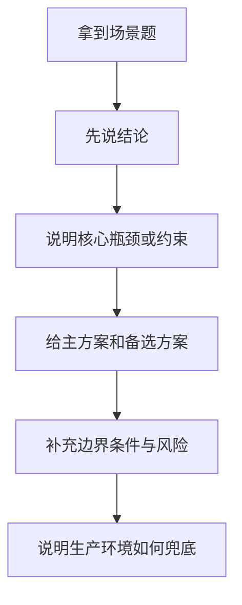
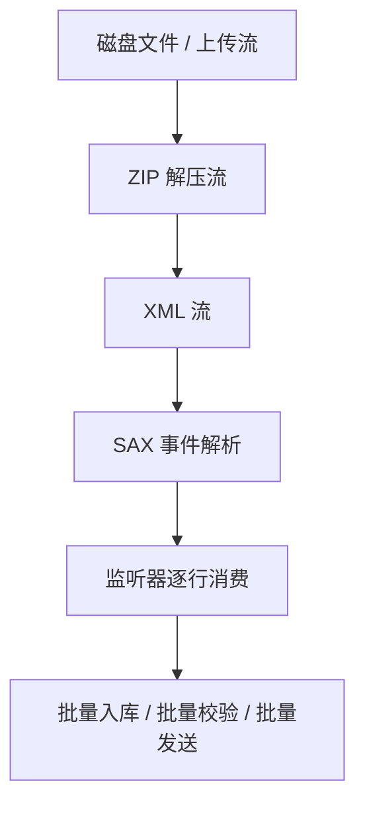
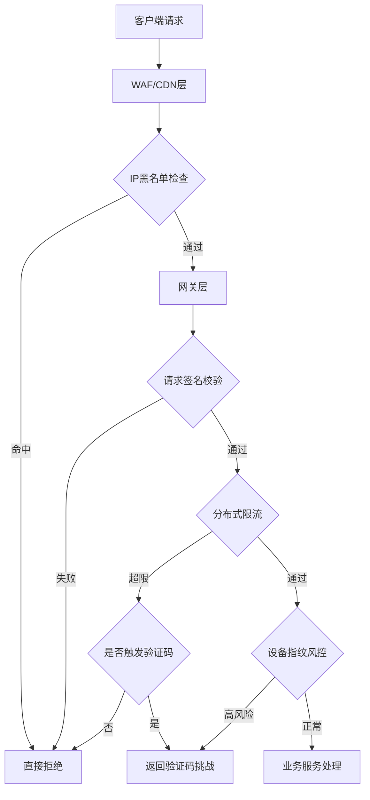
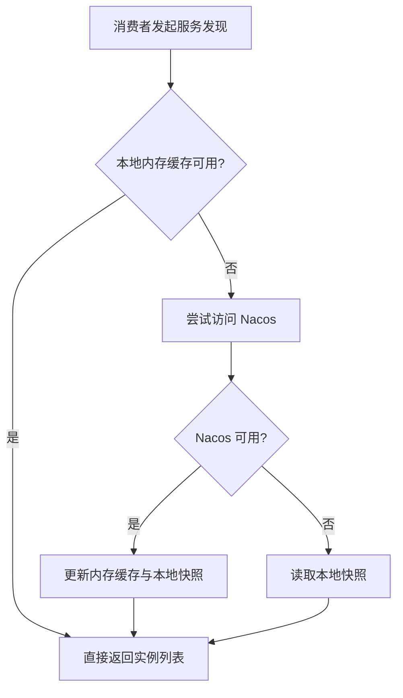
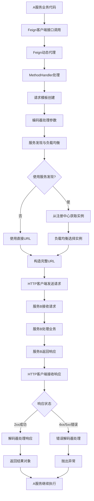
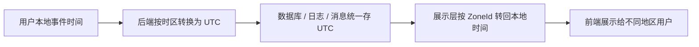
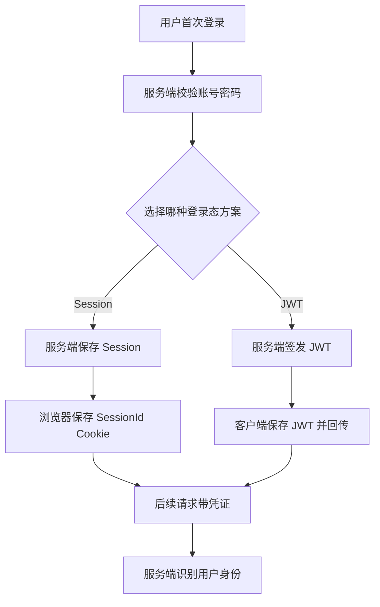

> 这篇笔记的目标不是把零散场景题逐个背答案，而是把高频问题拆成「结论 -> 原理 -> 方案对比 -> 落地细节 -> 风险边界」的回答方式。适合在面试复盘、系统设计梳理和日常查漏补缺时快速建立完整回答框架。
>
> 文章尽量保留原始笔记里的题目与案例，但会把一些容易说糊、说过头或者不够工程化的地方收紧，例如大文件上传、Nacos 容灾、短链接无冲突设计，以及 Cookie / Session / JWT 的关系。阅读时可以先看总方法，再按专题展开。

> 参考资料：
>
> [Spring Framework Reference - Multipart Resolver](https://docs.spring.io/spring-framework/reference/web/webmvc/mvc-servlet/multipart.html)
>
> [Nacos Concepts](https://nacos.io/en/docs/next/v2/concepts/)
>
> [RabbitMQ Delayed Message Plugin](https://github.com/rabbitmq/rabbitmq-delayed-message-exchange/blob/main/README.md)
>
> [RFC 7519 - JSON Web Token (JWT)](https://datatracker.ietf.org/doc/html/rfc7519)

[TOC]

---

## 0. 这类场景题怎么回答

很多场景题真正考的不是“你背过多少方案”，而是你能不能把方案讲成一条完整链路。一个比较稳的回答结构通常如下：

1. 先给一句结论，说明主方案是什么
2. 再解释为什么这样做，核心瓶颈在哪里
3. 然后给方案对比，说明为什么不用其他方案
4. 最后补上边界、风险、降级与兜底手段



如果要把答案说得更像工程实践，可以优先从下面 5 个维度展开：

- 数据规模：是几十万、百万、还是百亿级
- 时效要求：是实时、准实时，还是允许分钟级延迟
- 一致性要求：允许最终一致，还是必须强一致
- 可用性要求：中间件挂了是否还能降级
- 成本约束：能否接受额外中间件、存储、运维复杂度

带着这套框架往下看，后面的每道题会更容易串起来。

---

## 1. 百万级 Excel 导入导出怎么做

先说结论：**核心不是“能不能读 Excel”，而是“能不能按流式方式读写，并且在业务处理阶段及时落库、分批提交、及时释放内存”。** 真正导致 OOM 的，往往不是解析器本身，而是你把所有行先攒进集合里再统一处理。

### 1.1 导入时优先考虑什么

常见可选方案：

1. EasyExcel
2. Apache POI 的 SAX 事件模式
3. 读取后按批处理，不能全量堆内存

如果项目里已经在用 EasyExcel，可以继续沿用；它的核心读取思路本质上也是基于 POI 的事件模型。新项目如果更看重官方生态和可控性，也可以直接使用 Apache POI 的事件模式。

---

### 1.2 为什么大文件读取不会立刻 OOM

`xlsx` 本质上是一个 ZIP 包，里面存了多个 XML。流式读取时，并不会一次性把整个文件和整个 XML 树全部加载到堆里，而是边解压、边解析、边触发事件。



所以内存是否安全，取决于两件事：

- 解析是否是事件驱动、流式的
- 你的业务代码是否把读取结果又重新堆回内存

### 1.3 支持多线程读吗

**单个 sheet 的顺序解析通常不适合直接多线程读取。**

原因是：

- 流式 XML 解析本质上是顺序消费
- 当前行的解析依赖输入流不断向前推进
- 粗暴把一个文件拆成多个线程同时读，通常做不到真正并行，反而更容易把解析状态搞复杂

但下面几种地方可以并行：

- 多个 sheet 彼此独立时，可以按 sheet 并发
- 读取线程负责“解析”，后面的校验、转换、落库可以异步批处理
- 多个独立文件上传时，可以任务级并发

一个更稳的工程化拆法是：**单线程解析 + 有界队列 + 多线程消费处理**。

---

### 1.4 如果 Excel 是通过 HTTP 上传过来的，内存怎么处理

这里最容易说错的一点是：**不要把“接收上传”和“读取 InputStream”理解成一定全程纯内存。**

在 Spring MVC 里，`MultipartResolver` 负责解析 `multipart/form-data` 请求。底层是否使用临时文件、阈值多大、落盘到哪里，本质上取决于 Servlet 容器和 multipart 配置，而不是一句“MultipartFile 一定全在内存”或者“一定全在磁盘”就能概括。

真正要记住的是这两条：

```java
// 不推荐：把整个文件读成 byte[]，会把压力直接打到堆内存
byte[] bytes = file.getBytes();

// 推荐：按流处理，尽快交给 Excel 解析器消费
InputStream inputStream = file.getInputStream();
```

工程上可以分成两层理解：

- 请求接入层：Servlet 容器 / Spring multipart 负责把上传内容解析为 `MultipartFile`
- 业务处理层：你的代码要尽快从 `InputStream` 读取，并以流式方式交给 Excel 解析器

如果文件很大，常见做法是：

1. 接收 `MultipartFile`
2. 获取 `InputStream`
3. 使用流式 Excel 解析器逐行读取
4. 每处理到一定批次就落库或发消息
5. 清空批次缓存，继续下一批

也就是说，**是否 OOM 主要看你有没有做 `byte[]` 全量加载，以及后续业务是否持续堆积对象。**

### 1.5 读取时业务层怎么控内存

无论使用 EasyExcel 还是 POI SAX，真正稳妥的写法通常是这样的：

- 每 500 或 1000 行组成一个批次
- 每批做校验、转换、落库
- 成功后立刻清空集合
- 错误行单独收集，但要给上限，不能无限堆积
- 导入过程记录进度，必要时异步化

一句话记忆：**流式解析只解决“读”的问题，分批处理才解决“用”的问题。**

---

### 1.6 反过来，导出百万级 Excel 怎么做

不推荐直接使用 `XSSFWorkbook`。它会在内存里构建完整工作簿，数据量一大就很容易把堆打爆。

```java
// ❌ 危险：使用POI的XSSFWorkbook
@GetMapping("/export-oom")
public void exportOOM(HttpServletResponse response) {
    Workbook workbook = new XSSFWorkbook(); // 在内存中构建整个Excel
    Sheet sheet = workbook.createSheet("数据");
    
    // 写入100万行数据
    for (int i = 0; i < 1000000; i++) {
        Row row = sheet.createRow(i);
        for (int j = 0; j < 20; j++) {
            row.createCell(j).setCellValue("数据行-" + i + "-列-" + j);
        }
    }

    response.setContentType("application/vnd.ms-excel");
    workbook.write(response.getOutputStream());
}
```

更推荐使用 POI 的 `SXSSFWorkbook`，它只保留一个窗口大小的行在内存里，其余刷到临时文件。

```java
@GetMapping("/export-safe")
public void exportSafe(HttpServletResponse response) throws IOException {
    response.setContentType("application/vnd.ms-excel");
    response.setHeader("Content-Disposition", "attachment; filename=large-file.xlsx");
    
    // 关键：只保留有限行在内存中
    Workbook workbook = new SXSSFWorkbook(100); // 只在内存中保留100行
    Sheet sheet = workbook.createSheet("数据");

    try {
        // 写入表头
        Row headerRow = sheet.createRow(0);
        for (int i = 0; i < 20; i++) {
            headerRow.createCell(i).setCellValue("列头-" + i);
        }
        
        // 流式写入数据
        for (int rowNum = 1; rowNum <= 1000000; rowNum++) {
            Row row = sheet.createRow(rowNum);
            for (int colNum = 0; colNum < 20; colNum++) {
                row.createCell(colNum).setCellValue("数据-" + rowNum + "-" + colNum);
            }
            
            // 每1000行手动刷新一次（可选）
            if (rowNum % 1000 == 0) {
                ((SXSSFSheet) sheet).flushRows(100); // 刷新并保留100行在内存
            }
            
            // 进度跟踪
            if (rowNum % 10000 == 0) {
                log.info("已生成 {} 行数据", rowNum);
            }
        }

        workbook.write(response.getOutputStream());
    } finally {
        // 🎯 重要：清理临时文件
        if (workbook instanceof SXSSFWorkbook) {
            ((SXSSFWorkbook) workbook).dispose();
        }
        workbook.close();
    }
}
```

### 1.7 生产环境再补两点

- 如果只是导出纯表格数据，`CSV` 往往比 `Excel` 更省资源，尤其适合超大数据导出
- 导入导出都要考虑异步化、进度跟踪、失败重试和结果回执，避免把大任务绑死在一次 HTTP 请求里

---

## 2. 接口防刷

### 1、分布式限流

核心思想：在单位时间内限制某个维度（用户/IP/接口）的请求次数

**实现方案对比：**

|算法|原理|优点|缺点|
|:---|:---|:---|:---|
|固定窗口|将时间划分为固定窗口，每个窗口内维护计数器|实现简单|存在临界突刺问题（窗口边界处瞬间可能承受2倍流量）|
|滑动窗口|将窗口再细分为多个小格子，按格子滑动统计|平滑流量，解决临界突刺|内存占用略高，需维护多个格子的计数|
|漏桶|请求进入漏桶排队，以恒定速率流出处理|流量整形，输出平稳|突发流量时延迟高，无法利用空闲容量|
|令牌桶|以恒定速率生成令牌放入桶中，请求需获取令牌|允许一定突发流量，灵活性好|实现相对复杂|

**Redis + Lua 脚本实现滑动窗口限流：**

```lua
-- KEYS[1]: 限流key（如 rate_limit:userId:接口名）
-- ARGV[1]: 窗口大小（毫秒）
-- ARGV[2]: 最大请求数
-- ARGV[3]: 当前时间戳（毫秒）
-- ARGV[4]: 唯一请求标识

local key = KEYS[1]
local window = tonumber(ARGV[1])
local limit = tonumber(ARGV[2])
local now = tonumber(ARGV[3])
local uuid = ARGV[4]

-- 移除窗口外的旧请求
redis.call('ZREMRANGEBYSCORE', key, 0, now - window)

-- 统计当前窗口内请求数
local count = redis.call('ZCARD', key)

if count < limit then
    -- 未超限，添加当前请求
    redis.call('ZADD', key, now, uuid)
    redis.call('PEXPIRE', key, window)
    return 1  -- 放行
else
    return 0  -- 拒绝
end
```

**令牌桶 Lua 实现：**

```lua
-- KEYS[1]: 令牌桶key
-- ARGV[1]: 桶最大容量
-- ARGV[2]: 每秒生成令牌数
-- ARGV[3]: 当前时间戳（秒）
-- ARGV[4]: 请求令牌数（通常为1）

local capacity = tonumber(ARGV[1])
local rate = tonumber(ARGV[2])
local now = tonumber(ARGV[3])
local requested = tonumber(ARGV[4])

local last_time = tonumber(redis.call('HGET', KEYS[1], 'last_time') or now)
local tokens = tonumber(redis.call('HGET', KEYS[1], 'tokens') or capacity)

-- 计算新增令牌数
local elapsed = math.max(0, now - last_time)
local new_tokens = math.min(capacity, tokens + elapsed * rate)

if new_tokens >= requested then
    new_tokens = new_tokens - requested
    redis.call('HSET', KEYS[1], 'tokens', new_tokens)
    redis.call('HSET', KEYS[1], 'last_time', now)
    return 1  -- 放行
else
    redis.call('HSET', KEYS[1], 'tokens', new_tokens)
    redis.call('HSET', KEYS[1], 'last_time', now)
    return 0  -- 拒绝
end
```

> 为什么用 Lua？保证原子性，避免并发下 get + set 的竞态条件

---

### 2、设备指纹识别

核心思想：通过采集客户端多维度信息生成唯一设备标识，即使切换IP/账号也能识别同一设备

**采集维度：**

- 浏览器端：Canvas指纹、WebGL指纹、AudioContext指纹、User-Agent、屏幕分辨率、时区、语言、已安装插件列表、字体列表
- APP端：IMEI/OAID、MAC地址、设备型号、系统版本、安装应用列表
- 综合特征：TCP/IP协议栈指纹（TTL、窗口大小等）

**使用流程：**

```
客户端 --> 采集多维度特征 --> Hash生成设备指纹ID --> 携带在请求Header中
服务端 --> 校验指纹合法性 --> 基于指纹维度做频率控制
```

**风控策略：**

- 同一设备指纹短时间内大量请求 → 触发验证码或临时封禁
- 设备指纹频繁变化（模拟器/篡改工具） → 标记为高风险
- 设备指纹 + 行为分析（请求间隔过于均匀） → 机器人特征

---

### 3、请求签名

核心思想：客户端对请求参数进行签名，服务端验证签名合法性，防止伪造请求和参数篡改

**签名生成流程：**

```
1. 将所有请求参数按key字典序排列
2. 拼接为 key1=value1&key2=value2&... 的字符串
3. 拼接 timestamp + nonce（随机数） + secretKey
4. 对拼接结果做 HMAC-SHA256 签名
5. 将 sign、timestamp、nonce 放入请求Header
```

**服务端校验：**

```java
// 1. 验证 timestamp 是否在允许时间窗口内（如5分钟），防止重放攻击
if (Math.abs(System.currentTimeMillis() - timestamp) > 5 * 60 * 1000) {
    throw new RuntimeException("请求已过期");
}

// 2. 验证 nonce 是否已使用过（Redis记录，TTL=时间窗口），防止重放
if (redis.exists("nonce:" + nonce)) {
    throw new RuntimeException("重复请求");
}
redis.setex("nonce:" + nonce, 300, "1");

// 3. 按相同规则重新计算签名并比对
String serverSign = HmacUtil.sha256(sortedParams + timestamp + nonce, secretKey);
if (!serverSign.equals(clientSign)) {
    throw new RuntimeException("签名校验失败");
}
```

**关键要素：**

- `timestamp`：防止重放攻击（请求过期失效）
- `nonce`：防止同一请求在有效期内被重复提交
- `secretKey`：客户端与服务端约定的密钥，APP可通过SO库存储增加逆向难度

---

### 4、IP 黑名单

**实现层次：**

|层级|方案|特点|
|:---|:---|:---|
|网关层|Nginx `deny` 指令 / WAF 规则|性能最高，请求不到达应用层|
|应用层|拦截器 + Redis 黑名单集合|灵活，可动态增删|
|云厂商|安全组/ACL规则|适合已知恶意IP段|

**动态黑名单策略：**

```
短时间触发限流阈值 → 加入灰名单（要求验证码）
多次触发灰名单 → 加入黑名单（封禁N分钟）
持续恶意行为 → 加入永久黑名单
```

> 注意获取真实IP：需正确解析 `X-Forwarded-For`、`X-Real-IP`，防止通过代理绕过。取第一个非内网IP

---

### 5、行为验证码（人机校验）

触发时机：当用户请求频率异常但未达到直接封禁阈值时，弹出验证码进行人机验证

常见方案：滑块验证、点选验证、无感验证（Google reCAPTCHA v3 评分机制）

---

### 6、网关层面统一防护

在 API Gateway（如 Spring Cloud Gateway、Kong、Nginx）层做统一拦截，避免每个服务重复实现：

- 全局限流 Filter：基于路由/用户/IP维度
- 熔断降级：异常流量直接返回友好提示
- 请求去重：相同请求短时间内只处理一次

---

### 综合防刷架构



> 防刷不是单一策略能解决的，需要多层防护形成纵深防御体系。前端签名防低成本攻击，限流兜底防突发流量，设备指纹+行为分析对抗高级爬虫

---

## 3. Nacos 宕机了，本地是否有服务列表缓存，还能不能正常远程调用

先说结论：**能不能继续调用，取决于客户端手里是否还有可用的服务实例缓存，以及这段时间服务拓扑有没有变化。**

更准确一点说：

- 如果消费者本地内存和本地快照里还有旧的实例列表，且这些实例仍然活着，那么调用通常还能继续
- 如果此时服务实例发生上下线、扩缩容、IP 漂移、重启迁移，消费者拿到的可能就是过期数据，调用成功率会下降
- 如果消费者刚启动，而 Nacos 又不可用，那么它可能连第一份可用服务列表都拿不到

所以这道题不能简单回答成“宕机了也完全没事”，更稳的说法是：**短时间内通常具备容灾能力，但对实例变更不再敏感。**

### 3.1 服务发现为什么还能抗一段时间

Nacos Naming 客户端通常会同时持有两类数据：

- 进程内缓存：当前正在使用的 `ServiceInfo`
- 本地快照：用于服务端异常时的灾备数据



这也是为什么 Nacos 挂掉后，很多系统并不会立刻全线不可用。

### 3.2 真正的风险点是什么

真正的问题不在“有没有缓存”，而在“缓存会不会过期”：

- 提供者实例下线了，但消费者还在用旧地址
- 新实例已经扩出来了，但消费者不知道，负载无法打到新实例
- 某些实例健康状态变化了，但本地缓存没及时更新

所以一旦 Nacos 不可用，系统就从“动态服务发现”退化成“基于旧快照的静态调用”。

### 3.3 配置中心和服务发现要分开理解

这一点很容易混在一起。

**服务发现（Naming）** 更关注：

- 实例列表查询
- 健康状态变化
- 客户端本地缓存与快照容灾

**配置管理（Config）** 更关注：

- 配置内容获取
- 本地快照与容灾文件
- 配置变更的最终一致性

可以简单记忆为：

- Naming 更偏“地址发现”
- Config 更偏“参数下发”

### 3.4 面试里更完整的回答方式

如果面试官问“`Nacos` 宕机后还能不能调”，一个更稳的回答是：

> Nacos 客户端一般会有本地内存缓存和本地快照，所以注册中心短时间不可用时，消费者往往还能继续基于旧实例列表发起调用。  
> 但这种可用性是有边界的，它依赖于服务实例没有发生明显变更。只要出现扩缩容、实例下线、节点迁移，缓存就可能过期，调用成功率会逐渐下降。  
> 所以严格来说，Nacos 宕机并不等于服务立即不可用，而是系统会退化到“使用旧数据继续工作”的容灾状态。

---

## 4. OpenFeign 如何使用，A 服务调用 B 服务发生了哪些事

总结：代理实现，拦截器帮助构造调用模版，发送http请求



---

## 5. 加密后的数据如何模糊查询

|类型|特点|常见算法|
|:---|:---|:---|
|可逆加密  |加密后可解密还原|AES、DES、RSA、SM4|
|不可逆加密  |加密后不可还原|MD5、SHA、bcrypt、SM3|

可逆加密算法（对称/非对称）

对称：加密解密使用相同密钥：AES、DES、SM4
非对称：公钥加密，私钥解密：RSA、ECC

---

### 方案一：分词加密 + 密文索引（主流方案）

核心思想：将明文按规则拆分为多个子串，分别加密后存储，查询时同样分词加密后匹配

**存储流程：**

```
原始数据: "张三丰"
↓ 分词（如每2个字一组）
分词结果: ["张三", "三丰", "张三丰"]
↓ 对每个分词单独加密（如 HmacSHA256）
加密结果: ["a3f2...", "b7c1...", "e9d4..."]
↓ 存入密文索引字段（如用逗号拼接或存入关联表）
```

**查询流程：**

```
查询条件: "三丰"
↓ 同样分词+加密
加密后: "b7c1..."
↓ SQL: WHERE cipher_index LIKE '%b7c1...%'
    或 WHERE id IN (SELECT data_id FROM cipher_index_table WHERE token = 'b7c1...')
```

**分词策略选择：**

|策略|示例（“张三丰”）|适用场景|
|:---|:---|:---|
|固定长度N-gram|张三、三丰|中文姓名、短文本|
|滑动窗口|张、三、丰、张三、三丰、张三丰|需要任意子串匹配|
|按分隔符|如手机号每4位一组|结构化数据（手机号、身份证号）|

> 注意：分词粒度越细，索引越大，查询越灵活；粒度越粗，存储越小，但只能匹配特定长度的关键词

**代码示例：**

```java
// 分词工具
public static List<String> tokenize(String plainText, int gramSize) {
    List<String> tokens = new ArrayList<>();
    for (int i = 0; i <= plainText.length() - gramSize; i++) {
        tokens.add(plainText.substring(i, i + gramSize));
    }
    // 加上全文本本身
    tokens.add(plainText);
    return tokens;
}

// 加密分词
public static List<String> encryptTokens(List<String> tokens, String secretKey) {
    return tokens.stream()
        .map(t -> HmacUtil.sha256(t, secretKey))
        .distinct()
        .collect(Collectors.toList());
}
```

---

### 方案二：明密文映射表（独立服务）

思路：建立独立的映射服务，存储【脱敏后的模糊查询字段 → 数据主键ID】的映射关系

```
查询服务 --> 映射服务（独立库，严格权限控制） --> 返回ID列表 --> 业务库查密文并解密
```

优点：查询效率高，支持完整的 LIKE 语义

缺点：映射表存储了部分明文信息，需从架构层面收口安全（独立服务+独立数据库+严格 ACL）

---

### 方案三：同态加密（理论方案，工程化尚不成熟）

同态加密允许在密文上直接计算，解密后结果等价于对明文计算。理论上可以实现密文上的模糊匹配，但当前性能开销极大，不适合生产环境

---

### 方案对比

|方案|安全性|查询性能|实现复杂度|适用场景|
|:---|:---|:---|:---|:---|
|分词加密索引|高（不可逆）|中（依赖分词粒度）|中|姓名、手机号、地址等短文本|
|明密文映射表|中（需架构保护）|高|低|对查询性能要求极高的场景|
|同态加密|极高|极低|极高|暂不适合生产|

---

## 6. 电商平台中订单未支付过期如何实现自动关单？

场景：用户下单后30分钟未支付，系统自动取消订单并释放库存

---

### 方案一：定时任务扫描（简单粗暴）

定时扫描数据库中超时未支付的订单，批量关单。

```java
@Scheduled(fixedRate = 60000) // 每分钟扫描一次
public void closeExpiredOrders() {
    List<Order> expiredOrders = orderMapper.selectExpiredUnpaidOrders(
        OrderStatus.UNPAID, 
        LocalDateTime.now().minusMinutes(30)
    );
    for (Order order : expiredOrders) {
        closeOrder(order);
    }
}
```

```sql
SELECT * FROM orders 
WHERE status = 'UNPAID' 
  AND create_time < NOW() - INTERVAL 30 MINUTE
LIMIT 500;
```

**优点：** 实现简单，无额外中间件依赖

**缺点：**
- 时效性差：最大延迟 = 扫描间隔（如每分钟扫描，最多延迟1分钟）
- 数据库压力大：订单量大时频繁全表扫描影响性能
- 空扫描浪费：大部分时间可能无过期订单

---

### 方案二：RabbitMQ 延迟队列（主流方案）

利用 RabbitMQ 的 TTL + 死信队列（DLX）实现精准延迟。

```
生产者 --发送订单消息(TTL=30min)--> 延迟队列 --过期转发--> 死信队列 --消费--> 关单处理器
```

```java
// 下单时发送延迟消息
public void createOrder(Order order) {
    orderMapper.insert(order);
    // 发送延迟消息，TTL 30分钟
    rabbitTemplate.convertAndSend("order.delay.exchange", "order.delay.key", 
        order.getOrderId(),
        message -> {
            message.getMessageProperties().setExpiration("1800000"); // 30min
            return message;
        });
}

// 死信队列消费者：处理过期订单
@RabbitListener(queues = "order.close.queue")
public void handleExpiredOrder(String orderId) {
    Order order = orderMapper.selectById(orderId);
    if (order != null && order.getStatus() == OrderStatus.UNPAID) {
        closeOrder(order);
    }
}
```

> RabbitMQ 3.8+ 支持原生延迟消息插件 `rabbitmq_delayed_message_exchange`，无需手动配置 DLX

**优点：** 时效性精准，无数据库扫描压力，解耦彻底

**缺点：** 依赖 MQ 可用性，消息堆积时占用内存

---

### 方案三：RocketMQ 延迟消息

RocketMQ 原生支持延迟消息（固定等级）。

```java
// 发送延迟消息（等级 16 ≈ 30分钟）
Message msg = new Message("ORDER_CLOSE_TOPIC", orderId.getBytes());
msg.setDelayTimeLevel(16); // 1s 5s 10s 30s 1m 2m 3m 4m 5m 6m 7m 8m 9m 10m 20m 30m 1h 2h
producer.send(msg);
```

> RocketMQ 5.x 支持任意时间精度的延迟消息

**优点：** 原生支持，配置简单，性能高

**缺点：** 固定延迟等级不够灵活（5.x之前）

---

### 方案四：Redis 过期事件通知 / Redisson 延迟队列

#### 4.1 Redis Key 过期事件

利用 Redis 的 keyspace notification，设置 key TTL，过期时触发回调。

```bash
# 开启过期事件通知
config set notify-keyspace-events Ex
```

```java
// 下单时设置 key
redisTemplate.opsForValue().set("order:expire:" + orderId, orderId, 30, TimeUnit.MINUTES);

// 监听过期事件
@Component
public class OrderExpireListener extends KeyExpirationEventMessageListener {
    @Override
    public void onMessage(Message message, byte[] pattern) {
        String key = message.toString();
        if (key.startsWith("order:expire:")) {
            String orderId = key.replace("order:expire:", "");
            closeOrder(orderId);
        }
    }
}
```

**缺陷：** Redis 过期事件是“最多一次”语义，不保证可靠性，服务宕机时事件会丢失

#### 4.2 Redisson 延迟队列（推荐）

```java
RBlockingDeque<String> blockingDeque = redissonClient.getBlockingDeque("order-close-queue");
RDelayedQueue<String> delayedQueue = redissonClient.getDelayedQueue(blockingDeque);

// 下单时加入延迟队列
delayedQueue.offer(orderId, 30, TimeUnit.MINUTES);

// 消费端阻塞获取
new Thread(() -> {
    while (true) {
        String orderId = blockingDeque.take();
        closeOrder(orderId);
    }
}).start();
```

**优点：** 基于 Redis 实现，轻量级，支持分布式

**缺点：** 依赖 Redis 可用性，消息量大时占用内存

---

### 方案五：时间轮算法（HashedWheelTimer）

基于内存的时间轮，适合单机应用。Netty 的 `HashedWheelTimer` 是典型实现。

```java
HashedWheelTimer timer = new HashedWheelTimer(1, TimeUnit.SECONDS, 512);

// 下单时添加延迟任务
timer.newTimeout(timeout -> {
    closeOrder(orderId);
}, 30, TimeUnit.MINUTES);
```

**优点：** 精度高，性能好，无外部依赖

**缺点：** 纯内存，服务重启任务丢失，不支持分布式

---

### 方案六：JDK 原生 DelayQueue

`DelayQueue` 是 Java 并发包提供的延迟阻塞队列，元素到期后才能被消费者取出，适合在单机应用中实现简单的延迟关单。

```java
public class OrderDelayTask implements Delayed {
    private final String orderId;
    private final long executeTime;

    public OrderDelayTask(String orderId, long delay, TimeUnit unit) {
        this.orderId = orderId;
        this.executeTime = System.currentTimeMillis() + unit.toMillis(delay);
    }

    public String getOrderId() {
        return orderId;
    }

    @Override
    public long getDelay(TimeUnit unit) {
        long diff = executeTime - System.currentTimeMillis();
        return unit.convert(diff, TimeUnit.MILLISECONDS);
    }

    @Override
    public int compareTo(Delayed other) {
        return Long.compare(this.executeTime, ((OrderDelayTask) other).executeTime);
    }
}

private final DelayQueue<OrderDelayTask> delayQueue = new DelayQueue<>();

// 下单时放入延迟任务
public void createOrder(Order order) {
    orderMapper.insert(order);
    delayQueue.offer(new OrderDelayTask(order.getOrderId(), 30, TimeUnit.MINUTES));
}

// 启动消费线程
@PostConstruct
public void startConsumer() {
    Executors.newSingleThreadExecutor().submit(() -> {
        while (true) {
            OrderDelayTask task = delayQueue.take();
            closeOrder(task.getOrderId());
        }
    });
}
```

**优点：** JDK 原生支持，实现简单，无需引入额外中间件

**缺点：** 仅适合单 JVM，服务重启后任务丢失，不支持分布式扩展

> 本质上它和时间轮一样都偏向内存方案，只是 `DelayQueue` 更通用直观，时间轮在大规模定时任务场景下通常更节省调度开销

---

### 方案七：XXL-JOB / 分布式任务调度

结合分布式任务调度框架，定时批量扫描关单，相比简单定时任务支持分片、失败重试、监控告警。

```java
@XxlJob("closeExpiredOrderHandler")
public void closeExpiredOrder() {
    // 支持分片参数，按 orderId % shardTotal == shardIndex 分配
    int shardIndex = XxlJobHelper.getShardIndex();
    int shardTotal = XxlJobHelper.getShardTotal();
    
    List<Order> orders = orderMapper.selectExpiredOrders(shardIndex, shardTotal);
    for (Order order : orders) {
        closeOrder(order);
    }
}
```

**优点：** 支持分片并行、失败重试、可视化管理

**缺点：** 本质还是扫描，时效性受调度频率限制

---

### 关单操作流程

```bash
检查订单状态（是否仍为未支付）
↓
修改订单状态为“已关闭”
↓
释放库存（回滚库存扣减）
↓
释放优惠券/积分（如果占用了）
↓
通知用户（可选）
```

> 注意：关单操作需要幂等性保证，防止重复关单（先检查状态再操作）

---

### 方案对比

| 方案 | 时效性 | 可靠性 | 分布式支持 | 实现复杂度 | 适用场景 |
| --- | --- | --- | --- | --- | --- |
| 定时任务扫描 | 低（取决于扫描频率） | 高 | 需额外处理 | 低 | 订单量小、对时效要求不高 |
| RabbitMQ 延迟队列 | 高（精确） | 高（持久化） | 支持 | 中 | **生产环境主流方案** |
| RocketMQ 延迟消息 | 高 | 高 | 支持 | 低 | 已使用 RocketMQ 的项目 |
| Redis 过期事件 | 高 | **低（不可靠）** | 支持 | 低 | 不推荐用于核心业务 |
| Redisson 延迟队列 | 高 | 中 | 支持 | 低 | 轻量级方案，已使用 Redis |
| 时间轮算法 | 高（精确） | **低（重启丢失）** | 不支持 | 低 | 单机、非核心业务 |
| JDK DelayQueue | 高（精确） | **低（重启丢失）** | 不支持 | 低 | 单机应用、轻量级延迟任务 |
| XXL-JOB 分布式扫描 | 中 | 高 | 支持 | 中 | 订单量大，需要分片并行处理 |

---

### 生产环境推荐组合

**延迟消息（主路径） + 定时任务扫描（兜底补偿）**

1. 主流程：下单时发送延迟消息，到期后触发关单
2. 兜底：定时任务每 5 分钟扫描一次，处理消息丢失或消费失败的漏网订单

> 这样既保证了时效性，又保证了最终一致性

---

---

## 7. 短 URL 生成器设计：百亿短 URL 怎样做到无冲突？
### 核心需求

- 给定一个长 URL，生成一个唯一的短码（通常 6~8 位），映射为短链接如 `https://s.cn/Ab3xKz`
- 百亿级别数据量下，保证**不冲突**
- 短码尽量短、不可预测、支持高并发写入与读取

---

### 方案一：哈希 + 冲突检测

**原理**：对长 URL 做哈希（如 MD5/MurmurHash），取前 N 位作为短码

```text
长URL → Hash函数 → 取前6~8位 → 查库判重 → 若冲突则拼接salt重新Hash
```

**优点**：实现简单，同一长URL可生成相同短码（天然去重）

**缺点**：
- 哈希碰撞概率随数据量增大而升高，百亿级下碰撞频繁
- 冲突检测依赖DB查询，高并发下性能瓶颈
- 多次重试增加延迟

---

### 方案二：自增ID + Base62 编码

**原理**：全局自增ID（数据库自增/分布式ID生成器），将数字转为 Base62 编码作为短码

```text
Base62字符集：[0-9a-zA-Z]，共62个字符
6位短码：62^6 ≈ 568亿，足够百亿量级
7位短码：62^7 ≈ 3.5万亿
```

**为什么选 Base62 而不是 Base64？**

Base64 字符集包含 `+`、`/`、`=`，这些在 URL 中都是特殊字符：

| 字符 | URL中的问题 |
|------|------|
| `+` | 被解析为空格，需编码为 `%2B` |
| `/` | 被解析为路径分隔符，导致路由错误 |
| `=` | query参数中的键值分隔符，造成歧义 |

即使使用 URL-safe Base64（用 `-` 替换 `+`，`_` 替换 `/`），`-` 和 `_` 在双击选中、部分短信客户端解析时仍可能被截断。而多出的 2 个字符对编码空间的提升不到 7%（64⁶ vs 62⁶），收益极小。

> **结论**：Base62 = 纯字母数字 = 在 URL、短信、邮件、二维码、命令行等**任何场景**下都无需转义，是短链接的最优编码选择。

**Base62 编码转换细节**：

将十进制数字不断除以 62 取余，余数映射到字符表，直到商为 0，最后反转结果：

```java
private static final String CHARS = "0123456789abcdefghijklmnopqrstuvwxyzABCDEFGHIJKLMNOPQRSTUVWXYZ";

public static String toBase62(long num) {
    StringBuilder sb = new StringBuilder();
    while (num > 0) {
        sb.append(CHARS.charAt((int)(num % 62)));
        num /= 62;
    }
    // 不足6位则左侧补'0'（字符表第0位）
    while (sb.length() < 6) {
        sb.append('0');
    }
    return sb.reverse().toString();
}
```

```text
转换示例：
ID = 1000000000（10亿）
1000000000 % 62 = 16 → 'g'     商=16129032
  16129032 % 62 = 42 → 'G'     商=260145
    260145 % 62 = 55 → 'T'     商=4195
      4195 % 62 = 41 → 'F'     商=67
        67 % 62 = 5  → '5'     商=1
         1 % 62 = 1  → '1'     商=0，结束
取余序列：g G T F 5 1 → 反转得到短码 "15FTGg"（6位）
```

```text
更直观的换算：
  62^5 = 916,132,832（约9.16亿）  → 对应5位短码上限
  62^6 = 56,800,235,584（约568亿）→ 对应6位短码上限

所以：
  ID < 9.16亿     → 5位（左补零凑6位）
  9.16亿 ≤ ID < 568亿 → 天然6位
```

**流程**：
```text
长URL → 分配全局唯一自增ID → Base62(ID) → 6位短码
例：ID = 56800235584 → Base62编码 → "100000"（刚好6位进位）
例：ID = 10000000000 → Base62编码 → "aUKYOa"（6位）
```

**优点**：
- **天然无冲突**：ID唯一 → 短码唯一
- 生成速度快，无需查重
- 短码有序递增（可选混淆处理）

**缺点**：
- 短码可预测（需混淆解决，见下方）
- 分布式环境下需要高性能ID生成器
- 同一长URL多次请求生成不同短码（需额外去重表）

---

**解决自增 ID 可预测问题**：

自增 ID 直接编码虽然天然无冲突，但也会带来“相邻短码可推测”的问题。这里要注意一个常见误区：**不要随手写一个看起来很随机的位运算函数，就默认它既安全又可逆。**

生产环境更稳妥的做法通常有三类：

**方式一：保留映射表，只要求外部短码不可读懂**

也就是：

```text
唯一ID -> 经过编码/混淆得到短码 -> 落库保存 <shortCode, longUrl, id>
```

这样读取时按 `shortCode` 查库即可，不要求从短码反推出原始 ID，工程上最简单稳妥。

**方式二：使用成熟的可逆短码方案**

例如基于固定字母表和盐值的编码方案，或者可逆置换 / Feistel 网络这类“明确设计过可逆性”的算法。重点不是“看起来随机”，而是：

- 编码空间可控
- 冲突规则清晰
- 可逆性或映射关系明确
- 不会因为自己手写算法而引入隐藏碰撞或解码错误

**方式三：对外只暴露短码，不暴露顺序语义**

即使底层 ID 是递增的，也不要让短码直接等价映射成“肉眼可推断的序列”。如果业务对安全性要求更高，还要配合：

- 接口限流
- 黑白名单
- 风控校验
- 敏感短链鉴权

一句话记忆：**短链接的“无冲突”和“不可预测”是两个问题，前者靠唯一 ID 体系解决，后者靠编码策略或映射策略解决。**

**方式四：位运算混淆（推荐，性能最优）**

对自增ID做可逆的位混淆，打乱ID的数值分布，但仍可逆（不影响解码）：

```java
// 混淆：连续的ID → 看似随机的数字
public static long obfuscate(long id) {
    id = ((id >> 16) ^ id) * 0x45d9f3b37197L;
    id = ((id >> 16) ^ id) * 0x45d9f3b37197L;
    id = (id >> 16) ^ id;
    return id & 0x7FFFFFFFL; // 取31位，确保正数且在6位Base62范围内
}

// 反混淆：还原原始ID（用于调试，线上一般不需要）
public static long deobfuscate(long id) {
    id = ((id >> 16) ^ id) * 0x119de1f3L;
    id = ((id >> 16) ^ id) * 0x119de1f3L;
    id = (id >> 16) ^ id;
    return id;
}
```

效果：ID=1 → 混淆后=29847162，ID=2 → 混淆后=85019377，完全看不出递增关系

---

**查询性能与预生成策略**：

短链接系统是典型的**读多写少**（读写比可达 100:1），必须保证读取极快：

```text
读取路径：短码 → 查缓存 → 未命中则查DB → 回填缓存 → 302重定向
```

**性能保障手段**：

| 层次 | 手段 | 说明 |
|------|------|------|
| 缓存层 | Redis 存热点映射 | 短码→长URL，TTL按访问频率动态调整 |
| 存储层 | 短码作为主键/分片键 | 短码本身就是查询条件，主键查询 O(1) |
| 预热层 | 写入时同步写缓存 | 新生成的短码立即可被高速读取 |
| 兜底层 | 本地缓存（Caffeine） | 防止 Redis 故障时雪崩 |

**是否需要预生成？**

> 在自增ID方案中，**不强制需要预生成短码**，但建议**预分配ID号段**：

```text
方案：号段模式（Leaf-Segment）

┌──────────────┐
│  DB号段表     │  存储：biz_tag | max_id | step
└──────┬───────┘
       │ 每次取一个号段（如 step=1000）
       ▼
┌──────────────┐
│ 本地号段缓存  │  内存中持有 [current_id, max_id]
│ 双Buffer轮换  │  Buffer1耗尽前，异步加载Buffer2
└──────┬───────┘
       │ 本地自增分配，无网络开销
       ▼
    返回唯一ID → Base62编码 → 短码
```

- **写入性能**：本地内存分配ID，无需每次访问DB/Redis，QPS可达数十万
- **高可用**：双Buffer机制，一个号段快用完时异步预加载下一个，零等待
- **容灾**：即使DB短暂不可用，本地号段仍可继续服务

---

**ID生成器选型**：

| 方案 | 特点 | 适用场景 |
|------|------|------|
| 数据库自增 | 简单，但单点瓶颈，写扩展性差 | 小规模、低并发 |
| 号段模式（Leaf-Segment） | 批量取号段缓存本地，高性能，推荐 | 百亿级短链接（主流选择） |
| Snowflake | 分布式无中心依赖，但ID 64位较长 | 需全局唯一且无中心节点 |
| Redis INCR | 高性能，但需持久化保障、存在单点 | 中等规模，已有Redis基础设施 |

---

### 方案三：预生成短码 + 发号器

**原理**：离线预先生成大量短码存入库/缓存，在线请求时直接"领取"一个

```text
离线任务 → 批量生成短码（随机或顺序）→ 存入未使用池
请求到来 → 从池中取一个 → 绑定长URL → 移入已使用池
```

**优点**：
- 在线路径极快，O(1) 取码
- 天然无冲突（预生成时已去重）
- 短码无规律，安全性好

**缺点**：
- 需要维护"短码池"的生成与补充
- 存储开销较大（百亿短码需预先存储）
- 系统复杂度高

---

### 方案四：哈希 + 布隆过滤器去重

**原理**：哈希生成短码后，用布隆过滤器快速判重，冲突时换盐重试

```text
长URL → Hash → 短码候选 → BloomFilter判断是否已存在
  ↓ 不存在 → 写入DB + BF
  ↓ 存在   → 加盐重试
```

**优点**：
- 去重速度极快（布隆过滤器 O(1)）
- 内存占用远小于全量数据存储

**缺点**：
- 布隆过滤器有误判率（可调参降低）
- 百亿级下 BF 内存仍可观（约10~20GB）
- 不支持删除（可用 Counting Bloom Filter）

---

### 方案对比总结

| 维度 | 哈希+冲突检测 | 自增ID+Base62 | 预生成发号器 | 哈希+布隆过滤器 |
|------|:---:|:---:|:---:|:---:|
| **无冲突保证** | ❌ 需重试 | ✅ 天然无冲突 | ✅ 预去重 | ⚠️ 极低概率误判 |
| **生成性能** | 中（可能多次重试） | 高 | 极高（O(1)取码） | 高 |
| **实现复杂度** | 低 | 中 | 高 | 中 |
| **可预测性** | 不可预测 | 可预测（需混淆） | 不可预测 | 不可预测 |
| **同URL去重** | 天然支持 | 需额外去重表 | 需额外去重表 | 天然支持 |
| **百亿级适用性** | ❌ 碰撞严重 | ✅ 推荐 | ✅ 推荐 | ✅ 可用 |
| **存储开销** | 低 | 低 | 高（预存短码池） | 中（BF内存） |

---

### 推荐方案：自增ID + Base62（工业界主流）

**完整架构**：

```text
客户端请求
  ↓
应用层：接收长URL
  ↓
去重层：查 <长URL → 短码> 映射表（可选，避免重复生成）
  ↓ 未命中
ID生成层：号段模式 / Snowflake 生成唯一ID
  ↓
编码层：Base62(ID) → 短码，可加位运算混淆
  ↓
存储层：写入 <短码, 长URL> 映射到 DB
  ↓
缓存层：热点短码缓存到 Redis
```

**防可预测优化**：推荐使用成熟的编码 / 映射策略，而不是随手写一段“看起来随机”的混淆代码。只要能稳定实现 `shortCode -> longUrl` 查询，工程上就不一定要求从短码反解出原始自增 ID。

对自增ID做简单位运算混淆

```java
// 简单的位混淆：让连续ID映射到看似随机的短码
public long obfuscate(long id) {
    id = ((id >> 16) ^ id) * 0x45d9f3b;
    id = ((id >> 16) ^ id) * 0x45d9f3b;
    id = (id >> 16) ^ id;
    return id & 0xFFFFFFFFL; // 取低32位
}
```

**读取流程（302重定向）**：

```text
用户访问 https://s.cn/Ab3xKz
  ↓
Redis查缓存 → 命中则302重定向
  ↓ 未命中
DB查映射 → 回填缓存 → 302重定向
```

---

### 扩展思考

**Q：短链接要不要过期？**

> 可以按业务设置过期时间，但通常**不建议轻易复用已经发放过的短码**。因为历史分享、浏览器缓存、搜索引擎索引、短信记录都可能还保留旧链接，复用后容易把流量导向错误目标。

**Q：如何防止恶意刷短链接？**

> 限流 + 鉴权 + 同一长URL去重

**Q：302 还是 301 重定向？**

> - 301（永久重定向）：浏览器缓存，减少服务端压力，但无法统计点击量
> - 302（临时重定向）：每次请求都经过服务端，可统计、可更改目标URL
> - **推荐302**：便于统计和运营

## 8. 有个产品是面向全球的，那它的日期管理是怎么设计的呢？时区如何处理

### 核心问题

如果产品面向全球，时间处理一定不能只按北京时间来设计，否则会出现很多问题：

- 美国用户看到的订单时间和本地实际时间不一致
- 活动“今晚 8 点开始”在不同国家不是同一个时刻
- 跨时区会议、航班、酒店入住等场景容易出现错乱
- 夏令时切换时，某些本地时间会重复或者直接不存在

所以这类系统的核心原则通常就一句话：

**存储统一 UTC，展示按用户时区转换，业务计算先区分“绝对时间”还是“自然日”。**

先把 `UTC` 讲清楚，不然后面会越看越糊：

- `UTC` 可以理解为全球统一的标准时间基准
- 它不是某个国家的“本地时间”，而是一条全世界对齐的时间轴
- 各国本地时间，本质上都是在 `UTC` 的基础上加减偏移量得到的

例如：

- 北京时间 = `UTC+8`
- 东京时间 = `UTC+9`
- 纽约时间会随夏令时变化，可能是 `UTC-5` 或 `UTC-4`

比如这个时间：

```text
2026-06-12T12:00:00Z
```

它的含义是：

- `2026-06-12`
- `12:00:00`
- `Z` 表示这是 `UTC` 时间

如果把它换算到各地：

- 北京时间：`2026-06-12 20:00:00`
- 东京时间：`2026-06-12 21:00:00`
- 纽约时间：`2026-06-12 08:00:00`（假设当时是夏令时，UTC-4）

所以你可以把 `UTC` 理解成：

> 后端和数据库内部统一使用的“标准时间刻度”。

这样无论用户在上海、纽约还是伦敦，系统内部都先记同一个时间点，再在展示时换算成用户本地时间。



### 一、时间管理设计原则

#### 1. 存储层统一使用 UTC

数据库、消息队列、缓存、日志中的时间，统一存 UTC 时间，避免服务部署在不同国家后时间含义不一致。

例如：

- 订单创建时间：存 `2026-06-12T08:00:00Z`
- 支付时间：存 `Instant`
- 日志时间：统一 UTC，排查问题更容易对齐

Java 技术栈里建议优先使用：

- `Instant`：表示绝对时间点，最适合存储和传输
- `OffsetDateTime`：带偏移量的时间，适合接口传输
- `ZonedDateTime`：带时区规则的时间，适合做展示和业务换算

不建议在核心链路里大量使用 `java.util.Date` 和 `Calendar`。

#### 2. 展示层按用户时区转换

用户看到的时间，应该根据用户自己的时区来展示，而不是根据服务器时区。

比如同一个 UTC 时间：

```text
2026-06-12T12:00:00Z
```

转换后：

- 上海用户看到：`2026-06-12 20:00:00`
- 纽约用户看到：`2026-06-12 08:00:00`
- 伦敦用户看到：`2026-06-12 13:00:00`

因此，用户维度通常需要保存：

- `locale`：语言和地区，如 `zh-CN`、`en-US`
- `timeZone`：IANA 时区，如 `Asia/Shanghai`、`America/New_York`

注意，这里要保存 **时区 ID**，不要只保存 `GMT+8` 这种固定偏移量，因为它无法正确处理夏令时。

#### 3. 业务上区分“绝对时间”与“自然日”

这是面试里很容易追问的一点。

有两类时间需求：

**第一类：绝对时间**

比如：

- 订单创建时间
- 支付完成时间
- 消息发送时间
- 秒杀开始时间

这类时间本质是“世界统一时刻”，存 UTC 即可。

**第二类：自然日 / 本地时间**

比如：

- 每天 0 点发优惠券
- 当地时间晚上 8 点开始促销
- 酒店入住日期是 `2026-06-12`
- 用户生日是 `1998-10-01`

这类数据不能只存一个 UTC 时间点，还要结合用户所在时区，甚至直接保存 `LocalDate`。

比如“纽约时间每天 00:00 过期”，就必须基于 `America/New_York` 计算，而不是简单按 UTC 零点处理。

### 二、数据库如何设计

#### 方案一：统一存 UTC 时间点

适用于订单、支付、操作日志、消息事件等。

这类场景里，你作为 Java 开发，真正要落库的核心字段通常是：

- 业务主键：如 `id`
- 归属用户：如 `user_id`
- 绝对时间：如 `created_at`、`paid_at`，统一存 UTC
- 下单时用户时区：如 `user_time_zone`，用于展示和审计

不要存这些东西：

- 不要存“展示给用户看的时间字符串”
- 不要存“`2026-06-12 20:00:00` 但不带时区含义”的模糊时间
- 不要只存 `GMT+8`

表设计示例：

```sql
create table t_order (
    id bigint primary key,
    user_id bigint not null,
    created_at datetime(3) not null comment 'UTC时间',
    paid_at datetime(3) null comment 'UTC时间',
    user_time_zone varchar(64) null comment '用户时区，如Asia/Shanghai'
);
```

对应的 Java 实体建议这样建模：

```java
import java.time.Instant;

public class OrderDO {
    private Long id;
    private Long userId;
    private Instant createdAt;    // 数据库存 UTC 时间
    private Instant paidAt;       // 数据库存 UTC 时间
    private String userTimeZone;  // Asia/Shanghai、America/New_York
}
```

这里的核心是：

- `createdAt`、`paidAt` 用 `Instant`
- `userTimeZone` 单独存时区 ID
- 展示给前端时，再根据 `userTimeZone` 转成本地时间

这里建议：

- `created_at`、`paid_at` 统一按 UTC 写入
- `user_time_zone` 保存用户下单时的时区，方便后续审计和展示

很多团队会选 `datetime(3)` 存 UTC，而不是完全依赖 MySQL `timestamp` 自动时区转换，原因是 `timestamp` 范围较小，而且数据库会话时区配置不一致时容易踩坑。

#### 为什么这种设计适合排序

因为 UTC 时间是全局唯一时间轴，所以：

- 按创建时间倒序：直接 `order by created_at desc`
- 查最近 1 小时订单：直接按 UTC 时间范围查
- 查支付耗时最长订单：直接用 `paid_at - created_at`

这些场景都不需要关心用户在哪个国家，排序和比较都天然成立。

例如：

```sql
select *
from t_order
where created_at >= '2026-06-12 00:00:00'
  and created_at < '2026-06-13 00:00:00'
order by created_at desc;
```

所以对于“按时间排序”“按时间区间筛选”，**绝对时间统一存 UTC 是最好做索引、最好做范围查询的。**

#### 如果要按用户本地日期筛选，怎么做

这才是很多人容易踩坑的地方。

比如需求是：

> 查询“纽约用户 2026-06-12 当天创建的订单”

正确做法不是在 SQL 里直接对 `created_at` 做时区转换函数，而是：

1. 先拿到用户时区 `America/New_York`
2. 计算出这个“本地自然日”对应的 UTC 起止时间
3. 再用 `created_at >= startUtc and created_at < endUtc` 查询

Java 示例：

```java
import java.time.Instant;
import java.time.LocalDate;
import java.time.ZoneId;
import java.time.ZonedDateTime;

public class TimeRangeHelper {

    public static Instant startOfDayUtc(LocalDate localDate, String zoneId) {
        return localDate.atStartOfDay(ZoneId.of(zoneId)).toInstant();
    }

    public static Instant endOfDayUtc(LocalDate localDate, String zoneId) {
        return localDate.plusDays(1).atStartOfDay(ZoneId.of(zoneId)).toInstant();
    }
}
```

假设纽约用户查询 `2026-06-12`：

```java
Instant startUtc = TimeRangeHelper.startOfDayUtc(LocalDate.of(2026, 6, 12), "America/New_York");
Instant endUtc = TimeRangeHelper.endOfDayUtc(LocalDate.of(2026, 6, 12), "America/New_York");
```

然后 SQL 仍然是标准范围查询：

```sql
select *
from t_order
where user_id = ?
  and created_at >= ?
  and created_at < ?
order by created_at desc;
```

这样做的好处是：

- 能走 `created_at` 索引
- 不会被夏令时坑到
- 语义清晰，后端逻辑可控

#### 索引怎么建

如果订单查询很多，常见索引会是：

```sql
create index idx_order_created_at on t_order(created_at);
create index idx_order_user_created_at on t_order(user_id, created_at);
```

一般建议：

- 全局时间排序、全局时间范围查询：索引 `created_at`
- 查某个用户最近订单、某个用户某天订单：索引 `(user_id, created_at)`

不要写成这种低性能查询：

```sql
-- 不推荐：对列做函数处理，容易导致索引失效
where date(convert_tz(created_at, '+00:00', '-04:00')) = '2026-06-12'
```

#### 方案二：本地日期和绝对时间分开存

适用于酒店、航班、预约、考勤、日历类业务。

例如酒店入住：

```sql
create table t_booking (
    id bigint primary key,
    user_id bigint not null,
    hotel_time_zone varchar(64) not null comment '酒店所在时区',
    check_in_date date not null comment '入住自然日',
    check_out_date date not null comment '离店自然日',
    created_at datetime(3) not null comment 'UTC时间'
);
```

这里：

- `check_in_date` / `check_out_date` 表示自然日，不应该转成 UTC 后再存
- `created_at` 是系统行为时间，仍然存 UTC

对应 Java 建模：

```java
import java.time.Instant;
import java.time.LocalDate;

public class BookingDO {
    private Long id;
    private Long userId;
    private String hotelTimeZone;
    private LocalDate checkInDate;   // 业务自然日
    private LocalDate checkOutDate;  // 业务自然日
    private Instant createdAt;       // 系统行为时间
}
```

这种设计适合的原因是：

- 按入住日期排序：直接 `order by check_in_date`
- 筛选某天入住的订单：直接 `where check_in_date = '2026-06-12'`
- 筛选某个月的预订：直接对 `check_in_date` 做范围查询

例如：

```sql
select *
from t_booking
where check_in_date >= '2026-06-01'
  and check_in_date < '2026-07-01'
order by check_in_date asc, id asc;
```

所以这里的本质是：

- `created_at` 解决“这条记录是什么时候产生的”
- `check_in_date` 解决“这个业务归属哪一天”

也就是说，**自然日用 `date` / `LocalDate`，绝对时间用 UTC。**

### 三、Spring Boot 中如何处理

#### 1. 入参不要直接信任服务器默认时区

前端如果传的是“本地时间 + 时区”，后端要显式转换成 UTC。

```java
import java.time.Instant;
import java.time.LocalDate;
import java.time.LocalTime;
import java.time.ZoneId;
import java.time.ZonedDateTime;

public class TimeConverter {

    public Instant toUtc(LocalDate date, LocalTime time, String zoneId) {
        ZoneId zone = ZoneId.of(zoneId);
        ZonedDateTime zonedDateTime = ZonedDateTime.of(date, time, zone);
        return zonedDateTime.toInstant();
    }

    public ZonedDateTime toUserTime(Instant instant, String zoneId) {
        return instant.atZone(ZoneId.of(zoneId));
    }
}
```

比如前端传：

- 日期：`2026-06-12`
- 时间：`20:00:00`
- 时区：`America/New_York`

后端先拼成纽约时间，再转成 `Instant` 存库。

#### 2. 如果前端根本不传时间，服务端怎么取

这也是实际开发里更常见的情况。

比如创建订单、提交评论、发起退款，前端往往不会传 `createdAt`，而是服务端自己生成时间。

这个时候的原则是：

- 如果这个时间表示“系统接收到并处理这次请求的时刻”，就由服务端生成
- 生成出来的时间，直接使用 UTC 时间点
- Java 里优先用 `Instant.now()`

最直接的写法：

```java
Instant now = Instant.now();
```

然后把这个 `now` 写入数据库的 `created_at`、`updated_at` 之类字段。

更推荐的写法是显式注入 `Clock`，这样更方便测试，也能强制全系统按 UTC 工作：

```java
import java.time.Clock;
import org.springframework.context.annotation.Bean;
import org.springframework.context.annotation.Configuration;

@Configuration
public class ClockConfig {

    @Bean
    public Clock utcClock() {
        return Clock.systemUTC();
    }
}
```

业务代码里使用：

```java
import java.time.Clock;
import java.time.Instant;
import org.springframework.stereotype.Service;

@Service
public class OrderService {

    private final Clock clock;

    public OrderService(Clock clock) {
        this.clock = clock;
    }

    public void createOrder() {
        Instant now = Instant.now(clock);
        // created_at = now
    }
}
```

这样做的好处：

- 所有服务统一按 UTC 取当前时间
- 单元测试里可以注入固定时间，方便验证
- 不依赖服务器默认时区

#### 3. 应用时间和数据库时间，谁说了算

这又是一个很容易混乱的点。

常见有两种方式：

**方式一：应用层生成时间**

也就是在 Spring Boot 代码里：

```java
Instant now = Instant.now(clock);
```

然后把 `now` 作为参数写入数据库。

优点：

- 业务代码可控
- 方便测试
- 一个请求中的多个时间字段可以保持一致

例如：

```java
Instant now = Instant.now(clock);
order.setCreatedAt(now);
order.setUpdatedAt(now);
```

**方式二：数据库生成时间**

例如：

```sql
created_at datetime(3) not null default current_timestamp(3)
```

优点是简单，但也有问题：

- 应用层不容易精确感知最终写入的时间
- 不同数据库、不同会话时区配置可能带来歧义
- 批量写入或复杂业务里，不如应用层统一控制直观

所以在 `Java + Spring Boot` 项目里，我更推荐：

- 业务时间由应用层用 `Instant.now(clock)` 生成
- 数据库负责持久化，不负责决定业务时间
- 如果数据库默认时间存在，也只作为兜底，不要和应用层混用

#### 4. 分布式部署下，时间会不会不一致

会，所以生产环境还有一个前提：

- 所有机器都要做 NTP 时间同步
- JVM 和操作系统尽量统一使用 UTC

否则 A 机器时间快 3 秒，B 机器慢 2 秒，就可能出现：

- 刚创建的数据，排序时跑到前一页
- 消息时间看起来“先消费后生产”
- 审计日志顺序错乱

所以正确理解是：

- “服务端取当前时间”不是随便 `new Date()` 就完事
- 而是“所有服务基于统一时钟源，取 UTC 当前时间”

#### 5. 如果要记录“请求到达网关的时间”，怎么办

有些场景里，业务很在意的不是“订单服务处理的时间”，而是“请求最早进入系统的时间”。

比如：

- 链路追踪
- 超时计算
- 网关限流审计
- 端到端耗时统计

这时可以在网关层先记录一个接入时间，再透传给下游服务。

例如网关记录：

- `request_received_at = Instant.now(clock)`

然后通过请求头透传，例如：

- `X-Request-Received-At: 2026-06-12T12:00:00.123Z`

下游服务再决定：

- `created_at` 记录本服务落库时间
- `request_received_at` 记录请求进入系统时间

这两个时间的业务含义不一样，不要混成一个字段。

#### 6. 一句话总结这个问题

如果前端没传时间：

> 就由服务端自己取当前 UTC 时间，Java 里推荐用 `Instant.now(clock)`，并且统一由应用层生成、数据库负责存储。

#### 7. 用户时区建议从用户配置或请求头中获取

典型做法：

- 用户注册时选择国家/地区
- 用户个人设置页允许修改时区
- 前端通过 `Intl.DateTimeFormat().resolvedOptions().timeZone` 上报时区

然后后端把这个时区保存到用户资料表：

```java
public class UserProfile {
    private Long userId;
    private String locale;
    private String timeZone; // Asia/Shanghai、America/New_York
}
```

#### 8. 返回给前端时，最好同时返回 UTC 时间和展示时间

有些系统为了兼容不同前端，会同时返回标准时间和展示字段：

```java
import java.time.Instant;
import java.time.ZoneId;
import java.time.format.DateTimeFormatter;

public record OrderVO(
        Long id,
        Instant createdAt,
        String displayCreatedAt,
        String timeZone
) {
    public static OrderVO from(Long id, Instant createdAt, String userZone) {
        String display = createdAt.atZone(ZoneId.of(userZone))
                .format(DateTimeFormatter.ofPattern("yyyy-MM-dd HH:mm:ss"));
        return new OrderVO(id, createdAt, display, userZone);
    }
}
```

这样做的好处是：

- 接口语义清晰
- 前端展示简单
- 排查问题时能直接看到原始 UTC 时间

### 四、定时任务和活动时间怎么设计

这是另一个高频追问点。

#### 场景一：全球统一时刻开始

比如新品发布在：

```text
2026-06-18 12:00:00 UTC
```

那么所有用户在这个时刻同时生效，只是本地显示时间不同。

这种场景：

- 数据库存 UTC
- 定时任务按 UTC 触发
- 展示时按用户时区换算

#### 场景二：每个地区本地时间 20:00 开始

比如“每晚 20:00 限时活动”，中国、美国、日本各自本地 20:00 开始。

这种场景不能只存一个 UTC 时间，而应该：

- 存规则：`20:00`
- 存适用时区：如 `Asia/Shanghai`、`America/New_York`
- 调度时按各自时区计算下一次触发时间

否则纽约夏令时切换后，活动时间就会偏掉一小时。

### 五、夏令时怎么处理

真正难的地方通常不是普通时区，而是 **DST（夏令时）**。

例如 `America/New_York`：

- 夏令时开始时，某一段本地时间会“跳过”
- 夏令时结束时，某一段本地时间会“重复两次”

所以系统设计上要注意：

- 不要自己写 `UTC+X` 换算逻辑
- 必须使用 `ZoneId` 和 JDK 自带时区规则库
- 不要把时区简化成固定偏移量

错误示例：

```java
// 错误：固定认为纽约永远是 UTC-5
LocalDateTime localDateTime = utcTime.plusHours(-5);
```

正确思路：

```java
ZonedDateTime newYorkTime = instant.atZone(ZoneId.of("America/New_York"));
```

### 六、生产环境推荐方案

如果是 `Java + Spring Boot` 技术栈，我会推荐这样落地：

#### 1. 技术规范

- 服务端统一使用 `java.time` API
- JVM 默认时区尽量设置为 `UTC`
- 数据库存 UTC 时间
- 用户资料保存 `locale` 和 `timeZone`
- 接口传输优先使用 ISO 8601 标准格式

#### 2. 数据规范

- 绝对时间：`Instant` / UTC `datetime(3)`
- 自然日：`LocalDate`
- 本地展示时间：运行时根据 `ZoneId` 转换
- 时区字段：存 IANA 时区 ID，不存 `GMT+8`

#### 3. 业务规范

- 下单、支付、日志、消息：统一按 UTC
- 每日签到、生日、预约日期：按用户或业务归属地的自然日处理
- 促销、定时任务：先明确是“全球统一时刻”还是“各地本地时间”

### 七、面试回答模板

如果面试官问“全球化产品的日期管理怎么设计”，可以这样答：

> 我的设计原则是：存储统一 UTC，展示按用户时区转换，业务计算明确区分绝对时间和自然日。  
> 在 Java/Spring Boot 里，我会优先使用 `Instant`、`LocalDate`、`ZonedDateTime` 这套 `java.time` API。  
> 数据库中订单、支付、日志这类绝对时间统一存 UTC；像生日、入住日期、签到日期这类自然日，直接存 `date` 或 `LocalDate`。  
> 用户资料表里会保存 `locale` 和 `timeZone`，时区使用 `Asia/Shanghai`、`America/New_York` 这种 IANA 时区 ID，而不是 `GMT+8`，这样才能正确处理夏令时。  
> 如果是定时活动，还要进一步区分它是全球统一时刻触发，还是各地区本地时间触发，两种实现完全不同。

### 扩展思考

**Q：服务器时区要不要设置成东八区？**

> 不建议。生产环境最好统一使用 UTC，避免多机房、多国家部署时语义混乱。

**Q：前端直接传时间字符串，不传时区可以吗？**

> 不推荐。如果只传 `2026-06-12 20:00:00`，后端无法判断这到底是哪个地区的 20 点，容易产生歧义。

**Q：为什么不能只存 `GMT+8`？**

> 因为固定偏移量无法覆盖夏令时规则，应该存 `Asia/Shanghai`、`Europe/London`、`America/New_York` 这种标准时区 ID。

## 9. 用户登录之后，系统是怎么记住这个人的？Cookie、Session、JWT 到底是什么关系

### 核心问题

这道题本质上不是在问三个名词，而是在问：

- 用户第一次登录成功之后，后续请求凭什么还能被系统识别
- 浏览器和服务端之间，认证状态到底存在哪里
- 为什么有的系统用 Session，有的系统用 JWT
- 这几种方案底层是怎么协作的

很多人会把这三个概念背成：

- Cookie 存浏览器
- Session 存服务端
- JWT 无状态

这三句话不算错，但太浅了。

真正要讲清楚，需要先回到最底层的 HTTP 协议。

### 一、先从 HTTP 无状态说起

HTTP 是无状态协议。

意思是：

- 第一次请求和第二次请求之间，协议本身不会自动记住“它们来自同一个用户”
- 服务端单看一条 HTTP 请求，默认不知道你之前有没有登录过

比如：

```text
POST /login
GET /order/list
POST /cart/add
```

从协议角度看，这三次请求只是三条独立报文。

所以要解决登录状态问题，就必须回答两个问题：

#### 1. 客户端下次请求时，带什么凭证过来

这个凭证可以是：

- 一个 SessionId
- 一个 Token
- 或者别的认证标识

#### 2. 服务端拿到这个凭证后，怎么识别用户

常见方式有两种：

- 去服务端存储里查这个凭证对应谁
- 直接从凭证本身解析出用户信息

Cookie、Session、JWT，就是围绕这两件事出现的不同方案。



### 二、Cookie 到底是什么

#### 1. Cookie 本质是浏览器保存的一小段键值对

Cookie 不是认证方案，它只是浏览器的一个存储机制。

你可以把它理解成：

> 服务端让浏览器保存一点东西，并且以后访问同一网站时自动带回来。

例如服务端响应头：

```http
Set-Cookie: SESSIONID=abc123; Path=/; HttpOnly; Secure
```

浏览器收到后会做两件事：

- 把 `SESSIONID=abc123` 保存起来
- 下次访问符合域名和路径规则的请求时，自动在请求头里带上

例如：

```http
Cookie: SESSIONID=abc123
```

#### 2. Cookie 只负责“带东西”，不负责“认证逻辑”

这是很多人容易混淆的地方。

Cookie 只是运输工具，不决定认证策略。

Cookie 里可以放：

- SessionId
- JWT
- 主题配置
- 语言偏好
- 购物车标识

所以更准确地说：

- Cookie 是浏览器端存储和自动回传机制
- Session / JWT 才是认证状态管理方案

#### 3. Cookie 为什么适合浏览器

因为它有“自动携带”能力。

只要域名、路径、过期时间等规则匹配，浏览器会自动把 Cookie 带上，不需要前端手动拼请求头。

这也是为什么传统 Web 登录体系里，Cookie 几乎一定会出现。

#### 4. Cookie 的关键属性

生产环境里至少要知道这几个：

- `HttpOnly`：前端 JS 不能直接读，降低 XSS 窃取风险
- `Secure`：只允许 HTTPS 传输
- `SameSite`：限制跨站携带，缓解 CSRF
- `Max-Age` / `Expires`：控制多久过期
- `Domain` / `Path`：控制哪些请求会带上这个 Cookie

### 三、Session 到底是什么

#### 1. Session 本质是服务端保存的一份“登录态上下文”

用户登录成功后，服务端会创建一份会话数据。

里面通常会放：

- 用户 ID
- 登录时间
- 权限信息
- 过期时间
- 设备信息

例如：

```java
public class SessionData {
    private String sessionId;
    private Long userId;
    private Long loginTime;
    private Long expireAt;
}
```

注意：

- 真正的用户状态数据在服务端
- 浏览器里一般只存一个 `sessionId`

#### 2. Session 机制完整流程

第一步，用户登录：

```text
1. 浏览器提交账号密码
2. 服务端校验成功
3. 服务端创建 SessionData，并生成唯一 sessionId
4. 服务端把 sessionId 放到 Set-Cookie 响应头
5. 浏览器保存 Cookie
```

第二步，用户后续访问：

```text
1. 浏览器自动带上 Cookie: SESSIONID=abc123
2. 服务端取出 sessionId
3. 去 Session 存储中查询 abc123 对应的会话数据
4. 找到 userId，识别出当前用户
```

所以 Session 方案的核心关系是：

- Cookie 里存的是 `sessionId`
- Session 数据存的是服务端登录态

#### 3. Session 为什么能做到“服务端强控制”

因为服务端掌握真实状态。

比如你想让某个用户立即下线，只需要：

- 删除 Session
- 或者把 Session 标记失效

下次请求虽然浏览器还会带旧 `sessionId`，但服务端一查已经没了，就会要求重新登录。

这也是 Session 方案非常适合后台管理系统的原因之一。

#### 4. Session 存哪里

早期常见是存在当前应用服务器内存里：

```text
Tomcat 内存 -> Map<sessionId, SessionData>
```

但分布式环境会有问题：

- 请求第一次打到机器 A，Session 在 A 内存里
- 第二次打到机器 B，B 根本不知道这个 Session

所以生产环境一般会把 Session 放到：

- Redis
- 专门的 Session 共享存储

例如：

```text
Redis:
key   = session:abc123
value = { userId: 1001, expireAt: ... }
```

#### 5. Session 方案的优缺点

优点：

- 服务端可控，容易强制下线
- 便于做会话续期、踢人、并发会话限制
- 服务端能随时改权限和状态

缺点：

- 服务端要保存状态
- 分布式场景要解决 Session 共享
- 大规模用户下会增加存储和查询压力

### 四、JWT 到底是什么

#### 1. JWT 本质是一个“自包含”的令牌

JWT 全称是 `JSON Web Token`。

它的核心思想是：

> 把用户身份信息、过期时间等数据，直接放进一个签名后的 Token 里。

这样后续请求到来时，服务端不一定要查 Session 存储，先验证 Token 签名就能知道这是不是自己签发的。

JWT 长得大概像这样：

```text
header.payload.signature
```

例如：

```text
eyJhbGciOiJIUzI1NiIsInR5cCI6IkpXVCJ9
.
eyJ1c2VySWQiOjEwMDEsImV4cCI6MTc4MDAwMDAwMH0
.
abcxyzsignature
```

#### 2. JWT 三部分分别是什么

**Header**

描述签名算法、令牌类型。

例如：

```json
{
  "alg": "HS256",
  "typ": "JWT"
}
```

**Payload**

存业务声明数据，也叫 Claims。

常见字段：

- `sub`：主题，一般是用户标识
- `exp`：过期时间
- `iat`：签发时间
- `roles`：角色

例如：

```json
{
  "sub": "1001",
  "roles": ["USER"],
  "iat": 1780000000,
  "exp": 1780003600
}
```

**Signature**

服务端用密钥对前两部分做签名，防止别人篡改。

如果客户端把 `userId=1001` 偷偷改成 `userId=1`，签名就会失效。

#### 3. JWT 机制完整流程

第一步，用户登录：

```text
1. 浏览器提交账号密码
2. 服务端校验成功
3. 服务端生成 JWT
4. 把 JWT 返回给客户端
5. 客户端保存 JWT
```

第二步，后续访问：

```text
1. 客户端把 JWT 带到请求里
2. 服务端校验签名是否正确
3. 校验 exp 是否过期
4. 从 payload 解析出用户身份
```

#### 4. JWT 一般放哪里

常见有两种：

**放在 Authorization 请求头**

```http
Authorization: Bearer xxxxx
```

这是前后端分离、移动端、开放 API 最常见的方式。

**放在 Cookie**

也可以把 JWT 放在 Cookie 里，由浏览器自动带上。

所以要注意：

- JWT 不等于不用 Cookie
- Cookie 和 JWT 不是互斥关系

真正的区别是：

- Cookie 是传输载体
- JWT 是认证凭证内容

#### 5. JWT 为什么常被说成“无状态”

因为标准用法下，服务端不需要像 Session 那样保存一份会话表。

服务端只要有验签密钥，就能验证这个 Token 是否可信。

所以它的优点是：

- 更适合分布式服务
- 多个服务都可以本地验签
- 减少中心化 Session 存储查询

但“无状态”不代表“没有任何问题”。

#### 6. JWT 的典型问题

**问题一：很难立即失效**

如果 JWT 已经签发出去，只要还没过期，理论上客户端就还能用。

除非你额外做：

- 黑名单
- 版本号校验
- 短期 AccessToken + RefreshToken

否则做不到像 Session 一样“立刻删除服务端状态就失效”。

**问题二：Token 不能放敏感明文**

JWT 默认只是 Base64URL 编码，不是加密。

也就是说 Payload 里的内容，别人拿到 Token 后是能解码看的。

所以不要把这些东西直接塞进去：

- 用户密码
- 银行卡号
- 超敏感隐私信息

**问题三：Token 太大**

如果你把角色、权限、菜单、组织树全塞进去，JWT 会非常大，影响网络传输。

### 五、Cookie、Session、JWT 三者关系到底怎么理解

可以用一句话概括：

> Cookie 是浏览器存储和自动回传机制；Session 是服务端保存登录态；JWT 是服务端签发的自包含身份令牌。

它们的关系不是并列替代，而是经常互相配合。

#### 常见组合一：Cookie + Session

这是传统 Web 登录的经典方案。

流程是：

- 服务端创建 Session
- 把 `sessionId` 放进 Cookie
- 浏览器自动带 Cookie
- 服务端根据 `sessionId` 查 Session

#### 常见组合二：Authorization Header + JWT

这是前后端分离、移动端、微服务接口常见方案。

流程是：

- 服务端签发 JWT
- 前端把 JWT 存起来
- 请求时放到 `Authorization` 请求头
- 服务端验签并解析

#### 常见组合三：Cookie + JWT

也很常见，尤其是浏览器场景。

流程是：

- 服务端签发 JWT
- 把 JWT 放到 `HttpOnly Cookie`
- 浏览器自动带上
- 服务端从 Cookie 里取 JWT 并验签

所以一定要记住：

- Cookie 可以装 SessionId
- Cookie 也可以装 JWT
- Session 和 JWT 解决的是“身份状态怎么管理”
- Cookie 解决的是“浏览器怎么自动带过去”

### 六、从核心机制上看，Session 和 JWT 的本质差异

#### 1. 状态存储位置不同

- Session：状态在服务端
- JWT：状态主要在客户端持有的 Token 中

#### 2. 服务端校验方式不同

- Session：拿 `sessionId` 去查库 / 查 Redis
- JWT：先验签，再解析 payload

#### 3. 失效控制能力不同

- Session：容易立即失效
- JWT：天然不容易立即失效

#### 4. 分布式友好程度不同

- Session：需要共享存储
- JWT：天然更适合多服务本地校验

#### 5. 信息变更处理不同

- Session：改服务端会话即可立即生效
- JWT：一旦签发，旧 Token 在过期前通常还有效

### 七、为什么 App 经常要求“登录一次，长期有效”

这是实际业务里非常重要的一个场景。

很多 App 的目标不是“安全优先到每 30 分钟重新登录一次”，而是：

- 用户今天登录一次，未来几周甚至几个月都尽量不用再次输入密码
- 用户打开 App 就能直接进入首页，而不是频繁跳登录页
- 登录态要尽量稳定，否则留存和转化会明显变差

所以 App 和传统网页后台，登录态设计目标本来就不一样。

#### 1. 网页后台和 App 的核心差异

**后台管理系统**

更关注：

- 安全性
- 强制下线
- 权限实时生效
- 办公场景下可接受较短会话

所以常见做法是：

- Session
- 较短有效期
- 长时间无操作自动过期

**面向用户的 App**

更关注：

- 用户体验
- 登录持久性
- 多设备长期在线
- 弱网和移动端频繁唤起场景

所以它通常不能简单做成：

> “发一个 30 分钟 JWT，过期就让用户重新登录”

这样体验会非常差。

#### 2. App 为什么不能只靠一个长期有效 JWT

如果直接签发一个“30 天有效”的大 Token，虽然看起来省事，但问题很多：

- 一旦泄露，攻击者可长期冒用
- 很难立即失效
- 很难做设备级管理
- 很难做 Token 轮换和风险控制

所以真实系统里一般不会只靠一个超长有效期的 AccessToken 解决问题。

#### 3. App 常见方案：短期 AccessToken + 长期 RefreshToken

这是目前最常见的折中方案。

设计思路：

- `accessToken`：生命周期短，比如 30 分钟、1 小时、2 小时
- `refreshToken`：生命周期长，比如 7 天、15 天、30 天

运行流程：

```text
1. 用户首次登录，输入账号密码
2. 服务端签发 accessToken + refreshToken
3. App 请求接口时带 accessToken
4. accessToken 过期后，App 用 refreshToken 去换新 accessToken
5. 只要 refreshToken 还有效，用户通常无感续期
6. refreshToken 过期、失效或被吊销时，才要求重新登录
```

这样就同时满足了两件事：

- 接口访问凭证不过分长期，风险可控
- 用户又能获得“长期登录”的体验

#### 4. 为什么这个方案更合理

因为它把“调用接口的凭证”和“保持登录状态的凭证”分开了。

可以这样理解：

- `accessToken` 负责“我现在能不能访问接口”
- `refreshToken` 负责“我还能不能继续保持登录”

这就像：

- `accessToken` 是短期通行证
- `refreshToken` 是续签资格

两者分离后，系统就更容易做安全控制。

#### 5. App 的长期登录，通常还要按设备维度管理

这一点非常关键。

真实系统里，登录态通常不是只按“用户”维度存，而是按“用户 + 设备”维度存。

例如：

```java
public class RefreshTokenSession {
    private Long userId;
    private String deviceId;
    private String refreshToken;
    private Long expireAt;
    private String deviceType; // ios / android / ipad / web
}
```

这么做的好处：

- 支持一个用户多个设备同时在线
- 支持“只踢掉某一台手机”
- 支持查看登录设备列表
- 支持异地登录提醒

所以在 App 场景下，虽然大家常说“JWT 无状态”，但长期登录这件事本身，通常还是要配合 Redis 或数据库保存一部分状态。

#### 6. 长期登录不等于永不过期

很多产品表面上看是“一次登录一直有效”，实际上后台一般会叠加几层过期策略：

- `accessToken` 短期过期
- `refreshToken` 长期过期
- 连续活跃可续期
- 长时间不活跃彻底失效
- 修改密码、冻结账号、风控命中后强制失效

也就是说，所谓“长期有效”，更准确的理解是：

> 在可控风险范围内，让用户无感续期，而不是永远不失效。

#### 7. App 典型决策方案

如果是面向 C 端用户的 App，我通常会这么设计：

- 登录成功后签发短期 `accessToken`
- 同时签发长期 `refreshToken`
- `refreshToken` 绑定 `userId + deviceId`
- `refreshToken` 存 Redis 或数据库
- 每次刷新时做轮换，旧 `refreshToken` 失效
- 高风险操作再做二次校验，例如短信、密码、人脸、支付密码

这样能兼顾：

- 长期登录体验
- 多设备管理
- 风险控制
- 主动失效能力

### 八、方案决策怎么选

核心不是问：

- Session 好还是 JWT 好

而是先看你的业务目标是什么。

#### 1. 如果你最看重服务端强控制

例如：

- 后台管理系统
- 企业内部系统
- 权限变更要求实时生效
- 要随时踢人下线

优先考虑：

- `Cookie + Session`
- Session 存 Redis

因为这类系统更看重：

- 会话强管控
- 权限即时变更
- 安全审计

#### 2. 如果你最看重分布式接口调用和多端接入

例如：

- App
- 小程序
- 第三方开放平台
- 微服务网关鉴权

优先考虑：

- `JWT accessToken`
- 配合 `refreshToken`

因为这类系统更看重：

- 接口统一鉴权
- 多服务本地验签
- 跨端调用便利

#### 3. 如果你既要长期登录，又要能主动失效

这是最常见的真实场景。

比如：

- 用户希望长期免登录
- 但你又要支持退出登录
- 修改密码后要旧设备失效
- 风险设备要强制下线

这时候不要迷信纯无状态 JWT。

更合理的方案通常是：

- 短期 `accessToken`
- 长期 `refreshToken`
- Redis 持久化 `refreshToken` 或会话元数据
- 按设备维度管理

也就是：

> 访问鉴权尽量无状态，登录续期和失效控制保留状态。

#### 4. 一张决策表

| 场景 | 推荐方案 | 核心原因 |
| --- | --- | --- |
| 管理后台 | Cookie + Session + Redis | 强控制、易踢人、权限实时生效 |
| 普通 Web 站点 | Cookie + Session 或 Cookie + JWT | 浏览器天然支持 Cookie 自动回传 |
| App 长期登录 | AccessToken + RefreshToken + Redis | 兼顾长期体验和失效控制 |
| 开放 API / 微服务 | Authorization Header + JWT | 多服务本地验签，调用统一 |
| 高安全场景 | Session 或 JWT + 状态校验 + 二次认证 | 不能只靠单一 Token |

### 九、Spring Boot 里怎么落地

#### 方案一：后台管理系统，推荐 Cookie + Session / Redis Session

适合：

- 管理后台
- 企业内部系统
- 强依赖强制下线、踢人、权限实时生效

推荐原因：

- 服务端控制力强
- 会话管理简单直观
- 风险控制、审计更容易做

落地思路：

- 登录成功后生成 `sessionId`
- 会话数据存 Redis
- `sessionId` 放 `HttpOnly + Secure` Cookie
- 后端通过过滤器 / 拦截器校验 Session

#### 方案二：前后端分离 / APP / 开放接口，推荐 JWT

适合：

- APP
- 小程序
- SPA 前后端分离
- 网关统一鉴权

推荐原因：

- 接口调用更统一
- 多服务验签方便
- 不强依赖中心 Session 存储

常见做法：

- 登录成功后签发短期 `accessToken`
- 再签发长期 `refreshToken`
- `refreshToken` 绑定 `userId + deviceId`
- `accessToken` 过期后，用 `refreshToken` 换新 `accessToken`
- 刷新时最好轮换 `refreshToken`

#### 方案三：不要走极端，很多系统其实是混合方案

比如：

- 管理后台：Session
- App 接口：JWT
- 网关层：JWT 验签
- 高风险操作：再查 Redis 会话或风控状态

这才是很多公司里更真实的情况。

### 十、面试官高频追问

**Q：Cookie 和 Session 是不是一个东西？**

> 不是。Cookie 在浏览器端，Session 在服务端。通常是 Cookie 里放 SessionId，服务端根据 SessionId 去查 Session 数据。

**Q：用了 JWT 是不是就完全不需要服务端存储了？**

> 不一定。如果要做退出登录、黑名单、单设备登录、强制下线，往往还是要引入 Redis 等存储做补充控制。

**Q：JWT 放 localStorage 还是 Cookie？**

> 浏览器场景下更常见的安全做法是放 `HttpOnly Cookie`，降低被前端脚本窃取的风险；如果放在 `Authorization` 头，前端通常需要自行管理 Token 生命周期。

**Q：Session 一定比 JWT 差吗？**

> 不是。Session 在需要强控制、实时失效、后台管理的场景里反而非常好用；JWT 更适合分布式接口认证。

**Q：为什么 App 能做到“登录一次很久不用再登”？**

> 因为很多 App 不是让单个访问令牌长期有效，而是采用“短期 accessToken + 长期 refreshToken”的模式。用户平时无感刷新，所以看起来像长期登录；真正控制长期状态的，往往是 refreshToken 和设备维度会话。

#### 这组追问其实是一条线

为了避免把知识点学碎，这里可以把后面的追问理解成一条完整链路：

1. 先解决“怎么长期登录”  
   核心是 `accessToken + refreshToken`
2. 再解决“refreshToken 被盗怎么办”  
   核心是服务端存储、轮换、重放检测
3. 再解决“一个用户和多少设备绑定”  
   核心是设备维度会话建模
4. 再解决“如何主动让旧登录态失效”  
   核心是会话失效、版本号、密码变更时间
5. 最后再解决“多个系统之间怎么共用登录”  
   这才会引出 `SSO`

也就是说，这一整块内容的核心并不是背几个名词，而是在回答 3 个底层问题：

- 登录态怎么续期
- 登录态怎么控制
- 登录态怎么跨系统复用

#### 追问一：refreshToken 被盗了怎么办

这基本是面试官在判断你有没有真正考虑安全性的关键问题。

如果 `refreshToken` 被盗，而它又是长期有效的，那么攻击者就能不断刷新出新的 `accessToken`，风险很大。

所以生产环境通常不会只做“签发一个长期 refreshToken”这么简单，而是会叠加几层机制。

**第一层：refreshToken 必须存储在服务端**

不要真的把它设计成完全无状态。

一般会在 Redis 或数据库里维护一份刷新会话：

```text
key   = refresh_token:{tokenId}
value = {
  userId: 1001,
  deviceId: "ios_abc",
  expireAt: 1780000000,
  status: "ACTIVE"
}
```

也就是说：

- 客户端拿着 `refreshToken`
- 服务端也要保存它的元数据
- 刷新时不只是验签，还要查状态

**第二层：refreshToken 轮换机制**

这是最重要的防护之一。

所谓轮换，就是：

- 每次用旧 `refreshToken` 刷新成功后
- 服务端立刻签发一个新的 `refreshToken`
- 同时让旧的 `refreshToken` 失效

流程如下：

```text
1. 客户端提交 refreshToken-A
2. 服务端校验通过
3. 签发 accessToken-B + refreshToken-B
4. 将 refreshToken-A 标记失效
5. 客户端以后只能用 refreshToken-B
```

这样做的价值是：

- 即使旧 `refreshToken` 被截获，可利用时间窗口也会变短
- 一旦攻击者和正常用户同时使用同一个旧 Token，就能识别异常

**第三层：检测 refreshToken 重放**

如果某个已经失效的旧 `refreshToken` 又被拿来刷新，这往往说明：

- Token 泄露了
- 有人在重放请求

此时可以直接触发风控：

- 拉黑当前设备会话
- 强制该账号重新登录
- 记录安全审计日志

**第四层：绑定设备和上下文**

`refreshToken` 最好至少绑定：

- `userId`
- `deviceId`
- `deviceType`

有些系统还会参考：

- 最近 IP
- 设备指纹
- 登录地区

这样即使 Token 被盗到另一台设备，也更容易识别异常使用。

**第五层：缩短 refreshToken 生命周期**

虽然它比 `accessToken` 长，但也不要无限长。

常见做法是：

- `accessToken`：30 分钟
- `refreshToken`：7 天 / 15 天 / 30 天

同时配合：

- 连续活跃自动续期
- 长期不活跃彻底过期

**一句话回答这个追问**

> refreshToken 被盗的核心风险是攻击者可以持续换新 accessToken，所以通常要做服务端存储、轮换、重放检测、设备绑定和主动失效，不能把它当成一个永久免登令牌。

#### 追问二：如何实现单设备登录 / 多设备登录

这个问题本质是在问：

- 登录态是按“用户”管理，还是按“用户 + 设备”管理

#### 单设备登录

如果需求是：

> 一个账号同一时刻只能有一台设备在线

那登录成功时可以这样做：

1. 先查该用户是否已有有效设备会话
2. 如果有，就让旧设备会话失效
3. 再创建新的设备会话

例如 Redis 里维护：

```text
user_session:{userId} -> currentDeviceSessionId
device_session:{sessionId} -> { userId, deviceId, refreshToken, expireAt }
```

新设备登录时：

- 找到旧 `sessionId`
- 删除或失效旧 `device_session`
- 更新 `user_session:{userId}`

这样旧设备下次刷新 Token 或访问高价值接口时，就会发现会话已失效。

#### 多设备登录

如果需求是：

> 一个账号允许手机、平板、Web 同时在线

那就不能只按 `userId` 维护一条记录，而是要按设备维度维护多条会话：

```text
device_session:{sessionId1} -> { userId: 1001, deviceId: "ios_a" }
device_session:{sessionId2} -> { userId: 1001, deviceId: "ipad_b" }
device_session:{sessionId3} -> { userId: 1001, deviceId: "web_c" }
```

然后再维护一个用户设备列表：

```text
user_devices:{userId} -> [sessionId1, sessionId2, sessionId3]
```

这样就能支持：

- 查看当前登录设备列表
- 踢掉某一台指定设备
- 只保留最近 N 台设备

#### 单设备和多设备的核心差异

不是 JWT 还是 Session 的区别，而是会话建模方式不同：

- 单设备登录：`userId -> 1 个活跃会话`
- 多设备登录：`userId -> 多个设备会话`

**一句话回答这个追问**

> 单设备登录本质是一个用户只允许存在一个有效设备会话；多设备登录本质是一个用户允许维护多个设备会话，关键不是用 JWT 还是 Session，而是服务端怎么建模和管理设备维度状态。

#### 追问三：用户改密码后如何让所有设备下线

这也是非常经典的题。

如果你只有纯 JWT，而且完全不查服务端状态，那这件事很难立刻做到。

所以生产环境一般会这样设计。

**方案一：失效所有 refreshToken / 会话**

如果系统维护了设备会话表或 refreshToken 表，那么用户修改密码后，直接：

- 删除该用户所有设备会话
- 删除该用户所有 refreshToken
- 将该用户加入强制重新登录状态

这样所有设备在下一次刷新或鉴权时都会失败。

这是最直接的方式。

**方案二：维护 tokenVersion / passwordVersion**

可以在用户表里加一个版本号：

```java
public class UserAuthInfo {
    private Long userId;
    private Integer tokenVersion;
}
```

签发 Token 时把这个版本号写进 Token：

```json
{
  "sub": "1001",
  "tokenVersion": 3
}
```

校验 Token 时：

1. 先验签
2. 再查询用户当前 `tokenVersion`
3. 如果 Token 里的版本号小于数据库版本号，则判定失效

用户改密码时：

- `tokenVersion = tokenVersion + 1`

这样所有旧 Token 都会立即失效。

**方案三：维护 passwordChangedAt**

也可以不存版本号，而是存：

- `password_changed_at`

签发 Token 时记录 `iat`

校验时比较：

- 如果 `iat < password_changed_at`
- 则说明这个 Token 是改密码之前签发的，应判定失效

#### 实际项目更推荐怎么做

通常不是三选一，而是组合使用：

- 设备会话 / refreshToken 全量失效
- 用户维度 `tokenVersion` 自增
- 高风险场景强制重新登录

这样即使有部分缓存延迟，也能多层兜底。

**一句话回答这个追问**

> 用户改密码后让所有设备下线，最直接的方法是让该用户所有设备会话和 refreshToken 失效；为了让已签发 Token 也立即作废，通常还会增加 tokenVersion 或 passwordChangedAt 校验。

#### 高频反问链路

上面 3 个追问讲的是“长期登录本身怎么做”，面试官接下来还很喜欢继续往下问这 3 个问题。

#### 反问一：refreshToken 为什么也要存 Redis

因为长期登录一旦进入生产环境，`refreshToken` 就不只是一个字符串，而是一条“可控会话”。

如果完全不存 Redis，只做纯验签，会有几个明显问题：

- 你不知道这个 Token 是否已被手动踢下线
- 你没法实现单设备登录 / 多设备登录
- 你没法做 refreshToken 轮换后的旧 Token 失效
- 你没法做重放检测
- 你没法在改密码、封号、风控命中后立即失效

所以很多系统存进 Redis 的，其实不是“为了存 token 而存 token”，而是为了维护一份可控的登录会话元数据。

例如：

```text
key   = refresh_session:{tokenId}
value = {
  userId: 1001,
  deviceId: "ios_abc",
  tokenVersion: 3,
  status: "ACTIVE",
  expireAt: 1780000000
}
```

这样服务端在刷新时做的就不只是“验签”，而是：

1. 查 Redis 是否存在这条会话
2. 判断状态是否还是 `ACTIVE`
3. 判断是否命中设备限制、版本号限制、风控限制
4. 刷新成功后轮换成新的 refreshToken

所以一句话讲清楚就是：

> refreshToken 存 Redis，不是因为 JWT 不能用，而是因为长期登录场景需要可控、可失效、可按设备管理的服务端状态。

#### 反问二：accessToken 要不要进黑名单

这个问题的标准答案不是简单的“要”或者“不要”，而是：

> 默认不建议把所有 accessToken 都做黑名单校验，但在高风险场景下要保留黑名单或版本校验能力。

原因是：

- `accessToken` 通常生命周期很短
- 请求量非常大
- 如果每次请求都查黑名单，系统开销会明显上升

所以大多数系统的常规策略是：

- `accessToken` 设计成短期有效
- 普通请求只做本地验签 + 过期校验
- 真正的主动失效依赖 `refreshToken` 失效、`tokenVersion`、`passwordChangedAt`

但是在这些场景下，`accessToken` 黑名单仍然有价值：

- 用户主动退出登录，希望立即失效
- 高风险设备被踢下线
- 怀疑 Token 泄露，需要紧急封禁
- 支付、提现这类高价值接口希望更强控制

所以更实际的落地方式通常是：

- 日常请求：不查 accessToken 黑名单
- 高风险事件：把对应 `jti` 或 token 摘要写入短期黑名单
- 黑名单 TTL 设置为 accessToken 剩余有效期

也就是说：

- 黑名单不是主路径
- 黑名单是应急和高风险兜底机制

#### 反问三：单点登录 SSO 和这里是什么关系

这个问题经常把人问懵，因为很多人会把：

- Session
- JWT
- SSO

当成同一层概念。

其实它们不是一层。

更准确地说：

- Session / JWT 解决的是“某一个系统如何识别当前用户”
- SSO 解决的是“多个系统如何共享同一次登录结果”

比如公司里有：

- 用户中心
- 订单系统
- OA 系统
- CRM 系统

如果没有 SSO，用户可能每个系统都要登录一次。

如果有 SSO，就会有一个统一认证中心：

```text
1. 用户先去认证中心登录
2. 认证中心确认身份成功
3. 认证中心给各业务系统一个统一可信的登录票据或 Token
4. 各业务系统基于这个票据建立自己的登录态
```

所以 SSO 和这里的关系是：

- `SSO` 负责“第一次登录结果如何跨系统传播”
- `Session / JWT` 负责“某个具体系统内部如何维持登录态”

也就是说，SSO 不是替代 Session/JWT，而是建立在它们之上的更高一层认证协同机制。

在实际系统里常见组合是：

- 认证中心对外签发统一票据或统一 Token
- 子系统收到后，自己落本地 Session
- 或者子系统自己签发本系统 JWT

所以面试时如果被问到 SSO，最好这样回答：

> SSO 解决的是多个系统共用一次登录，而 Session/JWT 解决的是单个系统怎么维持登录态。SSO 是跨系统认证协同，Session/JWT 是系统内登录态管理，两者是上下层关系，不是互斥替代关系。

### 十一、面试回答模板

如果面试官问“Cookie、Session、JWT 的区别和联系”，可以这样答：

> 先说本质，HTTP 是无状态协议，请求之间默认不会记住用户，所以登录成功后必须有一种机制把用户身份在后续请求里带回来。  
> Cookie 本质是浏览器端的存储和自动回传机制，它自己不是认证方案，只是一个载体。  
> Session 是服务端保存的登录态，浏览器通常只保存一个 SessionId 在 Cookie 里，后续请求带上 SessionId，服务端再去 Redis 或内存查会话数据。  
> JWT 是服务端签发的自包含 Token，后续请求里客户端把 Token 带回来，服务端通过验签和校验过期时间来识别用户。  
> Session 的优点是服务端控制力强，容易做强制下线；JWT 的优点是更适合分布式和多服务本地校验。  
> 如果是 App 长期登录，通常不会只发一个长期 JWT，而是用短期 accessToken 加长期 refreshToken，再配合 Redis 做设备级管理和主动失效。  
> 浏览器场景下，Cookie 可以装 SessionId，也可以装 JWT，所以 Cookie 和 JWT 并不冲突。

### 扩展思考

**Q：登录态为什么不能只靠前端传 userId？**

> 因为客户端参数可以伪造。认证的核心不是“传了什么”，而是“服务端如何验证这个身份凭证可信”。

**Q：为什么说 JWT 默认不是加密，只是签名？**

> 因为 JWT 的 payload 通常只是 Base64URL 编码，别人拿到后可以解码查看内容；签名的作用是防篡改，不是防查看。

**Q：为什么很多系统会用 AccessToken + RefreshToken？**

> 因为这样可以把访问令牌做短期化，降低泄露风险，同时通过刷新令牌实现续期，兼顾安全和体验。

**Q：用户改密码后，怎么让旧 Token 立即失效？**

> 一般不能只依赖纯 JWT 自己过期，而是要配合服务端状态。常见做法是让该用户所有 refreshToken / 会话失效，再配合 tokenVersion 或 passwordChangedAt 校验，让改密码前签发的旧 Token 立即失效。
