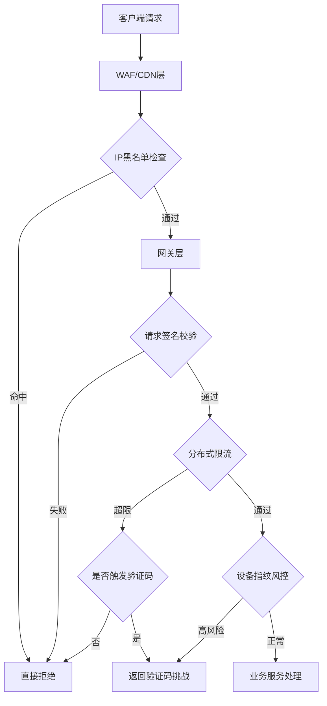
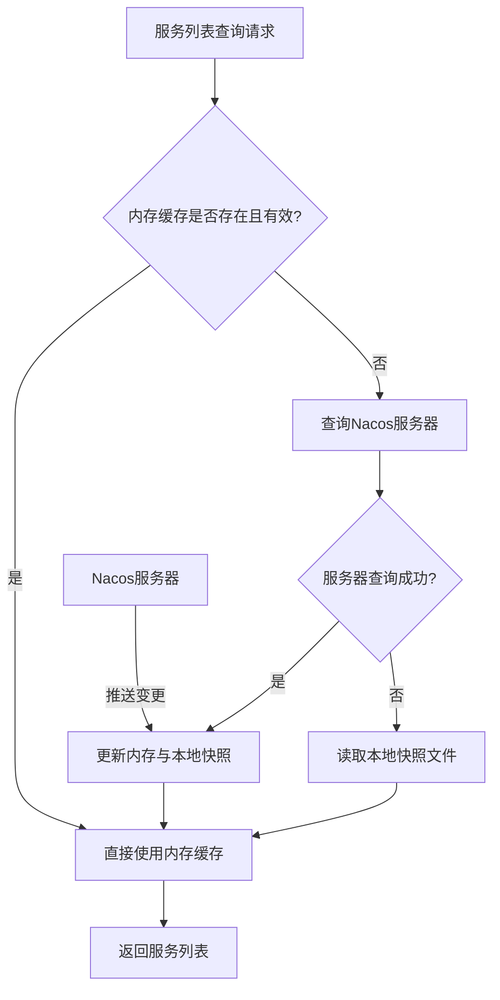
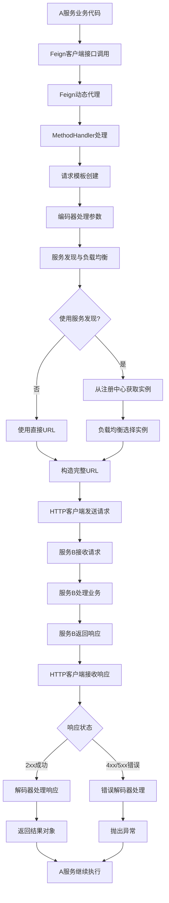

[TOC]

---

## 1.百万级EXCEL读取

1、EasyExcel

基于POI的事件驱动模型，逐行解析，内存占用低

2、Apache POI (SAX模式)	

事件驱动、流式读取

3、逐行读取后，及时批量处理，及时释放，因为等完全读取完整个excel的时候，内存也会爆炸

---

### 思考一：支持多线程读吗

理论上不支持，核心限制：EasyExcel的读取是顺序流式解析，XML解析器必须按顺序读取文件内容

其他场景可以考虑多线程，比如 多个 sheet 页面、读取出来后的数据处理

---

### 思考二：excel文件本身就很大，二进制流文件怎么处理的？内存不会溢出吗

EasyExcel：不加载整个XML到内存。边读边解析，遇到标签触发事件

```bash
物理文件 (磁盘) 
↓ (文件流)
ZIP解压流 (xlsx本质是ZIP)
↓ (XML流)  
XML解析器 (SAX)
↓ (事件)
EasyExcel监听器
↓ (对象)
你的业务处理
```
---

### 思考三：excel不是本地文件，而是通过http请求过来的，内存如何处理

```java
// 整个文件加载到内存！ 不推荐
byte[] bytes = file.getBytes();

// 直接使用文件流，不加载到内存
InputStream inputStream = file.getInputStream();
```

有一个POST接口，接收一个MultipartFile（实际上Spring MVC在处理MultipartFile时，如果文件超过一定大小，会临时存储到磁盘，但可以通过配置使其不存盘，直接流式读取）

方式一：使用MultipartFile，但Spring默认会使用临时文件，所以对于大文件，我们确保临时文件存在，然后EasyExcel从临时文件读取，这样也不会内存溢出，但会有磁盘IO

方式二：完全流式解析，不保存到临时文件。我们可以通过自定义解析HttpServletRequest来实现，但这样就需要自己处理multipart/form-data的解析。不过，Spring提供了Streaming API

实际上，Spring MVC的MultipartFile接口默认实现是将文件存储到临时文件，所以我们可以直接使用MultipartFile，然后通过EasyExcel读取这个临时文件。但是，如果不想落盘，我们也可以直接读取MultipartFile的InputStream，因为MultipartFile的InputStream也是从临时文件读取的，所以不会内存溢出

---

### 思考四：反过来，java输出excel文件，文件太大，如何处理

不推荐：POI XSSFWorkbook

```java
// ❌ 危险：使用POI的XSSFWorkbook
@GetMapping("/export-oom")
public void exportOOM(HttpServletResponse response) {
    Workbook workbook = new XSSFWorkbook(); // 在内存中构建整个Excel
    Sheet sheet = workbook.createSheet("数据");
    
    // 写入100万行数据
    for (int i = 0; i < 1000000; i++) {
        Row row = sheet.createRow(i);
        for (int j = 0; j < 20; j++) {
            row.createCell(j).setCellValue("数据行-" + i + "-列-" + j);
        }
        // 每写入一行，内存占用就增加一点，直到OOM
    }
    
    // 永远执行不到这里...
    response.setContentType("application/vnd.ms-excel");
    workbook.write(response.getOutputStream());
}
```

推荐 POI SXSSF

```java
@GetMapping("/export-safe")
public void exportSafe(HttpServletResponse response) throws IOException {
    response.setContentType("application/vnd.ms-excel");
    response.setHeader("Content-Disposition", "attachment; filename=large-file.xlsx");
    
    // 🎯 关键：使用SXSSFWorkbook，设置行内存窗口
    Workbook workbook = new SXSSFWorkbook(100); // 只在内存中保留100行
    Sheet sheet = workbook.createSheet("数据");
    
    try {
        // 写入表头
        Row headerRow = sheet.createRow(0);
        for (int i = 0; i < 20; i++) {
            headerRow.createCell(i).setCellValue("列头-" + i);
        }
        
        // 流式写入数据
        for (int rowNum = 1; rowNum <= 1000000; rowNum++) {
            Row row = sheet.createRow(rowNum);
            for (int colNum = 0; colNum < 20; colNum++) {
                row.createCell(colNum).setCellValue("数据-" + rowNum + "-" + colNum);
            }
            
            // 每1000行手动刷新一次（可选）
            if (rowNum % 1000 == 0) {
                ((SXSSFSheet) sheet).flushRows(100); // 刷新并保留100行在内存
            }
            
            // 进度跟踪
            if (rowNum % 10000 == 0) {
                log.info("已生成 {} 行数据", rowNum);
            }
        }
        
        workbook.write(response.getOutputStream());
        
    } finally {
        // 🎯 重要：清理临时文件
        if (workbook instanceof SXSSFWorkbook) {
            ((SXSSFWorkbook) workbook).dispose();
        }
        workbook.close();
    }
}
```

---

## 2.接口防刷

### 1、分布式限流

核心思想：在单位时间内限制某个维度（用户/IP/接口）的请求次数

**实现方案对比：**

|算法|原理|优点|缺点|
|:---|:---|:---|:---|
|固定窗口|将时间划分为固定窗口，每个窗口内维护计数器|实现简单|存在临界突刺问题（窗口边界处瞬间可能承受2倍流量）|
|滑动窗口|将窗口再细分为多个小格子，按格子滑动统计|平滑流量，解决临界突刺|内存占用略高，需维护多个格子的计数|
|漏桶|请求进入漏桶排队，以恒定速率流出处理|流量整形，输出平稳|突发流量时延迟高，无法利用空闲容量|
|令牌桶|以恒定速率生成令牌放入桶中，请求需获取令牌|允许一定突发流量，灵活性好|实现相对复杂|

**Redis + Lua 脚本实现滑动窗口限流：**

```lua
-- KEYS[1]: 限流key（如 rate_limit:userId:接口名）
-- ARGV[1]: 窗口大小（毫秒）
-- ARGV[2]: 最大请求数
-- ARGV[3]: 当前时间戳（毫秒）
-- ARGV[4]: 唯一请求标识

local key = KEYS[1]
local window = tonumber(ARGV[1])
local limit = tonumber(ARGV[2])
local now = tonumber(ARGV[3])
local uuid = ARGV[4]

-- 移除窗口外的旧请求
redis.call('ZREMRANGEBYSCORE', key, 0, now - window)

-- 统计当前窗口内请求数
local count = redis.call('ZCARD', key)

if count < limit then
    -- 未超限，添加当前请求
    redis.call('ZADD', key, now, uuid)
    redis.call('PEXPIRE', key, window)
    return 1  -- 放行
else
    return 0  -- 拒绝
end
```

**令牌桶 Lua 实现：**

```lua
-- KEYS[1]: 令牌桶key
-- ARGV[1]: 桶最大容量
-- ARGV[2]: 每秒生成令牌数
-- ARGV[3]: 当前时间戳（秒）
-- ARGV[4]: 请求令牌数（通常为1）

local capacity = tonumber(ARGV[1])
local rate = tonumber(ARGV[2])
local now = tonumber(ARGV[3])
local requested = tonumber(ARGV[4])

local last_time = tonumber(redis.call('HGET', KEYS[1], 'last_time') or now)
local tokens = tonumber(redis.call('HGET', KEYS[1], 'tokens') or capacity)

-- 计算新增令牌数
local elapsed = math.max(0, now - last_time)
local new_tokens = math.min(capacity, tokens + elapsed * rate)

if new_tokens >= requested then
    new_tokens = new_tokens - requested
    redis.call('HSET', KEYS[1], 'tokens', new_tokens)
    redis.call('HSET', KEYS[1], 'last_time', now)
    return 1  -- 放行
else
    redis.call('HSET', KEYS[1], 'tokens', new_tokens)
    redis.call('HSET', KEYS[1], 'last_time', now)
    return 0  -- 拒绝
end
```

> 为什么用 Lua？保证原子性，避免并发下 get + set 的竞态条件

---

### 2、设备指纹识别

核心思想：通过采集客户端多维度信息生成唯一设备标识，即使切换IP/账号也能识别同一设备

**采集维度：**

- 浏览器端：Canvas指纹、WebGL指纹、AudioContext指纹、User-Agent、屏幕分辨率、时区、语言、已安装插件列表、字体列表
- APP端：IMEI/OAID、MAC地址、设备型号、系统版本、安装应用列表
- 综合特征：TCP/IP协议栈指纹（TTL、窗口大小等）

**使用流程：**

```
客户端 --> 采集多维度特征 --> Hash生成设备指纹ID --> 携带在请求Header中
服务端 --> 校验指纹合法性 --> 基于指纹维度做频率控制
```

**风控策略：**

- 同一设备指纹短时间内大量请求 → 触发验证码或临时封禁
- 设备指纹频繁变化（模拟器/篡改工具） → 标记为高风险
- 设备指纹 + 行为分析（请求间隔过于均匀） → 机器人特征

---

### 3、请求签名

核心思想：客户端对请求参数进行签名，服务端验证签名合法性，防止伪造请求和参数篡改

**签名生成流程：**

```
1. 将所有请求参数按key字典序排列
2. 拼接为 key1=value1&key2=value2&... 的字符串
3. 拼接 timestamp + nonce（随机数） + secretKey
4. 对拼接结果做 HMAC-SHA256 签名
5. 将 sign、timestamp、nonce 放入请求Header
```

**服务端校验：**

```java
// 1. 验证 timestamp 是否在允许时间窗口内（如5分钟），防止重放攻击
if (Math.abs(System.currentTimeMillis() - timestamp) > 5 * 60 * 1000) {
    throw new RuntimeException("请求已过期");
}

// 2. 验证 nonce 是否已使用过（Redis记录，TTL=时间窗口），防止重放
if (redis.exists("nonce:" + nonce)) {
    throw new RuntimeException("重复请求");
}
redis.setex("nonce:" + nonce, 300, "1");

// 3. 按相同规则重新计算签名并比对
String serverSign = HmacUtil.sha256(sortedParams + timestamp + nonce, secretKey);
if (!serverSign.equals(clientSign)) {
    throw new RuntimeException("签名校验失败");
}
```

**关键要素：**

- `timestamp`：防止重放攻击（请求过期失效）
- `nonce`：防止同一请求在有效期内被重复提交
- `secretKey`：客户端与服务端约定的密钥，APP可通过SO库存储增加逆向难度

---

### 4、IP 黑名单

**实现层次：**

|层级|方案|特点|
|:---|:---|:---|
|网关层|Nginx `deny` 指令 / WAF 规则|性能最高，请求不到达应用层|
|应用层|拦截器 + Redis 黑名单集合|灵活，可动态增删|
|云厂商|安全组/ACL规则|适合已知恶意IP段|

**动态黑名单策略：**

```
短时间触发限流阈值 → 加入灰名单（要求验证码）
多次触发灰名单 → 加入黑名单（封禁N分钟）
持续恶意行为 → 加入永久黑名单
```

> 注意获取真实IP：需正确解析 `X-Forwarded-For`、`X-Real-IP`，防止通过代理绕过。取第一个非内网IP

---

### 5、行为验证码（人机校验）

触发时机：当用户请求频率异常但未达到直接封禁阈值时，弹出验证码进行人机验证

常见方案：滑块验证、点选验证、无感验证（Google reCAPTCHA v3 评分机制）

---

### 6、网关层面统一防护

在 API Gateway（如 Spring Cloud Gateway、Kong、Nginx）层做统一拦截，避免每个服务重复实现：

- 全局限流 Filter：基于路由/用户/IP维度
- 熔断降级：异常流量直接返回友好提示
- 请求去重：相同请求短时间内只处理一次

---

### 综合防刷架构



> 防刷不是单一策略能解决的，需要多层防护形成纵深防御体系。前端签名防低成本攻击，限流兜底防突发流量，设备指纹+行为分析对抗高级爬虫

---

## 3.nacos宕机了，本地是否有缓存这个服务列表，是否还能正常远程调用

**总结：只要服务生产者和消费者没有发生任何变动，即使 Nacos 一直宕机，服务之间的调用也完全正常**

服务发现 (Naming) ： 服务列表 (ServiceInfo)	： nacos/naming 目录下	： 服务实例信息缓存与容灾



配置管理 (Config) ： 配置参数 (如.properties, .yaml) ： nacos/config 目录下 ： 配置内容缓存与容灾

配置管理，Nacos客户端在获取配置时，通常会遵循 本地容灾文件 -> 本地快照文件 -> 内存缓存 -> Nacos服务器 的查询顺序，以最大程度保证自身的可用性

---

**配置管理：** 更侧重于数据可靠性和最终一致性。它会优先尝试读取你可能预先配置好的、非常重要的容灾文件，以防止配置完全丢失

**服务列表：** 查询则更侧重于速度和对服务状态变化的敏感度

---

## 4.Openfeign如何使用，A服务调用B服务发生了哪些事

总结：代理实现，拦截器帮助构造调用模版，发送http请求



---

## 5.加密后的数据如何模糊查询

|类型|特点|常见算法|
|:---|:---|:---|
|可逆加密  |加密后可解密还原|AES、DES、RSA、SM4|
|不可逆加密  |加密后不可还原|MD5、SHA、bcrypt、SM3|

可逆加密算法（对称/非对称）

对称：加密解密使用相同密钥：AES、DES、SM4
非对称：公钥加密，私钥解密：RSA、ECC

---

### 方案一：分词加密 + 密文索引（主流方案）

核心思想：将明文按规则拆分为多个子串，分别加密后存储，查询时同样分词加密后匹配

**存储流程：**

```
原始数据: "张三丰"
↓ 分词（如每2个字一组）
分词结果: ["张三", "三丰", "张三丰"]
↓ 对每个分词单独加密（如 HmacSHA256）
加密结果: ["a3f2...", "b7c1...", "e9d4..."]
↓ 存入密文索引字段（如用逗号拼接或存入关联表）
```

**查询流程：**

```
查询条件: "三丰"
↓ 同样分词+加密
加密后: "b7c1..."
↓ SQL: WHERE cipher_index LIKE '%b7c1...%'
    或 WHERE id IN (SELECT data_id FROM cipher_index_table WHERE token = 'b7c1...')
```

**分词策略选择：**

|策略|示例（“张三丰”）|适用场景|
|:---|:---|:---|
|固定长度N-gram|张三、三丰|中文姓名、短文本|
|滑动窗口|张、三、丰、张三、三丰、张三丰|需要任意子串匹配|
|按分隔符|如手机号每4位一组|结构化数据（手机号、身份证号）|

> 注意：分词粒度越细，索引越大，查询越灵活；粒度越粗，存储越小，但只能匹配特定长度的关键词

**代码示例：**

```java
// 分词工具
public static List<String> tokenize(String plainText, int gramSize) {
    List<String> tokens = new ArrayList<>();
    for (int i = 0; i <= plainText.length() - gramSize; i++) {
        tokens.add(plainText.substring(i, i + gramSize));
    }
    // 加上全文本本身
    tokens.add(plainText);
    return tokens;
}

// 加密分词
public static List<String> encryptTokens(List<String> tokens, String secretKey) {
    return tokens.stream()
        .map(t -> HmacUtil.sha256(t, secretKey))
        .distinct()
        .collect(Collectors.toList());
}
```

---

### 方案二：明密文映射表（独立服务）

思路：建立独立的映射服务，存储【脱敏后的模糊查询字段 → 数据主键ID】的映射关系

```
查询服务 --> 映射服务（独立库，严格权限控制） --> 返回ID列表 --> 业务库查密文并解密
```

优点：查询效率高，支持完整的 LIKE 语义

缺点：映射表存储了部分明文信息，需从架构层面收口安全（独立服务+独立数据库+严格 ACL）

---

### 方案三：同态加密（理论方案，工程化尚不成熟）

同态加密允许在密文上直接计算，解密后结果等价于对明文计算。理论上可以实现密文上的模糊匹配，但当前性能开销极大，不适合生产环境

---

### 方案对比

|方案|安全性|查询性能|实现复杂度|适用场景|
|:---|:---|:---|:---|:---|
|分词加密索引|高（不可逆）|中（依赖分词粒度）|中|姓名、手机号、地址等短文本|
|明密文映射表|中（需架构保护）|高|低|对查询性能要求极高的场景|
|同态加密|极高|极低|极高|暂不适合生产|

		
