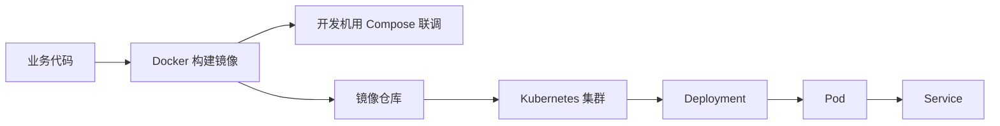

> 这篇笔记的目标是把 `Docker Compose` 和 `Kubernetes` 这两个经常被并列讨论的工具放到同一张图里重新拆开。两者都在描述“多个容器如何协同运行”，但它们解决的问题域、运行范围和平台能力并不一样。

> 文章重点放在关系辨析，而不是做命令大全。核心问题包括：`Compose` 到底是不是简化版 `Kubernetes`，为什么很多项目本地联调用 `Compose`、线上却用 `Kubernetes`，以及两者在服务抽象、网络、存储、扩缩容和发布策略上分别走到哪一层。

> 参考资料：
>
> Docker 官方文档：[Docker Compose Overview](https://docs.docker.com/compose/) 、 [Compose File Reference](https://docs.docker.com/reference/compose-file/) 、 [Using Docker Compose](https://docs.docker.com/get-started/docker-concepts/running-containers/multi-container-applications/)
>
> Kubernetes 官方文档：[Kubernetes Documentation](https://kubernetes.io/docs/home/) 、 [Overview](https://kubernetes.io/docs/concepts/overview/) 、 [Pods](https://kubernetes.io/docs/concepts/workloads/pods/) 、 [Deployments](https://kubernetes.io/docs/concepts/workloads/controllers/deployment/) 、 [Service](https://kubernetes.io/docs/concepts/services-networking/service/)
>
> 站内前文：`/2025/11/27/Docker容器基础/` 、 `/2025/11/27/Kubernetes容器编排/`

[TOC]

---

## 1. 最短答案

如果只用最短的话概括：

- `Docker Compose` 解决的是单机上一组容器如何一起定义和启动
- `Kubernetes` 解决的是一组容器如何在集群里被长期调度和治理

两者都带有“编排”意味，但编排层级并不一样：

| 方案 | 编排范围 | 核心目标 |
|------|----------|----------|
| `Docker Compose` | 单机 | 快速组织多容器应用 |
| `Kubernetes` | 多节点集群 | 长期治理容器化应用 |

因此更准确的关系不是“谁是谁的低配版”，而是：

- `Compose` 更靠近开发和轻量部署
- `Kubernetes` 更靠近生产和平台治理

---

## 2. 为什么两者经常会被放在一起比较

因为从表面上看，它们都在做类似的事情：

- 都要描述多个服务
- 都会涉及镜像、端口、环境变量、存储
- 都希望让应用不再靠零散命令手工启动

例如一个典型 Web 系统，往往都包含：

- Web 服务
- 数据库
- 缓存
- 消息队列

无论使用 `Compose` 还是 `Kubernetes`，都需要表达这些组件之间的关系。

但真正的分界线在于：

- 这些组件是准备在一台机器上协同运行
- 还是准备在一组机器上长期运行、扩缩容和治理

---

## 3. Docker Compose 到底是什么

`Docker Compose` 可以概括成：

> 一种用声明式文件描述单机多容器应用的方式，让一组服务、网络、挂载和依赖关系可以被统一启动和关闭。

它最典型的使用场景包括：

- 本地开发环境启动一整套依赖
- 测试环境快速搭建多容器系统
- 轻量级单机部署
- Demo 或 PoC 环境快速交付

它擅长的是：

- 一条命令拉起一组服务
- 用配置文件统一描述端口、环境变量、卷和依赖关系
- 降低本地环境准备成本

但它的前提也很明确：

- 默认运行范围是单机
- 不以复杂的集群治理为核心目标

---

## 4. Kubernetes 到底比 Compose 多做了什么

如果只用一句话概括：

> `Kubernetes` 不只是“把多容器描述出来”，而是把容器化应用的部署、调度、访问、发布和恢复都纳入平台控制。

这意味着它比 `Compose` 多出来的，不是简单的配置量，而是平台能力：

| 能力 | Docker Compose | Kubernetes |
|------|----------------|------------|
| 多节点调度 | 否 | 是 |
| 自愈 | 很有限 | 是 |
| 滚动发布 | 很有限 | 是 |
| 回滚 | 较弱 | 原生支持 |
| 服务发现 | 单机网络内较直接 | `Service` + DNS 抽象 |
| 弹性扩缩容 | 较弱 | 原生支持 |
| 资源治理 | 较弱 | 完整资源声明与限制 |
| 平台治理能力 | 较轻 | 较强 |

因此二者的分工可以概括为：

- `Compose` 解决“单机上怎么把一组容器组织起来”
- `Kubernetes` 解决“这组容器怎样在集群里长期运行”

---

## 5. 单机编排和集群编排的差异到底在哪里

### 5.1 运行范围不同

这是最根本的区别。

- `Compose` 假定服务主要跑在一台宿主机上
- `Kubernetes` 假定服务可能分布在多台节点上

一旦从单机走向多机，问题性质就变了：

- 服务实例不再固定
- 网络不再是单机桥接那么简单
- 故障不只是进程挂掉，还包括节点失效
- 发布不只是重启服务，还包括跨节点流量切换

### 5.2 抽象目标不同

`Compose` 更接近：

- 应用启动编排

`Kubernetes` 更接近：

- 应用运行时平台

所以在 `Compose` 里，更核心的是：

- 服务定义
- 端口映射
- 环境变量
- 挂载

而在 `Kubernetes` 里，更核心的是：

- `Pod`
- `Deployment`
- `Service`
- `Ingress`
- 控制器和调度器

### 5.3 状态管理方式不同

`Compose` 更像是：

- 根据文件把服务启动起来

`Kubernetes` 更像是：

- 声明目标状态，然后平台持续收敛

这也是为什么 `Kubernetes` 会强调：

- 控制器
- 调谐循环
- 声明式资源对象

---

## 6. 两者对象能不能一一对应

不能机械地一一对应，但可以做近似理解。

| Compose 概念 | Kubernetes 里大致相关的对象 | 说明 |
|--------------|------------------------------|------|
| `service` | `Deployment` / `Pod` | 都描述应用单元，但不完全等价 |
| `ports` | `Service` / `Ingress` | `Kubernetes` 会拆成更明确的网络层对象 |
| `environment` | `ConfigMap` / `Secret` / `env` | 配置注入方式更细化 |
| `volume` | `Volume` / `PV` / `PVC` | 存储抽象更完整 |
| `depends_on` | 无直接等价物 | `Kubernetes` 更依赖健康检查和解耦设计 |
| `replicas` | `Deployment replicas` | 扩容能力在 `Kubernetes` 中更自然 |

这里最重要的不是记“映射表”，而是理解：

- `Compose` 更偏应用描述文件
- `Kubernetes` 更偏资源对象体系

因此把一个 `compose.yml` 原样翻译成一套 `Kubernetes YAML`，往往并不能自动得到良好的生产架构。

---

## 7. 为什么本地常用 Compose，线上常用 Kubernetes

这是最常见的实际分工。

### 7.1 本地开发更看重启动成本

本地开发环境通常优先考虑：

- 拉起速度
- 配置简单
- 一台机器可完成联调

在这种场景里，`Compose` 很合适，因为：

- 不需要准备完整集群
- 开发者可以快速拉起数据库、缓存、消息队列和应用服务
- 环境文件和端口映射相对直观

### 7.2 线上环境更看重长期治理

生产环境更看重的是：

- 服务是否能自动恢复
- 发布是否平滑
- 资源是否可控
- 多副本是否可伸缩
- 故障是否可隔离

这些需求都更接近 `Kubernetes` 的设计目标。

因此常见的落地方式是：

| 环境 | 更常见方案 | 原因 |
|------|------------|------|
| 本地开发 | `Docker Compose` | 快速、轻量、学习成本低 |
| CI 或轻量测试 | `Docker` / `Compose` | 环境搭建速度重要 |
| 预发与生产 | `Kubernetes` | 需要治理、调度、扩缩容和自愈 |

---

## 8. 一个完整链路里三者怎样配合

容器体系如果完整看，常常不是二选一，而是多工具协作：

这条链路里：

- `Docker` 负责构建镜像
- `Compose` 负责在单机环境组织依赖
- `Kubernetes` 负责把应用放进集群治理

因此三者并不冲突，反而经常出现在同一条研发链路的不同阶段。

---

## 9. 常见误区

### 9.1 “Compose 就是简化版 Kubernetes”

这种说法只能作为非常粗粒度的入门类比，不能当成准确结论。

原因在于：

- 两者运行范围不同
- 控制模型不同
- 平台能力不同

### 9.2 “既然有 Kubernetes，就不需要 Compose”

也不准确。

如果目标是：

- 本地快速联调
- Demo 演示
- 单机测试环境

那么 `Compose` 往往比搭一个完整集群更直接。

### 9.3 “Compose 文件可以直接等价迁移到 Kubernetes”

这也不成立。

因为迁移到 `Kubernetes` 时，通常还要重新考虑：

- 服务拆分是否合理
- 配置和密钥如何管理
- 健康检查怎样定义
- 资源限制怎样设定
- 服务入口和域名如何组织

这已经不是单纯的“语法转换”问题，而是平台设计问题。

---

## 10. 选择建议

如果目标是下列场景，通常可以这样选：

| 场景 | 更合适的方案 | 原因 |
|------|--------------|------|
| 本地开发联调 | `Docker Compose` | 启动成本低，描述直观 |
| 单机 Demo | `Docker Compose` | 轻量、够用 |
| 小规模单机服务运行 | `Docker Compose` | 运维复杂度可控 |
| 多节点生产部署 | `Kubernetes` | 需要调度、治理、自愈 |
| 高频发布与弹性扩缩 | `Kubernetes` | 平台能力更完整 |

简化成一句话可以写成：

> `Compose` 更适合把一组容器在一台机器上组织起来，`Kubernetes` 更适合把一组容器在一组机器上持续管理起来。

---

## 11. 与 Docker、Kubernetes 两篇基础笔记的关系

这三篇文章的阅读顺序可以这样安排：

1. 先看 `Docker` 基础，理解镜像、容器、仓库、挂载、网络
2. 再看这篇，理解单机编排和集群编排到底差在哪
3. 最后看 `Kubernetes` 主文，重点理解 `Pod`、`Deployment`、`Service`

对应站内路径如下：

- Docker 基础：`/2025/11/27/Docker容器基础/`
- Kubernetes 容器编排：`/2025/11/27/Kubernetes容器编排/`

---

## 12. 小结

这篇笔记最核心的结论有四点：

1. `Docker Compose` 和 `Kubernetes` 都有编排含义，但编排范围并不相同
2. `Compose` 主要解决单机多容器组织问题，`Kubernetes` 主要解决集群治理问题
3. 两者不存在简单的一一映射关系，也不是低配版和高配版的线性关系
4. 在真实研发流程里，`Docker`、`Compose`、`Kubernetes` 往往分别处在构建、联调和生产治理三个不同阶段
