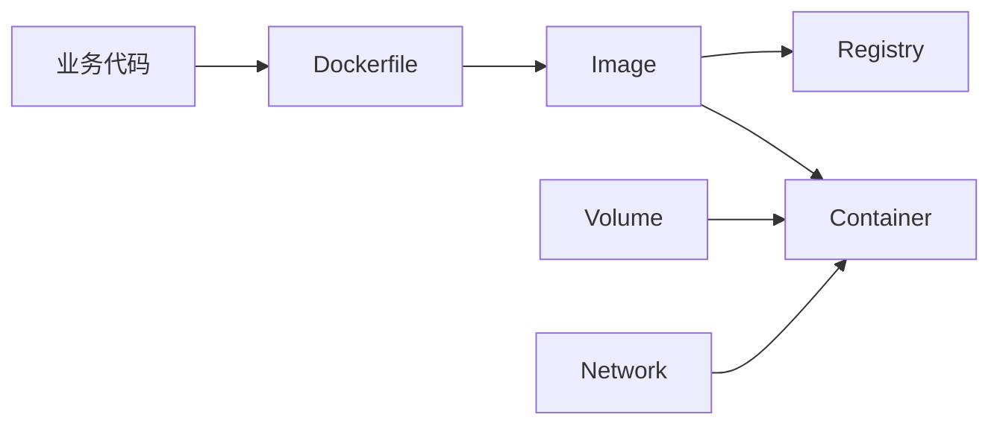
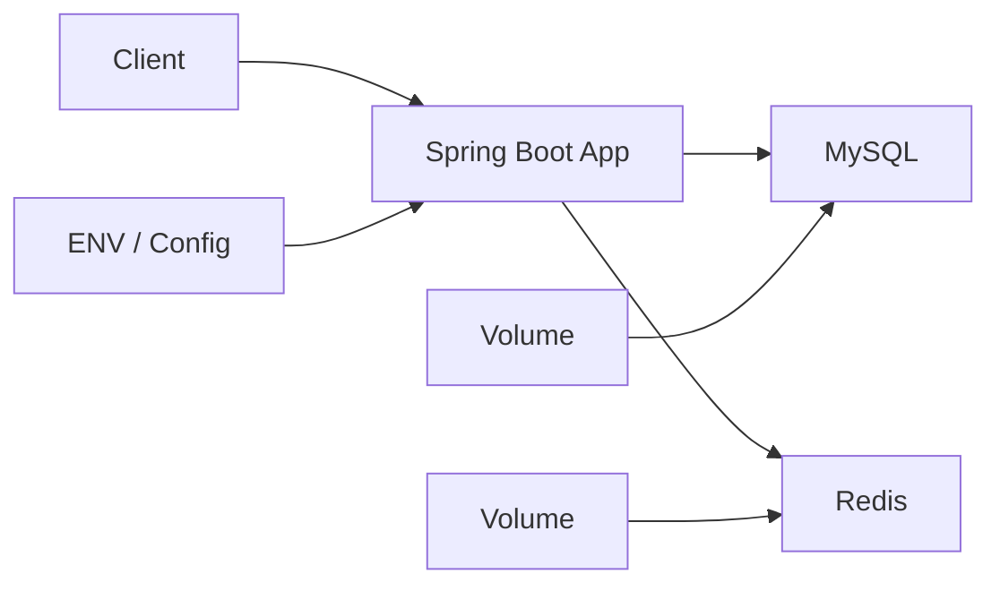
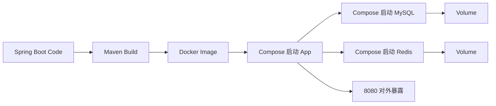

> 这篇笔记的目标是先把 `Docker` 这一层独立讲清楚。重点放在镜像、容器、仓库、挂载、网络、运行时这些基础对象上，解决“容器到底是什么、镜像和容器差在哪、Docker 实际负责什么”这些最常见的问题。

> 文章后半部分会补一个 `JDK 21 + Spring Boot + Redis + MySQL` 的服务端容器化案例，用一套完整链路把镜像构建、环境变量注入、端口暴露、持久化挂载和多容器协同串起来。这样再回头看 `Docker Compose` 和 `Kubernetes` 的边界，会更容易落到实处。

> 参考资料：
>
> Docker 官方文档：[Docker Overview](https://docs.docker.com/get-started/docker-overview/) 、 [What is a Container](https://docs.docker.com/get-started/docker-concepts/the-basics/what-is-a-container/) 、 [What is an Image](https://docs.docker.com/get-started/docker-concepts/the-basics/what-is-an-image/) 、 [Publishing and Exposing Ports](https://docs.docker.com/get-started/docker-concepts/running-containers/publishing-ports/) 、 [Persisting Container Data](https://docs.docker.com/get-started/docker-concepts/running-containers/persisting-container-data/)
>
> 镜像仓库资料：[Docker Image Tag](https://docs.docker.com/reference/cli/docker/image/tag/) 、 [docker login](https://docs.docker.com/reference/cli/docker/login/) 、 [docker push](https://docs.docker.com/reference/cli/docker/image/push/) 、 [Docker Hub Repositories](https://docs.docker.com/docker-hub/repos/)
>
> OCI / Runtime 参考：[Open Container Initiative](https://opencontainers.org/) 、 [containerd](https://containerd.io/) 、 [runc](https://github.com/opencontainers/runc)
>
> Spring 官方资料：[Spring Boot Reference Documentation](https://docs.spring.io/spring-boot/reference/) 、 [Externalized Configuration](https://docs.spring.io/spring-boot/reference/features/external-config.html) 、 [Profiles](https://docs.spring.io/spring-boot/reference/features/profiles.html)
>
> 中间件官方资料：[MySQL 8.4 Reference Manual](https://dev.mysql.com/doc/refman/8.4/en/) 、 [Redis Documentation](https://redis.io/docs/latest/)
>
> 站内前文：`/2025/11/27/Kubernetes容器编排/` 、 `/2025/11/27/DockerCompose与Kubernetes关系/`

[TOC]

---

## 1. 最短答案：Docker 到底是什么

如果只用一句话概括：

> `Docker` 是一套围绕容器构建、分发和运行的工具链，让应用及其依赖可以以相对一致的方式被打包成镜像，并在不同环境里启动为容器。

这句话里有三个关键词：

- 构建：把应用做成镜像
- 分发：把镜像推送到仓库并被其他机器拉取
- 运行：把镜像启动成容器进程

所以 `Docker` 本质上不是一种编程语言，也不是一种云平台，更不是 `Kubernetes` 的别名。

---

## 2. 为什么 Docker 这一层经常容易学混

因为 `Docker` 这个词在日常语境里，常常会被混用来指代下面几层东西：

| 常见说法 | 实际更可能指什么 |
|----------|------------------|
| “我用 Docker 跑了个服务” | 用 `docker run` 启动了一个容器 |
| “我打了一个 Docker 包” | 构建了一个镜像 |
| “Docker 仓库里有这个应用” | 镜像仓库里保存了该镜像 |
| “Kubernetes 不用 Docker 了” | 集群运行时不一定直接使用 `Docker Engine` |

如果不把这些层次拆开，就很容易出现下面几种常见误区：

- 把镜像当成容器
- 把容器当成虚拟机
- 把 `Docker Engine` 当成整个容器生态
- 把本地开发命令和生产运行机制混成一回事

---

## 3. Docker 体系里最核心的几个对象

### 3.1 镜像是什么

镜像可以理解为：

> 一个只读模板，里面包含应用代码、运行时、依赖库、环境配置以及启动方式。

例如一个 `Java` 服务镜像里，往往会包含：

- 基础操作系统层
- `JDK` 或 `JRE`
- 应用 `jar`
- 运行命令

镜像本身不是正在运行的程序，它更像是“可复制的交付包”。

### 3.2 容器是什么

容器可以理解为：

> 镜像被启动之后形成的运行实例。

因此镜像和容器的关系可以简化成：

- 镜像是静态模板
- 容器是动态实例

和面向对象做一个不严格但容易记忆的类比：

- 镜像类似“类”
- 容器类似“对象实例”

### 3.3 仓库是什么

仓库负责保存和分发镜像。

常见场景包括：

- 开发机构建镜像后推到仓库
- 测试机或生产机从仓库拉取镜像
- 不同版本镜像通过标签区分

因此镜像仓库解决的是：

- 镜像如何统一保存
- 镜像如何跨机器分发
- 不同版本如何管理

### 3.4 挂载和网络是什么

如果只靠镜像和容器，应用虽然能启动，但还不够满足真实业务：

- 数据不能永远放在容器可写层里
- 服务不能永远只在容器内部端口自娱自乐

所以还需要：

- `Volume`：处理数据持久化或共享
- `Network`：处理容器之间或容器与宿主机之间的通信

把这些对象放在一张表里会更清楚：

| 对象 | 作用 | 常见误区 |
|------|------|----------|
| `Image` | 描述应用如何被打包 | 误以为镜像就是已经运行的服务 |
| `Container` | 镜像启动后的运行实例 | 误以为容器等于轻量虚拟机 |
| `Registry` | 保存和分发镜像 | 误以为仓库里存的是“运行状态” |
| `Volume` | 处理持久化与共享数据 | 误以为容器删了数据一定还在 |
| `Network` | 处理网络互通与端口映射 | 误以为容器端口天然对外可见 |

---

## 4. 一张图看懂 Docker 在做什么



这条链路表达的是：

1. 代码通过 `Dockerfile` 被构建成镜像
2. 镜像可以推送到仓库
3. 镜像也可以直接在某台机器上启动成容器
4. 容器运行时往往还会依赖挂载和网络

---

## 5. Docker 主要解决什么问题

### 5.1 运行环境一致

以前常见问题是：

- 开发机能跑
- 测试机报错
- 生产机环境又不一样

容器化之后，应用和依赖一起被打包，跨环境差异会明显缩小。

### 5.2 交付方式标准化

以前交付一个服务，可能要给别人一堆东西：

- 代码包
- 启动脚本
- 依赖安装说明
- 环境变量说明

现在更常见的交付方式是：

- 给出镜像地址和版本

### 5.3 资源隔离更清晰

容器不会像虚拟机那样完整模拟一套新操作系统，但它会利用 Linux 内核提供的隔离和限制机制，让进程、文件系统、网络等运行边界更清晰。

### 5.4 启动和销毁更轻量

相对于传统虚拟机，容器启动通常更快，适合用作：

- 临时环境
- CI 任务
- 批处理任务
- 微服务运行实例

---

## 6. Docker 不解决什么问题

这是理解边界时最重要的一部分。

`Docker` 很擅长把应用容器化，但它并不天然解决下面这些集群问题：

- 多机器之间如何统一调度
- 一个服务如何维持多个副本
- 实例挂了之后如何自动恢复
- 服务发现和负载均衡如何统一抽象
- 滚动发布和回滚如何标准化

因此可以概括为：

- `Docker` 解决“一个应用怎样被打包和运行”
- `Kubernetes` 解决“一批容器怎样在集群里被管理”

---

## 7. 容器不是虚拟机

这是另一个很常见的误区。

| 维度 | 容器 | 虚拟机 |
|------|------|--------|
| 隔离方式 | 共享宿主机内核，做进程级隔离 | 通过 Hypervisor 虚拟出完整硬件环境 |
| 启动成本 | 通常更轻量、更快 | 通常更重 |
| 交付形态 | 更适合应用级打包 | 更适合完整系统级隔离 |
| 典型用途 | 微服务、任务、标准化运行环境 | 强隔离、异构系统、传统部署 |

因此容器更接近：

- “把应用封装成标准运行单元”

而不是：

- “每个应用都带一套完整操作系统”

---

## 8. 学 Docker 时必须真正理解的几个点

### 8.1 镜像是分层的

镜像通常由多层组成，这让构建缓存、复用基础层、减少重复传输成为可能。

这也是为什么 `Dockerfile` 的写法会影响：

- 构建速度
- 缓存命中率
- 镜像体积

### 8.2 容器是易失的

容器可写层通常不适合作为持久化数据的长期存储位置。

如果容器被删除：

- 进程会消失
- 容器本地状态也可能随之丢失

所以数据库、上传文件、日志等数据是否需要外挂存储，是设计时必须先想清楚的问题。

### 8.3 端口映射不是“自动公网可见”

容器内部监听了 `8080`，不代表外部机器就一定能访问。

还需要区分：

- 容器内端口
- 宿主机端口映射
- 主机防火墙和网络策略

### 8.4 `docker build` 和 `docker run` 是两件事

这是最基础但又最常被混掉的两步：

- `docker build` 是生成镜像
- `docker run` 是启动容器

前者处理“怎么打包”，后者处理“怎么运行”。

---

## 9. Docker 与 Docker Compose、Kubernetes 的关系

把三者放到同一条链路里看，关系会更清楚：

```text
代码
    -> Docker 构建镜像
    -> Docker Compose 在单机组织多容器
    -> Kubernetes 在集群中部署和治理
```

也就是说：

- `Docker` 常出现在开发、构建、镜像分发阶段
- `Docker Compose` 常出现在本地联调或轻量单机部署阶段
- `Kubernetes` 常出现在集群部署、调度、治理阶段

如果只用一句话区分：

> `Docker` 主要让应用以容器方式构建和运行，`Docker Compose` 主要让一组容器在单机上按关系启动，`Kubernetes` 主要让大量容器在集群中稳定运行。

详细关系辨析可以继续看站内这两篇：

- `Kubernetes` 容器编排：`/2025/11/27/Kubernetes容器编排/`
- `Docker Compose` 与 `Kubernetes` 的关系：`/2025/11/27/DockerCompose与Kubernetes关系/`

---

## 10. 一个 Spring Boot 服务端容器化案例

前面的内容主要在拆概念。要真正把 `Docker` 这一层理解扎实，最好还是落到一套具体服务上。

这里用一个比较典型的服务端场景做例子：

- 应用：`Spring Boot 3.x`
- JDK：`JDK 21`
- 存储：`MySQL 8`
- 缓存：`Redis 7`
- 运行方式：单机上的 `Docker + Docker Compose`

这个案例的重点不是演示一个能跑的最小 `hello world`，而是回答下面这些更接近实际落地的问题：

1. `Spring Boot` 服务为什么适合用容器交付
2. 数据库和缓存为什么通常不和应用打进同一个镜像
3. 配置、端口、挂载、网络应该分别放在哪一层处理
4. 为什么单机环境经常用 `Compose` 组织依赖，而不是每个容器都手工启动

### 10.1 场景设定

假设有一个订单服务 `order-service`，它的能力比较常见：

- 对外提供 HTTP API
- 读写 `MySQL`
- 使用 `Redis` 做缓存
- 通过 `application-prod.yml` 或环境变量管理连接信息

整个部署关系可以先看这张图：



这张图想表达的重点是：

- 应用容器负责业务逻辑
- `MySQL` 和 `Redis` 是独立基础设施容器
- 配置通过环境变量或配置文件注入
- 需要持久化的数据挂到卷上，而不是写在容器可写层

### 10.2 为什么不要把 Spring Boot、MySQL、Redis 打成一个容器

这是服务端容器化里很关键的边界问题。

| 组件 | 推荐做法 | 原因 |
|------|----------|------|
| `Spring Boot` 应用 | 单独一个应用镜像 | 业务代码版本变化快，发布频率高 |
| `MySQL` | 独立数据库容器或独立数据库服务 | 数据生命周期独立于应用生命周期 |
| `Redis` | 独立缓存容器或独立缓存服务 | 缓存治理和应用治理不是同一层 |

如果把三者塞进一个容器，会带来几个明显问题：

- 应用发布会和数据库、缓存生命周期绑死
- 数据持久化边界变得混乱
- 故障定位不清晰
- 扩容没有弹性

因此在 `Docker` 这一层，真正值得理解的是：

> 容器的边界通常应该对应进程职责边界，而不是“为了少起几个容器就把所有东西打包在一起”。

### 10.3 一个更像生产前置环境的目录结构

```text
order-service/
├── Dockerfile
├── docker-compose.yml
├── .dockerignore
├── pom.xml
├── src/
└── deploy/
    └── app.env
```

这里的分工通常是：

- `Dockerfile` 负责描述应用镜像怎么构建
- `docker-compose.yml` 负责描述多容器如何一起运行
- `app.env` 负责注入环境变量
- `src/` 和 `pom.xml` 负责应用本身的编译产物

### 10.4 Spring Boot 应用镜像怎么构建

对于 `JDK 21 + Spring Boot` 服务，比较常见的是多阶段构建：

```dockerfile
FROM maven:3.9.9-eclipse-temurin-21 AS builder
WORKDIR /app

COPY pom.xml .
COPY src ./src

RUN mvn -B clean package -DskipTests

FROM eclipse-temurin:21-jre
WORKDIR /app

COPY --from=builder /app/target/order-service.jar app.jar

EXPOSE 8080

ENTRYPOINT ["java", "-jar", "/app/app.jar"]
```

这个 `Dockerfile` 想解决的是两件事：

1. 构建阶段需要 `Maven + JDK 21`
2. 运行阶段只需要更轻量的 `JRE`

这样做的直接收益包括：

- 运行镜像更小
- 运行时依赖更少
- 构建工具不会被带进最终镜像

### 10.5 配置应该放在哪里

`Spring Boot` 服务端容器化时，最容易混乱的往往不是镜像，而是配置。

比较稳妥的原则是：

| 配置类型 | 更推荐的放置位置 | 原因 |
|----------|------------------|------|
| 应用默认配置 | 镜像内 `application.yml` | 与应用一起演进 |
| 环境差异配置 | 环境变量或外挂配置文件 | 避免为不同环境重复打包镜像 |
| 密码、密钥 | 环境变量或更安全的密钥管理方式 | 不应固化进镜像 |

一个比较常见的环境变量示例如下：

```env
SPRING_PROFILES_ACTIVE=prod
SERVER_PORT=8080
SPRING_DATASOURCE_URL=jdbc:mysql://mysql:3306/order_db?useSSL=false&serverTimezone=Asia/Shanghai
SPRING_DATASOURCE_USERNAME=root
SPRING_DATASOURCE_PASSWORD=123456
SPRING_DATA_REDIS_HOST=redis
SPRING_DATA_REDIS_PORT=6379
SPRING_DATA_REDIS_PASSWORD=
JAVA_OPTS=-Xms512m -Xmx512m
```

这里有两个关键点：

- 应用连接数据库时写的是 `mysql`，不是 `localhost`
- 应用连接缓存时写的是 `redis`，不是宿主机地址

原因在于同一个 `Compose` 网络里，服务之间通常通过服务名互相访问。

如果继续往下落到应用配置文件，通常会有一份类似下面的 `application-prod.yml`：

```yaml
server:
  port: ${SERVER_PORT:8080}

spring:
  datasource:
    url: ${SPRING_DATASOURCE_URL}
    username: ${SPRING_DATASOURCE_USERNAME}
    password: ${SPRING_DATASOURCE_PASSWORD}
    driver-class-name: com.mysql.cj.jdbc.Driver
  data:
    redis:
      host: ${SPRING_DATA_REDIS_HOST:redis}
      port: ${SPRING_DATA_REDIS_PORT:6379}
      password: ${SPRING_DATA_REDIS_PASSWORD:}
  jackson:
    time-zone: Asia/Shanghai

logging:
  level:
    root: info
    com.example.order: info
```

这份配置的重点不在字段多少，而在边界是否清楚：

- 应用保留自己的配置结构
- 环境差异通过环境变量注入
- 镜像不因为不同环境反复重打

从容器化角度看，这是一条很重要的原则：

> 镜像更像“应用模板”，而运行环境差异应尽量放在镜像之外。

### 10.6 一个典型的 docker-compose.yml

```yaml
services:
  order-service:
    build:
      context: .
      dockerfile: Dockerfile
    container_name: order-service
    env_file:
      - ./deploy/app.env
    ports:
      - "8080:8080"
    depends_on:
      - mysql
      - redis
    restart: unless-stopped
    networks:
      - app-net

  mysql:
    image: mysql:8.4
    container_name: order-mysql
    environment:
      MYSQL_ROOT_PASSWORD: 123456
      MYSQL_DATABASE: order_db
    ports:
      - "3306:3306"
    volumes:
      - mysql-data:/var/lib/mysql
    command:
      - --default-authentication-plugin=mysql_native_password
    restart: unless-stopped
    networks:
      - app-net

  redis:
    image: redis:7.4
    container_name: order-redis
    ports:
      - "6379:6379"
    volumes:
      - redis-data:/data
    command: ["redis-server", "--appendonly", "yes"]
    restart: unless-stopped
    networks:
      - app-net

networks:
  app-net:
    driver: bridge

volumes:
  mysql-data:
  redis-data:
```

这个文件把前面讲过的几个概念一次串起来了：

- `build` 说明应用镜像从哪里构建
- `ports` 处理宿主机与容器端口映射
- `env_file` 处理环境变量注入
- `depends_on` 表达启动顺序依赖
- `networks` 让多个容器在同一网络中互通
- `volumes` 让数据库和缓存的数据脱离容器可写层

### 10.7 这套案例到底体现了 Docker 的哪些核心概念

把这个案例再对应回前面的知识点，会更容易形成闭环：

| Docker 概念 | 在案例中的体现 | 为什么重要 |
|-------------|----------------|------------|
| 镜像 | `order-service` 的应用镜像 | 决定应用如何被交付 |
| 容器 | `order-service`、`mysql`、`redis` 的运行实例 | 决定进程如何实际运行 |
| 仓库 | 应用镜像后续可推送到私有仓库 | 解决跨机器分发 |
| 网络 | `app-net` | 让容器用服务名互相访问 |
| 挂载 | `mysql-data`、`redis-data` | 保证数据不依赖容器生命周期 |
| 环境变量 | `app.env` | 让镜像和环境差异解耦 |

### 10.8 一个更完整的启动链路



这条链路里最值得记住的不是命令本身，而是分层职责：

- `Maven` 负责把代码编译成 `jar`
- `Docker` 负责把 `jar` 打成可交付镜像
- `Compose` 负责把应用和依赖在单机上组织起来

### 10.9 从代码到容器启动，常用命令是什么

如果只是想把这套案例从源码一步步跑起来，常用命令通常可以归纳成下面几组：

#### 10.9.1 先本地打包应用

```bash
mvn clean package -DskipTests
```

这一步的产物通常是：

- `target/order-service.jar`

如果 `Dockerfile` 使用的是多阶段构建，也可以不先本地打包，而是直接让镜像构建阶段完成编译。

#### 10.9.2 构建应用镜像

```bash
docker build -t order-service:1.0.0 .
```

这个命令解决的是：

- 把源码或打包产物变成镜像

构建完成后可以用下面的命令确认镜像是否存在：

```bash
docker images | grep order-service
```

#### 10.9.3 给镜像打 tag，准备推送到仓库

本地能构建出镜像，只解决了“这台机器上有镜像”。

但在真实交付里，通常还需要解决：

- 测试机怎么拿到同一个版本
- 生产机怎么拉到准确的镜像
- 回滚时怎么找到上一个稳定版本

因此镜像通常还要带上完整仓库地址和版本标签。

一个比较典型的命名方式可以写成：

```text
registry.example.com/demo/order-service:1.0.0
```

这里每一段分别表示：

| 段落 | 例子 | 含义 |
|------|------|------|
| 仓库地址 | `registry.example.com` | 镜像仓库域名 |
| 命名空间 | `demo` | 团队、项目组或业务线 |
| 镜像名 | `order-service` | 具体应用名称 |
| 标签 | `1.0.0` | 版本标识 |

如果本地镜像当前只有 `order-service:1.0.0`，通常还要再打一次目标仓库 tag：

```bash
docker tag order-service:1.0.0 registry.example.com/demo/order-service:1.0.0
```

如果希望同时保留一个便于人工识别的发布标记，也可以追加：

```bash
docker tag order-service:1.0.0 registry.example.com/demo/order-service:latest
```

更稳妥的实践通常是：

- 保留不可变版本 tag，例如 `1.0.0`、`20251127-01`
- `latest` 只作为辅助标记，不作为回滚依据

### 10.9.3.1 标签应该怎么设计

镜像 tag 看起来只是一个字符串，但它实际上承担了交付和回滚的索引作用。

常见做法有下面几种：

| tag 方案 | 示例 | 适用场景 |
|----------|------|----------|
| 语义版本 | `1.0.0` | 人工发布、版本边界清楚 |
| 日期构建号 | `20251127-01` | 内部测试环境、频繁发布 |
| Git 提交号 | `a1b2c3d` | 需要精确追踪源码版本 |
| 双标签 | `1.0.0` + `latest` | 兼顾发布识别和默认拉取 |

如果有 CI/CD，比较推荐：

- 一个可追踪源码的 tag
- 一个业务可识别的发布 tag

这样查问题和回滚都会更清楚。

#### 10.9.4 登录镜像仓库并推送

镜像仓库可能是：

- `Docker Hub`
- 云厂商镜像仓库
- 企业自建私有仓库

无论是哪一种，推送之前通常都需要先登录：

```bash
docker login registry.example.com
```

如果是 `Docker Hub`，通常会写成：

```bash
docker login
```

登录成功后再执行推送：

```bash
docker push registry.example.com/demo/order-service:1.0.0
```

如果还打了 `latest`，则需要分别推送：

```bash
docker push registry.example.com/demo/order-service:latest
```

推送完成后，就可以把“本机镜像”变成“其他机器可拉取的镜像资产”。

### 10.9.4.1 仓库认证通常放在哪里

本地手工操作时，最常见的是直接执行：

```bash
docker login registry.example.com
```

如果进入自动化发布流程，认证一般不会直接写死在脚本里，而会放在：

- CI 平台密钥变量
- 云厂商镜像仓库访问凭证
- 服务器上的受控凭证配置

核心原则是：

- 仓库账号密码不写入代码仓库
- 不写死在 `Dockerfile`
- 不直接明文提交到 `app.env`

#### 10.9.5 服务器怎么拉镜像并启动

推送完成之后，真正的交付链路才算闭环。

如果目标是另一台服务器，最常见的流程是：

1. 服务器先登录镜像仓库
2. 拉取指定版本镜像
3. 按环境注入配置并启动容器

最小流程通常类似这样：

```bash
docker login registry.example.com
docker pull registry.example.com/demo/order-service:1.0.0
docker run -d \
  --name order-service \
  -p 8080:8080 \
  --env-file ./deploy/app.env \
  registry.example.com/demo/order-service:1.0.0
```

如果使用的是 `Compose`，更常见的方式是把应用服务改成直接引用远程镜像：

```yaml
services:
  order-service:
    image: registry.example.com/demo/order-service:1.0.0
    container_name: order-service
    env_file:
      - ./deploy/app.env
    ports:
      - "8080:8080"
    depends_on:
      - mysql
      - redis
```

然后在服务器执行：

```bash
docker compose pull
docker compose up -d
```

这比在服务器上重新构建镜像更符合“镜像统一交付”的思路，因为：

- 构建只发生一次
- 测试和生产拿到的是同一份镜像
- 环境差异只体现在配置，而不体现在构建产物

#### 10.9.6 环境差异应该怎么配，不应该怎么配

镜像推送之后，很容易出现一个误区：

- 开发环境打一份镜像
- 测试环境再改点配置重打一份
- 生产环境又单独重打一份

这样做会让镜像失去“统一交付物”的意义。

更稳妥的做法是：

| 维度 | 推荐做法 | 不推荐做法 |
|------|----------|------------|
| 应用版本 | 使用同一个镜像版本 | 每个环境各打一份内容不同的镜像 |
| 环境差异 | 用 `env_file`、环境变量、外挂配置处理 | 把测试库地址、生产库地址硬编码进镜像 |
| 回滚 | 回滚到旧 tag | 回滚时重新手工改包 |

因此可以把镜像推送这件事概括为：

> 镜像负责承载“应用版本”，配置负责承载“环境差异”。

#### 10.9.7 一条更完整的交付链路

把这部分补上之后，案例链路会更完整：


如果只记这条链路，可以概括成：

- 本地或 CI 构建镜像
- 给镜像打可追踪版本 tag
- 推送到统一仓库
- 服务器拉取指定 tag
- 通过环境变量或配置文件完成环境落地

#### 10.9.8 一个最小发布示例

如果把整个发布过程压缩成一组最小命令，可以写成：

```bash
mvn clean package -DskipTests
docker build -t order-service:1.0.0 .
docker tag order-service:1.0.0 registry.example.com/demo/order-service:1.0.0
docker login registry.example.com
docker push registry.example.com/demo/order-service:1.0.0
```

服务器侧再执行：

```bash
docker login registry.example.com
docker pull registry.example.com/demo/order-service:1.0.0
docker compose up -d
```

这一组命令比只写 `docker build` 更完整，因为它真正回答了：

- 镜像怎么被其他机器拿到
- 服务端环境怎么使用同一个构建产物
- 发布链路如何从“本机可运行”走到“可交付”

#### 10.9.9 单独启动应用容器

如果暂时不考虑 `MySQL` 和 `Redis`，也可以只演示应用容器本身怎么起：

```bash
docker run -d \
  --name order-service \
  -p 8080:8080 \
  -e SPRING_PROFILES_ACTIVE=prod \
  -e SPRING_DATASOURCE_URL=jdbc:mysql://host.docker.internal:3306/order_db \
  -e SPRING_DATASOURCE_USERNAME=root \
  -e SPRING_DATASOURCE_PASSWORD=123456 \
  -e SPRING_DATA_REDIS_HOST=host.docker.internal \
  -e SPRING_DATA_REDIS_PORT=6379 \
  order-service:1.0.0
```

这个命令适合说明 `docker run` 这一层到底在做什么：

- 指定容器名
- 做端口映射
- 注入环境变量
- 指定要运行哪个镜像

但它不适合作为多依赖服务的长期维护方式，因为环境变量和依赖管理会很快变得混乱。

#### 10.9.10 用 Compose 拉起完整依赖

```bash
docker compose up -d --build
```

这个命令会做几件事：

- 按 `docker-compose.yml` 构建应用镜像
- 启动 `order-service`
- 启动 `mysql`
- 启动 `redis`
- 创建网络和卷

查看容器状态通常可以用：

```bash
docker compose ps
```

查看应用日志通常可以用：

```bash
docker compose logs -f order-service
```

停止并清理当前环境通常可以用：

```bash
docker compose down
```

如果连卷一起清理：

```bash
docker compose down -v
```

是否删除卷要非常谨慎，因为这通常意味着：

- `MySQL`
- `Redis`

挂载的数据也会一起删除。

#### 10.9.11 一个最小排查顺序

如果容器启动失败，比较常见的排查顺序是：

1. 先看容器是否真的起来：`docker compose ps`
2. 再看应用日志：`docker compose logs -f order-service`
3. 再确认环境变量是否注入正确
4. 再确认 `MySQL`、`Redis` 是否已经可访问
5. 最后再检查端口映射、卷和网络

这个顺序的核心在于：

- 先确认“容器有没有启动”
- 再确认“应用能不能连上依赖”
- 最后再看“外部为什么访问不到”

### 10.10 这个案例里最容易踩的坑

如果这套方案直接落地，通常会遇到下面这些问题：

| 问题 | 典型表现 | 更稳妥的处理方式 |
|------|----------|------------------|
| `depends_on` 不等于服务可用 | `MySQL` 容器已启动，但应用连库仍失败 | 给应用加重试，或为依赖加健康检查 |
| 把数据写进容器层 | 重建容器后数据丢失 | 数据目录必须挂卷 |
| 应用里写 `localhost` | 容器内访问失败 | 使用服务名 `mysql`、`redis` |
| 一个镜像区分多环境 | 为不同环境重复打包 | 用环境变量或外挂配置做差异化 |
| 镜像过大 | 构建慢、分发慢 | 使用多阶段构建，减少运行层内容 |
| JVM 参数不可控 | 线上内容器内存抖动 | 显式设置 `JAVA_OPTS` 或容器资源约束 |

### 10.11 这个案例的边界在哪里

这套案例适合：

- 本地联调
- 测试环境
- 单机部署
- 学习和验证服务端容器化链路

但它并不直接等于生产级集群方案，因为下面这些问题还没有真正展开：

- 多副本扩缩容
- 跨节点调度
- 滚动发布
- 服务发现治理
- 集群级资源限制和自愈

这也是为什么下一层通常要继续看：

- `Docker Compose` 与 `Kubernetes` 的关系：`/2025/11/27/DockerCompose与Kubernetes关系/`
- `Kubernetes` 容器编排：`/2025/11/27/Kubernetes容器编排/`

---

## 11. 小结

这篇笔记最核心的结论有四点：

1. `Docker` 是围绕镜像和容器的一套工具链
2. 镜像是模板，容器是运行实例
3. `Docker` 擅长解决应用打包、分发和单机运行一致性问题
4. `Docker` 不等于 `Kubernetes`，后者解决的是更高一层的集群编排问题

如果把新增的服务端案例也算进去，还可以再补两点：

5. `Spring Boot` 服务容器化时，应用、数据库、缓存通常应保持独立容器边界
6. `Docker` 负责镜像和容器，`Docker Compose` 负责把一组依赖在单机上组织起来

把这层先理解清楚，再去看 `Docker Compose` 和 `Kubernetes`，很多概念会自然顺起来。
