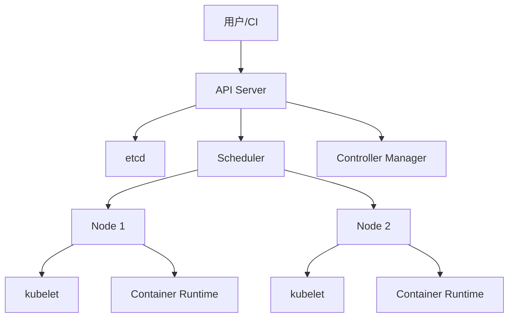
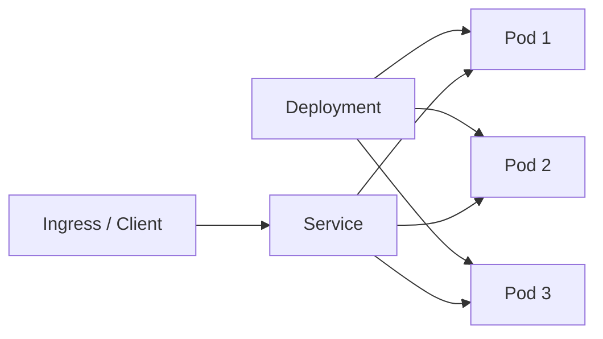

> 这篇笔记的目标是把 `Kubernetes` 放回完整的容器体系中重新理解：容器解决的是应用打包与运行一致性，`Kubernetes` 解决的是容器进入集群之后，如何被调度、发布、暴露服务、扩缩容和恢复。

> 文章重点不放在零散名词记忆，而放在几个核心问题上：为什么 `Kubernetes` 不直接管理容器而是管理 `Pod`，`Deployment` 和 `Service` 分别解决哪一层问题，控制平面如何持续把集群拉回“声明的目标状态”，以及它和 `Docker`、`Docker Compose` 的边界分别是什么。

> 参考资料：

> Kubernetes 官方文档：[Kubernetes Documentation](https://kubernetes.io/docs/home/) 、 [Overview](https://kubernetes.io/docs/concepts/overview/) 、 [Cluster Architecture](https://kubernetes.io/docs/concepts/architecture/) 、 [Pods](https://kubernetes.io/docs/concepts/workloads/pods/) 、 [Deployments](https://kubernetes.io/docs/concepts/workloads/controllers/deployment/) 、 [Service](https://kubernetes.io/docs/concepts/services-networking/service/) 、 [Ingress](https://kubernetes.io/docs/concepts/services-networking/ingress/)

> Docker 官方文档：[Docker Overview](https://docs.docker.com/get-started/docker-overview/) 、 [What is a Container](https://docs.docker.com/get-started/docker-concepts/the-basics/what-is-a-container/) 、 [What is an Image](https://docs.docker.com/get-started/docker-concepts/the-basics/what-is-an-image/)

> 站内前文：`/2025/11/27/Docker容器基础/` 、 `/2025/11/27/DockerCompose与Kubernetes关系/`

[TOC]

---

## 1. 最短答案：Kubernetes 是什么

`Kubernetes` 可以概括为：

> 一个面向容器化应用的集群编排平台。它并不关心某个容器“能不能在一台机器上跑起来”，而更关心一组容器怎样在多台机器上长期稳定运行。

如果进一步拆开看，它主要负责四类事情：

- 把容器化应用调度到合适的节点
- 按声明维持副本数和健康状态
- 为动态变化的实例提供稳定访问入口
- 让发布、扩缩容、回滚和配置管理变成标准化流程

因此它和 `Docker` 的关系并不是谁替代谁，而是职责层次不同：

- `Docker` 更靠近镜像构建与容器运行
- `Kubernetes` 更靠近集群调度与服务治理

---

## 2. 为什么有了容器，还需要容器编排

容器化只解决了第一层问题：

- 应用和依赖如何被标准化打包
- 应用怎样在不同机器上以相对一致的方式运行

但进入多实例、多节点、频繁发布的环境后，新的问题才真正开始出现：

| 生产问题 | 只靠单机容器为什么不够 | Kubernetes 的处理方式 |
|----------|------------------------|------------------------|
| 实例挂掉怎么办 | 需要人工重启，或依赖额外脚本 | 控制器持续补齐副本 |
| 多实例如何接流量 | 实例地址变化频繁，入口不稳定 | `Service` 提供稳定服务入口 |
| 新版本如何上线 | 容易停机或切换粗糙 | `Deployment` 支持滚动更新与回滚 |
| 哪台机器有资源 | 需要人工判断或自写调度逻辑 | 调度器按资源和约束自动分配 |
| 配置和密钥如何注入 | 配置易散落在脚本和机器中 | `ConfigMap`、`Secret` 统一注入 |
| 节点故障如何处理 | 手工迁移成本高 | 平台按目标状态自动恢复 |

这也是容器平台化的关键分界线：

- 容器化解决“应用怎样被打包和运行”
- 编排层解决“应用怎样在集群里被持续管理”

---

## 3. Docker、Docker Compose、Kubernetes 分别在哪一层

把容器体系粗略拆开，可以看到 3 层不同的问题域：

```text
应用代码与依赖
    -> 镜像构建与容器运行
    -> 单机多容器组织
    -> 集群级调度与治理
```

对应关系大致如下：

| 层次 | 主要工具 | 主要解决的问题 |
|------|----------|----------------|
| 镜像构建与容器运行 | `Docker` | 镜像、容器、网络、挂载、分发 |
| 单机多容器组织 | `Docker Compose` | 在一台机器上描述并启动一组协同容器 |
| 集群级调度与治理 | `Kubernetes` | 多节点调度、服务发现、扩缩容、自愈、滚动发布 |

其中最容易混淆的点有两个：

1. `Kubernetes` 不是一组更高级的 `docker` 命令，它是集群平台
2. `Kubernetes` 也不是“生产版 Compose”，两者的抽象目标并不完全相同

更准确的理解方式是：

- `Docker` 解决“容器怎么来”
- `Docker Compose` 解决“单机上一组容器怎么一起跑”
- `Kubernetes` 解决“这组容器怎样在集群里长期稳定运行”

---

## 4. Kubernetes 的核心思想：声明式和控制回路

理解 `Kubernetes` 时，真正需要先抓住的不是对象名，而是它的工作方式。

### 4.1 声明式

在传统脚本式部署里，常见思路是：

- 执行一串命令
- 期待命令把系统带到目标状态

而在 `Kubernetes` 里，更核心的做法是：

- 声明“系统应该是什么样子”
- 由控制器不断把当前状态拉回目标状态

例如一个无状态服务通常会声明：

- 使用哪个镜像版本
- 需要几个副本
- 使用哪些配置和密钥
- 健康检查怎么做
- 暴露哪个端口

平台并不依赖“一次命令执行结束就算完成”，而是持续观察和纠正。

### 4.2 控制回路

这个过程可以概括成：

```text
提交期望状态
    -> API Server 持久化对象
    -> Controller 观察差异
    -> Scheduler 选择节点
    -> kubelet 在节点上落实容器运行
    -> 平台持续检查并纠正偏差
```

这也是 `Kubernetes` 和传统部署脚本的根本差异：

- 脚本关注“做过什么动作”
- `Kubernetes` 关注“当前状态是否符合声明”

---

## 5. Kubernetes 集群由哪些部分构成

### 5.1 整体结构

`Kubernetes` 集群通常可以拆成两部分：

- 控制平面 `Control Plane`
- 工作节点 `Node`



### 5.2 控制平面负责什么

| 组件 | 作用 | 关键价值 |
|------|------|----------|
| `API Server` | 集群统一入口 | 所有对象读写都经由它完成 |
| `etcd` | 保存集群状态 | 记录声明状态和当前资源数据 |
| `Scheduler` | 为未绑定节点的 `Pod` 选择节点 | 解决“放到哪台机器” |
| `Controller Manager` | 运行各种控制器 | 持续把实际状态拉回目标状态 |

可以把控制平面理解为：

- 接收声明
- 保存状态
- 判断差异
- 发起收敛动作

### 5.3 工作节点负责什么

| 组件 | 作用 |
|------|------|
| `kubelet` | 接收调度结果并确保 `Pod` 在节点上运行 |
| `Container Runtime` | 实际拉镜像、启动容器、停止容器 |
| `kube-proxy` 或相关网络组件 | 处理服务访问和转发规则 |

这一层更靠近真实运行现场，因此更关注：

- 镜像拉取
- 容器启动
- 健康状态反馈
- 节点上的网络和数据面能力

---

## 6. Pod 是什么，为什么 Kubernetes 不直接管理容器

`Pod` 是 `Kubernetes` 的最小部署单元，这一点必须单独理解清楚。

### 6.1 Pod 的本质

`Pod` 不是单纯给容器换了个名字，它表达的是：

> 一组需要共同调度、共享网络命名空间、共享部分存储上下文的容器运行单元。

一个 `Pod` 里可以只有一个主容器，也可以有多个紧密配合的容器，例如：

- 主业务容器
- 日志收集或代理容器
- 初始化容器 `initContainers`

### 6.2 为什么不是直接调度单个容器

如果平台只调度单个容器，会遇到两个问题：

1. 某些容器天然需要作为一个整体被放到同一台机器
2. 某些辅助能力并不应该和主应用拆成独立服务去部署

因此 `Pod` 这个抽象承担了“共同命运共同体”的职责：

- 一起被调度
- 共享 `IP` 和端口空间
- 一起挂载卷
- 一起被销毁或重建

### 6.3 Pod 的关键特性

| 维度 | Pod 的表现 | 含义 |
|------|------------|------|
| 网络 | 同一个 `Pod` 内共享一个 `IP` | 容器间可通过 `localhost` 通信 |
| 存储 | 可挂载同一组 `Volume` | 便于共享临时文件或配置 |
| 生命周期 | `Pod` 死亡后通常重建新实例 | `Pod` 本身不是稳定身份 |
| 调度 | 调度器调度的是 `Pod` | 容器运行受 `Pod` 约束 |

### 6.4 Pod 的边界

`Pod` 很重要，但它并不适合直接承担完整的应用发布职责，因为：

- 单个 `Pod` 失败后需要额外机制补齐
- 副本扩缩容不能靠手工维护多个 `Pod`
- 版本升级和回滚不能依赖直接改单个 `Pod`

因此 `Pod` 是运行载体，而不是应用治理入口。

---

## 7. Deployment 是什么，为什么发布通常围绕它展开

### 7.1 Deployment 的职责

`Deployment` 是 `Kubernetes` 里管理无状态应用最常见的对象。它不直接运行容器，而是通过 `ReplicaSet` 管理一组同模板的 `Pod`。

它主要关心：

- 需要几个副本
- 使用什么 `Pod Template`
- 版本如何滚动升级
- 回滚时如何回到旧版本

### 7.2 为什么需要 Deployment

如果只保留若干个裸 `Pod`，会有明显问题：

- 某个 `Pod` 挂掉后，谁来补
- 想从 3 个副本扩到 6 个副本，谁来统一维护
- 发布新镜像时，怎么保证不是一次性全部中断

`Deployment` 的价值就在于：

- 把“应用应该维持怎样一组 `Pod`”这件事对象化
- 把“升级”和“回滚”变成平台能力

### 7.3 Deployment 的工作过程


滚动更新的核心不是简单地“删旧起新”，而是：

- 先创建一部分新副本
- 等待新副本通过健康检查
- 再逐步缩减旧副本

因此发布能力与健康检查、资源容量、启动速度都会直接相关。

### 7.4 Deployment 和 Pod 的关系

可以简单概括为：

- `Pod` 是运行单元
- `Deployment` 是无状态应用的生命周期管理者

这也是 `Kubernetes` 学习里非常关键的一步：

> 平台最终运行的是 `Pod`，但日常发布和扩缩容通常操作的是 `Deployment`。

---

## 8. Service 是什么，为什么 Kubernetes 里必须有它

### 8.1 问题背景

`Pod` 是会变化的：

- `Pod` 重建后 `IP` 可能变化
- 副本扩缩容后，实例集合也会变化
- 节点故障后，实例可能迁移到其他节点

如果业务直接依赖 `Pod IP`，服务访问会非常脆弱。

### 8.2 Service 的职责

`Service` 解决的是：

> 给一组动态变化的 `Pod` 提供一个稳定的访问入口和服务发现抽象。

这意味着调用方不需要关心：

- 当前后端一共有几个 `Pod`
- 这些 `Pod` 分布在哪些节点
- 某个实例是否刚刚重建

### 8.3 Service 的几种常见类型

| 类型 | 典型用途 | 访问范围 |
|------|----------|----------|
| `ClusterIP` | 集群内服务访问 | 仅集群内部 |
| `NodePort` | 暴露到节点端口 | 可从节点地址访问 |
| `LoadBalancer` | 对接云厂商负载均衡 | 对外提供统一入口 |

需要额外区分的是：

- `Service` 解决的是四层或基础服务入口抽象
- `Ingress` 更偏七层 `HTTP/HTTPS` 路由管理

### 8.4 Service 和 Deployment 的关系

常见链路是：

```text
Deployment 管理 Pod 副本
    -> Service 选择这一组 Pod
    -> 调用方通过 Service 访问
```

因此三者职责可以一句话拆开：

- `Pod` 负责跑
- `Deployment` 负责管
- `Service` 负责连

---

## 9. Pod、Deployment、Service 三者如何配合

这是理解 `Kubernetes` 的主干。



如果把一个无状态 Web 服务放进 `Kubernetes`，通常是这样工作的：

1. `Deployment` 声明“需要 3 个同版本 `Pod`”
2. 调度器把这些 `Pod` 放到合适节点
3. `Service` 通过标签选择这些 `Pod`
4. 内外部流量通过 `Service` 或 `Ingress` 进入这组实例
5. 某个 `Pod` 挂掉后，控制器补一个新的
6. 发布新版本时，`Deployment` 逐步替换旧 `Pod`

因此三者虽然经常同时出现，但并不重复：

| 对象 | 核心问题 | 不能替代它的原因 |
|------|----------|------------------|
| `Pod` | 应用实际在哪里运行 | 没有它就没有运行载体 |
| `Deployment` | 一组 `Pod` 怎样持续维持和升级 | 裸 `Pod` 缺乏副本治理和发布能力 |
| `Service` | 调用方怎样稳定访问动态实例 | `Pod IP` 不稳定，不适合作为服务入口 |

---

## 10. 一个典型的 Kubernetes 发布链路

只看对象名称容易碎片化，把完整链路串起来会更清楚：


这条链路体现了容器体系里的分工：

### 10.1 镜像构建

应用代码先通过 `Dockerfile` 构建为镜像。

### 10.2 镜像分发

镜像被推送到镜像仓库，供集群拉取。

### 10.3 集群部署

`Kubernetes` 根据 `Deployment` 期望状态创建 `Pod`，并由调度器决定落点。

### 10.4 服务暴露

集群内通过 `Service` 访问，集群外通过 `Ingress` 或 `LoadBalancer` 暴露。

这样再回头看两者关系就比较清楚：

- `Docker` 更偏构建、打包、分发
- `Kubernetes` 更偏部署、治理、服务抽象

---

## 11. Kubernetes 还解决了哪些平台侧问题

除了 `Pod`、`Deployment`、`Service` 这条主链，真实生产环境通常还会依赖下面几类对象或能力：

| 能力 | 典型对象 | 解决的问题 |
|------|----------|------------|
| 配置管理 | `ConfigMap` | 让配置与镜像解耦 |
| 敏感信息管理 | `Secret` | 避免把密钥直接固化在镜像或脚本中 |
| 存储 | `Volume`、`PV`、`PVC` | 让有状态数据不依赖容器可写层 |
| 入口路由 | `Ingress` | 统一域名、路径、证书与七层规则 |
| 资源治理 | `requests/limits` | 控制资源申请和上限 |
| 弹性扩缩 | `HPA` | 根据指标自动调整副本数 |

这一层体现的是 `Kubernetes` 的平台属性：

- 它不只是把容器跑起来
- 它还负责把运行环境、访问路径和资源治理标准化

---

## 12. 与 Docker 的边界：Kubernetes 不等于 Docker 的升级版

### 12.1 二者不是同一层

| 维度 | Docker | Kubernetes |
|------|--------|------------|
| 主要关注点 | 镜像构建、容器运行 | 集群编排、调度、治理 |
| 典型工作范围 | 单机、开发机、CI | 测试、预发、生产集群 |
| 核心对象 | `Image`、`Container` | `Pod`、`Deployment`、`Service` |
| 核心动作 | `build`、`run`、`push` | `apply`、`rollout`、`scale` |

### 12.2 “Kubernetes 不用 Docker 了” 应该怎样理解

这句话容易被误读成：

- `Docker` 整体没价值了

更准确的理解是：

- `Kubernetes` 不再要求必须通过 `Docker Engine` 作为集群运行时
- 现在更常见的是通过 `CRI` 对接 `containerd`、`CRI-O`
- 但镜像构建、本地开发、镜像分发依然广泛使用 `Docker`

因此更合适的表达是：

- `Kubernetes` 不绑定 `Docker Engine`
- 不等于容器工具链里不再需要 `Docker`

---

## 13. 与 Docker Compose 的边界：单机编排不是集群编排

`Docker Compose` 和 `Kubernetes` 都会描述“一组服务如何运行”，因此常被并列讨论。

但它们的目标并不一样：

| 维度 | Docker Compose | Kubernetes |
|------|----------------|------------|
| 编排范围 | 单机 | 多节点集群 |
| 目标 | 快速组织本地或轻量环境中的多容器应用 | 长期治理生产级容器平台 |
| 调度能力 | 没有跨节点调度 | 具备调度器和资源约束 |
| 自愈能力 | 很有限 | 控制器持续收敛状态 |
| 服务抽象 | 主要依赖容器名、端口、网络 | `Service`、`Ingress`、DNS |
| 发布策略 | 较轻量 | 原生支持滚动更新、回滚、扩缩容 |

更详细的对比已经单独放在站内这篇：

- `Docker Compose` 与 `Kubernetes` 的关系：`/2025/11/27/DockerCompose与Kubernetes关系/`

---

## 14. 学 Kubernetes 时，更合理的顺序

如果基础还没有完全理顺，比较稳妥的顺序通常是：

1. 先理解镜像、容器、仓库、网络、挂载这些 `Docker` 基础
2. 再理解单机多容器编排和集群编排不是同一个问题
3. 然后重点掌握 `Pod`、`Deployment`、`Service`
4. 再补 `ConfigMap`、`Secret`、`Ingress`、存储
5. 最后进入调度策略、资源治理、自动扩缩容、可观测性

站内阅读顺序也可以按这个逻辑展开：

- Docker 基础：`/2025/11/27/Docker容器基础/`
- Compose 与 Kubernetes 的关系：`/2025/11/27/DockerCompose与Kubernetes关系/`
- 再回来看这篇 `Kubernetes` 容器编排总览

---

## 15. 小结

这篇笔记最核心的结论有五点：

1. `Kubernetes` 解决的是容器进入集群之后的编排和治理问题
2. `Pod` 是最小运行单元，但不是完整的应用治理入口
3. `Deployment` 管理一组 `Pod` 的副本、升级和回滚
4. `Service` 给动态变化的 `Pod` 提供稳定访问入口
5. `Docker`、`Docker Compose`、`Kubernetes` 分别解决容器体系里三层不同的问题

如果后续继续深入，最自然的下一步通常是：

- 进一步拆解 `Pod` 生命周期、探针、资源限制和调度约束
- 进入 `Ingress`、存储、配置管理与弹性扩缩容
- 再结合一套完整示例，把 `Deployment + Service + Ingress` 的部署链路走通
