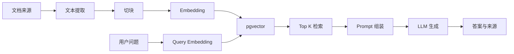

> 这篇笔记的目标，不是继续解释 `RAG` 的概念，而是把问题直接落到“怎么起一个最小可行项目”上：如果现在要做一个能接文档、能入库、能检索、能回答、还能继续迭代的 RAG 服务，第一版到底应该长什么样。

> 这篇内容会有明确的技术偏向：**优先给出 Java Spring Boot / Spring AI 的落地方案**，向量库侧默认从 `pgvector` 起步，因为它对很多已有 Java 后端团队来说心智成本最低。它更偏 MVP 方案、工程拆解和升级路线，不会把重点放在花哨的 agent 编排上。

> 参考资料：

> 官方文档：[Spring AI - Retrieval Augmented Generation](https://docs.spring.io/spring-ai/reference/api/retrieval-augmented-generation.html) 、 [Spring AI - Vector Databases](https://docs.spring.io/spring-ai/reference/api/vectordbs.html) 、 [Spring AI - PGvector](https://docs.spring.io/spring-ai/reference/api/vectordbs/pgvector.html)

> 实践参考：[Microsoft Learn - Develop a RAG application with Spring AI and Azure OpenAI](https://learn.microsoft.com/en-us/training/modules/build-enterprise-ai-agents-with-java-spring/4-spring-ai-development/) 、 [Datawhale - All-in-RAG 第一节 RAG 简介](https://datawhalechina.github.io/all-in-rag/#/chapter1/01_RAG_intro)

[TOC]

---

## 一、先定边界：什么叫“最小 RAG 项目”

这里说的“最小”，不是指 demo 跑通一下就结束，而是指：

- 已经有基本的数据接入能力
- 已经有向量化和检索能力
- 已经能通过接口问答
- 已经能定位问题出在入库、检索还是生成
- 但还没有把系统做复杂

因此，一个最小可行的 RAG 项目至少应具备下面 7 个能力：

1. 能导入一批文档
2. 能把文档切块并写入向量库
3. 能按问题做相似度检索
4. 能把检索结果拼到 prompt 里生成答案
5. 能返回来源信息
6. 能按元数据过滤
7. 能单独验证入库和检索是否正常

如果缺少第 5 到第 7 项，这个系统通常还停留在“能演示”，很难算“能落地”。

## 二、技术选型先别铺太大：第一版为什么建议走 Spring Boot + Spring AI + pgvector

对于 Java 团队，第一版更适合从下面这条技术线起步：

```text
Spring Boot
  + Spring AI
  + PostgreSQL / pgvector
  + 一个 Embedding 模型
  + 一个 Chat 模型
```

原因不是这套一定最强，而是：

- Java 团队已有 Spring Boot 经验
- Spring AI 已经把模型调用、向量存储、RAG Advisor 这层胶水补上了
- `pgvector` 可以复用现有 PostgreSQL 体系
- 第一版不需要额外引入专用向量库运维成本
- 后续要升级到 `Qdrant`、`Milvus` 也不是推倒重来

如果把“最务实的启动姿势”压缩成一句话，可以概括为：

> **先用 Spring AI 把 RAG 主链跑通，向量存储先用 pgvector 验证价值。**

## 三、第一版架构别搞复杂：一条最小链路就够了

一个最小 RAG 项目，建议先拆成两条链路：



这张图对应的就是第一版最小链路：离线侧负责把文档变成可检索的向量数据，在线侧负责把用户问题转成检索请求，再把召回结果拼进 prompt 生成答案。

### 3.1 离线链路：文档入库

```text
文档来源
  -> 文本提取
  -> 切块
  -> Embedding
  -> 写入 pgvector
```

### 3.2 在线链路：检索问答

```text
用户问题
  -> Query Embedding
  -> pgvector 相似度检索
  -> 取回 top k 文档片段
  -> 拼进 Prompt
  -> LLM 生成答案
  -> 返回答案和来源
```

这其实就是最标准的 `Naive RAG`，但对于项目第一版来说已经够用了。

一开始不要急着上：

- 多路召回
- rerank
- query rewrite
- agentic workflow
- graph rag

因为如果最小链路都还没跑稳，这些升级件只会让问题更难定位。

## 四、项目目录怎么拆：先把“入库”和“问答”分开

一个比较务实的 Spring Boot 项目结构，可以先长这样：

```text
src/main/java
  /config
  /controller
  /service
  /rag
    /ingest
    /retrieve
    /prompt
  /repository
  /model
```

这里最关键的是职责不要混：

- `ingest` 负责读文档、切块、入库
- `retrieve` 负责搜索和过滤
- `prompt` 负责组装上下文和回答约束
- `controller` 只负责暴露接口

如果一开始就把这些都揉在一个 Service 里，后面很难判断到底是哪一层出了问题。

## 五、最小数据模型怎么设计：不要只存 embedding

第一版最容易犯的错，就是只想着“把向量存进去”。

但真正可用的文档片段，至少应该带下面这些信息：

- `id`
- `documentId`
- `chunkId`
- `content`
- `metadata`
- `embedding`

其中 `metadata` 建议至少包含：

- 文档名
- 来源路径或 URL
- 标题
- 页码
- 文档类型
- 租户 / 业务域
- 更新时间

为什么元数据重要？

因为后面常见需求通常会落到这些方向：

- 只查某个知识库
- 只查某类文档
- 只看某个租户
- 回答里要标出处
- 某份文档更新后需要删除旧版本

如果一开始不留元数据，后面几乎一定要返工。

## 六、Spring AI 这条线最核心的几个对象，要先认清

如果准备用 Spring AI 做第一版 RAG，建议先把下面几个对象关系看清楚。

### 6.1 `ChatClient`

它负责和聊天模型交互，是最终发起 prompt 调用的入口。

### 6.2 `EmbeddingModel`

它负责把文本转成向量。

无论是文档切块，还是用户 query，向量都要由它生成。

### 6.3 `VectorStore`

它负责把文档和向量存进去，并支持相似度检索。

在 `pgvector` 场景里，Spring AI 已经提供了 `PgVectorStore` 对应支持。

### 6.4 `QuestionAnswerAdvisor`

这是 Spring AI 官方提供的最直接 RAG 入口。

它会在用户提问时：

- 先去向量库查相关文档
- 把检索结果拼到用户问题里
- 再交给模型生成答案

如果只是第一版最小项目，`QuestionAnswerAdvisor` 已经足够。

### 6.5 `RetrievalAugmentationAdvisor`

这是比 `QuestionAnswerAdvisor` 更模块化的一层。

这一层允许把流程拆成：

- pre-retrieval
- retrieval
- post-retrieval
- generation

如果只是最小项目，先不用它也没问题；但如果后面要加改写、重排、空上下文策略，它会更好扩展。

## 七、依赖怎么配：先用官方 starter，不要自己拼太多胶水

如果按 Spring AI 官方思路走，第一版通常至少需要这几类依赖：

```xml
<dependencyManagement>
    <dependencies>
        <dependency>
            <groupId>org.springframework.ai</groupId>
            <artifactId>spring-ai-bom</artifactId>
            <version>${spring-ai.version}</version>
            <type>pom</type>
            <scope>import</scope>
        </dependency>
    </dependencies>
</dependencyManagement>

<dependencies>
    <dependency>
        <groupId>org.springframework.boot</groupId>
        <artifactId>spring-boot-starter-web</artifactId>
    </dependency>

    <dependency>
        <groupId>org.springframework.ai</groupId>
        <artifactId>spring-ai-starter-model-openai</artifactId>
    </dependency>

    <dependency>
        <groupId>org.springframework.ai</groupId>
        <artifactId>spring-ai-starter-vector-store-pgvector</artifactId>
    </dependency>

    <dependency>
        <groupId>org.springframework.ai</groupId>
        <artifactId>spring-ai-advisors-vector-store</artifactId>
    </dependency>

    <dependency>
        <groupId>org.postgresql</groupId>
        <artifactId>postgresql</artifactId>
    </dependency>
</dependencies>
```

如果后面想从简单问答升级到模块化 RAG，再补：

```xml
<dependency>
    <groupId>org.springframework.ai</groupId>
    <artifactId>spring-ai-rag</artifactId>
</dependency>
```

这里有个现实建议：

- 第一版先别急着兼容太多模型厂商
- 先固定一个 embedding 模型
- 再固定一个 chat 模型
- 先把链路稳定性打出来

## 八、数据库怎么起：pgvector 是第一版很合适的起点

### 8.1 为什么第一版更推荐 `pgvector`

它更适合回答一个很常见的问题：

> 已有 Java + Spring Boot + PostgreSQL 团队，是否可以先不引入独立向量库？

在很多 MVP 场景下，答案是可以。

它的优势很直接：

- 部署和运维成本低
- 可复用现有 Postgres 账号、权限、备份
- 业务表和向量表在同一数据库体系内
- 元数据过滤和业务字段联动更自然

当然，它也不是没边界：

- 超大规模检索不一定是最优
- 专用向量库在分布式、复杂检索上可能更强

但这些问题对第一版 MVP 往往不是核心矛盾。

### 8.2 本地起库可以先用 Docker

比如：

```yaml
services:
  postgres:
    image: pgvector/pgvector:pg16
    ports:
      - "5432:5432"
    environment:
      POSTGRES_DB: rag
      POSTGRES_USER: postgres
      POSTGRES_PASSWORD: postgres
```

### 8.3 手工建表大致长这样

Spring AI 文档里给出了 `pgvector` 典型 schema，大意如下：

```sql
CREATE EXTENSION IF NOT EXISTS vector;
CREATE EXTENSION IF NOT EXISTS hstore;
CREATE EXTENSION IF NOT EXISTS "uuid-ossp";

CREATE TABLE IF NOT EXISTS vector_store (
    id uuid DEFAULT uuid_generate_v4() PRIMARY KEY,
    content text,
    metadata json,
    embedding vector(1536)
);

CREATE INDEX ON vector_store USING HNSW (embedding vector_cosine_ops);
```

如果使用 Spring AI 的自动 schema 初始化，也可以让框架帮忙建表，但要注意：

- 新版本需要显式开启 `initialize-schema`
- embedding 维度要和所选模型一致

## 九、配置怎么写：先保证“能接模型、能连数据库、能自动建表”

一个最小可行配置，大致可以写成：

```yaml
spring:
  datasource:
    url: jdbc:postgresql://localhost:5432/rag
    username: postgres
    password: postgres

  ai:
    openai:
      api-key: ${OPENAI_API_KEY}
      chat:
        options:
          model: gpt-4o-mini
      embedding:
        options:
          model: text-embedding-3-small

    vectorstore:
      pgvector:
        initialize-schema: true
        index-type: HNSW
        distance-type: COSINE_DISTANCE
        dimensions: 1536
```

如果使用的是 Azure OpenAI 或其他兼容实现，主要替换的是模型配置，不影响整体思路。

## 十、离线入库怎么做：最小实现先把文档读、切、存跑通

### 10.1 文档来源先收敛

第一版强烈建议先只支持 1 到 2 种输入格式，比如：

- Markdown
- PDF

不要第一天就想同时搞：

- Word
- 网页抓取
- 图片 OCR
- Excel
- 飞书 / Confluence / 钉钉

因为 RAG 的第一版痛点往往不在“格式不够多”，而在“已有格式能不能稳定进来”。

### 10.2 切块策略先别搞太花

第一版可以先采用：

- 按段落 / 标题切
- 配合固定 token 上限
- 保留少量 overlap

最重要的是：

- 不要把整页一次性塞成大 chunk
- 不要切得太碎导致上下文断掉

### 10.3 入库服务可以长这样

下面这个示意代码，不追求 API 100% 完整，而是把职责边界摆清楚：

```java
@Service
public class RagIngestService {

    private final VectorStore vectorStore;

    public RagIngestService(VectorStore vectorStore) {
        this.vectorStore = vectorStore;
    }

    public void ingest(List<RagChunk> chunks) {
        List<Document> documents = chunks.stream()
                .map(chunk -> new Document(
                        chunk.content(),
                        Map.of(
                                "documentId", chunk.documentId(),
                                "title", chunk.title(),
                                "page", String.valueOf(chunk.page()),
                                "source", chunk.source()
                        )))
                .toList();

        vectorStore.add(documents);
    }
}
```

这里的重点不是 `vectorStore.add()` 这一行本身，而是入库前已经把：

- chunk 内容
- 文档身份
- 来源信息
- 位置元数据

都准备好了。

### 10.4 入库接口建议单独做

比如至少提供一个：

- `POST /api/rag/ingest`

或者一个后台任务入口：

- `POST /api/rag/rebuild`

原因很简单：

- 入库是批处理动作
- 问答是在线请求
- 两者生命周期和故障处理方式完全不同

不要把它们揉成同一个接口。

## 十一、在线问答怎么做：Spring AI 最小方案可以直接上 `QuestionAnswerAdvisor`

这是 Spring AI 官方给出的最直接 RAG 方式，也是第一版最容易落地的方式。

### 11.1 最小问答链路

```java
@Service
public class RagChatService {

    private final ChatClient chatClient;
    private final VectorStore vectorStore;

    public RagChatService(ChatModel chatModel, VectorStore vectorStore) {
        this.chatClient = ChatClient.builder(chatModel).build();
        this.vectorStore = vectorStore;
    }

    public String ask(String question) {
        var advisor = QuestionAnswerAdvisor.builder(vectorStore)
                .searchRequest(SearchRequest.builder()
                        .topK(5)
                        .similarityThreshold(0.75d)
                        .build())
                .build();

        return chatClient.prompt()
                .advisors(advisor)
                .user(question)
                .call()
                .content();
    }
}
```

这段代码背后的链路是：

1. 用户输入问题
2. `QuestionAnswerAdvisor` 去向量库做相似度搜索
3. 把召回内容拼到 prompt
4. 模型基于上下文生成回答

这已经是一个能跑的 RAG 问答主链。

### 11.2 如果需要按知识库过滤

Spring AI 支持在 `SearchRequest` 里加过滤表达式。

例如：

```java
var advisor = QuestionAnswerAdvisor.builder(vectorStore)
        .searchRequest(SearchRequest.builder()
                .topK(5)
                .similarityThreshold(0.75d)
                .filterExpression("kb == 'employee-handbook'")
                .build())
        .build();
```

这样就可以按：

- 知识库
- 文档类型
- 租户
- 业务域

做基础隔离。

### 11.3 如果需要运行时动态过滤

Spring AI 也支持在请求时动态传 filter。

这在多知识库、多租户场景里非常实用，因为不需要为每个知识库都创建一套固定 client。

## 十二、如果希望更像“正经接口服务”，建议至少暴露这 3 类 API

### 12.1 文档入库

```text
POST /api/rag/documents
```

负责：

- 上传文档
- 解析
- 切块
- 入库

### 12.2 相似度检索调试

```text
GET /api/rag/search?q=...
```

负责：

- 只返回检索结果
- 不调用 LLM

这是线上排问题非常重要的接口。

因为当线上反馈“答得不对”时，必须先知道：

- 是没召回到
- 还是召回到了但没用好

### 12.3 问答接口

```text
POST /api/rag/ask
```

输入：

- 用户问题
- 可选知识库
- 可选过滤参数

输出：

- 回答文本
- 命中的来源
- 可选调试信息

## 十三、Prompt 怎么约束：第一版一定要强约束，不要给模型太大自由

最小 RAG 项目里，prompt 不求花哨，但一定要清楚。

这类 prompt 至少要表达 4 件事：

1. 只能基于检索到的内容回答
2. 证据不足时明确说不知道
3. 尽量引用来源
4. 不要把外部常识硬混进来

例如：

```text
你是一个知识库问答助手。
请严格基于提供的上下文回答问题。
如果上下文不足以支持回答，请直接说明“不知道”或“资料不足”。
回答尽量简洁，并在最后列出使用到的来源标题。
```

如果没有这层约束，很容易出现：

- 检索明明不充分，模型还硬答
- 资料和常识冲突时，模型私自改写

## 十四、第一版最值得做的，不是优化回答，而是先把可观测性补上

真正落地时，最有价值的往往不是“再换个大模型”，而是能不能看到这几个东西：

- 本次 query 是什么
- top k 召回了哪些 chunk
- 每个 chunk 的分数是多少
- 最终拼给模型的上下文是什么
- 回答引用了哪些来源

如果没有这些信息，后面一旦出现“答错了”的反馈，排查基本只能靠猜。

所以第一版就建议加上最基础的日志和调试开关。

## 十五、如何判断第一版是不是合格：先看这 5 个问题

### 15.1 文档是否真的入库成功

不要只看接口 200。

至少确认：

- 向量表里是否真的有记录
- metadata 是否正确
- chunk 数量是否符合预期

### 15.2 检索接口是否能召回对的片段

这一步必须脱离 LLM 单独验证。

### 15.3 回答是否真的使用了检索结果

不要只看“像不像对”，而要看：

- 回答能否被检索片段支撑

### 15.4 资料不足时是否会拒答

如果资料不足还稳定胡说，第一版就不能算合格。

### 15.5 来源是否能回显

哪怕第一版只返回：

- 文档标题
- 来源地址

都比完全不给出处强很多。

## 十六、Java Spring Boot / Spring AI 的推荐落地方案怎么选

如果把“现在真的要做一个 Java 版 RAG 服务，最推荐哪条路”落成具体方案，可以先从下面这个组合开始。

先把三个阶段放到一张表里看，会更容易判断当前项目所处的位置：

| 阶段 | 核心组合 | 主要目标 | 关键能力 | 适用场景 |
| --- | --- | --- | --- | --- |
| 第一阶段：最小可行方案 | `Spring Boot + Spring AI + pgvector + QuestionAnswerAdvisor` | 先把 RAG 主链跑通 | 文档入库、向量检索、基础问答、来源返回 | 快速验证知识库问答价值，团队主体是 Java，且已有 PostgreSQL |
| 第二阶段：增强方案 | `Spring Boot + Spring AI + pgvector/专用向量库 + RetrievalAugmentationAdvisor` | 提升检索可控性和扩展性 | 元数据过滤、检索调试接口、模块化 retrieval、为 query rewrite / rerank 预留扩展点 | 需要多知识库、多租户和更细粒度检索策略 |
| 第三阶段：生产增强 | 在前两阶段基础上补齐工程能力 | 把可用系统推进到可持续运营 | 异步入库、版本控制、删除重建索引、多路召回、缓存、评估集、链路观测 | 已进入生产迭代，需要稳定性、可观测性和持续优化能力 |

### 16.1 第一阶段：最小可行方案

```text
Spring Boot
  + Spring AI
  + OpenAI / Azure OpenAI 兼容模型
  + pgvector
  + QuestionAnswerAdvisor
```

适用场景：

- 想快速验证知识库问答价值
- 团队主体是 Java
- 已有 PostgreSQL
- 文档量还不算特别大

### 16.2 第二阶段：增强方案

```text
Spring Boot
  + Spring AI
  + pgvector 或专用向量库
  + RetrievalAugmentationAdvisor
  + 元数据过滤
  + 检索调试接口
```

适用场景：

- 需要更精细的检索控制
- 需要模块化扩展 query rewrite / rerank
- 开始进入多知识库、多租户、多场景

### 16.3 第三阶段：生产增强

再逐步补：

- 异步入库
- 文档版本控制
- 删除 / 重建索引
- 多路召回
- rerank
- 缓存
- 评估集
- 观测与链路追踪

这才是比较现实的演进顺序。

## 十七、什么时候该从 `QuestionAnswerAdvisor` 升级到模块化 RAG

如果已经遇到下面这些问题，就说明该升级了：

- 不同问题需要不同检索策略
- 只靠 top k 效果波动很大
- 需要加 query rewrite
- 需要空上下文兜底策略
- 需要后处理或重排

这时就可以考虑把简单模式：

- `QuestionAnswerAdvisor`

升级成更可编排的：

- `RetrievalAugmentationAdvisor`

但顺序一定要对：

- 先把最小链路跑稳
- 再增加模块化能力

不要反过来。

## 十八、第一版最常见的坑，其实都很朴素

### 18.1 文档没切好

导致定义、结论、限制条件被拆开，最后召回内容不完整。

### 18.2 只返回答案，不返回来源

一旦答错，几乎没法排查。

### 18.3 把检索和问答绑死

导致无法单独验证检索质量。

### 18.4 元数据设计太弱

后面想做知识库隔离和过滤时直接卡住。

### 18.5 直接上专用向量库，结果项目复杂度先爆炸

第一版最怕的不是技术不够高级，而是链路太长，问题定位不了。

## 十九、如果从 0 开一个 Java RAG 小项目，可以按这个顺序做

1. 起一个 Spring Boot 工程
2. 接入 Spring AI 和一个稳定模型
3. 本地拉起 PostgreSQL + pgvector
4. 打通 `VectorStore.add()` 入库
5. 单独做一个 `/search` 接口验证检索
6. 再接 `QuestionAnswerAdvisor` 做 `/ask`
7. 补来源返回和基础日志
8. 准备 20 到 50 条真实问答样本做人工验证

如果这 8 步都稳定了，再谈：

- 重排
- 混合检索
- 复杂编排
- 多模型切换

## 二十、最后收个口：最小项目真正要证明的，不是“会调 AI API”

如果把这篇笔记压缩成一句话，核心结论是：

> **最小 RAG 项目要证明的，不是“模型能回答”，而是“文档能被稳定入库、稳定召回、稳定约束生成”。**

而在 Java Spring Boot 生态里，更务实的起步方案可以概括为：

> **Spring Boot + Spring AI + pgvector + QuestionAnswerAdvisor。**

这条线的好处不是它一步到位，而是它特别适合第一版：

- 容易启动
- 容易理解
- 容易排查
- 容易往上升级

顺着这条线继续展开，比较值得单独深入的两个专题是：

- `Spring AI` 里的 `QuestionAnswerAdvisor` / `RetrievalAugmentationAdvisor` 执行链与扩展点
- Java RAG 项目里的文档入库、切块、版本管理和评估体系
