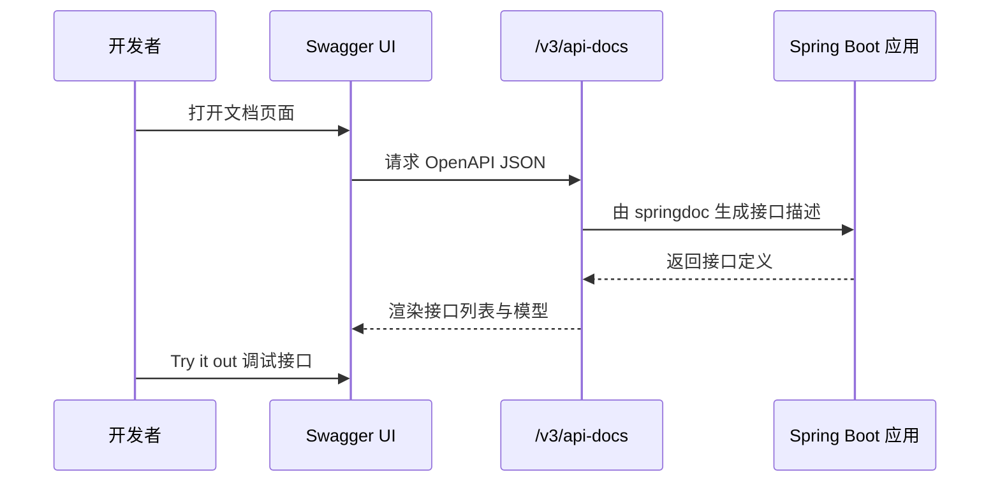

> 这篇笔记的目标是把 `Swagger` 放回 `Spring Boot` 的真实工程语境里重新理解一遍：它到底是什么，和 `OpenAPI`、`springdoc-openapi` 分别是什么关系，在项目里解决的核心问题是什么，以及一套完整的接入方案应该怎样落到代码、配置和团队协作流程上。

> 文中重点不是停留在“把页面跑起来”这一层，而是围绕一个典型后端项目展开：接口持续迭代、前后端要对齐字段、测试要验证参数、开发希望快速查看和调试接口。对 `Spring Boot` 而言，现在更常见的实战方案并不是早期的 `springfox`，而是 `springdoc-openapi + Swagger UI`；因此正文会先把概念关系拆清，再给出一个订单服务案例。

> 参考资料：
>
> 官方规范：[OpenAPI Specification](https://swagger.io/specification/) 、 [OpenAPI Initiative](https://www.openapis.org/)
>
> Swagger 资料：[Swagger Documentation](https://swagger.io/docs/) 、 [Swagger UI Installation](https://swagger.io/docs/open-source-tools/swagger-ui/usage/installation/)
>
> SpringDoc 资料：[springdoc-openapi](https://springdoc.org/) 、 [springdoc Modules](https://springdoc.org/modules.html) 、 [springdoc Features](https://springdoc.org/features.html)
>
> Spring 资料：[Spring Boot Reference Documentation](https://docs.spring.io/spring-boot/documentation.html)

[TOC]

---

## 一、先把几个概念说清楚

很多人口中的“上 Swagger”，实际混在一起说了四个不同层面的东西。

| 名称 | 本质 | 解决的问题 | 在 Spring Boot 里的角色 |
|------|------|------------|--------------------------|
| `OpenAPI` | 规范 | 用标准格式描述 HTTP API 契约 | 文档的标准模型 |
| `Swagger` | 一组工具生态 | 围绕 OpenAPI 做展示、编辑、调试 | 常被用来泛指整套接口文档方案 |
| `Swagger UI` | 文档页面 | 把 OpenAPI 文档渲染成可浏览、可调试页面 | 最直观的可视化入口 |
| `springdoc-openapi` | Spring Boot 集成库 | 从 Spring Web 应用生成 OpenAPI 文档，并接入 Swagger UI | 当前 Spring Boot 常用实现 |

如果只记一句最核心的话，可以概括为：

> 在 `Spring Boot` 项目里，开发者口中的“Swagger”，通常不是单指某个规范，而是指“使用 `springdoc-openapi` 生成 `OpenAPI` 文档，再通过 `Swagger UI` 展示和调试接口”这一整套方案。

这件事之所以容易混淆，是因为历史上：

- `Swagger Specification` 后来演进成了 `OpenAPI Specification`
- 但很多团队仍然保留“Swagger 文档”“Swagger 页面”这样的习惯叫法
- 所以在工程讨论里，“Swagger”往往是一个口语化统称

---

## 二、为什么在 Spring Boot 项目里要用 Swagger

接口文档这个东西，如果没有工具支持，最容易出现三个问题：

1. 接口写完了，但没有一份结构化说明
2. 接口字段改了，但前端、测试和调用方不知道
3. 文档分散在 wiki、聊天记录和代码注释里，最终没有统一真相源

在 `Spring Boot` 项目里引入 Swagger 类方案，主要是为了解决下面这些现实问题：

- 让接口定义和代码靠近，减少“文档另存一份”的重复劳动
- 让前后端可以直接看到路径、参数、响应结构和错误码
- 让测试和联调阶段可以通过页面快速查看接口契约
- 让新同学接手项目时，先有一份可以快速浏览的 API 地图

从团队协作角度看，它本质上承担的是“接口可见性”这件事。

### 2.1 它带来的核心价值

| 价值 | 具体体现 |
|------|----------|
| 降低沟通成本 | 前端不用追着后端问字段名和必填项 |
| 提升联调效率 | 可以直接查看请求示例、响应示例、状态码 |
| 统一接口认知 | 所有人围绕同一份接口描述工作 |
| 方便项目交接 | 新成员先看文档，再看代码，理解成本更低 |
| 支撑后续工具链 | OpenAPI 文档还能导入 Postman、生成 SDK、做规范校验 |

### 2.2 但它解决不了什么

这也是学习 Swagger 时很重要的一层边界。

> Swagger 擅长的是“描述接口”，不是“自动保证接口逻辑正确”。

也就是说，它不能天然替代：

- 接口测试
- 参数校验策略设计
- 错误码治理
- 版本兼容方案
- 权限模型设计

如果项目只有 Swagger 页面，但没有测试、没有统一返回规范、没有错误码约束，那么页面再完整，也只是“看起来比较整齐”。

---

## 三、Spring Boot 里常见接口文档方案怎么选

在 Java 后端里，比较常见的方案其实不只一种。

| 方案 | 文档来源 | 是否可交互调试 | 和 Spring Boot 的契合度 | 适用场景 |
|------|----------|----------------|---------------------------|----------|
| `springdoc-openapi + Swagger UI` | 注解 + 运行时扫描 | 是 | 很高 | 常规 REST API 项目 |
| `Spring REST Docs` | 测试用例生成 | 通常不是在线调试入口 | 很高 | 强调文档必须跟测试绑定 |
| `apidoc` | 源码注释 | 一般偏静态展示 | 中等 | 偏静态归档和 CI 文档产物 |

如果问题是“Spring Boot 项目里最省心、最常见、最容易让前后端上手的方案是什么”，通常答案就是：

- `springdoc-openapi + Swagger UI`

如果问题换成“哪一种方案最强调文档准确性必须和测试结果绑定”，那往往更接近：

- `Spring REST Docs`

所以这篇笔记把重点放在 Swagger，并不是说它是唯一答案，而是因为它在 `Spring Boot` 项目里的使用门槛最低，团队接受度也通常最高。

---

## 四、Swagger 在 Spring Boot 中到底怎么工作

从执行链路看，它大致是下面这个过程：

```mermaid
graph LR
    A[Controller 与 DTO] --> B[springdoc 扫描 Spring Web 元数据]
    B --> C[生成 OpenAPI 文档]
    C --> D[/v3/api-docs]
    C --> E[Swagger UI 页面]
    E --> F[前端与测试查看]
    E --> G[Try it out 调试]
```

这条链路里最关键的不是“页面”，而是中间那份 `OpenAPI` 文档。

因为真正被工具链消费的，往往不是浏览器里看到的按钮和表格，而是：

- `JSON/YAML` 形式的接口定义
- 每个接口的路径、方法、参数、响应结构
- 认证方式、标签分组、示例值、状态码说明

所以可以把它理解成两层：

1. `springdoc-openapi` 负责生成机器可读的契约描述
2. `Swagger UI` 负责把这份契约渲染成适合人阅读和调试的页面

---

## 五、Spring Boot 3 中接入 Swagger 的最小方案

这里先直接给当前更常用的结论：

> 如果是 `Spring Boot 3` 新项目，优先使用 `springdoc-openapi`；不建议再把早期的 `springfox` 作为默认首选方案。

### 5.1 Maven 依赖

如果项目使用 `Spring MVC`，最常见的依赖如下：

```xml
<dependencies>
    <dependency>
        <groupId>org.springframework.boot</groupId>
        <artifactId>spring-boot-starter-web</artifactId>
    </dependency>

    <dependency>
        <groupId>org.springframework.boot</groupId>
        <artifactId>spring-boot-starter-validation</artifactId>
    </dependency>

    <dependency>
        <groupId>org.springdoc</groupId>
        <artifactId>springdoc-openapi-starter-webmvc-ui</artifactId>
        <version>2.8.9</version>
    </dependency>
</dependencies>
```

这一个 starter 做了两件事：

- 提供 `/v3/api-docs` 这样的 OpenAPI 描述端点
- 提供 `/swagger-ui/index.html` 这样的可视化页面

### 5.2 application.yml 基础配置

```yaml
springdoc:
  api-docs:
    path: /v3/api-docs
  swagger-ui:
    path: /swagger-ui.html
    operations-sorter: method
    tags-sorter: alpha
    try-it-out-enabled: true
  packages-to-scan: com.example.order.controller
  paths-to-match: /api/**
```

这份配置的意义可以拆成四点：

- 固定文档端点路径，避免团队内路径不一致
- 开启更易读的接口排序
- 只扫描指定包，减少无关接口进入文档
- 只暴露 `/api/**` 路径，避免把内部测试接口也带出来

### 5.3 页面访问地址

接入成功后，通常会有两个入口：

| 地址 | 用途 |
|------|------|
| `/v3/api-docs` | 查看 OpenAPI JSON |
| `/swagger-ui/index.html` 或自定义路径 | 查看 Swagger UI 页面 |

如果配置了 `springdoc.swagger-ui.path=/swagger-ui.html`，那么页面会变成：

```text
http://localhost:8080/swagger-ui.html
```

---

## 六、注解到底该怎么写，才不是“只有个页面”

很多项目接入 Swagger 后最大的问题不是跑不起来，而是页面虽然有了，内容却很空。

典型现象通常是：

- 路径有了，但参数说明没有
- DTO 字段有了，但业务语义没有
- 响应结构只有 `object`，根本看不出真实字段
- 安全认证方式没写，调用方不知道请求头该怎么带

所以真正有价值的用法，不是只加一个依赖，而是把关键注解写在对的层次上。

### 6.1 常见注解分工

| 注解 | 典型位置 | 作用 |
|------|----------|------|
| `@Tag` | Controller 类上 | 对接口按业务域分组 |
| `@Operation` | 方法上 | 说明接口用途、摘要、备注 |
| `@Parameter` | 参数上 | 描述路径参数、查询参数等 |
| `@Schema` | DTO 字段或类上 | 补充字段说明、示例值、范围 |
| `@ApiResponses` / `@ApiResponse` | 方法上 | 描述成功与失败响应 |
| `@SecurityRequirement` | 方法或类上 | 说明当前接口需要哪种认证 |

### 6.2 最容易被忽略的一点

> 如果你的项目有统一返回体，例如 `CommonResponse<T>`，那么只写 Controller 方法签名通常还不够，DTO 和包装对象本身也必须写清楚结构和字段语义。

否则页面里很容易出现：

- `data` 里面是什么不清楚
- `code` 是字符串还是整数不清楚
- 错误场景有哪些不清楚

---

## 七、实战案例：订单服务接入 Swagger

下面给一个更接近真实项目的例子。假设现在有一个 `Spring Boot 3` 订单服务，需要暴露下面两个接口：

1. `GET /api/orders/{id}` 查询订单详情
2. `POST /api/orders` 创建订单

目标是：

- 自动生成文档
- 页面可直接查看请求参数和返回结构
- 支持 Bearer Token 鉴权说明
- 可以在开发环境里通过 Swagger UI 做联调

### 7.1 示例目录结构

```text
order-service
├── src/main/java/com/example/order
│   ├── config
│   │   └── OpenApiConfig.java
│   ├── controller
│   │   └── OrderController.java
│   ├── dto
│   │   ├── CommonResponse.java
│   │   ├── CreateOrderRequest.java
│   │   └── OrderDetailVO.java
│   └── OrderApplication.java
└── src/main/resources
    └── application.yml
```

### 7.2 统一返回体

```java
package com.example.order.dto;

import io.swagger.v3.oas.annotations.media.Schema;

@Schema(description = "统一响应对象")
public class CommonResponse<T> {

    @Schema(description = "业务响应码，0 表示成功", example = "0")
    private Integer code;

    @Schema(description = "响应消息", example = "success")
    private String message;

    @Schema(description = "业务数据")
    private T data;

    public static <T> CommonResponse<T> success(T data) {
        CommonResponse<T> response = new CommonResponse<>();
        response.setCode(0);
        response.setMessage("success");
        response.setData(data);
        return response;
    }

    public Integer getCode() {
        return code;
    }

    public void setCode(Integer code) {
        this.code = code;
    }

    public String getMessage() {
        return message;
    }

    public void setMessage(String message) {
        this.message = message;
    }

    public T getData() {
        return data;
    }

    public void setData(T data) {
        this.data = data;
    }
}
```

### 7.3 请求 DTO

```java
package com.example.order.dto;

import io.swagger.v3.oas.annotations.media.ArraySchema;
import io.swagger.v3.oas.annotations.media.Schema;
import jakarta.validation.constraints.Min;
import jakarta.validation.constraints.NotBlank;
import jakarta.validation.constraints.NotEmpty;
import jakarta.validation.constraints.NotNull;

import java.util.List;

@Schema(description = "创建订单请求")
public class CreateOrderRequest {

    @NotNull
    @Schema(description = "用户 ID", example = "10001", requiredMode = Schema.RequiredMode.REQUIRED)
    private Long userId;

    @NotBlank
    @Schema(description = "收货地址", example = "浙江省宁波市鄞州区 XX 路 88 号", requiredMode = Schema.RequiredMode.REQUIRED)
    private String address;

    @NotEmpty
    @ArraySchema(schema = @Schema(description = "商品项"))
    private List<OrderItem> items;

    public Long getUserId() {
        return userId;
    }

    public void setUserId(Long userId) {
        this.userId = userId;
    }

    public String getAddress() {
        return address;
    }

    public void setAddress(String address) {
        this.address = address;
    }

    public List<OrderItem> getItems() {
        return items;
    }

    public void setItems(List<OrderItem> items) {
        this.items = items;
    }

    @Schema(description = "订单商品项")
    public static class OrderItem {

        @NotNull
        @Schema(description = "SKU ID", example = "2001001", requiredMode = Schema.RequiredMode.REQUIRED)
        private Long skuId;

        @NotNull
        @Min(1)
        @Schema(description = "购买数量", example = "2", minimum = "1", requiredMode = Schema.RequiredMode.REQUIRED)
        private Integer quantity;

        public Long getSkuId() {
            return skuId;
        }

        public void setSkuId(Long skuId) {
            this.skuId = skuId;
        }

        public Integer getQuantity() {
            return quantity;
        }

        public void setQuantity(Integer quantity) {
            this.quantity = quantity;
        }
    }
}
```

### 7.4 响应 DTO

```java
package com.example.order.dto;

import io.swagger.v3.oas.annotations.media.Schema;

import java.math.BigDecimal;

@Schema(description = "订单详情响应")
public class OrderDetailVO {

    @Schema(description = "订单 ID", example = "1024")
    private Long id;

    @Schema(description = "订单编号", example = "SO202606230001")
    private String orderNo;

    @Schema(description = "用户 ID", example = "10001")
    private Long userId;

    @Schema(description = "支付金额", example = "99.50")
    private BigDecimal payAmount;

    @Schema(description = "订单状态", example = "PAID")
    private String status;

    public Long getId() {
        return id;
    }

    public void setId(Long id) {
        this.id = id;
    }

    public String getOrderNo() {
        return orderNo;
    }

    public void setOrderNo(String orderNo) {
        this.orderNo = orderNo;
    }

    public Long getUserId() {
        return userId;
    }

    public void setUserId(Long userId) {
        this.userId = userId;
    }

    public BigDecimal getPayAmount() {
        return payAmount;
    }

    public void setPayAmount(BigDecimal payAmount) {
        this.payAmount = payAmount;
    }

    public String getStatus() {
        return status;
    }

    public void setStatus(String status) {
        this.status = status;
    }
}
```

### 7.5 OpenAPI 配置

```java
package com.example.order.config;

import io.swagger.v3.oas.models.Components;
import io.swagger.v3.oas.models.OpenAPI;
import io.swagger.v3.oas.models.info.Contact;
import io.swagger.v3.oas.models.info.Info;
import io.swagger.v3.oas.models.info.License;
import io.swagger.v3.oas.models.security.SecurityRequirement;
import io.swagger.v3.oas.models.security.SecurityScheme;
import org.springframework.context.annotation.Bean;
import org.springframework.context.annotation.Configuration;

@Configuration
public class OpenApiConfig {

    @Bean
    public OpenAPI orderServiceOpenAPI() {
        String securitySchemeName = "bearerAuth";

        return new OpenAPI()
                .info(new Info()
                        .title("Order Service API")
                        .description("Spring Boot 订单服务接口文档")
                        .version("1.0.0")
                        .contact(new Contact().name("Ekko").email("ekko@example.com"))
                        .license(new License().name("Apache 2.0")))
                .addSecurityItem(new SecurityRequirement().addList(securitySchemeName))
                .components(new Components()
                        .addSecuritySchemes(securitySchemeName, new SecurityScheme()
                                .name(securitySchemeName)
                                .type(SecurityScheme.Type.HTTP)
                                .scheme("bearer")
                                .bearerFormat("JWT")));
    }
}
```

这段配置主要补齐三类信息：

- 文档标题、版本、描述等全局元信息
- Bearer Token 鉴权方式
- 全局安全要求，避免每个接口重复写一遍

### 7.6 Controller 示例

```java
package com.example.order.controller;

import com.example.order.dto.CommonResponse;
import com.example.order.dto.CreateOrderRequest;
import com.example.order.dto.OrderDetailVO;
import io.swagger.v3.oas.annotations.Operation;
import io.swagger.v3.oas.annotations.Parameter;
import io.swagger.v3.oas.annotations.media.Content;
import io.swagger.v3.oas.annotations.media.ExampleObject;
import io.swagger.v3.oas.annotations.media.Schema;
import io.swagger.v3.oas.annotations.responses.ApiResponse;
import io.swagger.v3.oas.annotations.responses.ApiResponses;
import io.swagger.v3.oas.annotations.security.SecurityRequirement;
import io.swagger.v3.oas.annotations.tags.Tag;
import jakarta.validation.Valid;
import org.springframework.web.bind.annotation.GetMapping;
import org.springframework.web.bind.annotation.PathVariable;
import org.springframework.web.bind.annotation.PostMapping;
import org.springframework.web.bind.annotation.RequestBody;
import org.springframework.web.bind.annotation.RequestMapping;
import org.springframework.web.bind.annotation.RestController;

import java.math.BigDecimal;

@Tag(name = "订单接口", description = "订单查询与创建相关接口")
@RestController
@RequestMapping("/api/orders")
public class OrderController {

    @Operation(
            summary = "查询订单详情",
            description = "按订单 ID 查询订单详情，返回订单基础信息、金额和状态",
            security = @SecurityRequirement(name = "bearerAuth")
    )
    @ApiResponses({
            @ApiResponse(responseCode = "200", description = "查询成功"),
            @ApiResponse(responseCode = "404", description = "订单不存在"),
            @ApiResponse(responseCode = "401", description = "未登录或 token 无效")
    })
    @GetMapping("/{id}")
    public CommonResponse<OrderDetailVO> getOrderDetail(
            @Parameter(description = "订单 ID", example = "1024", required = true)
            @PathVariable Long id) {

        OrderDetailVO detail = new OrderDetailVO();
        detail.setId(id);
        detail.setOrderNo("SO202606230001");
        detail.setUserId(10001L);
        detail.setPayAmount(new BigDecimal("99.50"));
        detail.setStatus("PAID");
        return CommonResponse.success(detail);
    }

    @Operation(
            summary = "创建订单",
            description = "创建新订单，请求体包含用户、收货地址与商品列表",
            security = @SecurityRequirement(name = "bearerAuth")
    )
    @ApiResponses({
            @ApiResponse(
                    responseCode = "200",
                    description = "创建成功",
                    content = @Content(
                            mediaType = "application/json",
                            schema = @Schema(implementation = CommonResponse.class),
                            examples = @ExampleObject(
                                    value = """
                                            {
                                              "code": 0,
                                              "message": "success",
                                              "data": {
                                                "id": 1025,
                                                "orderNo": "SO202606230002",
                                                "userId": 10001,
                                                "payAmount": 199.00,
                                                "status": "CREATED"
                                              }
                                            }
                                            """
                            )
                    )
            ),
            @ApiResponse(responseCode = "400", description = "参数校验失败"),
            @ApiResponse(responseCode = "401", description = "未登录或 token 无效")
    })
    @PostMapping
    public CommonResponse<OrderDetailVO> createOrder(@Valid @RequestBody CreateOrderRequest request) {
        OrderDetailVO detail = new OrderDetailVO();
        detail.setId(1025L);
        detail.setOrderNo("SO202606230002");
        detail.setUserId(request.getUserId());
        detail.setPayAmount(new BigDecimal("199.00"));
        detail.setStatus("CREATED");
        return CommonResponse.success(detail);
    }
}
```

这个例子里比较关键的不是代码复杂度，而是信息表达比较完整：

- `@Tag` 解决分组问题
- `@Operation` 解决接口用途说明问题
- `@Parameter` 和 `@Schema` 解决字段语义问题
- `@ApiResponses` 解决成功与失败场景说明问题
- `@SecurityRequirement` 解决鉴权入口说明问题

### 7.7 启动后可以看到什么

项目启动后，接口文档的使用链路大致如下：



如果配置正确，开发者在页面里至少能看到：

- 接口分组
- 请求方法和路径
- 路径参数、查询参数、请求体结构
- 响应码
- 响应模型
- 鉴权输入框

### 7.8 按模块分组文档的实战写法

当项目接口一多，所有内容都堆在一个 Swagger 页面里，阅读体验会迅速变差。最常见的表现通常是：

- 后台接口和前台接口混在一起
- 订单、用户、支付三个域全部挤在一个列表里
- 测试和前端很难快速定位自己关心的接口组

这时可以使用 `GroupedOpenApi` 按业务域或路径做分组。

```java
package com.example.order.config;

import org.springdoc.core.models.GroupedOpenApi;
import org.springframework.context.annotation.Bean;
import org.springframework.context.annotation.Configuration;

@Configuration
public class OpenApiGroupConfig {

    @Bean
    public GroupedOpenApi adminApi() {
        return GroupedOpenApi.builder()
                .group("admin-order")
                .pathsToMatch("/api/admin/orders/**")
                .packagesToScan("com.example.order.controller.admin")
                .build();
    }

    @Bean
    public GroupedOpenApi appApi() {
        return GroupedOpenApi.builder()
                .group("app-order")
                .pathsToMatch("/api/orders/**")
                .packagesToScan("com.example.order.controller.app")
                .build();
    }
}
```

如果有了这层配置，Swagger UI 页面一般就能切换不同分组，OpenAPI 文档地址也会出现类似：

```text
/v3/api-docs/admin-order
/v3/api-docs/app-order
```

这类分组在真实项目里很有用，尤其适合下面几种场景：

| 分组方式 | 适用场景 | 说明 |
|----------|----------|------|
| 按业务域分组 | 订单、用户、库存、支付 | 最符合常规单体或微服务内部模块划分 |
| 按调用方分组 | 后台接口、App 接口、开放平台接口 | 适合一个服务服务多个调用端 |
| 按版本分组 | `v1`、`v2` | 适合接口长期兼容演进 |
| 按包路径分组 | `controller.admin`、`controller.app` | 实现上最容易和代码结构对齐 |

一个更稳的经验通常是：

- 分组不要过细，否则页面会碎片化
- 分组名要直接表达调用对象或业务域
- `packagesToScan` 和 `pathsToMatch` 最好一起配，避免误扫

---

## 八、这个实战案例里真正容易踩坑的地方

能把页面跑起来，只是第一步。真正影响使用体验的，往往是下面这些坑。

### 8.1 只写 Controller，不写 DTO 描述

这是最常见的问题。

如果 DTO 字段没有 `@Schema` 描述，页面虽然能扫出结构，但经常只剩下：

- 字段名
- 基础类型
- 很少的业务语义

对于前后端联调来说，这远远不够。

### 8.2 Spring Security 把文档页面拦住了

很多项目接了 `Spring Security` 之后，打开文档直接 `401`，原因并不是 Swagger 失效，而是文档端点本身被安全规则拦截了。

开发环境通常至少要放行这些路径：

```java
requestMatchers(
        "/v3/api-docs/**",
        "/swagger-ui/**",
        "/swagger-ui.html"
).permitAll()
```

这里的原则不是“生产环境一定裸奔暴露”，而是：

- 开发测试环境通常可以开放给内部使用
- 生产环境要么关闭，要么加认证和访问控制

#### 8.2.1 Spring Security 6 的完整放行示例

如果项目使用的是 `Spring Security 6`，一个更接近真实工程的配置通常会写成下面这样：

```java
package com.example.order.config;

import org.springframework.context.annotation.Bean;
import org.springframework.context.annotation.Configuration;
import org.springframework.security.config.Customizer;
import org.springframework.security.config.annotation.web.builders.HttpSecurity;
import org.springframework.security.config.annotation.web.configuration.EnableWebSecurity;
import org.springframework.security.config.http.SessionCreationPolicy;
import org.springframework.security.web.SecurityFilterChain;

@Configuration
@EnableWebSecurity
public class SecurityConfig {

    @Bean
    public SecurityFilterChain securityFilterChain(HttpSecurity http) throws Exception {
        http
                .csrf(csrf -> csrf.disable())
                .sessionManagement(session -> session.sessionCreationPolicy(SessionCreationPolicy.STATELESS))
                .authorizeHttpRequests(auth -> auth
                        .requestMatchers(
                                "/swagger-ui.html",
                                "/swagger-ui/**",
                                "/v3/api-docs/**"
                        ).permitAll()
                        .requestMatchers("/actuator/health").permitAll()
                        .anyRequest().authenticated()
                )
                .httpBasic(Customizer.withDefaults());

        return http.build();
    }
}
```

这份配置里最容易被漏掉的是两个细节：

- 只放行 `/swagger-ui.html` 不够，通常还要放行 `/swagger-ui/**`
- 只放行 `/v3/api-docs` 也不够，通常还要放行 `/v3/api-docs/**`

否则常见现象就是：

- 首页能打开，但静态资源加载失败
- Swagger UI 页面能打开，但文档 JSON 请求被拦住
- 分组文档能扫出来部分，切换分组时报 `401`

#### 8.2.2 如果只想在开发环境开放怎么办

很多团队并不希望所有环境都暴露文档页面，这时更稳的方式通常是按环境控制：

```java
package com.example.order.config;

import org.springframework.context.annotation.Bean;
import org.springframework.context.annotation.Configuration;
import org.springframework.context.annotation.Profile;
import org.springframework.security.config.annotation.web.builders.HttpSecurity;
import org.springframework.security.web.SecurityFilterChain;

@Configuration
public class DevSwaggerSecurityConfig {

    @Bean
    @Profile({"local", "dev", "test"})
    public SecurityFilterChain devSecurityFilterChain(HttpSecurity http) throws Exception {
        http
                .authorizeHttpRequests(auth -> auth
                        .requestMatchers(
                                "/swagger-ui.html",
                                "/swagger-ui/**",
                                "/v3/api-docs/**"
                        ).permitAll()
                        .anyRequest().authenticated()
                );
        return http.build();
    }
}
```

这种做法的重点不是“把 Swagger 配通”，而是把“哪些环境可见”这个边界显式写进工程配置里。

#### 8.2.3 用 application.yml 控制 dev/test 开启、prod 关闭

如果不想把这件事完全写死在 Java 配置里，也可以把“是否开启 Swagger”放到配置文件中。这样做的好处是：

- 环境切换更直观
- 不需要每次改开关都改 Java 代码
- 更适合和 `dev / test / prod` 的部署配置配合

一种常见写法是把开关先定义在主配置里：

```yaml
# application.yml
spring:
  profiles:
    active: dev

swagger:
  enabled: false

springdoc:
  api-docs:
    enabled: ${swagger.enabled}
  swagger-ui:
    enabled: ${swagger.enabled}
    path: /swagger-ui.html
```

然后在开发环境配置里打开：

```yaml
# application-dev.yml
swagger:
  enabled: true
```

测试环境同样打开：

```yaml
# application-test.yml
swagger:
  enabled: true
```

生产环境显式关闭：

```yaml
# application-prod.yml
swagger:
  enabled: false
```

如果项目通过启动参数或部署平台注入环境变量，也可以在不同环境指定：

```bash
--spring.profiles.active=dev
--spring.profiles.active=test
--spring.profiles.active=prod
```

这样一来，`springdoc` 在 `dev/test` 环境下会暴露：

- `/v3/api-docs`
- `/swagger-ui.html`
- `/swagger-ui/**`

而在 `prod` 环境下，这些入口会直接关闭。

#### 8.2.4 用 application-common.yml + application-{env}.yml 拆分配置

如果项目本身已经按“公共配置 + 环境配置”拆分，那么 Swagger 开关也可以顺着这套方式组织。相比把所有内容都放进一个 `application.yml`，这种方式通常更适合团队长期维护，因为：

- 公共配置和环境差异分离得更清楚
- 每个环境只改自己真正不同的那部分
- 后续新增 `uat`、`pre` 之类环境时更容易扩展

一种常见的组织方式如下：

```text
src/main/resources
├── application.yml
├── application-common.yml
├── application-dev.yml
├── application-test.yml
└── application-prod.yml
```

主配置文件只负责激活公共配置和当前环境：

```yaml
# application.yml
spring:
  profiles:
    active: dev
    include: common
```

公共配置文件里统一放不随环境变化的 springdoc 基础配置：

```yaml
# application-common.yml
swagger:
  enabled: false

springdoc:
  api-docs:
    enabled: ${swagger.enabled}
    path: /v3/api-docs
  swagger-ui:
    enabled: ${swagger.enabled}
    path: /swagger-ui.html
    operations-sorter: method
    tags-sorter: alpha
```

开发环境只覆盖开关：

```yaml
# application-dev.yml
swagger:
  enabled: true
```

测试环境同样覆盖为开启：

```yaml
# application-test.yml
swagger:
  enabled: true
```

生产环境保持关闭：

```yaml
# application-prod.yml
swagger:
  enabled: false
```

如果项目还有预发环境，也可以继续按同样方式扩展：

```yaml
# application-pre.yml
swagger:
  enabled: false
```

这套拆分方式的核心在于：

- `application-common.yml` 放“所有环境共享的文档配置”
- `application-{env}.yml` 只放“当前环境是否启用”

这样做有一个非常直接的好处：如果后续你想调整 Swagger UI 路径、排序方式、扫描规则，只需要改公共配置，不需要每个环境文件都复制一遍。

#### 8.2.5 配置开关和 Security 放行是什么关系

这里很容易混淆两个层面：

| 配置项 | 作用 | 解决的问题 |
|--------|------|------------|
| `springdoc.api-docs.enabled` / `springdoc.swagger-ui.enabled` | 控制文档端点是否生成 | 决定 Swagger 功能本身开不开 |
| `Spring Security requestMatchers(...).permitAll()` | 控制请求能不能访问这些端点 | 决定开了之后能不能被访问 |

两者的关系可以理解为：

1. 先由 `application.yml` 决定 Swagger 功能是否启用
2. 再由 `Spring Security` 决定启用后的端点是否允许访问

所以更稳的组合通常是：

- `dev/test`：Swagger 开启，同时放行 Swagger 相关路径
- `prod`：Swagger 直接关闭，即使 Security 里保留放行规则，也不会真正暴露文档页面

如果想把这套关系写得更清楚，可以记一句简单结论：

> `application.yml` 决定“有没有”，`Security` 决定“能不能访问”。生产环境最稳的做法通常是先在配置层关闭，再在安全层做好默认保护。

#### 8.2.6 Maven/Gradle 多环境打包时怎么注入 spring.profiles.active

这也是实际项目里非常容易混淆的一点。

很多人会把“打包时注入环境”和“运行时激活环境”当成一回事，但它们并不完全等价。

可以先看下面这个判断表：

| 方式 | 生效阶段 | 典型命令 | 更推荐的用途 |
|------|----------|----------|--------------|
| 运行命令传参 | 应用启动时 | `java -jar app.jar --spring.profiles.active=prod` | 最推荐，适合大多数项目 |
| 环境变量注入 | 应用启动时 | `SPRING_PROFILES_ACTIVE=prod` | 容器、脚本、部署平台常用 |
| Maven/Gradle 运行任务传参 | 本地开发或测试执行时 | `spring-boot:run`、`bootRun` | 本地联调、集成测试 |
| 打包时写入配置 | 构建阶段 | 资源过滤、构建 Profile | 只适合明确需要生成环境专属制品时 |

如果先给一个工程化建议，可以概括为：

> 大多数 Spring Boot 项目更适合“同一个制品，运行时注入环境”，而不是“为每个环境打不同的包”。因为环境通常属于部署问题，不属于业务构建结果本身。

#### 8.2.6.1 Maven 常见写法

如果是本地开发直接启动项目，最常见的是：

```bash
mvn spring-boot:run -Dspring-boot.run.profiles=dev
```

如果是执行测试，希望测试阶段走 `test` 环境：

```bash
mvn clean test -Dspring.profiles.active=test
```

如果是已经打好了包，真正推荐的生产启动方式通常是：

```bash
mvn clean package
java -jar target/order-service.jar --spring.profiles.active=prod
```

这里有一个非常关键的边界：

> `mvn clean package -Dspring.profiles.active=prod` 并不天然等于“这个 jar 以后永远就是 prod 包”。很多时候它只会影响构建过程里的测试或资源处理，未必会把环境永久写进产物本身。

所以如果团队并没有明确要求“每个环境生成不同包”，更稳的方式依然是：

- 构建时只负责产出通用 jar
- 部署时再通过参数或环境变量激活 `prod`

#### 8.2.6.2 Gradle 常见写法

如果项目使用 `Gradle`，开发时通常可以这样启动：

```bash
./gradlew bootRun --args='--spring.profiles.active=dev'
```

如果测试时需要指定环境：

```bash
./gradlew test -Dspring.profiles.active=test
```

真正上线时，通常还是推荐：

```bash
./gradlew clean bootJar
java -jar build/libs/order-service.jar --spring.profiles.active=prod
```

也就是说，无论是 `Maven` 还是 `Gradle`，更通用的思路通常都不是“把 prod 写死进包里”，而是：

- 构建工具负责产物
- 部署脚本、容器编排或启动命令负责环境

#### 8.2.6.3 如果公司就是要求按环境打包怎么办

有些团队确实会要求：

- `dev` 一套包
- `test` 一套包
- `prod` 一套包

这时才会进入“构建阶段写入环境”的方案。常见做法通常包括：

- Maven Profile + 资源过滤
- Gradle `-PactiveProfile=prod` + `processResources`
- 在 CI 中按环境复制不同的配置文件

这类方案不是不能用，但要明确它的代价：

| 方案特征 | 好处 | 代价 |
|----------|------|------|
| 一个环境一个制品 | 上线时不容易传错环境参数 | 制品数量增加，配置漂移风险更高 |
| 同一制品运行时注入 | 制品统一，回滚简单 | 需要部署流程规范，避免传错参数 |

所以如果没有强制要求，默认仍然更推荐：

- **同一制品**
- **运行时注入 `spring.profiles.active`**

这样更符合现代部署链路，尤其是在 Docker、Kubernetes、Jenkins Pipeline 这类环境里。

### 8.3 统一返回体让模型展示变得模糊

如果统一返回体设计不清楚，页面里经常会出现：

- 外层 `CommonResponse`
- 内层 `data`
- 真正业务字段层级很深

这并不是 Swagger 的问题，而是接口包装过重导致的展示复杂度上升。

更稳的做法通常是：

- 统一返回体保持简洁
- DTO 结构和字段名尽量清晰
- 对关键业务字段补充示例值

### 8.4 示例值缺失，页面就会很“干”

很多团队已经写了 `@Schema`，但没有写 `example`，结果页面看起来仍然不够友好。

比如：

- `status` 可以写示例 `PAID`
- `orderNo` 可以写示例 `SO202606230001`
- `userId` 可以写示例 `10001`

示例值的意义不是装饰，而是让调用方一眼看懂字段长什么样。

### 8.5 把 Swagger 当成接口治理的全部

Swagger 页面可以帮助展示和调试，但它不是接口治理的终点。

如果项目要进一步走向规范化，还需要补上：

- 错误码治理
- 接口版本控制
- 契约变更评审
- 接口测试
- CI 中的文档校验

### 8.6 如果 Swagger 文档写错了，会不会影响项目编译和启动

这个问题很关键，而且答案不能简单说“会”或者“不会”。

先给结论：

> 大多数“文档内容写错”不会影响 `Spring Boot` 项目的业务编译和启动；它更常见的后果是页面描述错误、模型展示不准、接口调试误导调用方。真正会影响编译或启动的，通常不是“文档语义写错”，而是“代码层面的写法已经错到了 Java 或 Spring 都无法接受”的程度。

可以把常见情况拆成下面三类：

| 情况 | 是否影响编译 | 是否影响启动 | 典型表现 |
|------|--------------|--------------|----------|
| 注解里的说明文字写错 | 一般不会 | 一般不会 | 页面文字不准、示例误导 |
| 注解配置和真实接口不一致 | 一般不会 | 一般不会 | 页面能开，但参数、响应说明错误 |
| Java 代码本身写错 | 会 | 可能在编译前就失败 | import 错误、注解语法错误、字符串没闭合 |
| 自定义 OpenAPI 配置 Bean 写错 | 不一定 | 可能会 | Spring 容器创建 Bean 失败 |

#### 8.6.1 什么叫“写错了但不影响编译启动”

例如下面这些问题，通常都属于“文档不准”，但不会阻止项目编译运行：

- `@Operation(summary = "查询用户")` 实际上这个接口是查询订单
- `@Schema(description = "订单状态")`，但状态值说明写漏了
- `@ApiResponse(responseCode = "200")`，实际上接口真实返回更复杂
- `example` 里的 JSON 和真实业务字段不一致

这类错误的本质是：

- Java 语法没错
- Spring Bean 也能正常创建
- springdoc 也能正常扫描

所以项目通常仍然能：

- 正常编译
- 正常启动
- 正常对外提供接口

只是 Swagger 页面会变成“错误但可打开”的状态。

#### 8.6.2 什么情况下会影响编译

如果错误已经进入 Java 语法层面，那就不再是“文档写错”，而是“代码写错”了。

例如：

```java
@Operation(summary = "查询订单详情)
```

上面这种字符串没闭合的情况，会直接导致编译失败。

再比如：

- 注解 import 写错，类找不到
- 使用了不存在的注解属性
- 代码块括号没闭合
- 文本块写法不符合当前 JDK 版本语法

这时失败原因并不是 Swagger 工具本身严格校验了文档内容，而是 Java 编译器已经无法通过。

#### 8.6.3 什么情况下会影响启动

有些错误不会卡在编译阶段，但可能影响启动，最典型的是自定义配置写坏了。

例如下面这些情况需要注意：

- `@Bean` 方法里自己写的 `OpenAPI` 配置逻辑抛出异常
- 分组配置引用了错误的类或配置依赖
- 某些自定义扩展在扫描文档时抛异常

也就是说，真正可能影响启动的，往往不是：

- `summary` 写错了
- `description` 写错了
- 示例值不准确

而是：

- 你为了生成文档写的配置代码本身有问题

#### 8.6.4 一个更实用的判断标准

与其死记“会不会影响”，不如记这个判断标准：

| 判断问题 | 如果答案是“是” | 结果 |
|----------|----------------|------|
| 这只是描述文字、示例值、响应说明写错吗？ | 是 | 通常不影响编译和启动 |
| 这会让 Java 语法失效吗？ | 是 | 会影响编译 |
| 这会让 Spring 创建 Bean 失败吗？ | 是 | 可能影响启动 |
| 这只是让文档与真实接口不一致吗？ | 是 | 一般只影响文档可信度 |

所以从工程实践角度，可以把结论写得更直接一些：

> Swagger 注解大多数时候只是“附着在代码上的元信息”。元信息写错了，通常先坏的是文档质量；只有当这个错误已经上升为 Java 代码错误或 Spring 配置错误时，才会进一步影响编译和启动。

这也是为什么 Swagger 虽然方便，但不能代替：

- 编译检查
- 单元测试和接口测试
- 代码评审
- 契约校验

因为它可以帮助“看见接口”，但不能天然保证“文档一定和真实逻辑一致”。

---

## 九、生产环境该怎么对待 Swagger

这个问题在实战里非常常见。

先说结论：

> `Swagger UI` 在开发环境和测试环境很有价值，但到了生产环境，通常不建议默认无保护暴露。

原因主要有三类：

| 风险点 | 具体问题 |
|--------|----------|
| 信息暴露 | 接口路径、参数结构、错误码都被集中展示 |
| 调试入口暴露 | `Try it out` 可能被误用 |
| 攻击面增加 | 文档端点本身会暴露应用接口面貌 |

因此比较稳的实践通常是：

- 本地和测试环境：开放 Swagger UI
- 预发环境：按团队需要开放，并加登录或白名单
- 生产环境：优先关闭 UI，只保留受控文档产物或内部访问入口

如果确实要保留生产环境页面，至少要补上：

- 登录认证
- 网络隔离
- 访问审计
- 是否禁用 `Try it out` 的评估

### 9.1 生产环境除了关闭 Swagger UI，还要不要关闭 /v3/api-docs

这个问题比“关不关 Swagger 页面”更关键，因为很多人只关心了 UI，却忽略了底层文档端点本身。

先说结论：

> 如果生产环境没有明确的机器消费需求，通常不只要关闭 `Swagger UI`，也应该一起关闭 `/v3/api-docs`。因为真正承载接口结构信息的核心入口，往往正是这个 OpenAPI 文档端点。

可以把两者关系理解成下面这样：

| 端点 | 作用 | 生产环境风险 |
|------|------|--------------|
| `Swagger UI` | 给人看的交互页面 | 暴露接口清单和在线调试入口 |
| `/v3/api-docs` | 给工具和页面消费的 OpenAPI JSON | 暴露完整接口契约，便于被程序化抓取 |

这意味着：

- 只关闭 UI，不关闭 `/v3/api-docs`，并不等于真正关闭了 Swagger 能力
- 只要 `/v3/api-docs` 还开着，别人仍然可以直接拿到完整接口描述

#### 9.1.1 什么情况下建议两个都关

下面这些场景里，通常建议：

- `springdoc.swagger-ui.enabled=false`
- `springdoc.api-docs.enabled=false`

典型情况包括：

- 生产环境没有对外开放接口文档的业务需求
- 文档只给内部研发和测试使用
- 线上已经有制品化文档平台、网关文档平台或静态归档文档
- 团队更看重最小暴露面

这通常也是默认更稳的生产策略。

#### 9.1.2 什么情况下可能只关 UI，不关 /v3/api-docs

也有少量场景会保留 `/v3/api-docs`，但关闭 `Swagger UI`，例如：

- 网关或内部平台要定时抓取 OpenAPI 规范
- 需要把 OpenAPI 文档同步到 API 管理平台
- 某些自动化工具链要读取在线规范做 diff 或导入

这时更合理的做法通常是：

```yaml
springdoc:
  swagger-ui:
    enabled: false
  api-docs:
    enabled: true
```

但前提通常不是“默认开放”，而是至少满足下面几条：

- 只允许内网访问
- 有认证、白名单或网关保护
- 明确哪些系统会消费这份文档
- 有审计和变更管理

换句话说，如果只是“也许以后可能会用到”，那通常不构成在线保留 `/v3/api-docs` 的充分理由。

### 9.2 一个更稳的环境策略

如果把前面的结论落到环境划分里，通常可以整理成下面这张表：

| 环境 | Swagger UI | `/v3/api-docs` | 推荐策略 |
|------|------------|----------------|----------|
| `local` | 开启 | 开启 | 方便本地开发和调试 |
| `dev` | 开启 | 开启 | 方便联调和测试 |
| `test` | 开启 | 开启 | 方便回归和接口验收 |
| `pre/uat` | 视情况开启 | 视情况开启 | 有需要就加认证和白名单 |
| `prod` | 默认关闭 | 默认关闭 | 优先最小暴露面 |

如果一定要在生产环境保留其中之一，通常优先级会是：

1. 先问是否真的有保留必要
2. 如果有，优先保留受控的 `/v3/api-docs`
3. `Swagger UI` 只在明确需要人工在线查看时再开放

### 9.3 生产和发布阶段另外几个容易踩的坑

除了开关问题，线上和发布链路里还常见下面几类问题：

| 坑点 | 现象 | 建议 |
|------|------|------|
| 反向代理路径改写 | 页面能开，但接口调试地址不对 | 明确网关前缀、转发头和外部访问基地址 |
| 网关聚合与服务文档混用 | 页面里既有网关地址又有服务内部地址 | 明确“对外契约”与“服务内部接口”谁是主文档 |
| 文档只在本地验证 | 本地可看，测试/预发失效 | 在 CI 或部署后加一条文档可用性检查 |
| 只关 UI 不关 JSON | 页面没了，但规范仍可抓取 | 生产默认同时关闭 `swagger-ui` 和 `api-docs` |
| 文件上传下载接口描述不清 | 页面有入口，但调用方不知道返回文件流 | 对文件类接口额外写清 `content-type`、下载语义和鉴权方式 |

这几类问题的共同点在于：

- 不是代码本身写不出来
- 而是到了多环境、网关、部署和安全控制层面之后，Swagger 开始和系统边界发生耦合

所以真正上线前，比较稳的检查项通常包括：

- 当前环境是否应该开启 Swagger
- `/v3/api-docs` 是否也一起评估过
- 网关或反向代理下的访问地址是否正确
- Security 规则是否和配置开关保持一致
- 文档是否存在“能打开但其实不是对外真相源”的情况

---

## 十、Swagger 在团队里怎么用才不会很快失效

单个人写 Demo 时，Swagger 很容易显得“特别顺手”；一旦进入多人协作，真正考验的是团队约束。

### 10.1 约束一：接口改动要同步更新注解

如果接口已经改了，但注解没改，最终页面就会慢慢变成错误信息源。

代码评审时最好显式检查：

- 新增接口是否补齐文档注解
- 修改字段后 DTO 注释是否同步更新
- 新增错误码是否同步写进响应说明

### 10.2 约束二：公共信息尽量全局化

比如下面这些信息，不应该在每个接口重复散写：

- 认证方式
- 联系人和服务描述
- 全局服务器地址
- 通用错误响应模式

这一类信息更适合收敛到 `OpenAPI` 配置中。

### 10.3 约束三：把接口文档当作契约，不只是页面

如果团队已经有更进一步的工程化诉求，可以把 `OpenAPI` 文档继续拿去做：

- 导入 Postman
- 生成客户端 SDK
- 做契约校验
- 做变更 diff

这也是为什么前面反复强调：

> 真正重要的不是 Swagger UI 本身，而是它背后的 OpenAPI 契约。

---

## 十一、什么时候 Swagger 不是最佳答案

虽然这篇笔记主要写 Swagger，但也要把边界讲清楚。

下面这些场景里，它不一定是最优选：

| 场景 | 更适合的思路 | 原因 |
|------|--------------|------|
| 文档必须和测试结果强绑定 | `Spring REST Docs` | 准确性更依赖测试产物 |
| 只想生成纯静态 HTML 归档 | `apidoc` 或静态站点方案 | 更偏离线产物 |
| 不是 REST，而是 Kafka、MQ、事件流 | `AsyncAPI` 等方案 | OpenAPI 并不擅长事件接口 |
| 团队要求设计先行 | 先写 OpenAPI 文档再生成代码 | 更适合 contract-first |

如果项目本身就是一个标准 `Spring Boot REST API`，并且团队当前最需要的是：

- 快速接入
- 页面可视化
- 支持调试
- 降低联调沟通成本

那么 Swagger 依然是非常实用的起点。

---

## 十二、总结

把 Swagger 放到 `Spring Boot` 语境里看，最值得记住的其实是下面几件事：

1. `OpenAPI` 是规范，`Swagger UI` 是展示工具，`springdoc-openapi` 是 Spring Boot 里的常用集成方案
2. 在 `Spring Boot 3` 项目里，更推荐直接使用 `springdoc-openapi`，而不是把旧方案当默认路径
3. 真正有价值的不是“把页面跑起来”，而是把参数、响应、认证、示例和错误场景写完整
4. Swagger 非常适合开发和联调，但不应该被误认为可以替代测试、治理和安全控制

如果把这篇笔记压缩成一套可执行的落地动作，可以概括为：

- 引入 `springdoc-openapi-starter-webmvc-ui`
- 配置扫描包、路径与 Swagger UI
- 用 `@Tag`、`@Operation`、`@Parameter`、`@Schema` 补齐接口语义
- 给统一返回体、请求 DTO、响应 DTO 写清字段说明和示例
- 处理好 `Spring Security` 对文档端点的放行策略
- 明确区分开发测试环境与生产环境的暴露边界

做到这些之后，Swagger 才不只是一个“能打开的页面”，而会真正变成 `Spring Boot` 项目里可维护、可协作、可演进的一份接口契约视图。
