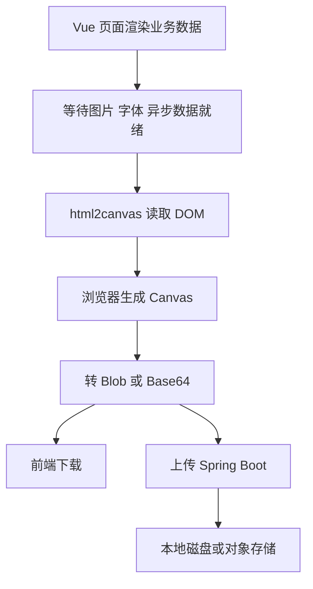
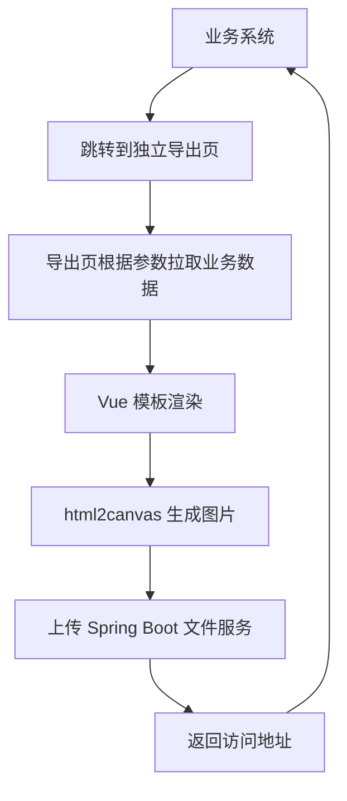
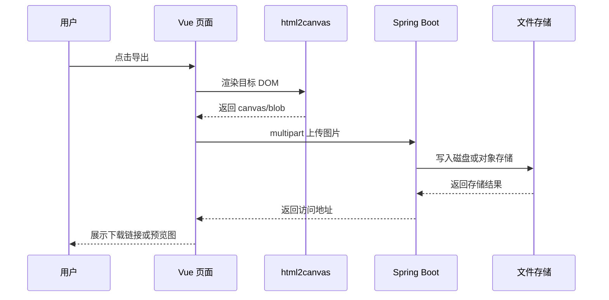

> 这篇笔记的目标是把 `html2canvas` 放到真实业务里重新拆开来看：它到底能截什么、为什么经常出现“样式不对 / 图片丢失 / 导出发虚 / 跨域失败”，以及在 `Vue` 项目里应该怎样封装成复用能力，而不是在页面按钮点击里堆一段临时脚本。

> 文章重点围绕一个完整链路展开：前端页面渲染业务卡片，`html2canvas` 负责把指定 DOM 节点转成画布和图片，前端再把图片上传到 `Spring Boot` 应用保存或继续分发。文中会单独回答一个很容易说糊的问题: `html2canvas` 本身不是“独立运行的截图服务”，它是浏览器侧渲染库；所谓独立部署，通常是把它封装成独立前端应用、内部 SDK，或者专门的导出页面，而不是像 Redis 那样起一个后台进程。

> 参考资料：
>
> html2canvas 官方资料：[html2canvas Homepage](https://html2canvas.github.io/html2canvas/) 、 [Getting Started](https://github.com/niklasvh/html2canvas/blob/master/docs/getting-started.md) 、 [Configuration](https://html2canvas.hertzen.com/configuration) 、 [Documentation / Limitations](https://github.com/niklasvh/html2canvas/blob/gh-pages/documentation.md) 、 [Proxy Wiki](https://github.com/niklasvh/html2canvas/wiki/Proxies)
>
> PDF 相关资料：[html2pdf.js](https://github.com/eKoopmans/html2pdf.js) | [html2pdf.js README](https://github.com/eKoopmans/html2pdf.js/blob/main/README.md) | [jsPDF](https://github.com/parallax/jsPDF)
>
> Vue 官方资料：[Component Basics](https://vuejs.org/guide/essentials/component-basics) 、 [Component v-model](https://vuejs.org/guide/components/v-model)
>
> Spring 官方资料：[Spring Boot Reference Documentation](https://docs.spring.io/spring-boot/reference/) 、 [Spring Framework Multipart Forms](https://docs.spring.io/spring-framework/reference/web/webmvc/mvc-controller/ann-methods/multipart-forms.html)

[TOC]

---

## 一、先回答几个关键问题

如果把这篇笔记压缩成几个最核心的问题，通常就是下面这些：

1. `html2canvas` 到底是不是“网页截图”？
2. 为什么同一个页面，浏览器里看着正常，导出图片却容易出错？
3. 在 `Vue` 里应该怎样封装，才能让导出逻辑和业务页面解耦？
4. `html2canvas` 怎么独立部署，才能给多个系统复用？
5. `Spring Boot` 后端应该和前端怎样协作，才能把导出的图片真正落库、回显、下载？

如果先给一句结论，可以概括为：

> `html2canvas` 本质上不是操作系统层面的截图工具，而是一个运行在浏览器里的 DOM 渲染库。它读取当前页面节点、样式和资源，再在前端拼出一张 `canvas`，最后由前端决定下载、预览还是上传给后端。

这个结论带来三个很关键的推论：

- 它依赖浏览器环境，不能当成通用后端截图引擎
- 它不是 100% 还原真实像素截图，而是“按它理解的 DOM 和 CSS 重新绘制”
- 真正的工程重点不在 `html2canvas(element)` 这一行，而在截图前准备、跨域治理、组件封装、上传链路和失败兜底

---

## 二、html2canvas 是什么，不是什么

### 2.1 它是什么

`html2canvas` 的工作方式可以概括成四步：

1. 找到目标 DOM 节点
2. 遍历节点树，读取样式、文本、图片、背景等信息
3. 在浏览器里新建一个 `canvas`
4. 按自己的渲染规则把 DOM 内容重新绘制到 `canvas`

因此它更接近：

- 页面局部导出
- 卡片分享图生成
- 对账单、回执单、海报、图表快照导出
- 前端操作留痕图上传

### 2.2 它不是什么

它不等于下面这些能力：

| 能力 | `html2canvas` 是否擅长 | 原因 |
|------|----------------------|------|
| 浏览器真实像素截图 | 否 | 它不是直接截屏，而是按 DOM 重新绘制 |
| 后端定时批量生成海报 | 否 | 它依赖浏览器环境，不适合在纯后端进程里跑 |
| 跨域资源无脑抓取 | 否 | 浏览器同源策略仍然生效 |
| 复杂分页 PDF 引擎 | 一般 | 它更适合先生成图片，再交给 PDF 流程处理 |
| 复杂动画瞬时捕捉 | 一般 | 动画状态、字体加载、异步图片都可能影响结果 |

所以一开始就要把边界说清楚：

> 如果目标是“服务端定时生成高保真页面快照”，优先看 `Playwright` 或 `Puppeteer`；如果目标是“用户在当前页面一键导出某个 DOM 区块”，`html2canvas` 才是自然选择。

### 2.3 html2canvas 和 html2pdf.js 是什么关系

如果业务目标从“导出图片”变成“导出 PDF”，就不能只停留在 `html2canvas`。

`html2pdf.js` 的定位可以概括为：

> 它不是和 `html2canvas` 平级竞争的另一个截图库，而是一层更上游的浏览器侧 HTML 转 PDF 封装。底层通常还是借助 `html2canvas` 先把 DOM 渲染成画布，再交给 `jsPDF` 组织成 PDF 文件。

因此两者关系更像：

| 工具 | 主要职责 | 更适合的产物 |
|------|------|------|
| `html2canvas` | DOM -> canvas / 图片 | PNG、JPEG、预览图、分享卡片 |
| `html2pdf.js` | DOM -> canvas -> PDF | 下载 PDF、打印版回执、合同预览稿 |

如果只从使用层看，`html2pdf.js` 帮你补上了三块能力：

- 把 `html2canvas` 结果接到 `jsPDF`
- 统一处理页边距、纸张尺寸、方向等 PDF 参数
- 提供分页控制，适合长内容导出

### 2.4 什么时候该直接上 html2pdf.js

这两个库最容易混淆的地方，在于它们都可以从 DOM 出发，但目标产物并不一样。

| 场景 | 更适合 `html2canvas` | 更适合 `html2pdf.js` |
|------|------|------|
| 订单分享卡片、海报、战报快照 | 是 | 否 |
| 页面局部截图上传后端归档 | 是 | 否 |
| A4 打印回执、报表、对账单 | 一般 | 是 |
| 多页 PDF 下载 | 否 | 是 |
| 先导图片，再插入审批流或 IM 消息 | 是 | 否 |

如果想快速落地一个 PDF 导出按钮，浏览器侧最常见的写法通常是这样：

```ts
import html2pdf from 'html2pdf.js'

export async function exportOrderPdf(element: HTMLElement) {
  await html2pdf()
    .set({
      margin: 10,
      filename: 'order-detail.pdf',
      image: { type: 'jpeg', quality: 0.95 },
      html2canvas: {
        useCORS: true,
        scale: window.devicePixelRatio
      },
      jsPDF: {
        unit: 'mm',
        format: 'a4',
        orientation: 'portrait'
      },
      pagebreak: {
        mode: ['css', 'legacy']
      }
    })
    .from(element)
    .save()
}
```

这里最值得注意的一点是：

> `html2pdf.js` 并没有绕开 `html2canvas` 的限制，它只是把“截图结果如何放进 PDF”这件事包好了。因此跨域图片、字体加载、CSS 支持度这些问题，很多时候仍然要按 `html2canvas` 的思路治理。

---

## 三、为什么它经常翻车

业务里最常见的问题，其实都来自它的工作机制，而不是 API 太少。

### 3.1 先看整体链路



这条链路里，只要前面任意一步没准备好，导出结果就会有问题。

下面这张图把文章里的工程分层单独画出来，方便快速建立整体视图：


### 3.2 常见失败点

| 问题现象 | 典型原因 | 处理思路 |
|------|------|------|
| 图片缺失 | 外链图片无 CORS 头 | `useCORS: true` + 资源服务开放跨域，必要时走代理 |
| 导出模糊 | `scale` 太低，按 CSS 像素导出 | 用 `window.devicePixelRatio` 或自定义 `scale` |
| 字体错乱 | WebFont 还没加载完成 | 截图前等待字体和图片资源就绪 |
| 截不到滚动区域 | 容器高度只显示可视区域 | 动态计算宽高，必要时扩展 `windowWidth/windowHeight` |
| 背景透明 | 默认背景为透明 | 指定 `backgroundColor` |
| 某些 CSS 不生效 | 库本身不支持该渲染特性 | 降级样式，避免过度依赖高级 CSS |
| 上传体积过大 | 直接传超大 Base64 | 优先转 `Blob`，再走 `multipart/form-data` |

### 3.3 最容易误解的两个选项

很多问题最后都会落到这几个配置上：

| 配置 | 作用 | 什么时候用 |
|------|------|------|
| `useCORS` | 尝试以支持跨域的方式加载图片 | 页面里有 CDN 图、对象存储图时 |
| `allowTaint` | 允许污染画布 | 一般不建议开启，开启后后续读取数据可能仍受限 |
| `scale` | 控制输出分辨率 | 导出海报、签章卡片时通常要调高 |
| `backgroundColor` | 控制导出背景色 | 白底导出通常显式设 `#fff` |
| `width` / `height` | 自定义渲染区域 | 处理固定导出尺寸时常用 |
| `windowWidth` / `windowHeight` | 模拟渲染窗口 | 处理滚动容器或媒体查询时常用 |

这里最关键的不是背参数，而是理解顺序：

> 先保证资源可访问，再保证目标节点状态稳定，最后再调分辨率和尺寸。很多人一上来调 `scale`，实际上问题根本不在清晰度，而在资源和时机。

---

## 四、Vue 里怎么封装，才不会越写越乱

### 4.1 最差的写法是什么

业务里最容易出现的，是直接在页面按钮里这样写：

```ts
const exportImage = async () => {
  const canvas = await html2canvas(document.getElementById('card')!)
  const url = canvas.toDataURL('image/png')
  // 下载或上传
}
```

这种写法的问题很明显：

- DOM 查找、渲染配置、错误处理全堆在页面里
- 不方便复用
- 不方便统一处理跨域、清晰度和上传逻辑
- 一旦多个页面都要导出，很快会复制出很多近似代码

### 4.2 更合适的拆分方式

在 `Vue 3` 项目里，一般建议拆成两层：

1. `useDomCapture` 组合式函数，负责纯截图能力
2. `CapturePanel` 组件，负责和业务 UI 对接

这样可以把“技术能力”和“业务页面”解耦。

### 4.3 一个可复用的 `useDomCapture`

```ts
// composables/useDomCapture.ts
import html2canvas from 'html2canvas'

export interface CaptureOptions {
  fileName?: string
  scale?: number
  backgroundColor?: string
}

export function useDomCapture() {
  const waitForAssets = async () => {
    if ('fonts' in document) {
      await (document as Document & { fonts: FontFaceSet }).fonts.ready
    }
    await new Promise((resolve) => requestAnimationFrame(() => resolve(null)))
  }

  const capture = async (element: HTMLElement, options: CaptureOptions = {}) => {
    await waitForAssets()

    const canvas = await html2canvas(element, {
      useCORS: true,
      backgroundColor: options.backgroundColor ?? '#ffffff',
      scale: options.scale ?? window.devicePixelRatio,
      logging: false
    })

    return canvas
  }

  const toBlob = async (canvas: HTMLCanvasElement): Promise<Blob> => {
    return await new Promise((resolve, reject) => {
      canvas.toBlob((blob) => {
        if (!blob) {
          reject(new Error('canvas toBlob failed'))
          return
        }
        resolve(blob)
      }, 'image/png')
    })
  }

  const download = async (element: HTMLElement, options: CaptureOptions = {}) => {
    const canvas = await capture(element, options)
    const blob = await toBlob(canvas)
    const url = URL.createObjectURL(blob)
    const a = document.createElement('a')
    a.href = url
    a.download = options.fileName ?? 'capture.png'
    a.click()
    URL.revokeObjectURL(url)
  }

  return {
    capture,
    toBlob,
    download
  }
}
```

这个封装里最重要的不是代码量，而是两个职责边界：

- `capture()` 只管把 DOM 变成 `canvas`
- `download()` 和后续 `upload()` 分别处理不同出口

### 4.4 再包一层业务组件

```vue
<!-- components/CapturePanel.vue -->
<script setup lang="ts">
import { ref } from 'vue'
import { useDomCapture } from '@/composables/useDomCapture'

const props = defineProps<{
  title: string
  fileName?: string
}>()

const emit = defineEmits<{
  (e: 'captured', blob: Blob): void
}>()

const cardRef = ref<HTMLElement | null>(null)
const loading = ref(false)
const { capture, toBlob, download } = useDomCapture()

const handleDownload = async () => {
  if (!cardRef.value || loading.value) {
    return
  }
  loading.value = true
  try {
    await download(cardRef.value, { fileName: props.fileName ?? 'share-card.png' })
  } finally {
    loading.value = false
  }
}

const handleUploadReady = async () => {
  if (!cardRef.value || loading.value) {
    return
  }
  loading.value = true
  try {
    const canvas = await capture(cardRef.value)
    const blob = await toBlob(canvas)
    emit('captured', blob)
  } finally {
    loading.value = false
  }
}
</script>

<template>
  <section class="capture-panel">
    <div ref="cardRef" class="capture-card">
      <slot />
    </div>

    <div class="toolbar">
      <button :disabled="loading" @click="handleDownload">下载图片</button>
      <button :disabled="loading" @click="handleUploadReady">上传后端</button>
    </div>
  </section>
</template>
```

这个组件做了三件比较重要的事：

- 通过 `slot` 把具体业务 DOM 交给父组件
- 用 `props` 控制文件名等可配置项
- 用 `emit('captured', blob)` 把截图结果往外抛，避免组件内部绑死上传接口

这类组件一旦稳定下来，后面营销卡片、审批单、回单、排行榜快照都可以复用。

---

## 五、html2canvas 怎么独立部署

这是业务讨论里最容易说不清楚的一块。

### 5.1 先说结论

`html2canvas` 本身不是像 `Redis`、`Nginx`、`MySQL` 那样的独立进程，所以“独立部署”通常不是部署这个库本身，而是部署包着它的前端能力。

工程里常见的独立化方式有三种：

| 方案 | 形态 | 适用场景 | 优点 | 主要代价 |
|------|------|------|------|------|
| 页面内直接集成 | 业务系统内一个模块 | 只有单个系统用 | 接入最快 | 能力容易散落在各页面 |
| 内部 SDK / npm 包 | 封装成前端共享库 | 多个前端项目都要导出 | 复用性好，统一配置 | 仍需各系统自行发布 |
| 独立导出站点 | 单独部署的前端应用 | 多系统统一跳转导出 | 能统一治理模板、资源、上传链路 | 系统间传参、鉴权、样式同步更复杂 |

### 5.2 最推荐的独立化思路

如果只是一个中后台项目自己用，优先选“业务系统内模块 + 共享 composable”。

如果公司里有多个系统都要导出卡片、回执、战报，通常更合适的是：

1. 把截图能力封成内部 `npm` 包，例如 `@company/dom-capture`
2. 把上传接口、文件命名、默认配置统一收敛进去
3. 让每个业务系统只负责传入 DOM 或数据

这种方式的本质是“能力独立发布”，而不是“服务端起一个 html2canvas 服务”。

### 5.3 什么时候要做独立前端应用

当下面这些诉求同时出现时，独立站点更合理：

- 多个业务系统的导出模板差异大
- 希望导出页面完全脱离主站样式污染
- 希望一个专门的前端应用管理模板版本
- 导出结果还要走审核、水印、归档、分享链接等流程

可以把链路理解成下面这样：



这里最核心的好处是：

- 导出模板和主站页面解耦
- 不会被主站复杂布局和滚动容器干扰
- 更容易做成统一的“图片导出平台”

但它的代价也很现实：

- 页面参数签名、用户身份校验都要额外设计
- 样式、字体、图片资源必须稳定可访问
- 如果依赖主站私有数据，就要处理单点登录或临时令牌

---

## 六、Spring Boot 怎么和前端交互

### 6.1 不推荐直接传 Base64

很多前后端联调时，第一反应是把 `canvas.toDataURL()` 的结果直接塞进 JSON。

这能用，但通常不是最优方案，因为它有几个明显问题：

- 体积比二进制更大
- 服务端还要额外做 Base64 解码
- 大图时容易顶到请求体限制

更稳的方式通常是：

> 前端把 `canvas` 转成 `Blob`，再通过 `multipart/form-data` 上传给 `Spring Boot`。

### 6.2 前端上传代码

```ts
// api/capture.ts
import axios from 'axios'

export async function uploadCapture(blob: Blob, bizType: string) {
  const formData = new FormData()
  formData.append('file', blob, `capture-${Date.now()}.png`)
  formData.append('bizType', bizType)

  const { data } = await axios.post('/api/captures/upload', formData, {
    headers: {
      'Content-Type': 'multipart/form-data'
    }
  })

  return data
}
```

然后在业务页面里这样接上：

```vue
<script setup lang="ts">
import CapturePanel from '@/components/CapturePanel.vue'
import { uploadCapture } from '@/api/capture'

const handleCaptured = async (blob: Blob) => {
  const result = await uploadCapture(blob, 'order-share-card')
  console.log('uploaded:', result.url)
}
</script>

<template>
  <CapturePanel file-name="order-card.png" @captured="handleCaptured">
    <OrderShareCard />
  </CapturePanel>
</template>
```

### 6.3 Spring Boot 后端接口示例

```java
// controller/CaptureController.java
@RestController
@RequestMapping("/api/captures")
public class CaptureController {

    private final CaptureStorageService captureStorageService;

    public CaptureController(CaptureStorageService captureStorageService) {
        this.captureStorageService = captureStorageService;
    }

    @PostMapping("/upload")
    public CaptureUploadResponse upload(
            @RequestParam("file") MultipartFile file,
            @RequestParam("bizType") String bizType) throws IOException {
        return captureStorageService.store(file, bizType);
    }
}
```

```java
// service/CaptureStorageService.java
@Service
public class CaptureStorageService {

    @Value("${capture.storage-dir}")
    private String storageDir;

    public CaptureUploadResponse store(MultipartFile file, String bizType) throws IOException {
        String dateDir = LocalDate.now().toString();
        Path targetDir = Paths.get(storageDir, bizType, dateDir);
        Files.createDirectories(targetDir);

        String fileName = UUID.randomUUID() + ".png";
        Path targetFile = targetDir.resolve(fileName);
        Files.copy(file.getInputStream(), targetFile, StandardCopyOption.REPLACE_EXISTING);

        return new CaptureUploadResponse(
                fileName,
                bizType,
                "/static/captures/" + bizType + "/" + dateDir + "/" + fileName
        );
    }
}
```

如果图片最终要给外部访问，真实项目里通常还会继续往下走一步：

- 存本地磁盘并通过 Nginx 暴露静态目录
- 直接上传到 MinIO / OSS / COS
- 保存文件元数据到数据库，便于检索和权限控制

### 6.4 前后端交互流程图



这条链路说明了一件很重要的事：

> `html2canvas` 只负责“把页面转成图片”，文件治理、访问控制、归档命名、对象存储这些事情，仍然属于后端和存储层的职责。

---

## 七、一个完整实战案例：订单分享卡片导出

### 7.1 场景

假设有一个订单中心页面，需要支持下面这个需求：

- 用户点击“生成分享卡片”
- 前端把订单摘要卡片导出成 PNG
- 导出结果既能本地下载，也能上传到后端
- 后端返回一个图片地址，供站内消息或营销活动复用

这里最合适的输出对象不是整个页面，而是一个“专门为导出设计的卡片 DOM”。

### 7.2 为什么不要直接截整页

很多项目第一次做时，喜欢直接截整个详情页，但通常会遇到这些问题：

- 页面太长，图很大
- 侧边栏、按钮、滚动条都被截进去
- 响应式布局会导致不同分辨率结果不稳定
- 页面里有表格、异步模块、懒加载图片，准备时机很难统一

因此更合适的做法是：

> 单独写一个导出卡片组件，只渲染导出真正需要的内容。

### 7.3 导出卡片组件示例


```vue
<!-- components/OrderShareCard.vue -->
<script setup lang="ts">
defineProps<{
  orderNo: string
  customerName: string
  totalAmount: number
  payTime: string
  posterUrl: string
}>()
</script>

<template>
  <div class="order-share-card">
    
    <h3>订单支付成功</h3>
    <p>订单号：{{ orderNo }}</p>
    <p>客户：{{ customerName }}</p>
    <p>金额：{{ totalAmount.toFixed(2) }}</p>
    <p>支付时间：{{ payTime }}</p>
  </div>
</template>

<style scoped>
.order-share-card {
  width: 750px;
  padding: 32px;
  background: #ffffff;
  border-radius: 24px;
  box-sizing: border-box;
}

.poster {
  width: 100%;
  border-radius: 16px;
  display: block;
  margin-bottom: 24px;
}
</style>
```


这里的设计重点是：

- 固定导出宽度，避免不同容器宽度影响结果
- 导出组件只保留必要信息
- 所有图片都尽量使用同域资源或带 CORS 头的 CDN 资源

### 7.4 页面组装方式

```vue
<script setup lang="ts">
import CapturePanel from '@/components/CapturePanel.vue'
import OrderShareCard from '@/components/OrderShareCard.vue'
import { uploadCapture } from '@/api/capture'

const order = {
  orderNo: 'SO202606230001',
  customerName: '张三',
  totalAmount: 998.0,
  payTime: '2026-06-23 10:30:00',
  posterUrl: 'https://static.example.com/posters/order-success.png'
}

const handleCaptured = async (blob: Blob) => {
  const result = await uploadCapture(blob, 'order-share-card')
  console.log(result)
}
</script>

<template>
  <CapturePanel file-name="订单分享卡片.png" @captured="handleCaptured">
    <OrderShareCard v-bind="order" />
  </CapturePanel>
</template>
```

整个调用链路已经比较清晰：

1. 页面负责准备业务数据
2. 导出卡片组件负责稳定渲染
3. `CapturePanel` 负责截图交互
4. `uploadCapture()` 负责和后端接口通信

这种分层的好处是，一旦后面要换成：

- 先本地下载，不上传
- 同时上传两套存储
- 导出前增加水印
- 导出后拼接 PDF

都可以在边界清晰的前提下演进。

---

## 八、如果要做成可复用平台，应该怎样分层

当 `html2canvas` 不再只是某个页面里的一个按钮，而是很多系统都会用的导出能力时，建议把职责拆成下面四层：

| 层级 | 主要职责 | 典型内容 |
|------|------|------|
| 页面层 | 准备业务数据 | 订单详情、活动战报、审批单据 |
| 模板层 | 渲染可导出的稳定 DOM | `OrderShareCard`、`InvoiceCard` |
| 能力层 | 截图、压缩、下载、上传 | `useDomCapture`、图片压缩器 |
| 服务层 | 文件存储、鉴权、访问地址 | `Spring Boot` 文件服务、OSS、元数据表 |

如果这四层不拆，后面通常会出现三个问题：

- 页面里堆满导出参数和上传细节
- 每个系统自己处理跨域、失败重试和文件命名
- 后端只收文件，不知道业务语义，后续治理越来越难

所以更理想的接口设计通常不是只有一个“上传图片”接口，而是按业务加上最基本的语义字段，例如：

- `bizType`
- `bizId`
- `operator`
- `scene`
- `traceId`

这些字段看起来和 `html2canvas` 无关，但一旦进入工程化阶段，它们比 `scale` 参数更决定这套能力能不能长期维护。

---

## 九、常见问题与边界说明

### 9.1 外链图片已经能在浏览器里显示，为什么还是导不出来

因为“能显示”不等于“允许被画到 `canvas` 里再读取”。

浏览器展示图片只要求资源可访问；但当图片参与 `canvas` 绘制并且后续要导出数据时，还要满足跨域安全要求。

最常见的处理顺序是：

1. 给资源服务加 `Access-Control-Allow-Origin`
2. 前端设置 `useCORS: true`
3. 如果三方资源无法改头信息，再考虑代理中转

### 9.2 为什么导出的字是糊的

通常不是字体本身有问题，而是输出分辨率低。

先看这两个点：

- `scale` 是否至少为 `window.devicePixelRatio`
- 导出卡片本身是否设计成固定宽度，而不是跟着页面响应式压缩

### 9.3 为什么说它不适合后端独立服务

因为它依赖浏览器侧的 DOM、样式计算和资源加载环境。

如果后端想“传一个 URL，后台自己截图”，那本质上已经不是 `html2canvas` 的场景，而是无头浏览器方案。

### 9.4 Base64 和文件上传怎么选

简单规则可以直接记成这样：

| 方案 | 适合场景 | 不足 |
|------|------|------|
| Base64 放 JSON | 小图、临时验证、接口原型阶段 | 体积大、解码成本高 |
| `multipart/form-data` | 正常生产上传 | 更通用，后端处理也更自然 |

---

## 十、总结

如果只把 `html2canvas` 当成一个前端小工具，最后多半会写成某个页面里的临时按钮逻辑；但如果把它当成一条完整链路来看，真正要解决的是四件事：

1. 如何准备一个稳定、可导出的 DOM 模板
2. 如何把截图能力在 `Vue` 里封成复用组件或 composable
3. 如何决定它是页面内集成、共享 SDK，还是独立导出站点
4. 如何让 `Spring Boot` 承接文件上传、存储和访问治理

可以把最终结论压缩成一句话：

> `html2canvas` 适合做“浏览器内的 DOM 导出能力”，不适合被误当成“后端截图服务”；真正稳定的落地方式，是前端模板化、能力组件化、上传标准化、后端存储服务化。

沿着这个思路往下做，`html2canvas` 才不会停留在“能跑一次”的脚本层，而能真正沉淀成团队可复用的前端导出能力。
