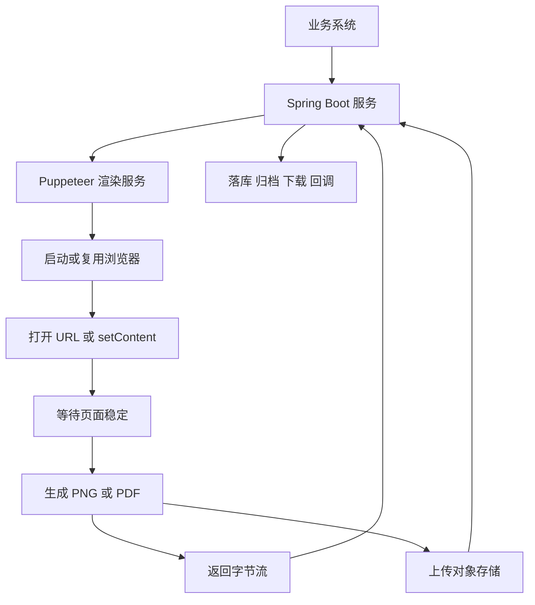
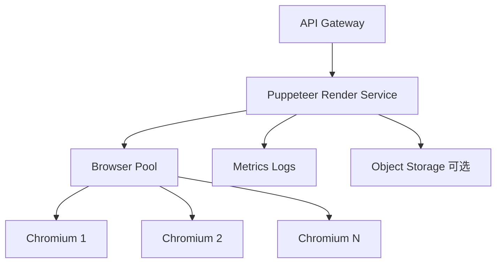
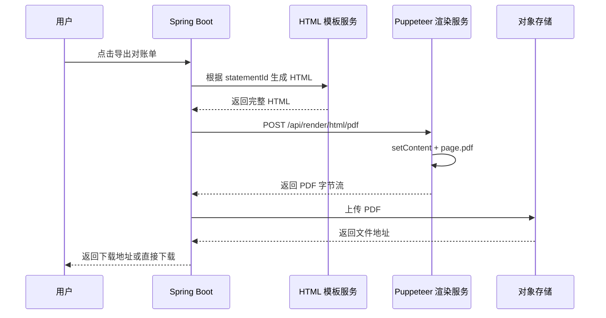

> 这篇笔记的目标是把 `Puppeteer` 放到真实业务里重新拆开来看：它到底适合解决什么问题，为什么很多团队最后会把它做成一个独立渲染服务，以及这个服务应该怎样暴露图片、HTML、PDF 等基础能力，供业务系统按 `url` 或 `html` 传参调用。

> 文章重点不放在“写一个能跑的截图 demo”，而放在可长期维护的工程设计上：浏览器实例如何复用、接口怎样抽象、服务怎样部署、风险如何控制，以及 `Spring Boot` 服务端怎样和这类渲染服务交互，把生成结果接入下载、归档、对象存储或业务流转。

> 参考资料：
>
> Puppeteer 官方资料：[Puppeteer](https://pptr.dev/) 、 [Guides](https://pptr.dev/category/guides) 、 [Screenshots](https://pptr.dev/guides/screenshots) 、 [PDF generation](https://pptr.dev/guides/pdf-generation) 、 [Configuration](https://pptr.dev/guides/configuration) 、 [Docker](https://pptr.dev/guides/docker)
>
> Spring 官方资料：[Spring Boot Reference Documentation](https://docs.spring.io/spring-boot/reference/) 、 [Spring Multipart Content](https://docs.spring.io/spring/reference/6.2/web/webmvc/mvc-controller/ann-methods/multipart-forms.html) 、 [MultipartBodyBuilder Javadoc](https://docs.spring.io/spring-framework/docs/7.0.0/javadoc-api/org/springframework/http/client/MultipartBodyBuilder.html)

[TOC]

---

## 一、先回答几个关键问题

如果把这篇笔记压缩成几个最核心的问题，通常就是下面这些：

1. `Puppeteer` 到底是什么，它和普通“截图工具”有什么区别？
2. 为什么很多团队会把它单独部署成渲染服务？
3. 这个服务应该暴露哪些基础接口，才能同时支持 `url -> 图片`、`url -> PDF`、`html -> 图片`、`html -> PDF`？
4. 浏览器实例要不要每次都启动，怎样控制并发和超时？
5. `Spring Boot` 服务端怎样调用这类渲染服务，并把结果纳入自己的业务流程？

如果先给一句结论，可以概括为：

> `Puppeteer` 本质上不是“截图 API”，而是一个在 `Node.js` 侧控制 `Chrome/Chromium` 的高层浏览器自动化库。截图、导出 PDF、执行 JS、等待页面加载、注入样式、填写表单，这些都只是它在控制真实浏览器之后自然具备的能力。

这个结论带来三个很关键的推论：

- 它比浏览器侧导出库更适合服务端统一生成结果
- 它适合被沉淀成“渲染基础服务”，而不是散落在各业务系统里各写一份脚本
- 它真正难的部分不在 `page.pdf()` 或 `page.screenshot()` 这一行，而在浏览器复用、资源治理、安全边界、并发控制和业务接入方式

---

## 二、Puppeteer 是什么，不是什么

### 2.1 它是什么

`Puppeteer` 可以概括成这样一层能力：

> 由 `Node.js` 驱动浏览器，通过 `Chrome DevTools Protocol` 或相关协议控制页面打开、渲染、执行脚本、生成截图或 PDF。

因此它天然适合下面这些事情：

- 根据一个业务页面 URL 生成截图
- 根据一段 HTML 模板生成 PDF
- 渲染报表、回执、对账单、发票、合同预览稿
- 做登录态页面自动化访问
- 在生成结果前执行脚本、隐藏按钮、补水印、等待异步数据加载

### 2.2 它不是什么

它并不等于下面这些东西：

| 能力 | `Puppeteer` 是否擅长 | 原因 |
|------|----------------------|------|
| 纯后端字符串拼接 PDF 引擎 | 否 | 它依赖真实浏览器渲染，不是模板引擎直接出 PDF |
| 浏览器内局部 DOM 导出库 | 否 | 那是 `html2canvas` 一类工具的场景 |
| 高并发无状态轻计算服务 | 一般 | 浏览器渲染成本高，需要控制实例和并发 |
| 可以无条件抓取任何外部网页 | 否 | 会遇到鉴权、反爬、网络隔离、SSRF 风险 |
| 一次部署后无需运维关注的黑盒能力 | 否 | 字体、沙箱、内存、超时、崩溃恢复都要治理 |

### 2.3 和 html2canvas、Playwright 有什么区别

这几个技术经常被混在一起说，但边界其实很清楚：

| 技术 | 运行位置 | 核心能力 | 更适合的场景 |
|------|----------|----------|--------------|
| `html2canvas` | 浏览器前端 | DOM 转 canvas/图片 | 用户当前页面局部导出 |
| `Puppeteer` | `Node.js` 服务端 | 控制 `Chrome/Chromium` 渲染页面 | 独立渲染服务、后台生成图片和 PDF |
| `Playwright` | `Node.js` 服务端 | 多浏览器自动化、测试与渲染 | 需要跨浏览器、更强自动化场景 |

如果只从“服务端传一个 `url` 或 `html`，后台返回文件”这个需求看，`Puppeteer` 是非常自然的选择。

---

## 三、为什么它适合做独立渲染服务

### 3.1 先看整体链路



如果把生成文件的能力直接塞进业务服务里，通常很快会遇到这些问题：

- 每个系统都要自己安装浏览器依赖
- 每个系统都要自己处理超时、重试、字体和并发
- 浏览器异常会直接污染业务服务的稳定性
- 相同的截图和 PDF 逻辑到处复制

因此更合理的做法往往是：

> 把 `Puppeteer` 抽成一层独立渲染服务，专门负责“把 URL 或 HTML 变成图片、PDF 或页面快照”，业务系统只负责传参数和接收结果。

### 3.2 独立服务的典型收益

| 收益 | 具体表现 |
|------|----------|
| 能力复用 | 订单、报表、回执、营销海报都走统一接口 |
| 稳定性隔离 | 浏览器崩溃不会直接拖垮业务主服务 |
| 运维集中 | 浏览器版本、字体包、容器镜像集中治理 |
| 统一安全策略 | 白名单域名、超时、请求头、Cookie 注入统一校验 |
| 更容易扩展 | 后续增加水印、压缩、批量任务、队列处理都更自然 |

### 3.3 什么情况下不必单独拆服务

如果只是一个小型后台系统，且导出量非常低，也可以先把 `Puppeteer` 嵌在当前 `Node.js` 应用里使用。

但一旦出现下面任意两个信号，就应该考虑服务化：

- 多个业务系统都要调用
- 文件生成量开始明显上升
- 同时需要截图和 PDF 两类能力
- 生成逻辑里开始涉及鉴权、字体、水印、模板版本
- 业务主服务不希望承担浏览器进程的资源波动

---

## 四、服务应该暴露哪些基础能力

### 4.1 不要一开始就做很多零碎接口

如果一上来按业务拆接口，很容易写成：

- `/order/exportPdf`
- `/invoice/exportPdf`
- `/report/screenshot`
- `/poster/exportImage`

这种写法短期看起来直观，长期很容易变成一堆业务耦合接口。

更稳的方式是先把渲染服务收敛成几类通用能力：

| 输入 | 输出 | 典型接口 | 说明 |
|------|------|----------|------|
| `url` | `png/jpeg` | `/api/render/url/image` | 打开一个可访问页面并截图 |
| `url` | `pdf` | `/api/render/url/pdf` | 打开一个可访问页面并导出 PDF |
| `html` | `png/jpeg` | `/api/render/html/image` | 直接渲染 HTML 字符串并截图 |
| `html` | `pdf` | `/api/render/html/pdf` | 直接渲染 HTML 字符串并导出 PDF |

如果希望接口再统一一层，也可以设计成一个总入口：

```json
{
  "sourceType": "url",
  "source": "https://example.com/order/preview?id=1",
  "outputType": "pdf",
  "options": {
    "format": "A4",
    "landscape": false,
    "printBackground": true,
    "fullPage": true
  }
}
```

但在很多团队里，拆成 4 个明确接口更容易理解，也更方便做权限和网关控制。

### 4.2 推荐的请求参数

不管接口怎么拆，请求体通常都要覆盖下面几类参数：

| 参数分类 | 典型字段 | 作用 |
|----------|----------|------|
| 来源参数 | `url`、`html`、`baseUrl` | 指定渲染来源 |
| 页面参数 | `viewport`、`waitUntil`、`timeoutMs` | 控制页面打开和稳定时机 |
| 输出参数 | `type`、`quality`、`fullPage`、`pdfFormat` | 控制图片或 PDF 结果 |
| 鉴权参数 | `headers`、`cookies`、`token` | 访问内网页面或登录态页面 |
| 业务参数 | `bizType`、`bizId`、`traceId` | 便于审计、排障和后续归档 |

### 4.3 一个更完整的接口模型

```json
{
  "url": "https://example.com/statement/preview?statementId=9527",
  "viewport": {
    "width": 1440,
    "height": 900
  },
  "waitUntil": "networkidle0",
  "timeoutMs": 15000,
  "headers": {
    "Authorization": "Bearer xxx"
  },
  "cookies": [],
  "screenshot": {
    "type": "png",
    "fullPage": true
  },
  "bizType": "statement-preview",
  "traceId": "trace-20260624-001"
}
```

这类模型的关键点不在字段多，而在职责清楚：

- 渲染服务只管如何稳定打开页面并产出文件
- 业务系统决定 URL、鉴权和业务语义
- 存储和回调可以由渲染服务做，也可以由业务系统接回去再处理

---

## 五、Puppeteer 独立部署时，核心设计点是什么

### 5.1 一个最小可用架构



这个架构里真正值得重视的不是 HTTP 路由，而是 `Browser Pool`。

### 5.2 为什么不要每个请求都启动浏览器

很多 demo 的写法通常是这样：

```ts
const browser = await puppeteer.launch()
const page = await browser.newPage()
// ...
await browser.close()
```

它能跑，但一旦进生产，问题会很快出现：

- 启动浏览器耗时明显
- CPU 和内存抖动大
- 并发稍微上来就容易把机器打满
- Chrome 进程回收不及时会残留僵尸进程

因此更常见的做法是：

> 进程启动时创建浏览器实例池，请求进来后复用浏览器，只为每个任务创建独立 `Page` 或从有限的浏览器池里借一个实例。

### 5.3 一个简化版浏览器池示例

```ts
// browserPool.ts
import puppeteer, { Browser } from 'puppeteer'

const MAX_BROWSERS = 2
const browsers: Browser[] = []

export async function initBrowserPool() {
  for (let i = 0; i < MAX_BROWSERS; i += 1) {
    const browser = await puppeteer.launch({
      headless: true,
      args: ['--no-sandbox', '--disable-setuid-sandbox']
    })
    browsers.push(browser)
  }
}

let cursor = 0

export function borrowBrowser(): Browser {
  const browser = browsers[cursor % browsers.length]
  cursor += 1
  return browser
}

export async function closeBrowserPool() {
  await Promise.all(browsers.map((browser) => browser.close()))
}
```

这段代码只是说明思路，真实项目通常还要补上：

- 并发队列
- 浏览器健康检查
- 崩溃自动重建
- 单页超时强制关闭
- 任务级日志与指标

### 5.4 服务端接口示例

下面给一个足够接近生产的 `Express + Puppeteer` 示例，重点放在两个能力：

1. `html -> pdf`
2. `url -> image`

```ts
// server.ts
import express from 'express'
import { borrowBrowser, initBrowserPool } from './browserPool'

const app = express()
app.use(express.json({ limit: '2mb' }))

app.post('/api/render/html/pdf', async (req, res) => {
  const { html, pdfOptions = {}, timeoutMs = 15000 } = req.body
  if (!html) {
    res.status(400).json({ message: 'html is required' })
    return
  }

  const browser = borrowBrowser()
  const page = await browser.newPage()

  try {
    page.setDefaultTimeout(timeoutMs)
    await page.setContent(html, { waitUntil: 'networkidle0' })

    const pdf = await page.pdf({
      format: 'A4',
      printBackground: true,
      ...pdfOptions
    })

    res.setHeader('Content-Type', 'application/pdf')
    res.setHeader('Content-Disposition', 'inline; filename="render.pdf"')
    res.send(pdf)
  } finally {
    await page.close()
  }
})

app.post('/api/render/url/image', async (req, res) => {
  const {
    url,
    viewport = { width: 1440, height: 900 },
    waitUntil = 'networkidle0',
    timeoutMs = 15000,
    screenshot = { type: 'png', fullPage: true }
  } = req.body

  if (!url) {
    res.status(400).json({ message: 'url is required' })
    return
  }

  const browser = borrowBrowser()
  const page = await browser.newPage()

  try {
    page.setDefaultTimeout(timeoutMs)
    await page.setViewport(viewport)
    await page.goto(url, { waitUntil, timeout: timeoutMs })

    const buffer = await page.screenshot(screenshot)
    res.setHeader('Content-Type', 'image/png')
    res.send(buffer)
  } finally {
    await page.close()
  }
})

initBrowserPool().then(() => {
  app.listen(8080, () => {
    console.log('render service started on 8080')
  })
})
```

### 5.5 真实生产里还要补哪些保护

如果只是把上面的代码部署出去，仍然不够稳。

必须尽早补上的点通常有这些：

| 类别 | 必做治理 | 原因 |
|------|----------|------|
| 安全 | `url` 白名单、禁止访问内网 IP、限制协议 | 防止 SSRF |
| 性能 | 并发队列、浏览器池、限流 | 避免机器被渲染任务打满 |
| 稳定性 | 任务超时、页面关闭、浏览器重建 | 避免卡死和内存泄漏 |
| 可观测性 | `traceId`、耗时、成功率、失败原因 | 方便排障 |
| 资源 | 字体包、图片资源、时区和语言设置 | 保证渲染一致性 |
| 接入 | 鉴权头透传、Cookie 注入、统一错误码 | 方便业务系统集成 |

---

## 六、部署时最容易踩的坑

### 6.1 Docker 不是可选项，而是最稳的部署方式

本地开发能跑，并不意味着线上也能跑。`Puppeteer` 部署最常见的问题往往来自：

- 缺少浏览器依赖
- 缺少中文字体
- 容器和宿主机沙箱配置不一致
- 浏览器版本和库版本不匹配

如果把部署方式压缩成一句话，可以概括为：

> 优先基于官方 `Puppeteer` Docker 镜像或官方 Dockerfile 思路构建服务镜像，不要把浏览器安装细节散落到机器初始化脚本里。

一个示例 `Dockerfile` 可以写成：

```dockerfile
FROM ghcr.io/puppeteer/puppeteer:latest

WORKDIR /app

COPY package*.json ./
RUN npm ci --omit=dev

COPY . .

ENV NODE_ENV=production
EXPOSE 8080

CMD ["node", "dist/server.js"]
```

### 6.2 中文字体和样式一致性

很多人第一次上线后遇到的不是接口错误，而是 PDF 中文乱码、字重不对、行高错乱。

原因通常是：

- 容器里没有中文字体
- 线上字体和设计稿字体不一致
- 页面依赖外部字体，但渲染环境无法稳定拉取

比较稳的策略通常是：

1. 渲染服务镜像中预装公司常用字体
2. HTML 模板尽量使用稳定可控的字体族
3. 如果必须使用 WebFont，确保静态资源服务可访问且渲染时机会被正确等待

### 6.3 `--no-sandbox` 能不能直接用

这取决于部署环境，但经验上要知道两点：

- 很多容器环境里会为了兼容性加 `--no-sandbox`
- 从安全角度看，能保留沙箱能力时优先保留

如果使用官方镜像路线，需要同步理解容器能力和浏览器沙箱要求，而不是只复制一段启动参数。

### 6.4 任务超时要怎么定

超时太短，复杂页面还没稳定就失败；超时太长，坏任务会持续占用浏览器资源。

一般可以按两层来设：

| 层级 | 建议 |
|------|------|
| 页面导航超时 | 10 到 20 秒 |
| 整体任务超时 | 15 到 30 秒 |

如果页面需要登录、拉取复杂图表或大量异步接口，可以单独给这个场景放宽，但不要给所有任务默认放大超时。

---

## 七、Spring Boot 服务端怎么交互

### 7.1 先明确两种接入模式

`Spring Boot` 和 `Puppeteer` 渲染服务之间，通常有两种典型协作方式：

| 模式 | 调用方式 | 适用场景 |
|------|----------|----------|
| 同步拉取文件 | `Spring Boot` 调渲染服务，直接拿回字节流 | 用户立刻下载、在线预览 |
| 同步生成后再落存储 | `Spring Boot` 拿回文件并上传 OSS/MinIO | 业务归档、后续复用、消息推送 |

如果业务本身更复杂，也可以进一步演进成异步模式：

- `Spring Boot` 投递任务
- 渲染服务异步生成
- 文件上传完成后回调业务系统

但在大多数管理后台里，同步模式已经够用。

### 7.2 Spring Boot 调用渲染服务示例

下面以 `WebClient` 为例，演示 `Spring Boot` 传入 HTML，请 `Puppeteer` 服务生成 PDF：

```java
// dto/RenderPdfRequest.java
public record RenderPdfRequest(
        String html,
        Integer timeoutMs,
        PdfOptions pdfOptions
) {
}
```

```java
// dto/PdfOptions.java
public record PdfOptions(
        String format,
        Boolean printBackground,
        Boolean landscape
) {
}
```

```java
// config/RenderClientConfig.java
@Configuration
public class RenderClientConfig {

    @Bean
    public WebClient renderWebClient(WebClient.Builder builder) {
        return builder
                .baseUrl("http://render-service:8080")
                .build();
    }
}
```

```java
// service/RenderClient.java
@Service
public class RenderClient {

    private final WebClient renderWebClient;

    public RenderClient(WebClient renderWebClient) {
        this.renderWebClient = renderWebClient;
    }

    public byte[] renderPdfByHtml(String html) {
        RenderPdfRequest request = new RenderPdfRequest(
                html,
                15000,
                new PdfOptions("A4", true, false)
        );

        return renderWebClient.post()
                .uri("/api/render/html/pdf")
                .contentType(MediaType.APPLICATION_JSON)
                .bodyValue(request)
                .retrieve()
                .bodyToMono(byte[].class)
                .block();
    }
}
```

### 7.3 再由 Spring Boot 暴露给前端

```java
// controller/StatementController.java
@RestController
@RequestMapping("/api/statements")
public class StatementController {

    private final StatementHtmlService statementHtmlService;
    private final RenderClient renderClient;

    public StatementController(StatementHtmlService statementHtmlService, RenderClient renderClient) {
        this.statementHtmlService = statementHtmlService;
        this.renderClient = renderClient;
    }

    @GetMapping("/{statementId}/pdf")
    public ResponseEntity<byte[]> exportPdf(@PathVariable Long statementId) {
        String html = statementHtmlService.buildStatementHtml(statementId);
        byte[] pdfBytes = renderClient.renderPdfByHtml(html);

        return ResponseEntity.ok()
                .contentType(MediaType.APPLICATION_PDF)
                .header(HttpHeaders.CONTENT_DISPOSITION, "attachment; filename=statement-" + statementId + ".pdf")
                .body(pdfBytes);
    }
}
```

这条链路的核心在于：

- `Spring Boot` 掌握业务数据和鉴权逻辑
- `Puppeteer` 服务只负责渲染
- 最终对前端暴露文件的仍然是业务系统自己的接口

这样业务边界会更清楚。

### 7.4 如果要传 URL，而不是传 HTML

有些页面本来就有一个可访问的预览页，例如：

`https://biz.example.com/statement/preview?statementId=9527`

这时 `Spring Boot` 可以直接把 URL 传给渲染服务：

```java
public record RenderUrlImageRequest(
        String url,
        Integer timeoutMs,
        Map<String, String> headers,
        String bizType,
        String traceId
) {
}
```

这种方式的优点是：

- 不需要在 Java 里拼完整 HTML
- 预览页面和最终导出页面一致

但也要看到代价：

- 渲染服务必须能访问这个 URL
- 登录态、鉴权头、Cookie 透传会更复杂
- 页面里的异步资源、CDN、字体都要可访问

所以经验上可以这样选：

| 方案 | 更适合的场景 |
|------|--------------|
| 传 `html` | 模板稳定、可控，追求结果一致性 |
| 传 `url` | 已有预览页，希望直接复用页面渲染结果 |

---

## 八、一个完整实战案例：对账单 PDF 服务化导出

### 8.1 场景

假设系统里有一个“月度对账单导出”需求，要求如下：

- 用户在管理后台点击“导出 PDF”
- 后端根据账单数据生成标准 A4 文档
- 生成结果既可以直接下载，也要归档到对象存储
- 后续还可能把这份 PDF 通过邮件或站内信发送给客户

如果这个需求只做一次，当然可以在某个业务服务里临时拼一下。

但如果后面订单回执、结算单、发票预览、合同快照都来了，更合理的做法就是把它沉淀成通用链路。

### 8.2 这条链路怎么分层



### 8.3 为什么这个案例更推荐传 HTML

对账单、回执单、合同预览这类文档型场景，有几个特点：

- 结构稳定
- 样式可控
- 需要尽量避免页面上的无关按钮和交互元素
- 通常希望导出结果和业务页面解耦

因此它更适合走：

> `Spring Boot` 准备业务数据 -> 模板引擎生成 HTML -> `Puppeteer` 渲染服务生成 PDF。

这样有三个直接好处：

- 页面不依赖前端真实页面路由
- 不需要让渲染服务携带复杂登录态去访问后台页面
- 文档模板可以单独版本化管理

### 8.4 一个模板服务示例

下面给一个简化版的 HTML 构建方式，假设使用 `Thymeleaf`：

```java
// service/StatementHtmlService.java
@Service
public class StatementHtmlService {

    private final TemplateEngine templateEngine;
    private final StatementQueryService statementQueryService;

    public StatementHtmlService(TemplateEngine templateEngine, StatementQueryService statementQueryService) {
        this.templateEngine = templateEngine;
        this.statementQueryService = statementQueryService;
    }

    public String buildStatementHtml(Long statementId) {
        StatementDetail detail = statementQueryService.getDetail(statementId);

        Context context = new Context();
        context.setVariable("statement", detail);
        context.setVariable("generatedAt", LocalDateTime.now());

        return templateEngine.process("statement-pdf", context);
    }
}
```

模板 `statement-pdf.html` 的目标不是“做成一个网页”，而是“做成一个稳定渲染的打印文档”。因此要尽量避免：

- 复杂动画
- 悬浮交互
- 依赖运行时脚本的布局
- 不稳定的外链字体和图片

### 8.5 如果结果还要继续归档

很多业务不会满足于“生成完直接返回前端”，而是还要继续做：

- 上传到 `OSS/MinIO`
- 把文件 URL 存数据库
- 记录 `bizType`、`bizId`、`operator`
- 后续补发邮件或重新下载

这时更合理的做法通常是让 `Spring Boot` 来主导后半段流程：

```java
// service/StatementExportService.java
@Service
public class StatementExportService {

    private final StatementHtmlService statementHtmlService;
    private final RenderClient renderClient;
    private final ObjectStorageService objectStorageService;

    public StatementExportService(
            StatementHtmlService statementHtmlService,
            RenderClient renderClient,
            ObjectStorageService objectStorageService) {
        this.statementHtmlService = statementHtmlService;
        this.renderClient = renderClient;
        this.objectStorageService = objectStorageService;
    }

    public String exportAndUpload(Long statementId) {
        String html = statementHtmlService.buildStatementHtml(statementId);
        byte[] pdfBytes = renderClient.renderPdfByHtml(html);

        String objectKey = "statements/" + statementId + "/" + System.currentTimeMillis() + ".pdf";
        return objectStorageService.upload(objectKey, pdfBytes, "application/pdf");
    }
}
```

这个分工的意义在于：

- 渲染服务不需要知道业务数据库
- 业务系统保留文件归档的主导权
- 后续如果渲染引擎从 `Puppeteer` 换成其他实现，业务层改动也更小

---

## 九、接口设计时的几个关键取舍

### 9.1 返回文件流，还是直接上传对象存储

这两种方案都常见：

| 方案 | 优点 | 不足 |
|------|------|------|
| 渲染服务直接返回字节流 | 简单直观，业务系统可控性高 | 大文件会占用链路带宽 |
| 渲染服务直接上传对象存储并返回 URL | 业务接入更轻 | 渲染服务需要更多存储配置和权限 |

如果团队刚开始建设这套能力，通常更建议优先选第一种：

> 渲染服务返回文件流，上传和归档由业务系统自己决定。

因为这样边界最清楚，调试也最简单。

### 9.2 要不要让渲染服务支持登录态页面

可以支持，但不建议一开始就把它做得太“万能”。

原因在于登录态页面会带来这些复杂度：

- Cookie 注入
- 鉴权头透传
- 页面跳转和二次鉴权
- 用户身份冒用和审计问题

如果业务允许，文档型导出优先走“后端拼 HTML”路线，通常比“让渲染服务带登录态去访问某个内网页面”更稳。

### 9.3 为什么说 SSRF 是必须单独处理的问题

因为一旦渲染服务可以随意访问外部 URL，理论上就可能被拿去访问：

- 内网管理地址
- 云厂商元数据地址
- 仅容器内部可见的服务

所以只要支持 `url` 输入，就必须至少做下面这些限制：

1. 只允许访问配置白名单域名
2. 禁止直连内网 IP 和回环地址
3. 限制协议，只允许 `http/https`
4. 对重定向目标继续做校验

这不是附加优化，而是上线前的必要条件。

---

## 十、常见问题与边界说明

### 10.1 为什么同一份 HTML，本地导出的 PDF 和线上不一样

最常见的原因是环境差异：

- 字体不同
- 时区不同
- 浏览器版本不同
- 外链资源可访问性不同

因此生成文档这类场景里，“容器化 + 固定镜像 + 固定字体”通常比代码本身更影响一致性。

### 10.2 为什么页面明明已经打开了，截图还是空白或不完整

因为“页面打开完成”不等于“业务内容稳定”。

要重点确认这些点：

- 是否等待到了正确的 `waitUntil`
- 异步图表、图片、字体是否已经加载
- 是否需要额外等待某个选择器出现
- 页面有没有懒加载或虚拟滚动

### 10.3 PDF 和图片该怎么选

可以直接按结果用途来分：

| 输出类型 | 更适合的场景 |
|----------|--------------|
| `PNG/JPEG` | 海报、分享卡片、页面快照、审批留痕 |
| `PDF` | 对账单、回执、合同、打印文档 |

如果需求本质是“打印文档”，优先考虑 PDF；如果需求本质是“分享展示”，优先考虑图片。

### 10.4 渲染服务能不能兼顾接口测试或自动化登录

技术上当然可以，因为 `Puppeteer` 本来就有这些能力。

但从工程分层上看，通常不建议把“文件渲染服务”和“通用浏览器自动化服务”完全混成一个东西。前者更关注稳定产物和接口治理，后者更关注脚本灵活性和自动化流程，边界并不相同。

---

## 十一、总结

如果只把 `Puppeteer` 当成一个“截图脚本库”，最后很容易停留在 demo 阶段；但如果把它放到工程里重新审视，它更像是一层可独立部署的浏览器渲染基础设施。

真正值得沉淀的不是单个 `page.screenshot()` 调用，而是下面这套完整思路：

1. 明确它适合服务端统一渲染，而不是浏览器侧局部导出
2. 把能力抽象成 `url/html -> image/pdf` 的通用接口
3. 用浏览器池、超时、限流、白名单和容器镜像保证服务稳定
4. 让 `Spring Boot` 掌握业务数据、归档和对外接口，把渲染职责留给独立服务

可以把最终结论压缩成一句话：

> `Puppeteer` 最有价值的落地方向，不是“帮某个页面截一张图”，而是作为一层独立渲染服务，为业务系统稳定提供图片、PDF 和页面快照这类基础能力。

沿着这个方向继续往下做，后续无论是账单导出、合同预览、回执归档，还是统一的文档渲染平台，都会有比较清晰的演进路径。
