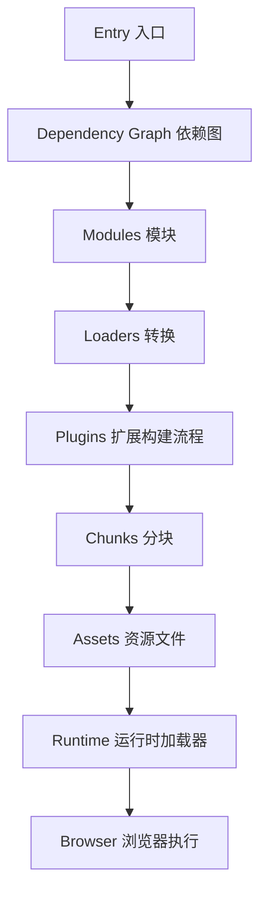
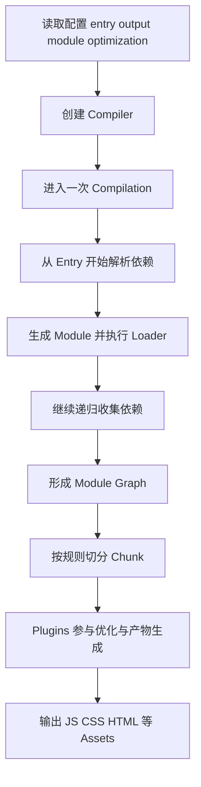
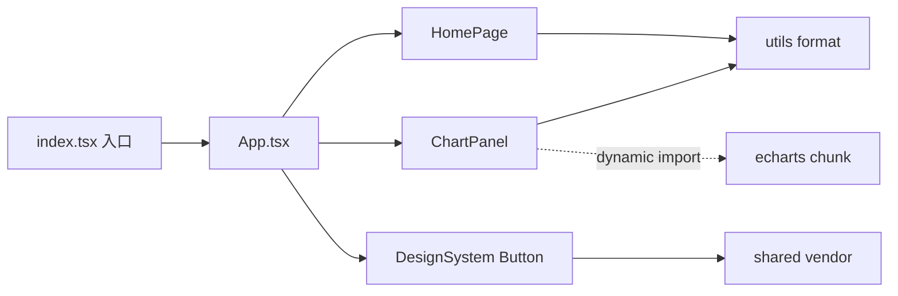
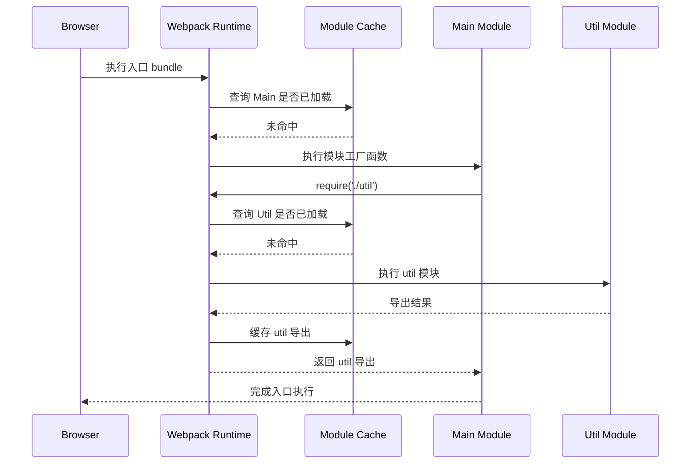
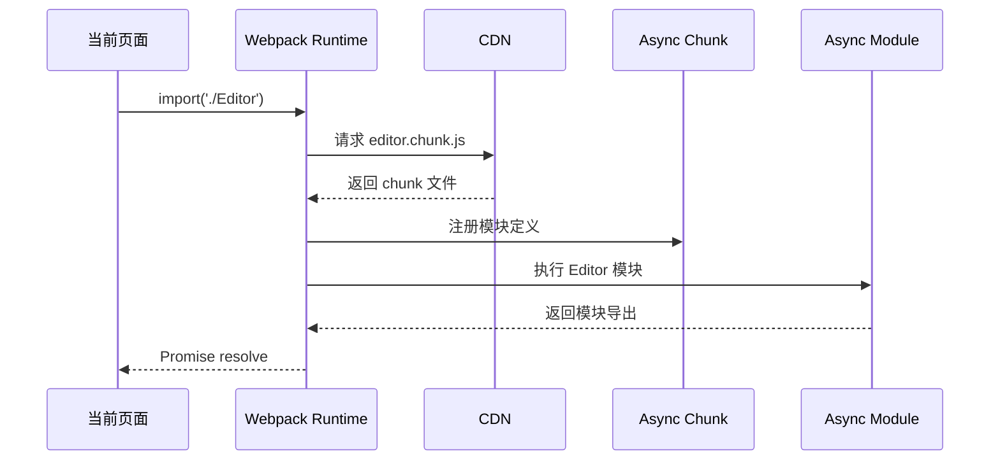
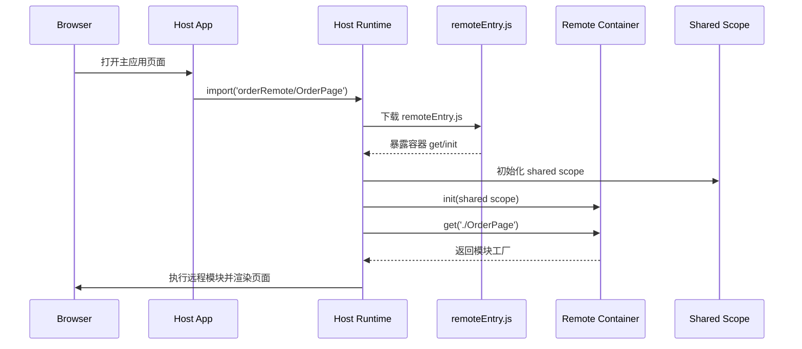
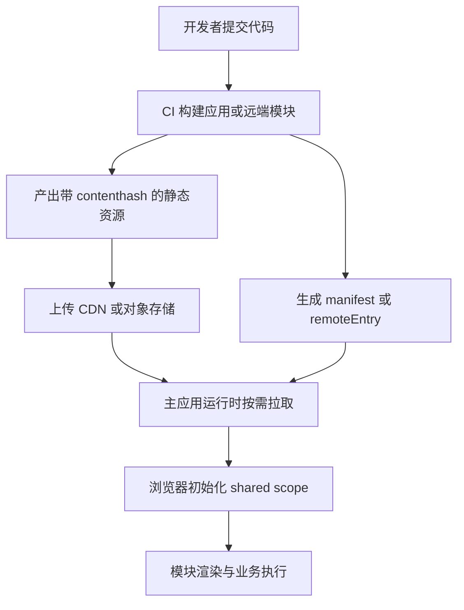
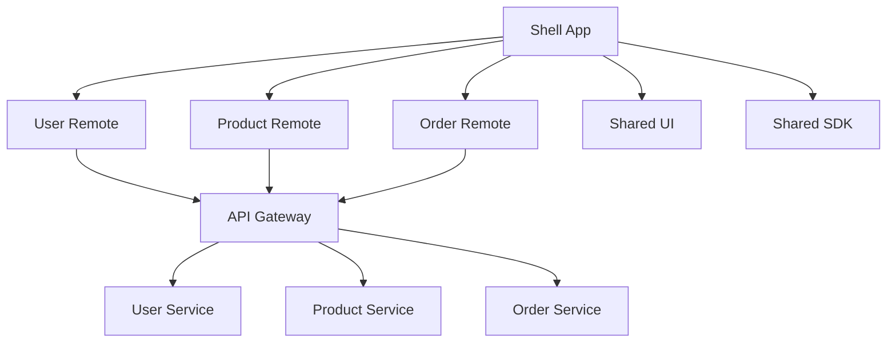
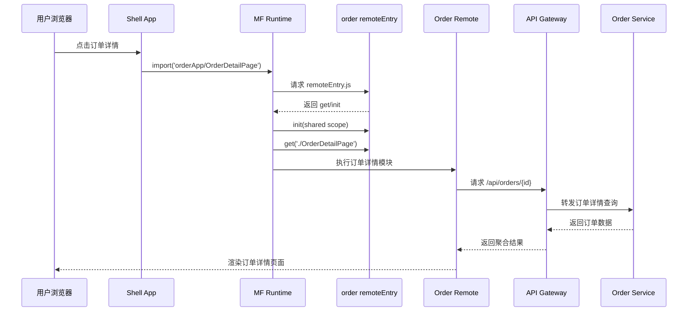
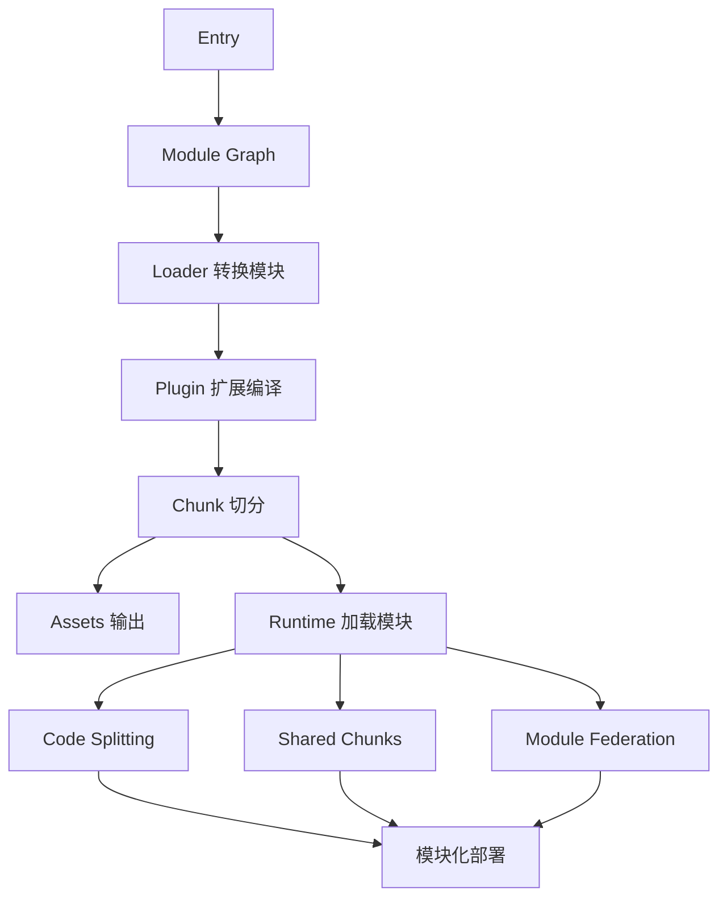

> 这篇笔记的目标是把 `Webpack` 放回它真正擅长的上下文里重新梳理一遍：它不是“把很多 JS 打成一个包”这么简单，而是一套围绕模块依赖图、构建流程、运行时加载和产物部署展开的前端工程化系统。文章重点会回答三个核心问题：`Webpack` 为什么能管理复杂模块关系、不同模块在构建期和运行期如何交互、以及模块化部署到底应该怎么落到工程实践里。

> 文中会把 `entry -> module -> chunk -> asset -> runtime` 这条主链路拆开来看，同时单独讨论 `Code Splitting`、长期缓存、多入口部署和 `Module Federation`。这里的“模块化部署”不是泛指把前端代码拆文件夹，而是指不同模块或子应用可以独立构建、独立发布、按需加载，并且在浏览器里重新拼成一套可运行应用的工程能力。

> 参考资料：
>
> Webpack 官方资料：[Webpack Concepts](https://webpack.js.org/concepts/) 、 [Configuration](https://webpack.js.org/configuration/) 、 [Code Splitting](https://webpack.js.org/guides/code-splitting/) 、 [Caching](https://webpack.js.org/guides/caching/) 、 [Tree Shaking](https://webpack.js.org/guides/tree-shaking/) 、 [Module Federation](https://webpack.js.org/concepts/module-federation/)
>
> Vite 与 Rollup 官方资料：[Why Vite](https://v6.vite.dev/guide/why) 、 [Vite Guide](https://vite.dev/guide/) 、 [Rollup Introduction](https://rollupjs.org/introduction/) 、 [Rollup JavaScript API](https://rollupjs.org/javascript-api/)
>
> 官方仓库：[webpack/webpack](https://github.com/webpack/webpack) 、 [webpack/webpack.js.org](https://github.com/webpack/webpack.js.org)

[TOC]

---

## 一、先回答几个关键问题

如果把这篇笔记压缩成几个最核心的问题，通常就是下面这些：

1. `Webpack` 到底解决的是什么问题，为什么前端项目离不开它这一类构建工具？
2. `entry`、`loader`、`plugin`、`chunk`、`runtime` 这些概念之间到底是什么关系？
3. 不同模块在构建阶段是怎样被解析、转换、合并和拆分的？
4. 浏览器运行时，普通模块、异步模块、共享模块、远程模块之间又是怎样交互的？
5. 一个前端系统怎样做到模块化部署，而不是每次发版都整站一起发布？

如果先给一句结论，可以概括为：

> `Webpack` 的核心不是“打包”，而是先把应用抽象成一张模块依赖图，再围绕这张图完成转换、优化、拆分、输出和运行时加载。模块化部署能力，本质上来自“模块关系已经被清晰建模”，因此可以进一步做按需加载、共享依赖、分包发布和远程模块消费。

这个结论带来三个很关键的推论：

- `Webpack` 的价值首先在模块管理，其次才是产物输出
- 理解 `module` 和 `chunk` 的区别，是理解构建流程和部署策略的关键
- 所谓模块化部署，最终要同时解决构建边界、运行时边界和发布边界三件事

---

## 二、Webpack 解决的到底是什么问题

### 2.1 没有构建工具时，前端模块会遇到什么问题

当前端工程规模变大以后，代码并不只是 `index.js` 引几个文件那么简单，通常很快会遇到这些问题：

- `JS`、`CSS`、图片、字体等资源类型不统一
- 模块之间依赖层级越来越深，手工维护加载顺序非常脆弱
- 不同页面都在重复打入同一批公共依赖
- 首屏只需要部分代码，但应用往往被一次性全部下载
- 生产环境需要压缩、指纹命名、缓存控制，开发环境又需要热更新和快速增量构建

如果只靠浏览器原生能力，很多事情并不是不能做，而是成本会快速失控。

### 2.2 Webpack 的定位

`Webpack` 可以概括成这样一层能力：

> 以入口为起点分析依赖关系，构建模块图，对模块做转换和优化，再把图上的模块按策略组织成一个或多个可部署、可运行的资源包。

因此它天然适合处理下面几类需求：

- 多模块前端应用的统一构建
- `TypeScript`、`Vue`、`React`、`CSS` 预处理等多类型资源编译
- 公共依赖抽取与代码分割
- 长期缓存和静态资源发布
- 多页面应用、组件库、微前端和模块联邦这类需要清晰边界的场景

### 2.3 它不只是“把文件合并”

如果只把 `Webpack` 理解成“把多个文件拼成一个文件”，会漏掉最核心的部分。

| 维度 | 只看文件合并 | 按 Webpack 理解 |
|------|--------------|----------------|
| 输入对象 | 一堆离散文件 | 一张模块依赖图 |
| 处理中间态 | 很弱 | 有 `module`、`chunk`、`runtime` 等明确抽象 |
| 输出策略 | 通常是单包 | 可以多入口、分包、按需加载、远程模块 |
| 优化方式 | 以压缩为主 | 还包括摇树优化、公共依赖抽取、缓存拆分 |
| 部署方式 | 整体部署 | 可做按页面、按能力、按子应用拆分部署 |

因此真正需要建立的是一张脑图：



---

## 三、先把几个核心概念分清楚

### 3.1 `module`、`chunk`、`asset` 不是一回事

这三个词经常被混着说，但职责完全不同：

| 概念 | 它是什么 | 关注点 |
|------|----------|--------|
| `module` | 被依赖图识别到的最小处理单元 | 源码层级的依赖关系 |
| `chunk` | 一组模块按策略聚合后的中间打包单元 | 构建和加载边界 |
| `asset` | 最终落到 `dist` 里的输出文件 | 部署与浏览器下载对象 |

可以把它们理解成这样一个映射关系：

> 源码世界先被解析成很多 `module`，构建器再把这些 `module` 组织进一个或多个 `chunk`，最后 `chunk` 经过模板和输出规则生成浏览器真正下载的 `asset`。

### 3.2 `entry` 是依赖图起点，不是页面本身

`entry` 的职责不是“代表一个 HTML 页面”，而是告诉 `Webpack` 从哪里开始收集依赖。

一个入口通常意味着：

- 一条主业务链路的起点
- 一个初始 `chunk` 的根
- 一组后续可继续扩展出异步 `chunk` 的模块子图

多入口并不等于模块化部署，但它是模块化部署的一个基础手段。

### 3.3 `loader` 和 `plugin` 的边界

`loader` 和 `plugin` 常常一起出现，但解决的问题不一样：

| 能力 | `loader` 更适合 | `plugin` 更适合 |
|------|-----------------|----------------|
| 单个模块内容转换 | 是 | 一般不是主职责 |
| 把 `ts` 变 `js` | 是 | 否 |
| 把 `scss` 变 `css` | 是 | 否 |
| 参与整个编译生命周期 | 否 | 是 |
| 生成 `html`、清理目录、注入环境变量 | 否 | 是 |
| 改变 chunk 组织或输出行为 | 一般不直接做 | 是 |

一句话概括：

- `loader` 主要处理“模块内容怎么变”
- `plugin` 主要处理“构建过程怎么扩展”

### 3.4 `runtime` 为什么重要

很多人理解完构建期之后，会忽略 `runtime`。

但浏览器真正能执行异步分包、模块缓存、远程模块消费，靠的并不是源代码里的 `import()` 语法本身，而是 `Webpack` 注入的运行时代码。

这一层通常负责：

- 模块定义表和模块缓存
- `__webpack_require__` 之类的模块加载函数
- 异步 chunk 的下载逻辑
- 公共依赖和共享模块的初始化
- 远程容器的接入与共享作用域初始化

---

## 四、Webpack 的构建原理是怎样跑起来的

### 4.1 从入口到产物的主流程

如果把一次构建压缩成主路径，可以概括为下面这条链路：



这个流程里最值得注意的是：`Webpack` 并不是先把所有文件一股脑读完再说，而是沿着依赖关系递归向前走。

### 4.2 依赖图是怎么建立出来的

从某个入口文件开始，`Webpack` 会做几件事情：

1. 读取源文件内容
2. 识别 `import`、`export`、`require`、`import()` 等依赖声明
3. 根据解析规则定位到真实文件路径
4. 对该模块执行匹配的 `loader`
5. 继续扫描这个模块依赖的下一级模块
6. 直到整条依赖链被遍历完成

最终形成的不是线性列表，而是一张有方向的依赖图。

### 4.3 `loader` 介入的位置

`loader` 发生在模块被纳入依赖图的过程中，而不是所有图构建完之后再统一处理。

例如一个 `.tsx` 文件通常会经历：

1. 源码被识别为一个模块请求
2. 命中 `babel-loader`、`ts-loader` 之类的规则
3. 转换出浏览器可继续处理的 `JavaScript`
4. 再交给 `Webpack` 继续分析它内部的依赖

这也是为什么 `loader` 不只是“编译一下”，它实际上决定了哪些文件能够进入模块图。

### 4.4 `plugin` 介入的位置

`plugin` 面向的是整个编译生命周期。它可以在多个钩子上工作，例如：

- 编译开始前读取环境
- 依赖图形成后调整 chunk 策略
- 输出前生成额外资源
- 输出后写统计信息、分析报告或清单文件

从设计上看，`plugin` 是 `Webpack` 可扩展性的核心来源之一。

### 4.5 为什么代码分割本质上是图切分

当应用里出现下面这些边界时，`Webpack` 就可以把图切开：

- 多入口
- `import()` 动态导入
- 公共依赖抽取
- `SplitChunksPlugin` 对共享模块做再分组
- 远程模块通过联邦容器在运行时装配

因此代码分割不是“把一个大文件切小”，而是：

> 在依赖图上识别哪些模块必须首屏同步加载，哪些模块可以延后加载，哪些模块应该抽成共享部分，最后把这些边界映射成多个 `chunk` 和对应静态资源。

---

## 五、不同模块在构建期如何交互

### 5.1 先建立四类模块视角

从工程上看，前端项目里的模块通常可以粗分成四类：

| 模块类型 | 典型来源 | 构建期角色 |
|----------|----------|-----------|
| 业务模块 | 页面、组件、状态管理、工具函数 | 主业务子图 |
| 共享模块 | `react`、`vue`、公共工具库、设计系统 | 被多个入口或 chunk 复用 |
| 异步模块 | 路由页面、弹窗、编辑器、大型图表 | 延迟进入初始包 |
| 远程模块 | 联邦远端暴露组件、页面或能力模块 | 不在本次本地构建物内，留到运行时加载 |

### 5.2 本地模块之间的构建期关系

下面这张图可以帮助理解普通项目里模块是怎样被组织的：



这里面有三种典型关系：

- 同步依赖：入口和业务主链路上的模块会进入初始构建子图
- 共享依赖：多个模块引用同一库时，可以被抽到公共 chunk
- 异步依赖：只有执行到 `import()` 时才触发对应 chunk 下载

### 5.3 一个典型的分包配置

下面这个配置展示了模块从单包走向多包的基础思路：

```js
const path = require('path')

module.exports = {
  mode: 'production',
  entry: {
    app: './src/index.js',
    admin: './src/admin.js'
  },
  output: {
    path: path.resolve(__dirname, 'dist'),
    filename: '[name].[contenthash:8].js',
    chunkFilename: 'chunks/[name].[contenthash:8].js',
    clean: true,
    publicPath: 'https://static.example.com/assets/'
  },
  optimization: {
    runtimeChunk: 'single',
    splitChunks: {
      chunks: 'all',
      cacheGroups: {
        framework: {
          test: /[\\/]node_modules[\\/](react|react-dom)[\\/]/,
          name: 'framework',
          priority: 20
        },
        commons: {
          minChunks: 2,
          name: 'commons',
          priority: 10
        }
      }
    }
  }
}
```

这个配置背后的模块交互逻辑可以概括成：

- `app` 和 `admin` 各自保留自己的入口子图
- `react`、`react-dom` 这类基础框架被抽成 `framework` 共享 chunk
- 被多个入口共同引用的业务模块被抽成 `commons`
- 运行时代码单独抽离，避免入口之间重复带一份模块加载逻辑

### 5.4 `tree shaking` 在模块关系里做了什么

`tree shaking` 的前提不是“压缩器足够聪明”，而是 `Webpack` 能识别模块导出关系和副作用边界。

它本质上回答的是：

- 哪些导出没有被引用
- 哪些模块虽然被引入，但没有必要完整保留
- 哪些文件有副作用，不能被轻易删除

因此它依赖的是模块级静态分析能力，而不是简单字符串替换。

---

## 六、不同模块在运行期如何交互

### 6.1 普通同步模块的加载流程

当浏览器拿到主包后，运行时首先不是“直接执行全部文件”，而是按照模块表和依赖关系逐步求值。



这里要抓住两个关键点：

- 模块通常只会求值一次，后续走缓存
- 执行顺序由依赖关系决定，不等于文件书写顺序

### 6.2 异步模块的交互流程

`import()` 出现以后，运行时会多一层 chunk 下载过程：



这个过程中，模块之间的交互已经不只是“谁引用谁”，还包括：

- 页面和运行时之间的加载协作
- 运行时和静态资源服务器之间的资源拉取
- chunk 被注册后，模块定义才真正可执行

### 6.3 共享模块为什么能减少重复下载

假设 `Home` 和 `Dashboard` 都依赖图表库，如果每个入口都把图表库打进去，会造成：

- 包体积重复
- 缓存难复用
- 某个页面改动会牵连整个大包失效

共享模块被抽离后，交互关系会变成：

- 业务入口先加载自己的入口 chunk
- 入口在执行时再依赖共享 chunk
- 如果共享 chunk 已经命中缓存，就不必重复下载

这就是长期缓存能成立的前提之一。

### 6.4 运行时为什么要单独抽出来

如果多个入口都各自带一份 runtime，常见问题是：

- chunk 映射关系重复
- 某个入口改动导致另一入口的 runtime 哈希也跟着变化
- 公共模块和入口模块之间的依赖边界不稳定

因此 `runtimeChunk: 'single'` 的价值就在于把“模块装配逻辑”稳定下来，让真正变动的业务代码和相对稳定的运行时代码分离。

---

## 七、模块化部署到底在解决什么

### 7.1 不是只拆文件，而是拆发布边界

模块化部署至少要解决下面三层边界：

| 边界 | 核心问题 | 典型手段 |
|------|----------|----------|
| 构建边界 | 哪些代码一起编译 | 多入口、代码分割、组件库、独立仓库 |
| 运行时边界 | 哪些模块一起加载，哪些模块按需加载 | `import()`、共享 chunk、远程容器 |
| 发布边界 | 哪些内容可以单独上线，不影响其他模块 | 静态资源指纹、CDN、联邦远端、灰度发布 |

如果只做到“源码目录分模块”，但发版时仍然每次全量替换整站静态资源，那么它离真正的模块化部署还有距离。

### 7.2 常见的三种部署形态

| 形态 | 特点 | 更适合的场景 |
|------|------|--------------|
| 单应用分包部署 | 一个应用统一构建，但有多个 chunk 和长期缓存 | 常规中后台、单仓前端项目 |
| 多入口独立部署 | 不同页面或子站点各自有入口和产物 | 多页面系统、运营页面集群 |
| 联邦式模块部署 | 不同应用独立构建、独立发布、运行时互相消费模块 | 微前端、平台型系统、跨团队协作 |

### 7.3 单应用分包部署的落地方式

这是很多团队最容易先落地的一种方式，目标通常是：

- 首屏只发必要资源
- 公共依赖单独缓存
- 页面改动尽量不要导致全量缓存失效

一个相对稳妥的策略通常包括：

- 入口包只保留当前页面主逻辑
- 公共库抽到稳定 `vendor/framework` chunk
- 业务公共模块抽成 `commons`
- 运行时单独拆分
- 文件名使用 `contenthash`
- 静态资源托管到 `CDN`，并保证历史版本可访问

### 7.4 多入口部署的边界

多入口适合把“页面级能力”拆开，但它并不能天然解决跨应用共享与独立发布问题。

如果两个系统分别部署，而且都需要复用某个公共页面组件，多入口只能做到：

- 各自编译一份
- 或者抽成组件库后重新发版

它还没有做到“一个模块更新后，另一个系统不用重新构建就能消费新版本”。

---

## 八、Module Federation 为什么是更彻底的模块化部署

### 8.1 它解决的是什么问题

`Module Federation` 的目标可以概括成：

> 让多个独立构建产物在运行时形成一套应用，并且允许某个应用把模块暴露出去，另一个应用在浏览器里按需加载和执行这些模块。

这意味着：

- 构建仍然各自独立
- 发布仍然可以各自独立
- 运行时再通过远程容器把模块拼起来

### 8.2 Host 和 Remote 的角色分工

| 角色 | 职责 |
|------|------|
| `Host` | 消费远程模块，负责路由装配、页面组合或能力编排 |
| `Remote` | 暴露某些页面、组件、工具函数或状态模块 |
| `Shared` | 多个构建之间声明共享依赖，避免基础库重复实例化 |

### 8.3 一条典型的交互链路



这条链路里最关键的两个动作是：

1. `init(shared scope)`：建立共享依赖协商环境
2. `get(exposedModule)`：获取真正的远程模块工厂函数

### 8.4 一个最小配置示例

远端应用：

```js
const { ModuleFederationPlugin } = require('webpack').container

module.exports = {
  plugins: [
    new ModuleFederationPlugin({
      name: 'orderRemote',
      filename: 'remoteEntry.js',
      exposes: {
        './OrderPage': './src/pages/OrderPage',
        './OrderService': './src/services/orderService'
      },
      shared: {
        react: { singleton: true, requiredVersion: '^18.0.0' },
        'react-dom': { singleton: true, requiredVersion: '^18.0.0' }
      }
    })
  ]
}
```

主应用：

```js
const { ModuleFederationPlugin } = require('webpack').container

module.exports = {
  plugins: [
    new ModuleFederationPlugin({
      name: 'shell',
      remotes: {
        orderRemote: 'orderRemote@https://static.example.com/order/remoteEntry.js'
      },
      shared: {
        react: { singleton: true, requiredVersion: '^18.0.0' },
        'react-dom': { singleton: true, requiredVersion: '^18.0.0' }
      }
    })
  ]
}
```

业务代码：

```js
const OrderPage = React.lazy(() => import('orderRemote/OrderPage'))
```

### 8.5 为什么说它比组件库复用更接近“部署级模块化”

组件库复用的特点是：

- 先发布包
- 消费方重新安装依赖
- 再重新构建、重新部署

联邦模块复用的特点是：

- 远端先独立发布
- 消费方不一定需要重新构建
- 浏览器在运行时拉取最新远端资源

因此两者最大的区别，不在“能不能复用代码”，而在“复用发生在构建期还是运行期”。

### 8.6 需要注意的边界

`Module Federation` 很强，但也不是没有代价：

| 风险点 | 典型问题 | 应对思路 |
|--------|----------|----------|
| 版本漂移 | `shared` 依赖版本不兼容 | 明确 `singleton`、`requiredVersion` 和升级策略 |
| 运行时故障 | 远端服务不可用或资源 404 | 做降级页、兜底组件和超时处理 |
| 首次加载成本 | 需要额外拉取 `remoteEntry.js` 与远端 chunk | 控制暴露粒度，必要时预加载 |
| 调试复杂度 | 问题跨多个仓库与发布单元 | 接入统一日志、构建版本标识和链路追踪 |

---

## 九、把模块化部署真正落到工程实践

### 9.1 一个相对稳妥的发布设计

如果目标是让模块可独立演进，但整体应用又能稳定运行，通常建议遵循下面几条原则：

1. 基础框架依赖尽量稳定，避免高频变动的共享包
2. 共享模块只共享真正值得共享的基础能力，不要把所有业务状态都塞进 `shared`
3. 远程模块暴露的是清晰边界的页面、组件或服务，不要暴露半成品内部实现
4. 所有静态资源都走带版本指纹的路径，避免缓存污染
5. 对远程模块做可回滚、可灰度、可监控的发布设计

### 9.2 一条更完整的发布链路



### 9.3 什么时候该选哪种方案

| 场景 | 更推荐的方案 | 原因 |
|------|--------------|------|
| 单个中后台项目，希望优化包体积和缓存 | 单应用分包 + 长期缓存 | 成本最低，收益直接 |
| 多页面门户，每个页面改动频率不同 | 多入口构建与独立部署 | 页面边界天然清晰 |
| 多团队共同维护一个平台，页面和能力复用频繁 | `Module Federation` | 同时满足独立发布和运行时集成 |
| 只想抽公共组件复用，发布节奏可统一 | 组件库 | 运维复杂度更低 |

---

## 十、一个更贴近业务的 React + Module Federation 落地案例

### 10.1 先假设一个真实业务场景

假设现在要做一个电商运营平台，至少包含下面几类核心能力：

- 用户中心：用户列表、用户详情、会员等级、收货地址
- 商品中心：商品列表、商品详情、库存、类目、价格策略
- 订单中心：订单查询、订单详情、退款、发货、物流轨迹
- 平台壳应用：登录态、菜单、路由、导航、权限和埋点

如果这些能力全部放在一个前端仓库里，短期是最直接的；但随着团队分工和发版频率提升，往往会出现：

- 订单模块改一个页面，整个平台都要重新构建和发布
- 商品团队和用户团队的需求节奏完全不同，但发版被绑定
- 某个远端业务包变大以后，平台首页和别的页面也被牵连
- 公共能力和业务能力边界不清，长期会形成“大前端单体”

这时更合理的拆法，通常是按业务域做前端模块边界。

### 10.2 一个推荐的拆分方式

| 应用 / 模块 | 主要职责 | 是否适合作为联邦远端 |
|-------------|----------|---------------------|
| `shell-app` | 登录态、菜单、权限、导航、统一布局、埋点、异常兜底 | Host，负责消费远端 |
| `user-app` | 用户列表、用户详情、会员模块 | 是 |
| `product-app` | 商品管理、库存、价格、类目 | 是 |
| `order-app` | 订单列表、订单详情、发货、售后 | 是 |
| `shared-ui` | 设计系统、表格、按钮、弹窗、表单组件 | 更适合共享依赖或组件库 |
| `shared-sdk` | 请求封装、鉴权、埋点、监控、权限判断 | 适合共享，但要保持稳定 |

这类拆分的关键不是“每个菜单拆一个应用”，而是：

> 让一个业务域的页面、接口模型、状态管理和发布节奏尽量保持一致；不要为了追求极致拆分，把高频协作页面拆得过碎。

### 10.3 整体架构长什么样



这张图里有两个边界必须明确：

- `shell-app` 负责装配，不负责承载所有业务实现
- 业务远端直接面向后端服务或网关，但统一通过共享 SDK 处理鉴权、追踪和错误封装

### 10.4 目录结构可以怎样组织

如果按多仓思路拆分，一个相对清晰的结构可以概括成：

```text
platform-shell/
user-center/
product-center/
order-center/
shared-ui/
shared-sdk/
```

如果暂时还是单仓，也可以先用 `monorepo` 过渡：

```text
apps/
  shell-app/
  user-app/
  product-app/
  order-app/
packages/
  shared-ui/
  shared-sdk/
```

这种过渡方式的价值在于：

- 先练清模块边界
- 再决定是否真的拆仓
- 避免一开始就陷入组织结构先于工程结构的问题

### 10.5 Host 和业务远端怎样分工

| 能力 | 更适合放在 `shell-app` | 更适合放在业务远端 |
|------|------------------------|-------------------|
| 登录态恢复 | 是 | 否 |
| 顶层菜单和路由注册 | 是 | 否 |
| 用户列表页 | 否 | `user-app` |
| 商品详情页 | 否 | `product-app` |
| 订单详情页 | 否 | `order-app` |
| 埋点、监控、主题、国际化底座 | 是，且尽量共享 | 一般消费即可 |
| 业务内局部状态 | 否 | 由各远端维护 |

这里最容易踩坑的地方是把 `shell-app` 写成“超级应用”。一旦壳应用开始维护大量业务状态，它就不再是壳，而会重新变成中心化单体。

### 10.6 一个更贴近业务的联邦配置

主应用：

```js
const { ModuleFederationPlugin } = require('webpack').container

module.exports = {
  plugins: [
    new ModuleFederationPlugin({
      name: 'shell',
      remotes: {
        userApp: 'userApp@https://static.example.com/user/remoteEntry.js',
        productApp: 'productApp@https://static.example.com/product/remoteEntry.js',
        orderApp: 'orderApp@https://static.example.com/order/remoteEntry.js'
      },
      shared: {
        react: { singleton: true, eager: false, requiredVersion: '^18.0.0' },
        'react-dom': { singleton: true, eager: false, requiredVersion: '^18.0.0' },
        'react-router-dom': { singleton: true, requiredVersion: '^6.0.0' },
        '@company/shared-sdk': { singleton: true },
        '@company/shared-ui': { singleton: true }
      }
    })
  ]
}
```

订单远端：

```js
const { ModuleFederationPlugin } = require('webpack').container

module.exports = {
  plugins: [
    new ModuleFederationPlugin({
      name: 'orderApp',
      filename: 'remoteEntry.js',
      exposes: {
        './OrderRoutes': './src/routes',
        './OrderPage': './src/pages/OrderPage',
        './OrderDetailPage': './src/pages/OrderDetailPage'
      },
      shared: {
        react: { singleton: true, requiredVersion: '^18.0.0' },
        'react-dom': { singleton: true, requiredVersion: '^18.0.0' },
        'react-router-dom': { singleton: true, requiredVersion: '^6.0.0' },
        '@company/shared-sdk': { singleton: true },
        '@company/shared-ui': { singleton: true }
      }
    })
  ]
}
```

### 10.7 业务路由怎样在 Host 里装配

壳应用通常不直接写死所有页面实现，而是做远端页面注册：

```jsx
import React, { Suspense, lazy } from 'react'
import { createBrowserRouter } from 'react-router-dom'
import { AppLayout, PageLoading, PageError } from '@company/shared-ui'

const UserRoutes = lazy(() => import('userApp/UserRoutes'))
const ProductRoutes = lazy(() => import('productApp/ProductRoutes'))
const OrderRoutes = lazy(() => import('orderApp/OrderRoutes'))

function withRemotePage(RemotePage) {
  return (
    <Suspense fallback={<PageLoading />}>
      <PageError>
        <RemotePage />
      </PageError>
    </Suspense>
  )
}

export const router = createBrowserRouter([
  {
    path: '/',
    element: <AppLayout />,
    children: [
      { path: 'users/*', element: withRemotePage(UserRoutes) },
      { path: 'products/*', element: withRemotePage(ProductRoutes) },
      { path: 'orders/*', element: withRemotePage(OrderRoutes) }
    ]
  }
])
```

这里的核心思想是：

- 壳应用只知道远端入口和装配方式
- 具体业务页面、子路由、业务状态都交给远端维护
- 每个远端失败时都可以独立降级，不必拖垮整个应用

### 10.8 以“订单详情页”看一遍真实交互流程

假设运营人员点击订单列表中的一条记录，进入订单详情页，链路可以拆成下面这样：



这个流程里，浏览器端会同时发生两类装配：

- 前端模块装配：拉取远端页面、初始化共享依赖、执行远端模块
- 业务数据装配：远端页面再调用后端网关和业务服务获取真实数据

### 10.9 页面级、组件级、服务级暴露怎么选

| 暴露粒度 | 更适合的内容 | 优点 | 风险 |
|----------|--------------|------|------|
| 页面级暴露 | `OrderPage`、`UserPage` | 边界清晰，最容易治理 | 复用粒度较粗 |
| 路由级暴露 | `OrderRoutes` | Host 接入简单，适合中后台 | 远端要维护自己的子路由结构 |
| 组件级暴露 | `UserProfileCard`、`ProductPricePanel` | 灵活复用 | 容易演变成远端碎片化调用 |
| 服务级暴露 | `OrderService`、`PermissionService` | 可复用业务逻辑 | 一旦跨远端共享太多，会耦合变重 |

对于业务系统，通常推荐优先级是：

1. 页面级或路由级暴露
2. 稳定的少量组件级暴露
3. 谨慎做服务级暴露

因为暴露粒度越细，治理成本通常越高。

### 10.10 状态管理应该怎么处理

联邦场景下最容易失控的问题之一，就是状态边界。

比较稳妥的原则通常是：

- 登录态、主题、国际化、权限快照这类全局底座状态放在 `shell-app`
- 订单筛选条件、商品编辑草稿、用户详情页本地状态放在各自远端
- 跨远端共享的数据尽量通过 URL、事件、接口重新获取，而不是直接共享整个状态仓库

如果所有远端都直接读写同一个全局 store，短期方便，长期会出现：

- 发布边界变得名存实亡
- 远端升级互相影响
- 状态污染和时序问题难排查

### 10.11 一个更像项目落地的发布策略

| 模块 | 发布频率 | 资源路径示例 | 说明 |
|------|----------|--------------|------|
| `shell-app` | 中等 | `/shell/20260624/` | 平台级能力更新时发布 |
| `user-app` | 中等 | `/user/20260624/` | 用户域独立发布 |
| `product-app` | 高频 | `/product/20260624/` | 商品运营需求多，发版更频繁 |
| `order-app` | 高频 | `/order/20260624/` | 订单查询和售后链路变化快 |

可以进一步约束成下面这套规则：

- `remoteEntry.js` 使用清晰版本目录或配套 manifest 管理
- `contenthash` 文件长期缓存，`remoteEntry.js` 控制更新发现
- 主应用保留一版远端回滚清单
- 灰度发布时先让内部用户命中新远端，再逐步扩大流量

### 10.12 这个案例最值得记住的结论

如果把这个案例压缩成一句话，可以概括为：

> `Module Federation` 最适合的不是“把所有组件都拆成远程模块”，而是让用户、商品、订单这类业务域形成相对完整的前端交付单元，由壳应用统一装配，由各业务团队独立演进。

---

## 十一、Webpack 和 Vite / Rollup 应该怎样理解和选择

### 11.1 先把三者关系说清楚

这三个名字经常被当成平级替代品，但它们其实不完全在同一层。

| 工具 | 更准确的定位 | 典型强项 |
|------|--------------|----------|
| `Webpack` | 面向复杂应用的模块打包与运行时装配系统 | 模块图控制、插件生态、`Module Federation` |
| `Vite` | 面向现代前端应用的开发服务器 + 构建方案 | 开发体验快、配置轻、现代框架开箱即用 |
| `Rollup` | 面向 `ESM` 输出质量和静态分析的打包器 | 库打包、Tree Shaking、产物干净 |

更进一步说：

- `Vite` 在开发环境主要依赖浏览器原生 `ESM` 做按需加载
- `Vite` 的生产构建默认基于 `Rollup`
- `Webpack` 则自己同时覆盖了模块图构建、chunk 组织和运行时装配

因此最重要的结论不是“谁替代谁”，而是：

> `Vite` 更像一套现代应用开发体验方案，`Rollup` 更像一个更专注的构建内核，而 `Webpack` 仍然是复杂模块装配和部署治理能力最完整的体系之一。

### 11.2 如果只看开发体验，差异在哪里

| 维度 | `Webpack` | `Vite` | `Rollup` |
|------|-----------|--------|----------|
| 开发服务器启动 | 通常要先进入 bundling 过程 | 更快，偏按需处理 | 不是主要强项 |
| HMR 心智模型 | 依赖 bundler 侧模块失效与热替换 | 基于原生 `ESM` 链路更轻 | 更偏构建，不主打应用开发 HMR |
| 配置复杂度 | 相对更高 | 通常更轻 | 中等，偏构建产物控制 |
| 现代框架开箱能力 | 有，但配置成本更高 | 很强 | 常需配合额外插件和脚手架 |

这里最核心的差异是：

- `Webpack` 更强调由 bundler 掌控整个模块运行时
- `Vite` 更强调开发阶段把一部分工作交给浏览器
- `Rollup` 更强调“把最终产物构建好”，而不是提供完整应用开发体验

### 11.3 如果只看生产构建，差异在哪里

| 维度 | `Webpack` | `Vite` | `Rollup` |
|------|-----------|--------|----------|
| 生产打包能力 | 强，适合复杂应用 | 默认走 `Rollup`，体验统一 | 强，尤其适合库产物 |
| 代码分割 | 强 | 强，底层依赖 `Rollup` 能力 | 强 |
| 长期缓存治理 | 很成熟 | 可做，但很多项目更依赖默认约定 | 可做，但更偏构建层 |
| 模块联邦 | 原生体系最成熟 | 依赖生态插件补充 | 非主要能力 |
| 运行时装配控制 | 强 | 相对收敛 | 较少强调浏览器运行时装配 |

### 11.4 为什么很多新项目更愿意用 Vite

如果从团队日常开发感受来看，`Vite` 的吸引力很直接：

- 项目启动更快
- 改一个文件的反馈通常更快
- React、Vue、Svelte 等现代框架接入成本低
- 默认配置更轻，团队更容易维持一致性

这也是为什么很多新项目会优先选择 `Vite`，尤其是：

- 中小型到中大型单页应用
- 以日常业务迭代效率为首要目标的项目
- 不需要太重的定制构建链和联邦装配能力的项目

### 11.5 为什么 Webpack 仍然有不可替代的场景

`Webpack` 真正的优势，不只是“老牌工具”，而是它在复杂模块治理上的能力密度仍然很高。

它更适合下面这些场景：

- 已经存在多年、插件和构建链高度定制的存量项目
- 强依赖 `Module Federation` 做微前端或业务域拆分
- 需要非常细粒度控制 `chunk`、runtime、共享模块与发布边界
- 公司内部已经有大量基于 `Webpack` 的脚手架、插件和构建平台沉淀

换句话说，`Webpack` 的优势不主要在“把一个 React 页面跑起来”，而在“把一个复杂前端平台长期稳定地构建、拆分、部署和治理起来”。

### 11.6 Rollup 更适合什么位置

`Rollup` 的优势通常不在超复杂平台应用，而在下面这些方向：

- 打包组件库、工具库、SDK
- 产出更干净的 `ESM/CJS` 包
- 对导出格式、外部依赖、Tree Shaking 有更明确控制
- 作为构建内核被更上层工具复用

这也是为什么很多团队会形成这样的分工：

- 应用项目优先 `Vite`
- 库项目优先 `Rollup`
- 复杂平台或联邦项目继续保留 `Webpack`

### 11.7 一个更务实的选型表

| 场景 | 更推荐的工具 | 原因 |
|------|--------------|------|
| 新建 React / Vue 常规应用 | `Vite` | 开发体验更轻，默认方案更现代 |
| npm 组件库、工具库、SDK | `Rollup` | 对产物格式和 Tree Shaking 控制更直接 |
| 已有大型 Webpack 项目持续演进 | `Webpack` | 迁移成本高，且已有体系沉淀 |
| 微前端平台、联邦式模块部署 | `Webpack` | `Module Federation` 生态最成熟 |
| 只是想做单应用包体优化 | `Vite` 或 `Webpack` 都可以 | 关键在团队现状和存量资产 |

### 11.8 不要把“新”理解成绝对更好

工具选型里一个很常见的误区是：

- 看到 `Vite` 快，就想把所有项目全部迁走
- 看到 `Webpack` 配置重，就认为它已经没有价值
- 看到 `Rollup` 产物干净，就拿它直接替代所有应用工程方案

更合理的判断方式通常是：

1. 先看项目主要矛盾是在开发效率、构建治理还是部署装配
2. 再看团队已有沉淀是在 `Webpack` 还是 `Vite`
3. 最后看业务是否真的需要联邦、共享依赖和复杂运行时治理

---

## 十二、理解 Webpack 时最容易混淆的几件事

### 10.1 `module` 和 `chunk` 混淆

最常见的误解是把“每个模块都会变成一个独立文件”。

实际上：

- 一个 `chunk` 里通常包含多个 `module`
- 一个模块也可能因为拆分策略进入不同类型的 chunk 组织关系
- 浏览器请求的是 `asset`，不是源码级 `module`

### 10.2 `Code Splitting` 和模块化部署混淆

代码分割主要解决：

- 首屏加载压力
- 包体积拆分
- 缓存复用

模块化部署额外还要解决：

- 独立发布
- 跨应用模块消费
- 运行时模块装配和版本治理

因此 `Code Splitting` 是基础能力，但不是最终形态。

### 10.3 `shared` 越多越好

这也是一个常见误区。共享得过多，会导致：

- 远端之间耦合增强
- 版本协商复杂
- 问题定位更困难

真正值得共享的通常是：

- 基础框架
- 稳定的设计系统
- 低频变更的通用工具

而不是高频变化的业务逻辑。

---

## 十三、最后收束成一张总图

如果要把本文的逻辑收束成一张总图，可以概括成下面这样：



这张图里最重要的一层因果关系是：

> 因为 `Webpack` 先把应用抽象成了可分析、可切分、可重组的模块图，所以它不仅能完成构建，还能进一步支持按需加载、共享依赖、远程模块消费和独立部署。模块化部署不是额外补出来的技巧，而是这套模块图模型继续向工程化落地的结果。

---

## 十四、总结

可以把这篇笔记最后压缩成六句话：

1. `Webpack` 的核心对象是模块依赖图，不是单个输出文件。
2. 构建期关注模块如何被解析、转换、优化和组织成 chunk。
3. 运行期关注 runtime 如何加载普通模块、异步模块、共享模块和远程模块。
4. 模块化部署的关键不只是拆包，而是让模块具备清晰的构建边界、运行时边界和发布边界。
5. 真正可落地的 `Module Federation` 更适合按用户、商品、订单这类业务域拆分，而不是无边界地拆碎组件。
6. 工具选型上通常可以概括为：常规现代应用优先看 `Vite`，库构建优先看 `Rollup`，复杂模块装配和联邦部署仍然优先看 `Webpack`。

如果只做单应用优化，`Code Splitting + SplitChunks + 长期缓存` 往往已经足够；如果要走到跨团队、跨应用的独立演进，`Module Federation` 才是更接近“部署级模块化”的方案。
