> 这篇笔记不是停留在“Flowable 怎么跑一个请假流程 demo”这一层，而是把问题往下压到引擎本身：`Flowable` 到底在执行什么、流程定义是如何被解析和版本化的、一次流程推进为什么会和事务边界、异步任务、历史表、重试机制绑在一起，以及它和 `Camunda`、`Activiti`、`jBPM` 这些流程引擎到底差在哪。

> 文章后半部分会落到工程实战：不是把 Flowable 简单塞进某个业务服务里，而是按更常见的企业方案，把它做成一个独立部署的工作流中心，然后让 `Spring Boot` 业务系统通过门面接口接入，完成报销审批这类典型流程场景。

> 参考资料：
>
> Flowable 官方文档：[Flowable Open Source Documentation](https://www.flowable.com/open-source/docs) 、 [Getting Started](https://www.flowable.com/open-source/docs/bpmn/ch02-GettingStarted) 、 [The Flowable API](https://www.flowable.com/open-source/docs/bpmn/ch04-API) 、 [Spring Boot](https://www.flowable.com/open-source/docs/bpmn/ch05a-Spring-Boot) 、 [Deployment](https://www.flowable.com/open-source/docs/bpmn/ch06-Deployment) 、 [Process Instance Migration](https://www.flowable.com/open-source/docs/bpmn/ch08-ProcessInstanceMigration)
>
> Flowable 进阶资料：[Flowable applications](https://www.flowable.com/open-source/docs/bpmn/ch13-Applications) 、 [Spring integration](https://www.flowable.com/open-source/docs/bpmn/ch05-Spring) 、 [Asynchronous Execution](https://documentation.flowable.com/latest/reactmodel/bpmn/concept/asynchronous-execution) 、 [Auto deployment overview](https://documentation.flowable.com/latest/develop/be/auto-deployment) 、 [Service Task](https://documentation.flowable.com/latest/reactmodel/bpmn/reference/service-task) 、 [HTTP Task](https://documentation.flowable.com/latest/reactmodel/bpmn/reference/http-task) 、 [External Worker Task](https://documentation.flowable.com/latest/reactmodel/bpmn/reference/external-worker-task) 、 [Event Registry Introduction](https://www.flowable.com/open-source/docs/eventregistry/ch06-EventRegistry-Introduction)
>
> 对比资料：[Camunda 8 Introduction](https://docs.camunda.io/docs/8.8/components/concepts/concepts-overview/) 、 [Introduction to Zeebe](https://docs.camunda.io/docs/components/zeebe/zeebe-overview/) 、 [Connecting the workflow engine with your world](https://docs.camunda.io/docs/8.6/components/best-practices/development/connecting-the-workflow-engine-with-your-world/) 、 [Activiti User Guide](https://www.activiti.org/userguide/) 、 [jBPM Documentation](https://docs.jboss.org/jbpm/release/7.65.0.Final/jbpm-docs/html_single/)

[TOC]

---

## 一、先回答几个关键问题

如果把这篇笔记先压缩成几个最核心的问题，通常就是下面这些：

1. `Flowable` 到底是什么，它和“审批系统”或者“任务待办系统”是什么关系？
2. 一个 BPMN 文件部署进去之后，Flowable 内部到底如何解析、持久化和推进流程？
3. 为什么一到线上，大家就会开始关心事务边界、异步执行器、重试、死信任务和流程迁移？
4. `Flowable` 和 `Camunda`、`Activiti`、`jBPM` 这些引擎相比，适用边界到底在哪里？
5. 真正做项目时，`Spring Boot` 应该怎样接入一个独立部署的 Flowable 工作流中心？

如果先给一句结论，可以概括为：

> `Flowable` 本质上不是“画图工具”，也不是“待办页面”，而是一个可以执行 `BPMN/CMMN/DMN` 模型、维护流程状态、管理任务与事件、并把这些状态可靠落到数据库中的工作流执行内核。

这个结论再往下推，会得到三个很关键的判断：

- 它擅长的是“有状态、可追踪、可等待、可恢复”的业务流程编排
- 它不是用来替代普通的 `if/else` 业务逻辑，也不是所有系统都必须上流程引擎
- 真正决定项目成败的，往往不是“流程能不能跑起来”，而是部署方式、建模边界、事务设计、变量设计和版本演进策略

---

## 二、Flowable 是什么，不是什么

### 2.1 它是什么

Flowable 官方把自己定义为轻量级 Java 工作流引擎，支持部署和执行 `BPMN 2.0` 流程定义，并能查询运行态和历史态数据。除此之外，它不只做 BPMN，还覆盖：

- `BPMN`：流程编排
- `CMMN`：案例管理
- `DMN`：决策规则
- `Event Registry`：事件接入与事件触发

这意味着它并不只是一个“审批流组件”，而更接近一层流程运行平台。

### 2.2 它不是什么

很多团队第一次接触 Flowable 时，容易把它想成一个“大号状态机”或者“可视化审批插件”，这会带来很多误用。

| 认知对象 | `Flowable` 是否等价 | 原因 |
|------|----------------|------|
| 表单系统 | 否 | 表单只是输入界面，Flowable 负责的是流程状态推进 |
| 纯规则引擎 | 否 | 规则判断只是流程中的一部分，更适合 `DMN` 或外部规则系统 |
| 任务中心页面 | 否 | 待办页面是上层应用，真正的核心是任务生命周期和执行状态 |
| 微服务编排的唯一答案 | 否 | 对高吞吐、短链路、纯事件驱动场景，未必需要流程引擎 |
| 一上就能解决复杂业务的银弹 | 否 | 建模不当、变量过重、节点命名混乱，反而会放大复杂度 |

### 2.3 什么场景适合上 Flowable

更适合使用 Flowable 的，通常是下面这类流程：

- 存在明确状态流转，而且要跨多个步骤持续几小时、几天甚至几个月
- 既有人审节点，也有系统自动节点
- 需要催办、撤回、跳转、补偿、重试、审计
- 流程定义会演化，且希望版本可控
- 希望把“流程骨架”从业务代码里抽出来，让可视化和可追踪性更强

例如：

- 请假、报销、采购、合同审批
- 开户、授信、理赔、核保这类长流程
- 订单履约中带人工介入的异常处理链路
- 事件驱动的编排链，比如“收到 Kafka 事件后触发流程，再驱动人工和系统协同”

---

## 三、为什么 Flowable 在 Java 工程里常被选中

Flowable 的强项，不只是“支持 BPMN”，而是它把工作流内核做成了很容易嵌入 Java 工程的一层执行能力。

### 3.1 先看它的工程特征

| 特征 | 对工程落地的意义 |
|------|------------------|
| Java 编写，可嵌入 Spring / Spring Boot | 对 Java 团队接入成本低 |
| 服务对象无状态 | 多实例部署时，天然适合共享数据库做集群 |
| 支持 BPMN / CMMN / DMN / Event Registry | 同一套平台能覆盖流程、案例、规则、事件 |
| 官方支持 Spring Boot Starter | 启动与配置门槛低 |
| 同时支持嵌入式和 REST 化接入 | 可以按系统规模决定部署形态 |
| 支持流程定义版本化和实例迁移 | 更适合长期演进的业务流程 |

### 3.2 它和 Activiti 的关系

这个关系必须说清楚。

Flowable 是从 `Activiti` 分叉出来的项目，因此两者在概念、表结构命名、很多 API 风格上有明显继承关系。也正因为这个历史背景，很多老文章里出现的 `ACT_*` 表、`RepositoryService`、`RuntimeService`、`TaskService` 这些概念，在 Flowable 里都不会陌生。

但到了今天，真正做技术选型时，通常不会把 Flowable 简单理解为“另一个 Activiti”。

更准确地说：

- `Activiti` 更像是共同起源
- `Flowable` 更强调持续演进的多模型能力和 Spring 体系集成
- 真正做新项目选型时，Flowable 往往是比老版本 Activiti 更常见的候选项

---

## 四、先建立整体架构视图

如果只从“怎么调用 API”去理解 Flowable，很容易看不清它真正的工作机制。先把整体链路摆出来更容易抓住主线。

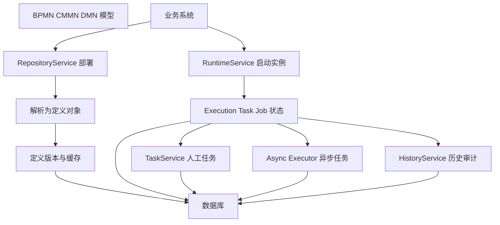

这张图里最重要的不是某个 API 名字，而是下面这件事：

> Flowable 并不是“每次临时读一下 BPMN 文件然后顺着跑完”，而是把流程定义解析成可执行定义，把运行时状态拆成执行实例、任务、变量、作业、历史记录等多种持久化对象，然后基于数据库推进流程。

### 4.1 静态组成：引擎、服务、数据库

从静态结构上看，Flowable 的核心可以概括成三层：

1. `ProcessEngine`
2. 一组无状态服务对象
3. 一组持久化表

官方 API 里最常用的服务包括：

- `RepositoryService`：部署、查询流程定义
- `RuntimeService`：启动、推进流程实例
- `TaskService`：查询和完成用户任务
- `ManagementService`：运维、Job、表信息等管理能力
- `HistoryService`：历史数据查询
- `IdentityService`：用户、组、候选人等身份相关能力
- `FormService`：表单相关能力

### 4.2 持久化表为什么重要

很多人觉得流程引擎难，是因为它“概念多”。实际上更根本的原因是：

> 它要把一个长期运行的业务过程，拆解成可恢复、可回滚、可查询、可迁移的数据库状态。

因此，理解表分层比死记某张表名更重要。

| 表前缀 | 主要含义 | 常见内容 |
|------|----------|----------|
| `ACT_RE_*` | Repository | 部署、流程定义、资源文件 |
| `ACT_RU_*` | Runtime | 执行实例、当前任务、变量、作业 |
| `ACT_HI_*` | History | 历史流程、历史任务、历史变量 |
| `ACT_GE_*` | General | 通用配置、字节数组等 |
| `ACT_ID_*` | Identity | 用户、组、成员关系 |

对日常开发而言，不要求把每张表背下来，但至少要知道：

- 运行态和历史态是分开的
- 当前执行状态不是只存在内存里，而是落到数据库里
- 一旦引擎重启，流程能恢复，本质依赖的就是这些持久化状态

---

## 五、从 BPMN XML 到流程实例：Flowable 的核心执行主线

这一部分是理解 Flowable 的关键。

### 5.1 第一步：部署不是“上传文件”，而是解析和建模

当通过 `RepositoryService` 部署一个 BPMN 文件时，Flowable 做的事情不只是把 XML 存起来。

它至少会做下面几件事：

1. 扫描业务归档或类路径资源
2. 找出 `.bpmn` 或 `.bpmn20.xml` 资源
3. 解析 XML，转换成内部可执行模型
4. 生成流程定义记录
5. 将定义和资源信息写入仓库表
6. 放入定义缓存，供后续启动实例使用

这也是为什么“部署”本身就是一个很重要的概念。

> 在 Flowable 里，部署是流程定义进入引擎世界的边界点。

### 5.2 第二步：版本不是 BPMN 自带的，而是引擎赋予的

`BPMN` 标准本身没有内建流程版本管理，但 Flowable 在部署时会根据 `processDefinitionKey` 生成版本号。

这带来两个很关键的行为：

- 新部署的同 key 流程，会得到更高版本
- 新启动的流程实例，默认使用最新版本

同时，老实例并不会自动切到新版本。

这件事很重要，因为它意味着：

- 流程定义升级不会立刻影响所有在途实例
- 线上流程变更必须同时考虑“新实例怎么跑”和“老实例怎么办”

### 5.3 第三步：启动流程实例，本质是创建一组运行时状态

调用 `runtimeService.startProcessInstanceByKey(...)` 时，不是简单地“进入开始节点然后往下跑”。

更准确地说，它做的是：

1. 根据 key 找到目标流程定义
2. 创建流程实例和执行实例
3. 初始化变量
4. 从开始事件进入流程图
5. 尽可能同步推进，直到遇到等待点

这里的“等待点”非常关键，比如：

- `UserTask`
- `ReceiveTask`
- 消息捕获事件
- 定时器等待
- 异步边界

只要流程走到了等待点，当前事务通常就可以提交，流程状态留存在数据库里，等下一次外部动作再继续推进。

### 5.4 第四步：流程推进，本质是 token 在图上的移动

从概念上看，Flowable 在做的事情可以理解成：

- 流程定义是一张可执行有向图
- 流程实例是这张图上的一次运行
- 当前执行位置会由执行对象和任务对象记录
- 当某个节点完成时，token 会沿着 sequence flow 移动到下一个节点

可以用下面这张图快速理解：

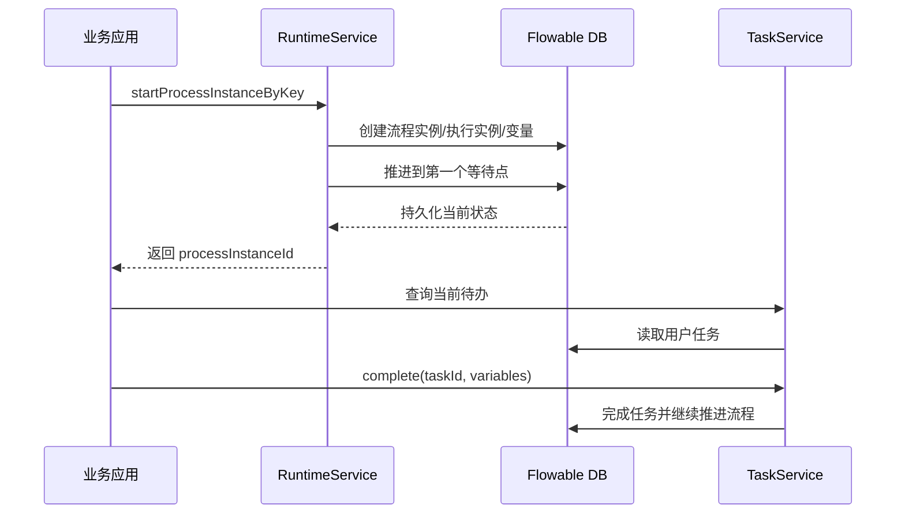

### 5.5 第五步：服务对象为什么被设计成无状态

官方文档明确强调这些服务对象是无状态的，这背后的含义不是实现细节，而是部署层面的自由度。

因为服务对象无状态，所以：

- 可以把多个 Flowable 节点部署成集群
- 只要它们共享数据库，就都能接着处理同一批流程实例
- 不需要依赖某台机器保留本地会话状态

这也是 Flowable 很适合做独立工作流中心服务的原因之一。

### 5.6 表结构与核心 API：从“会用”到“能定位问题”

如果只停留在 `startProcessInstanceByKey()` 和 `taskService.complete()` 这一层，日常开发也能完成很多需求。但一旦线上出现卡流程、重复执行、任务丢失、变量异常、迁移失败等问题，就必须能把 API 行为映射到表结构和运行实体上。

更实用的理解方式不是死记表名，而是建立下面这组映射：

| 运行时对象 | 常用 API | 主要落在哪类表 | 更接近什么语义 |
|------|----------|----------------|----------------|
| 部署 `Deployment` | `RepositoryService` | `ACT_RE_*` / `ACT_GE_*` | 一批资源进入引擎仓库 |
| 流程定义 `ProcessDefinition` | `RepositoryService` | `ACT_RE_PROCDEF` | 某个流程 key 的某个版本 |
| 流程实例 `ProcessInstance` | `RuntimeService` | `ACT_RU_EXECUTION` | 某次业务运行 |
| 执行路径 `Execution` | `RuntimeService` | `ACT_RU_EXECUTION` | token 在流程图上的当前位置和层级 |
| 用户任务 `Task` | `TaskService` | `ACT_RU_TASK` | 某个等待人工处理的工作项 |
| 流程变量 `Variable` | `RuntimeService` / `TaskService` | `ACT_RU_VARIABLE` / `ACT_HI_VARINST` | 流程上下文数据 |
| 异步任务 / 定时器 `Job` | `ManagementService` | `ACT_RU_JOB` / `ACT_RU_TIMER_JOB` / `ACT_RU_DEADLETTER_JOB` | 引擎延后执行的后台工作 |
| 历史实例 / 历史任务 | `HistoryService` | `ACT_HI_*` | 审计与追踪视图 |

再往下拆，可以把最常打交道的表分成下面几层。

#### 5.6.1 Repository 层：定义和资源

| 表 | 主要用途 | 典型问题 |
|----|----------|----------|
| `ACT_RE_DEPLOYMENT` | 记录一次部署 | 是否被重复部署、部署名和时间是什么 |
| `ACT_RE_PROCDEF` | 记录流程定义版本 | 同一个 key 为什么出现多个 version |
| `ACT_GE_BYTEARRAY` | 存 XML、图片、序列化内容等二进制资源 | 大对象、资源内容、变量序列化 |

这一层回答的是：

- 当前有哪些流程定义被部署进来了
- 每个 key 现在最新版本是多少
- 某次部署到底带了哪些资源

#### 5.6.2 Runtime 层：运行中的真实状态

| 表 | 主要用途 | 常用于定位的问题 |
|----|----------|------------------------|
| `ACT_RU_EXECUTION` | 执行树、实例树、并发分支、作用域 | 流程卡在哪、并发分支是否存在 |
| `ACT_RU_TASK` | 当前人工任务 | 待办为什么没生成、分配给谁 |
| `ACT_RU_VARIABLE` | 运行时变量 | 网关条件为什么没命中、变量值是否正确 |
| `ACT_RU_JOB` | 待执行异步作业 | 异步节点为什么没跑 |
| `ACT_RU_TIMER_JOB` | 定时器作业 | 定时器何时触发、是否被锁住 |
| `ACT_RU_DEADLETTER_JOB` | 重试耗尽的失败作业 | 为什么流程一直停着不动 |

这一层是排查线上问题时最关键的一层。

#### 5.6.3 History 层：审计和追踪

| 表 | 主要用途 | 常见用途 |
|----|----------|----------|
| `ACT_HI_PROCINST` | 历史流程实例 | 查询某张单据的全流程轨迹 |
| `ACT_HI_TASKINST` | 历史任务 | 审批时长、处理人、完成时间 |
| `ACT_HI_VARINST` | 历史变量 | 还原流程判断时的上下文 |
| `ACT_HI_ACTINST` | 历史活动节点 | 走过哪些节点、节点耗时如何 |

### 5.6.4 核心 API 该怎么分工

Flowable 提供的服务对象很多，但真正高频的通常就这几类：

| API | 主要职责 | 常见调用 |
|-----|----------|----------|
| `RepositoryService` | 部署、查定义、查资源 | `createDeployment()`、`createProcessDefinitionQuery()` |
| `RuntimeService` | 启动实例、改变量、发信号、删实例 | `startProcessInstanceByKey()`、`setVariable()` |
| `TaskService` | 查询、签收、转办、完成任务 | `createTaskQuery()`、`claim()`、`complete()` |
| `HistoryService` | 查流程和任务历史 | `createHistoricProcessInstanceQuery()` |
| `ManagementService` | 查 Job、执行运维操作 | `createJobQuery()`、`moveDeadLetterJobToExecutableJob()` |
| `IdentityService` | 用户组和候选人关系 | `saveUser()`、`createGroupQuery()` |
| `FormService` | 启动表单、任务表单 | `getRenderedStartForm()` |

有一个很关键的认知是：

> `RepositoryService` 管“定义”，`RuntimeService` 管“运行”，`TaskService` 管“人工工作项”，`ManagementService` 管“引擎后台机制”，`HistoryService` 管“已经发生过什么”。

如果这个分层关系混淆了，代码通常会开始变乱。比如明明是在排查异步节点没执行，却只去查 `TaskService`；或者明明是在查定义版本，却用 `RuntimeService` 去找运行态。

### 5.7 再往下看一层：Command、Execution、Task、Job 到底是什么

这一层是从“用户 API”走向“引擎内部”的关键。

#### 5.7.1 Command：每一次 API 调用最终都会变成一个命令

从实现思路上看，Flowable 的公开 API 并不是直接去操作数据库。

更准确地说，一次典型调用会经历：

1. 业务代码调用 `RepositoryService`、`RuntimeService`、`TaskService`
2. API 封装成一个 `Command`
3. `CommandExecutor` 触发命令执行
4. 命令经过一串 `CommandInterceptor`
5. 创建或复用 `CommandContext`
6. 在上下文里读取实体、安排操作、提交事务

可以用下面这张图理解：

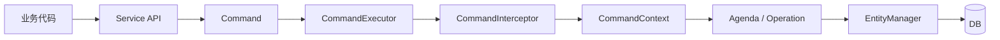

这套设计的价值在于：

- 事务可以统一包在命令执行周期里
- 拦截器可以统一做日志、重试、Spring 事务接入
- 引擎内部逻辑可以按“操作”不断排程，而不是每个 API 自己硬写整条执行链

#### 5.7.2 Execution：不是“流程实例别名”，而是执行树节点

很多初学者会把 `Execution` 理解成“流程实例对象”。这不够准确。

更准确的理解是：

> `ProcessInstance` 更像根实例；`Execution` 是流程图运行过程中的执行节点，它们组成一棵执行树。

这棵树为什么必要？

- 因为流程可能有并行网关
- 可能有子流程
- 可能有多实例任务
- 可能有不同的作用域变量

于是引擎需要一套结构来表达：

- 哪个 execution 是根
- 哪个 execution 是子分支
- 哪个是 scope
- 当前 token 停在哪个 activity 上

所以在排查并行流程问题时，`ACT_RU_EXECUTION` 往往比 `ACT_RU_TASK` 更接近真相。

#### 5.7.3 Task：任务不是节点定义，而是运行时生成的工作项

`UserTask` 是 BPMN 模型里的一个节点定义。

而 `Task` 是流程运行到这个节点后，实际生成出来的一条运行时任务记录。

两者的区别必须分清：

| 概念 | 所在层 | 含义 |
|------|--------|------|
| `UserTask` | 流程定义层 | BPMN 图上的“主管审批”这个节点 |
| `Task` / `TaskEntity` | 运行时层 | 某个实例当前生成的一条具体待办 |

这也是为什么：

- 同一个 `UserTask` 节点可以在不同实例里生成很多条 `Task`
- 多实例节点甚至可以同时生成多条运行时任务
- 节点还在定义里，但运行时任务可能已经完成并进入历史表

#### 5.7.4 Job：异步和定时器的真正载体

很多人看到 `flowable:async="true"`，以为引擎只是“换了个线程”。实际上真正被创建的是 `Job`。

可以把 `Job` 理解成：

- 一条等待引擎后台执行的工作记录
- 它有重试次数、锁信息、异常信息
- 它由异步执行器轮询、加锁、执行、失败重试

常见 job 类型可以粗分为：

| 类型 | 作用 | 常见表 |
|------|------|--------|
| Async Job | 异步 continuation | `ACT_RU_JOB` |
| Timer Job | 定时器触发 | `ACT_RU_TIMER_JOB` |
| Suspended Job | 暂停态作业 | `ACT_RU_SUSPENDED_JOB` |
| Dead Letter Job | 重试耗尽 | `ACT_RU_DEADLETTER_JOB` |

这也是为什么排查“异步节点没执行”时，正确问题通常不是“代码怎么没进到 delegate”，而是：

- Job 有没有创建出来
- Job 有没有被 executor 获取到
- 是否被锁住
- 是否因为异常进入死信表

#### 5.7.5 一次用户完成任务，底层会经历什么

以 `taskService.complete(taskId, variables)` 为例，可以把内部主线概括成：

1. 生成完成任务的命令
2. 加载当前 `TaskEntity`
3. 校验任务状态和权限
4. 写入变量
5. 删除运行时任务或标记任务结束
6. 驱动关联 `Execution` 继续往后推进
7. 如果遇到同步自动节点，则继续执行
8. 如果遇到异步边界，则创建 `Job`
9. 最终统一提交事务并写历史

这也是为什么一个看似简单的“完成任务”动作，实际可能同时影响：

- `ACT_RU_TASK`
- `ACT_RU_EXECUTION`
- `ACT_RU_VARIABLE`
- `ACT_RU_JOB`
- `ACT_HI_TASKINST`
- `ACT_HI_ACTINST`

如果把这条链想清楚，很多线上现象就不再神秘了。

### 5.8 为什么流程引擎能“自动流转”节点

很多人第一次接触工作流引擎时，最容易产生的疑问就是：

- 为什么它好像自己知道下一个节点是谁
- 为什么一个节点执行完，后面的节点会自动被激活
- 为什么并行分支能自动拆开，汇聚节点又能自动等待

如果把这个问题压缩成一句话，答案其实很朴素：

> 工作流引擎并不是在“猜”后面怎么走，而是在执行一张预先定义好的有向图，并持续维护这张图在某个实例中的运行状态。

也就是说，自动流转的本质不是魔法，而是下面四件事叠在一起：

1. 有静态定义，知道节点和连线关系
2. 有运行实例，知道这一次执行走到了哪里
3. 有调度器，知道节点完成后如何激活后继节点
4. 有持久化，保证系统重启后还能继续推进

#### 5.8.1 先把“自动流转”翻译成更底层的话

把一条流程定义看成图之后，就可以得到一个非常清晰的解释：

- 节点是工作单元，例如 `A=刷新用户信息`
- 边是依赖关系，例如 `A 完成后才能执行 B`
- token 是当前执行位置
- 调度器负责在节点完成后，把 token 推到下一个合法位置

顺序链路 `A -> B -> C` 的自动流转，本质上就是：

1. 创建一个流程实例
2. 找到开始节点 `A`
3. 执行 `A`
4. `A` 成功后，读取它的后继节点，发现是 `B`
5. 把 `B` 标记为可执行
6. 执行 `B`
7. `B` 完成后，同样激活 `C`


并行链路 `A -> (B, C)` 的自动流转，本质上就是：

1. `A` 执行完成
2. 调度器读取后继节点，发现有两个：`B`、`C`
3. 生成两个独立执行分支
4. 分别把 `B`、`C` 放入可执行队列
5. 后台线程池或任务调度器并发执行它们

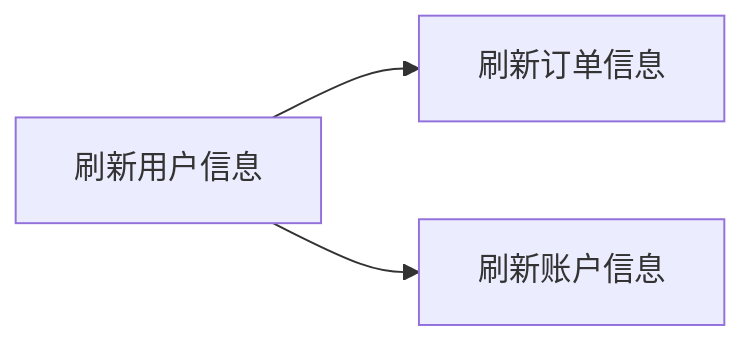

#### 5.8.2 自动流转真正依赖的不是“节点自己调下一个节点”

这里有一个很关键的认知误区要先拆掉。

很多人下意识会把“自动流转”想成下面这种写法：

```java
refreshUser();
refreshOrder();
refreshAccount();
```

或者：

```java
nodeA.execute();
nodeB.execute();
nodeC.execute();
```

这其实不是流程引擎的思路，而更像普通业务代码顺序调用。

流程引擎真正借鉴价值最大的地方在于：

> 当前节点只负责完成自己的工作，不负责决定后面怎么走；后继节点的激活由调度器统一处理。

这个拆分非常重要，因为一旦让节点自己直接调用下游，会立刻带来几个问题：

- 流程定义和业务执行强耦合
- 无法让前端界面动态编排节点
- 并行拆分和汇聚会变得非常别扭
- 节点失败、重试、恢复都很难统一处理

#### 5.8.3 顺序、并行、汇聚，本质分别是什么

为了把自动流转讲透，可以把它拆成三种最基本的运行语义。

| 语义 | 图上的表现 | 运行时本质 |
|------|------------|------------|
| 顺序 | `A -> B -> C` | 一个节点完成后，激活唯一后继节点 |
| 并行拆分 | `A -> B` 且 `A -> C` | 一个节点完成后，激活多个后继节点 |
| 并行汇聚 | `B -> D` 且 `C -> D` | 等多个前驱都完成后，再激活 `D` |

其中最容易低估的是“汇聚”。

例如下面这条链：

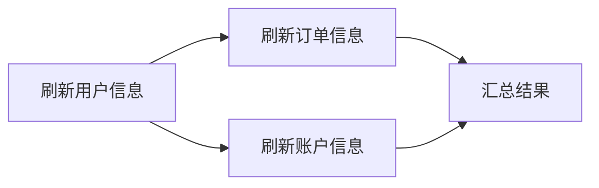

这里 `D` 不是看到 `B` 完成就立刻执行，而是必须同时满足：

- `B` 已完成
- `C` 已完成

这意味着引擎运行时至少要维护一类信息：

- 当前节点有哪些前驱
- 还有多少前驱没完成

这也是为什么很多“看起来只是简单并行”的业务，一旦真要稳定落地，就不能只靠几行线程池提交代码解决。

### 5.9 如果自己做一套简化的数据刷新流程，可以从工作流引擎借鉴什么

这类业务场景非常典型，而且已经明显不是“责任链硬编码”问题了。

更贴近真实语境地说，这类系统通常具备下面几个条件：

- 后端是 `Spring Boot`
- 有一批专门的数据执行类，负责刷新用户、订单、账户等数据
- 节点执行可能是本地 Spring Bean、URL 调用、MQ 投递或消费协同
- 前端会提供给开发或运营一套可视化界面，动态配置节点关系
- 流程拓扑不是写死在代码里的，而是由模型配置决定

在这种前提下，真正值得借鉴的已经不是“某个 API 怎么调”，而是工作流引擎背后的分层思想。

#### 5.9.1 更接近“可运行的流程定义 + 运行时调度器”，而不是责任链

责任链更像这样：

- 节点顺序在代码里提前写死
- 上一个 handler 直接调用下一个 handler
- 更适合固定链路和简单拦截场景

而这一类系统更像的是：

- 链路要由界面动态配置
- 节点既可能顺序，也可能并行
- 未来可能还有条件分支、重试、暂停、人工重跑
- 希望运营和开发都能看见全链路状态

所以这类系统更接近：

> 一套轻量流程编排运行时，而不是传统责任链。

#### 5.9.2 DAG 到底够不够

单独把系统描述成“`DAG` 调度器”通常是不够的，因为只有依赖拓扑，还没有完整运行链路。

更精确地说：

> 如果只讨论节点依赖关系，那么流程拓扑本质上就是一个 `DAG`；但工程落地时，光有 `DAG` 远远不够，真正需要的是 `DAG + Runtime`。

也就是说，`DAG` 只解决了一部分问题：

- 谁依赖谁
- 哪些节点可以并行
- 哪些节点必须等待前驱完成

但它并不会自动解决这些工程问题：

- 流程定义如何保存和版本化
- 前端如何动态配置节点与连线
- 某次执行的实例状态如何持久化
- 节点失败后如何重试
- 并行节点如何汇聚
- 整个链路如何可观测、可追踪、可回放

所以更完整的表达应该是：

| 层次 | 解决的问题 |
|------|------------|
| `DAG` | 描述节点依赖关系 |
| 调度器 | 根据依赖关系激活可执行节点 |
| 运行时实例 | 记录某次执行的当前状态 |
| 执行器注册中心 | 把节点类型映射到具体执行类 |
| 持久化层 | 让流程可恢复、可查询 |
| 运维与前端 | 让开发和运营能看见全链路 |

#### 5.9.3 更贴近动态数据流程编排的系统分层

如果按这类场景来抽象，一套简化版系统通常可以拆成下面几层：

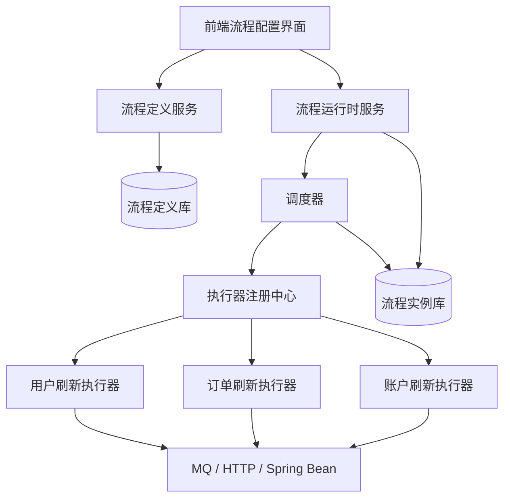

这套结构里，每一层的职责应该尽量单一：

- `流程定义服务`：保存节点、连线、版本、发布状态
- `流程运行时服务`：启动一次流程实例、暂停、重试、终止
- `调度器`：计算当前哪些节点可以执行
- `执行器注册中心`：根据节点类型找到具体执行实现
- `执行器`：真正做“刷新用户/订单/账户”的业务动作

#### 5.9.4 节点模型应该怎么设计

在这种系统里，最重要的不是一开始就设计出多复杂的 BPMN，而是先把核心对象定义稳定下来。

一个最小可用的节点定义，通常至少要包含：

```java
public class FlowNodeDef {

    private String nodeId;
    private String nodeName;
    private String executorType;
    private String executorRef;
    private Map<String, Object> config;
    private List<String> nextNodeIds;
}
```

这里可以这样理解：

- `nodeId`：节点唯一标识
- `executorType`：例如 `spring-bean`、`http`、`mq`
- `executorRef`：真正执行对象的引用，比如 Bean 名称、URL 名称、消息主题
- `config`：节点参数
- `nextNodeIds`：后继节点

运行时实例则至少需要：

```java
public class FlowInstance {

    private String instanceId;
    private String flowCode;
    private String version;
    private String status;
    private Map<String, NodeInstance> nodeInstances;
}

public class NodeInstance {

    private String nodeId;
    private String status;
    private int remainingPredecessors;
    private Integer retryCount;
    private String errorMessage;
}
```

这一层是整个系统能不能稳定运行的关键，因为前端配置的是定义，真正执行的是实例。

#### 5.9.5 执行器不应该感知流程拓扑

对自研系统来说，最值得从工作流引擎借鉴的一条纪律就是：

> 执行器只负责把当前节点干完，不负责直接调用下一个节点。

比如：

```java
public interface DataFlowExecutor {

    void execute(FlowContext context, FlowNodeDef nodeDef) throws Exception;
}
```

用户信息、订单信息、账户信息都只是不同执行器：

```java
@Component("userRefreshExecutor")
public class UserRefreshExecutor implements DataFlowExecutor {

    @Override
    public void execute(FlowContext context, FlowNodeDef nodeDef) {
        // 刷新用户信息
    }
}
```

```java
@Component("orderRefreshExecutor")
public class OrderRefreshExecutor implements DataFlowExecutor {

    @Override
    public void execute(FlowContext context, FlowNodeDef nodeDef) {
        // 刷新订单信息
    }
}
```

节点执行成功以后，不由 `UserRefreshExecutor` 去直接调用 `OrderRefreshExecutor`，而是由调度器统一决定：

- 下一个是谁
- 是一个还是多个
- 是立即执行还是放入异步队列

#### 5.9.6 顺序场景 `A -> B -> C` 怎么实现

先看最简单的链路：

- `A = 刷新用户信息`
- `B = 刷新订单信息`
- `C = 刷新账户信息`

只要流程定义里配成：

```text
A -> B -> C
```

那么调度器的最小主线就是：

1. 找到起始节点 `A`
2. 执行 `A`
3. `A` 成功后，把 `B` 标记为 `READY`
4. 执行 `B`
5. `B` 成功后，把 `C` 标记为 `READY`

这类逻辑真正的核心，不是“顺序调用”，而是“状态推进”：

```java
public void onNodeSuccess(FlowInstance instance, String nodeId) {
    List<String> nextNodes = definitionService.findNextNodes(instance.getFlowCode(), nodeId);
    for (String nextNodeId : nextNodes) {
        NodeInstance nextNode = instance.findNode(nextNodeId);
        nextNode.setStatus("READY");
        scheduler.enqueue(instance.getInstanceId(), nextNodeId);
    }
}
```

#### 5.9.7 并行场景 `A -> (B, C)` 怎么实现

如果界面上配置成：

```text
A -> B
A -> C
```

那么 `A` 执行完成后，不是进入一个“下一个节点”，而是会激活两个分支：

- `B` 变为 `READY`
- `C` 变为 `READY`

然后交给线程池、任务队列或后台调度器并发执行。

```java
public void onNodeSuccess(FlowInstance instance, String nodeId) {
    List<String> nextNodes = definitionService.findNextNodes(instance.getFlowCode(), nodeId);
    for (String nextNodeId : nextNodes) {
        NodeInstance nextNode = instance.findNode(nextNodeId);
        nextNode.setStatus("READY");
        scheduler.enqueue(instance.getInstanceId(), nextNodeId);
    }
}
```

上面这个方法和顺序场景看起来几乎一样，这恰恰说明了一个关键点：

> 并行不是特殊 if/else，而是一个节点的后继从 1 个变成多个；调度器只负责把所有满足条件的节点送入执行队列。

#### 5.9.8 如果未来要支持汇聚，就必须维护前驱计数

即使当前只看到顺序和并行，系统只要继续演进，通常迟早会遇到“并行后再汇总”的需求。

例如：

- `A` 刷新用户信息
- `A` 完成后并行刷新 `B=订单` 和 `C=账户`
- `B`、`C` 都完成后，再做 `D=汇总或校验`

这时最朴素也最有效的做法，就是给每个运行时节点维护：

- 前驱总数
- 剩余未完成前驱数

伪代码可以写成：

```java
public void onNodeSuccess(FlowInstance instance, String nodeId) {
    List<String> nextNodes = definitionService.findNextNodes(instance.getFlowCode(), nodeId);
    for (String nextNodeId : nextNodes) {
        NodeInstance nextNode = instance.findNode(nextNodeId);
        nextNode.setRemainingPredecessors(nextNode.getRemainingPredecessors() - 1);
        if (nextNode.getRemainingPredecessors() == 0) {
            nextNode.setStatus("READY");
            scheduler.enqueue(instance.getInstanceId(), nextNodeId);
        }
    }
}
```

这一层其实已经非常接近工作流引擎并行网关和汇聚网关的核心思想了。

#### 5.9.9 对真实项目最有启发的，不是 BPMN 语法，而是这些工程纪律

如果把学习收束成真正对自研有帮助的内容，更值得优先吸收的是下面这些思想：

| 思想 | 对自研系统的直接价值 |
|------|----------------------|
| 定义与运行分离 | 前端动态编排不再和后端代码硬耦合 |
| 节点执行与流程调度分离 | 节点实现更纯粹，调度行为更统一 |
| 状态驱动而不是方法串调 | 支持恢复、重试、暂停、人工介入 |
| 并行与汇聚显式建模 | 不会把复杂依赖关系写乱在业务代码里 |
| 持久化实例状态 | 进程重启后仍能继续运行 |
| 幂等和重试内建 | 节点失败不会把整个系统弄得不可恢复 |
| 可观测性优先 | 开发和运营能看见整条链路在做什么 |

### 5.10 面向前后端分离项目，一套更合理的全链路最小方案

如果把这类真实场景收敛成一个“够用但不重”的实现目标，可以按下面的方式定义：

#### 5.10.1 前端负责定义，后端负责运行

前端界面负责：

- 配置节点
- 配置连线
- 配置节点执行器类型
- 配置节点参数
- 发布一个流程版本

后端负责：

- 校验流程是否合法
- 把流程定义保存为版本化模型
- 启动某个流程实例
- 调度节点执行
- 记录每个节点的运行状态

也就是说，前端管“图长什么样”，后端管“这张图怎么跑起来”。

#### 5.10.2 后端最少需要哪些表或对象

即使不照搬 Flowable，也建议至少有下面几类持久化对象：

| 对象 | 用途 |
|------|------|
| 流程定义表 | 保存节点、边、版本、发布状态 |
| 流程实例表 | 保存某次运行的整体状态 |
| 节点实例表 | 保存每个节点的运行状态、错误、重试次数 |
| 执行日志表 | 保存每一步执行记录 |
| 任务队列表 | 保存待执行节点、延迟重试节点 |

如果没有这几层，系统很快就会退化成：

- 只能跑，不能查
- 只能成功，失败后很难恢复
- 只能开发自己看懂，运营无法观察

#### 5.10.3 节点触发方式应该抽象成统一协议

考虑到节点可能是：

- Spring Bean 执行
- URL 调用
- MQ 协同

所以后端不应该把这些方式写死在调度器里，而应该统一抽象成执行协议。

例如：

```java
public interface NodeExecutorAdapter {

    boolean supports(String executorType);

    void execute(FlowContext context, FlowNodeDef nodeDef) throws Exception;
}
```

然后分别实现：

- `SpringBeanExecutorAdapter`
- `HttpExecutorAdapter`
- `MqExecutorAdapter`

这样界面上动态配出来的节点，只要带上：

- `executorType`
- `executorRef`
- `config`

运行时就能按统一方式分发。

#### 5.10.4 什么时候该考虑直接用工作流引擎，什么时候自己做更合适

如果需求长期停留在：

- 数据刷新
- 顺序 / 并行
- 基本重试
- 基本可视化

那么自研一套轻量运行时是合理的。

但如果逐步出现下面这些需求：

- 条件分支越来越多
- 定时任务、事件回调越来越多
- 需要人工暂停、恢复、跳过、回滚
- 需要流程版本迁移
- 需要更强的历史审计和统一待办

那这套系统很容易继续长成一个“小型工作流引擎”。

这也是学习 Flowable 最有价值的地方：

> 它不只是说明“审批流怎么跑”，更重要的是，它把“图定义 + 运行时状态 + 调度器 + 持久化 + 重试恢复”这整套通用运行框架拆解出来了。

---

## 六、真正影响线上行为的三个机制

平时跑 demo 看不出来，但线上能否稳定，通常取决于下面三件事。

### 6.1 事务边界：为什么一个节点失败会影响前面的节点

Flowable 默认是同步推进的。

也就是说，一次 API 调用触发后，流程会一直往下执行，直到下一个等待点。在这个推进过程中，如果中间的自动任务、表达式、监听器、Service Task 抛了异常，那么当前事务会回滚。

这意味着：

- 前面刚刚完成的用户任务提交，也可能一起回滚
- 业务侧会感觉“明明点了提交，却又回到原状态”
- 外部系统调用如果没有幂等控制，重复执行风险会放大

这个机制本身并不是问题，它恰恰是在保证数据一致性。

真正的问题是：

> 如果团队不知道 Flowable 默认会在“同一事务里一路跑到等待点”，就很容易在服务任务、回调、消息发送、库表更新这类地方踩坑。

### 6.2 异步执行：async 的本质不是并行，而是切事务

这点非常容易误解。

很多人一看到异步标记，就以为“Flowable 会并行执行后面的任务”。这不准确。

更准确的理解是：

> `async` 首先是事务边界控制手段，其次才是后台作业执行机制。

当某个节点被标记为异步时，Flowable 的处理大致变成：

1. 先提交当前事务
2. 生成一条作业记录
3. 由 `Async Executor` 在新的线程和新事务中继续执行

这带来的收益非常明显：

- 用户提交动作可以更快返回
- 前面已经完成的工作先落库，不会因为后续失败全部回滚
- 引擎可以自动重试失败作业
- 长事务和锁竞争会显著减少

对应地，也要接受几个事实：

- 异步任务执行顺序不再等同于调用线程里的直觉顺序
- 作业代码必须幂等
- 失败作业会进入重试，重试用尽后进入死信

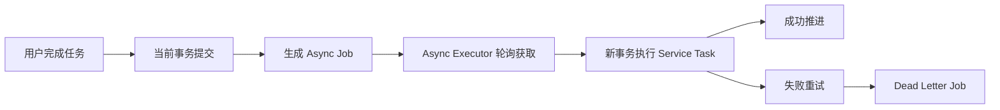

### 6.3 历史与迁移：流程系统为什么比普通 CRUD 更需要演进策略

业务表改结构已经够麻烦了，流程系统还多了一层“运行中的流程定义版本”。

Flowable 的做法是：

- 新定义部署后生成新版本
- 老实例默认继续跑老版本
- 如有需要，可以显式执行实例迁移

这个机制的价值很大，但同时也要求开发团队建立一些纪律：

- 流程 key 尽量稳定
- 活动节点 id 不要随手改
- 变量结构升级要有兼容策略
- 流程修改前，要先看在途实例停留在哪些等待点

对长流程系统而言，这一层通常不是“可选项”，而是必做项。

---

## 七、Flowable 的能力边界：BPMN 之外还有什么

如果只把 Flowable 用成审批引擎，其实只用了它能力的一部分。

### 7.1 BPMN：适合有明确步骤的流程编排

适合：

- 开始事件、网关、用户任务、服务任务、结束事件
- 有清晰顺序、分支和等待点的业务流程

例如报销审批、订单履约、资料审核。

### 7.2 CMMN：适合更动态的案例管理

有些场景并不是严格的固定链路，而是“围绕一个案例，根据条件逐步激活任务”，这更接近 `CMMN`。

例如：

- 理赔案件处理
- 投诉工单调查
- 风控核查

这类场景里，流程不是一条严格固定的线，而更像“一个可动态展开的任务空间”。这正是 Flowable 相比只强调 BPMN 的引擎更有辨识度的地方。

### 7.3 DMN：把决策从流程里拆出去

流程负责“先做什么、后做什么”，决策负责“在这里怎么判断”。

例如：

- 报销金额是否需要财务复核
- 订单是否触发高风险审查
- 授信评级落在哪个区间

把这些规则写进 `DMN`，比直接写死在网关表达式里更容易维护。

### 7.4 Event Registry：把事件接进流程

Flowable 的 Event Registry 支持从 `JMS`、`Kafka`、`RabbitMQ` 和 HTTP 等来源接收事件，并把事件映射到流程或案例。

这让它可以自然覆盖这类模式：

- 外部事件到来，启动一个流程实例
- 某个流程实例等待某类业务消息后继续推进
- 出站事件由流程节点发给外部系统

### 7.5 四种能力怎么分工

| 能力 | 更适合解决的问题 | 不宜滥用的地方 |
|------|------------------|----------------|
| `BPMN` | 固定流程与状态流转 | 把所有业务判断都塞进网关表达式 |
| `CMMN` | 动态案例与灵活任务编排 | 用来替代所有标准审批流 |
| `DMN` | 规则外置和规则表管理 | 承担完整流程控制 |
| `Event Registry` | 事件接入与相关性匹配 | 替代消息中间件本身 |

---

## 八、和其它流程引擎怎么比较

选型时最常见的几个比较对象，一般是 `Camunda`、`Activiti`、`jBPM`。

### 8.1 先给一张总表

| 维度 | `Flowable` | `Camunda 8` | `Activiti` | `jBPM` |
|------|------------|-------------|------------|---------|
| 核心架构 | Java 引擎 + 关系库，可嵌入也可独立部署 | `Zeebe` 分布式编排引擎，远程客户端交互 | 传统 Java BPM 引擎 | Java BPM 套件，与 Drools 生态联系紧 |
| 接入方式 | Java API、Spring Boot、REST | gRPC/REST 客户端、Job Worker | Java API、传统集成 | Java API、REST、套件化工具 |
| 模型覆盖 | `BPMN/CMMN/DMN/Event Registry` | `BPMN/DMN`，更偏分布式编排 | 以 BPMN 为主 | BPMN、规则、案例等较丰富 |
| 部署倾向 | 适合嵌入式与工作流中心化部署 | 更适合独立编排平台 | 偏传统嵌入式 BPM | 偏平台化与规则结合 |
| Java/Spring 亲和度 | 很高 | 高，但引擎通常是远程系统 | 中高 | 高 |
| 适合场景 | 企业审批流、长流程、案例与事件混合场景 | 高吞吐分布式编排、云原生工作流 | 老系统延续或轻量场景 | 规则与流程深度结合场景 |

### 8.2 Flowable vs Camunda 8

这是现在最值得细拆的一组。

#### Flowable 的特点

- 可以直接嵌入 `Spring Boot`
- 也可以独立部署成工作流中心
- 对 Java 团队非常自然
- `CMMN` 和事件能力更完整
- 对典型企业审批、案例、流程平台类场景很顺手

#### Camunda 8 的特点

- 核心是 `Zeebe`，更偏分布式工作流编排
- 引擎通常被视为远程系统，应用通过客户端和 worker 与其交互
- 在大规模流程编排、高吞吐、云原生部署语境里很有优势

如果用一句更工程化的话概括：

> `Flowable` 更像“可以嵌进 Java 业务体系，也可以抽成中心服务的流程内核”；`Camunda 8` 更像“以独立编排平台为中心、由各业务 worker 订阅执行任务的远程工作流系统”。

### 8.3 Flowable vs Activiti

两者有共同祖先，因此学习曲线相近。

但今天如果是新项目，一般更关心的是：

- 社区活跃度
- Spring Boot 友好度
- 多模型能力
- 后续持续演进

在这些维度上，Flowable 通常会更有吸引力。

### 8.4 Flowable vs jBPM

`jBPM` 的特点在于它和 `Drools` 等规则生态结合更紧，更像一个完整 BPM 套件。

如果团队已经深度使用 `Drools/KIE`，那 jBPM 会更自然。

但如果团队核心诉求是：

- Spring Boot 项目快速接入
- 以 BPMN 审批和流程中心为主
- Java 团队自己掌控扩展和部署

那么 Flowable 往往更容易成为低摩擦选项。

### 8.5 什么时候优先考虑 Flowable

下面这些条件同时出现时，Flowable 往往会很合适：

- 主要技术栈是 Java / Spring Boot
- 需要把流程引擎嵌进现有后端体系
- 既有审批流，也可能逐步扩到案例、规则、事件
- 更重视企业内部流程平台化，而不是纯云原生超大规模编排

---

## 九、部署模式怎么选：嵌入式、独立工作流中心、官方 REST 应用

很多人问“Flowable 是嵌入式还是独立部署”，其实这不是二选一，而是三种常见形态。

| 部署形态 | 做法 | 优点 | 风险或代价 | 更适合的场景 |
|------|------|------|------------|--------------|
| 业务内嵌 | 每个业务服务直接引入 Flowable starter | 开发快，调用最直接 | 流程能力分散，多服务重复维护 | 单体或单个领域服务 |
| 独立工作流中心 | 单独一个 Spring Boot 服务嵌入 Flowable | 统一建模、统一运维、统一门面 | 需要设计跨服务接口与权限 | 多系统复用流程能力 |
| 官方 REST 应用 | 使用 `flowable-rest.war` 或 REST 应用 | 开箱即用，快速验证能力 | 接口更底层，业务封装仍需补齐 | PoC、平台接入、标准 REST 化场景 |

这里最容易踩的误区是：

> “独立部署”不等于“业务系统直接调用引擎原生 REST API”。

在真实项目里，更稳的做法往往是：

- 用 Flowable 作为工作流内核
- 独立部署成一个工作流中心服务
- 对外暴露符合本公司业务约束的门面接口

这样做的好处是：

- 流程定义、部署、权限、变量格式都能统一
- 业务系统不需要理解引擎底层细节
- 后续从内嵌模式切成独立模式，或者引入统一审批中心时，改造成本更可控

---

## 十、Spring Boot 接入独立部署实战案例

这一部分不写“只有一个 main 方法加个 BPMN 文件”的最小 demo，而是按真实工程写一个可落地的方案。

### 10.1 业务目标

假设有一个报销系统，流程如下：

1. 员工提交报销单
2. 直属主管审批
3. 如果金额超过 `5000`，进入财务复核
4. 审批通过后，异步归档报销单并回写业务状态
5. 整个过程对业务系统可追踪、可查询、可审计

这里采用的部署方式是：

- `workflow-center`：独立部署的 Flowable 工作流中心
- `expense-service`：报销业务系统

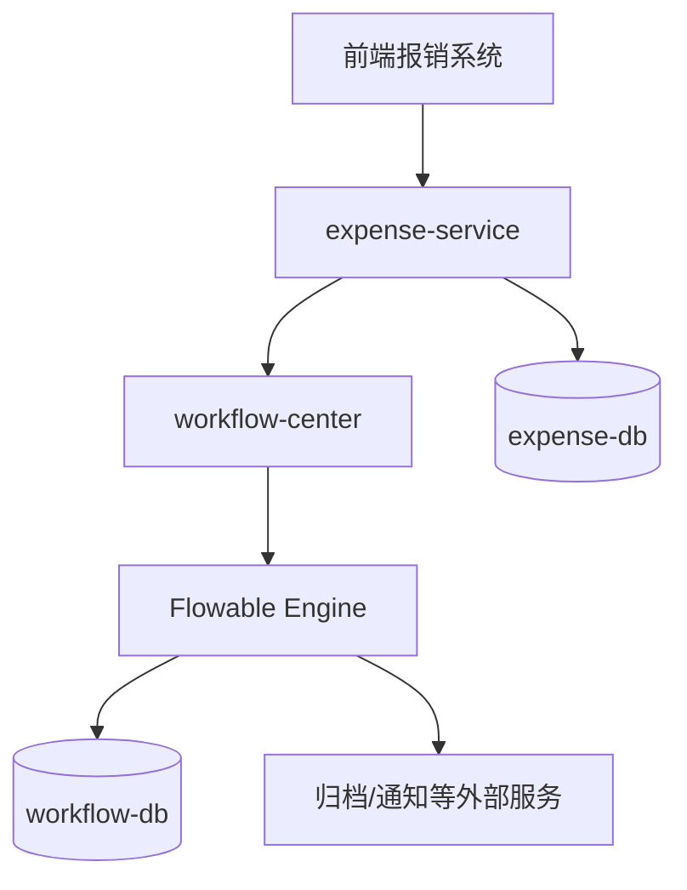

这套设计里有一个原则非常重要：

> 业务系统只关心自己的单据、状态和业务约束；流程中心只关心流程定义、任务推进和流程运行态。两边通过显式接口交互，而不是互相直连对方数据库。

### 10.2 BPMN 流程设计

报销审批流程可以先建成下面这样一条主链：

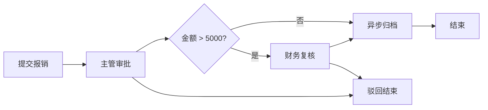

对应的 BPMN 文件建议放在：

```text
src/main/resources/processes/expense-approval.bpmn20.xml
```

Flowable 支持类路径下 `processes/` 目录的自动部署，这样工作流中心启动时就能自动装载流程定义。

一个简化版 BPMN 可以写成这样：

```xml
<?xml version="1.0" encoding="UTF-8"?>
<definitions xmlns="http://www.omg.org/spec/BPMN/20100524/MODEL"
             xmlns:xsi="http://www.w3.org/2001/XMLSchema-instance"
             xmlns:flowable="http://flowable.org/bpmn"
             targetNamespace="http://example.com/expense">

    <process id="expenseApproval" name="Expense Approval" isExecutable="true">
        <startEvent id="startEvent" />

        <sequenceFlow id="f1" sourceRef="startEvent" targetRef="managerApproveTask" />

        <userTask id="managerApproveTask"
                  name="主管审批"
                  flowable:candidateGroups="MANAGER" />

        <sequenceFlow id="f2" sourceRef="managerApproveTask" targetRef="approvedGateway" />

        <exclusiveGateway id="approvedGateway" />

        <sequenceFlow id="f3"
                      sourceRef="approvedGateway"
                      targetRef="amountGateway">
            <conditionExpression xsi:type="tFormalExpression"><![CDATA[${approved}]]></conditionExpression>
        </sequenceFlow>

        <endEvent id="rejectedEndEvent" name="已驳回" />
        <sequenceFlow id="f4"
                      sourceRef="approvedGateway"
                      targetRef="rejectedEndEvent">
            <conditionExpression xsi:type="tFormalExpression"><![CDATA[${!approved}]]></conditionExpression>
        </sequenceFlow>

        <exclusiveGateway id="amountGateway" />
        <sequenceFlow id="f5" sourceRef="amountGateway" targetRef="archiveTask">
            <conditionExpression xsi:type="tFormalExpression"><![CDATA[${amount <= 5000}]]></conditionExpression>
        </sequenceFlow>
        <sequenceFlow id="f6" sourceRef="amountGateway" targetRef="financeApproveTask">
            <conditionExpression xsi:type="tFormalExpression"><![CDATA[${amount > 5000}]]></conditionExpression>
        </sequenceFlow>

        <userTask id="financeApproveTask"
                  name="财务复核"
                  flowable:candidateGroups="FINANCE" />

        <sequenceFlow id="f7" sourceRef="financeApproveTask" targetRef="archiveTask" />

        <serviceTask id="archiveTask"
                     name="归档报销单"
                     flowable:delegateExpression="${archiveExpenseDelegate}"
                     flowable:async="true" />

        <endEvent id="approvedEndEvent" name="审批完成" />
        <sequenceFlow id="f8" sourceRef="archiveTask" targetRef="approvedEndEvent" />
    </process>
</definitions>
```

这里有两个设计点值得注意：

- `approved` 和 `amount` 这种流程变量只保留最必要的信息
- `archiveTask` 标记为异步，是为了把归档与回写动作放到独立事务里执行

### 10.3 工作流中心 `workflow-center`

#### 10.3.1 依赖配置

如果从最小可用方案直接上手，官方文档里最简单的是 `flowable-spring-boot-starter`。如果只需要 BPMN 引擎，也可以在实际项目里进一步缩小到单引擎 starter。

这里先用通用 starter：

```xml
<dependency>
    <groupId>org.flowable</groupId>
    <artifactId>flowable-spring-boot-starter</artifactId>
    <version>${flowable.version}</version>
</dependency>
```

#### 10.3.2 应用配置

```yaml
server:
  port: 8088

spring:
  datasource:
    url: jdbc:mysql://127.0.0.1:3306/workflow_center?useUnicode=true&characterEncoding=UTF-8&serverTimezone=Asia/Shanghai
    username: root
    password: 123456

flowable:
  database-schema-update: true

logging:
  level:
    org.flowable: info
```

如果流程定义文件位于 `processes/` 目录，工作流中心启动时就可以自动部署。

#### 10.3.3 自动部署与“重复创建流程定义”的坑

这一块正好对应很多人从 `Activiti` 迁移过来最关心的问题。

可以先给一个结论：

> `Flowable` 不是“服务一重启就必然重复创建流程定义”，它对 Spring 自动部署场景做了重复过滤；但如果自动部署的分组方式、部署策略或程序化部署方式不对，依然可能出现“看起来像重复部署”的新版本膨胀。

可以把这件事拆成三层理解。

第一层，自动部署本来就是启动时发生的。

- `Spring Boot` 集成下会扫描类路径资源
- 默认会关注 `processes/` 目录下的 `.bpmn` / `.bpmn20.xml`
- 如果没有命中资源，日志里通常会看到 `No deployment resources were found for autodeployment`

第二层，Flowable 对“未变化资源”默认有重复过滤。

- Spring 集成文档明确说明，自动部署会对重复资源做过滤
- 只有资源实际发生变化时，才会创建新的 deployment / definition version

第三层，真正容易踩坑的是“部署粒度”。

默认情况下，匹配到的一组资源会被当成一个 deployment 处理，这意味着：

- 如果把很多 BPMN 一起打进同一组自动部署资源
- 其中只有一个文件改了
- 整个 deployment 仍可能被视为新的部署

结果就是：

- 虽然不是“每次重启都重复”
- 但会出现“只改了一个流程，却把这一组流程都升了新版本”的现象

这和很多团队在 `Activiti` 上踩到的坑非常相似，只是 Flowable 在官方机制上把重复过滤讲得更清楚，也给了更明确的部署粒度控制。

可以用一张表快速判断：

| 场景 | 会不会新建版本 | 原因 |
|------|----------------|------|
| 纯重启，资源完全未变 | 通常不会 | 自动部署有 duplicate filtering |
| 一组资源中改了一个 BPMN | 可能这一组都升版本 | 默认按 deployment 分组做重复过滤 |
| 手工程序化部署且没开重复过滤 | 会 | 每次都是新的 deploy 请求 |
| 同 key 流程故意重新发布 | 会 | 引擎按版本管理定义 |

如果希望尽量减少“一个文件变更导致整组流程一起升版本”，通常有两种做法：

1. 控制资源分组，让一个 deployment 只承载一个或一小组强相关流程
2. 在 Spring 集成里把 `deploymentMode` 调整为 `single-resource`

对应 Spring 集成的思路大致如下：

```xml
<bean id="processEngineConfiguration" class="org.flowable.spring.SpringProcessEngineConfiguration">
    <property name="deploymentResources" value="classpath*:/processes/*.bpmn20.xml" />
    <property name="deploymentMode" value="single-resource" />
</bean>
```

如果是程序化部署，更要显式打开重复过滤：

```java
repositoryService.createDeployment()
        .name("expense-processes")
        .addClasspathResource("processes/expense-approval.bpmn20.xml")
        .enableDuplicateFiltering()
        .deploy();
```

对于 `Spring Boot` / 平台化自动部署，还可以记住几个常用开关：

- `flowable.process-definition-location-prefix`：调整流程自动部署的类路径前缀
- `flowable.check-process-definitions=false`：关闭流程资源自动部署

如果项目进入生产环境，更稳妥的做法是把部署策略从“应用启动自动扫 classpath”逐步升级为“显式发布”：

- 测试环境可以继续用自动部署
- 生产环境更适合用发布流水线或部署接口控制版本进入
- 流程定义版本应该和发布记录、变更单、回滚策略绑定

#### 10.3.4 启动类

```java
@SpringBootApplication
public class WorkflowCenterApplication {

    public static void main(String[] args) {
        SpringApplication.run(WorkflowCenterApplication.class, args);
    }
}
```

#### 10.3.5 启动流程的应用服务

```java
@Service
public class ExpenseWorkflowApplicationService {

    private final RuntimeService runtimeService;

    public ExpenseWorkflowApplicationService(RuntimeService runtimeService) {
        this.runtimeService = runtimeService;
    }

    public String startExpenseApproval(StartExpenseProcessCommand command) {
        Map<String, Object> variables = new HashMap<>();
        variables.put("expenseId", command.expenseId());
        variables.put("applicantId", command.applicantId());
        variables.put("amount", command.amount());
        variables.put("approved", Boolean.FALSE);

        ProcessInstance processInstance = runtimeService.startProcessInstanceByKey(
                "expenseApproval",
                command.businessKey(),
                variables
        );

        return processInstance.getProcessInstanceId();
    }
}
```

这里有两个字段建议固定保留：

- `businessKey`：把流程实例和业务单据稳定关联起来
- `expenseId`：作为后续服务任务回写业务系统的关键标识

#### 10.3.6 完成任务的应用服务

```java
@Service
public class WorkflowTaskApplicationService {

    private final TaskService taskService;

    public WorkflowTaskApplicationService(TaskService taskService) {
        this.taskService = taskService;
    }

    public void complete(String taskId, boolean approved, String operatorId) {
        Map<String, Object> variables = new HashMap<>();
        variables.put("approved", approved);
        variables.put("operatorId", operatorId);
        taskService.complete(taskId, variables);
    }
}
```

#### 10.3.7 异步归档节点

```java
@Component("archiveExpenseDelegate")
public class ArchiveExpenseDelegate implements JavaDelegate {

    private final ExpenseRemoteClient expenseRemoteClient;

    public ArchiveExpenseDelegate(ExpenseRemoteClient expenseRemoteClient) {
        this.expenseRemoteClient = expenseRemoteClient;
    }

    @Override
    public void execute(DelegateExecution execution) {
        Long expenseId = ((Number) execution.getVariable("expenseId")).longValue();
        String processInstanceId = execution.getProcessInstanceId();

        expenseRemoteClient.markApproved(expenseId, processInstanceId);
    }
}
```

这里一定要注意幂等。

因为异步任务失败后会重试，如果 `markApproved(...)` 不是幂等接口，就可能出现重复归档、重复发通知、重复写审计等问题。

#### 10.3.8 节点能做很多事，那 Flowable 会不会像 PowerJob 一样主动请求业务接口

这一问题可以分场景展开。

先给一句结论：

> `Flowable` 可以主动调用业务能力，但它的主流方式并不是“像调度平台那样远程触发一个任意 HTTP 接口”这一种，而是 `JavaDelegate / Spring Bean`、`HTTP Task`、`External Worker`、事件接入这几种模型并存。

可以把常见方式分成四类：

| 方式 | Flowable 是否主动发请求 | 更像什么模式 | 适合什么场景 |
|------|------------------------|--------------|--------------|
| `JavaDelegate` / `delegateExpression` | 否，直接在引擎进程内执行代码 | 本地方法调用 | 业务代码和流程中心同 JVM 或同服务 |
| `HTTP Task` | 是 | 引擎主动调外部 HTTP 接口 | 简单 REST 集成 |
| `External Worker Task` | 否，外部 worker 轮询领取任务 | 拉模型 worker | 解耦执行、远程工作节点 |
| Event / MQ 集成 | 否，更多是事件驱动 | 事件编排 | 异步解耦和最终一致性 |

更具体地说：

第一种，`JavaDelegate` / Spring Bean，是开源项目里最常见的做法。

- 节点配置 `flowable:class`
- 或 `flowable:delegateExpression`
- 或表达式调用 Spring Bean 方法

这时 Flowable 干的不是“请求业务接口”，而是直接执行引擎所在进程中的 Java 代码。优点是简单、类型安全、好调试；缺点是和引擎部署位置耦合更紧。

第二种，`HTTP Task`，更接近“主动请求接口”这类模式。

- 引擎会按节点配置发 HTTP 请求
- 可以设置 URL、Method、Header、Body
- 可以根据响应码映射 BPMN Error 或异常

这种方式适合：

- 调一个相对稳定的 REST 服务
- 接口编排逻辑比较简单
- 希望模型里直观看到“这里调了外部系统”

但它也有明显边界：

- 接口重试和幂等必须业务方自己兜住
- 超时、网络抖动、鉴权刷新、复杂签名这些事情会让模型变脆
- 一旦外部接口协议频繁变化，流程模型会变得很不稳定

第三种，`External Worker Task`，更像 Camunda / Zeebe 那类 worker 模式。

- Flowable 并不是主动推任务给业务系统
- 而是外部 worker 主动轮询、领取、执行、回传完成结果

如果目标是“流程中心只负责编排，不直接持有业务实现”，这往往比 HTTP Task 更稳。

第四种，服务注册与事件方式，更适合平台化。

- 平台版 Flowable 有更完整的 `Service Registry`
- 服务定义和技术细节可以从 BPMN 模型中抽离
- 模型里引用的是服务能力，不是某个写死的 URL

如果只讨论开源项目里的通用工程建议，更稳妥的选择通常是：

- 同一服务内：优先 `JavaDelegate`
- 跨服务且接口简单：可以 `HTTP Task`
- 跨服务且需要强解耦、弹性扩缩、独立执行节点：优先 `External Worker` 或 MQ / 事件驱动

### 10.4 工作流中心对外暴露门面接口

不要把引擎 API 直接暴露给业务系统，而是包装成更稳定的业务门面。

```java
@RestController
@RequestMapping("/api/workflows/expenses")
public class ExpenseWorkflowController {

    private final ExpenseWorkflowApplicationService expenseWorkflowApplicationService;
    private final WorkflowTaskApplicationService workflowTaskApplicationService;

    public ExpenseWorkflowController(ExpenseWorkflowApplicationService expenseWorkflowApplicationService,
                                     WorkflowTaskApplicationService workflowTaskApplicationService) {
        this.expenseWorkflowApplicationService = expenseWorkflowApplicationService;
        this.workflowTaskApplicationService = workflowTaskApplicationService;
    }

    @PostMapping("/start")
    public Map<String, String> start(@RequestBody StartExpenseProcessCommand command) {
        String processInstanceId = expenseWorkflowApplicationService.startExpenseApproval(command);
        return Map.of("processInstanceId", processInstanceId);
    }

    @PostMapping("/tasks/{taskId}/complete")
    public void complete(@PathVariable String taskId, @RequestBody CompleteTaskCommand command) {
        workflowTaskApplicationService.complete(taskId, command.approved(), command.operatorId());
    }
}
```

这种封装方式有三个好处：

- 业务系统不依赖 Flowable 原生 API 细节
- 后续变量命名、流程 key、身份映射都能在中心服务统一治理
- 如果后续从自研门面切换到更完整的审批平台，业务侧改动更小

### 10.5 业务系统 `expense-service`

业务系统自己的职责，不是关心节点怎么流转，而是负责：

- 单据创建与业务校验
- 单据状态管理
- 和工作流中心建立关联

#### 10.5.1 创建报销单时发起流程

```java
@Service
public class ExpenseApplicationService {

    private final ExpenseRepository expenseRepository;
    private final WorkflowCenterClient workflowCenterClient;

    public ExpenseApplicationService(ExpenseRepository expenseRepository,
                                     WorkflowCenterClient workflowCenterClient) {
        this.expenseRepository = expenseRepository;
        this.workflowCenterClient = workflowCenterClient;
    }

    @Transactional
    public Long submit(SubmitExpenseCommand command) {
        Expense expense = Expense.create(command.applicantId(), command.amount(), command.reason());
        expense.markSubmitting();
        expenseRepository.save(expense);

        StartExpenseProcessRequest request = new StartExpenseProcessRequest(
                "EXPENSE-" + expense.getId(),
                expense.getId(),
                expense.getApplicantId(),
                expense.getAmount()
        );

        String processInstanceId = workflowCenterClient.startExpenseProcess(request);
        expense.bindProcessInstance(processInstanceId);
        expense.markInApproval();

        return expense.getId();
    }
}
```

这里有一个很重要的工程问题：

> 业务入库成功了，但调用工作流中心失败怎么办？

常见做法有三种：

1. 本地事务提交后同步调用，失败则补偿重试
2. 通过本地消息表 / outbox 异步投递“发起流程”事件
3. 直接把工作流中心和业务服务放在同一事务边界里，但这通常不现实

如果系统已经进入生产级别，第二种方案通常更稳。

#### 10.5.2 调用工作流中心的客户端

```java
@Component
public class WorkflowCenterClient {

    private final RestClient restClient;

    public WorkflowCenterClient(RestClient.Builder builder) {
        this.restClient = builder
                .baseUrl("http://workflow-center:8088")
                .build();
    }

    public String startExpenseProcess(StartExpenseProcessRequest request) {
        return restClient.post()
                .uri("/api/workflows/expenses/start")
                .body(request)
                .retrieve()
                .body(StartExpenseProcessResponse.class)
                .processInstanceId();
    }

    public void completeTask(String taskId, CompleteTaskRequest request) {
        restClient.post()
                .uri("/api/workflows/expenses/tasks/{taskId}/complete", taskId)
                .body(request)
                .retrieve()
                .toBodilessEntity();
    }
}
```

### 10.6 一次完整交互链路

把整个请求链路串起来，大致如下：

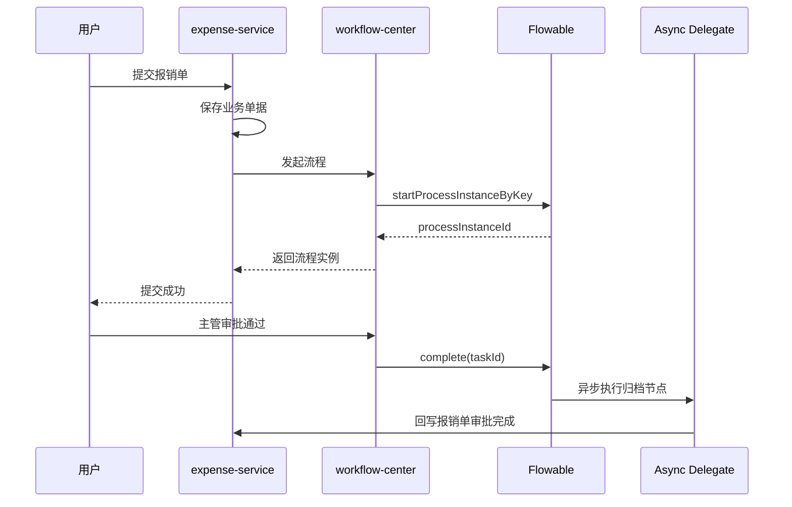

### 10.6.1 独立流程中心为什么天然会碰到分布式事务

只要把 Flowable 从业务服务里抽出来做成独立工作流中心，事务问题就不会消失，而是从“单机本地事务”变成“跨服务状态一致性”。

这个问题至少会出现在三条链路里：

| 触发点 | 左边系统 | 右边系统 | 典型风险 |
|--------|----------|----------|----------|
| 发起流程 | `expense-service` | `workflow-center` | 业务单据已创建，但流程没启动 |
| 完成任务 | `workflow-center` | 业务服务 | 流程推进了，但业务状态没回写 |
| 异步节点调用 | Flowable Async Executor | 外部服务 / MQ | 节点重试导致业务重复执行 |

本质原因很简单：

- Flowable 自己对“引擎库内”的数据一致性做得很好
- 但一旦跨到另一个服务和另一套数据库，本地事务边界就结束了

所以这里最重要的结论是：

> 独立部署工作流中心后，不要再幻想“一个 `@Transactional` 能把业务库和流程库一起提交”。绝大多数情况下，这个问题只能按最终一致性来设计。

### 10.6.2 最常见的四种处理方式

| 方案 | 一致性强度 | 实现复杂度 | 是否推荐 |
|------|------------|------------|----------|
| 业务保存后同步调用流程中心 | 弱一致 | 低 | 只适合简单场景 |
| 分布式事务框架统一两边提交 | 强一致表面上更强 | 高 | 通常不推荐作为默认方案 |
| Outbox / 本地消息表 + 异步启动流程 | 最终一致 | 中 | 生产场景最常见 |
| 流程事件驱动业务回写 + 幂等补偿 | 最终一致 | 中高 | 长流程场景更稳 |

#### 同步调用方案

它的优点是实现最直观，但问题也最明显：

- 业务库提交成功，调用流程中心超时
- 流程中心实际启动成功，但响应丢了
- 客户端重试导致重复启动流程

如果使用同步方式，至少要补三样东西：

- 幂等键，通常用 `businessKey`
- 可重试但不重复创建的发起接口
- 补偿任务或对账任务

#### 分布式事务框架方案

从理论上看，可以尝试 `Seata`、`JTA/XA` 这类框架把两边串成一个大事务。

但在流程中心场景里，这通常不是默认最优解，原因包括：

- 长流程天然跨时间，不可能始终靠一个全局事务兜住
- 远程服务、异步节点、人工审批根本不适合强事务语义
- 全局锁、性能、故障复杂度都会抬高

这类方案更适合短链路、强一致、同构系统，不适合作为整个工作流平台的普遍解法。

#### Outbox + 异步启动流程方案

这通常是最稳的工程折中。

业务服务本地事务里只做两件事：

1. 保存业务单据
2. 写一条“待发起流程”的 outbox 事件

然后由后台投递器异步把事件发给工作流中心。

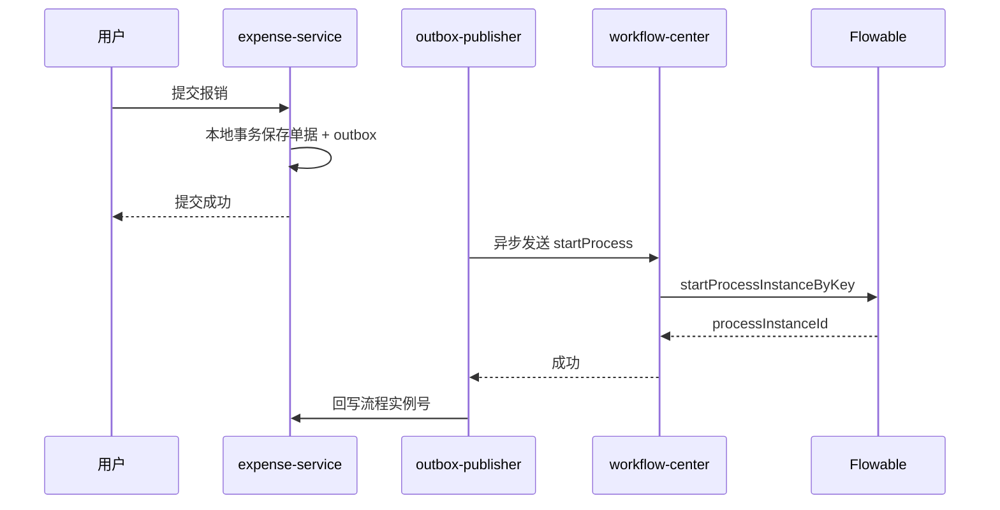

它的优点是：

- 业务入库一定成功
- 流程启动失败可以重试
- 网络抖动不会直接让用户请求失败

但前提是要接受：

- 流程启动不是严格实时同步完成
- 需要对账任务
- 需要幂等接口

#### 流程回写业务的最终一致性方案

流程中心在节点完成后，经常还要回写业务系统，例如：

- 报销单状态改为“审批完成”
- 发放额度
- 触发财务记账

这里最稳的做法通常不是“在同一个同步接口里一次性做完”，而是：

- 节点进入异步任务
- 调业务服务幂等接口，或发业务事件
- 失败可重试，重试耗尽进入死信
- 后台运维可人工补偿

### 10.6.3 这类系统应该怎样设计幂等和补偿

独立流程中心一旦落地，幂等和补偿就是基础设施，不是加分项。

更实用的建议是：

| 设计点 | 推荐做法 |
|--------|----------|
| 流程发起幂等 | 用 `businessKey` 作为业务唯一键，发起前先查是否已存在实例 |
| 任务完成幂等 | 对外门面接口加幂等号或操作流水号 |
| 回写幂等 | 业务服务按“目标状态 + 业务主键”做幂等更新 |
| 补偿恢复 | 建立死信任务、失败调用、对账结果的管理页面 |
| 对账任务 | 定时扫描“单据存在但流程不存在”“流程结束但业务未完成” |

在报销场景里，一个很实用的门面接口可以长这样：

```java
public interface WorkflowFacade {

    StartProcessResult startIfAbsent(StartProcessRequest request);

    void completeTask(String taskId, String operationId, CompleteTaskRequest request);

    void markBusinessDone(String businessKey, String processInstanceId, String operationId);
}
```

这里的关键不是接口名字，而是三个约束：

- `startIfAbsent` 明确表达“允许重试但不允许重复建实例”
- `operationId` 用于接口级幂等
- `businessKey` 永远是流程世界和业务世界的稳定锚点

### 10.7 为什么这种架构比“每个业务服务都嵌一个 Flowable”更稳

| 维度 | 每个业务服务内嵌 | 独立工作流中心 |
|------|------------------|----------------|
| 流程治理 | 分散 | 集中 |
| 运维与监控 | 多处维护 | 一处维护 |
| 流程复用 | 弱 | 强 |
| 身份与权限 | 容易各自实现 | 容易统一 |
| 变更影响面 | 多个服务 | 单点收敛 |

当然，独立工作流中心也不是没有代价：

- 需要定义跨服务接口
- 需要设计身份映射
- 需要考虑业务与流程一致性
- 需要考虑网络调用和重试策略

但当流程能力开始被多个业务线复用时，这些代价通常是值得的。

---

## 十一、这个案例里最容易踩的坑

这一部分比代码本身更重要。

### 11.1 不要把整个业务对象塞进流程变量

错误做法：

- 把完整 `ExpenseDTO`、附件列表、明细集合都塞进变量

更稳的做法：

- 变量只保留 `expenseId`、`amount`、`applicantId`、审批结果等关键字段
- 详细信息始终以业务库为准

否则很容易出现：

- 变量过大
- 历史表膨胀
- 模型迁移困难
- Java 序列化兼容问题

### 11.2 节点 id 不要随手改

流程图里显示名可以调整，但节点 `id` 一旦上线后频繁改动，会直接影响：

- 运行中实例迁移
- 任务查询逻辑
- 监听器和脚本引用
- 报表统计口径

### 11.3 业务回写必须幂等

只要用了异步执行器、重试、补偿、消息驱动，就必须接受“同一个动作可能被执行多次”的现实。

因此像下面这些操作都要幂等：

- 审批完成后改单据状态
- 发通知
- 推送 MQ
- 调外部归档系统

### 11.4 不要直接操作引擎表

尤其不要在业务代码里直接去改：

- `ACT_RU_TASK`
- `ACT_RU_EXECUTION`
- `ACT_HI_*`

这会让流程状态和引擎内存语义脱节，后果通常很难收拾。

正确方式始终是：

- 通过 Flowable API
- 或通过流程中心对外暴露的门面接口

### 11.5 不要把流程引擎当作主业务数据库

流程引擎记录的是“流程状态”，不是“完整业务真相”。

因此通常应该坚持：

- 单据主数据在业务库
- 流程实例状态在引擎库
- 两边靠 `businessKey` 和业务 id 关联

### 11.6 自动部署策略要明确，不要把“启动扫描”当发布系统

如果只是本地开发，类路径自动部署很好用。

但一旦到了测试、预发、生产环境，就应该明确下面这几件事：

- 是否允许应用启动自动部署 BPMN
- 是否按单资源部署，避免一改全升版本
- 是否统一启用 `enableDuplicateFiltering()`
- 是否有独立的流程发布记录和回滚策略

很多“为什么版本越来越多”的问题，本质上不是 Flowable 出错，而是团队把“启动自动扫描”误当成了正式发布机制。

---

## 十二、什么时候 Flowable 会很好用，什么时候反而不值得上

### 12.1 适合使用

- 审批链路长，节点多，且会持续演进
- 需要任务中心、历史审计、待办查询、催办、转办
- 流程既有人审，也有自动节点
- 希望建模和执行逻辑有相对清晰的边界
- 需要后续扩展到规则、案例、事件驱动

### 12.2 不太适合使用

- 只是两个状态位切换，代码写 `if/else` 就够了
- 链路极短、极高频，且不关心中间状态持久化
- 团队没有流程建模和版本治理能力
- 只是为了“看起来高级”而把普通业务逻辑画成流程图

一句更直接的话是：

> 不是所有业务都值得建模成流程，但一旦业务真的需要“可等待、可追踪、可审计、可迁移”的状态编排，Flowable 这类引擎的价值就会迅速体现出来。

---

## 十三、最后总结

可以把 Flowable 概括成下面这几个层次：

1. 在概念层，它是一套执行 `BPMN/CMMN/DMN/Event` 的流程内核
2. 在运行层，它依赖部署、执行实例、任务、作业、历史表来维持长流程状态
3. 在机制层，事务边界、异步执行器、重试、版本迁移决定了它能否稳定跑在线上
4. 在工程层，它既能嵌入 `Spring Boot`，也非常适合抽成独立工作流中心

如果只保留一条工程建议，更适合记住下面这句：

> 对单个小系统，可以先嵌入式接入；一旦流程开始跨业务复用，或者开始要求统一待办、统一权限、统一审计，就应该尽快把 Flowable 收敛成独立部署的工作流中心，而不是让每个业务服务各自维护一套流程能力。

这样做的收益，不只是代码更整齐，而是整条业务流程会从“散落在多个服务里的隐式状态机”，变成“可以被建模、执行、观测和演进的显式系统”。
