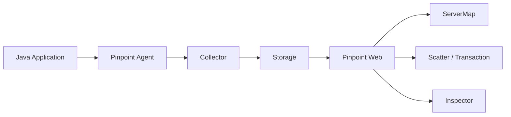

> 这篇笔记的目标不是把 `Pinpoint` 简单介绍成“一个 Java APM 工具”，而是把它真正拆成可落地的几个问题：它到底监控了什么、和 `Metrics / Prometheus / Grafana` 这类体系有什么区别、页面上的每一块图到底代表什么，以及线上排障时应该先看哪里、再看哪里。

> 文中穿插的页面截图主要来自 Pinpoint 官方文档与官方演示风格页面，重点放在 `ServerMap`、`Scatter`、`Call Tree`、`Inspector`、`Application Inspector` 这些最容易“看到了但没看懂”的视图。需要注意的是，`Inspector` 在 `3.x` 版本已经有新实现，部分截图更接近经典 UI，但指标含义和使用思路仍然有参考价值。

> 参考资料：
>
> 官方文档：[Pinpoint Introduction](https://pinpoint-apm.gitbook.io/pinpoint/readme.md) 、 [Overview](https://pinpoint-apm.gitbook.io/pinpoint/want-a-quick-tour/overview.md) 、 [Quickstart](https://pinpoint-apm.gitbook.io/pinpoint/getting-started/quickstart.md) 、 [Installation](https://pinpoint-apm.gitbook.io/pinpoint/getting-started/installation.md) 、 [Application Inspector](https://pinpoint-apm.gitbook.io/pinpoint/documents/application-inspector.md) 、 [FAQ](https://pinpoint-apm.gitbook.io/pinpoint/faq.md)
>
> 官方仓库：[pinpoint-apm/pinpoint](https://github.com/pinpoint-apm/pinpoint) 、 [pinpoint-apm/pinpoint-docker](https://github.com/pinpoint-apm/pinpoint-docker)
>
> 版本演进资料：[What's New](https://pinpoint-apm.gitbook.io/pinpoint/main)

[TOC]

---

## 一、先给最短答案

如果只用一句话概括：

> `Pinpoint` 是一个面向 `Java` 分布式系统的 `APM + Trace` 平台，它通过 `Agent` 字节码增强采集调用链、JVM 与应用运行数据，再通过 `Collector / 存储 / Web UI` 把系统拓扑、单次请求链路和资源指标展示出来。

这句话里有 4 个关键词：

| 关键词 | 它解决什么问题 |
|------|----------------|
| `APM` | 看应用性能是不是异常，例如耗时、错误、吞吐、线程、JVM 状态 |
| `Trace` | 看一笔请求到底经过了哪些服务、哪一段慢了、哪一段报错了 |
| `Topology` | 看系统里服务之间怎么调用，入口和下游关系是什么 |
| `Code-level visibility` | 看一次请求在方法、RPC、DB、HTTP Client 这一层的执行路径 |

所以 `Pinpoint` 的价值不只是“画几张监控图”，而是把下面几种视角串到一起：

1. 从系统全局看，服务和数据库之间的调用关系是什么
2. 从某个应用看，请求量、错误、线程、CPU、堆内存有没有异常
3. 从某一笔请求看，它具体卡在了哪个服务、哪个 SQL、哪个外部调用

---

## 二、Pinpoint 适合什么，不适合什么

### 2.1 它最擅长的场景

`Pinpoint` 最适合回答下面这类问题：

- 某个请求为什么慢
- 某个服务的上游和下游依赖是谁
- 慢请求主要集中在哪个应用实例
- 一次调用链里到底是 HTTP、RPC、SQL 还是某个内部方法在拖慢响应
- 应用本身的 `Heap`、`GC`、`Active Thread`、`TPS` 有没有同步出现异常

### 2.2 它不擅长替代的东西

理解边界比理解功能更重要。

| 系统或能力 | `Pinpoint` 是否适合直接替代 | 原因 |
|------|--------------------------|------|
| 指标监控平台 | 不完全适合 | 它能看 JVM 和应用状态，但不像 `Prometheus + Grafana` 那样擅长统一指标建模与大规模自定义面板 |
| 日志系统 | 不适合 | 它不是全文检索和海量日志检索系统 |
| 通用链路标准平台 | 不完全适合 | 它是自己的 Agent 与 UI 体系，不是 `OpenTelemetry` 那种更强调标准化采集协议的路线 |
| 任意语言统一 APM | 不完全适合 | 它主要强项仍然是 `Java`，虽有 PHP 支持，但核心生态不是多语言优先 |

更实用的理解是：

- `Pinpoint` 更像“Java 应用性能追踪平台”
- `Prometheus` 更像“通用数值型指标采集与告警平台”
- `Grafana` 更像“可视化与统一观察入口”
- `Loki / ELK` 更像“日志检索平台”

如果线上排障目标是“某笔请求到底卡在哪”，`Pinpoint` 往往比纯指标图更直接。

---

## 三、Pinpoint 的核心架构

先把链路放在一张图里看：



这张图可以拆成 4 层：


如果希望先建立更直观的空间感，这张官方架构图可以帮助把“应用侧采集”和“平台侧处理”分开理解：

- 左侧更偏被监控应用与 Agent
- 中间更偏 Collector 与存储链路
- 右侧更偏 Web 查询与展示

### 3.1 Agent

`Agent` 是最关键的一层。

它通常通过 `-javaagent` 挂载到应用进程里，做的事情包括：

- 拦截入口请求，例如 `Tomcat`、`Spring Boot`
- 采集 RPC / HTTP Client / JDBC 等调用信息
- 采集 JVM 与应用运行状态
- 生成 Trace、Span、Stat 数据并上报

它最大的优点是：

- 大量场景下不需要手改业务代码

也正因为是 `Agent` 路线，所以它天然更贴近 Java 运行时。

### 3.2 Collector

`Collector` 负责接收 Agent 上报的数据。

可以把它理解成：

- Trace 和统计数据的汇聚入口

如果没有它，Agent 只能在本机采样，无法形成完整系统视图。

### 3.3 Storage

Pinpoint 早期架构大量依赖 `HBase`，而新版本逐步在部分能力上引入了新的存储方案，例如围绕 `Inspector` 的演进。

工程上真正该记住的是：

- Trace 数据、拓扑数据、统计数据并不是直接存在应用本地
- Pinpoint 后端有自己的一套存储与查询体系

### 3.4 Web

`Web` 就是日常最常使用的界面层。

真正排障时，大多数分析动作都发生在这里：

- 看 `ServerMap`
- 点节点看 `Scatter`
- 在 `Transaction List` 中选请求
- 打开 `Call Tree`
- 看 `Inspector / Application Inspector`

---

## 四、接入 Pinpoint 的最小理解

Pinpoint 官方 Quickstart 的核心思路非常简单：

1. 启动 `HBase`
2. 启动 `Collector`
3. 启动 `Pinpoint Web`
4. 用 `-javaagent` 启动被监控应用

最常见的 Java 进程启动形态可以抽象成：

```bash
java \
  -javaagent:/path/to/pinpoint-agent/pinpoint-bootstrap.jar \
  -Dpinpoint.agentId=order-api-01 \
  -Dpinpoint.applicationName=ORDER-API \
  -jar app.jar
```

其中最重要的两个概念是：

| 参数 | 含义 |
|------|------|
| `agentId` | 具体实例标识，应该尽量唯一 |
| `applicationName` | 同一类应用的逻辑分组名，多个实例会归到同一个应用下 |

这两个值后面会直接影响：

- `ServerMap` 上看到的节点
- `Inspector` 和 `Application Inspector` 的聚合方式

如果这里只记一句话，可以记成：

> `agentId` 更像实例名，`applicationName` 更像服务名。

---

## 五、Pinpoint 的页面总览

官方文档最常强调的 5 个页面能力是：

| 页面 | 解决的问题 | 最适合看的内容 |
|------|------------|----------------|
| `ServerMap` | 系统拓扑与依赖关系 | 上下游、调用量、错误量、服务关系 |
| `Scatter` | 一段时间内请求分布 | 成功/失败、慢请求、异常点聚集 |
| `Transaction List` | 把散点落成具体请求 | 哪些请求值得继续深挖 |
| `Call Tree` | 单次请求的代码级执行路径 | 慢点、错误点、下游链路 |
| `Inspector` | 单实例资源与 JVM 状态 | CPU、Heap、GC、TPS、线程 |
| `Application Inspector` | 同一应用名下多个实例的聚合视图 | 平均值、最大值、最小值、波动范围 |

可以先看一张总览图：


从这张图就能看出 Pinpoint 的设计思路：

- 中间大图负责看服务拓扑
- 右侧负责看被选中节点的请求分布和统计摘要
- 下方负责看实时活动线程

也就是说，它不是单纯“一个 Trace 页面”，而是把拓扑、请求分布和实例状态揉进了同一工作台。

---

## 六、ServerMap 应该怎么看

`ServerMap` 是 Pinpoint 最有辨识度的页面，也是第一次进入系统时最应该先看的页面。

### 6.1 它到底在看什么

`ServerMap` 回答的是：

- 当前这套分布式系统里有哪些应用节点
- 节点之间的调用方向是什么
- 调用量大概有多少
- 哪些下游是数据库、缓存、外部接口或第三方系统

从界面上看，一个节点通常代表：

- 一个应用
- 一个数据库
- 一个外部服务
- 一个消息或远程依赖

而连线表示：

- 调用关系
- 调用方向
- 某时间范围内的调用计数

### 6.2 读图顺序

看 `ServerMap` 最稳妥的顺序通常是：

1. 先找入口节点
2. 再看它的直接下游
3. 再看是否存在明显的热点边
4. 最后点开具体节点看右侧细节

例如这张图里：

- `ApiGateway` 更像入口
- `Shopping-Api`、`Shopping-Order`、`Shopping-Payment` 是内部服务
- `MySQL`、外部卡组织服务则更像下游依赖

### 6.3 节点与边最值得关注什么

| 观察对象 | 最该关注的点 | 意义 |
|----------|--------------|------|
| 节点 | 是否变红、错误数是否上升 | 某个应用本身可能正在报错 |
| 连线 | 调用数是否异常高 | 热点流量可能集中在某条链路 |
| 拓扑结构 | 某节点是否依赖过多 | 调用扇出过大，排障复杂度高 |
| 下游类型 | 是 DB、HTTP、RPC 还是缓存 | 帮助快速判断瓶颈更可能在哪一层 |

### 6.4 右侧面板怎么看

选中节点后，右侧通常会出现几块核心内容：

- `Scatter`
- `Response Summary`
- `Load`

这几块的分工可以简化成：

| 面板 | 问题 |
|------|------|
| `Scatter` | 请求是均匀分布，还是某些时间点突然出现很多慢请求/失败请求 |
| `Response Summary` | 当前时间段里成功、慢、超慢、错误大概各有多少 |
| `Load` | 负载与请求量是否在某时段集中抬升 |

如果刚接手一个陌生系统，不知道从哪下手，先看 `ServerMap` 往往比先翻日志更高效，因为它先给出的是系统全貌。

---

## 七、Scatter、Transaction List、Call Tree 怎么串起来看

这一组是 Pinpoint 最核心的“从宏观异常走到单次请求”的路径。

### 7.1 Scatter 看什么

`Scatter Chart` 的本质是：

- 在时间轴上，把每一笔请求按耗时和成功/失败散点化展示出来

它最适合识别的不是平均值，而是：

- 慢请求是不是突然增多
- 错误请求是不是集中在某一时间段
- 高耗时请求是不是形成明显的上升带

官方 FAQ 特别提到了一点：

- `Scatter` 的请求数据是秒级粒度
- 但 `ServerMap / Response Summary / Load Chart` 是分钟级聚合

这会带来一个很容易误解的现象：

- 同一时间范围下，`Scatter` 里的请求数量和右侧摘要图数量不一定完全一致

原因不是数据错了，而是统计粒度不同。

### 7.2 怎么从 Scatter 走到具体请求

官方推荐的操作方式非常直接：

1. 在 `ServerMap` 里点击节点
2. 让右侧出现该节点的 `Scatter`
3. 在 `Scatter` 上框选某段异常区域
4. 进入 `Transaction List`
5. 再打开某一笔请求的 `Call Tree`

也就是说：

> `Scatter` 是筛异常请求，`Transaction List` 是落到具体请求，`Call Tree` 才是真正做根因分析的地方。

### 7.3 Call Tree 看什么

下面这张图就是典型的 `Call Tree` 页面：


这个页面最值得看的不是“树很长”，而是下面几个列：

| 列或信息 | 意义 |
|----------|------|
| `Path` | 请求入口路径，确认具体是哪类请求 |
| `StartTime` | 发生时间，和异常时间段对齐 |
| `Exec(ms)` | 当前节点总耗时 |
| `Self(ms)` | 当前节点自身耗时，不含子调用 |
| `API / Class` | 到底是方法、RPC、HTTP Client 还是 SQL 调用 |
| `Exception` | 是否在这一层出现异常 |

### 7.4 `Exec(ms)` 和 `Self(ms)` 的区别

这是看 `Call Tree` 时最容易混掉的一点。

| 字段 | 含义 | 适合判断什么 |
|------|------|--------------|
| `Exec(ms)` | 当前节点整段执行耗时 | 这一层总体是不是慢 |
| `Self(ms)` | 当前节点自身耗时，不包含下游子调用 | 真正的慢点是不是就在这一层本身 |

举个很常见的判断：

- 如果某层 `Exec(ms)` 很高，但 `Self(ms)` 很低，往往说明慢点在它的下游
- 如果某层 `Self(ms)` 本身就很高，说明这段本地逻辑可能就是瓶颈

### 7.5 看 Call Tree 的推荐顺序

1. 先看入口请求是不是预期接口
2. 再从上往下找 `Exec(ms)` 明显高的节点
3. 再看这些节点的 `Self(ms)` 是否也高
4. 最后判断是本地代码、SQL、HTTP Client 还是 RPC 下游导致变慢

这一步做顺了，很多“请求慢但不知道慢在哪”的问题会直接落地。

---

## 八、Inspector 看什么

`Inspector` 更接近“单实例健康面板”。

下面这张图就是官方风格的 `Inspector` 页面：


它通常包含下面这些信息：

- 应用基础信息：应用名、AgentId、JVM、启动时间、状态
- `Heap Usage`
- `Non Heap Usage`
- `JVM / System CPU Usage`
- `Transactions Per Second`
- `Active Thread`
- 其他和 GC、响应时间、数据源连接相关的统计

### 8.1 这些图最该怎么理解

| 图表 | 最该看什么 | 异常时通常意味着什么 |
|------|------------|--------------------|
| `Heap Usage` | 堆内存是否持续抬升、是否频繁靠近上限 | 内存泄漏风险、对象堆积、缓存膨胀 |
| `Non Heap Usage` | 元空间、类元数据占用是否异常 | 类加载过多、动态代理或类生成异常 |
| `JVM CPU Usage` | JVM 进程本身 CPU 是否高 | 业务线程忙、GC 压力、热点代码 |
| `System CPU Usage` | 宿主机 CPU 是否高 | 机器层面整体资源紧张 |
| `Transactions Per Second` | 吞吐是不是突然掉下去或飙升 | 流量波动、限流、线程/下游瓶颈 |
| `Active Thread` | 活跃线程是否堆高 | 请求积压、线程池打满、下游阻塞 |

### 8.2 最常见的几个读图误区

#### 8.2.1 只看 CPU，不看 TPS

如果 CPU 高，但 TPS 也高，说明机器可能只是忙。

如果 CPU 不高，但 TPS 明显下降，反而要怀疑：

- 线程在等待
- 下游调用阻塞
- 数据库或远程依赖变慢

#### 8.2.2 只看平均值，不看波动

例如 `Heap` 平均值看着不夸张，但曲线如果周期性冲高后大幅回落，就需要结合 `GC` 和吞吐一起判断。

#### 8.2.3 只看单实例，不看应用整体

某个 `agent` 指标正常，不代表整组实例都正常。

这就是为什么 `Application Inspector` 也很重要。

---

## 九、Application Inspector 看什么

如果 `Inspector` 是单实例视角，那么 `Application Inspector` 就是同一应用名下多实例的聚合视角。

先看完整页面：


这个页面最有价值的地方在于：

- 它不是只给一个平均值
- 它会同时给 `Min / Avg / Max`
- 还会标出当时最小值和最大值分别来自哪个实例

这对于“只有部分实例异常”的场景非常关键。

### 9.1 Heap Usage 聚合图怎么读

下面这张图是 `Heap Usage` 的典型聚合图：


这类图最适合回答：

- 某个应用整体内存是否平稳
- 是否只有单个实例内存明显偏高
- 平均值稳定时，最大值是否仍然在偷偷抬升

读法通常是：

| 线条 | 代表什么 | 适用判断 |
|------|----------|----------|
| `Min` | 同组实例里最小值 | 看最轻实例状态 |
| `Avg` | 同组实例平均值 | 看整体趋势 |
| `Max` | 同组实例最大值 | 看是否有单点异常实例 |

如果出现下面这种模式：

- `Avg` 还算平稳
- 但 `Max` 长期明显高于其他线

通常意味着：

- 某一台实例存在明显偏斜
- 流量打得不均匀，或者单机出现内存滞留

### 9.2 为什么它对集群问题特别有用

真实线上经常不是“整个应用都挂”，而是：

- 某一台实例慢
- 某一台实例内存膨胀
- 某一台实例线程堆积

如果只看单台 `Inspector`，需要一台台切。

如果看 `Application Inspector`，更容易先发现：

- 是否真的是全局问题
- 还是某个异常实例把整体拖坏了

### 9.3 一个版本边界

Pinpoint 文档里也明确提到：

- 经典 `Application Inspector` 曾依赖 `Flink + Zookeeper`

而在新版本演进里：

- 旧的基于 `Flink` 的 Inspector 已逐步被新的实现替代

所以在阅读官方旧截图时，最该关注的是：

- 图表语义和排障思路

而不是死记界面按钮位置。

---

## 十、一个更实用的排障顺序

如果线上有人说“订单接口慢了”，更推荐按下面顺序看 Pinpoint：

### 第一步：先看 ServerMap

判断：

- 是不是入口应用整体出问题
- 是不是某条下游链路特别热
- 是不是数据库或外部服务成为明显瓶颈

### 第二步：再看 Scatter

判断：

- 是全部请求都慢
- 还是某个时间点突然出现很多慢请求
- 慢请求是否伴随失败请求增加

### 第三步：从异常点落到 Transaction List

判断：

- 哪几笔请求最值得展开
- 是否集中在同一接口、同一参数模式、同一实例

### 第四步：打开 Call Tree

判断：

- 慢在本地方法
- 慢在某个 HTTP / RPC 下游
- 慢在 SQL
- 还是某层已经直接抛错

### 第五步：回到 Inspector / Application Inspector

判断：

- 单实例是否线程堆积
- JVM / Heap / CPU 是否同步异常
- 是否存在实例偏斜

这套顺序的本质是：

> 先从拓扑定位问题落在哪一层，再从异常请求落到单次调用，最后再用实例指标验证是不是资源层面出了问题。

---

## 十一、Pinpoint 最值得记住的几个细节

### 11.1 Call Stack 不是自动全量记录

官方 FAQ 提到：

- Agent 默认可能存在采样

如果采样率不是 `1`，就会出现：

- 有些请求能看到完整链路
- 有些请求没有被追到

所以在分析“为什么只有部分请求有 Trace”时，先看采样配置。

### 11.2 自定义 jar 应用不一定天然有入口

对普通 `Tomcat / Spring Boot` 这类有明确入口的应用，Agent 比较容易接入。

但如果是自定义 jar 或特殊运行方式，官方也提醒：

- 需要配置 entry point，否则 Agent 不知道从哪里开始一笔 trace

### 11.3 ApplicationName 的命名要规范

Pinpoint 对 `applicationName` 有字符限制，官方建议只使用：

- 字母
- 数字
- `.`
- `-`
- `_`

这不是小问题，因为命名不规范会直接影响：

- 节点注册
- 页面分组
- 应用聚合

### 11.4 Trace 和 Inspector 数据删除风险不同

FAQ 里也提到：

- `AgentStatV2`、`TraceV2` 这类数据如果删除，会丢失 Inspector 视图和事务链路视图

这说明一个事实：

- Pinpoint 的“链路页面”和“指标页面”背后是不同类型的数据存储

---

## 十二、Pinpoint 与 Prometheus / Grafana 的关系

如果只用一句话区分：

> `Pinpoint` 更擅长“这笔请求到底慢在哪”，`Prometheus + Grafana` 更擅长“这个系统整体指标趋势怎么样”。

更细一点可以写成：

| 维度 | Pinpoint | Prometheus + Grafana |
|------|----------|----------------------|
| 核心强项 | 分布式调用链、单次请求分析 | 指标采集、聚合、告警、统一大盘 |
| 最适合回答 | 哪段调用慢、哪笔请求报错 | 错误率是否升高、CPU 是否打满、QPS 是否下降 |
| 接入方式 | Java Agent 优先 | 埋点 / Exporter / Metrics 暴露 |
| 页面特点 | 拓扑 + Trace + Inspector 联动 | Dashboard、Panel、Explore 更灵活 |

实际生产里它们并不是二选一。

更常见的组合是：

- `Pinpoint` 负责调用链与 Java 应用排障
- `Prometheus` 负责统一指标与告警
- `Grafana` 负责统一可视化

---

## 十三、Pinpoint 的使用建议

### 13.1 适合先做试点接入的系统

- 核心 Java 微服务
- 调用链长、下游依赖多的业务
- “慢请求很多，但日志和指标都说不清”的系统

### 13.2 不要一开始就追求全平台统一

先在最复杂、最痛的几条链路上跑通，往往比一开始全量铺开更有效。

原因很简单：

- Trace 平台最先带来价值的地方，通常是复杂链路排障

### 13.3 页面使用上先建立固定套路

团队里最好约定一套统一排障顺序：

1. `ServerMap`
2. `Scatter`
3. `Transaction List`
4. `Call Tree`
5. `Inspector`

这样排障沟通会顺很多，不容易每个人都凭感觉乱点页面。

---

## 十四、实战部署怎么落地

前面的内容更偏“Pinpoint 到底在看什么”，下面开始回答更工程化的问题：

- 本地想快速起一套体验环境，应该怎么做
- 想在单机或测试环境里手工跑起来，需要哪些组件
- `Spring Boot` 应用应该怎么接入
- 哪些配置项最值得先看

### 14.1 先选部署方式

如果目标不同，部署方式也应该不同。

| 方式 | 适合场景 | 优点 | 代价 |
|------|----------|------|------|
| `Docker Compose` | 本地体验、测试环境、功能演示 | 起环境快，最省时间 | 组件多，排查时仍要理解容器间关系 |
| 单机手工安装 | 学习架构、排查组件行为、非容器环境 | 更容易看清每个组件职责 | 步骤更碎，需要自己管进程与配置 |
| 生产集群化部署 | 多应用、长期运行、需要保留更多数据 | 可扩展性更好 | 运维复杂度高，存储与容量规划更重要 |

如果只是第一次接 Pinpoint，最推荐的顺序是：

1. 先用 `Docker Compose` 跑通整套链路
2. 再手工拆一次 `HBase / Collector / Web / Agent`
3. 最后再考虑生产环境的高可用与存储规模

### 14.2 用 Docker 最快起一套 Pinpoint

官方提供了专门的 [pinpoint-docker](https://github.com/pinpoint-apm/pinpoint-docker) 仓库，适合最快速体验。

最基础的启动方式可以概括成：

```bash
git clone https://github.com/pinpoint-apm/pinpoint-docker.git
cd pinpoint-docker
docker-compose pull
docker-compose up -d
```

这套默认环境通常会把下面几类组件一起带起来：

- `Pinpoint Web`
- `Pinpoint Collector`
- `HBase`
- `Zookeeper`
- `Redis`
- `MySQL`
- `QuickStart` 示例应用

如果希望把 `URI Metric`、`Infrastructure Metric` 之类依赖 `Pinot` 的能力也带上，官方仓库还提供了额外的 metric 编排文件：

```bash
docker-compose pull
docker-compose -f docker-compose.yml -f docker-compose-metric.yml up -d
```

这里最需要记住的不是命令，而是版本边界：

- `HBase` 是经典 Trace / Inspector / ServerMap 这类能力的核心存储
- `Pinot + Kafka` 更偏新引入的指标能力，例如 URI 统计、系统指标等

所以如果只是为了先看调用链：

- 先跑基础 compose 已经够用

如果希望文章里提到的某些新指标菜单也出现：

- 再把 metric 相关组件补上

### 14.3 Docker 方式更适合做什么

`pinpoint-docker` 更适合下面两类目标：

- 快速验证 Pinpoint 页面、调用链和 Agent 接入是否正常
- 在测试环境做一次从应用到平台的完整链路演练

但如果是更偏正式的长期环境，不建议只停留在“能 `docker-compose up` 就算完成”。

原因主要有 3 个：

1. Pinpoint 依赖组件不少，后面一定会碰到存储容量、日志、端口、持久化和版本兼容问题
2. 指标能力和 Trace 能力所依赖的后端组件并不完全相同
3. `applicationName`、`agentId`、采样率、存储 TTL 等配置会直接影响后续运维体验

### 14.4 单机手工安装的最小链路

如果不走 Docker，而是想自己把组件拆开跑，Pinpoint 官方 Quickstart 给出的基本路径是：

1. 启动 `HBase`
2. 初始化 `HBase` schema
3. 启动 `Collector`
4. 启动 `Web`
5. 用 `-javaagent` 启动应用

可以先看最小组件表：

| 组件 | 是否必需 | 作用 |
|------|----------|------|
| `HBase` | 是 | 保存 Trace、AgentStat 等核心数据 |
| `Zookeeper` | 经典部署通常需要 | 给 HBase 与部分服务协调使用 |
| `Collector` | 是 | 接收 Agent 上报的 Span、Stat、元数据 |
| `Web` | 是 | 提供 ServerMap、Transaction、Inspector 等页面 |
| `Pinot` | 按需 | 新版指标能力使用 |
| `Kafka` | 按需 | 指标数据写入 Pinot 的流式链路使用 |
| `MySQL` | 按需 | Web 的告警等附加能力使用 |

一个更贴近 Quickstart 的最小流程通常类似下面这样：

```bash
# 1. 启动 HBase
tar xzvf hbase-x.x.x-bin.tar.gz
cd hbase-x.x.x
./bin/start-hbase.sh

# 2. 初始化 schema
./bin/hbase shell hbase-create.hbase

# 3. 启动 Collector
java -Dpinpoint.zookeeper.address=localhost \
  -jar pinpoint-collector-boot-<version>.jar

# 4. 启动 Web
java -Dpinpoint.zookeeper.address=localhost \
  -jar pinpoint-web-boot-<version>.jar
```

如果当前目标只是学习：

- 这套最小链路已经足够理解 Pinpoint 的工作方式

如果目标已经是偏生产或长期测试环境：

- 需要继续补 `Pinot / Kafka`
- 需要规划 HBase 数据量与 TTL
- 需要确定 Web、Collector 的部署方式和日志策略

### 14.5 单机安装时最容易忽略什么

最常见的遗漏通常不是“命令写错”，而是下面这些：

| 容易忽略的点 | 结果 |
|--------------|------|
| HBase schema 没初始化 | Web 能起来，但没有可用业务数据 |
| Agent 已挂载，但 Collector 地址不对 | 应用端有日志，平台端没有数据 |
| 只启动了 Trace 相关组件，没有补 Pinot/Kafka | 新指标菜单不完整或看不到数据 |
| `applicationName` 命名不规范 | 页面分组混乱，甚至注册异常 |
| 只看 Web 页面，不看 Agent 日志 | 接入失败时定位会很慢 |

---

## 十五、Spring Boot 接入示例

Pinpoint 接入 `Spring Boot` 的核心思路其实很简单：

- 应用仍然按原来的方式启动
- 只是在 JVM 启动参数中额外挂一个 `-javaagent`
- 再补充实例名、应用名等配置

### 15.1 本地 Jar 方式接入

最常见的启动方式如下：

```bash
java \
  -javaagent:/opt/pinpoint-agent/pinpoint-bootstrap.jar \
  -Dpinpoint.agentId=order-api-01 \
  -Dpinpoint.applicationName=ORDER-API \
  -jar app.jar
```

如果是多实例部署，可以把理解固定成：

- `pinpoint.applicationName` 保持同一服务一致
- `pinpoint.agentId` 保证每个实例唯一

例如：

| 服务实例 | `pinpoint.applicationName` | `pinpoint.agentId` |
|----------|-----------------------------|--------------------|
| `order-api-01` | `ORDER-API` | `order-api-01` |
| `order-api-02` | `ORDER-API` | `order-api-02` |
| `order-api-03` | `ORDER-API` | `order-api-03` |

这样进入 Pinpoint 后：

- `ServerMap` 上看到的是一个逻辑应用节点
- `Inspector / Application Inspector` 才能正确区分单实例和整组实例

### 15.2 Spring Boot 接入时的推荐做法

对 `Spring Boot` 来说，更推荐：

1. 保持启动命令简单
2. 把 Agent 解压到固定目录
3. 把 `pinpoint.config` 当成独立配置文件维护
4. 把 `applicationName` 和 `agentId` 交给环境变量或启动脚本生成

一个更贴近实际的启动脚本示例如下：

```bash
#!/usr/bin/env bash

APP_NAME="${PINPOINT_APP_NAME:-ORDER-API}"
AGENT_ID="${PINPOINT_AGENT_ID:-order-api-01}"
AGENT_HOME="/opt/pinpoint-agent"

exec java \
  -javaagent:${AGENT_HOME}/pinpoint-bootstrap.jar \
  -Dpinpoint.applicationName="${APP_NAME}" \
  -Dpinpoint.agentId="${AGENT_ID}" \
  -jar /opt/apps/order-api.jar
```

这种写法的好处是：

- 业务包和 Agent 包解耦
- 实例迁移或扩容时，不需要改业务代码
- 只要替换环境变量，就可以复用一套启动脚本

### 15.3 容器里的 Spring Boot 怎么挂 Agent

如果应用本身跑在容器里，通常会把 Agent 也打进镜像，或者挂载成独立卷。

一个比较常见的 Dockerfile 形态如下：

```dockerfile
FROM eclipse-temurin:17-jre

WORKDIR /app

COPY app.jar /app/app.jar
COPY pinpoint-agent /opt/pinpoint-agent

ENTRYPOINT ["sh", "-c", "java -javaagent:/opt/pinpoint-agent/pinpoint-bootstrap.jar -Dpinpoint.applicationName=${PINPOINT_APP_NAME:-ORDER-API} -Dpinpoint.agentId=${PINPOINT_AGENT_ID:-order-api-01} -jar /app/app.jar"]
```

对应运行时更关心的就变成：

- `PINPOINT_APP_NAME`
- `PINPOINT_AGENT_ID`
- Agent 目录中的 `pinpoint.config`

### 15.4 自定义 Jar 为什么常出现“只有 JVM 指标，没有事务链路”

这是 Pinpoint FAQ 里非常典型的问题。

出现这种情况，通常说明：

- Agent 已经挂上了
- JVM 统计数据能采到
- 但 Agent 没找到“从哪开始一笔事务”

对标准 `Tomcat / Jetty / Spring MVC / Spring Boot` 入口，Agent 往往能自动识别。

但如果是自定义线程模型、特殊容器、非标准入口或者单独跑的自定义 jar，就可能需要手动补：

```properties
profiler.entrypoint=com.example.demo.EntryPoint.execute
```

这里要注意两点：

1. 这是“定义 trace 起点”，不是随便配一个方法名就行
2. 只在非标准入口无法自动识别时再考虑配置，不要上来就乱配

### 15.5 接入后第一轮验证该怎么做

应用启动后，不建议直接只盯着 Pinpoint 页面。

更稳妥的验证顺序是：

1. 先看应用启动日志里 Agent 是否正常初始化
2. 再访问一个最简单的 HTTP 接口
3. 再看 Web 页面里是否出现 `applicationName`
4. 最后点进去看是否出现事务散点和调用树

这一步的目标不是“把所有插件都验证完”，而是先确认：

- 平台链路通了
- 应用被识别了
- 至少有一笔请求能被追到

---

## 十六、常见配置项解释

Pinpoint 最常见的配置可以分成 3 类：

- JVM 启动参数
- `pinpoint.config` 里的 Agent 配置
- Web 侧功能开关

### 16.1 JVM 启动参数

这类参数最常直接写在启动命令里。

| 配置项 | 作用 | 实战建议 |
|--------|------|----------|
| `-javaagent:/path/pinpoint-bootstrap.jar` | 挂载 Pinpoint Agent | 必填，没有它就不会采集 |
| `-Dpinpoint.applicationName=ORDER-API` | 定义逻辑应用名 | 同一服务保持一致，用于聚合 |
| `-Dpinpoint.agentId=order-api-01` | 定义实例唯一标识 | 每个实例都应唯一，避免冲突 |

### 16.2 Agent 常见配置

下面这些配置项更适合放在 `pinpoint.config` 里维护。

| 配置项 | 作用 | 常见用法 |
|--------|------|----------|
| `profiler.collector.ip` | Collector 地址 | Agent 把数据发到哪里，最基本的接入项 |
| `profiler.collector.tcp.port` | Collector TCP 端口 | 经典配置里默认常见为 `9994` |
| `profiler.collector.stat.port` | Collector Stat 端口 | 经典配置里默认常见为 `9995` |
| `profiler.collector.span.port` | Collector Span 端口 | 经典配置里默认常见为 `9996` |
| `profiler.sampling.enable` | 是否开启采样 | 一般保持开启 |
| `profiler.sampling.rate` | 采样率 | `1` 表示全量，`10` 表示约 10% |
| `profiler.entrypoint` | 自定义 trace 入口方法 | 只在非标准入口无法自动识别时使用 |

这里最值得多解释一句的是 `profiler.sampling.rate`：

- `1` 表示每笔都采
- `2` 表示大约采 50%
- `10` 表示大约采 10%

这也是为什么线上常出现：

- 只有一部分请求能看到完整链路

如果不是网络或插件问题，第一反应就应该先看采样配置。

### 16.3 日志与功能开关

还有一类配置不直接影响是否采集，但会影响排障体验。

| 配置项或文件 | 作用 | 什么时候用 |
|--------------|------|------------|
| `PINPOINT_AGENT/lib/log4j.xml` | Agent 日志级别 | 接入失败、插件加载异常时优先看 |
| `config.sendUsage=false` | 关闭 Web 侧 usage 上报 | 对外网访问受限或不希望发送 usage 时使用 |
| `config.show.systemMetric=true` | 打开系统指标菜单 | 已经接好 Pinot/Kafka/Telegraf 后再开启更有意义 |

### 16.4 配置上的几个实战建议

| 场景 | 建议 |
|------|------|
| 本地联调 | `profiler.sampling.rate=1`，先保证每次请求都能看见 |
| 压测或流量较大环境 | 不要一上来就全量采样，先评估链路量级 |
| 多实例部署 | `applicationName` 固定，`agentId` 用机器名或 Pod 名做唯一值 |
| 容器部署 | Agent 配置和业务镜像解耦，尽量通过挂载或启动脚本注入 |
| 页面没有数据 | 先查 Agent 日志，再查 Collector 地址与端口 |

---

## 十七、常见接入问题与排查顺序

如果接入后页面没有达到预期，最常见的问题通常集中在下面几类。

| 现象 | 优先怀疑什么 | 第一动作 |
|------|--------------|----------|
| Web 正常，但看不到应用 | Agent 没成功上报 | 先查 Agent 启动日志和 `profiler.collector.ip` |
| 能看到应用，但没有事务链路 | 入口未识别或采样过低 | 先看 `profiler.entrypoint` 与 `profiler.sampling.rate` |
| 只有部分请求有 Trace | 采样率不是 `1` | 先确认 `profiler.sampling.rate` |
| 应用名出现很多乱节点 | `applicationName`、`agentId` 规划混乱 | 先统一命名策略 |
| 系统指标菜单没有数据 | `Pinot / Kafka / Telegraf` 没打通 | 先确认 metric 相关组件是否部署 |

一个更稳妥的排查顺序通常是：

1. 查 Agent 是否正常加载
2. 查应用是否真的收到请求
3. 查 Agent 到 Collector 的地址和端口
4. 查 Pinpoint Web 是否出现应用节点
5. 再判断是采样、入口识别，还是插件支持范围问题

把这个顺序走顺，接入问题一般不会卡太久。

---

## 十八、小结

这篇笔记最该带走的结论，可以浓缩成下面几条：

1. `Pinpoint` 的核心价值不是“有监控图”，而是把拓扑、单次请求链路和 JVM 状态串在一起。
2. `ServerMap` 先回答“系统怎么调用”，`Scatter` 回答“哪些请求异常”，`Call Tree` 回答“到底慢在哪”。
3. `Inspector` 适合看单实例，`Application Inspector` 适合看同一应用名下多个实例的聚合状态。
4. `Exec(ms)` 和 `Self(ms)` 的区别，是理解 `Call Tree` 的关键。
5. `Scatter` 是秒级粒度，`Response Summary / Load` 更偏分钟级聚合，数量不完全一致并不一定是异常。
6. `Pinpoint` 很适合 Java 应用链路排障，但不应该被误当成日志系统或通用指标平台。
7. 最实用的使用方式不是盯着某一张图，而是按 `ServerMap -> Scatter -> Call Tree -> Inspector` 的顺序逐层收缩问题范围。
