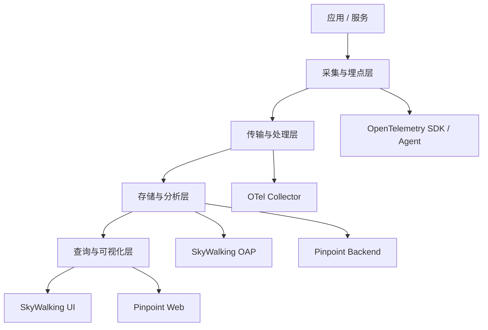
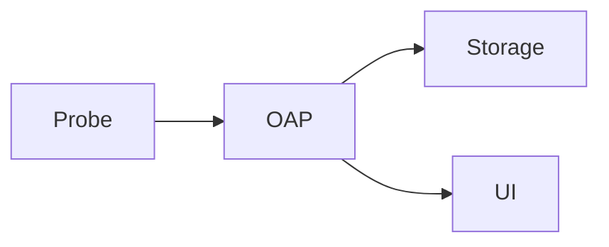

> 这篇笔记的目标不是做一张“功能打勾表”，而是回答一个更关键的问题：为什么 `SkyWalking`、`Pinpoint`、`OpenTelemetry` 明明都和 trace、metrics、logs 有关，却经常被拿来错误地一对一比较。核心原因在于，这三者并不处在完全相同的层级。

> 文中会先把三者放进同一张架构坐标系，再分别比较它们的定位、强项、限制、部署与接入复杂度，最后给出更实用的选型建议。重点不是记住结论，而是先分清谁更像“平台”、谁更像“产品”、谁更像“标准与采集体系”。

> 参考资料：
>
> SkyWalking：[Overview](https://skywalking.apache.org/docs/main/latest/en/concepts-and-designs/overview/) 、 [Backend setup](https://skywalking.apache.org/docs/main/latest/en/setup/backend/backend-setup/) 、 [Setup java agent](https://skywalking.apache.org/docs/skywalking-java/latest/en/setup/service-agent/java-agent/readme/)
>
> Pinpoint：[Introduction](https://pinpoint-apm.gitbook.io/pinpoint/readme.md) 、 [Overview](https://pinpoint-apm.gitbook.io/pinpoint/want-a-quick-tour/overview.md) 、 [Quickstart](https://pinpoint-apm.gitbook.io/pinpoint/getting-started/quickstart.md) 、 [FAQ](https://pinpoint-apm.gitbook.io/pinpoint/faq.md)
>
> OpenTelemetry：[What is OpenTelemetry?](https://opentelemetry.io/docs/what-is-opentelemetry/) 、 [Observability primer](https://opentelemetry.io/docs/concepts/observability-primer/) 、 [Collector](https://opentelemetry.io/docs/collector/) 、 [Collector configuration](https://opentelemetry.io/docs/collector/configuration/) 、 [Java automatic instrumentation](https://opentelemetry.io/docs/languages/java/automatic/) 、 [OTel specification overview](https://opentelemetry.io/docs/specs/otel/overview/)
>
> 站内前文：[Pinpoint 分布式链路追踪与 APM](/2026/06/15/Pinpoint分布式链路追踪/) 、 [SkyWalking 可观测平台](/2026/06/17/SkyWalking可观测平台/)

[TOC]

---

## 一、先给结论

如果只给最短结论，可以直接记成：

| 名称 | 最准确的第一定位 |
|------|------------------|
| `SkyWalking` | 自建型可观测分析平台 |
| `Pinpoint` | 偏 Java 的 APM / 分布式链路追踪产品 |
| `OpenTelemetry` | 供应商中立的可观测标准、SDK、Agent 与 Collector 体系 |

所以第一个必须纠正的误区是：

> `OpenTelemetry` 不是 `SkyWalking` 或 `Pinpoint` 的同类产品，它更像一套标准化采集与传输体系，而不是最终观测后端。

换句话说：

- `SkyWalking` 和 `Pinpoint` 可以被当成平台或产品来用
- `OpenTelemetry` 更像把数据“采出来、传出去、标准化”的基础设施

---

## 二、为什么三者经常被错误比较

因为在一线讨论里，大家常常把几个层级混在一起说：

- 谁能看 trace
- 谁能挂 Java Agent
- 谁能看 metrics

看起来它们都能做这些事，于是就误以为是同层竞争关系。

但更准确的架构分层应该是：

这张图表达的是：

- `OpenTelemetry` 主要活跃在“采集、传输、标准化”这一层
- `SkyWalking` 更偏“后端分析平台 + UI”
- `Pinpoint` 更偏“完整 APM 产品闭环”

所以真正合理的比较方式，不是问：

- “三者谁更强”

而是问：

- “当前问题发生在哪一层”
- “当前团队缺的是标准化采集，还是缺后端分析平台，还是缺一个拿来就用的 APM”

---

## 三、先分别定义三者

### 3.1 SkyWalking 是什么

可以概括为：

- 一个面向分布式系统和云原生环境的 observability analysis platform

它的重点是：

- 多种 probe 接入
- `OAP` 分析后端
- 多维对象模型
- 平台化的数据分析与查询

它更像：

- 一套自建可观测平台

### 3.2 Pinpoint 是什么

可以概括为：

- 一个以 Java Agent 为核心、偏产品化的 APM 和分布式链路追踪平台

它最强的地方通常不在“什么都接”，而在：

- Java 应用接入直接
- ServerMap、Scatter、Call Tree 这些页面非常适合故障排查
- 对单次事务和应用实例分析很直观

它更像：

- 面向 Java 场景的 APM 产品

### 3.3 OpenTelemetry 是什么

可以概括为：

- 一套标准化、供应商中立的 observability API、SDK、Agent、Collector 与语义规范体系

它提供的是：

- 统一埋点方式
- 统一信号模型
- 统一导出协议
- 统一 Collector 管道

但它不是：

- 一个最终观测后端

所以它更像：

- 观测数据标准与采集中间层

---

## 四、最本质的差别：谁是平台，谁是标准，谁是产品

### 4.1 角色差异

| 维度 | SkyWalking | Pinpoint | OpenTelemetry |
|------|------------|----------|---------------|
| 更像什么 | 平台 | 产品 | 标准与采集体系 |
| 是否自带完整后端分析平台 | 是 | 是 | 否 |
| 是否自带 UI | 是 | 是 | 否 |
| 是否强调标准化与可移植性 | 中等 | 较弱 | 极强 |
| 是否强调多后端输出 | 中等 | 较弱 | 极强 |

这个表最关键的一点是：

- `OpenTelemetry` 本身不提供最终观测平台闭环

因此很多所谓的 “OTel vs SkyWalking” 本质上并不是直接替代关系，而是：

- 可以配合
- 也可以分层使用

例如：

- 应用用 `OpenTelemetry Java Agent`
- 数据先到 `OTel Collector`
- 最终落到 `SkyWalking`

这是一条完全成立的链路。

---

## 五、从架构视角看三者

### 5.1 SkyWalking 的架构思路

SkyWalking 逻辑上可以抽成：

重点在：

- `OAP` 非常核心
- 后端具备分析、聚合、建模能力
- 支持多源遥测输入

### 5.2 Pinpoint 的架构思路

Pinpoint 逻辑上更接近：

重点在：

- 自家 Agent 与后端是强配合关系
- UI 偏事务分析和 Java 应用排障
- 平台闭环完整，但标准化开放程度不如 OTel 体系

### 5.3 OpenTelemetry 的架构思路

OpenTelemetry 更接近：

重点在：

- 采集与传输标准化
- Collector 负责接收、处理、导出
- 最后端可以是多种开源或商业平台

所以它更像：

- 一条数据通路

而不是：

- 最终分析平台

---

## 六、数据模型和对象视角差异

### 6.1 SkyWalking 的对象模型更平台化

SkyWalking 显式强调：

- `Layer`
- `Service`
- `Service Instance`
- `Endpoint`
- `Process`

这意味着它更擅长：

- 从系统对象关系去建模
- 看层级关系和依赖关系

### 6.2 Pinpoint 的对象视角更偏事务与应用

Pinpoint 也有应用、实例、链路、拓扑概念，但实际使用时，用户最常进入的工作流是：

- `ServerMap`
- `Scatter`
- `Transaction List`
- `Call Tree`

这说明它的视角更偏：

- 应用 APM
- 事务追踪
- 单次请求故障分析

### 6.3 OpenTelemetry 的模型更偏标准化语义

OpenTelemetry 强调的是：

- `Traces`
- `Metrics`
- `Logs`
- `Baggage`
- `Context propagation`
- `Semantic Conventions`
- `Resource`

也就是说它最强的不是“某个 UI 页面好不好看”，而是：

- 采出来的数据结构是不是标准化
- 不同语言、不同框架、不同后端之间能不能互通

---

## 七、信号覆盖范围怎么比较

| 维度 | SkyWalking | Pinpoint | OpenTelemetry |
|------|------------|----------|---------------|
| Traces | 强 | 强 | 强 |
| Metrics | 强 | 中 | 强 |
| Logs | 中到强 | 弱到中 | 强 |
| Profiling | 有 | 较弱 | 不以此为核心 |
| Events | 有 | 弱 | 不是核心卖点 |

这里要特别注意：

- `OpenTelemetry` 的“强”不代表它自带完整分析 UI
- 它的强，主要体现在信号标准化、采集与传输能力

而 `Pinpoint` 的“弱到中”也不是说它完全不能看指标，而是：

- 它更核心的价值在 Java APM 和 transaction analysis

---

## 八、接入方式和使用体验差异

### 8.1 SkyWalking 的接入体验

对 Java 来说：

- 挂 Java Agent 很直接

但更完整地用起来时，还会碰到：

- OAP
- 存储
- UI
- 多源接入
- 云原生场景下的 SWCK、Mesh、eBPF

所以它的接入体验可以概括为：

- 单 Agent 接入不难
- 平台化用好之后复杂度会上升

### 8.2 Pinpoint 的接入体验

Pinpoint 的典型体验更像：

- 先起后端
- 挂 Java Agent
- 打开页面排查问题

对纯 Java 团队来说，这条路径非常顺：

- 入门快
- 页面直观
- 排障链条短

### 8.3 OpenTelemetry 的接入体验

OTel 的接入体验和另外两个最大的不同是：

- 它通常不是“挂完 agent 打开自带页面”这种产品体验

而是：

1. 选 API / SDK / Agent
2. 配置导出协议
3. 部署 Collector
4. 把数据送到某个 backend

这条路径的优点是：

- 灵活
- 标准化
- 可迁移

代价是：

- 没有“开箱即用的闭环产品感”

---

## 九、Java 场景下怎么选

因为这三者在 Java 世界里都很常见，所以 Java 团队最容易纠结。

### 9.1 如果目标是快速排查 Java 业务问题

更容易优先考虑：

- `Pinpoint`

原因是：

- Java Agent 路线成熟
- UI 对事务和链路排障很友好
- 对“哪个请求慢、慢在哪、哪个实例异常”这类问题响应很快

### 9.2 如果目标是自建较完整的 observability platform

更容易优先考虑：

- `SkyWalking`

原因是：

- 后端平台能力更强
- 多源接入更自然
- 更适合和云原生、多语言、mesh 场景一起演进

### 9.3 如果目标是标准化埋点并保留后端选择自由

更容易优先考虑：

- `OpenTelemetry`

原因是：

- 供应商中立
- 协议和语义统一
- 后端可替换

但这里要补一句：

- 往往不是“只选 OTel 就结束”
- 通常还需要再选一个 backend

---

## 十、多语言和云原生场景下怎么选

### 10.1 多语言系统

| 场景 | 更合适的起点 |
|------|--------------|
| 多语言统一采集标准 | `OpenTelemetry` |
| 多语言 + 自建平台分析 | `OpenTelemetry + SkyWalking` |
| 以 Java 为主，夹杂少量其他语言 | `Pinpoint` 可能仍可用，但边界更明显 |

### 10.2 Kubernetes / Service Mesh 场景

在这类场景下，`SkyWalking` 往往更占优势。

原因在于它对下面这些方向更自然：

- Mesh receiver
- Layer 概念
- 云原生对象关系
- SWCK
- eBPF 扩展

而 `OpenTelemetry` 在这类场景的优势则是：

- 标准化采集和传输
- Collector agent / gateway 模式非常灵活

---

## 十一、标准化和可迁移性差异

这是三者最应该拉开的一条线。

| 维度 | SkyWalking | Pinpoint | OpenTelemetry |
|------|------------|----------|---------------|
| 数据模型开放性 | 中 | 低到中 | 高 |
| 协议标准化 | 中 | 低 | 高 |
| 更换后端时的迁移成本 | 中 | 高 | 低到中 |
| 供应商中立程度 | 中 | 低 | 高 |

### 11.1 为什么 OTel 在这一点上非常特殊

OpenTelemetry 的历史背景，本身就来自：

- 过去不同 backend 各自有不同埋点方式
- 一旦换后端就得重做 instrumentation

所以 OTel 的核心价值之一就是：

- 让 instrumentation 和 backend 解耦

这意味着在组织层面，它解决的是：

- 避免被单一后端强绑定

### 11.2 为什么 Pinpoint 在这条线上不占优

因为 Pinpoint 更像：

- 一个完整产品体系

产品化闭环越强，通常意味着：

- 使用体验更直接
- 但标准化与可替换性往往没那么强

---

## 十二、运维复杂度怎么比较

### 12.1 Pinpoint

优点：

- 目标明确
- 典型排障路径清晰
- Java 场景容易快速见效

代价：

- 后端依赖与存储体系需要维护
- 非 Java、多源标准化场景的优势不明显

### 12.2 SkyWalking

优点：

- 平台能力强
- 场景覆盖广
- 多源遥测整合能力更好

代价：

- `OAP + Storage + UI` 的平台维护成本更高
- 真正用深了以后，复杂度会明显上升

### 12.3 OpenTelemetry

优点：

- Collector 管道灵活
- 标准化强
- 可适配多后端

代价：

- 自身不提供最终分析平台
- 选型实际上会变成“OTel + 哪个 backend”

---

## 十三、常见误区

### 13.1 误区一：OpenTelemetry 可以直接替代 SkyWalking 或 Pinpoint

不准确。

因为大多数情况下：

- OTel 负责采和传
- SkyWalking / Pinpoint 负责看和分析

### 13.2 误区二：有了 OTel 就不需要 backend

不成立。

OTel 采出来的数据仍然需要：

- 存储
- 查询
- UI
- 告警
- 分析平台

### 13.3 误区三：SkyWalking 和 Pinpoint 只是页面风格不同

不成立。

它们的差别不只在 UI，而在于：

- 后端架构
- 平台目标
- 多源接入能力
- 对云原生和标准化的关注程度

### 13.4 误区四：Pinpoint 过时，所以不值得看

也不准确。

如果团队主要是 Java 应用，且核心诉求是：

- 事务分析
- 链路排障
- 快速定位慢请求

Pinpoint 仍然有很强的实用价值。

---

## 十四、一个更实用的选型坐标系

如果不想背概念，可以直接按问题来选。

| 当前最核心的问题 | 更推荐先看什么 |
|------------------|----------------|
| 只想把 Java 应用链路和事务排查跑起来 | `Pinpoint` |
| 想做自建可观测平台，接多源遥测 | `SkyWalking` |
| 想统一埋点标准并保留后端切换自由 | `OpenTelemetry` |
| 想要标准化采集 + 自建分析平台 | `OpenTelemetry + SkyWalking` |
| 想先最短路径看到 Java 请求慢在哪 | `Pinpoint` |
| 系统已经 Kubernetes / Mesh / 多语言化 | `SkyWalking` 或 `OpenTelemetry + SkyWalking` |

---

## 十五、三种典型组合方式

### 15.1 组合一：Pinpoint 单独使用

适合：

- Java 为主
- 团队想尽快获得 APM 排障能力
- 关注事务、链路和实例状态

### 15.2 组合二：SkyWalking 单独使用

适合：

- 自建平台
- 需要统一管理多种遥测来源
- 关注云原生和服务层次关系

### 15.3 组合三：OpenTelemetry + SkyWalking

适合：

- 希望 instrumentation 标准化
- 希望 backend 可控
- 希望既有 OTel 的开放性，又有 SkyWalking 的平台能力

这往往是比较现代、也比较常见的一条路线。

---

## 十六、小结

这篇对比文最该带走的结论，可以浓缩成下面几条：

1. `SkyWalking`、`Pinpoint`、`OpenTelemetry` 不处在完全相同的层级，不能只按“都能看 trace”来比较。
2. `SkyWalking` 更像平台，`Pinpoint` 更像产品，`OpenTelemetry` 更像标准与采集体系。
3. `OpenTelemetry` 最大的价值在于供应商中立、标准化和后端可迁移性，而不是自带最终分析平台。
4. `Pinpoint` 的优势在 Java APM 和事务排障，尤其适合快速解决“这笔请求慢在哪”。
5. `SkyWalking` 的优势在 OAP 后端、多源接入、平台化分析能力，以及对云原生场景更自然的适配。
6. 如果团队目标是“统一埋点标准 + 自建平台”，`OpenTelemetry + SkyWalking` 往往比单独选任意一个都更合理。
7. 如果团队目标只是“尽快把 Java 链路排障跑起来”，`Pinpoint` 反而可能是更短路径的选择。
