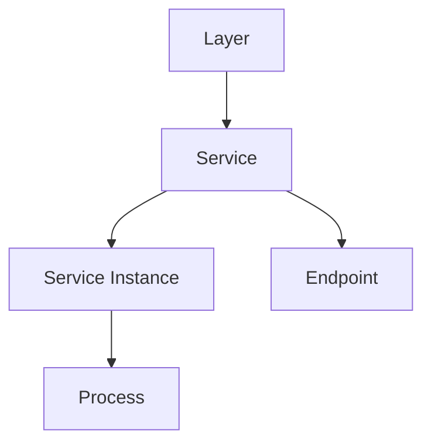
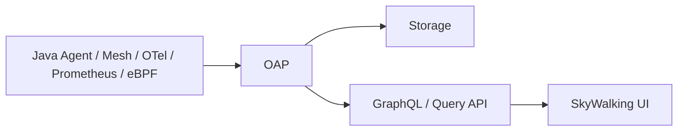
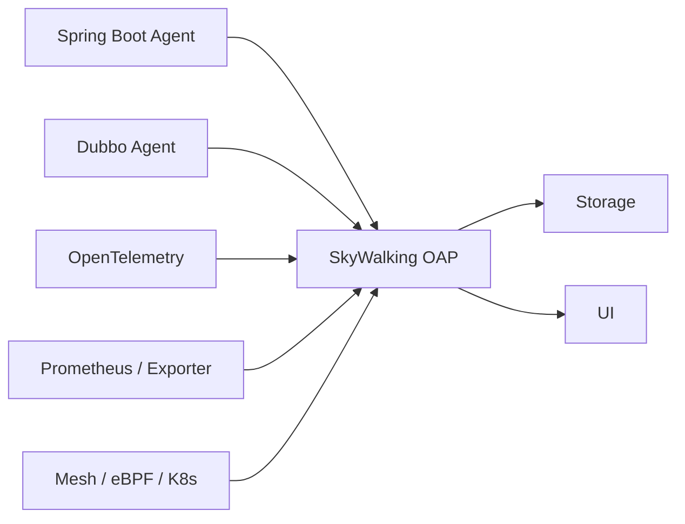
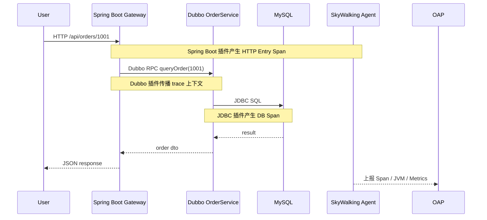
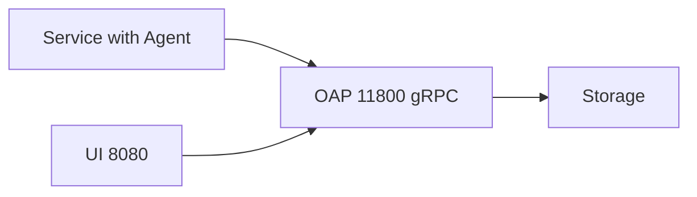

> 这篇笔记的目标不是把 `SkyWalking` 只记成“另一个链路追踪系统”，而是把它放回自己的真实定位里理解: 它更像一个完整的可观测分析平台，既能接自己的 Agent，也能接 `OpenTelemetry`、`Prometheus`、`Zipkin`、`Service Mesh` 等多种遥测来源，再通过 `OAP` 做统一分析、聚合与展示。

> 文章重点会放在 4 个问题上：`SkyWalking` 到底和普通 trace 平台有什么差别、`OAP` 为什么是核心、`Service / Instance / Endpoint / Layer` 这些对象该怎么理解，以及实战接入时 `Java Agent`、`OAP`、`Storage`、`UI` 各自该怎么配合。它不追求覆盖所有高级特性，而是先搭起一张稳定的整体脑图。

> 参考资料：
>
> 官方文档：[Overview](https://skywalking.apache.org/docs/main/latest/en/concepts-and-designs/overview/) 、 [Backend setup](https://skywalking.apache.org/docs/main/latest/en/setup/backend/backend-setup/) 、 [Introduction to UI](https://skywalking.apache.org/docs/main/v10.0.1/en/ui/readme/) 、 [OAL](https://skywalking.apache.org/docs/main/latest/en/concepts-and-designs/oal/) 、 [MAL](https://skywalking.apache.org/docs/main/latest/en/concepts-and-designs/mal/) 、 [OpenTelemetry Metrics Format](https://skywalking.apache.org/docs/main/latest/en/setup/backend/opentelemetry-receiver) 、 [Cross Process Propagation Headers Protocol v3](https://skywalking.apache.org/docs/main/latest/en/api/x-process-propagation-headers-v3/)
>
> Java Agent：[Setup java agent](https://skywalking.apache.org/docs/skywalking-java/latest/en/setup/service-agent/java-agent/readme/) 、 [Agent Configuration Properties](https://skywalking.apache.org/docs/skywalking-java/v9.3.0/en/setup/service-agent/java-agent/configurations/) 、 [Supported Middleware, Framework and Library List](https://skywalking.apache.org/docs/skywalking-java/latest/en/setup/service-agent/java-agent/supported-list/)
>
> 云原生接入：[SkyWalking SWCK Java agent injector](https://skywalking.apache.org/docs/skywalking-swck/latest/java-agent-injector/)
>
> 页面示例：[How to Use SkyWalking for Distributed Tracing in Istio?](https://skywalking.apache.org/blog/how-to-use-skywalking-for-distributed-tracing-in-istio/)
>
> 站内前文：[Pinpoint 分布式链路追踪与 APM](/2026/06/15/Pinpoint分布式链路追踪/)

[TOC]

---

## 一、先给最短答案

如果只用一句话概括：

> `SkyWalking` 是一个面向分布式系统和云原生环境的可观测分析平台，它通过多种 `Probe` 接收 trace、metrics、logs、events、profiling 数据，再由 `OAP` 做流式分析与聚合，最后通过 `UI` 和查询接口把服务拓扑、依赖关系、指标趋势和调用链展示出来。

这句话里最关键的 5 个词是：

| 关键词 | 它真正代表什么 |
|------|----------------|
| `Probe` | 各类数据入口，不只是 Java Agent，也包括 Mesh、OTel、Prometheus、eBPF 等 |
| `OAP` | Observability Analysis Platform，平台的大脑，负责接收、分析、聚合、告警与查询 |
| `Storage` | 遥测数据最终落盘的位置，可以选不同实现 |
| `UI` | 用来观察拓扑、服务、实例、端点和依赖关系的界面层 |
| `Analysis` | SkyWalking 不只是存数据，而是强调分析与建模 |

所以它和“纯 trace 系统”的区别在于：

1. 它不是只盯单次请求
2. 它也不是只盯数值型指标
3. 它试图给整套分布式系统建立统一的观测对象和分析模型

---

## 二、SkyWalking 的定位到底是什么

### 2.1 它首先是一个平台，而不是单点工具

SkyWalking 官方给出的定义很直接：

- 它是一个用于采集、分析、聚合和可视化服务与云原生基础设施数据的可观测平台

这个定义里，“分析”和“聚合”比“采集”更值得重视。

很多工具停在：

- 把数据采上来
- 交给一个后端存起来
- 再给几个图

而 SkyWalking 更想做的是：

- 对服务、实例、端点、层级、依赖关系建立统一对象模型
- 用分析语言和流式分析过程生成可查询结果
- 把 trace、metrics、logs、events、profiling 放进同一个平台里理解

### 2.2 它为什么常被拿来和 APM 放在一起

因为从用户感知上看，SkyWalking 当然具备 APM 特征：

- 自动探针
- 服务拓扑
- 调用链路
- JVM 与实例指标
- 端点级统计
- 告警与关联分析

但如果只把它理解成 “APM 产品”，就会漏掉两个更重要的点：

- 它非常强调多源遥测接入
- 它非常强调平台后端 `OAP` 的分析能力

也就是说：

> `SkyWalking` 不只是“Agent + UI”，而是“Probe + OAP + Storage + UI”共同组成的平台体系。

---

## 三、SkyWalking 关注哪些数据

官方把 SkyWalking 覆盖的数据类型描述得很完整：

| 数据类型 | 作用 | 典型用途 |
|----------|------|----------|
| `Tracing` | 看请求在分布式系统中的传播路径 | 定位慢请求、错误链路、上下游依赖 |
| `Metrics` | 看数值型聚合指标 | 看吞吐、延迟、错误率、实例状态 |
| `Logging` | 看日志与链路关联 | 用 trace 上下文把日志和请求串起来 |
| `Profiling` | 看代码层面的热点和性能细节 | 分析 CPU、方法级热点、慢点 |
| `Event` | 看系统中的关键事件 | 版本发布、配置变更、故障时间点对齐 |

这 5 类数据里，最容易被忽略的是：

- `Event`
- `Profiling`

因为很多系统只做到：

- 有 trace
- 有 metrics

但真正做复杂故障分析时，事件和 profiling 往往才是“为什么突然波动”的补充证据。

---

## 四、SkyWalking 的核心对象模型

SkyWalking 的对象模型比很多 APM 更“显式”。

官方反复强调的几个核心对象是：

- `Layer`
- `Service`
- `Service Instance`
- `Endpoint`
- `Process`

这套模型理解顺了，后面看 UI 和指标会顺很多。

### 4.1 Layer

`Layer` 可以理解成：

- 一类运行环境或技术抽象层

例如：

- `OS_LINUX`
- `Kubernetes`
- `Mesh`
- `Mesh Data Plane`

这意味着 SkyWalking 的视角并不局限于“某个应用进程”。

它试图表达的是：

- 这个服务在什么层被观察到
- 同一个逻辑服务在不同层的关系是什么

### 4.2 Service

`Service` 表示：

- 提供相同能力的一组逻辑工作负载

更直白一点说：

- 它更接近“服务名”

在 Java Agent 接入里，通常对应：

- `agent.service_name`

### 4.3 Service Instance

`Service Instance` 表示：

- 一个服务组里的具体实例

在传统 Java 进程视角里，它常常可以近似理解为：

- 某一台机器上的某个 JVM 实例

在 Kubernetes 场景里，它又更像：

- 某个 Pod 或某个工作负载实例

### 4.4 Endpoint

`Endpoint` 表示：

- 一个服务暴露出来的具体入口路径或方法签名

例如：

- HTTP URI
- gRPC 方法
- 某类 RPC 接口入口

很多时候：

- 服务视角适合看整体健康
- 端点视角适合看哪个接口最慢、最热、最容易报错

### 4.5 Process

`Process` 表示：

- 操作系统进程

之所以单独强调这个对象，是因为：

- `Service Instance` 不一定总能完全等价于单个进程

比如某些容器场景或复合工作负载里：

- 实例和进程不是完全一一对应

### 4.6 一张关系图先串起来



这张图不代表所有关系都严格唯一，而是帮助理解一个基本方向：

- `Layer` 是更高层的运行环境抽象
- `Service` 是逻辑能力分组
- `Instance` 是具体实例
- `Endpoint` 是入口面
- `Process` 是操作系统执行体

---

## 五、SkyWalking 的整体架构

SkyWalking 官方把平台逻辑上拆成 4 部分：

- `Probes`
- `Platform backend`
- `Storage`
- `UI`

可以先用一张简化图把关系看清楚：



### 5.1 Probes

`Probe` 不是单指“某个 agent”。

它更像所有输入源的总称，包括：

- Java Agent
- 多语言原生 Agent
- Service Mesh 接收器
- OpenTelemetry 数据
- Prometheus 指标
- eBPF 数据

这正是 SkyWalking 和纯 Java APM 的一个明显差异：

- 它天然假设数据来源可以很多样

### 5.2 OAP

`OAP` 是 SkyWalking 的真正核心。

它负责：

- 接收各种遥测数据
- 做流式分析与聚合
- 建立拓扑和依赖关系
- 生成服务、实例、端点等多层对象指标
- 向 UI 和查询侧提供结果

如果一定要给它一个最准确的中文理解：

> `OAP` 更像“观测数据分析后端”，而不是单纯 Collector。

### 5.3 Storage

SkyWalking 的存储是可插拔的。

文档里提到过多种实现，例如：

- `H2`
- `MySQL`
- `ElasticSearch`
- `TiDB`
- `BanyanDB`

这意味着：

- SkyWalking 不把存储和平台逻辑硬绑死

也意味着：

- 选型时要把查询性能、保留周期、成本和运维能力一起考虑

### 5.4 UI

`UI` 不是平台的核心计算层，但它决定了“人能不能把问题看出来”。

它承担的主要职责包括：

- 展示服务拓扑
- 展示服务、实例、端点维度指标
- 查看 trace 和依赖关系
- 浏览告警、事件和部分关联数据

---

## 六、SkyWalking 的数据到底从哪来

如果只把 SkyWalking 看成一个“观测平台”，最容易产生的疑问就是：

- 平台上的拓扑、trace、指标、日志到底是谁送进来的
- SkyWalking 自己是不是会主动去应用里抓数据

最短答案是：

> SkyWalking 自己不是直接进应用内存里“读数据”，而是通过各种 `Probe`、`Agent`、`Receiver` 接收应用和基础设施主动上报或暴露出来的遥测，再由 `OAP` 把这些原始数据分析成服务、实例、端点、拓扑和链路视图。

### 6.1 数据来源可以先分成 3 大类

| 数据来源大类 | 典型入口 | 适合采什么 |
|--------------|----------|------------|
| 原生 Agent / SDK | Java Agent、多语言 Agent、原生协议 SDK | 应用 trace、JVM 指标、部分 profiling、日志上下文 |
| 标准化遥测入口 | OpenTelemetry、Zipkin、Prometheus、Telegraf | 跨语言 trace、基础设施 metrics、自定义 metrics |
| 平台和内核侧观测 | Service Mesh、eBPF、Kubernetes、自观测 | 网络链路、Mesh 流量、k8s 对象、OAP 自身状态 |

这说明 SkyWalking 的数据不是只有一种来路。

更准确的理解是：

- 应用侧数据可以来自 Agent
- 平台侧数据可以来自 Receiver
- 后端展示结果则是 OAP 对这些原始数据再加工后的产物

### 6.2 先区分“原始数据”和“分析结果”

这是理解 SkyWalking 最关键的一步。

| 层次 | 例子 | 谁产生 |
|------|------|--------|
| 原始遥测 | Span、JVM 指标、OTLP metrics、Prometheus metrics、日志、事件 | Agent、SDK、Collector、Mesh、Exporter |
| OAP 分析结果 | Service 指标、Instance 指标、Endpoint 指标、拓扑关系、Trace 视图 | SkyWalking OAP |

也就是说，SkyWalking UI 里看到的很多图，并不是应用直接上报了一张“服务面板”给它。

更常见的真实过程是：

1. 应用或平台先上报原始遥测
2. OAP 对这些遥测做聚合、建模和分析
3. UI 再展示成服务、实例、端点和 trace 页面

所以：

- `Topology` 不是应用主动提交的一张拓扑图
- `Endpoint` 指标不是业务代码主动提交的一张接口排行榜

这些大多是 OAP 从原始 trace 和 metrics 里推导出来的。

### 6.3 SkyWalking 的原生 Java Agent 能提供什么

对 Java 系统来说，最常见的数据来源就是 SkyWalking Java Agent。

官方文档和插件清单明确表明，它原生支持：

- `Spring Boot Web`
- `Spring MVC`
- `Apache Dubbo`
- `JDBC`
- `Kafka`
- `Redis`
- 多种 HTTP Client 和 RPC 框架

这意味着一个典型 Java 微服务只要挂了 `-javaagent`，在很多情况下就能自动产出下面几类数据：

| 数据 | 来源 | 页面上会变成什么 |
|------|------|------------------|
| HTTP 入口 Span | Spring Boot / Servlet 插件 | 服务入口、接口耗时、trace 根节点 |
| Dubbo 消费端 / 提供端 Span | Dubbo 插件 | RPC 调用链、服务依赖关系 |
| JDBC Span | JDBC 插件 | DB 调用耗时、慢 SQL 线索 |
| JVM 运行指标 | Agent 采集 | Instance 视图中的 JVM/实例指标 |
| Trace 上下文 | Agent 自动传播 | 跨服务 trace 串联 |

这就是为什么：

- 只挂了 Agent，也能在 UI 里看到很多分析结果

因为 OAP 会把这些 Span 和指标继续加工。

### 6.4 OpenTelemetry、Prometheus、Zipkin 这些入口又是干什么的

SkyWalking 不要求所有数据都必须来自自家 Agent。

官方文档明确支持接入：

- `OpenTelemetry`
- `Zipkin`
- `Prometheus`
- `Telegraf`
- `Service Mesh`

这几类入口更适合解决不同问题：

| 入口 | 更适合补什么 |
|------|--------------|
| `OpenTelemetry` | 标准化跨语言 trace / metrics |
| `Zipkin` | 接入现有 Zipkin 生态 trace |
| `Prometheus / exporter` | 基础设施和中间件指标 |
| `Service Mesh` | 无侵入服务间流量和依赖 |
| `eBPF` | 内核与网络层面的观测 |

所以 SkyWalking 不是在说：

- “所有数据都靠 Java Agent”

而是在说：

- “只要数据能通过合适入口进入 OAP，平台就能统一分析和展示”

### 6.5 一张图把数据入口串起来



这张图想说明的核心只有一句：

- SkyWalking 的 UI 不是数据源，OAP 也不是数据源
- 真正的数据源在 Agent、SDK、Receiver 对接的应用和平台侧

---

## 七、用一个 Spring Boot + Dubbo 的例子理解数据是怎么进来的

最适合解释这件事的，不是抽象定义，而是一条真实链路。

假设有下面一组服务：

- `gateway-service`：一个 `Spring Boot` 应用，对外提供 HTTP 接口
- `order-service`：一个 `Dubbo Provider`，负责订单查询
- `MySQL`：订单库

当用户请求 `/api/orders/1001` 时，链路可以简化成：



这条链路里最重要的观察点有 3 个：

1. HTTP 请求进入 `Spring Boot` 时，会被 Web 插件识别成入口 Span
2. `Spring Boot` 调用 `Dubbo` 时，会由 Dubbo 插件产生消费端和提供端相关 Span，并传播上下文
3. `Dubbo Provider` 再访问 `MySQL` 时，JDBC 插件会继续产出数据库访问 Span

也就是说，一次普通业务请求在 SkyWalking 里会被拆成：

- HTTP 入口
- RPC 调用
- DB 访问

这三类原始遥测。

### 7.1 这个例子里，哪些数据是应用直接上报的

| 环节 | 原始数据 |
|------|----------|
| `Spring Boot` HTTP 入口 | 请求路径、状态、耗时、入口 Span |
| `Dubbo Consumer / Provider` | RPC 调用关系、耗时、异常、上下文传播 |
| `MySQL JDBC` | SQL 执行耗时、数据库访问 Span |
| JVM 运行时 | 线程、CPU、内存、GC 等实例维度指标 |

这时上报到 OAP 的还是原始信号，不是最终页面。

### 7.2 这个例子里，哪些页面是 OAP 二次分析出来的

| 页面或对象 | 是怎么来的 |
|------------|------------|
| `gateway-service -> order-service` 拓扑边 | OAP 根据 HTTP / Dubbo trace 关系分析出来 |
| `gateway-service` 服务指标 | OAP 从入口 Span 聚合出来 |
| `/api/orders/{id}` 端点视图 | OAP 从 HTTP 入口请求聚合出来 |
| `order-service` 实例视图 | OAP 按实例维度聚合 Agent 上报数据 |
| trace 详情页 | OAP 根据 traceId 组织 span 树结构 |

这也是为什么：

- 即使应用没显式上报“服务拓扑”这个对象，SkyWalking 仍然能画出服务关系图

### 7.3 如果只给 Spring Boot 挂 Agent，没有给 Dubbo Provider 挂，会怎样

这个边界非常重要。

如果只有 `gateway-service` 挂了 Agent，而 `order-service` 没挂：

- 入口 HTTP Span 仍然能看到
- 发起 Dubbo 调用这一段可能只能看到有限的出口信息
- 下游 Provider 内部的方法、JDBC、实例指标都不会完整出现

所以分布式链路要尽量完整，通常要求：

- 链路上的关键节点都挂上 Agent

否则 trace 会变成：

- 上游清楚
- 下游断裂

### 7.4 Spring Boot 和 Dubbo 各自贡献了什么

| 应用类型 | SkyWalking 更容易拿到什么 |
|----------|---------------------------|
| `Spring Boot` | HTTP 入口、接口维度指标、实例 JVM 指标 |
| `Dubbo Provider` | RPC 提供端视角、下游数据库调用、服务依赖 |
| `Dubbo Consumer` | RPC 消费端视角、远程调用耗时、上下文传播 |

这说明：

- `Spring Boot` 主要贡献入口观测
- `Dubbo` 主要贡献服务间调用观测

而两者合在一起，OAP 才能分析出：

- 入口接口慢，究竟是网关慢、Dubbo 慢，还是数据库慢

### 7.5 一个最小接入示例

`gateway-service` 的启动命令可以抽象成：

```bash
export SW_AGENT_NAME=gateway-service
export SW_AGENT_COLLECTOR_BACKEND_SERVICES=192.168.1.10:11800

java \
  -javaagent:/opt/skywalking/agent/skywalking-agent.jar \
  -jar gateway-service.jar
```

`order-service` 的启动命令类似：

```bash
export SW_AGENT_NAME=order-service
export SW_AGENT_COLLECTOR_BACKEND_SERVICES=192.168.1.10:11800

java \
  -javaagent:/opt/skywalking/agent/skywalking-agent.jar \
  -jar order-service.jar
```

如果更贴近 `agent.config` 的理解，也可以概括成：

```properties
agent.service_name=order-service
collector.backend_service=192.168.1.10:11800
```

真正决定“数据能不能进来”的关键只有两件事：

1. Agent 是否挂上了
2. Agent 是否能把数据送到 OAP

### 7.6 接入后页面上应该看到什么

如果这个例子接入正确，在 SkyWalking UI 里通常会看到：

| 页面 | 预期结果 |
|------|----------|
| `Service` | 至少出现 `gateway-service` 和 `order-service` |
| `Topology` | `gateway-service -> order-service -> MySQL` 的依赖链 |
| `Endpoint` | `/api/orders/{id}` 之类的接口入口 |
| `Trace` | 一笔请求里同时包含 HTTP、Dubbo、JDBC 相关 Span |
| `Instance` | 各自 JVM 和实例负载指标 |

如果只看到服务名，却看不到依赖关系或 trace 树，大概率要回头检查：

- Dubbo 插件是否生效
- 下游服务是否也挂了 Agent
- OAP 地址是否配置正确

### 7.7 如果还想接业务指标怎么办

只靠 Java Agent，已经足够得到：

- trace
- trace-based metrics
- JVM 和实例级指标

但如果还想补充业务指标，例如：

- 下单成功率
- 支付超时数
- 每个商品线的成交量

更常见的做法是：

- 应用通过 `OpenTelemetry` 或 `Prometheus` 暴露业务 metrics
- 再让 SkyWalking 的 receiver 接入这些指标

这时平台里就会同时存在两类数据：

| 数据类型 | 来源 |
|----------|------|
| 链路与实例运行数据 | SkyWalking Java Agent |
| 业务和基础设施指标 | OTel / Prometheus / Exporter |

这也是 SkyWalking 之所以更像“平台”的原因：

- 它不仅能看 Agent 数据
- 也能把其他入口的数据一起纳进来

---

## 八、为什么说 OAP 才是 SkyWalking 的灵魂

很多系统也有：

- Agent
- Storage
- UI

但 SkyWalking 的独特点，在于它把后端明确地设计成：

- `Observability Analysis Platform`

这不是命名上的修辞，而是架构意图。

### 8.1 OAP 做的不是简单转发

OAP 不是把收到的数据原样转一下就结束。

它会做：

- 聚合
- 建模
- 流式计算
- 依赖分析
- 查询结果组织

所以更准确的理解是：

- `Agent / Probe` 负责把遥测送进来
- `OAP` 负责把原始遥测变成可观察对象和分析结果

### 8.2 OAL 和 MAL 是 OAP 的关键特色

SkyWalking 有两套很有辨识度的分析语言：

| 名称 | 关注对象 | 作用 |
|------|----------|------|
| `OAL` | 原生 trace、服务网格流量等 | 基于流式分析生成服务、实例、端点维度指标与拓扑 |
| `MAL` | 各类 meter / 指标数据 | 对 OpenTelemetry、Prometheus、SkyWalking meter 等聚合指标做处理 |

这两套语言让 SkyWalking 后端不是“写死一套指标逻辑”，而是：

- 可以通过规则和表达式去定义分析结果

### 8.3 这意味着什么

这意味着 SkyWalking 的平台感很强。

它更接近：

- “先定义观测对象，再持续分析遥测流”

而不是：

- “采完 trace 以后找一页 UI 展示一下”

---

## 九、SkyWalking 和普通 Trace 平台最大的差别

如果把 SkyWalking 和更传统的 trace 工具放在一起，最明显的差别主要在 4 个方向。

### 9.1 它更强调多源接入

SkyWalking 不只接自己原生 agent 数据。

它还明确支持接收或集成：

- `OpenTelemetry`
- `Zipkin`
- `Prometheus`
- `Telegraf`
- `Service Mesh`

这说明它的目标不是把所有遥测都绑死在自家协议里，而是：

- 试图成为统一分析平台

### 9.2 它更强调层级关系

很多链路平台主要回答：

- 一笔请求怎么走的

SkyWalking 除了这个，还更关心：

- 服务处在哪个 layer
- 同一个逻辑服务在 k8s、mesh、进程层之间怎么对应

### 9.3 它更强调平台后端能力

有些系统里，Collector 是比较“薄”的。

而 SkyWalking 的 OAP 是比较“厚”的。

这让它更强，但也意味着：

- 配置、存储、容量和部署复杂度通常不会太轻

### 9.4 它天然更云原生

官方定位里就反复强调：

- cloud native
- container based distributed systems

所以如果系统本身有：

- Kubernetes
- Service Mesh
- 多语言服务
- 多源遥测接入需求

SkyWalking 的适配性通常会更强。

---

## 十、SkyWalking Java Agent 怎么接

如果当前系统以 Java 为主，SkyWalking 最直接的接入方式仍然是 Java Agent。

官方文档里的最小步骤可以概括成：

1. 找到 release 包中的 `agent` 目录
2. 配置 `config/agent.config`
3. 设置 `agent.service_name`
4. 设置 `collector.backend_service`
5. JVM 启动时加上 `-javaagent`

最小启动命令可以写成：

```bash
java \
  -javaagent:/opt/skywalking/agent/skywalking-agent.jar \
  -jar app.jar
```

如果希望显式通过环境变量控制，最常见的几个值是：

```bash
export SW_AGENT_NAME=ORDER-API
export SW_AGENT_INSTANCE_NAME=order-api-01
export SW_AGENT_COLLECTOR_BACKEND_SERVICES=127.0.0.1:11800
```

这组配置可以近似理解成：

| 配置 | 类似于什么 |
|------|------------|
| `SW_AGENT_NAME` | 逻辑服务名 |
| `SW_AGENT_INSTANCE_NAME` | 实例名 |
| `SW_AGENT_COLLECTOR_BACKEND_SERVICES` | OAP gRPC 上报地址 |

### 10.1 Spring Boot 的最小接入示例

```bash
export SW_AGENT_NAME=ORDER-API
export SW_AGENT_COLLECTOR_BACKEND_SERVICES=192.168.1.10:11800

java \
  -javaagent:/opt/skywalking/agent/skywalking-agent.jar \
  -jar order-api.jar
```

更贴近生产的理解应该是：

- 应用启动脚本负责挂 agent
- 实例名由环境变量或 Pod 名生成
- `service_name` 在同一服务组内保持一致

### 10.2 Java Agent 常见配置项怎么看

| 配置项 | 作用 | 实战建议 |
|--------|------|----------|
| `agent.service_name` | 逻辑服务名 | 同一服务统一命名，不要按机器乱写 |
| `agent.instance_name` | 实例标识 | 多实例场景建议显式指定 |
| `collector.backend_service` | OAP 地址 | 默认 `127.0.0.1:11800` 只适合本地 |
| `agent.sample_n_per_3_secs` | 采样控制 | 流量大时再调，联调阶段尽量先放宽 |
| `agent.namespace` | 命名空间维度 | k8s 或多环境场景很有用 |
| `agent.cluster` | 集群维度 | 跨机房、跨集群时帮助区分来源 |

### 10.3 插件机制要怎么理解

SkyWalking Java Agent 自带大量插件。

要点很简单：

- `/plugins` 里的默认就是启用状态
- 某些能力需要从 `/optional-plugins` 中手动启用

这意味着接入问题排查时，不能只看 agent 是否启动成功，还要看：

- 当前框架或中间件是否被支持
- 是否需要额外启用可选插件

---

## 十一、SkyWalking 部署时最该先想清楚什么

### 11.1 最小链路是什么

最小链路可以抽象成：



只要这条链路通了：

- 服务可以上报到 OAP
- OAP 可以写入存储
- UI 可以从 OAP 查询

基本就能形成可用观察路径。

### 11.2 Quickstart 为什么默认不等于生产方案

SkyWalking 文档在 backend quickstart 中明确提醒：

- 默认配置更偏预览和 demo
- 并不以长期运行和性能为主要目标

例如默认 quickstart 里：

- 存储可以用 `H2`

这非常适合：

- 本地试跑
- 快速验证 UI 和 Agent 是否通了

但不适合：

- 长期测试环境
- 生产环境
- 有一定数据保留需求的系统

### 11.3 存储怎么理解

存储不是“能启动就行”的细节，它会直接影响：

- 查询性能
- 保留周期
- 运维复杂度
- 成本

所以选 SkyWalking 时，不能只问：

- “Agent 接入方不方便”

还要问：

- “后端存储和 OAP 的运行成本能不能接受”

---

## 十二、SkyWalking 的界面长什么样，应该怎么看

前面一直在讲：

- `Layer`
- `Service`
- `Instance`
- `Endpoint`
- `Trace`

如果没有实际页面，这几个词还是容易飘在半空中。

先看一张官方 UI 总览图：


这张图最值得先记住的不是某个按钮，而是页面结构：

| 区域 | 主要作用 | 读图时先看什么 |
|------|----------|----------------|
| 左侧菜单 | 按 `Layer` 或观测对象进入不同视角 | 当前系统到底出现了哪些观测层 |
| 顶部筛选区 | 选时间范围、服务、实例、端点 | 先缩小范围，再看图 |
| 中间标签页 | 在 `Overview / Instance / Endpoint / Topology / Trace / Log` 间切换 | 先总览，再下钻 |
| 中部图表区 | 显示延迟、吞吐、成功率等指标 | 看趋势、波动和尖峰 |
| 底部列表区 | 展示实例、端点或采样记录 | 找异常实例和热点接口 |

可以把 SkyWalking UI 的默认阅读顺序概括成：

1. 先选时间范围
2. 再选 `Service`
3. 先看 `Overview`
4. 有异常再切到 `Topology / Trace / Instance / Endpoint`

### 12.1 `Overview` 页面通常是第一站

下面这张图比 UI 总览更贴近日常使用时的“服务总览页”：


这个页面最适合回答的不是“哪一笔请求慢”，而是：

- 服务整体有没有异常
- 延迟是不是突然抬高
- 吞吐是不是明显下降
- 成功率是不是开始波动

这一类总览图表更适合先做体检：

| 图表 | 最该关注什么 |
|------|--------------|
| `Response Time` | 是否有尖峰、尖峰是否和流量同步 |
| `Apdex` | 用户体验是否开始下降 |
| `Success Rate` | 是否出现错误率上升 |
| `Load / CPM` | 流量变化是不是异常根因的一部分 |

如果总览页已经出现明显尖峰，下一步再去看拓扑或 trace 才有方向。

### 12.2 服务列表和实例列表适合找“谁有问题”

SkyWalking 的很多默认仪表盘不是只有折线图，也会搭配列表型组件。

例如服务列表组件：


它适合快速回答：

- 当前这组服务里谁最忙
- 谁的延迟最高
- 谁的成功率最低

再比如实例负载列表：


这种列表视图很适合看：

- 是否存在单实例偏斜
- 是否某一台实例负载明显高于其他实例
- 是不是局部问题，而不是整个服务组都异常

所以在 SkyWalking 里：

- 图表更适合看趋势
- 列表更适合找对象

### 12.3 `Trace` 页面是从“整体异常”走向“单次请求”的入口

下面这张图就是 SkyWalking 的 `Trace` 页面示意：


这张图最重要的信息有 4 块：

| 区域 | 作用 |
|------|------|
| 左侧 trace 列表 | 先筛出值得看的请求 |
| 中间基础信息 | 看 traceId、开始时间、总耗时、Span 数 |
| 右侧视图切换 | 在 `List / Tree / Table / Statistics` 间切换 |
| 下方链路图 | 看请求在不同服务之间如何流转 |

这个页面的正确使用方式通常不是一进来就研究整棵树，而是：

1. 先在左侧找慢请求或异常请求
2. 再看该 trace 的总耗时和 span 数量
3. 最后再切换不同视图确认慢点和链路分支

### 12.4 `List / Tree / Table / Statistics` 分别适合看什么

SkyWalking 的 trace 页面提供多种展示方式，这一点很重要，因为不同问题适合不同视角。

| 视图 | 更适合看什么 |
|------|--------------|
| `List` | 执行顺序和耗时分布 |
| `Tree` | 父子调用关系 |
| `Table` | 按行查看 span 字段与标签 |
| `Statistics` | 做统计摘要和聚合观察 |

如果只是第一次定位问题，一般更推荐：

- 先看 `Tree`

因为它最直观地展示：

- 哪个服务调用了哪个服务
- 哪一层是串行，哪一层是分支

如果已经知道大概慢点在哪，想快速比对耗时：

- 再切 `List` 或 `Table`

### 12.5 一个更实用的读图顺序

把 SkyWalking 页面真正串起来，推荐顺序通常是：

1. `Overview` 看整体趋势
2. `Instance` 看是不是单实例异常
3. `Endpoint` 看是不是某个接口异常
4. `Topology` 看上下游依赖和调用方向
5. `Trace` 看单次请求到底慢在哪

如果把它和前面讲的对象模型对上，可以得到下面这张表：

| 页面 | 对应的主要对象 | 适合回答的问题 |
|------|----------------|----------------|
| `Overview` | `Service` | 这个服务整体健康吗 |
| `Instance` | `Service Instance` | 是不是某个实例有问题 |
| `Endpoint` | `Endpoint` | 哪个接口最热、最慢、最容易报错 |
| `Topology` | `Service / Endpoint Relation` | 谁依赖谁，调用方向是什么 |
| `Trace` | `Trace / Span` | 这笔请求具体卡在什么地方 |

所以看 SkyWalking 页面时，最容易踩的坑就是：

- 一开始就直接钻到 trace 细节

很多时候更高效的方式反而是：

- 先用 `Overview / Instance / Endpoint` 找范围
- 再用 `Trace` 做根因确认

---

## 十三、sw8 传播协议说明了什么

SkyWalking 的跨进程传播协议是 `sw8`。

官方文档特别提到：

- 它比普通分布式追踪系统的 header 更复杂

原因并不是为了复杂而复杂，而是为了：

- 让 OAP 更高效地做分析

这说明一个很重要的设计倾向：

- SkyWalking 的链路传播格式，不只是为了“把 trace 传过去”
- 也是为了平台后端的分析效率和对象建模服务

所以它的思路和纯粹“标准 trace 传播协议优先”的路线并不完全一致。

---

## 十四、SkyWalking 适合什么，不适合什么

### 14.1 更适合的场景

- 系统已经明显多服务化、云原生化
- 需要统一接多源遥测数据
- 希望自建一套相对完整的 observability platform
- 需要服务、实例、端点多层观测，而不只是 trace 列表
- 已经有 Service Mesh、Kubernetes、eBPF 等扩展诉求

### 14.2 不那么适合的场景

- 只有少量 Java 服务，只想快速看链路
- 团队只想接一个轻量 trace 工具，不想维护较厚后端
- 更希望采用标准化遥测采集，然后自由切换 backend

这类场景下，SkyWalking 未必是第一选择。

---

## 十五、SkyWalking 和 Pinpoint 的关系怎么理解

在站内已经有一篇 `Pinpoint` 之后，再看 SkyWalking，会更容易发现两者差异。

| 维度 | SkyWalking | Pinpoint |
|------|------------|----------|
| 核心定位 | 可观测分析平台 | Java APM / 分布式链路追踪平台 |
| 强项 | 多源接入、云原生、OAP 分析平台 | Java 应用排障、调用链和事务分析 |
| 数据入口 | 多语言 Agent、Mesh、OTel、Prometheus 等 | 以自家 Agent 为主 |
| 后端特征 | OAP 较厚、平台能力更强 | 后端更偏 APM 产品化闭环 |
| 适合场景 | 多源遥测整合与平台化建设 | Java 业务链路诊断与事务分析 |

如果只给一个非常粗的判断：

> `Pinpoint` 更像偏 Java APM 产品，`SkyWalking` 更像偏平台化的 observability backend。

---

## 十六、小结

这篇笔记最该带走的结论，可以浓缩成下面几条：

1. `SkyWalking` 不只是 trace 工具，而是以 `OAP` 为核心的可观测分析平台。
2. 它的核心对象模型是 `Layer / Service / Instance / Endpoint / Process`，这决定了它看系统的方式更“分层”。
3. 它最大的特色不是某一个 Java Agent，而是可以接多种 Probe 与多种遥测格式。
4. `OAP` 之所以重要，是因为它负责流式分析、聚合、依赖建模和查询结果生成，而不只是转发数据。
5. `OAL` 和 `MAL` 体现了 SkyWalking 平台化的一面，它试图把“如何分析遥测”也纳入系统能力。
6. 对 Java 系统来说，最小接入仍然很直接：配 `agent.service_name`、`collector.backend_service`，再挂 `-javaagent` 即可。
7. 如果系统已经走向多语言、云原生、Mesh 和多源遥测整合，SkyWalking 的价值通常会比单纯 trace 工具更明显。
