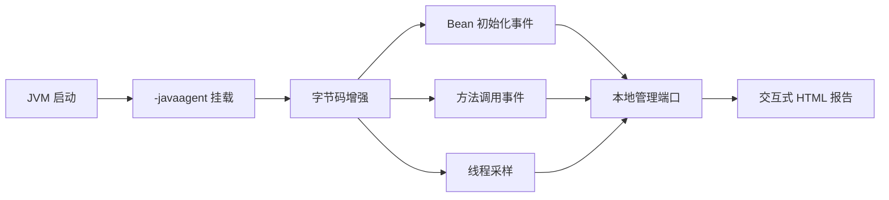

> 这篇笔记的目标不是泛泛讨论“Spring 为什么启动慢”，而是围绕 `spring-startup-analyzer` 这个工具本身，梳理它到底采了什么、报告应该怎么看、适合解决哪类启动问题，以及怎么把“看到卡点”真正变成一轮可验证的启动优化。

> 文中会重点区分 3 件容易混淆的事情：`Spring Boot` 自带的 `ApplicationStartup / actuator startup endpoint`、`spring-startup-analyzer` 生成的本地交互式报告，以及它提供的 `spring-async-bean-starter` 启动加速能力。前两者偏观测，后一者偏优化，不应混为一谈。

> 参考资料：
>
> 官方仓库：[linyimin0812/spring-startup-analyzer](https://github.com/linyimin0812/spring-startup-analyzer) 、 [README_ZH](https://raw.githubusercontent.com/linyimin0812/spring-startup-analyzer/main/README_ZH.md) 、 [Releases](https://github.com/linyimin0812/spring-startup-analyzer/releases)
>
> 示例项目：[linyimin0812/spring-startup-analyzer-demo](https://github.com/linyimin0812/spring-startup-analyzer-demo)
>
> 相关资料：[spring-boot-startup-report](https://github.com/maciejwalkowiak/spring-boot-startup-report) 、 [Spring Boot Actuator Startup Endpoint](https://docs.spring.io/spring-boot/docs/current/actuator-api/htmlsingle/#startup)

[TOC]

---

## 一、先给最短答案

如果只用一句话概括：

> `spring-startup-analyzer` 是一个通过 `Java Agent` 采集 Spring 应用启动阶段数据、生成本地交互式报告，并提供异步 Bean 初始化能力的启动诊断与优化工具。

它最有价值的地方，不在于“又多了一份启动日志”，而在于把原本分散在控制台、线程栈、Bean 初始化链路和类加载行为里的启动信息，整理成可以连续下钻的 3 类视角：

| 视角 | 回答的问题 | 对应能力 |
|------|------------|----------|
| `Bean` 视角 | 哪些 Bean 初始化最慢 | Bean 初始化详情、初始化时序图 |
| `方法` 视角 | 哪些方法在启动阶段被频繁调用、最耗时 | 方法调用次数与耗时统计 |
| `线程` 视角 | 启动时间主要耗在什么线程、什么调用栈上 | 启动阶段 wall clock 火焰图 |

如果团队已经遇到下面这些问题，这个工具通常会比较有用：

- 应用启动时间越来越长，但只知道“慢”，不知道慢在哪
- Bean 初始化链路复杂，单靠 `INFO` 日志很难还原顺序
- 三方包初始化耗时明显，但业务侧无法直接改源码
- Fat jar 过大、类路径扫描过多，怀疑启动时做了很多无效加载
- 想先把热点定位出来，再决定是改代码、改配置还是做异步化

---

## 二、它到底解决什么问题

Spring 应用启动慢，通常不是一个单点问题，而是几类问题叠加：

1. Bean 初始化本身耗时长
2. `@PostConstruct`、`initMethod`、XML Bean 初始化里做了重活
3. 类路径扫描、资源查找、自动装配判断过多
4. 启动线程阻塞在外部 IO、网络访问或大对象构建
5. 某些 Bean 并不影响对外提供服务，却被串行初始化拖慢全局启动

`spring-startup-analyzer` 的核心价值，可以概括成一句话：

> 它把“启动慢”拆成可观测对象，再把这些对象映射成可操作的优化动作。

这一步非常关键，因为很多启动优化失败，不是因为没有技巧，而是因为一开始没有搞清楚“时间到底耗在哪里”。

先看工具覆盖的主要诊断面：

| 诊断面 | 重点输出 | 更适合发现什么 |
|--------|----------|----------------|
| Bean 初始化详情 | Bean 名称、耗时、依赖根 Bean | 哪个 Bean 是启动热点 |
| Bean 初始化时序图 | 时间轴与并发/串行关系 | 启动链路是否被长任务串行阻塞 |
| 方法统计 | 方法调用次数、累计耗时 | 类加载、资源查找、反射、扫描的热点 |
| 未加载 Jar | 启动期间未真正使用的依赖 | Fat jar 是否可以瘦身 |
| 线程火焰图 | 启动期间线程 wall clock 轮廓 | 线程在做 CPU 计算还是在等待/阻塞 |

---

## 三、先分清它和 Spring Boot 自带能力的关系

很多人第一次看到这个名字时，会把它和 `Spring Boot 2.4+` 的 `ApplicationStartup` 或 `/actuator/startup` 混在一起。

这几个概念需要明确拆开：

| 项目或能力 | 采集方式 | 结果形式 | 更适合什么 |
|------------|----------|----------|------------|
| `ApplicationStartup / /actuator/startup` | Spring Boot 内建事件模型 | 启动步骤事件、JSON endpoint | 看官方启动 step 事件 |
| `spring-boot-startup-analyzer` | 读取 `/actuator/startup` 数据 | 浏览器分析页面 | 分析 Boot startup endpoint 输出 |
| `spring-startup-analyzer` | `Java Agent` 字节码增强 + profiler | 本地交互式 HTML 报告 + 启动优化能力 | 看 Bean、方法、线程、火焰图与异步 Bean 优化 |

可以先用一张图把关系放在一起看：


这一点决定了 `spring-startup-analyzer` 的观察视角更贴近运行时，而不是只依赖 Spring Boot 暴露出的 startup step 事件。

因此它更适合回答下面这类问题：

- 某个 `@PostConstruct` 为什么拖了十几秒
- 启动阶段到底是 Bean 构建慢，还是类扫描、资源查找慢
- 主线程之外有没有明显的等待或阻塞
- 哪些 Bean 可以考虑异步初始化

但它也有边界：

- 它不是通用线上性能分析平台
- 它不替代 `Arthas`、`async-profiler` 这类更泛化的诊断工具
- 它主要针对“应用启动阶段”而不是运行中请求性能

---

## 四、spring-startup-analyzer 是怎么工作的

官方 README 里提到的关键点，是它以 `agent` 方式启动，并对启动过程做字节码增强。

最值得记住的链路可以压缩成下面 4 步：

1. JVM 通过 `-javaagent` 挂载 `spring-profiler-agent.jar`
2. 工具在启动期增强目标类和方法，收集 Bean、方法、线程等事件
3. 应用启动完成后，生成本地可访问的交互式分析页
4. 根据报告定位热点，再决定是否启用异步 Bean 优化或进一步改代码

这条链路可以再细化成一张结构图：



### 4.1 工具如何判断“启动完成”

这一点官方说明得比较清楚，判断逻辑分成 3 层：

| 判断方式 | 适用范围 | 含义 |
|----------|----------|------|
| `SpringApplication.run` 退出 | `Spring Boot` 应用 | `run()` 退出时认为启动完成 |
| 健康检查 URL 返回 `200` | 所有 Spring 应用 | 轮询健康检查地址，成功即认为启动完成 |
| 超时兜底 | 所有场景 | 到达配置的超时时间后结束采集 |

因此：

- 对标准 `Spring Boot` 应用，默认体验通常更顺
- 对非 `Spring Boot` 应用，需要显式配置健康检查地址

### 4.2 它采集的重点不只是 Bean

只把它理解成“Bean 启动报告工具”是不够的。

因为从官方能力看，它至少覆盖了：

- Bean 初始化详情
- Bean 初始化时序
- 方法调用次数与耗时
- 未加载 Jar 统计
- 启动线程火焰图

这意味着它并不是只回答“哪个 Bean 最慢”，而是在尝试回答：

- 为什么这个 Bean 慢
- 是谁把它串在关键路径上
- 背后是不是扫描、反射、资源查找或外部调用导致

---

## 五、报告页面应该怎么看

如果只看一堆截图，往往还是不知道从哪里下手。更稳妥的方式，是先建立“页面和问题”的对应关系。

先看一张更接近真实产品页面的官方报告截图：


如果只是想先建立页面结构，再看一张简化示意图会更容易抓重点：


这套报告最适合按下面顺序阅读：

1. 先看总耗时与热点 Bean
2. 再看 Bean 初始化时间轴
3. 再看方法调用统计
4. 最后看线程火焰图与未加载 Jar

### 5.1 Bean 初始化详情

这是最常用的第一站。


它主要用来回答：

- 最慢的 Bean 是谁
- 初始化耗时到底有多长
- 它是不是其他 Bean 的根依赖

这一页最该关注的列通常是：

| 列 | 含义 | 用来判断什么 |
|----|------|--------------|
| `Bean Name` | Bean 名称 | 热点对象是谁 |
| `Init Duration` | 初始化耗时 | 是否值得进入优化清单 |
| `Root Bean` | 根 Bean 或依赖入口 | 它是不是关键链路上的对象 |
| `Type / Source` | Bean 来源 | 是业务 Bean 还是框架/三方包 Bean |

一个很实用的经验是：

- 如果慢的是业务 Bean，优先改代码或拆初始化逻辑
- 如果慢的是三方包 Bean，才优先考虑异步化或延后初始化

### 5.2 Bean 初始化时序图

这张图的价值，不在于“画得酷”，而在于它直接暴露串行阻塞。


例如下面这类现象最值得注意：

- 某个长条明显压在时间轴中间，后续大量 Bean 都只能等待
- 一串基础设施 Bean 提前初始化，导致业务 Bean 被整体后推
- 某个 Bean 虽然单看不算最慢，但它恰好处在关键路径上

也就是说：

> 单个耗时最长的 Bean，不一定是最该优化的 Bean；处在关键路径上的 Bean，影响可能更大。

### 5.3 方法调用次数与耗时统计

这个页面通常用来补 Bean 视角看不到的信息。


它更适合发现：

- 某个类加载或资源查找方法被频繁调用
- 某些反射、扫描、配置解析方法累计耗时异常高
- 启动慢不是 Bean 构建本身慢，而是外围工作做太多

最典型的一类案例是：

| 现象 | 可能问题 |
|------|----------|
| `findResource` 调用次数极高 | 类路径或资源扫描过多 |
| 配置解析方法耗时明显 | 配置源过多、解析逻辑复杂 |
| 反射相关方法频繁出现 | 自动装配判断或框架扩展较重 |

### 5.4 未加载 Jar

这个能力很容易被忽略，但工程价值并不低。


如果报告里能看出很多依赖 Jar 在启动阶段根本没被用到，至少说明两件事之一：

1. Fat jar 过度打包
2. 依赖治理还不够收敛

这类问题虽然未必每次都直接决定启动时间，但通常会影响：

- 类路径扫描范围
- 制品体积
- 容器分发与冷启动体验

### 5.5 启动线程 wall clock 火焰图

这是理解“启动时间花在哪一层调用栈”最直观的页面。

先看一张真正的火焰图报告截图：


火焰图最适合回答：

- 主线程到底在做什么
- 时间是耗在 CPU 计算，还是等待外部返回
- 是业务初始化逻辑慢，还是框架扫描和类加载慢

通常可以把火焰图读法记成下面这张表：

| 现象 | 更可能说明什么 |
|------|----------------|
| 某个栈特别宽 | 这段调用累计占了较多启动时间 |
| 宽度集中在 Bean 初始化方法 | Bean 自身逻辑慢 |
| 宽度集中在类加载/资源查找 | 类路径、扫描或依赖过重 |
| 宽度集中在网络或 IO 调用 | 启动期访问外部系统过多 |

---

## 六、最小接入方式怎么做

官方提供了手动安装和脚本安装两种方式，对 `Linux / macOS` 来说最省事的是脚本安装。

### 6.1 安装

```bash
curl -sS https://raw.githubusercontent.com/linyimin0812/spring-startup-analyzer/main/bin/install.sh | sh
```

默认安装目录通常是：

```bash
$HOME/spring-startup-analyzer
```

### 6.2 启动应用

这个工具本质上是 `Java Agent`，所以接入的核心动作只有一个：

- 给应用启动命令加上 `-javaagent`

最小示例如下：

```bash
java \
  -javaagent:$HOME/spring-startup-analyzer/lib/spring-profiler-agent.jar \
  -Dproject.name=demo-app \
  -Dspring-startup-analyzer.admin.http.server.port=8066 \
  -jar app.jar
```

如果在 `IDEA` 中启动，本质也是同一件事，只是把这些参数放进 `VM options`。

### 6.3 采集完成后怎么确认

官方说明里提到，启动结束后控制台和 `startup.log` 会输出类似信息：

```text
======= spring-startup-analyzer finished, click http://localhost:xxxx to visit details. ======
```

这句话很重要，因为它意味着：

- 采集已结束
- 报告页面已经可访问
- 可以开始做第一轮分析

---

## 七、几个关键配置怎么理解

虽然大多数配置都有默认值，但下面这些最值得先记住。

| 配置项 | 作用 | 什么时候优先改 |
|--------|------|----------------|
| `spring-startup-analyzer.app.health.check.timeout` | 启动完成检查超时，单位分钟 | 应用启动很慢，默认超时不够 |
| `spring-startup-analyzer.app.health.check.endpoints` | 启动成功检查 URL | 非 Spring Boot 或需要自定义健康检查 |
| `spring-startup-analyzer.admin.http.server.port` | 本地管理端口 | 避免端口冲突 |
| `spring-startup-analyzer.async.profiler.sample.thread.names` | 指定采样线程名 | 只想聚焦主线程或特定线程 |
| `spring-startup-analyzer.async.profiler.interval.millis` | profiler 采样间隔 | 希望提高或降低采样粒度 |
| `spring-startup-analyzer.linux.and.mac.profiler` | 指定火焰图采样器 | 调整为 `async_profiler` 或 `jvm_profiler` |

其中最常见的误区有两个：

### 7.1 忘了非 Boot 应用要配健康检查

如果不是标准 `Spring Boot` 应用，只依赖 `SpringApplication.run` 退出并不一定可靠。

这时更稳妥的方式是显式指定健康检查地址，例如：

```properties
spring-startup-analyzer.app.health.check.endpoints=http://127.0.0.1:8080/actuator/health
```

### 7.2 端口冲突导致以为工具没生效

工具会起一个本地管理端口，默认是 `8065`。

如果本机已经被占用，可能出现：

- Agent 实际已经工作
- 但页面访问失败
- 最终误判成“工具没采到数据”

所以第一次接入时，最好显式设置端口。

---

## 八、如何把报告变成一轮真实优化

真正有价值的，不是“生成过报告”，而是报告之后怎么行动。

比较实用的一条路径如下：

1. 先从 Bean 详情页找到耗时 Top N
2. 再用时序图确认这些 Bean 是否位于关键路径
3. 再用方法统计或火焰图确认慢点根因
4. 决定是改代码、删依赖、延迟初始化还是异步化
5. 再跑一轮采集，验证启动时间是否真正下降

这个闭环可以再压缩成一张图：


### 8.1 哪些场景优先改代码

如果慢点来自下面这些情况，优先级通常是“改代码”高于“做异步”：

- `@PostConstruct` 里做了远程调用
- Bean 初始化时同步加载大文件或全量缓存
- 启动期做了可以懒加载的预热
- 初始化逻辑里有明显低效算法或重复解析

原因很简单：

- 异步化只能缩短关键路径
- 不能消灭真实耗时

### 8.2 哪些场景可以考虑异步 Bean

官方建议也很明确：

- 优先对无法直接修改源码的二方包、三方包 Bean 再考虑异步化
- 对不被其他 Bean 依赖的 Bean，更适合异步化

从工程角度看，更适合异步化的对象通常有这些特点：

| 特征 | 为什么适合 |
|------|------------|
| 初始化耗时明显长 | 压缩关键路径收益更直接 |
| 不在核心依赖链上 | 不容易影响其他 Bean 使用 |
| 启动后短时间内不会被立即调用 | 不容易出现“还没初始化完就被访问” |
| 源码不在本团队控制范围 | 难以直接重构初始化逻辑 |

### 8.3 哪些场景要谨慎

下面这些情况不适合直接“看到慢就异步”：

- 该 Bean 是其他核心 Bean 的强依赖
- Bean 初始化中会注册必须立即生效的资源
- 启动完成后立刻就会被调用
- 初始化逻辑不是幂等的，异步后有并发风险

因此：

> 异步 Bean 不是通用加速开关，而是对关键路径进行工程性裁剪。

---

## 九、异步 Bean 优化能力怎么用

`spring-startup-analyzer` 除了看报告，还提供了 `spring-async-bean-starter`，用于异步执行初始化耗时长的 Bean。


### 9.1 支持哪些类型

官方 README 里明确提到，支持的初始化方式包括：

| 类型 | 说明 |
|------|------|
| `@Bean(initMethod = "...")` | 支持 `initMethod` 方式初始化 |
| `@PostConstruct` | 支持组件初始化方法异步化 |
| `@ImportResource` | 支持 XML 方式定义的 Bean 初始化 |

### 9.2 接入依赖

```xml
<dependency>
    <groupId>io.github.linyimin0812</groupId>
    <artifactId>spring-async-bean-starter</artifactId>
    <version>${latest_version}</version>
</dependency>
```

### 9.3 核心配置

```properties
spring-startup-analyzer.boost.spring.async.bean-priority-load-enable=true
spring-startup-analyzer.boost.spring.async.bean-names=testBean,testComponent
spring-startup-analyzer.boost.spring.async.init-bean-thread-pool-core-size=8
spring-startup-analyzer.boost.spring.async.init-bean-thread-pool-max-size=8
```

这些配置可以理解成：

| 配置 | 含义 |
|------|------|
| `bean-priority-load-enable` | 尽量让异步化 Bean 更早进入初始化队列 |
| `bean-names` | 指定需要异步初始化的 Bean |
| `thread-pool-core-size/max-size` | 执行异步初始化的线程池大小 |

### 9.4 如何验证是否真的异步化

不要只看总启动时间，最好同时看工具日志。

官方说明里给出的验证点是：

```text
$HOME/spring-startup-analyzer/logs/async-init-bean.log
```

如果异步化成功，会写出类似日志：

```text
async-init-bean, beanName: ${beanName}, async init method: ${initMethodName}
```

这一步很重要，因为它能避免一种常见误判：

- 配置写了
- 但 Bean 名称不对或路径不对
- 最后其实没有任何异步化发生

---

## 十、一个更贴近实战的分析顺序

假设某个 Spring Boot 服务从 `18s` 涨到 `45s`，更推荐按下面顺序分析：

### 第一步：先看 Bean Top N

目的是回答：

- 是不是出现了新的慢 Bean
- 慢点主要在业务 Bean 还是框架 Bean

### 第二步：再看时间轴

目的是回答：

- 这些慢 Bean 是否在关键路径上
- 启动是不是被一两个串行长任务卡住

### 第三步：看方法统计

目的是回答：

- 是 Bean 自己慢，还是外围扫描/查找/反射慢
- 是否出现类路径扫描过多的问题

### 第四步：看火焰图

目的是回答：

- 时间到底压在哪个线程和调用栈
- 是否存在启动期外部依赖阻塞

### 第五步：决定优化动作

通常动作可以收敛成 4 类：

| 动作 | 适合场景 |
|------|----------|
| 改初始化代码 | 业务 Bean 自身逻辑慢 |
| 延迟初始化或按需加载 | 启动即全量加载并无必要 |
| 异步 Bean 初始化 | 三方 Bean 或非关键依赖 Bean 过慢 |
| 删除无用依赖 | 类路径扫描、包体、资源查找负担大 |

---

## 十一、自定义扩展能力怎么理解

这个工具不只是一个固定报表生成器，它还允许扩展采集能力。

官方扩展机制的核心接口是 `EventListener`，思路可以概括成：

1. 指定要增强的类和方法
2. 指定监听进入或退出事件
3. 在事件回调里记录自定义统计
4. 打包成扩展 jar，放到工具扩展目录

这意味着可以做一些非常有针对性的启动诊断，例如：

- 统计某个类加载方法在启动阶段被调用了多少次
- 统计某个配置解析方法总耗时
- 统计某段框架扩展逻辑是否被频繁触发

这类能力的价值在于：

- 工具默认报告解决的是“通用问题”
- SPI 扩展解决的是“项目特有问题”

如果某个系统的启动慢点长期集中在自研框架或内部组件上，这个扩展点会很有用。

---

## 十二、使用它时最容易踩的坑

### 12.1 只看慢 Bean，不看依赖关系

慢 Bean 不一定该先处理。

如果它不在关键路径上，或者启动完成后并不影响首个请求，那收益可能没有想象中大。

### 12.2 一上来就做异步化

这通常不是最优路径。

更稳妥的顺序应该是：

1. 先定位
2. 再区分“能改代码”还是“不能改代码”
3. 最后才考虑异步化

### 12.3 忽略启动期外部依赖

如果某个 Bean 在 `init` 阶段访问数据库、配置中心、对象存储或第三方接口，火焰图往往会比 Bean 表格更早暴露问题本质。

### 12.4 报告只跑一次就下结论

启动优化一定要做前后对比。

至少建议保留：

- 优化前一份报告
- 优化后一份报告
- 启动总耗时对比
- Hotspot Bean 变化对比

否则很容易出现“改了很多，但收益很模糊”的情况。

---

## 十三、适合什么团队，不适合什么团队

| 场景 | 适合度 | 原因 |
|------|--------|------|
| 中大型 Spring Boot 服务，启动慢且链路复杂 | 很适合 | Bean、方法、线程三层视角都能派上用场 |
| 依赖较多、Fat jar 较大、自动装配复杂的老项目 | 很适合 | 报告能帮助拆出热点和无效依赖 |
| 只想偶尔看看 Boot startup endpoint | 一般 | 更轻量的 `/actuator/startup` 分析工具可能已经足够 |
| 非 Spring 体系应用 | 不适合 | 工具目标场景就是 Spring 启动过程 |

更直接一点说：

- 如果问题是“Spring 启动为什么越来越慢”，它很有价值
- 如果问题是“线上某个接口 RT 高”，它就不是第一选择

---

## 十四、小结

这篇笔记最该带走的结论，可以浓缩成下面几条：

1. `spring-startup-analyzer` 的核心价值是把 Spring 启动慢拆成 Bean、方法、线程 3 个可观察视角。
2. 它不是 `Spring Boot /actuator/startup` 的前端壳，而是基于 `Java Agent` 的启动期运行时分析工具。
3. 报告最推荐的阅读顺序是：`Bean 详情 -> 时序图 -> 方法统计 -> 火焰图 -> 未加载 Jar`。
4. 真正有效的优化闭环不是“看完报告”，而是“定位热点 -> 选择动作 -> 再采一次验证收益”。
5. 异步 Bean 初始化适合处理初始化耗时长、但不在强依赖关键链路上的 Bean，不应该当成默认加速按钮。
6. 如果系统里还有大量三方包初始化、类路径扫描和 fat jar 压力，这个工具通常会比单纯翻启动日志更快给出方向。
