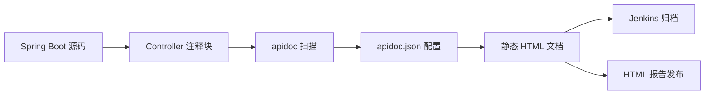
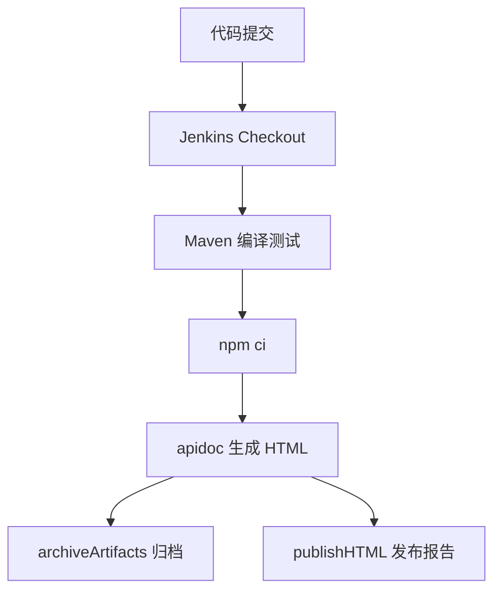

> 这篇笔记的目标是把 `apidoc` 放到 `Spring Boot` 项目里按工程化方式重新理解一遍：它到底适合解决什么问题，和 `springdoc / Swagger`、`Spring REST Docs` 有什么差异，注释应该写到什么粒度，生成链路如何放进 `Jenkins`，以及怎样把“接口文档”真正变成持续交付流程中的一个构建产物。

> 文中重点不是泛泛介绍“如何安装一个文档工具”，而是围绕一个典型的后端团队场景展开：业务接口持续迭代、测试和前端要查文档、Jenkins 负责统一构建、希望每次主干构建后都能产出一份可浏览的静态 HTML 文档。`apidoc` 在这个场景下的价值，核心不在于“炫技式在线调试”，而在于它是静态生成、无运行时侵入、便于归档和发布；同时也会单独说明它的边界，因为在 Spring Boot 生态里，`apidoc` 并不是默认首选方案。

> 参考资料：

> apidoc 官方资料：[APIDOC Official Site](https://apidocjs.com/) 、 [APIDOC Params](https://apidocjs.com/#params)

> Spring / Dubbo 资料：[Spring Boot Reference Documentation](https://docs.spring.io/spring-boot/docs/2.7.18/reference/htmlsingle/) 、 [Apache Dubbo Spring Boot](https://dubbo.apache.org/en/overview/mannual/java-sdk/tasks/develop/springboot/) 、 [Apache Dubbo Lightweight Java SDK](https://dubbo.apache.org/en/overview/mannual/java-sdk/tasks/framework/lightweight-rpc/)

> JetBrains / IDEA 插件：[apiDoc Plugin for IntelliJ IDEA](https://plugins.jetbrains.com/plugin/11580-apidoc/versions/stable/106736)

> Jenkins 资料：[Jenkins Pipeline Syntax](https://www.jenkins.io/doc/book/pipeline/syntax/) 、 [Jenkins archiveArtifacts Step](https://www.jenkins.io/doc/pipeline/steps/core/#archiveartifacts-archive-the-artifacts) 、 [Jenkins HTML Publisher Plugin](https://www.jenkins.io/doc/pipeline/steps/htmlpublisher/)

[TOC]

---

## 一、先回答几个关键问题

如果把这篇笔记压缩成几个核心问题，其实主要就是下面这些：

1. `apidoc` 到底是什么，它和 `Swagger UI` 这种运行时文档有什么区别？
2. 为什么在 `Spring Boot` 项目里还会有人选择 `apidoc`？
3. 注释式接口文档到底应该写到什么程度，才不会沦为重复劳动？
4. 怎样把文档生成动作放进 `Jenkins`，让它和编译、测试、归档一起执行？
5. 这个方案适合什么团队，不适合什么团队？

如果先给一句结论，可以概括为：

> `apidoc` 本质上是一个基于源码注释扫描的静态 API 文档生成器。它不依赖应用启动时反射控制器，也不要求暴露 `/v3/api-docs` 这类运行时端点，而是通过约定格式的注释块把接口说明直接编译成一套 HTML 静态站点。

这个结论带来两个非常重要的推论：

- 它的优势在于静态、轻量、生成结果稳定，特别适合放进 CI/CD 流程中归档
- 它的代价在于文档质量高度依赖人工维护注释，注释和代码一旦脱节，文档就会过期

所以理解 `apidoc` 的关键，不是把它当成“接口平台”，而是把它当成“源码旁路的静态文档构建器”。

---

## 二、为什么在 Spring Boot 里还要看 apidoc

在 Java 后端团队里，接口文档一般更常见的是这三类方案：

1. `springdoc-openapi + Swagger UI`
2. `Spring REST Docs`
3. `apidoc`

它们解决的问题并不完全一样。

| 方案 | 文档来源 | 是否依赖应用启动 | 产物形态 | 优势 | 主要短板 |
|------|----------|------------------|----------|------|----------|
| `springdoc-openapi` | 注解 + 运行时扫描 | 是 | OpenAPI + Swagger UI | 集成 Spring Boot 自然，调试体验好 | 依赖运行中应用，偏在线化 |
| `Spring REST Docs` | 测试用例 + 片段生成 | 通常需要测试执行 | AsciiDoc/HTML | 文档与测试强绑定，准确性高 | 初始接入成本更高 |
| `apidoc` | 源码注释 | 否 | 静态 HTML | 静态构建简单，适合归档与发布 | 需要人工维护注释，约束弱时容易过期 |

如果只看 Spring Boot 生态主流程度，`springdoc` 往往更自然；如果只看“文档必须和测试结果绑定”，`Spring REST Docs` 会更稳。

那为什么还要选 `apidoc`？

通常是下面几种现实原因：

- 团队需要一份独立于运行环境的静态文档，便于直接挂到 Jenkins、Nginx 或制品库
- 不希望为了查看文档而启动服务或开放文档接口
- 项目已经有清晰的接口注释习惯，希望用较低成本沉淀成可浏览文档
- 文档产物更像“版本化的发布说明”，而不是在线调试入口

换句话说，`apidoc` 更像“构建阶段生成的接口说明书”，而不是“运行阶段暴露的接口浏览器”。

---

## 三、apidoc 的工作方式到底是什么

`apidoc` 的工作链路可以压缩成下面这张图：



从机制上看，它主要做三件事：

1. 扫描指定目录下的源码文件
2. 提取符合 `@api` 语法的注释块
3. 按模板生成一套静态页面

这里最容易误解的一点是：

> `apidoc` 不理解 Spring MVC 的真实路由匹配逻辑，它只理解你写在注释里的文档结构。

因此它不会自动推断：

- `@Validated` 约束对应的业务错误码
- 复杂泛型响应体的真实字段语义
- 运行时拦截器追加的请求头
- Spring Security 的鉴权流程

这些信息如果想体现在文档里，要么靠人工注释补全，要么借助统一的 `@apiDefine`、`@apiUse` 做复用。

---

## 四、Spring Boot 中怎么落地 apidoc

### 4.1 最小接入思路

`apidoc` 本身是一个 `Node.js` 工具，和 `Spring Boot` 并不直接耦合。最常见的做法是：

1. Java 工程继续使用 `Maven` 或 `Gradle`
2. 在项目根目录额外放一个 `package.json`
3. 通过 `npm` 或 `npx` 执行 `apidoc`
4. 让生成目录进入 `docs/`、`build/` 或 `target/`

一个常见的目录组织方式如下：

```text
order-service
├── src/main/java
│   └── com/example/order/controller
├── apidoc
│   ├── apidoc.json
│   └── header.md
├── package.json
└── Jenkinsfile
```

这里建议把 `apidoc` 的配置文件和自定义页头、页脚放到单独目录，而不是散落在项目根目录，原因很简单：

- 配置更集中
- CI 命令更清晰
- 后续做多模块扫描时更容易扩展

### 4.2 package.json 示例

```json
{
  "name": "order-service-apidoc",
  "private": true,
  "devDependencies": {
    "apidoc": "^1.2.0"
  },
  "scripts": {
    "docs:build": "apidoc -i src/main/java -o build/apidoc -c apidoc"
  }
}
```

上面这个定义有两个工程化上的好处：

- 本地和 Jenkins 使用同一条命令，减少“本地能跑、CI 不能跑”的偏差
- `apidoc` 版本固定在项目内，而不是依赖某台机器的全局安装

### 4.3 apidoc.json 示例

```json
{
  "name": "Order Service API",
  "version": "1.0.0",
  "description": "Spring Boot 订单服务接口文档",
  "title": "Order Service apidoc",
  "url": "https://api.example.com",
  "sampleUrl": "https://api.example.com",
  "template": {
    "forceLanguage": "zh_cn",
    "withCompare": true,
    "withGenerator": true
  }
}
```

这里可以注意两个点：

- `url` 和 `sampleUrl` 最好写成真实环境或网关前缀，不要直接照抄本地 `localhost`
- 如果存在多环境，建议把这里的地址写成网关统一入口，而不是具体机器地址

### 4.4 注释到底写在哪里

先直接回答一个很关键的问题：

> `apidoc` 不是只能写在 `Controller` 层。它本质上只是扫描源码注释，所以理论上写在任意能被扫描到的 `Java` 文件里都可以；但从文档契约的清晰度来看，它最适合放在“对外协议边界层”，而不是任意业务实现层。

在 `Spring Boot` 里，最稳妥的方式通常是把 `apidoc` 注释放在 `Controller` 方法上方，原因是这一层和 HTTP 语义最接近：

- 路径明确
- 请求方式明确
- 请求参数和响应语义最集中
- 前后端协作主要也围绕这一层展开

如果是典型的 `Spring MVC` / `Spring Boot Web` 应用，可以继续坚持一个简单原则：

- 对外是 HTTP 接口，就优先写在 `Controller`

不建议把 `apidoc` 注释默认写在：

- `Service` 实现类
- `Feign` 客户端接口
- `Mapper` 层

这些位置虽然也能写，但会让文档层级和 HTTP 入口脱节。

### 4.5 如果不是 Controller，而是 Dubbo 应用怎么办

这正是 `apidoc` 容易让人困惑的地方。

如果应用不是对外暴露 HTTP，而是一个纯 `Dubbo Provider`，那“文档应该写在哪里”就不能再照搬 `Controller` 思路，而应该改成：

- 文档写在 **RPC 契约层**
- 对 `Dubbo` 来说，这个契约层通常就是 **service interface**

原因很简单：

1. `Dubbo` 的调用双方共享的是接口契约，不是实现类
2. Provider 真正暴露出去的是接口方法签名和入参出参语义
3. 实现类可能有多个版本，也可能夹带内部实现细节，不适合作为文档主入口

可以先把几种常见放置位置横向对比一下：

| 放置位置 | Spring MVC 场景 | Dubbo 场景 | 是否推荐 | 原因 |
|----------|------------------|------------|----------|------|
| `Controller` | 很适合 | 不适用或不完整 | 视场景而定 | 只适合描述 HTTP 边界 |
| `Service` 接口 | 一般不作为 HTTP 文档主入口 | 很适合 | 推荐用于 Dubbo | 这里才是 RPC 契约 |
| `Service` 实现类 | 不推荐 | 一般不推荐 | 不推荐 | 容易混入实现细节，且不是共享契约 |
| `Feign` / `Reference` 调用端 | 不推荐 | 不推荐 | 不推荐 | 它是消费方视角，不是服务定义本身 |

如果一句话概括：

> `HTTP` 文档优先写在 `Controller`，`Dubbo` 文档优先写在共享 `service interface`；两者本质上都不是“写在哪一层”，而是“写在真正定义外部契约的那一层”。

### 4.6 Dubbo 写在 service 接口层能不能行

答案是：**能行，而且在很多 Dubbo 项目里这是更合理的做法。**

但这里要补一个边界：

> 能行，不等于“写在任意 Service 都合适”；更准确地说，是应该写在“对外暴露的 RPC 接口”上，而不是写在本地业务 Service、内部装配 Service、领域 Service 上。

一个典型的 Dubbo 项目通常会拆成：

```text
order-service
├── order-api
│   └── OrderQueryDubboService.java
├── order-provider
│   └── OrderQueryDubboServiceImpl.java
└── order-consumer
    └── OrderFacade.java
```

这时最合适的文档放置点通常是：

- `order-api` 模块中的 `OrderQueryDubboService.java`

而不是：

- `order-provider` 里的 `OrderQueryDubboServiceImpl.java`

因为前者才是 Provider 和 Consumer 共同依赖的接口定义。

### 4.7 Dubbo 场景下为什么不优先写在实现类

实现类当然也能被 `apidoc` 扫到，但它有三个明显问题：

1. 文档和共享契约分离，Consumer 侧看不到最权威的定义
2. 一个接口可能存在多个 Provider 实现，文档会变得含混
3. 实现类容易加入事务、缓存、降级、日志等实现细节，污染协议文档

所以如果是 Dubbo 场景，比较稳妥的经验通常是：

- **写在 API interface**
- **实现类只保留业务实现，不承担主文档职责**

### 4.8 Dubbo 接口怎么写 apidoc

这里还要再区分两类情况。

#### 情况一：Dubbo 只是内部 RPC，不直接对前端开放

这时 `apidoc` 写的不是 HTTP 页面接口，而是 RPC 契约文档。做法上可以使用一个约定化的“伪路径”或“方法路径”来表达调用目标，例如：

```java
public interface OrderQueryDubboService {

    /**
     * @api {dubbo} OrderQueryDubboService/getDetail 查询订单详情
     * @apiName GetOrderDetailByDubbo
     * @apiGroup Dubbo-Order
     * @apiVersion 1.0.0
     * @apiDescription Dubbo 服务：按订单 ID 查询订单详情，供订单聚合服务、售后服务调用。
     *
     * @apiParam {Long} orderId 订单 ID
     *
     * @apiSuccess {Long} id 订单 ID
     * @apiSuccess {String} orderNo 订单编号
     * @apiSuccess {BigDecimal} amount 订单金额
     * @apiSuccess {Integer} status 订单状态
     *
     * @apiError {String} code 错误码
     * @apiError {String} message 错误描述
     */
    OrderDetailDTO getDetail(Long orderId);
}
```

这里要注意一点：

`OrderQueryDubboService/getDetail` 这种写法不是 Dubbo 真实 URL，而是一种文档约定，目的是让页面里能稳定表达“哪个服务的哪个方法”。它更像“方法标识”，不是 HTTP 路由。

#### 情况二：Dubbo 基于 Triple/网关，对外也存在 HTTP 访问语义

如果你的服务最终会通过网关、Triple、HTTP 映射等方式被外部系统直接调用，那么文档最好还是分两层：

- 外部调用文档：写 HTTP / 网关入口
- 内部 RPC 文档：写 Dubbo interface

不要把这两层强行揉成一份文档，否则会混淆：

- 调用入口到底是 `/api/orders/{id}` 还是 `OrderQueryDubboService/getDetail`
- 鉴权头到底是网关头还是 RPC 附件
- 错误码到底是网关语义还是 Provider 业务语义

### 4.9 Dubbo 场景下该怎么组织扫描目录

如果文章前面 `apidoc` 的扫描目录只写 `src/main/java`，在 Dubbo 多模块项目里往往还不够，通常更适合按契约模块扫描。

例如：

```json
{
  "scripts": {
    "docs:build": "apidoc -i order-api/src/main/java -o build/apidoc -c apidoc"
  }
}
```

如果一个仓库里同时有多个 RPC 接口模块，也可以把多个模块统一纳入扫描范围，但原则仍然不变：

- 优先扫描 API 契约模块
- 不要默认以实现模块作为唯一文档源

### 4.10 一个更稳的判断标准

与其死记“写在 Controller 还是 Service”，不如记下面这个判断标准：

| 问题 | 如果答案是“是” | 说明适合写 apidoc |
|------|----------------|------------------|
| 这一层是否定义了对外调用契约？ | 是 | 适合 |
| 调用方是否直接依赖这一层的签名或协议？ | 是 | 适合 |
| 这一层是否混入大量内部实现细节？ | 是 | 不适合 |
| 这一层是否只是内部编排，不直接暴露给调用方？ | 是 | 不适合 |

所以最后可以把结论落成一句：

> `apidoc` 不只服务于 `Controller`；它服务的是“对外契约层”。在 `Spring MVC` 里这个层通常是 `Controller`，在 `Dubbo` 里这个层通常是共享 `service interface`。

### 4.11 IDEA 插件可以怎么配合 apidoc

除了命令行方式，`IntelliJ IDEA` 插件市场里也有现成的 `apiDoc` 插件，可以作为本地开发时的辅助工具使用。

这一类插件的价值通常在于：

- 方便在 IDE 内快速跳转、查看或辅助维护注释
- 降低“每次都回终端执行一次命令”的切换成本
- 让本地编写 `apidoc` 注释时更顺手

但从工程角度看，这里最好区分“辅助工具”和“最终标准”：

| 维度 | IDEA 插件 | CLI / Jenkins |
|------|-----------|---------------|
| 使用场景 | 本地开发辅助 | 团队统一生成与发布 |
| 环境一致性 | 依赖个人 IDE 配置 | 更容易在团队内统一 |
| 最终产物可信度 | 只适合本地预览或辅助 | 应作为最终文档生成标准 |
| 自动化能力 | 较弱 | 强，适合 CI/CD |

所以更稳的实践通常是：

- 本地可以装 `apiDoc` 插件提升编辑体验
- 真正进入交付链路时，仍然以 `npm run docs:build` 和 `Jenkins` 流程为准

如果团队成员使用的 IDE 不完全一致，这个原则尤其重要。否则很容易出现：

- A 同学通过插件看到的效果和 B 同学不同
- 本地插件可用，但 CI 产物没有同步更新
- 团队最后还是要回到命令行结果来对齐

换句话说，IDEA 插件更适合作为“本地辅助层”，而不是“文档生成真相源”。

---

## 五、常用注释标签怎么理解

下面这个表格可以先建立一个最常用的心智模型：

| 标签 | 作用 | 在 Spring Boot 中的典型用途 |
|------|------|------------------------------|
| `@api` | 定义请求方法与路径 | 标识 `GET /orders/{id}` 这类接口入口 |
| `@apiName` | 定义接口唯一名称 | 生成页面锚点，便于区分同组接口 |
| `@apiGroup` | 接口分组 | 常按业务域如 `Order`、`User` 分组 |
| `@apiDescription` | 描述接口用途 | 解释业务动作，不只重复方法名 |
| `@apiParam` / `@apiBody` | 描述路径、查询或请求体参数 | 标明字段类型、必填性、含义 |
| `@apiSuccess` | 描述成功响应字段 | 说明响应结构和业务字段含义 |
| `@apiError` | 描述失败响应 | 统一异常码和失败场景 |
| `@apiHeader` | 描述请求头 | 适合 `Authorization`、租户头等 |
| `@apiExample` | 请求示例 | 给出 curl 或 JSON 样例 |
| `@apiVersion` | 版本标记 | 适合接口升级或兼容多版本 |
| `@apiDefine` / `@apiUse` | 公共片段复用 | 复用统一鉴权头、公共响应结构 |

真正有价值的写法，不是把所有标签都堆上去，而是回答清楚三个问题：

1. 调这个接口要传什么
2. 正常返回什么
3. 失败时会因为什么报错

如果这三件事都没讲清楚，页面再漂亮也只是“空心文档”。

---

## 六、一个 Spring Boot 接口的实际写法

下面用一个订单查询接口举例。

先假设控制器如下：

```java
@RestController
@RequestMapping("/api/orders")
public class OrderController {

    private final OrderApplicationService orderApplicationService;

    public OrderController(OrderApplicationService orderApplicationService) {
        this.orderApplicationService = orderApplicationService;
    }

    /**
     * @api {get} /api/orders/{orderId} 查询订单详情
     * @apiName GetOrderDetail
     * @apiGroup Order
     * @apiVersion 1.0.0
     * @apiDescription 按订单号查询订单详情，返回订单主信息、金额和状态。
     *
     * @apiHeader {String} Authorization Bearer token
     *
     * @apiParam {Long} orderId 订单 ID
     *
     * @apiSuccess {String} code 响应码，成功时固定为 0
     * @apiSuccess {String} message 响应消息
     * @apiSuccess {Object} data 业务数据
     * @apiSuccess {Long} data.id 订单 ID
     * @apiSuccess {String} data.orderNo 订单编号
     * @apiSuccess {BigDecimal} data.amount 订单金额
     * @apiSuccess {String} data.status 订单状态，取值为 CREATED、PAID、CANCELLED
     *
     * @apiError {String} code 响应码
     * @apiError {String} message 错误描述
     *
     * @apiSuccessExample {json} Success-Response:
     * HTTP/1.1 200 OK
     * {
     *   "code": "0",
     *   "message": "success",
     *   "data": {
     *     "id": 1024,
     *     "orderNo": "SO202606230001",
     *     "amount": 99.50,
     *     "status": "PAID"
     *   }
     * }
     *
     * @apiErrorExample {json} Error-Response:
     * HTTP/1.1 404 Not Found
     * {
     *   "code": "ORDER_NOT_FOUND",
     *   "message": "订单不存在"
     * }
     */
    @GetMapping("/{orderId}")
    public CommonResponse<OrderDetailVO> getOrderDetail(@PathVariable Long orderId) {
        return CommonResponse.success(orderApplicationService.getDetail(orderId));
    }
}
```

这个写法有几个值得强调的点：

- 文档路径最好写完整路径，不要只写相对片段，避免多层 `@RequestMapping` 时读者自己拼接
- 响应结构不要只写 `data`，要把前端真正关心的字段也展开
- 错误响应不要偷懒只写“系统异常”，至少把最常见的业务失败场景标出来

### 6.1 复杂请求体的写法

如果是创建订单这种 `POST` 接口，可以这样写：

```java
/**
 * @api {post} /api/orders 创建订单
 * @apiName CreateOrder
 * @apiGroup Order
 * @apiVersion 1.0.0
 * @apiDescription 创建一个新订单，请求体包含用户 ID、商品列表和配送地址。
 *
 * @apiHeader {String} Authorization Bearer token
 *
 * @apiBody {Long} userId 用户 ID
 * @apiBody {Object[]} items 商品明细
 * @apiBody {Long} items.skuId 商品 SKU ID
 * @apiBody {Integer} items.quantity 购买数量
 * @apiBody {String} address 收货地址
 *
 * @apiSuccess {String} code 响应码
 * @apiSuccess {String} message 响应消息
 * @apiSuccess {Object} data 业务数据
 * @apiSuccess {Long} data.id 新建订单 ID
 * @apiSuccess {String} data.orderNo 新建订单编号
 */
```

这里最大的经验是：

> DTO 再复杂，文档也不能只写“见 `CreateOrderRequest` 类”。`apidoc` 不是运行时 schema 推导工具，它不会像 OpenAPI 那样自动展开对象结构，所以关键字段必须人工写出来。

---

## 七、复用公共文档片段比重复堆注释更重要

一旦项目接口数量多起来，最先失控的不是生成命令，而是重复注释。

比如所有接口都要求：

- `Authorization` 请求头
- 统一响应结构 `code/message/data`
- 分页接口返回固定分页字段

这时应该使用 `@apiDefine` 和 `@apiUse`。

### 7.1 定义公共片段

```java
/**
 * @apiDefine AuthHeader
 * @apiHeader {String} Authorization Bearer token
 */

/**
 * @apiDefine CommonSuccess
 * @apiSuccess {String} code 响应码，成功时固定为 0
 * @apiSuccess {String} message 响应消息
 * @apiSuccess {Object} data 业务数据
 */
```

### 7.2 在接口上复用

```java
/**
 * @api {get} /api/orders/{orderId} 查询订单详情
 * @apiName GetOrderDetail
 * @apiGroup Order
 * @apiUse AuthHeader
 * @apiUse CommonSuccess
 */
```

这样做的意义不只是“少写几行字”，而是让文档结构和接口规范真正统一起来。否则每个接口都手写一遍，很快就会出现同一个 `Authorization` 头被写成三种格式的情况。

### 7.3 更贴近现有项目的统一返回体、鉴权头、分页风格

如果把场景进一步贴近常见的业务后台项目，很多团队实际用的并不是最简单的：

- 一个 `Authorization` 头
- 一个 `code/message/data` 响应

而是更接近下面这种风格：

| 维度 | 常见做法 | 文档里要写清什么 |
|------|----------|------------------|
| 鉴权 | `Authorization: Bearer xxx` | token 类型、是否必传、失效时返回码 |
| 链路追踪 | `X-Trace-Id` | 是否可透传、谁生成 |
| 多租户 | `X-Tenant-Id` | 哪些后台接口必传 |
| 统一响应 | `code/message/success/data/requestId` | 成功失败语义，不只写 `data` |
| 分页列表 | `data.records/total/pageNum/pageSize/pages` | 字段名必须和前端约定一致 |

如果项目本身就是后台管理系统、商家中台或者运营平台，那么 `apidoc` 最值得抽象的，通常正是这些“跨接口重复出现的协议层字段”。

### 7.4 一套更像真实后台项目的公共定义

可以先把公共片段定义成下面这样：

```java
/**
 * @apiDefine AdminAuthHeader
 * @apiHeader {String} Authorization Bearer access token
 * @apiHeader {String} X-Trace-Id 链路追踪 ID，便于日志排查
 * @apiHeader {String} X-Tenant-Id 租户 ID，多租户后台场景必传
 */

/**
 * @apiDefine CommonResult
 * @apiSuccess {Integer} code 业务响应码，0 表示成功
 * @apiSuccess {Boolean} success 是否成功
 * @apiSuccess {String} message 响应消息
 * @apiSuccess {String} requestId 服务端生成的请求 ID
 * @apiSuccess {Object} data 业务数据
 */

/**
 * @apiDefine PageResult
 * @apiSuccess {Object} data 分页结果
 * @apiSuccess {Object[]} data.records 当前页数据列表
 * @apiSuccess {Long} data.total 总条数
 * @apiSuccess {Integer} data.pageNum 当前页码
 * @apiSuccess {Integer} data.pageSize 每页条数
 * @apiSuccess {Integer} data.pages 总页数
 */

/**
 * @apiDefine CommonError
 * @apiError {Integer} code 错误码
 * @apiError {Boolean} success 是否成功，失败时固定为 false
 * @apiError {String} message 错误消息
 * @apiError {String} requestId 请求 ID
 */
```

这一层的核心在于：先把“每个接口都重复出现的壳”抽出来，再让具体接口只描述自己的业务字段。

### 7.5 后台分页接口的实际写法

下面用一个更贴近中后台项目的“订单分页查询”接口来举例：

```java
/**
 * @api {get} /api/admin/orders 分页查询订单
 * @apiName PageQueryOrder
 * @apiGroup Admin-Order
 * @apiVersion 1.0.0
 * @apiDescription 按订单号、状态、时间范围分页查询订单列表，适用于运营后台和客服后台。
 *
 * @apiUse AdminAuthHeader
 * @apiUse CommonResult
 * @apiUse PageResult
 * @apiUse CommonError
 *
 * @apiQuery {Integer} pageNum 页码，从 1 开始
 * @apiQuery {Integer} pageSize 每页条数，常用 10、20、50
 * @apiQuery {String} [orderNo] 订单号，支持精确查询
 * @apiQuery {Integer} [status] 订单状态，0-待支付，1-已支付，2-已取消，3-已完成
 * @apiQuery {String} [userId] 用户 ID
 * @apiQuery {String} [startTime] 创建开始时间，格式 `yyyy-MM-dd HH:mm:ss`
 * @apiQuery {String} [endTime] 创建结束时间，格式 `yyyy-MM-dd HH:mm:ss`
 *
 * @apiSuccess {Object[]} data.records 当前页列表
 * @apiSuccess {Long} data.records.id 订单 ID
 * @apiSuccess {String} data.records.orderNo 订单编号
 * @apiSuccess {Long} data.records.userId 下单用户 ID
 * @apiSuccess {BigDecimal} data.records.payAmount 支付金额
 * @apiSuccess {Integer} data.records.status 订单状态
 * @apiSuccess {String} data.records.createTime 创建时间
 *
 * @apiSuccessExample {json} Success-Response:
 * HTTP/1.1 200 OK
 * {
 *   "code": 0,
 *   "success": true,
 *   "message": "success",
 *   "requestId": "f8b0bdb2d43a4f56",
 *   "data": {
 *     "records": [
 *       {
 *         "id": 1024,
 *         "orderNo": "SO202606230001",
 *         "userId": 20001,
 *         "payAmount": 99.50,
 *         "status": 1,
 *         "createTime": "2026-06-23 10:30:00"
 *       }
 *     ],
 *     "total": 128,
 *     "pageNum": 1,
 *     "pageSize": 20,
 *     "pages": 7
 *   }
 * }
 *
 * @apiErrorExample {json} Error-Response:
 * HTTP/1.1 401 Unauthorized
 * {
 *   "code": 40101,
 *   "success": false,
 *   "message": "登录状态已失效",
 *   "requestId": "f8b0bdb2d43a4f56"
 * }
 */
@GetMapping("/api/admin/orders")
public CommonResponse<PageResult<OrderPageVO>> pageQuery(OrderPageQuery query) {
    return CommonResponse.success(orderQueryService.pageQuery(query));
}
```

这个例子比前面的“查询单个订单详情”更贴近实际项目，主要体现在三点：

- 它包含后台列表页最常见的分页协议
- 它显式体现了多租户、鉴权和链路追踪头
- 它把运营后台真正关心的筛选条件和返回字段展开了

如果团队长期维护的是中后台接口，那么建议优先把“分页查询、详情查询、状态变更、批量导出”这四类接口先沉淀成统一模板，后续维护成本会低很多。

---

## 八、实战案例：订单服务接入 apidoc

下面给一个更接近真实工程的落地案例。

### 8.1 场景设定

假设有一个 `Spring Boot` 订单服务，提供下面几类接口：

- `GET /api/orders/{orderId}` 查询订单详情
- `POST /api/orders` 创建订单
- `POST /api/orders/{orderId}/pay` 发起支付
- `POST /api/orders/{orderId}/cancel` 取消订单

团队希望达到下面几个目标：

1. 每次主干构建自动生成最新接口文档
2. 文档作为构建产物保留，便于回溯历史版本
3. Jenkins 页面上可以直接打开 HTML 文档
4. 生成失败时构建失败，避免“接口变了但文档没更新”


### 8.2 一套推荐的工程约束

| 约束项 | 推荐做法 | 原因 |
|--------|----------|------|
| 文档注释位置 | 只写在 Controller 入口方法上 | 保持和 HTTP 语义一致 |
| 公共头信息 | 用 `@apiDefine` 抽取 | 减少重复 |
| 输出目录 | `build/apidoc` 或 `target/apidoc` | 便于 Jenkins 归档 |
| 生成命令 | 固定成 `npm run docs:build` | 本地与 CI 统一 |
| 版本策略 | 跟随服务版本或网关版本 | 文档可回溯 |
| 发布策略 | Jenkins HTML 报告 + 归档 ZIP | 兼顾浏览和留档 |

### 8.3 本地生成命令

```bash
npm ci
npm run docs:build
```

如果生成成功，一般会得到这样一套结果：

```text
build/apidoc
├── api_data.js
├── api_data.json
├── api_project.js
├── index.html
└── vendor/
```

其中最核心的是：

- `index.html`：页面入口
- `api_data.*`：接口元数据
- `api_project.js`：项目信息

从交付角度看，`build/apidoc/` 整个目录就是最终产物。

### 8.4 这篇文章的配图与截图方案

为了让这篇笔记后续还能继续扩展，图片目录建议固定为：

```text
asserts/images/2026-06-23-apidoc学习笔记/
├── SpringBoot项目中的apidoc落位关系.svg
├── Jenkins生成并发布apidoc流程图.svg
├── apidoc页面结构示意图.svg
├── apidoc首页截图.png
└── Jenkins-HTML报告页截图.png
```

当前已经补入的是架构图引用，适合先把“结构关系”讲清楚；如果后续要补真实截图，优先建议补下面两张：

- `apidoc首页截图.png`：展示分组导航、请求参数区、响应示例区
- `Jenkins-HTML报告页截图.png`：展示构建完成后 HTML 报告入口

其中第三张示意图可以先作为页面结构占位：


---

## 九、Jenkins 怎么配合 apidoc

这部分才是工程落地的重点。

### 9.1 Jenkins 在这个链路里承担什么角色

Jenkins 不是“再执行一条 apidoc 命令”这么简单，它实际承担四个责任：

1. 统一构建环境
2. 在编译和测试之后生成文档
3. 把文档归档成可追溯构建产物
4. 把 HTML 文档发布到 Jenkins 页面

整个流程可以画成下面这张图：



如果希望在正文里用一张静态图配合截图体系，也可以使用下面这张：


### 9.2 Jenkins 前置条件

如果使用 Declarative Pipeline，通常需要提前准备：

| 项目 | 说明 |
|------|------|
| JDK | 用于构建 Spring Boot |
| Maven 或 Gradle | 用于 Java 构建 |
| Node.js | 用于执行 `apidoc` |
| HTML Publisher Plugin | 用于在 Jenkins 页面展示 HTML 文档 |
| 代码仓库中的 `Jenkinsfile` | 把构建流程脚本化 |

这里有个非常实际的点：

> `apidoc` 是 Node 工具，所以即使后端项目是纯 Java，也要给 Jenkins agent 准备 Node 运行环境。

很多团队第一次接入失败，不是因为 `apidoc` 配置错了，而是 Jenkins 构建节点只有 `JDK + Maven`，没有 `Node.js`。

### 9.3 Jenkinsfile 示例

下面给一份可以直接改造的 Declarative Pipeline 示例：

```groovy
pipeline {
    agent any

    tools {
        jdk 'jdk17'
        maven 'maven-3.9'
        nodejs 'node-20'
    }

    options {
        timestamps()
        disableConcurrentBuilds()
        buildDiscarder(logRotator(numToKeepStr: '20', artifactNumToKeepStr: '20'))
    }

    environment {
        DOC_OUTPUT = 'build/apidoc'
    }

    stages {
        stage('Checkout') {
            steps {
                checkout scm
            }
        }

        stage('Build And Test') {
            steps {
                sh 'mvn -B clean test'
            }
        }

        stage('Install Doc Dependencies') {
            steps {
                sh 'npm ci'
            }
        }

        stage('Generate API Doc') {
            steps {
                sh 'npm run docs:build'
            }
        }
    }

    post {
        always {
            archiveArtifacts artifacts: 'build/apidoc/**', fingerprint: true
            junit 'target/surefire-reports/*.xml'
        }
        success {
            publishHTML(target: [
                allowMissing: false,
                alwaysLinkToLastBuild: true,
                keepAll: true,
                reportDir: 'build/apidoc',
                reportFiles: 'index.html',
                reportName: 'API Documentation',
                reportTitles: 'apidoc'
            ])
        }
    }
}
```

这份 Pipeline 的设计意图可以拆开看：

- `Build And Test` 放在文档生成前面，确保代码本身先通过基本校验
- `npm ci` 使用锁定依赖安装方式，减少构建漂移
- `archiveArtifacts` 无论成功与否都执行，便于排查失败现场
- `publishHTML` 只在成功后发布，避免 Jenkins 页面挂出半成品

### 9.4 如果没有 NodeJS Plugin 怎么办

有些 Jenkins 环境没有 `NodeJS Plugin`，这时常见做法有两个：

1. 使用预装 `Node.js` 的构建节点
2. 使用 Docker agent，把 `JDK + Maven + Node` 放进同一个镜像

如果团队已经在 Jenkins 里全面容器化构建，第二种更稳，因为环境可复制性更强。

### 9.5 构建失败时应该关注什么

`apidoc` 接入 Jenkins 后，最常见的失败点通常不是 Java 编译，而是下面这些：

| 失败点 | 现象 | 原因 |
|--------|------|------|
| Node 未安装 | `apidoc: command not found` | Jenkins agent 环境缺失 |
| 扫描目录不对 | 文档为空或接口缺失 | `-i` 路径未覆盖实际 Controller |
| 注释块格式错误 | 某个接口未生成 | `@api` 语法不完整或注释格式被破坏 |
| 输出目录不一致 | `publishHTML` 找不到文件 | `apidoc` 输出目录和 Jenkins 配置不一致 |
| 测试先失败 | 没有文档产物 | Pipeline 在前置阶段就中断 |

因此在 CI 里接入 `apidoc` 时，最好把“生成目录是否存在、`index.html` 是否生成”也当成一个显式检查项。

例如：

```groovy
stage('Verify API Doc') {
    steps {
        sh 'test -f build/apidoc/index.html'
    }
}
```

---

## 十、怎样把这个方案真正用顺手

单纯“能生成”还不够，要让它在团队里长期可用，至少要补上三类约束。

### 10.1 约束一：接口改动必须同步修改注释

只要采用注释式文档，最大的风险一定是文档过期。

所以代码评审时最好显式检查：

- 新增接口是否补了 `apidoc` 注释
- 改了请求参数是否同步改文档
- 改了错误码是否同步改文档

如果团队已经有 PR 模板，可以把“是否同步更新 API 文档”作为一个勾选项。

### 10.2 约束二：公共结构必须抽象复用

不要让每个接口都自己写一遍：

- 登录态请求头
- 统一响应结构
- 分页字段
- 通用业务错误

这些内容一旦不抽象，维护成本会在接口数上来后迅速膨胀。

### 10.3 约束三：文档只写对外语义，不写内部实现细节

一个常见误区是把文档写成“后端实现说明书”，例如：

- 调用了哪个 Service
- 查了哪张表
- 走了哪个 MQ

这些信息对调用方通常没有直接价值，反而会让文档冗长、失焦。

接口文档更应该聚焦：

- 调用入口
- 参数约束
- 返回结构
- 业务语义
- 常见错误

---

## 十一、apidoc 的边界和不足

如果只讲优点，这篇笔记就不完整。

### 11.1 它不擅长“自动正确”

`springdoc` 的优势之一，是很多结构来自运行时扫描和注解推导；`Spring REST Docs` 的优势之一，是文档由测试驱动生成。

相比之下，`apidoc` 更依赖人工自觉。

这意味着它天然不擅长：

- 自动同步 DTO 字段变化
- 自动反映参数校验规则
- 自动从测试结果校验示例是否真实

### 11.2 它更适合“稳定静态产物”，不更适合“在线调试入口”

如果团队真正需要的是：

- 在线 Try it out
- OpenAPI 规范导出
- 客户端代码生成
- 网关与接口平台联动

那 `apidoc` 就不是最强项，`OpenAPI` 体系会更自然。

### 11.3 它对注释规范的要求比想象中高

一个人维护十个接口时，手写注释看起来不难；十个人维护两百个接口时，如果没有统一规范，最终页面会出现很多问题：

- 同一字段多个叫法
- 错误码风格不一致
- 示例请求与真实逻辑脱节
- 分组混乱

所以 `apidoc` 真正依赖的不是工具本身，而是团队的文档纪律。

---

## 十二、什么时候适合选 apidoc

可以优先考虑 `apidoc` 的典型场景：

| 场景 | 是否适合 | 原因 |
|------|----------|------|
| 需要生成静态 HTML 并归档到 Jenkins | 很适合 | 产物天然就是静态站点 |
| 不希望暴露运行时文档接口 | 很适合 | 完全离线生成 |
| 团队已习惯在源码旁维护接口说明 | 适合 | 接入成本较低 |
| 需要 OpenAPI 规范供平台联动 | 不太适合 | 原生能力不强 |
| 需要文档与测试强绑定 | 不太适合 | `Spring REST Docs` 更合适 |
| 需要自动推导 DTO schema | 不太适合 | `springdoc` 更自然 |

如果要把一句建议写得更直白一些：

> 当团队更在乎“静态版本化文档构建”和“Jenkins 中的统一发布”时，`apidoc` 值得用；当团队更在乎“生态兼容性、自动化推导、在线调试和规范联动”时，优先考虑 `OpenAPI` 体系通常更合理。

---

## 十三、总结

把 `apidoc` 放进 `Spring Boot + Jenkins` 这个组合里看，它的价值可以概括成三句话：

1. 它适合把接口说明当作构建产物来交付
2. 它适合在不暴露运行时文档接口的前提下生成静态 HTML
3. 它的上限取决于团队是否真的把注释规范纳入日常开发和评审流程

从工程实践角度看，一套比较稳的落地方式通常是：

- `Controller` 层维护 `apidoc` 注释
- `package.json` 固定 `docs:build` 命令
- `Jenkinsfile` 统一执行 `mvn test + npm ci + apidoc`
- 通过 `archiveArtifacts + publishHTML` 完成留档与展示

如果只是短期做一个能看的接口页面，这套方案很容易跑起来；但如果希望长期可维护，重点永远不在“装上 apidoc”这一步，而在于：

- 是否约束接口变更必须更新注释
- 是否抽象公共文档片段
- 是否让 Jenkins 每次构建都真实地产出并发布文档

做到这三点，`apidoc` 才不只是一个文档生成命令，而会真正变成 Spring Boot 项目交付链路中的一部分。
