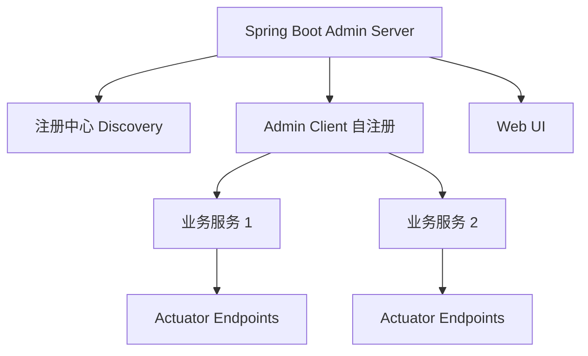
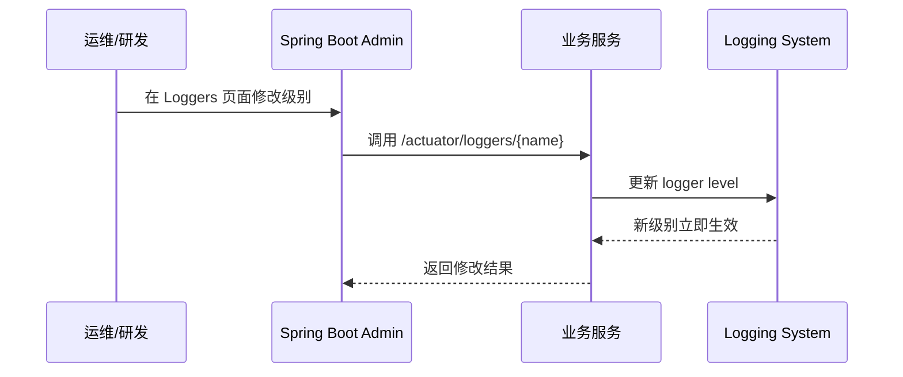
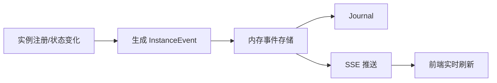
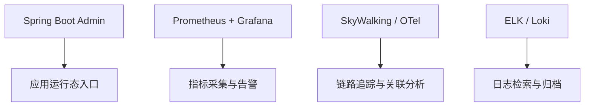

> 这篇笔记的目标，不是把 `Spring Boot Admin` 只记成“一个能看监控页面的小工具”，而是把它放回 `Spring Boot Actuator` 生态里理解：它本质上是一个面向 `Spring Boot` 应用的运行时管理与可视化入口，负责把散落在各个服务上的健康状态、指标、日志、线程、环境信息集中展示出来。

> 文章重点会放在 4 个最适合复习回看的问题上：`Spring Boot Admin` 到底解决什么问题、它和 `Actuator` 本身是什么关系、官方界面里每个页面对应哪些运行时信息，以及在实际项目里如何把 `admin-server` 和业务服务稳定接起来。它不追求覆盖所有高级扩展，而是先搭起一张可直接复用的实战脑图。

> 参考资料：
>
> 官方文档：[Installation and Setup](https://docs.spring-boot-admin.com/3.5.7/docs/installation-and-setup/) 、 [Server](https://docs.spring-boot-admin.com/3.5.7/docs/server/) 、 [Set up the Server](https://docs.spring-boot-admin.com/3.5.7/docs/server/server) 、 [Foster Security](https://docs.spring-boot-admin.com/3.5.7/docs/server/security) 、 [Server Events](https://docs.spring-boot-admin.com/3.5.7/docs/server/Events) 、 [Clustering](https://docs.spring-boot-admin.com/3.5.7/docs/server/Clustering) 、 [Notifications](https://docs.spring-boot-admin.com/3.5.7/docs/server/notifications/)
>
> 客户端与能力：[Client Features](https://docs.spring-boot-admin.com/3.5.7/docs/client/client-features) 、 [Client Configuration](https://docs.spring-boot-admin.com/3.5.7/docs/client/configuration) 、 [Client Properties](https://docs.spring-boot-admin.com/3.5.7/docs/client/properties) 、 [Supported Spring Boot Actuator Endpoints](https://docs.spring-boot-admin.com/3.5.7/docs/actuator-endpoints-overview)
>
> 定制与扩展：[Look and Feel](https://docs.spring-boot-admin.com/3.5.7/docs/customize/customize_ui) 、 [Extend the UI](https://docs.spring-boot-admin.com/3.5.7/docs/customize/extend_ui) 、 [HTTP Headers](https://docs.spring-boot-admin.com/3.5.7/docs/customize/customize_http-headers) 、 [HTTP Interceptors](https://docs.spring-boot-admin.com/3.5.7/docs/customize/customize_interceptors) 、 [UI Properties](https://docs.spring-boot-admin.com/3.5.7/docs/customize/ui-properties) 、 [Third Party Integrations](https://docs.spring-boot-admin.com/3.5.7/docs/third-party/)
>
> 官方仓库：[codecentric/spring-boot-admin](https://github.com/codecentric/spring-boot-admin) 、 [README](https://raw.githubusercontent.com/codecentric/spring-boot-admin/master/README.md)
>
> 官方界面图来源：[images 目录](https://github.com/codecentric/spring-boot-admin/tree/master/images)

[TOC]

---

## 一、先给最短答案

如果只用一句话概括：

> `Spring Boot Admin` 是 `Spring Boot Actuator` 的可视化管理面板，它把多套 Spring Boot 应用的健康状态、指标、日志、线程、环境信息和部分管理操作集中到一个统一的 Web UI 里。

这句话里最关键的 5 个词是：

| 关键词 | 真正含义 |
|------|----------|
| `Spring Boot` | 它围绕 Spring Boot 生态设计，不是通用的全栈观测平台 |
| `Admin` | 不只是看状态，还可以做运行时管理动作 |
| `Actuator` | 绝大多数能力都来自客户端暴露的 Actuator 端点 |
| `集中展示` | 价值不在采集本身，而在统一视图与集中入口 |
| `轻量` | 更适合应用层运行态管理，不替代完整可观测平台 |

因此可以先把它和常见误解分开：

1. 它不是 `Prometheus + Grafana` 的替代品
2. 它不是分布式链路追踪系统
3. 它也不是日志平台
4. 它更像是 `Spring Boot` 应用自己的运维驾驶舱

---

## 二、Spring Boot Admin 到底解决什么问题

如果没有 `Spring Boot Admin`，`Actuator` 当然也能工作，但常见问题会很明显：

- 每个服务都要分别访问 `/actuator/health`、`/actuator/metrics`、`/actuator/loggers`
- 服务一多，排查入口分散，状态变化不容易集中发现
- 同一批服务的运行态信息缺少统一列表和统一过滤视角
- 运维或排障时，经常在浏览器标签页、命令行和 JSON 响应之间来回切换

`Spring Boot Admin` 解决的正是这个“已有数据，但入口太散”的问题。

它做的事情可以概括成两层：

1. 让业务服务把自己注册到一个统一的 `Admin Server`
2. 由 `Admin Server` 定期访问各服务的 `Actuator` 端点，并把结果可视化出来

从定位上看，它特别适合：

- 中小规模 Spring Boot 服务集群
- 内部平台、后台系统、微服务治理台
- 需要快速看健康状态、实例信息、线程、日志、环境变量的场景
- 想给研发和运维提供统一运行态入口的项目

不太适合直接拿它做的事情包括：

- 长周期时序分析
- 复杂告警编排
- 大规模指标存储
- 分布式 trace 深度分析

这类能力通常还是要交给 `Prometheus`、`Grafana`、`SkyWalking`、`OpenTelemetry`、`ELK` 一类平台。

---

## 三、它和 Actuator 是什么关系

理解 `Spring Boot Admin` 的关键，不是先背 UI，而是先把它和 `Actuator` 的关系看清楚。

```mermaid
graph LR
    A[业务服务 A] --> B[/actuator/health]
    A --> C[/actuator/metrics]
    A --> D[/actuator/loggers]
    E[业务服务 B] --> F[/actuator/health]
    E --> G[/actuator/env]
    E --> H[/actuator/httpexchanges]
    I[Spring Boot Admin Server] --> A
    I --> E
    I --> J[统一 Web UI]
```

可以把它们的关系记成下面这张表：

| 组件 | 作用 | 没有它会怎样 |
|------|------|--------------|
| `Actuator` | 提供健康检查、指标、线程、日志等运行时端点 | `Admin` 没有数据来源 |
| `Admin Client` | 负责把业务服务注册到 `Admin Server` | 服务不会自动出现在控制台 |
| `Admin Server` | 负责聚合实例、轮询端点、渲染界面 | 只能手动访问各服务端点 |
| `UI` | 统一展示健康、指标、日志和管理页 | 只能看原始 JSON |

因此最容易记住的一句话是：

> `Actuator` 负责暴露运行时数据，`Spring Boot Admin` 负责把这些数据集中起来并变成可操作的界面。

---

## 四、Spring Boot Admin 的核心架构

官方文档给出的主线非常稳定，整个链路可以简化成下面这样：



这里最值得复习的不是名词，而是两种接入模式：

| 接入方式 | 怎么工作 | 适用场景 |
|------|----------|----------|
| `Admin Client` 自注册 | 每个服务引入 client starter，启动后主动注册到 server | 单体项目、简单微服务、无注册中心环境 |
| `Service Discovery` 发现 | `Admin Server` 从 `Eureka`、`Consul`、`Kubernetes` 等发现服务 | 已经有注册中心或云原生发现体系的环境 |

客户端注册以后，`Admin Server` 主要做 3 类事：

1. 维护实例列表和状态变化
2. 定期探测各类 `Actuator` 端点
3. 在页面里把这些端点映射成可读的视图

---

## 五、界面到底能看什么

这一节的目标不是做截图展示，而是把“页面”和“底层端点”对应起来，方便后面复习时快速回想。

### 5.1 总览页

官方应用总览页最适合回答两个问题：

- 当前注册了多少应用、多少实例
- 哪些实例是 `UP`，哪些已经异常或离线


这类页面背后主要依赖：

- `health`
- `info`
- 服务注册信息

总览页的意义不是细节排障，而是先完成“全局扫一眼”的判断。

### 5.2 实例详情页

实例详情页会把一个具体服务实例的基础信息和运行态信息铺开。


这一页通常最常看的是：

- 基础构建信息
- 健康检查详情
- 进程与线程概览
- 堆内存与非堆内存曲线

它适合快速回答：

1. 这个实例是否真的还活着
2. JVM 和进程级资源是否已经明显异常
3. 是单个实例问题，还是整个应用都在波动

### 5.3 环境与配置页

环境页更偏排障场景，经常用来核对配置是否真正生效。


这一页最常见的用途包括：

- 核对激活的 `profile`
- 检查环境变量和系统属性
- 对比配置中心下发值与本地实际值
- 确认端口、路径、线程池或数据源配置是否正确

但这一页也最敏感，因为很多配置包含密钥、地址、账号等信息，因此生产环境必须严格控制暴露范围与访问权限。

### 5.4 Trace 与请求交换页

官方界面里还能看到请求交换记录页面。


这类页面主要对应：

- `httpexchanges`
- 老版本中的 `httptrace`

它适合看：

- 最近请求列表
- 请求路径和响应状态
- 请求耗时和请求头信息

但要注意：

> 这里的 `Trace` 更接近单应用请求交换记录，而不是 `SkyWalking` 或 `Zipkin` 那种跨服务分布式调用链。

### 5.5 页面与端点对照表

为了方便回看，可以直接记下面这张表：

| 界面能力 | 主要依赖端点 | 适合回答什么问题 |
|------|--------------|------------------|
| 应用列表 | `health`、`info` | 服务是否存活，版本是否正确 |
| Metrics | `metrics` | JVM、Tomcat、线程、HTTP 指标是否异常 |
| Environment | `env` | 配置和环境变量是否生效 |
| Loggers | `loggers` | 运行时日志级别是否需要临时调整 |
| Logfile | `logfile` | 当前实例日志里有没有直接证据 |
| Threads | `threaddump` | 是否存在阻塞、死锁、线程飙升 |
| Heapdump | `heapdump` | 是否需要进一步做内存排查 |
| Mappings | `mappings` | 实际暴露了哪些接口 |
| HTTP Exchanges | `httpexchanges` | 最近请求是否出现错误或慢调用 |

---

## 六、版本怎么选

这件事在实战里很重要，因为 `Spring Boot Admin` 的版本和 `Spring Boot` 主版本是强相关的。

官方 `README` 的兼容矩阵可以压缩成下面这样：

| Spring Boot | Spring Boot Admin |
|------------|-------------------|
| `2.7.x` | `2.7.x` |
| `3.0.x` | `3.0.x` |
| `4.0.x` | `4.0.x` |

更实用的理解方式是：

> `Spring Boot Admin` 的大版本和小版本，尽量跟 `Spring Boot` 对齐。

如果项目当前主线还在 `Spring Boot 3.x`，比较稳妥的做法通常是选 `Spring Boot Admin 3.x`。

这篇文章后面的实战示例统一按下面这套假设来写：

- `Spring Boot 3.x`
- `Spring Boot Admin 3.x`
- `Servlet Web` 应用
- 使用 `Admin Client` 自注册

---

## 七、项目接入实战案例

下面用一个最常见的场景来落地：

- `admin-server` 作为监控中心
- `order-service` 和 `user-service` 作为被监控业务服务
- 业务服务开启 `Actuator`
- 所有服务都使用 `Spring Security`

### 7.1 实战目标

目标不是做演示级页面，而是完成下面这个闭环：

```mermaid
graph LR
    A[admin-server:9000] --> B[order-service:8081]
    A --> C[user-service:8082]
    B --> D[/actuator/health]
    B --> E[/actuator/metrics]
    B --> F[/actuator/loggers]
    C --> G[/actuator/health]
    C --> H[/actuator/env]
    C --> I[/actuator/httpexchanges]
```

最终希望做到：

1. `admin-server` 页面能看到两个业务服务
2. 可以点进实例详情查看健康、指标、日志和环境信息
3. 业务服务的 `Actuator` 端点走独立账号访问
4. `admin-server` 本身也具备登录保护

### 7.2 创建 Admin Server

#### 7.2.1 依赖

`admin-server` 的 `pom.xml` 核心依赖可以先写成下面这样：

```xml
<dependencies>
    <dependency>
        <groupId>org.springframework.boot</groupId>
        <artifactId>spring-boot-starter-web</artifactId>
    </dependency>
    <dependency>
        <groupId>org.springframework.boot</groupId>
        <artifactId>spring-boot-starter-security</artifactId>
    </dependency>
    <dependency>
        <groupId>de.codecentric</groupId>
        <artifactId>spring-boot-admin-starter-server</artifactId>
        <version>3.5.7</version>
    </dependency>
</dependencies>
```

#### 7.2.2 启动类

```java
package com.example.admin;

import de.codecentric.boot.admin.server.config.EnableAdminServer;
import org.springframework.boot.SpringApplication;
import org.springframework.boot.autoconfigure.SpringBootApplication;

@SpringBootApplication
@EnableAdminServer
public class AdminServerApplication {

    public static void main(String[] args) {
        SpringApplication.run(AdminServerApplication.class, args);
    }
}
```

#### 7.2.3 基础配置

```yaml
server:
  port: 9000

spring:
  application:
    name: admin-server
  security:
    user:
      name: admin
      password: admin123456
  boot:
    admin:
      context-path: /
      monitor:
        period: 30000
      instance-auth:
        enabled: true

management:
  endpoints:
    web:
      exposure:
        include: health,info
```

这里最常记的几个配置点是：

| 配置项 | 作用 |
|------|------|
| `spring.boot.admin.context-path` | 调整 `Admin UI` 的访问上下文 |
| `spring.boot.admin.monitor.period` | 控制轮询实例状态的周期 |
| `spring.boot.admin.instance-auth.enabled` | 允许从实例元数据中读取访问凭证 |

#### 7.2.4 给 Admin Server 加登录保护

官方安全文档里强调得很明确：`Spring Boot Admin` 默认不替业务决定统一安全策略，实际项目里通常都要自己补 `SecurityFilterChain`。

可以先使用一版足够实用的配置：

```java
package com.example.admin.config;

import de.codecentric.boot.admin.server.config.AdminServerProperties;
import org.springframework.context.annotation.Bean;
import org.springframework.context.annotation.Configuration;
import org.springframework.http.HttpMethod;
import org.springframework.security.config.Customizer;
import org.springframework.security.config.annotation.web.builders.HttpSecurity;
import org.springframework.security.web.SecurityFilterChain;
import org.springframework.security.web.savedrequest.SavedRequestAwareAuthenticationSuccessHandler;

@Configuration
public class AdminSecurityConfig {

    @Bean
    SecurityFilterChain securityFilterChain(HttpSecurity http,
                                            AdminServerProperties adminServerProperties) throws Exception {
        SavedRequestAwareAuthenticationSuccessHandler successHandler =
                new SavedRequestAwareAuthenticationSuccessHandler();
        successHandler.setTargetUrlParameter("redirectTo");
        successHandler.setDefaultTargetUrl(adminServerProperties.path("/"));

        http.authorizeHttpRequests(auth -> auth
                .requestMatchers(adminServerProperties.path("/assets/**")).permitAll()
                .requestMatchers(adminServerProperties.path("/login")).permitAll()
                .requestMatchers(adminServerProperties.path("/actuator/info")).permitAll()
                .requestMatchers(adminServerProperties.path("/actuator/health")).permitAll()
                .anyRequest().authenticated())
            .formLogin(login -> login
                .loginPage(adminServerProperties.path("/login"))
                .successHandler(successHandler))
            .logout(logout -> logout.logoutUrl(adminServerProperties.path("/logout")))
            .httpBasic(Customizer.withDefaults())
            .csrf(csrf -> csrf.ignoringRequestMatchers(
                request -> HttpMethod.POST.matches(request.getMethod())
                    && request.getRequestURI().equals(adminServerProperties.path("/instances")),
                request -> HttpMethod.DELETE.matches(request.getMethod())
                    && request.getRequestURI().startsWith(adminServerProperties.path("/instances/")),
                request -> request.getRequestURI().startsWith(adminServerProperties.path("/actuator/"))
            ));

        return http.build();
    }
}
```

这段配置的重点不是 API 细节，而是 4 个原则：

1. 静态资源和登录页放行
2. `Admin UI` 其他页面都要求认证
3. 开启 `HTTP Basic` 方便客户端注册
4. 对客户端注册和管理端点做有针对性的 `CSRF` 放行

### 7.3 创建业务服务 Client

下面以 `order-service` 为例。

#### 7.3.1 依赖

```xml
<dependencies>
    <dependency>
        <groupId>org.springframework.boot</groupId>
        <artifactId>spring-boot-starter-web</artifactId>
    </dependency>
    <dependency>
        <groupId>org.springframework.boot</groupId>
        <artifactId>spring-boot-starter-actuator</artifactId>
    </dependency>
    <dependency>
        <groupId>org.springframework.boot</groupId>
        <artifactId>spring-boot-starter-security</artifactId>
    </dependency>
    <dependency>
        <groupId>de.codecentric</groupId>
        <artifactId>spring-boot-admin-starter-client</artifactId>
        <version>3.5.7</version>
    </dependency>
</dependencies>
```

#### 7.3.2 业务服务配置

```yaml
server:
  port: 8081

spring:
  application:
    name: order-service
  security:
    user:
      name: actuator
      password: actuator123456
  boot:
    admin:
      client:
        url: http://localhost:9000
        username: admin
        password: admin123456
        instance:
          service-base-url: http://localhost:8081
          metadata:
            "user.name": actuator
            "user.password": actuator123456
            "tags.env": dev
            "tags.team": trade
            "tags.module": order

management:
  endpoint:
    health:
      show-details: always
  endpoints:
    web:
      exposure:
        include: health,info,metrics,loggers,logfile,threaddump,heapdump,env,configprops,httpexchanges,mappings,beans,caches
  info:
    env:
      enabled: true

info:
  app:
    name: order-service
    version: 1.0.0
    description: order business service

logging:
  file:
    name: logs/order-service.log
```

这里最值得记住的是 5 个配置点：

| 配置项 | 作用 |
|------|------|
| `spring.boot.admin.client.url` | 指向 `Admin Server` 地址 |
| `spring.boot.admin.client.username/password` | 当 `Admin Server` 受保护时，客户端注册所需账号 |
| `instance.metadata.user.name/user.password` | 当客户端 `Actuator` 也受保护时，供 `Admin Server` 访问管理端点 |
| `management.endpoints.web.exposure.include` | 决定哪些功能页能在 `Admin UI` 中真正可用 |
| `logging.file.name` | 不配置文件日志时，`Logfile` 页通常没有内容可看 |

#### 7.3.3 业务服务安全配置

如果业务服务需要保护 `Actuator` 端点，可以把应用接口和管理端点区分开：

```java
package com.example.order.config;

import org.springframework.context.annotation.Bean;
import org.springframework.context.annotation.Configuration;
import org.springframework.security.config.Customizer;
import org.springframework.security.config.annotation.web.builders.HttpSecurity;
import org.springframework.security.web.SecurityFilterChain;

@Configuration
public class OrderSecurityConfig {

    @Bean
    SecurityFilterChain securityFilterChain(HttpSecurity http) throws Exception {
        http.authorizeHttpRequests(auth -> auth
                .requestMatchers("/actuator/**").hasRole("ACTUATOR")
                .anyRequest().authenticated())
            .httpBasic(Customizer.withDefaults())
            .csrf(csrf -> csrf.disable());
        return http.build();
    }
}
```

如果使用这类配置，需要保证 `Actuator` 用户真实存在，例如：

- `username: actuator`
- `password: actuator123456`
- 角色里包含 `ACTUATOR`

否则 `Admin Server` 虽然能看到实例，但点进详情页时会不断报认证失败。

### 7.4 启动后的验证顺序

服务启动以后，建议按下面顺序验证：

1. 先直接访问 `order-service` 的 `/actuator/health`
2. 再确认 `admin-server` 首页能看到实例注册成功
3. 点进实例详情页确认 `Metrics`、`Environment`、`Logfile` 是否可打开
4. 人为切换一个实例状态或停掉一个服务，观察 UI 状态是否变化

如果前三步都正常，说明接入链路基本已经打通。

### 7.5 `Loggers` 页面在实战里到底怎么用

前面提到 `Spring Boot Admin` 不只是看状态，其中最常被真正用起来的可写能力，就是 `Loggers` 页面动态调整日志级别。

它在实战里最典型的几个用途是：

1. 某个下单接口偶发失败，但本地和测试环境无法稳定复现，临时把订单模块调到 `DEBUG`
2. 某个第三方支付 SDK 调用超时，临时把 SDK 包名调到 `TRACE`，只抓一次线上证据
3. 某个消息消费重复或幂等失效，临时提高消费链路日志级别，确认重试、去重、提交位点顺序
4. 某个数据源或 ORM 行为异常，临时提高 `SQL`、事务、连接池相关日志，观察真实执行过程

这一能力的价值在于：

> 不用改代码、不用重启服务，就能临时放大某一段链路的日志细节，问题查完再降回去。

#### 7.5.1 它背后实际调用的是什么

`Spring Boot Admin` 自己并没有发明一套日志控制协议，本质上还是在调用客户端暴露的 `Actuator` 日志端点。

大致可以理解成下面这个链路：



因此 `Loggers` 是否可用，取决于三件事：

- 客户端暴露了 `loggers` 端点
- 客户端使用的日志系统支持动态调整级别
- `Admin Server` 有权限访问该端点

#### 7.5.2 业务代码有没有改造成本

大多数 Spring Boot 项目里，这项能力的改造成本其实很低。

如果项目本来就满足下面这些条件，通常不需要额外改业务代码：

- 已经使用 `SLF4J + Logback` 或常见日志框架
- 类里本来就定义了常规 logger
- 已经引入 `spring-boot-starter-actuator`
- 暴露了 `loggers` 端点

例如下面这种更贴近实战的写法，本身就能被 `Loggers` 页面控制：

```java
package com.example.order.service;

import lombok.extern.slf4j.Slf4j;
import org.springframework.stereotype.Service;

@Slf4j
@Service
public class OrderService {

    public void createOrder() {
        log.info("create order start");
        if (log.isDebugEnabled()) {
            log.debug("order validation details, requestId={}, userId={}", requestId, userId);
        }
    }
}
```

这种情况下，`Spring Boot Admin` 能调的不是“某一行日志语句”，而是这个 logger 对应的名字和层级。

这里有一个很关键但经常被问到的问题：

> 在 `Spring Boot Admin` 页面把某个 logger 从 `INFO` 改成 `DEBUG` 之后，Java 服务端能不能立刻感知到，`log.isDebugEnabled()` 会不会直接变成 `true`？

答案通常是可以的。

原因并不是业务代码重新加载了，而是底层日志框架会按照 logger 的当前有效级别来判断这次日志是否应该输出。也就是说，只要 `Actuator /loggers` 端点已经把该 logger 的级别改成 `DEBUG`，后续代码再执行到：

```java
if (log.isDebugEnabled()) {
    ...
}
```

通常就会立即读到新的结果，不需要重启服务，也不需要重新创建这个 logger。

因此更准确的理解应该是：

1. `Spring Boot Admin` 修改的是 logger 的运行时级别
2. `log.debug(...)` 是否真正输出，由当前有效级别决定
3. `log.isDebugEnabled()` 这类判断，通常也会立即反映出新的运行时级别

`isDebugEnabled()` 最典型的价值，不是为了让 SBA 才能控制日志，而是为了避免在 `DEBUG` 未开启时提前做昂贵的字符串拼接、对象序列化或上下文组装。

例如下面这种写法就比单纯输出一行固定字符串更有实战意义：

```java
if (log.isDebugEnabled()) {
    OrderDebugSnapshot snapshot = buildDebugSnapshot(order, user, pricingContext);
    log.debug("order submit snapshot={}", snapshot);
}
```

因为这里真正昂贵的，往往不是 `log.debug` 这一行本身，而是 `buildDebugSnapshot(...)` 这种调试信息构造过程。

再往下区分一层，实战里还经常会混淆下面两种写法：

```java
log.debug("order submit, user={}", user);
```

和：

```java
log.debug("order submit, user=" + heavyBuildUserDebugInfo(user));
```

这两者最大的差异，不在于日志级别本身，而在于参数构造时机。

第一种“占位符日志”：

- 把参数对象交给日志框架
- 只有在对应级别真的开启时，才更有可能继续做格式化输出
- 日常开发里是最推荐的基本写法

第二种“字符串提前拼接”：

- 在进入 `log.debug(...)` 之前，`heavyBuildUserDebugInfo(user)` 就已经执行了
- 就算当前 `DEBUG` 没开，这个昂贵构造过程也已经发生
- 如果里面有对象组装、JSON 序列化、远程信息拼接或大对象遍历，浪费会非常明显

所以更准确地说：

> `log.debug("x={}", obj)` 可以避免很多不必要的字符串拼接，但如果 `obj` 本身的获取过程很重，仍然可能需要 `isDebugEnabled()` 来守卫。

例如下面这个对比就很典型：

```java
log.debug("order={}", order);
```

通常问题不大，因为这里大概率只是把现成对象交给日志框架。

但下面这种：

```java
log.debug("order={}", buildFullOrderSnapshot(order));
```

即使使用了占位符，`buildFullOrderSnapshot(order)` 也会先执行；这时如果 `DEBUG` 默认关闭，就仍然应该用守卫包起来。

可以把“占位符日志”和“`isDebugEnabled()` 守卫”的适用场景直接记成下面这张表：

| 写法 | 适合场景 | 不足 |
|------|----------|------|
| `log.debug("x={}", obj)` | 参数已经现成、构造成本低、只是想避免手工字符串拼接 | 如果参数表达式本身很重，仍然会提前计算 |
| `if (log.isDebugEnabled()) { log.debug(...) }` | 日志参数需要额外组装、序列化、遍历、聚合、快照构造 | 代码会稍微更啰嗦 |

因此最实用的经验通常是：

1. 默认优先使用占位符日志，不要手写字符串拼接
2. 只要 debug 参数的准备过程明显有成本，就加 `isDebugEnabled()` 守卫
3. 如果只是打印几个现成字段，没必要为了“形式统一”把所有 debug 都包进 `if`

真正可能需要额外改造的场景主要有三种：

1. 项目根本没用标准日志框架，或者大量地方直接 `System.out.println`
2. 日志写法非常粗糙，所有代码都复用一个很泛的 logger 名称，导致定位粒度太粗
3. 希望做到“只放大某一个特别细的逻辑点”，但现有代码没有为这段逻辑单独定义 logger

也就是说：

> 正常项目几乎没有“为了接入 SBA 的 Loggers 功能而专门改造代码”的成本，但如果想把日志控制粒度做得更细，就需要业务代码在 logger 命名上本来就足够规整。

#### 7.5.3 它能控制到什么粒度

这里最容易产生误解。

`Loggers` 页面控制的核心对象不是“方法”，而是 `logger name`。

在绝大多数项目里，`logger name` 会天然映射成下面几种粒度：

| 粒度 | 是否常见 | 说明 |
|------|----------|------|
| 根 logger | 很常见 | 例如 `ROOT`，影响整个应用，风险最大 |
| 包级别 | 很常见 | 例如 `com.example.order`，适合临时放大某个业务模块 |
| 类级别 | 很常见 | 例如 `com.example.order.service.OrderService`，适合精确定位单个类 |
| 方法级别 | 默认不支持 | 方法不是 logger 的天然维度，除非代码额外设计了独立 logger 名称 |
| 自定义逻辑点 | 可以做到 | 但前提是代码里主动定义了专用 logger name |

最实用的理解方式是：

> `Spring Boot Admin` 能控制到包级别和类级别，这已经是默认主力；方法级别不是它的天然能力。

#### 7.5.4 为什么默认做不到方法级别

因为日志框架本身通常不是按“方法”存放日志配置，而是按 `logger name` 做层级匹配。

例如：

```java
private static final Logger log = LoggerFactory.getLogger(OrderService.class);
```

这里对应的 logger name 通常就是：

```text
com.example.order.service.OrderService
```

它能匹配：

- 整个包
- 某个类

但不会天然细分成：

- `createOrder()`
- `cancelOrder()`

如果真的需要把粒度压到更细，只能主动在代码里单独定义一个逻辑 logger，例如：

```java
private static final Logger submitLogger =
        LoggerFactory.getLogger("order.submit.flow");
```

这样 `Spring Boot Admin` 就可以控制 `order.submit.flow` 这个名字，但这里的“方法级”本质上仍然不是 SBA 自己支持方法，而是代码人为引入了更细的 logger namespace。

所以更准确的说法是：

1. 默认可控粒度是包和类
2. 想做到更细粒度，需要代码预先设计 logger 名称
3. `SBA` 本身不会自动识别“方法”这个维度

#### 7.5.5 一个最常见的实战流程

以“订单提交偶发失败，但日志不够”为例，可以按下面方式操作：

| 步骤 | 动作 | 目的 |
|------|------|------|
| 1 | 先在总览页确认异常只出现在 `order-service` 某个实例还是全体实例 | 缩小排查范围 |
| 2 | 进入该实例的 `Loggers` 页面 | 找到需要放大的包或类 |
| 3 | 先把 `com.example.order` 调到 `DEBUG` | 观察是否能补足上下文 |
| 4 | 如果日志量仍然太大，再把粒度收窄到 `com.example.order.service.OrderService` | 控制噪音 |
| 5 | 问题复现后立刻恢复到 `INFO` | 避免长期高日志级别带来性能和磁盘压力 |

这套流程里最重要的经验是：

- 不要一上来就调 `ROOT`
- 优先从包级别开始，再收窄到类级别
- 动态调级别是“短时间取证工具”，不是常驻配置手段

### 7.6 除了 `Loggers`，哪些能力真的会反向影响业务

`Loggers` 是最常用的一类“软影响”，但它不是唯一的可写能力。

如果客户端暴露了可写管理端点，`Spring Boot Admin` 就可能从“观察入口”变成“运行时控制台”。

最典型的几类能力可以直接记成下面这张表：

| 端点或能力 | 会发生什么 | 对业务的实际影响 |
|-----------|------------|------------------|
| `loggers` | 动态调高或调低日志级别 | 增加或减少日志量、I/O、排障信息密度 |
| `refresh` | 重新绑定可刷新的配置 | 开关、阈值、路由、限流等运行参数可能立即变化 |
| `shutdown` | 关闭应用 | 实例直接下线 |
| `restart` | 重启应用上下文 | 会有短暂中断或重建成本 |
| `gateway/refresh` | 刷新网关路由 | 网关转发结果可能立即变化 |

这里要特别强调一个边界：

> `Spring Boot Admin` 本身不会改业务代码逻辑，但它能通过调用管理端点，改变业务应用的运行状态和部分运行参数。

例如：

- `refresh` 不会改 `if/else` 代码，但会让配置开关重新生效
- `loggers` 不会改业务算法，但会改变日志输出行为
- `shutdown` 不会改代码实现，但会直接让实例退出服务

因此在生产环境里，通常应当把能力分成两层：

| 类型 | 建议 |
|------|------|
| 只读能力 | `health`、`metrics`、`info`、`mappings`、`threaddump` 等可以按需开放 |
| 可写能力 | `loggers`、`refresh`、`shutdown`、`restart` 必须单独评估，谨慎开放 |

---

## 八、客户端注册与发现机制全景

`Spring Boot Admin` 的很多误用，其实都来自没有先把“服务是怎么进入 SBA 的”这件事想清楚。

从接入方式看，SBA 至少有 3 条主线：

| 方式 | 核心机制 | 适用场景 |
|------|----------|----------|
| `Admin Client` 自注册 | 业务服务周期性向 SBA `POST /instances` | 最常见，适合普通 Spring Boot 项目 |
| `DiscoveryClient` 自动发现 | SBA 从注册中心发现服务并转换为实例 | 已经有 Eureka、Consul、K8s 等发现体系 |
| `SimpleDiscoveryClient` 静态配置 | 在 SBA 端显式写死实例地址 | 小规模、固定拓扑、内网平台 |

### 8.1 `Admin Client` 自注册

这条路线最容易理解：

1. 业务服务启动
2. `spring-boot-admin-starter-client` 自动注册
3. 按 `spring.boot.admin.client.period` 周期性续约或更新
4. SBA 根据实例返回信息探测 `Actuator` 端点

这一模式的优点是：

- 业务服务自治
- 接入简单
- 配置最直观
- 对注册中心没有强依赖

最关键的客户端属性可以记成下面这张表：

| 配置项 | 作用 | 常见场景 |
|------|------|----------|
| `spring.boot.admin.client.url` | SBA 地址列表 | 指向一个或多个 Admin Server |
| `spring.boot.admin.client.period` | 重复注册间隔 | 控制心跳与更新频率 |
| `spring.boot.admin.client.register-once` | 注册到一个还是全部 SBA 节点 | 多 Admin Server 场景 |
| `spring.boot.admin.client.auto-registration` | 应用就绪后是否自动注册 | 某些场景可手动控制 |
| `spring.boot.admin.client.auto-deregistration` | 下线时是否自动注销 | 云平台环境更常用 |

### 8.2 `DiscoveryClient` 自动发现

如果系统已经在使用服务注册与发现，SBA 其实可以不要求每个服务都引入 client starter。

这一模式下：

- `Admin Server` 集成 `DiscoveryClient`
- `Admin Server` 直接从注册中心发现服务
- SBA 通过 `ServiceInstanceConverter` 把注册信息转成实例注册对象

适合这类场景：

- 微服务平台已经统一接入 `Eureka`
- 部署在 `Kubernetes`，服务发现已具备
- 不希望每个业务服务额外增加 `spring-boot-admin-starter-client`

官方支持的发现体系可以概括成：

- `Eureka`
- `Consul`
- `Zookeeper`
- `Kubernetes`
- 其他实现了 Spring Cloud `DiscoveryClient` 的注册中心

### 8.3 `SimpleDiscoveryClient` 静态配置

如果服务列表很固定，甚至连注册中心都不想引入，可以直接让 SBA 通过 `SimpleDiscoveryClient` 静态感知服务。

```yaml
spring:
  cloud:
    discovery:
      client:
        simple:
          instances:
            order-service:
              - uri: http://order-1.internal:8080
                metadata:
                  management.context-path: /actuator
            user-service:
              - uri: http://user-1.internal:8080
                metadata:
                  management.context-path: /actuator
```

这条路线的特点是：

- 没有客户端注册逻辑
- 没有外部注册中心依赖
- 非常适合小规模固定服务
- 维护成本会随着服务数量上升而明显增加

### 8.4 实例元数据到底有什么用

元数据是 SBA 很容易被低估的一层。

它不只是附加说明，而是会直接影响 SBA 如何展示实例、如何访问实例、如何做分组和安全处理。

官方客户端配置和元数据文档里最实用的字段包括：

| 元数据或属性 | 作用 | 常见用途 |
|-------------|------|----------|
| `user.name` / `user.password` | 提供 SBA 访问受保护 Actuator 的凭证 | 管理端点走单独账号 |
| `tags.*` | 给实例打标签 | 环境、团队、模块、区域 |
| `group` | 将实例按组聚合展示 | 同一应用按环境或集群分组 |
| `hide-url` | 在 UI 隐藏实例 URL | 避免暴露内网地址 |
| `disable-url` | 禁用跳转能力 | 地址不可直达时很有用 |
| `service-url` | 覆盖展示链接地址 | UI 点击地址单独控制 |
| `sidebar.links.*` | 给侧栏挂自定义链接 | 跳转 Kibana、Grafana、内部平台 |

可以把它理解成：

> SBA 不是只会“看见一个服务”，它还会根据 metadata 决定如何访问、如何分组、如何隐藏、如何增强该服务的管理入口。

### 8.5 发现配置的筛选能力

如果使用 `DiscoveryClient` 路线，SBA 还支持服务筛选。

常见筛选项包括：

- `spring.boot.admin.discovery.services`
- `spring.boot.admin.discovery.ignored-services`
- `spring.boot.admin.discovery.instances-metadata`
- `spring.boot.admin.discovery.ignored-instances-metadata`

这类配置的价值在于：

1. 避免把所有注册中心里的服务都暴露到 SBA
2. 只监控满足特定 metadata 条件的服务
3. 用于多环境共享注册中心时的隔离

### 8.6 一个判断规则

如果以后要快速判断该选哪条路，可以直接记成下面这样：

| 环境特征 | 更推荐的方式 |
|----------|-------------|
| 普通 Spring Boot 项目、服务数量不多 | `Admin Client` 自注册 |
| 已经有完善注册中心 | `DiscoveryClient` 自动发现 |
| 服务很固定、追求最小依赖 | `SimpleDiscoveryClient` 静态配置 |

---

## 九、客户端能力与端点支持全景

如果要尽可能覆盖 `Spring Boot Admin` 的知识点，一个非常重要的问题是：

> SBA 页面里的能力到底分别依赖哪些客户端能力，哪些是开箱即用，哪些需要额外开启。

### 9.1 官方支持的核心端点

官方支持的 `Actuator` 端点范围相当广，但并不是全都必须打开。

可以按能力分成 4 组：

| 能力组 | 典型端点 | 主要用途 |
|------|----------|----------|
| 基础观测 | `health`、`info`、`metrics` | 应用是否在线、版本信息、运行指标 |
| 配置与结构 | `env`、`configprops`、`beans`、`mappings` | 看配置、生效参数、Bean 和路由 |
| JVM 排障 | `threaddump`、`heapdump`、`caches` | 看线程、内存、缓存状态 |
| 运维控制 | `loggers`、`shutdown`、`refresh`、`gateway/routes` | 动态调日志、刷新、路由管理 |

更完整的常见端点还包括：

- `conditions`
- `scheduledtasks`
- `quartz`
- `liquibase`
- `flyway`
- `sessions`
- `sbom`
- `httpexchanges`

因此在生产环境里最实用的策略不是“全开”，而是：

1. 先明确 SBA 需要承担什么能力
2. 再按能力开启对应端点
3. 对高风险端点单独做权限和暴露控制

### 9.2 版本展示与 `build-info`

很多人第一次用 SBA，会忽略应用列表里的版本号其实非常有价值。

对 Spring Boot 应用来说，最简单的做法是启用 `spring-boot-maven-plugin` 的 `build-info`：

```xml
<build>
    <plugins>
        <plugin>
            <groupId>org.springframework.boot</groupId>
            <artifactId>spring-boot-maven-plugin</artifactId>
            <executions>
                <execution>
                    <goals>
                        <goal>build-info</goal>
                    </goals>
                </execution>
            </executions>
        </plugin>
    </plugins>
</build>
```

这样 SBA 在应用列表里通常就能更自然地展示版本信息。

如果不是标准 Spring Boot 应用，也可以通过 metadata 传：

- `version`
- `build.version`

这在灰度发布、回滚核对、版本漂移排查时非常有用。

### 9.3 `Tags` 与实例标记

`Tags` 是 UI 层很轻但很实用的能力。

它们可以来自：

- metadata
- `info.tags.*`

例如：

```properties
spring.boot.admin.client.instance.metadata.tags.environment=test
spring.boot.admin.client.instance.metadata.tags.team=trade
```

或者：

```properties
info.tags.environment=test
```

推荐打的标签通常包括：

- `environment`
- `team`
- `module`
- `zone`
- `cluster`

标签的价值不是装饰，而是：

1. 让实例列表更容易扫视
2. 为多环境、多团队共享 SBA 提供最低成本的区分维度

### 9.4 `Logfile Viewer`

`Logfile` 页并不是默认一定可用。

它依赖两个条件：

1. 开启 `logfile` 端点
2. 业务服务真的写文件日志

最基础的配置通常是：

```properties
logging.file.name=/var/log/order-service.log
```

如果需要更好的查看体验，还可以配文件日志 pattern 和 ANSI 输出。

对复习来说，只要记住：

> 没有文件日志，就没有 `Logfile` 页面；控制台日志不会自动变成 SBA 的日志文件视图。

### 9.5 `JMX` 与 `Jolokia`

如果想在 SBA 里进一步操作或观察 `JMX Bean`，通常要引入 `Jolokia`。

官方文档特别强调：

- Spring Boot 3 需要单独的 `jolokia-support-spring`
- 反应式应用不支持基于 servlet 的 `Jolokia`

这意味着：

| 能力 | 前提 |
|------|------|
| 在 SBA 中管理 JMX Bean | 引入 `Jolokia` 并暴露相关端点 |
| 观察 Spring Beans 的 JMX 能力 | 必要时启用 `spring.jmx.enabled=true` |
| WebFlux 应用使用 Jolokia | 默认不合适 |

这块不是多数项目的必选项，但它确实属于 SBA 的知识图谱里经常被漏掉的一块。

### 9.6 客户端 URL 推导与容器部署

在 Docker、K8s 或反向代理环境里，最容易出错的不是功能本身，而是 URL 推导。

官方客户端属性里最关键的一组是：

| 配置项 | 作用 |
|------|------|
| `spring.boot.admin.client.instance.service-url` | 显式指定服务 URL |
| `spring.boot.admin.client.instance.health-url` | 显式指定健康检查 URL |
| `spring.boot.admin.client.instance.management-url` | 显式指定管理地址 |
| `spring.boot.admin.client.instance.service-base-url` | 用基础地址拼接 service URL |
| `spring.boot.admin.client.instance.management-base-url` | 用基础地址拼接 management URL |
| `spring.boot.admin.client.instance.service-host-type` | 决定使用主机名还是地址 |

如果服务部署在容器或 NAT 后面，而不显式指定这些 URL，经常会出现：

- SBA 上注册成功，但点开页面是错地址
- `health` 能看，其他端点访问失败
- 显示的是容器内部地址，外部根本无法访问

---

## 十、事件、Journal 与通知体系

很多人把 SBA 只理解成“轮询健康状态的仪表盘”，这其实少看了一层：它内部还有事件模型。

### 10.1 `Event Sourcing` 和 `SSE`

官方文档明确提到，SBA 默认使用事件源方式跟踪实例状态变化。

这意味着：

- 实例的注册、状态变化、端点变化都会形成事件
- 这些事件默认先存在内存里
- UI 可以通过 `SSE` 实时收到更新

可以把这个过程理解成：



这也是为什么 SBA 的 UI 看起来不是“每次整页刷新”，而是很多状态会比较实时地变化。

### 10.2 常见事件类型

官方列出的几个核心事件值得单独记一下：

| 事件 | 含义 |
|------|------|
| `InstanceRegisteredEvent` | 新实例注册 |
| `InstanceRegistrationUpdatedEvent` | 注册信息发生变化 |
| `InstanceEndpointsDetectedEvent` | 端点被识别或更新 |
| `InstanceInfoChangedEvent` | 元数据、版本、标签等信息变化 |
| `InstanceStatusChangedEvent` | 健康状态变化 |
| `InstanceDeregisteredEvent` | 实例被注销 |

对于排障来说，`Journal` 的价值很直接：

1. 看实例什么时候注册、掉线、恢复
2. 看状态变化的先后顺序
3. 用事件时间线帮助理解故障传播过程

### 10.3 通知体系

SBA 还有一整套通知机制，这也是它超出“简单页面工具”的地方。

官方支持的通知方向很多，包括：

- Mail
- Slack
- Telegram
- Discord
- DingTalk
- Microsoft Teams
- RocketChat
- Webex
- Mattermost

这些能力的本质是：

> SBA 不只是把状态变化显示在页面里，还可以把关键事件向外部协作系统传播。

### 10.4 自定义 `Notifier`

如果内置通知器不够，还可以自己实现 `Notifier`。

官方更推荐基于下面两类抽象扩展：

- `AbstractEventNotifier`
- `AbstractStatusChangeNotifier`

这意味着可以把 SBA 事件接到：

- 内部消息总线
- 统一告警平台
- 企业微信或自建机器人
- 发布系统和变更系统

### 10.5 `RemindingNotifier` 与 `FilteringNotifier`

这两个能力很适合真正生产环境。

可以直接记成：

| 能力 | 作用 | 典型场景 |
|------|------|----------|
| `RemindingNotifier` | 对持续 `DOWN/OFFLINE` 的实例重复提醒 | 防止单次告警被漏看 |
| `FilteringNotifier` | 对特定实例或应用临时静默 | 部署窗口、灰度发布、维护期间 |

`FilteringNotifier` 的价值尤其高，因为它能避免“部署时预期下线”被误报成线上故障。

---

## 十一、集群、代理与生产部署

### 11.1 反向代理与 `public-url`

如果 SBA 部署在反向代理、网关或路径重写之后，官方建议重点关注：

- `spring.boot.admin.ui.public-url`
- `server.forward-headers-strategy=native`

这类配置主要解决：

- 生成的自引用 URL 错误
- 代理终止 HTTPS 后，前端地址感知不正确
- 带路径前缀访问 SBA 时，静态资源和跳转异常

简单说就是：

> 只要 SBA 不是直接裸跑在公网入口上，`public-url` 基本都值得检查。

### 11.2 SBA 集群与 `Hazelcast`

官方支持通过 `Hazelcast` 做集群复制。

但这里有一个非常重要的边界：

> 复制的是事件和通知状态，不是“每个 SBA 节点共享一份应用监控职责”。

官方文档明确提醒：

- 事件会在集群间复制
- 通知去重信息会复制
- 但每个 SBA 节点通常仍会各自监控所有应用

这带来的现实影响是：

1. 每个被监控服务都可能被多个 SBA 节点同时轮询
2. 集群规模越大，被监控服务接收到的健康探测就越多
3. 如果服务很多，监控流量和开销会被放大

因此集群场景下要重点考虑：

- 健康探测频率
- 被监控服务承载能力
- 是否真的需要多节点都轮询全部实例

### 11.3 客户端多节点注册策略

客户端属性里的 `spring.boot.admin.client.register-once` 在多 SBA 节点场景里很关键。

它决定：

- 是向一个 SBA 注册
- 还是向所有 SBA 节点都注册

这件事会直接影响：

- 注册流量
- 节点冗余策略
- 故障切换体验

### 11.4 生产部署建议

如果把 SBA 放进生产环境，最值得遵守的建议通常是：

| 维度 | 建议 |
|------|------|
| 访问入口 | 放在内网、VPN、堡垒机或零信任入口之后 |
| 权限控制 | `Admin Server` 与 `Actuator` 都做认证授权 |
| 端点暴露 | 只暴露真正需要的端点 |
| 轮询频率 | 根据实例规模调低不必要的刷新频率 |
| 多节点部署 | 评估重复探测对业务服务的压力 |

---

## 十二、UI 定制与扩展能力

如果要把 SBA 真正做成团队内部平台，这一块非常重要。

### 12.1 外观定制

官方支持直接通过配置修改：

- `brand`
- `title`
- `login-icon`
- `favicon`
- `favicon-danger`
- `theme.color`
- `theme.palette.*`

这意味着 SBA 不只是个默认控制台，也可以快速做成公司内部统一风格的运行台。

### 12.2 页面裁剪

SBA 支持：

- 隐藏指定视图
- 限制语言列表
- 隐藏实例 URL
- 禁用实例 URL 跳转

这在生产里尤其有用，因为很多时候不是“功能越多越好”，而是要尽量减少误点和信息暴露。

| 配置项 | 作用 |
|------|------|
| `spring.boot.admin.ui.view-settings` | 隐藏或控制导航视图 |
| `spring.boot.admin.ui.available-languages` | 限制显示语言 |
| `spring.boot.admin.ui.hide-instance-url` | 隐藏实例 URL |
| `spring.boot.admin.ui.disable-instance-url` | 禁用实例 URL 相关操作 |

### 12.3 外部链接与嵌入视图

SBA 可以在导航栏里直接挂外部链接，甚至支持 `iframe` 嵌入。

这意味着它可以很自然地扩成“内部运维工作台”：

- 跳转 Grafana
- 跳转 Kibana
- 跳转发布系统
- 跳转工单系统
- 跳转服务文档

例如：

```yaml
spring:
  boot:
    admin:
      ui:
        external-views:
          - label: "Grafana"
            url: "https://grafana.example.com"
            order: 2000
```

### 12.4 自定义视图扩展

如果只是挂外链还不够，SBA 还支持扩展自定义前端视图。

官方文档的做法是：

- 用 `Vue.js` 组件实现页面
- 放到 `/META-INF/spring-boot-admin-server-ui/extensions/{name}/`
- 通过 `SBA.use(...)` 注册视图和路由

这使得 SBA 能进一步承载：

- 业务侧的专用观测页
- 自定义聚合面板
- 某个自定义端点的可视化展示
- 团队内部的运行手册入口

### 12.5 自定义 HTTP Headers

如果 SBA 访问客户端端点时需要额外加头，可以注入 `HttpHeadersProvider`。

这在以下场景很常见：

- 网关要求特殊 Header
- 需要携带租户信息
- 要求自定义鉴权头

### 12.6 自定义 HTTP Interceptor

如果只是加头还不够，SBA 还支持 `InstanceExchangeFilterFunction` 对请求和响应做拦截。

这一层适合做：

- 审计可写操作
- 额外安全检查
- 对 POST/DELETE 管理动作做日志记录

这意味着 SBA 不只是“点一下按钮就完了”，还可以为这些动作增加治理钩子。

---

## 十三、第三方与跨语言集成

SBA 虽然围绕 Spring Boot 设计，但并不完全局限于 Java。

### 13.1 `Pyctuator`

官方第三方集成文档里专门提到 `Pyctuator`，它可以让 `Flask` 或 `FastAPI` 这类 Python 应用接入 SBA 风格的监控。

这说明 SBA 的边界可以概括为：

- 原生最佳搭档是 Spring Boot
- 但只要外部系统能提供兼容的管理信息，也能被纳入 SBA 观察范围

### 13.2 非 Spring Boot 应用如何接入

对于非 Spring Boot 应用，最关键的思路不是强行套 starter，而是：

1. 提供 SBA 可识别的元数据
2. 提供可访问的管理端点或兼容端点
3. 至少补齐版本、状态、地址等基础信息

因此可以把 SBA 理解成：

> 它的核心不是“只能监控 Spring Boot”，而是“最适合监控暴露了 Spring Boot 风格管理面信息的应用”。

---

## 十四、接入时最容易踩的坑

### 14.1 只配了 Client，没有配 Actuator

这是最常见的问题之一。

客户端就算成功注册，如果没有引入 `spring-boot-starter-actuator`，或者没有暴露相关端点，页面里很多标签都会是空的。

### 14.2 Admin Server 有账号，Client 注册没带账号

官方安全文档明确要求：如果 `Admin Server` 保护了 `/instances` 注册接口，客户端必须配置：

```yaml
spring:
  boot:
    admin:
      client:
        username: admin
        password: admin123456
```

否则业务服务根本注册不上来。

### 14.3 Client 的 Actuator 有账号，但元数据没传给 Server

这种情况的表现通常是：

- 首页能看到实例
- 详情页打不开
- `Metrics`、`Env`、`Logfile` 等页面频繁报 `401`

本质原因是 `Admin Server` 不知道该用什么凭证访问客户端的 `Actuator`。

### 14.4 端点暴露得太猛

演示环境里常见的 `include: '*'` 很方便，但生产环境风险很高，尤其是下面这些端点：

- `env`
- `heapdump`
- `threaddump`
- `logfile`
- `configprops`

更稳妥的做法通常是：

1. 只暴露真正需要的端点
2. 给 `Actuator` 单独账号
3. 把 `Admin Server` 放在内网或受保护入口之后

### 14.5 把它当成完整可观测平台

`Spring Boot Admin` 很适合做应用层运行态管理，但不应该承接所有观测职责。

更准确的分工通常是：

| 能力 | 更适合谁负责 |
|------|-------------|
| 应用状态、线程、日志级别、配置核对 | `Spring Boot Admin` |
| 指标长期存储、告警、看板聚合 | `Prometheus + Grafana` |
| 分布式调用链 | `SkyWalking / Zipkin / OpenTelemetry` |
| 海量日志检索 | `ELK / Loki` |

### 14.6 把 `Loggers` 当成“方法级开关”

这也是实战里很容易想当然的一点。

很多人第一次看到 `Loggers` 页面，会自然期待：

- 能不能只打开某个方法的日志
- 能不能只对某个接口调用链上的一段代码加日志
- 能不能像断点一样精确到函数级别控制

默认答案通常都是否定的。

原因不是 `Spring Boot Admin` 做不到，而是底层日志系统本来就主要基于 `logger name` 匹配，而不是基于方法签名匹配。

因此最稳妥的预期应该是：

1. 默认按包或类控制
2. 想要更细粒度，需要代码里提前规划更细的 logger 名称
3. 如果项目日志命名非常混乱，SBA 的控制粒度也会跟着变粗

---

## 十五、什么时候优先上 Spring Boot Admin

如果项目符合下面这些特征，`Spring Boot Admin` 往往非常值得加：

- 服务以 `Spring Boot` 为主
- 排障时经常要查 `health`、`metrics`、`env`、`loggers`
- 团队需要一个轻量级统一运维入口
- 想快速补齐内部管理后台，而不是先上整套重型观测平台

尤其是对开发团队来说，它的价值非常直接：

1. 上手成本低
2. 接入链路短
3. 对已有 `Actuator` 投资复用率高
4. 对日常联调、验收、故障排查很友好

---

## 十六、什么时候它还不够

如果场景已经进入下面这些层级，单靠 `Spring Boot Admin` 往往不够：

- 需要多租户、多环境统一指标治理
- 需要长期保留时序数据
- 需要细粒度告警和告警路由
- 需要跨服务调用链和根因分析
- 需要大规模日志检索、字段聚合和审计

这时更合理的思路通常不是替换掉 `Spring Boot Admin`，而是让它和更完整的平台共存：



---

## 十七、复习时直接背的速记版

### 17.1 一句话版

> `Spring Boot Admin = Spring Boot Actuator 的集中式可视化管理台`

### 17.2 组件版

- `Admin Server`：集中管理中心
- `Admin Client`：把业务服务注册上来
- `Actuator`：真正的数据来源
- `UI`：把原始端点变成可读页面

### 17.3 页面版

- `Applications`：看应用和实例是否在线
- `Details / Metrics`：看 JVM、线程、内存和进程
- `Environment`：看配置是否生效
- `Journal`：看实例注册、状态变化和生命周期事件
- `Loggers / Logfile`：看日志级别和实例日志
- `Threads / Heapdump`：看更深一点的 JVM 排障信息
- `HTTP Exchanges`：看单应用请求交换记录

### 17.4 选型版

> 只要需求是“给 Spring Boot 服务提供一个统一运行态入口”，优先想到 `Spring Boot Admin`；只要需求进入长期指标、复杂告警、链路追踪和海量日志分析，就要让更专业的平台一起参与。

---

## 十八、最后收束成一张脑图

如果以后只想靠一段话把这篇内容重新想起来，可以记成下面这样：

> `Spring Boot Admin` 不是自己采集一套新数据，而是建立在 `Actuator`、`注册发现`、`实例元数据` 和 `管理端点` 之上的可视化管理层。它的核心价值在于把多个 `Spring Boot` 服务的健康状态、指标、日志、线程、环境信息、生命周期事件和部分管理动作集中到一个页面里；再进一步，还能通过通知体系、集群复制、UI 定制、扩展视图和第三方集成，演进成团队内部的应用运行台。实战接入时，真正要打通的是 `Admin Server`、`Admin Client/Discovery`、`Actuator` 端点暴露、服务安全策略、元数据设计、部署地址推导和生产权限控制这几条线。它很适合做轻量运行态管理入口，但不替代完整的指标、日志和链路观测体系。
